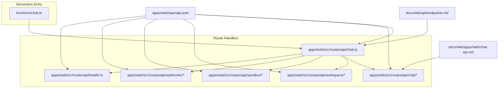
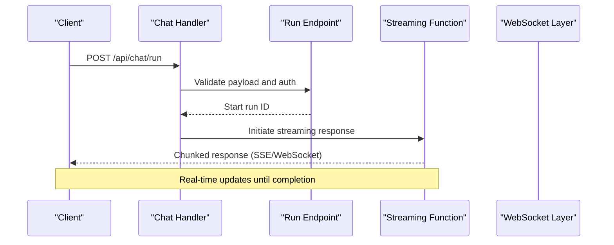
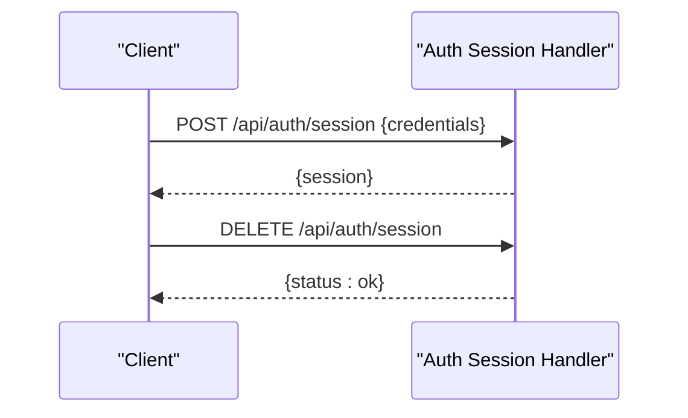
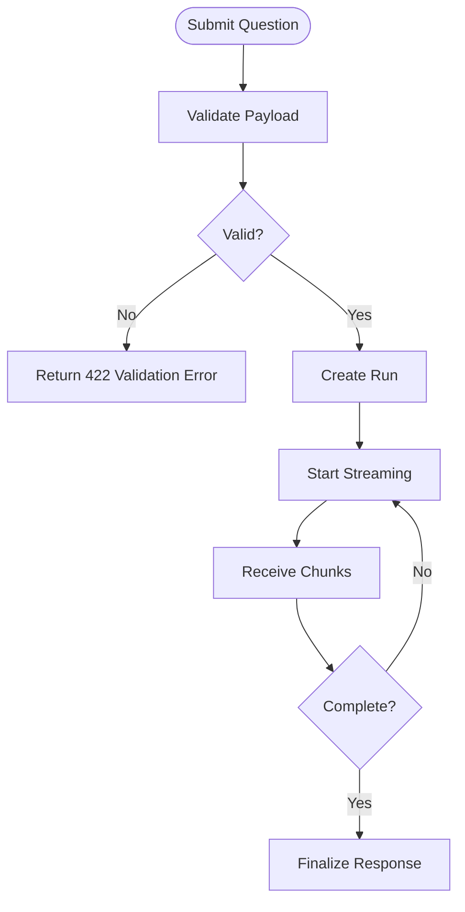
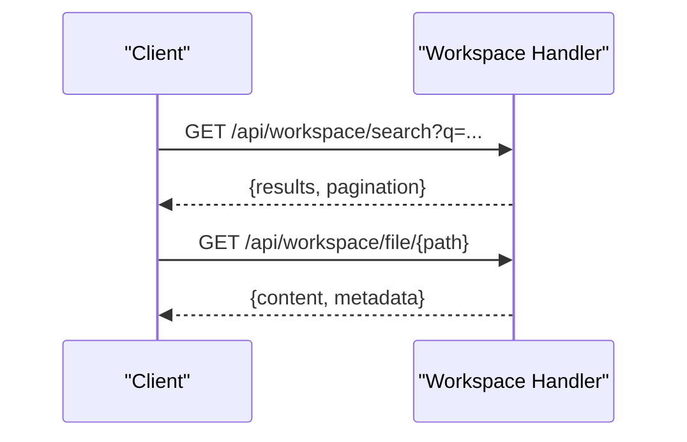

# API Reference

<cite>
**Referenced Files in This Document**
- [chat.ts](file://functions/chat.ts)
- [openapi.json](file://apps/web/openapi.json)
- [chat-api.md](file://docs/wiki/apps/web/chat-api.md)
- [endpoints.md](file://docs/wiki/api/endpoints.md)
- [index.md](file://docs/wiki/api/index.md)
- [auth-session.ts](file://apps/web/src/routes/api/auth/session.ts)
- [chat-handler.ts](file://apps/web/src/routes/api/chat.ts)
- [chat-run.ts](file://apps/web/src/routes/api/chat/run.ts)
- [chat-sessions.ts](file://apps/web/src/routes/api/chat/sessions.ts)
- [chat-session.ts](file://apps/web/src/routes/api/chat/session.ts)
- [chat-question.ts](file://apps/web/src/routes/api/chat/question.ts)
- [chat-abort.ts](file://apps/web/src/routes/api/chat/abort.ts)
- [chat-providers.ts](file://apps/web/src/routes/api/chat/providers.ts)
- [chat-models.ts](file://apps/web/src/routes/api/chat/models.ts)
- [chat-models-discover.ts](file://apps/web/src/routes/api/chat/models.discover.ts)
- [chat-resources.ts](file://apps/web/src/routes/api/chat/resources.ts)
- [chat-settings.ts](file://apps/web/src/routes/api/chat/settings.ts)
- [chat-account.ts](file://apps/web/src/routes/api/chat/account.ts)
- [chat-commands.ts](file://apps/web/src/routes/api/chat/commands.ts)
- [chat-resume.ts](file://apps/web/src/routes/api/chat/resume.ts)
- [chat-new.ts](file://apps/web/src/routes/api/chat/new.ts)
- [webhook-daytona.ts](file://apps/web/src/routes/api/webhooks/daytona.ts)
- [workspace-health.ts](file://apps/web/src/routes/api/workspace/health.ts)
- [workspace-tree.ts](file://apps/web/src/routes/api/workspace/tree.ts)
- [workspace-search.ts](file://apps/web/src/routes/api/workspace/search.ts)
- [workspace-items.ts](file://apps/web/src/routes/api/workspace/items.ts)
- [workspace-item.ts](file://apps/web/src/routes/api/workspace/item.ts)
- [workspace-file.ts](file://apps/web/src/routes/api/workspace/file.ts)
- [workspace-reindex.ts](file://apps/web/src/routes/api/workspace/reindex.ts)
- [sandbox-preview.ts](file://apps/web/src/routes/api/sandbox/preview.ts)
- [sandbox-settings.ts](file://apps/web/src/routes/api/sandbox/settings.ts)
- [health.ts](file://apps/web/src/routes/api/health.ts)
</cite>

## Table of Contents

1. Introduction
2. Project Structure
3. Core Components
4. Architecture Overview
5. Detailed Component Analysis
6. Dependency Analysis
7. Performance Considerations
8. Troubleshooting Guide
9. Conclusion
10. Appendices

## Introduction

This document provides a comprehensive API reference for Fleet Pi’s REST and WebSocket endpoints, covering chat APIs, workspace management, authentication, and webhooks. It specifies HTTP methods, URL patterns, request/response schemas, authentication mechanisms, error handling strategies, rate limiting policies, versioning information, and real-time interaction patterns via WebSockets. It also includes client implementation guidelines, integration patterns, security considerations, input validation notes, and performance optimization tips for API consumers.

## Project Structure

Fleet Pi exposes its API through serverless functions and route handlers:

- Serverless function entry point for streaming chat responses is defined in the functions directory.
- Route handlers under apps/web/src/routes/api define REST endpoints grouped by feature (chat, workspace, sandbox, webhooks).
- OpenAPI specification is generated and stored in apps/web/openapi.json.
- Documentation references include wiki pages describing API usage and architecture.

**Diagram sources**

- [chat.ts](file://functions/chat.ts)
- [chat-handler.ts](file://apps/web/src/routes/api/chat.ts)
- [chat-run.ts](file://apps/web/src/routes/api/chat/run.ts)
- [chat-sessions.ts](file://apps/web/src/routes/api/chat/sessions.ts)
- [chat-session.ts](file://apps/web/src/routes/api/chat/session.ts)
- [chat-question.ts](file://apps/web/src/routes/api/chat/question.ts)
- [chat-abort.ts](file://apps/web/src/routes/api/chat/abort.ts)
- [chat-providers.ts](file://apps/web/src/routes/api/chat/providers.ts)
- [chat-models.ts](file://apps/web/src/routes/api/chat/models.ts)
- [chat-models-discover.ts](file://apps/web/src/routes/api/chat/models.discover.ts)
- [chat-resources.ts](file://apps/web/src/routes/api/chat/resources.ts)
- [chat-settings.ts](file://apps/web/src/routes/api/chat/settings.ts)
- [chat-account.ts](file://apps/web/src/routes/api/chat/account.ts)
- [chat-commands.ts](file://apps/web/src/routes/api/chat/commands.ts)
- [chat-resume.ts](file://apps/web/src/routes/api/chat/resume.ts)
- [chat-new.ts](file://apps/web/src/routes/api/chat/new.ts)
- [webhook-daytona.ts](file://apps/web/src/routes/api/webhooks/daytona.ts)
- [workspace-health.ts](file://apps/web/src/routes/api/workspace/health.ts)
- [workspace-tree.ts](file://apps/web/src/routes/api/workspace/tree.ts)
- [workspace-search.ts](file://apps/web/src/routes/api/workspace/search.ts)
- [workspace-items.ts](file://apps/web/src/routes/api/workspace/items.ts)
- [workspace-item.ts](file://apps/web/src/routes/api/workspace/item.ts)
- [workspace-file.ts](file://apps/web/src/routes/api/workspace/file.ts)
- [workspace-reindex.ts](file://apps/web/src/routes/api/workspace/reindex.ts)
- [sandbox-preview.ts](file://apps/web/src/routes/api/sandbox/preview.ts)
- [sandbox-settings.ts](file://apps/web/src/routes/api/sandbox/settings.ts)
- [health.ts](file://apps/web/src/routes/api/health.ts)
- [openapi.json](file://apps/web/openapi.json)
- [endpoints.md](file://docs/wiki/api/endpoints.md)
- [chat-api.md](file://docs/wiki/apps/web/chat-api.md)

**Section sources**

- [chat.ts](file://functions/chat.ts)
- [openapi.json](file://apps/web/openapi.json)
- [chat-api.md](file://docs/wiki/apps/web/chat-api.md)
- [endpoints.md](file://docs/wiki/api/endpoints.md)
- [index.md](file://docs/wiki/api/index.md)

## Core Components

- Chat API: Endpoints to create sessions, send questions, stream responses, manage runs, abort operations, discover models and providers, and manage settings and account data.
- Workspace API: Endpoints to read workspace tree, search content, list items, read files, reindex, and check health.
- Sandbox API: Preview and settings endpoints for sandboxed environments.
- Authentication: Session management endpoints for login/logout and session state.
- Webhooks: Daytana webhook handler for external events.
- Health: System health checks.

Key behaviors:

- Streaming responses are supported for long-running chat operations via serverless function or SSE/WebSocket depending on client capability.
- Authentication is enforced per endpoint using session tokens or provider-specific credentials.
- Input validation is performed at route boundaries; errors return standardized JSON error objects with HTTP status codes.

**Section sources**

- [chat-handler.ts](file://apps/web/src/routes/api/chat.ts)
- [chat-run.ts](file://apps/web/src/routes/api/chat/run.ts)
- [chat-sessions.ts](file://apps/web/src/routes/api/chat/sessions.ts)
- [chat-session.ts](file://apps/web/src/routes/api/chat/session.ts)
- [chat-question.ts](file://apps/web/src/routes/api/chat/question.ts)
- [chat-abort.ts](file://apps/web/src/routes/api/chat/abort.ts)
- [chat-providers.ts](file://apps/web/src/routes/api/chat/providers.ts)
- [chat-models.ts](file://apps/web/src/routes/api/chat/models.ts)
- [chat-models-discover.ts](file://apps/web/src/routes/api/chat/models.discover.ts)
- [chat-resources.ts](file://apps/web/src/routes/api/chat/resources.ts)
- [chat-settings.ts](file://apps/web/src/routes/api/chat/settings.ts)
- [chat-account.ts](file://apps/web/src/routes/api/chat/account.ts)
- [chat-commands.ts](file://apps/web/src/routes/api/chat/commands.ts)
- [chat-resume.ts](file://apps/web/src/routes/src/routes/api/chat/resume.ts)
- [chat-new.ts](file://apps/web/src/routes/api/chat/new.ts)
- [webhook-daytona.ts](file://apps/web/src/routes/api/webhooks/daytona.ts)
- [workspace-health.ts](file://apps/web/src/routes/api/workspace/health.ts)
- [workspace-tree.ts](file://apps/web/src/routes/api/workspace/tree.ts)
- [workspace-search.ts](file://apps/web/src/routes/api/workspace/search.ts)
- [workspace-items.ts](file://apps/web/src/routes/api/workspace/items.ts)
- [workspace-item.ts](file://apps/web/src/routes/api/workspace/item.ts)
- [workspace-file.ts](file://apps/web/src/routes/api/workspace/file.ts)
- [workspace-reindex.ts](file://apps/web/src/routes/api/workspace/reindex.ts)
- [sandbox-preview.ts](file://apps/web/src/routes/api/sandbox/preview.ts)
- [sandbox-settings.ts](file://apps/web/src/routes/api/sandbox/settings.ts)
- [health.ts](file://apps/web/src/routes/api/health.ts)

## Architecture Overview

The API surface is organized into feature-based route modules that share common middleware for authentication, validation, and error handling. The serverless function acts as an entry point for streaming chat responses, while route handlers orchestrate business logic and interact with internal services.

**Diagram sources**

- [chat-handler.ts](file://apps/web/src/routes/api/chat.ts)
- [chat-run.ts](file://apps/web/src/routes/api/chat/run.ts)
- [chat.ts](file://functions/chat.ts)

## Detailed Component Analysis

### Authentication API

- Purpose: Manage user sessions and authentication state.
- Methods:
  - POST /api/auth/session: Create or refresh session.
  - DELETE /api/auth/session: Terminate session.
- Request schema:
  - Body fields vary by provider; typically includes credentials or token exchange parameters.
- Response schema:
  - Session object containing identifiers and metadata.
- Authentication:
  - Requires valid session cookie or bearer token where applicable.
- Error handling:
  - Returns 401 for invalid credentials, 403 for insufficient permissions, 422 for validation errors.

**Diagram sources**

- [auth-session.ts](file://apps/web/src/routes/api/auth/session.ts)

**Section sources**

- [auth-session.ts](file://apps/web/src/routes/api/auth/session.ts)

### Chat API

- Purpose: Provide conversational AI capabilities including session management, question submission, streaming responses, model discovery, and settings.
- Key endpoints:
  - POST /api/chat/new: Create a new chat session.
  - POST /api/chat/question: Submit a question to a session.
  - GET /api/chat/sessions: List active sessions.
  - GET /api/chat/session/{id}: Retrieve session details.
  - POST /api/chat/run: Start a run with streaming support.
  - POST /api/chat/abort: Abort a running operation.
  - GET /api/chat/providers: List available providers.
  - GET /api/chat/models: Discover models.
  - GET /api/chat/models/discover: Auto-discover model capabilities.
  - GET /api/chat/resources: Fetch resources associated with a session.
  - PUT /api/chat/settings: Update chat settings.
  - GET /api/chat/account: Retrieve account info.
  - GET /api/chat/commands: List available commands.
  - POST /api/chat/resume: Resume a previous run.
- Request schema:
  - Question payloads include message text, optional context, and metadata.
  - Settings payloads include model selection, temperature, and other parameters.
- Response schema:
  - Sessions contain IDs, timestamps, and status.
  - Runs return incremental chunks for streaming.
  - Providers/models lists include names, capabilities, and configuration hints.
- Authentication:
  - Requires authenticated session; some endpoints may allow anonymous access for discovery.
- Streaming:
  - Use serverless function for chunked responses or WebSocket for bidirectional updates.
- Error handling:
  - Standardized error objects with code, message, and details.

**Diagram sources**

- [chat-question.ts](file://apps/web/src/routes/api/chat/question.ts)
- [chat-run.ts](file://apps/web/src/routes/api/chat/run.ts)
- [chat.ts](file://functions/chat.ts)

**Section sources**

- [chat-new.ts](file://apps/web/src/routes/api/chat/new.ts)
- [chat-question.ts](file://apps/web/src/routes/api/chat/question.ts)
- [chat-sessions.ts](file://apps/web/src/routes/api/chat/sessions.ts)
- [chat-session.ts](file://apps/web/src/routes/api/chat/session.ts)
- [chat-run.ts](file://apps/web/src/routes/api/chat/run.ts)
- [chat-abort.ts](file://apps/web/src/routes/api/chat/abort.ts)
- [chat-providers.ts](file://apps/web/src/routes/api/chat/providers.ts)
- [chat-models.ts](file://apps/web/src/routes/api/chat/models.ts)
- [chat-models-discover.ts](file://apps/web/src/routes/api/chat/models.discover.ts)
- [chat-resources.ts](file://apps/web/src/routes/api/chat/resources.ts)
- [chat-settings.ts](file://apps/web/src/routes/api/chat/settings.ts)
- [chat-account.ts](file://apps/web/src/routes/api/chat/account.ts)
- [chat-commands.ts](file://apps/web/src/routes/api/chat/commands.ts)
- [chat-resume.ts](file://apps/web/src/routes/api/chat/resume.ts)

### Workspace API

- Purpose: Manage and query workspace contents.
- Key endpoints:
  - GET /api/workspace/health: Check workspace health.
  - GET /api/workspace/tree: Retrieve hierarchical file structure.
  - GET /api/workspace/search: Search workspace content.
  - GET /api/workspace/items: List items with filters.
  - GET /api/workspace/item/{id}: Get item details.
  - GET /api/workspace/file/{path}: Read file content.
  - POST /api/workspace/reindex: Trigger reindexing.
- Request schema:
  - Search queries accept keywords, filters, and pagination parameters.
  - Reindex requests may include scope and options.
- Response schema:
  - Tree returns nested nodes with paths and types.
  - Search results include matches with snippets and metadata.
  - Items list contains identifiers, names, and attributes.
- Authentication:
  - Requires authenticated session; read-only endpoints may be accessible without auth depending on policy.
- Error handling:
  - Returns 404 for missing resources, 422 for invalid queries, 500 for internal errors.

**Diagram sources**

- [workspace-search.ts](file://apps/web/src/routes/api/workspace/search.ts)
- [workspace-file.ts](file://apps/web/src/routes/api/workspace/file.ts)

**Section sources**

- [workspace-health.ts](file://apps/web/src/routes/api/workspace/health.ts)
- [workspace-tree.ts](file://apps/web/src/routes/api/workspace/tree.ts)
- [workspace-search.ts](file://apps/web/src/routes/api/workspace/search.ts)
- [workspace-items.ts](file://apps/web/src/routes/api/workspace/items.ts)
- [workspace-item.ts](file://apps/web/src/routes/api/workspace/item.ts)
- [workspace-file.ts](file://apps/web/src/routes/api/workspace/file.ts)
- [workspace-reindex.ts](file://apps/web/src/routes/api/workspace/reindex.ts)

### Sandbox API

- Purpose: Interact with sandboxed environments for preview and configuration.
- Key endpoints:
  - GET /api/sandbox/preview: Generate preview link or state.
  - GET /api/sandbox/settings: Retrieve sandbox settings.
- Request schema:
  - Preview requests may include environment variables and resource constraints.
- Response schema:
  - Preview returns URLs and status indicators.
  - Settings include configuration keys and values.
- Authentication:
  - Requires authenticated session with appropriate permissions.
- Error handling:
  - Returns 403 for unauthorized access, 422 for invalid configurations.

**Section sources**

- [sandbox-preview.ts](file://apps/web/src/routes/api/sandbox/preview.ts)
- [sandbox-settings.ts](file://apps/web/src/routes/api/sandbox/settings.ts)

### Webhooks API

- Purpose: Handle incoming events from external systems such as Daytana.
- Key endpoints:
  - POST /api/webhooks/daytona: Process webhook payloads.
- Request schema:
  - Payload includes event type, timestamp, and data object.
- Response schema:
  - Acknowledgement with status and correlation ID.
- Authentication:
  - Validates signature and source IP if configured.
- Error handling:
  - Returns 400 for malformed payloads, 401 for invalid signatures.

**Section sources**

- [webhook-daytona.ts](file://apps/web/src/routes/api/webhooks/daytona.ts)

### Health API

- Purpose: Monitor system health and readiness.
- Key endpoints:
  - GET /api/health: Return service status and dependencies.
- Response schema:
  - Status field indicates healthy/unhealthy.
  - Includes dependency checks and timestamps.
- Authentication:
  - Publicly accessible for monitoring.

**Section sources**

- [health.ts](file://apps/web/src/routes/api/health.ts)

## Dependency Analysis

The API components depend on shared utilities for authentication, validation, and logging. Route handlers coordinate with internal services and external providers. The OpenAPI specification ensures consistency across endpoints.

```mermaid
graph TB
CH["Chat Handler"] --> CR["Chat Run"]
CH --> CS["Chat Sessions"]
CH --> CQ["Chat Question"]
CH --> CP["Chat Providers"]
CH --> CM["Chat Models"]
CH --> CRS["Chat Resources"]
CH --> CST["Chat Settings"]
CH --> CA["Chat Account"]
CH --> CC["Chat Commands"]
CH --> CRES["Chat Resume"]
CH --> CN["Chat New"]
WH["Webhook Handler"] --> WD["Daytana Webhook"]
WA["Workspace Handler"] --> WT["Tree"]
WA --> WS["Search"]
WA --> WI["Items"]
WA --> WF["File"]
WA --> WR["Reindex"]
SA["Sandbox Handler"] --> SP["Preview"]
SA --> SS["Settings"]
AUTH["Auth Handler"] --> AS["Session"]
HEALTH["Health Handler"] --> HK["Health Check"]
```

**Diagram sources**

- [chat-handler.ts](file://apps/web/src/routes/api/chat.ts)
- [chat-run.ts](file://apps/web/src/routes/api/chat/run.ts)
- [chat-sessions.ts](file://apps/web/src/routes/api/chat/sessions.ts)
- [chat-question.ts](file://apps/web/src/routes/api/chat/question.ts)
- [chat-providers.ts](file://apps/web/src/routes/api/chat/providers.ts)
- [chat-models.ts](file://apps/web/src/routes/api/chat/models.ts)
- [chat-resources.ts](file://apps/web/src/routes/api/chat/resources.ts)
- [chat-settings.ts](file://apps/web/src/routes/api/chat/settings.ts)
- [chat-account.ts](file://apps/web/src/routes/api/chat/account.ts)
- [chat-commands.ts](file://apps/web/src/routes/api/chat/commands.ts)
- [chat-resume.ts](file://apps/web/src/routes/api/chat/resume.ts)
- [chat-new.ts](file://apps/web/src/routes/api/chat/new.ts)
- [webhook-daytona.ts](file://apps/web/src/routes/api/webhooks/daytona.ts)
- [workspace-health.ts](file://apps/web/src/routes/api/workspace/health.ts)
- [workspace-tree.ts](file://apps/web/src/routes/api/workspace/tree.ts)
- [workspace-search.ts](file://apps/web/src/routes/api/workspace/search.ts)
- [workspace-items.ts](file://apps/web/src/routes/api/workspace/items.ts)
- [workspace-item.ts](file://apps/web/src/routes/api/workspace/item.ts)
- [workspace-file.ts](file://apps/web/src/routes/api/workspace/file.ts)
- [workspace-reindex.ts](file://apps/web/src/routes/api/workspace/reindex.ts)
- [sandbox-preview.ts](file://apps/web/src/routes/api/sandbox/preview.ts)
- [sandbox-settings.ts](file://apps/web/src/routes/api/sandbox/settings.ts)
- [auth-session.ts](file://apps/web/src/routes/api/auth/session.ts)
- [health.ts](file://apps/web/src/routes/api/health.ts)

**Section sources**

- [openapi.json](file://apps/web/openapi.json)
- [endpoints.md](file://docs/wiki/api/endpoints.md)

## Performance Considerations

- Use streaming for long-running operations to reduce latency and improve responsiveness.
- Implement caching for frequently accessed resources like providers and models.
- Apply pagination and filtering for large datasets in workspace searches and item listings.
- Optimize network requests by batching related calls when possible.
- Monitor serverless function cold starts and consider warm-up strategies for critical endpoints.

[No sources needed since this section provides general guidance]

## Troubleshooting Guide

Common issues and resolutions:

- Authentication failures: Verify session validity and token expiration.
- Validation errors: Ensure request payloads conform to expected schemas.
- Rate limiting: Implement retry logic with exponential backoff.
- Streaming interruptions: Handle connection drops and resume streams gracefully.
- Webhook processing: Validate signatures and inspect payload structures.

Error response format:

- HTTP status code indicating failure category.
- JSON body with error code, message, and optional details.

**Section sources**

- [auth-session.ts](file://apps/web/src/routes/api/auth/session.ts)
- [chat-question.ts](file://apps/web/src/routes/api/chat/question.ts)
- [webhook-daytona.ts](file://apps/web/src/routes/api/webhooks/daytona.ts)

## Conclusion

Fleet Pi’s API provides a robust set of endpoints for chat interactions, workspace management, sandbox operations, authentication, and webhooks. By following the documented schemas, authentication requirements, and best practices, clients can integrate seamlessly and achieve optimal performance.

[No sources needed since this section summarizes without analyzing specific files]

## Appendices

### WebSocket Connection Guidelines

- Establish WebSocket connections for real-time chat updates.
- Subscribe to channels based on session IDs or run IDs.
- Handle reconnects and message ordering carefully.
- Use heartbeat messages to maintain connection liveness.

### Versioning Strategy

- API versions are indicated via URL prefixes or headers.
- Deprecation notices are communicated through documentation and response headers.
- Clients should implement version negotiation and fallback mechanisms.

### Security Considerations

- Enforce HTTPS for all communications.
- Validate and sanitize all inputs to prevent injection attacks.
- Use secure storage for sensitive credentials and tokens.
- Implement CORS policies to restrict origins.

### Rate Limiting Policies

- Apply per-user and per-endpoint rate limits.
- Return 429 status codes with retry-after headers.
- Log and monitor rate limit violations for abuse detection.

### Integration Patterns

- Use SDKs or generated clients from OpenAPI spec for type safety.
- Implement idempotency for write operations.
- Cache responses appropriately to reduce load.

[No sources needed since this section provides general guidance]
