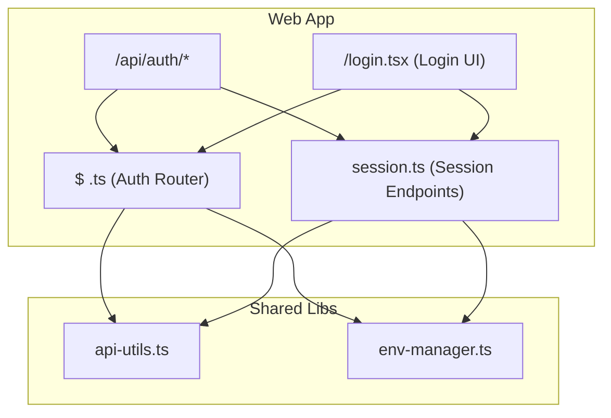
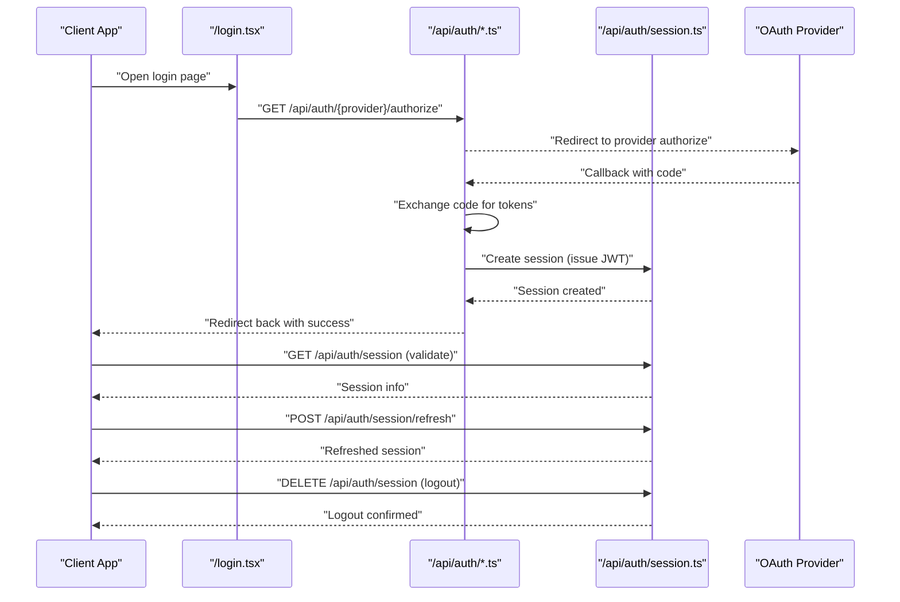
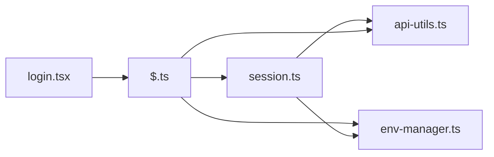

# Authentication API

<cite>
**Referenced Files in This Document**
- [auth.ts](file://apps/web/src/routes/api/auth/$.ts)
- [session.ts](file://apps/web/src/routes/api/auth/session.ts)
- [login.tsx](file://apps/web/src/routes/login.tsx)
- [api-utils.ts](file://apps/web/src/lib/api-utils.ts)
- [env-manager.ts](file://apps/web/src/lib/env-manager.ts)
- [openapi.json](file://apps/web/openapi.json)
</cite>

## Table of Contents

1. [Introduction](#introduction)
2. [Project Structure](#project-structure)
3. [Core Components](#core-components)
4. [Architecture Overview](#architecture-overview)
5. [Detailed Component Analysis](#detailed-component-analysis)
6. [Dependency Analysis](#dependency-analysis)
7. [Performance Considerations](#performance-considerations)
8. [Troubleshooting Guide](#troubleshooting-guide)
9. [Conclusion](#conclusion)
10. [Appendices](#appendices)

## Introduction

This document provides comprehensive API documentation for Fleet Pi’s Authentication endpoints. It covers HTTP methods, URL patterns, request/response schemas, and flows for user authentication, session management, and account operations. It also documents OAuth integration patterns, JWT token handling, security best practices, error handling strategies, and client implementation guidelines. The goal is to enable both frontend and backend clients to integrate securely and reliably with the authentication system.

## Project Structure

Authentication-related functionality is implemented primarily under the web application routes:

- API routes for authentication and sessions are located under apps/web/src/routes/api/auth.
- The login UI route is located under apps/web/src/routes/login.tsx.
- Shared utilities for API calls and environment configuration support authentication flows.

**Diagram sources**

- [auth.ts](file://apps/web/src/routes/api/auth/$.ts)
- [session.ts](file://apps/web/src/routes/api/auth/session.ts)
- [login.tsx](file://apps/web/src/routes/login.tsx)
- [api-utils.ts](file://apps/web/src/lib/api-utils.ts)
- [env-manager.ts](file://apps/web/src/lib/env-manager.ts)

**Section sources**

- [auth.ts](file://apps/web/src/routes/api/auth/$.ts)
- [session.ts](file://apps/web/src/routes/api/auth/session.ts)
- [login.tsx](file://apps/web/src/routes/login.tsx)
- [api-utils.ts](file://apps/web/src/lib/api-utils.ts)
- [env-manager.ts](file://apps/web/src/lib/env-manager.ts)

## Core Components

- Auth Router ($ .ts): Centralizes authentication entry points such as provider redirects, callbacks, and common auth helpers.
- Session Endpoints (session.ts): Manages session lifecycle including creation, validation, refresh, and termination.
- Login UI (login.tsx): Orchestrates the login flow from the browser, invoking provider-specific endpoints and handling tokens.
- API Utilities (api-utils.ts): Provides standardized HTTP wrappers, headers, and error normalization used by auth endpoints.
- Environment Manager (env-manager.ts): Supplies runtime configuration such as OAuth provider settings and token policies.

Key responsibilities:

- Provider routing and callback handling
- Session token issuance and validation
- Secure cookie or bearer token handling
- Error normalization and consistent responses
- Configuration-driven behavior for multiple providers

**Section sources**

- [auth.ts](file://apps/web/src/routes/api/auth/$.ts)
- [session.ts](file://apps/web/src/routes/api/auth/session.ts)
- [login.tsx](file://apps/web/src/routes/login.tsx)
- [api-utils.ts](file://apps/web/src/lib/api-utils.ts)
- [env-manager.ts](file://apps/web/src/lib/env-manager.ts)

## Architecture Overview

The authentication architecture follows a standard OAuth/JWT pattern:

- Clients initiate login via the login UI or directly call auth endpoints.
- The server redirects users to configured OAuth providers.
- Upon successful provider authentication, the server issues a session token (JWT).
- Subsequent requests carry the token in cookies or Authorization headers.
- Session endpoints manage token refresh and logout.

**Diagram sources**

- [login.tsx](file://apps/web/src/routes/login.tsx)
- [auth.ts](file://apps/web/src/routes/api/auth/$.ts)
- [session.ts](file://apps/web/src/routes/api/auth/session.ts)

## Detailed Component Analysis

### Auth Router (/api/auth/*)

Responsibilities:

- Route provider-specific authorization URLs
- Handle provider callbacks and exchange codes for tokens
- Normalize errors and redirect clients appropriately
- Integrate with session creation logic

HTTP Methods and Patterns:

- GET /api/auth/{provider}/authorize: Initiates OAuth authorization with the specified provider.
- GET /api/auth/{provider}/callback: Handles provider callback; exchanges code for tokens and creates session.

Request/Response Schemas:

- Authorize Request:
  - Query parameters: provider (string), redirect_uri (string), state (string)
- Callback Response:
  - Redirects to client-provided redirect_uri with success or error parameters
  - On success, sets secure session cookies or returns a token payload depending on client type

Error Handling:

- Invalid provider or missing parameters return 400-level errors
- Provider errors propagate with normalized messages
- State mismatch or CSRF protection failures return 401/403

Security Best Practices:

- Enforce strict redirect_uri validation against allowed origins
- Use PKCE where supported by providers
- Validate state parameter to prevent CSRF

**Section sources**

- [auth.ts](file://apps/web/src/routes/api/auth/$.ts)

### Session Management (/api/auth/session.ts)

Responsibilities:

- Create, validate, refresh, and terminate sessions
- Manage JWT lifecycle and secure storage
- Provide current user profile information

HTTP Methods and Patterns:

- POST /api/auth/session: Create session after successful provider authentication
- GET /api/auth/session: Retrieve current session details
- POST /api/auth/session/refresh: Refresh session token
- DELETE /api/auth/session: Terminate session (logout)

Request/Response Schemas:

- Create Session Request:
  - Body: { code: string, provider: string, redirect_uri: string }
  - Headers: Content-Type: application/json
- Create Session Response:
  - Status: 201 Created
  - Body: { accessToken: string, refreshToken?: string, expiresIn: number }
  - Cookies: Set secure HttpOnly cookies if applicable
- Get Session Response:
  - Status: 200 OK
  - Body: { user: UserProfile, permissions: string[], expiresAt: string }
- Refresh Session Response:
  - Status: 200 OK
  - Body: { accessToken: string, expiresIn: number }
- Logout Response:
  - Status: 204 No Content

User Profile Schema:

- id: string (unique identifier)
- email: string (verified email address)
- name: string (display name)
- avatar_url: string (profile image URL)
- roles: string[] (user roles and permissions)

Error Handling:

- Invalid or expired tokens return 401 Unauthorized
- Missing required fields return 400 Bad Request
- Provider communication failures return 502 Bad Gateway
- Rate limiting applied to sensitive endpoints

Security Best Practices:

- Use short-lived access tokens with refresh tokens
- Implement token rotation on refresh
- Secure cookies with SameSite=Strict and Secure flags
- Validate all inputs and sanitize outputs

**Section sources**

- [session.ts](file://apps/web/src/routes/api/auth/session.ts)

### Login UI (/login.tsx)

Responsibilities:

- Present login options for different providers
- Initiate OAuth flows and handle redirects
- Store and manage tokens securely in the browser
- Display error messages and retry mechanisms

Flow:

- User selects a provider
- Frontend calls /api/auth/{provider}/authorize
- Browser redirects to provider for authentication
- Provider redirects back to callback endpoint
- Frontend handles success and stores session data

Client Implementation Guidelines:

- Use HTTPS for all authentication requests
- Store tokens in memory or secure storage
- Implement automatic token refresh before expiration
- Handle network errors gracefully with retry logic

**Section sources**

- [login.tsx](file://apps/web/src/routes/login.tsx)

### API Utilities and Environment Configuration

API Utilities:

- Standardized HTTP client with error handling
- Automatic header injection (Authorization, Content-Type)
- Request/response interceptors for logging and debugging

Environment Configuration:

- OAuth provider configurations (client IDs, secrets, scopes)
- Token expiration policies and refresh intervals
- Allowed redirect URIs and CORS settings

**Section sources**

- [api-utils.ts](file://apps/web/src/lib/api-utils.ts)
- [env-manager.ts](file://apps/web/src/lib/env-manager.ts)

## Dependency Analysis

The authentication system has clear dependency boundaries:

- Auth Router depends on environment configuration and session management
- Session endpoints depend on JWT libraries and secure storage
- Login UI depends on API utilities for HTTP requests
- All components use shared error handling and logging utilities

**Diagram sources**

- [login.tsx](file://apps/web/src/routes/login.tsx)
- [auth.ts](file://apps/web/src/routes/api/auth/$.ts)
- [session.ts](file://apps/web/src/routes/api/auth/session.ts)
- [api-utils.ts](file://apps/web/src/lib/api-utils.ts)
- [env-manager.ts](file://apps/web/src/lib/env-manager.ts)

**Section sources**

- [auth.ts](file://apps/web/src/routes/api/auth/$.ts)
- [session.ts](file://apps/web/src/routes/api/auth/session.ts)
- [login.tsx](file://apps/web/src/routes/login.tsx)
- [api-utils.ts](file://apps/web/src/lib/api-utils.ts)
- [env-manager.ts](file://apps/web/src/lib/env-manager.ts)

## Performance Considerations

- Use connection pooling for database operations in session validation
- Implement caching for frequently accessed user profiles
- Apply rate limiting to prevent brute force attacks
- Optimize JWT size by including only essential claims
- Use streaming for large profile updates

## Troubleshooting Guide

Common Issues and Solutions:

- Invalid Redirect URI: Ensure redirect_uri matches exactly with registered values
- Token Expiration: Implement automatic refresh before token expiry
- CORS Errors: Configure allowed origins and credentials properly
- Provider Errors: Check provider status and client configuration
- Session Mismatch: Clear browser storage and retry authentication

Debugging Steps:

- Enable detailed logging for authentication flows
- Verify OAuth client configuration with providers
- Test endpoints using curl or Postman
- Check browser console for JavaScript errors
- Review server logs for authentication failures

**Section sources**

- [auth.ts](file://apps/web/src/routes/api/auth/$.ts)
- [session.ts](file://apps/web/src/routes/api/auth/session.ts)

## Conclusion

Fleet Pi’s authentication system provides a robust, secure foundation for user authentication and session management. By following the documented API specifications and security best practices, developers can implement reliable authentication flows that support multiple OAuth providers and maintain high security standards. The modular architecture allows for easy extension and maintenance while ensuring consistent user experiences across different client applications.

## Appendices

### OpenAPI Specification Reference

For complete API schema definitions, refer to the generated OpenAPI specification file which contains detailed endpoint definitions, request/response schemas, and security schemes.

**Section sources**

- [openapi.json](file://apps/web/openapi.json)

### Security Checklist

- [ ] Use HTTPS for all authentication endpoints
- [ ] Implement proper input validation and sanitization
- [ ] Configure secure cookie settings (HttpOnly, Secure, SameSite)
- [ ] Use short-lived access tokens with refresh tokens
- [ ] Implement rate limiting and brute force protection
- [ ] Validate redirect URIs against allowlists
- [ ] Log authentication events without sensitive data
- [ ] Regularly rotate secrets and tokens
- [ ] Monitor for suspicious authentication patterns
- [ ] Keep dependencies updated with security patches

[No sources needed since this section provides general guidance]
