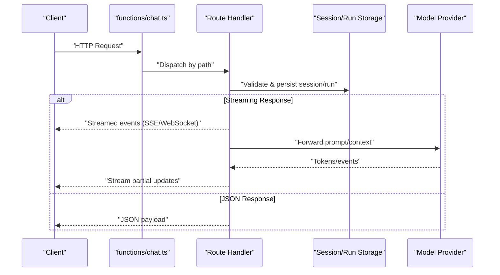
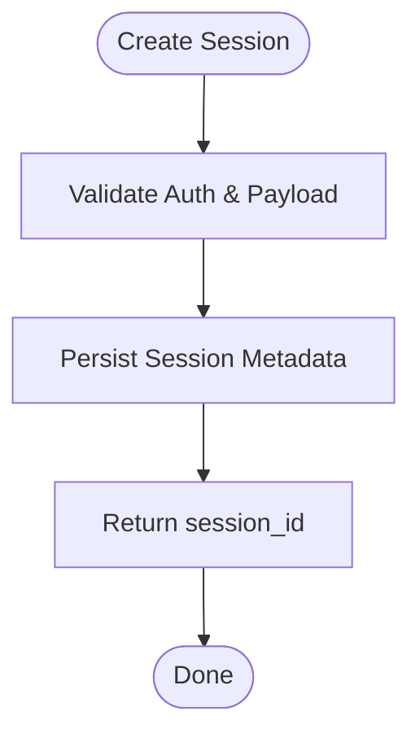
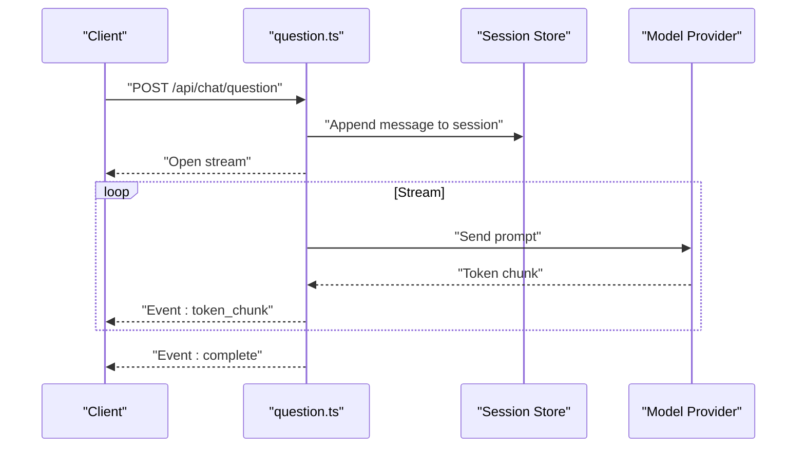
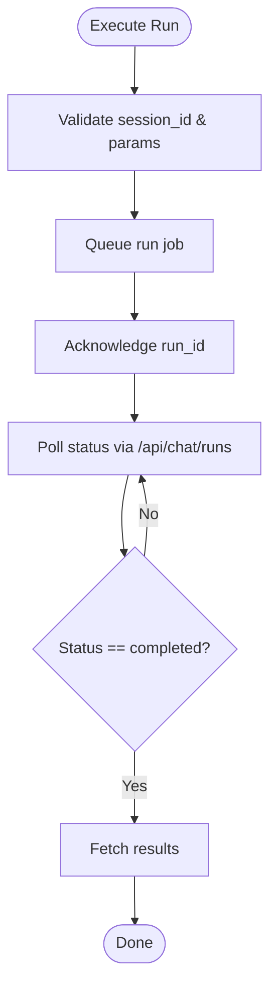
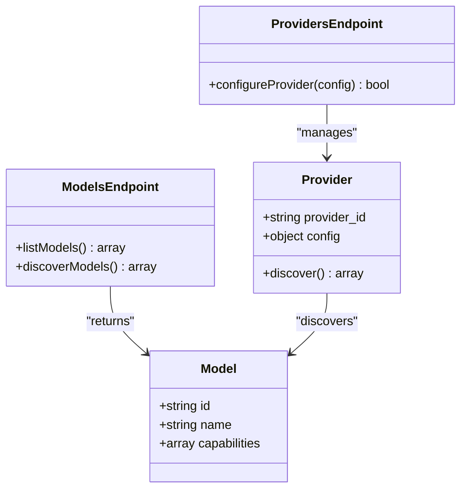
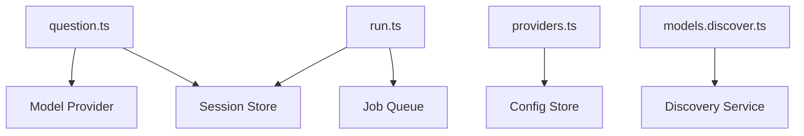

# Chat API

<cite>
**Referenced Files in This Document**
- [chat.ts](file://functions/chat.ts)
- [chat.ts](file://apps/web/src/routes/api/chat.ts)
- [new.ts](file://apps/web/src/routes/api/chat/new.ts)
- [question.ts](file://apps/web/src/routes/api/chat/question.ts)
- [run.ts](file://apps/web/src/routes/api/chat/run.ts)
- [runs.ts](file://apps/web/src/routes/api/chat/runs.ts)
- [sessions.ts](file://apps/web/src/routes/api/chat/sessions.ts)
- [session.ts](file://apps/web/src/routes/api/chat/session.ts)
- [resume.ts](file://apps/web/src/routes/api/chat/resume.ts)
- [abort.ts](file://apps/web/src/routes/api/chat/abort.ts)
- [models.ts](file://apps/web/src/routes/api/chat/models.ts)
- [models.discover.ts](file://apps/web/src/routes/api/chat/models.discover.ts)
- [providers.ts](file://apps/web/src/routes/api/chat/providers.ts)
- [commands.ts](file://apps/web/src/routes/api/chat/commands.ts)
- [resources.ts](file://apps/web/src/routes/api/chat/resources.ts)
- [provenance.ts](file://apps/web/src/routes/api/chat/provenance.ts)
- [account.ts](file://apps/web/src/routes/api/chat/account.ts)
- [settings.ts](file://apps/web/src/routes/api/chat/settings.ts)
- [chat-api.md](file://docs/wiki/apps/web/chat-api.md)
- [endpoints.md](file://docs/wiki/api/endpoints.md)
- [api.md](file://docs/api.md)
</cite>

## Table of Contents

1. [Introduction](#introduction)
2. [Project Structure](#project-structure)
3. [Core Components](#core-components)
4. [Architecture Overview](#architecture-overview)
5. [Detailed Component Analysis](#detailed-component-analysis)
6. [Dependency Analysis](#dependency-analysis)
7. [Performance Considerations](#performance-considerations)
8. [Troubleshooting Guide](#troubleshooting-guide)
9. [Conclusion](#conclusion)
10. [Appendices](#appendices)

## Introduction

This document provides comprehensive API documentation for Fleet Pi’s Chat API, covering HTTP endpoints and WebSocket interactions for chat sessions, messages, runs, model discovery, and provider configuration. It explains request/response schemas, authentication methods, error handling strategies, rate limiting policies, security considerations, input validation, and performance optimization tips. The goal is to enable both frontend and backend integrators to implement robust chat experiences with real-time streaming and reliable session management.

## Project Structure

The Chat API is implemented as a set of route handlers under the web application’s API routes, with a serverless function entry point for chat operations. Key files include:

- Serverless function entry for chat: functions/chat.ts
- Route handlers for chat endpoints: apps/web/src/routes/api/chat/*
- Documentation references: docs/wiki/apps/web/chat-api.md, docs/wiki/api/endpoints.md, docs/api.md

```mermaid
graph TB
subgraph "Serverless Entry"
F["functions/chat.ts"]
end
subgraph "API Routes"
R_NEW["apps/web/src/routes/api/chat/new.ts"]
R_Q["apps/web/src/routes/api/chat/question.ts"]
R_RUN["apps/web/src/routes/api/chat/run.ts"]
R_RUNS["apps/web/src/routes/api/chat/runs.ts"]
R_SESSIONS["apps/web/src/routes/api/chat/sessions.ts"]
R_SESSION["apps/web/src/routes/api/chat/session.ts"]
R_RESUME["apps/web/src/routes/api/chat/resume.ts"]
R_ABORT["apps/web/src/routes/api/chat/abort.ts"]
R_MODELS["apps/web/src/routes/api/chat/models.ts"]
R_MODELS_DISCOVER["apps/web/src/routes/api/chat/models.discover.ts"]
R_PROVIDERS["apps/web/src/routes/api/chat/providers.ts"]
R_COMMANDS["apps/web/src/routes/api/chat/commands.ts"]
R_RESOURCES["apps/web/src/routes/api/chat/resources.ts"]
R_PROVENANCE["apps/web/src/routes/api/chat/provenance.ts"]
R_ACCOUNT["apps/web/src/routes/api/chat/account.ts"]
R_SETTINGS["apps/web/src/routes/api/chat/settings.ts"]
end
F --> R_NEW
F --> R_Q
F --> R_RUN
F --> R_RUNS
F --> R_SESSIONS
F --> R_SESSION
F --> R_RESUME
F --> R_ABORT
F --> R_MODELS
F --> R_MODELS_DISCOVER
F --> R_PROVIDERS
F --> R_COMMANDS
F --> R_RESOURCES
F --> R_PROVENANCE
F --> R_ACCOUNT
F --> R_SETTINGS
```

**Diagram sources**

- [chat.ts](file://functions/chat.ts)
- [new.ts](file://apps/web/src/routes/api/chat/new.ts)
- [question.ts](file://apps/web/src/routes/api/chat/question.ts)
- [run.ts](file://apps/web/src/routes/api/chat/run.ts)
- [runs.ts](file://apps/web/src/routes/api/chat/runs.ts)
- [sessions.ts](file://apps/web/src/routes/api/chat/sessions.ts)
- [session.ts](file://apps/web/src/routes/api/chat/session.ts)
- [resume.ts](file://apps/web/src/routes/api/chat/resume.ts)
- [abort.ts](file://apps/web/src/routes/api/chat/abort.ts)
- [models.ts](file://apps/web/src/routes/api/chat/models.ts)
- [models.discover.ts](file://apps/web/src/routes/api/chat/models.discover.ts)
- [providers.ts](file://apps/web/src/routes/api/chat/providers.ts)
- [commands.ts](file://apps/web/src/routes/api/chat/commands.ts)
- [resources.ts](file://apps/web/src/routes/api/chat/resources.ts)
- [provenance.ts](file://apps/web/src/routes/api/chat/provenance.ts)
- [account.ts](file://apps/web/src/routes/api/chat/account.ts)
- [settings.ts](file://apps/web/src/routes/api/chat/settings.ts)

**Section sources**

- [chat.ts](file://functions/chat.ts)
- [chat-api.md](file://docs/wiki/apps/web/chat-api.md)
- [endpoints.md](file://docs/wiki/api/endpoints.md)
- [api.md](file://docs/api.md)

## Core Components

- Chat Session Management: Create, list, retrieve, resume, and abort sessions.
- Message Handling: Send questions/messages and receive streamed responses.
- Run Execution: Execute and manage runs associated with chat sessions.
- Model Discovery and Provider Configuration: Discover available models and configure providers.
- Auxiliary Endpoints: Commands, resources, provenance, account, settings.

Authentication typically uses bearer tokens or session cookies depending on deployment context. Input validation is enforced per endpoint, and errors follow consistent JSON structures. Rate limiting may be applied at the gateway or per-route level.

**Section sources**

- [chat-api.md](file://docs/wiki/apps/web/chat-api.md)
- [endpoints.md](file://docs/wiki/api/endpoints.md)
- [api.md](file://docs/api.md)

## Architecture Overview

The Chat API follows a modular route-based architecture where each handler encapsulates a specific operation. Requests enter through the serverless function and are dispatched to the appropriate route handler. Responses can be JSON payloads or streamed events over HTTP or WebSocket.

**Diagram sources**

- [chat.ts](file://functions/chat.ts)
- [question.ts](file://apps/web/src/routes/api/chat/question.ts)
- [run.ts](file://apps/web/src/routes/api/chat/run.ts)

## Detailed Component Analysis

### Chat Sessions

- Create Session: POST /api/chat/new
  - Purpose: Initialize a new chat session with metadata and initial context.
  - Authentication: Bearer token or session cookie.
  - Request Schema: { user_id, title?, system_prompt?, model_id? }
  - Response Schema: { session_id, created_at, status }
- List Sessions: GET /api/chat/sessions
  - Purpose: Retrieve paginated list of sessions for the authenticated user.
  - Response Schema: { sessions: [{ id, title, created_at, updated_at }] }
- Get Session: GET /api/chat/session/:id
  - Purpose: Retrieve details of a specific session.
  - Response Schema: { id, title, messages_count, created_at, updated_at }
- Resume Session: POST /api/chat/resume
  - Purpose: Resume an existing session with optional new context.
  - Request Schema: { session_id, context? }
  - Response Schema: { session_id, resumed_at }
- Abort Session: POST /api/chat/abort
  - Purpose: Abort an active run within a session.
  - Request Schema: { session_id, run_id? }
  - Response Schema: { aborted: boolean }

**Diagram sources**

- [new.ts](file://apps/web/src/routes/api/chat/new.ts)
- [sessions.ts](file://apps/web/src/routes/api/chat/sessions.ts)
- [session.ts](file://apps/web/src/routes/api/chat/session.ts)
- [resume.ts](file://apps/web/src/routes/api/chat/resume.ts)
- [abort.ts](file://apps/web/src/routes/api/chat/abort.ts)

**Section sources**

- [new.ts](file://apps/web/src/routes/api/chat/new.ts)
- [sessions.ts](file://apps/web/src/routes/api/chat/sessions.ts)
- [session.ts](file://apps/web/src/routes/api/chat/session.ts)
- [resume.ts](file://apps/web/src/routes/api/chat/resume.ts)
- [abort.ts](file://apps/web/src/routes/api/chat/abort.ts)

### Messages and Streaming

- Send Question: POST /api/chat/question
  - Purpose: Send a message to the current session and receive streamed responses.
  - Authentication: Bearer token or session cookie.
  - Request Schema: { session_id, content, model_id?, options? }
  - Response: Streamed events (SSE/WebSocket) with chunks of text and metadata.
- WebSocket Connection: ws://.../api/chat/ws
  - Purpose: Establish a persistent connection for real-time chat.
  - Events: message_sent, message_received, token_stream, error, session_updated.

**Diagram sources**

- [question.ts](file://apps/web/src/routes/api/chat/question.ts)

**Section sources**

- [question.ts](file://apps/web/src/routes/api/chat/question.ts)

### Runs

- Execute Run: POST /api/chat/run
  - Purpose: Execute a background run linked to a session.
  - Request Schema: { session_id, run_type, params? }
  - Response Schema: { run_id, status }
- List Runs: GET /api/chat/runs
  - Purpose: Retrieve runs for a session or user.
  - Response Schema: { runs: [{ id, type, status, created_at }] }

**Diagram sources**

- [run.ts](file://apps/web/src/routes/api/chat/run.ts)
- [runs.ts](file://apps/web/src/routes/api/chat/runs.ts)

**Section sources**

- [run.ts](file://apps/web/src/routes/api/chat/run.ts)
- [runs.ts](file://apps/web/src/routes/api/chat/runs.ts)

### Models and Providers

- List Models: GET /api/chat/models
  - Purpose: Retrieve available models for the authenticated user.
  - Response Schema: { models: [{ id, name, capabilities }] }
- Discover Models: GET /api/chat/models/discover
  - Purpose: Auto-discover models from configured providers.
  - Response Schema: { discovered: [{ id, name, source }] }
- Configure Providers: POST /api/chat/providers
  - Purpose: Add or update provider configurations.
  - Request Schema: { provider_id, config: { api_key, base_url, ... } }
  - Response Schema: { success: boolean }

**Diagram sources**

- [models.ts](file://apps/web/src/routes/api/chat/models.ts)
- [models.discover.ts](file://apps/web/src/routes/api/chat/models.discover.ts)
- [providers.ts](file://apps/web/src/routes/api/chat/providers.ts)

**Section sources**

- [models.ts](file://apps/web/src/routes/api/chat/models.ts)
- [models.discover.ts](file://apps/web/src/routes/api/chat/models.discover.ts)
- [providers.ts](file://apps/web/src/routes/api/chat/providers.ts)

### Auxiliary Endpoints

- Commands: POST /api/chat/commands
  - Purpose: Execute predefined commands within a session.
  - Request Schema: { session_id, command, args? }
  - Response Schema: { result, status }
- Resources: GET /api/chat/resources
  - Purpose: Retrieve resources attached to a session.
  - Response Schema: { resources: [{ id, type, url }] }
- Provenance: GET /api/chat/provenance
  - Purpose: Retrieve provenance metadata for a message or run.
  - Response Schema: { provenance: { source, timestamp, trace_id } }
- Account: GET /api/chat/account
  - Purpose: Retrieve authenticated user account info.
  - Response Schema: { user_id, role, permissions }
- Settings: GET/PUT /api/chat/settings
  - Purpose: Manage chat-related settings for the user.
  - Request/Response Schemas: { key, value } pairs.

**Section sources**

- [commands.ts](file://apps/web/src/routes/api/chat/commands.ts)
- [resources.ts](file://apps/web/src/routes/api/chat/resources.ts)
- [provenance.ts](file://apps/web/src/routes/api/chat/provenance.ts)
- [account.ts](file://apps/web/src/routes/api/chat/account.ts)
- [settings.ts](file://apps/web/src/routes/api/chat/settings.ts)

## Dependency Analysis

The Chat API depends on session storage, model providers, and potentially external services for runs and resources. Handlers validate inputs, interact with storage, and stream responses from providers.

**Diagram sources**

- [question.ts](file://apps/web/src/routes/api/chat/question.ts)
- [run.ts](file://apps/web/src/routes/api/chat/run.ts)
- [providers.ts](file://apps/web/src/routes/api/chat/providers.ts)
- [models.discover.ts](file://apps/web/src/routes/api/chat/models.discover.ts)

**Section sources**

- [question.ts](file://apps/web/src/routes/api/chat/question.ts)
- [run.ts](file://apps/web/src/routes/api/chat/run.ts)
- [providers.ts](file://apps/web/src/routes/api/chat/providers.ts)
- [models.discover.ts](file://apps/web/src/routes/api/chat/models.discover.ts)

## Performance Considerations

- Use streaming responses for long-running operations to reduce perceived latency.
- Cache frequently accessed model lists and provider configurations.
- Implement pagination for sessions and runs to avoid large payloads.
- Apply rate limiting at the gateway or per-route to prevent abuse.
- Optimize database queries with indexes on session_id and user_id.
- Reuse connections to model providers to minimize overhead.

[No sources needed since this section provides general guidance]

## Troubleshooting Guide

Common issues and resolutions:

- Authentication failures: Ensure valid bearer token or session cookie is present.
- Invalid session_id: Verify session exists and belongs to the authenticated user.
- Model not found: Confirm model_id is available and supported by the configured provider.
- Streaming interruptions: Handle network errors and implement reconnection logic for WebSocket.
- Rate limiting: Monitor response headers for retry-after and back off appropriately.

Error response schema:
{
"error": {
"code": "string",
"message": "string",
"details": "object"
}
}

**Section sources**

- [chat-api.md](file://docs/wiki/apps/web/chat-api.md)
- [endpoints.md](file://docs/wiki/api/endpoints.md)

## Conclusion

Fleet Pi’s Chat API provides a robust, modular interface for building real-time chat experiences. By following the documented endpoints, schemas, and best practices, integrators can implement secure, scalable, and performant chat functionality with streaming support and comprehensive session and run management.

[No sources needed since this section summarizes without analyzing specific files]

## Appendices

### Authentication Methods

- Bearer Token: Include Authorization: Bearer <token> header.
- Session Cookie: Set secure, HttpOnly cookie during login flow.

### Rate Limiting Policies

- Per-user limits: Enforced based on user_id.
- Global limits: Applied at the gateway level.
- Retry strategy: Respect Retry-After header and exponential backoff.

### Security Considerations

- Validate all inputs to prevent injection attacks.
- Sanitize user-provided content before rendering.
- Restrict access to sensitive endpoints using role-based permissions.
- Encrypt sensitive data at rest and in transit.

### Integration Patterns

- Frontend: Use fetch for REST calls and WebSocket client for real-time events.
- Backend: Implement server-side caching and queue processing for runs.
- Monitoring: Log errors and metrics for observability.

[No sources needed since this section provides general guidance]
