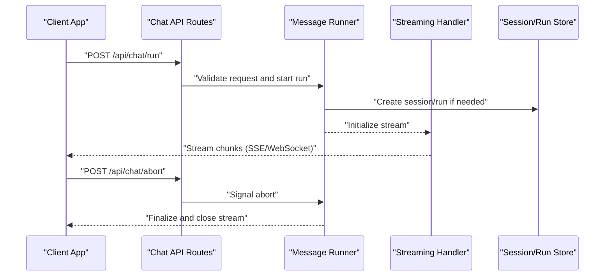
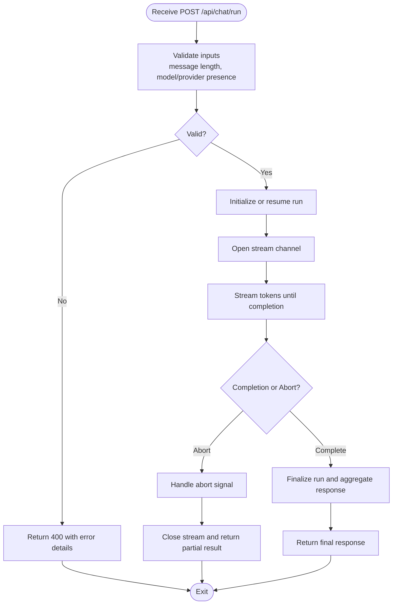
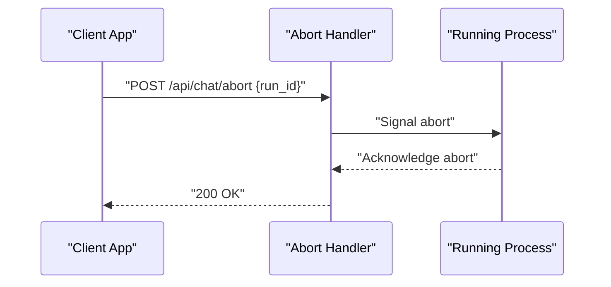
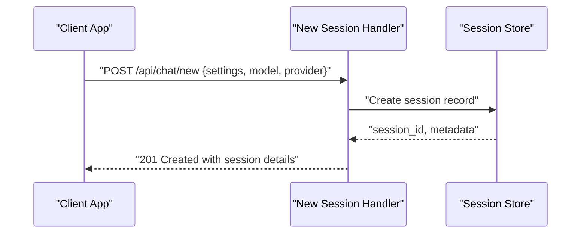
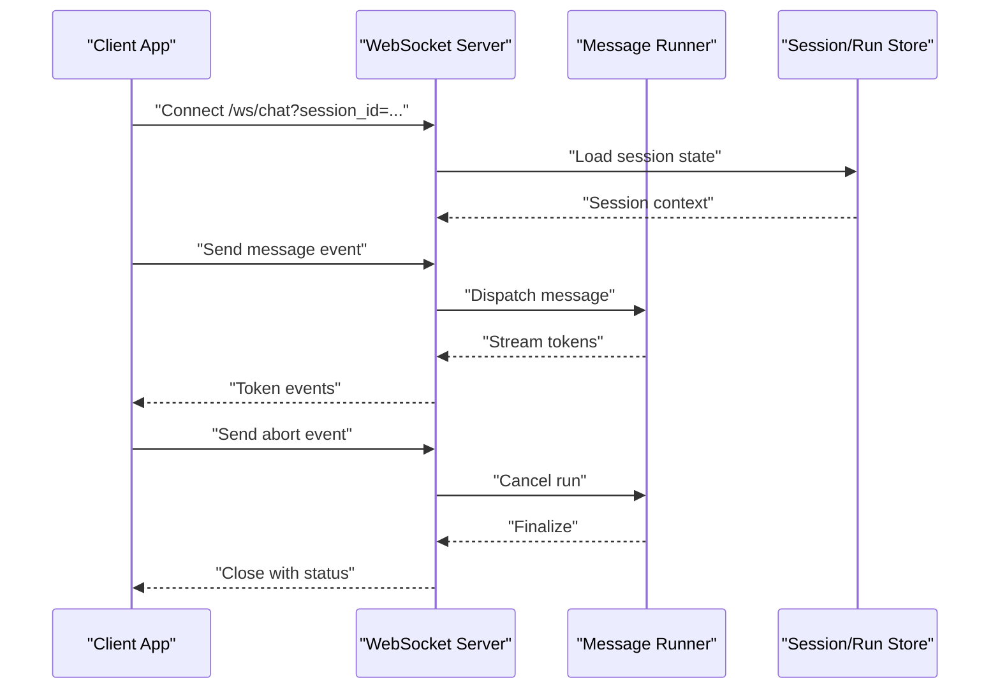
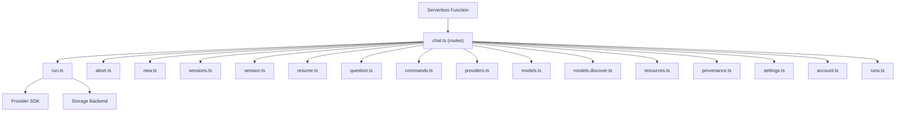

# Chat Messages

<cite>
**Referenced Files in This Document**
- [chat.ts](file://functions/chat.ts)
- [chat.ts](file://apps/web/src/routes/api/chat.ts)
- [run.ts](file://apps/web/src/routes/api/chat/run.ts)
- [abort.ts](file://apps/web/src/routes/api/chat/abort.ts)
- [new.ts](file://apps/web/src/routes/api/chat/new.ts)
- [sessions.ts](file://apps/web/src/routes/api/chat/sessions.ts)
- [session.ts](file://apps/web/src/routes/api/chat/session.ts)
- [resume.ts](file://apps/web/src/routes/api/chat/resume.ts)
- [question.ts](file://apps/web/src/routes/api/chat/question.ts)
- [commands.ts](file://apps/web/src/routes/api/chat/commands.ts)
- [providers.ts](file://apps/web/src/routes/api/chat/providers.ts)
- [models.ts](file://apps/web/src/routes/api/chat/models.ts)
- [models.discover.ts](file://apps/web/src/routes/api/chat/models.discover.ts)
- [resources.ts](file://apps/web/src/routes/api/chat/resources.ts)
- [provenance.ts](file://apps/web/src/routes/api/chat/provenance.ts)
- [settings.ts](file://apps/web/src/routes/api/chat/settings.ts)
- [account.ts](file://apps/web/src/routes/api/chat/account.ts)
- [runs.ts](file://apps/web/src/routes/api/chat/runs.ts)
- [chat-api.md](file://docs/wiki/apps/web/chat-api.md)
- [endpoints.md](file://docs/wiki/api/endpoints.md)
</cite>

## Table of Contents

1. [Introduction](#introduction)
2. [Project Structure](#project-structure)
3. [Core Components](#core-components)
4. [Architecture Overview](#architecture-overview)
5. [Detailed Component Analysis](#detailed-component-analysis)
6. [Dependency Analysis](#dependency-analysis)
7. [Performance Considerations](#performance-considerations)
8. [Troubleshooting Guide](#troubleshooting-guide)
9. [Conclusion](#conclusion)
10. [Appendices](#appendices)

## Introduction

This document provides comprehensive API documentation for Chat Message handling endpoints. It covers HTTP methods, URL patterns, request/response schemas for sending messages, receiving responses, and managing message streams. It also documents real-time communication patterns, WebSocket integration for live messaging, and message streaming capabilities. Examples are provided for message composition, response handling, and error recovery. Message validation rules, content filtering, and security considerations for user-generated content are included to ensure safe and robust integrations.

## Project Structure

The chat functionality is implemented across:

- A serverless function entry point for chat operations
- Route handlers under the web application’s API routes for chat-related endpoints
- Documentation files describing API behavior and endpoints

```mermaid
graph TB
subgraph "Serverless Layer"
F["functions/chat.ts"]
end
subgraph "Web API Routes"
R1["apps/web/src/routes/api/chat.ts"]
R2["apps/web/src/routes/api/chat/run.ts"]
R3["apps/web/src/routes/api/chat/abort.ts"]
R4["apps/web/src/routes/api/chat/new.ts"]
R5["apps/web/src/routes/api/chat/sessions.ts"]
R6["apps/web/src/routes/api/chat/session.ts"]
R7["apps/web/src/routes/api/chat/resume.ts"]
R8["apps/web/src/routes/api/chat/question.ts"]
R9["apps/web/src/routes/api/chat/commands.ts"]
R10["apps/web/src/routes/api/chat/providers.ts"]
R11["apps/web/src/routes/api/chat/models.ts"]
R12["apps/web/src/routes/api/chat/models.discover.ts"]
R13["apps/web/src/routes/api/chat/resources.ts"]
R14["apps/web/src/routes/api/chat/provenance.ts"]
R15["apps/web/src/routes/api/chat/settings.ts"]
R16["apps/web/src/routes/api/chat/account.ts"]
R17["apps/web/src/routes/api/chat/runs.ts"]
end
subgraph "Documentation"
D1["docs/wiki/apps/web/chat-api.md"]
D2["docs/wiki/api/endpoints.md"]
end
F --> R1
R1 --> R2
R1 --> R3
R1 --> R4
R1 --> R5
R1 --> R6
R1 --> R7
R1 --> R8
R1 --> R9
R1 --> R10
R1 --> R11
R1 --> R12
R1 --> R13
R1 --> R14
R1 --> R15
R1 --> R16
R1 --> R17
D1 --> R1
D2 --> R1
```

**Diagram sources**

- [chat.ts](file://functions/chat.ts)
- [chat.ts](file://apps/web/src/routes/api/chat.ts)
- [run.ts](file://apps/web/src/routes/api/chat/run.ts)
- [abort.ts](file://apps/web/src/routes/api/chat/abort.ts)
- [new.ts](file://apps/web/src/routes/api/chat/new.ts)
- [sessions.ts](file://apps/web/src/routes/api/chat/sessions.ts)
- [session.ts](file://apps/web/src/routes/api/chat/session.ts)
- [resume.ts](file://apps/web/src/routes/api/chat/resume.ts)
- [question.ts](file://apps/web/src/routes/api/chat/question.ts)
- [commands.ts](file://apps/web/src/routes/api/chat/commands.ts)
- [providers.ts](file://apps/web/src/routes/api/chat/providers.ts)
- [models.ts](file://apps/web/src/routes/api/chat/models.ts)
- [models.discover.ts](file://apps/web/src/routes/api/chat/models.discover.ts)
- [resources.ts](file://apps/web/src/routes/api/chat/resources.ts)
- [provenance.ts](file://apps/web/src/routes/api/chat/provenance.ts)
- [settings.ts](file://apps/web/src/routes/api/chat/settings.ts)
- [account.ts](file://apps/web/src/routes/api/chat/account.ts)
- [runs.ts](file://apps/web/src/routes/api/chat/runs.ts)
- [chat-api.md](file://docs/wiki/apps/web/chat-api.md)
- [endpoints.md](file://docs/wiki/api/endpoints.md)

**Section sources**

- [chat.ts](file://functions/chat.ts)
- [chat.ts](file://apps/web/src/routes/api/chat.ts)
- [chat-api.md](file://docs/wiki/apps/web/chat-api.md)
- [endpoints.md](file://docs/wiki/api/endpoints.md)

## Core Components

- Chat serverless function: Entry point for chat operations exposed via serverless runtime.
- Chat API routes: Organized route handlers for session lifecycle, message sending, streaming, aborting, model/provider management, resources, provenance, settings, account, and run tracking.
- Documentation: Describes API usage, endpoints, and behaviors.

Key responsibilities:

- Session management: Create, list, resume, and manage sessions.
- Message handling: Send messages, receive streamed responses, and support aborts.
- Model and provider configuration: Discover models, configure providers, and manage settings.
- Resource and provenance tracking: Manage external resources and track provenance metadata.
- Account and runs: Associate chat activity with accounts and track runs.

**Section sources**

- [chat.ts](file://functions/chat.ts)
- [chat.ts](file://apps/web/src/routes/api/chat.ts)
- [run.ts](file://apps/web/src/routes/api/chat/run.ts)
- [abort.ts](file://apps/web/src/routes/api/chat/abort.ts)
- [new.ts](file://apps/web/src/routes/api/chat/new.ts)
- [sessions.ts](file://apps/web/src/routes/api/chat/sessions.ts)
- [session.ts](file://apps/web/src/routes/api/chat/session.ts)
- [resume.ts](file://apps/web/src/routes/api/chat/resume.ts)
- [question.ts](file://apps/web/src/routes/api/chat/question.ts)
- [commands.ts](file://apps/web/src/routes/api/chat/commands.ts)
- [providers.ts](file://apps/web/src/routes/api/chat/providers.ts)
- [models.ts](file://apps/web/src/routes/api/chat/models.ts)
- [models.discover.ts](file://apps/web/src/routes/api/chat/models.discover.ts)
- [resources.ts](file://apps/web/src/routes/api/chat/resources.ts)
- [provenance.ts](file://apps/web/src/routes/api/chat/provenance.ts)
- [settings.ts](file://apps/web/src/routes/api/chat/settings.ts)
- [account.ts](file://apps/web/src/routes/api/chat/account.ts)
- [runs.ts](file://apps/web/src/routes/api/chat/runs.ts)

## Architecture Overview

The chat system exposes REST endpoints for session and message operations, supports streaming responses for live updates, and integrates with a serverless function layer. Real-time communication can be achieved via Server-Sent Events (SSE) or WebSockets depending on client needs. The architecture separates concerns between routing, business logic, and data persistence.

**Diagram sources**

- [run.ts](file://apps/web/src/routes/api/chat/run.ts)
- [abort.ts](file://apps/web/src/routes/api/chat/abort.ts)
- [new.ts](file://apps/web/src/routes/api/chat/new.ts)
- [sessions.ts](file://apps/web/src/routes/api/chat/sessions.ts)
- [session.ts](file://apps/web/src/routes/api/chat/session.ts)
- [resume.ts](file://apps/web/src/routes/api/chat/resume.ts)
- [chat.ts](file://functions/chat.ts)

## Detailed Component Analysis

### Chat Run Endpoint (Send Message and Stream Response)

- Method: POST
- URL pattern: /api/chat/run
- Purpose: Start a new chat run or continue an existing one, send a message, and stream the response.
- Request schema:
  - session_id: string (optional; used to continue an existing session)
  - message: string (required; user input)
  - model: string (optional; target model identifier)
  - provider: string (optional; provider name)
  - settings: object (optional; per-run overrides)
  - resources: array (optional; resource references)
  - provenance: object (optional; metadata for traceability)
- Response:
  - Streaming: Server-Sent Events or WebSocket frames containing incremental tokens
  - Final payload includes aggregated response, run metadata, and status
- Error handling:
  - Validation errors return 400 with details
  - Provider/model errors return 422 or 502 with diagnostics
  - Abort signals terminate the stream gracefully

**Diagram sources**

- [run.ts](file://apps/web/src/routes/api/chat/run.ts)
- [abort.ts](file://apps/web/src/routes/api/chat/abort.ts)

**Section sources**

- [run.ts](file://apps/web/src/routes/api/chat/run.ts)
- [abort.ts](file://apps/web/src/routes/api/chat/abort.ts)

### Abort Endpoint

- Method: POST
- URL pattern: /api/chat/abort
- Purpose: Signal cancellation of an ongoing run/stream.
- Request schema:
  - run_id: string (required; identifies the run to abort)
  - session_id: string (optional; context for session-based aborts)
- Response:
  - 200 OK with confirmation
  - 404 Not Found if run not found
  - 409 Conflict if run already completed

**Diagram sources**

- [abort.ts](file://apps/web/src/routes/api/chat/abort.ts)

**Section sources**

- [abort.ts](file://apps/web/src/routes/api/chat/abort.ts)

### New Session Endpoint

- Method: POST
- URL pattern: /api/chat/new
- Purpose: Create a new chat session.
- Request schema:
  - settings: object (optional; default settings for the session)
  - model: string (optional; default model)
  - provider: string (optional; default provider)
- Response:
  - session_id: string
  - created_at: timestamp
  - settings: object

**Diagram sources**

- [new.ts](file://apps/web/src/routes/api/chat/new.ts)

**Section sources**

- [new.ts](file://apps/web/src/routes/api/chat/new.ts)

### Sessions List Endpoint

- Method: GET
- URL pattern: /api/chat/sessions
- Purpose: Retrieve a paginated list of sessions for the current account.
- Query parameters:
  - page: number (default 1)
  - limit: number (default 20)
- Response:
  - items: array of session summaries
  - total: number
  - page: number
  - has_more: boolean

**Section sources**

- [sessions.ts](file://apps/web/src/routes/api/chat/sessions.ts)

### Session Detail Endpoint

- Method: GET
- URL pattern: /api/chat/session/{session_id}
- Purpose: Retrieve full details of a specific session including history and settings.
- Response:
  - session_id: string
  - messages: array of message objects
  - settings: object
  - created_at: timestamp
  - updated_at: timestamp

**Section sources**

- [session.ts](file://apps/web/src/routes/api/chat/session.ts)

### Resume Session Endpoint

- Method: POST
- URL pattern: /api/chat/resume
- Purpose: Resume a previously paused or incomplete run within a session.
- Request schema:
  - session_id: string (required)
  - run_id: string (required)
- Response:
  - run_id: string
  - status: string
  - resumed_at: timestamp

**Section sources**

- [resume.ts](file://apps/web/src/routes/api/chat/resume.ts)

### Question Endpoint

- Method: POST
- URL pattern: /api/chat/question
- Purpose: Submit a question without starting a full run; useful for quick queries.
- Request schema:
  - question: string (required)
  - model: string (optional)
  - provider: string (optional)
- Response:
  - answer: string
  - model_used: string
  - provider_used: string

**Section sources**

- [question.ts](file://apps/web/src/routes/api/chat/question.ts)

### Commands Endpoint

- Method: POST
- URL pattern: /api/chat/commands
- Purpose: Execute predefined commands within a chat context.
- Request schema:
  - command: string (required; command identifier)
  - params: object (optional; command-specific parameters)
  - session_id: string (optional)
- Response:
  - result: object (command-specific output)
  - status: string

**Section sources**

- [commands.ts](file://apps/web/src/routes/api/chat/commands.ts)

### Providers Endpoint

- Method: GET
- URL pattern: /api/chat/providers
- Purpose: List available providers and their configurations.
- Response:
  - providers: array of provider descriptors

**Section sources**

- [providers.ts](file://apps/web/src/routes/api/chat/providers.ts)

### Models Endpoint

- Method: GET
- URL pattern: /api/chat/models
- Purpose: List available models for the configured providers.
- Response:
  - models: array of model descriptors

**Section sources**

- [models.ts](file://apps/web/src/routes/api/chat/models.ts)

### Models Discover Endpoint

- Method: GET
- URL pattern: /api/chat/models/discover
- Purpose: Dynamically discover models from providers based on credentials.
- Response:
  - discovered_models: array of model identifiers
  - provider_status: object mapping provider to status

**Section sources**

- [models.discover.ts](file://apps/web/src/routes/api/chat/models.discover.ts)

### Resources Endpoint

- Method: GET/POST
- URL pattern: /api/chat/resources
- Purpose: Manage resources referenced by chat runs (e.g., files, URLs).
- GET Response:
  - resources: array of resource entries
- POST Request schema:
  - resources: array of resource definitions
- POST Response:
  - accepted: array of resource IDs
  - rejected: array of error details

**Section sources**

- [resources.ts](file://apps/web/src/routes/api/chat/resources.ts)

### Provenance Endpoint

- Method: GET
- URL pattern: /api/chat/provenance
- Purpose: Retrieve provenance metadata for a run or session.
- Query parameters:
  - run_id: string (optional)
  - session_id: string (optional)
- Response:
  - provenance: object with trace information

**Section sources**

- [provenance.ts](file://apps/web/src/routes/api/chat/provenance.ts)

### Settings Endpoint

- Method: GET/PUT
- URL pattern: /api/chat/settings
- Purpose: Read and update chat settings at account or session level.
- GET Response:
  - settings: object
- PUT Request schema:
  - settings: object
- PUT Response:
  - settings: object (updated)

**Section sources**

- [settings.ts](file://apps/web/src/routes/api/chat/settings.ts)

### Account Endpoint

- Method: GET
- URL pattern: /api/chat/account
- Purpose: Retrieve account-level information and permissions relevant to chat.
- Response:
  - account_id: string
  - roles: array of strings
  - features: object

**Section sources**

- [account.ts](file://apps/web/src/routes/api/chat/account.ts)

### Runs Endpoint

- Method: GET
- URL pattern: /api/chat/runs
- Purpose: List runs associated with a session or account.
- Query parameters:
  - session_id: string (optional)
  - page: number (default 1)
  - limit: number (default 20)
- Response:
  - items: array of run summaries
  - total: number
  - page: number
  - has_more: boolean

**Section sources**

- [runs.ts](file://apps/web/src/routes/api/chat/runs.ts)

### Conceptual Overview

Real-time communication patterns include:

- Server-Sent Events (SSE): Single-direction streaming from server to client for incremental token delivery.
- WebSockets: Bidirectional channels for interactive chat experiences, allowing client-initiated control messages alongside server updates.
- Retry and reconnection: Clients should implement exponential backoff and idempotent resume semantics using run_id or session_id.

[No sources needed since this diagram shows conceptual workflow, not actual code structure]

## Dependency Analysis

The chat API routes depend on:

- Authentication and authorization middleware (via account and session contexts)
- Provider SDKs for model interactions
- Storage backends for sessions and runs
- Streaming utilities for SSE/WebSocket transport

**Diagram sources**

- [chat.ts](file://apps/web/src/routes/api/chat.ts)
- [run.ts](file://apps/web/src/routes/api/chat/run.ts)
- [abort.ts](file://apps/web/src/routes/api/chat/abort.ts)
- [new.ts](file://apps/web/src/routes/api/chat/new.ts)
- [sessions.ts](file://apps/web/src/routes/api/chat/sessions.ts)
- [session.ts](file://apps/web/src/routes/api/chat/session.ts)
- [resume.ts](file://apps/web/src/routes/api/chat/resume.ts)
- [question.ts](file://apps/web/src/routes/api/chat/question.ts)
- [commands.ts](file://apps/web/src/routes/api/chat/commands.ts)
- [providers.ts](file://apps/web/src/routes/api/chat/providers.ts)
- [models.ts](file://apps/web/src/routes/api/chat/models.ts)
- [models.discover.ts](file://apps/web/src/routes/api/chat/models.discover.ts)
- [resources.ts](file://apps/web/src/routes/api/chat/resources.ts)
- [provenance.ts](file://apps/web/src/routes/api/chat/provenance.ts)
- [settings.ts](file://apps/web/src/routes/api/chat/settings.ts)
- [account.ts](file://apps/web/src/routes/api/chat/account.ts)
- [runs.ts](file://apps/web/src/routes/api/chat/runs.ts)
- [chat.ts](file://functions/chat.ts)

**Section sources**

- [chat.ts](file://apps/web/src/routes/api/chat.ts)
- [chat.ts](file://functions/chat.ts)

## Performance Considerations

- Streaming efficiency: Use chunked responses and minimize payload size for token streaming.
- Connection pooling: Reuse provider connections where possible to reduce latency.
- Pagination: Implement cursor-based pagination for large lists of sessions and runs.
- Caching: Cache static model/provider metadata to avoid repeated discovery calls.
- Backpressure: Handle client disconnects and slow consumers gracefully to prevent memory leaks.

[No sources needed since this section provides general guidance]

## Troubleshooting Guide

Common issues and resolutions:

- Validation errors: Ensure required fields like message and model/provider are present and correctly formatted.
- Provider errors: Check credentials and rate limits; retry with exponential backoff.
- Stream interruptions: Implement reconnection logic and resume using run_id or session_id.
- Abort failures: Verify run_id exists and is still active before signaling abort.

Error response patterns:

- 400 Bad Request: Invalid input or missing required fields
- 401 Unauthorized: Missing or invalid authentication
- 403 Forbidden: Insufficient permissions
- 404 Not Found: Resource not found
- 409 Conflict: Operation conflicts with current state
- 422 Unprocessable Entity: Semantic validation failure
- 500 Internal Server Error: Unexpected server-side failure
- 502 Bad Gateway: Provider service unavailable
- 503 Service Unavailable: Temporary overload

**Section sources**

- [run.ts](file://apps/web/src/routes/api/chat/run.ts)
- [abort.ts](file://apps/web/src/routes/api/chat/abort.ts)

## Conclusion

The Chat Messages API provides a robust set of endpoints for session management, message streaming, and operational controls. By following the documented schemas, error handling patterns, and security considerations, clients can build reliable and secure chat integrations. Real-time communication is supported through streaming mechanisms, enabling responsive and interactive user experiences.

[No sources needed since this section summarizes without analyzing specific files]

## Appendices

### Message Composition Guidelines

- Keep messages concise and clear to improve model performance.
- Avoid embedding sensitive data directly in messages; use resource references instead.
- Use structured prompts when invoking commands or specialized workflows.

### Content Filtering and Security

- Sanitize user input on the client side to prevent XSS.
- Enforce server-side validation for message length and allowed characters.
- Apply content moderation policies at the provider level when available.
- Restrict access to sensitive endpoints via authentication and role-based authorization.

### Real-Time Communication Patterns

- Prefer SSE for simple streaming scenarios; use WebSockets for bidirectional control.
- Implement heartbeat mechanisms to detect dead connections.
- Buffer incoming tokens and render incrementally for smooth UX.

[No sources needed since this section provides general guidance]
