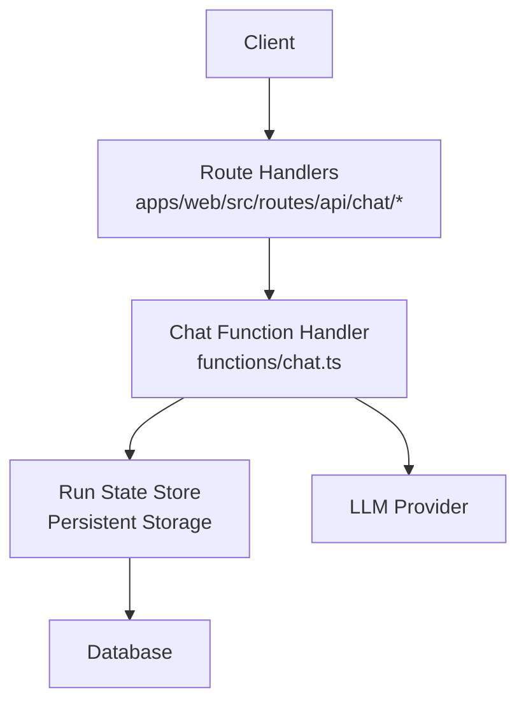
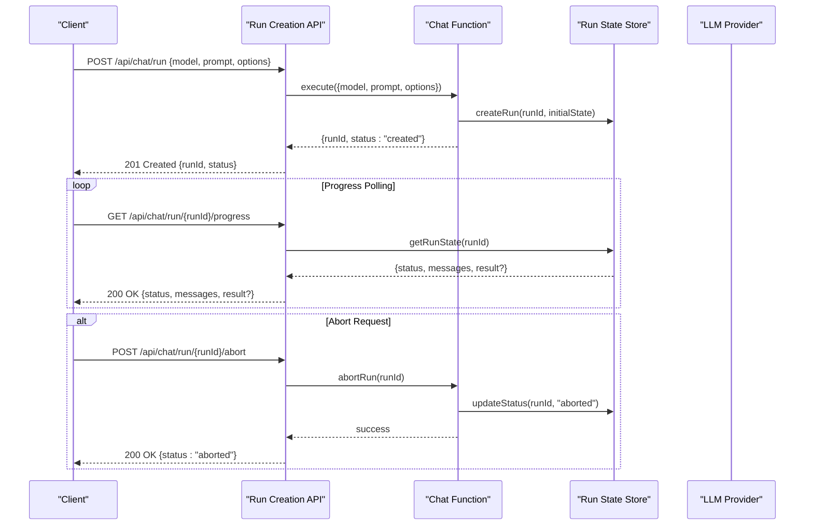
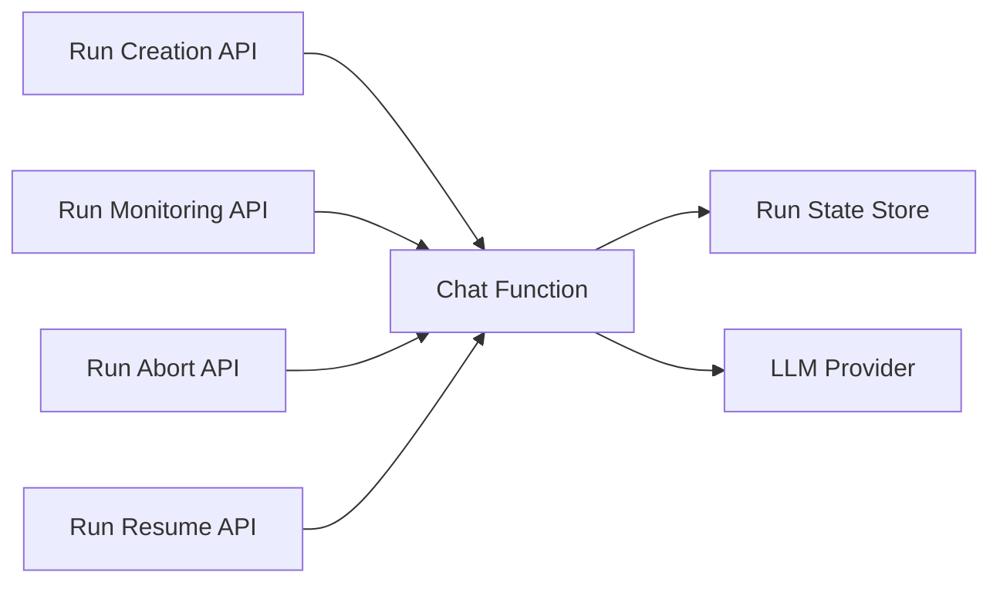

# Chat Runs

<cite>
**Referenced Files in This Document**
- [run.ts](file://apps/web/src/routes/api/chat/run.ts)
- [runs.ts](file://apps/web/src/routes/api/chat/runs.ts)
- [abort.ts](file://apps/web/src/routes/api/chat/abort.ts)
- [resume.ts](file://apps/web/src/routes/api/chat/resume.ts)
- [chat.ts](file://functions/chat.ts)
- [openapi.json](file://apps/web/openapi.json)
</cite>

## Table of Contents

1. [Introduction](#introduction)
2. [Project Structure](#project-structure)
3. [Core Components](#core-components)
4. [Architecture Overview](#architecture-overview)
5. [Detailed Component Analysis](#detailed-component-analysis)
6. [Dependency Analysis](#dependency-analysis)
7. [Performance Considerations](#performance-considerations)
8. [Troubleshooting Guide](#troubleshooting-guide)
9. [Conclusion](#conclusion)
10. [Appendices](#appendices)

## Introduction

This document provides detailed API documentation for Chat Run execution endpoints. It covers initiating runs, monitoring progress, managing lifecycle states, and aborting operations. The focus is on HTTP methods, URL patterns, request/response schemas, state transitions, error handling, and resource cleanup procedures. Concrete examples illustrate run creation with different parameters, progress polling, and graceful termination.

## Project Structure

The Chat Run endpoints are implemented as serverless functions and route handlers within the web application:

- Route handlers under apps/web/src/routes/api/chat define the REST endpoints for runs.
- A shared function handler under functions/chat.ts centralizes chat execution logic.
- An OpenAPI specification under apps/web/openapi.json documents the schema definitions used across endpoints.

**Diagram sources**

- [run.ts](file://apps/web/src/routes/api/chat/run.ts)
- [runs.ts](file://apps/web/src/routes/api/chat/runs.ts)
- [abort.ts](file://apps/web/src/routes/api/chat/abort.ts)
- [resume.ts](file://apps/web/src/routes/api/chat/resume.ts)
- [chat.ts](file://functions/chat.ts)

**Section sources**

- [run.ts](file://apps/web/src/routes/api/chat/run.ts)
- [runs.ts](file://apps/web/src/routes/api/chat/runs.ts)
- [abort.ts](file://apps/web/src/routes/api/chat/abort.ts)
- [resume.ts](file://apps/web/src/routes/api/chat/resume.ts)
- [chat.ts](file://functions/chat.ts)
- [openapi.json](file://apps/web/openapi.json)

## Core Components

- Run Creation Endpoint: Initiates a new chat run with provided parameters such as model selection, prompt content, and optional configuration flags. Returns a run identifier and initial status.
- Run Monitoring Endpoint: Provides real-time or polled updates on run progress, including intermediate messages and final results.
- Run Abort Endpoint: Gracefully terminates an active run, ensuring resources are released and state is updated to a terminal state.
- Resume Endpoint: Resumes a previously paused or interrupted run from its last checkpoint.

Key responsibilities:

- Validate inputs and enforce constraints (e.g., required fields, allowed values).
- Manage run lifecycle states (created, running, completed, aborted, failed).
- Stream or poll progress updates to clients.
- Handle errors consistently and return structured responses.

**Section sources**

- [run.ts](file://apps/web/src/routes/api/chat/run.ts)
- [runs.ts](file://apps/web/src/routes/api/chat/runs.ts)
- [abort.ts](file://apps/web/src/routes/api/chat/abort.ts)
- [resume.ts](file://apps/web/src/routes/api/chat/resume.ts)
- [chat.ts](file://functions/chat.ts)
- [openapi.json](file://apps/web/openapi.json)

## Architecture Overview

The Chat Run architecture follows a request-driven pattern with clear separation between routing, execution logic, and storage:

- Clients interact with REST endpoints defined in route handlers.
- The chat function orchestrates execution, interacts with providers, and persists state.
- Run state is stored persistently and can be queried for monitoring and resumption.

**Diagram sources**

- [run.ts](file://apps/web/src/routes/api/chat/run.ts)
- [runs.ts](file://apps/web/src/routes/api/chat/runs.ts)
- [abort.ts](file://apps/web/src/routes/api/chat/abort.ts)
- [chat.ts](file://functions/chat.ts)

## Detailed Component Analysis

### Run Creation Endpoint

Initiates a new chat run with parameters such as model, prompt, and optional settings. The endpoint validates input, creates a run record, and returns the run identifier along with the initial status.

- Method: POST
- URL Pattern: /api/chat/run
- Request Schema:
  - model: string (required)
  - prompt: string (required)
  - options: object (optional)
    - temperature: number
    - maxTokens: number
    - stopSequences: array of strings
- Response Schema:
  - runId: string
  - status: string ("created")
  - createdAt: timestamp

Example flow:

- Client sends a POST request with model, prompt, and options.
- Server validates the payload and creates a run record.
- Server responds with the run identifier and initial status.

**Section sources**

- [run.ts](file://apps/web/src/routes/api/chat/run.ts)
- [openapi.json](file://apps/web/openapi.json)

### Run Monitoring Endpoint

Provides progress updates for a specific run. Clients can poll this endpoint to track the run’s current state, intermediate messages, and final results.

- Method: GET
- URL Pattern: /api/chat/run/{runId}/progress
- Path Parameters:
  - runId: string (required)
- Response Schema:
  - status: string ("running", "completed", "aborted", "failed")
  - messages: array of objects (intermediate outputs)
  - result: object (final output when completed)
  - updatedAt: timestamp

Example flow:

- Client polls the progress endpoint at intervals.
- Server retrieves the latest run state from storage.
- Server returns the current status, messages, and any available results.

**Section sources**

- [runs.ts](file://apps/web/src/routes/api/chat/runs.ts)
- [openapi.json](file://apps/web/openapi.json)

### Run Abort Endpoint

Gracefully terminates an active run by signaling the underlying process to stop and updating the run state to a terminal status.

- Method: POST
- URL Pattern: /api/chat/run/{runId}/abort
- Path Parameters:
  - runId: string (required)
- Response Schema:
  - status: string ("aborted")
  - message: string (optional explanation)
  - updatedAt: timestamp

Example flow:

- Client sends a POST request to abort the run.
- Server signals the running process to terminate.
- Server updates the run state to "aborted" and confirms completion.

**Section sources**

- [abort.ts](file://apps/web/src/routes/api/chat/abort.ts)
- [openapi.json](file://apps/web/openapi.json)

### Run Resume Endpoint

Resumes a previously paused or interrupted run from its last known checkpoint. Useful for long-running tasks that may be interrupted due to network issues or server restarts.

- Method: POST
- URL Pattern: /api/chat/run/{runId}/resume
- Path Parameters:
  - runId: string (required)
- Request Schema:
  - resumeOptions: object (optional)
    - continueFromCheckpoint: boolean
- Response Schema:
  - status: string ("resumed")
  - runId: string
  - message: string (optional confirmation)
  - updatedAt: timestamp

Example flow:

- Client sends a POST request to resume the run.
- Server locates the last checkpoint and resumes execution.
- Server updates the run state to "resumed" and continues processing.

**Section sources**

- [resume.ts](file://apps/web/src/routes/api/chat/resume.ts)
- [openapi.json](file://apps/web/openapi.json)

### Chat Function Handler

Centralizes chat execution logic, including interaction with LLM providers, state management, and error handling.

Responsibilities:

- Execute chat prompts with specified models and options.
- Persist run state and intermediate results.
- Handle timeouts, retries, and provider errors.
- Support streaming or batched responses based on client preferences.

**Section sources**

- [chat.ts](file://functions/chat.ts)
- [openapi.json](file://apps/web/openapi.json)

## Dependency Analysis

The Chat Run system has clear dependencies between route handlers, the chat function, and persistent storage:

- Route handlers depend on the chat function for execution logic.
- The chat function depends on storage for state persistence and LLM providers for response generation.
- Error handling is centralized in the chat function to ensure consistent behavior across endpoints.

**Diagram sources**

- [run.ts](file://apps/web/src/routes/api/chat/run.ts)
- [runs.ts](file://apps/web/src/routes/api/chat/runs.ts)
- [abort.ts](file://apps/web/src/routes/api/chat/abort.ts)
- [resume.ts](file://apps/web/src/routes/api/chat/resume.ts)
- [chat.ts](file://functions/chat.ts)

**Section sources**

- [run.ts](file://apps/web/src/routes/api/chat/run.ts)
- [runs.ts](file://apps/web/src/routes/api/chat/runs.ts)
- [abort.ts](file://apps/web/src/routes/api/chat/abort.ts)
- [resume.ts](file://apps/web/src/routes/api/chat/resume.ts)
- [chat.ts](file://functions/chat.ts)

## Performance Considerations

- Use efficient polling intervals for progress monitoring to balance responsiveness and server load.
- Implement caching for frequently accessed run states where appropriate.
- Optimize LLM provider calls with batching and connection pooling.
- Monitor memory usage during long-running runs to prevent leaks.

[No sources needed since this section provides general guidance]

## Troubleshooting Guide

Common issues and resolutions:

- Invalid Input: Ensure all required fields are present and correctly formatted.
- Timeout Errors: Increase timeout limits or optimize prompt complexity.
- Provider Errors: Check LLM provider availability and credentials.
- State Inconsistencies: Verify storage integrity and implement reconciliation processes.

Error Handling Patterns:

- Return structured error responses with descriptive messages.
- Log detailed error information for debugging.
- Implement retry mechanisms for transient failures.

**Section sources**

- [chat.ts](file://functions/chat.ts)
- [openapi.json](file://apps/web/openapi.json)

## Conclusion

The Chat Run API provides a comprehensive solution for managing chat executions with robust lifecycle management, progress monitoring, and graceful termination capabilities. By following the documented endpoints and schemas, clients can effectively integrate with the system while maintaining reliability and performance.

[No sources needed since this section summarizes without analyzing specific files]

## Appendices

### Run Lifecycle States

- created: Initial state after run creation
- running: Execution in progress
- completed: Successful completion with final results
- aborted: Graceful termination requested by client
- failed: Unexpected error during execution

### Example Requests and Responses

- Run Creation: POST /api/chat/run with model, prompt, and options
- Progress Monitoring: GET /api/chat/run/{runId}/progress
- Run Abort: POST /api/chat/run/{runId}/abort
- Run Resume: POST /api/chat/run/{runId}/resume

**Section sources**

- [run.ts](file://apps/web/src/routes/api/chat/run.ts)
- [runs.ts](file://apps/web/src/routes/api/chat/runs.ts)
- [abort.ts](file://apps/web/src/routes/api/chat/abort.ts)
- [resume.ts](file://apps/web/src/routes/api/chat/resume.ts)
- [openapi.json](file://apps/web/openapi.json)
