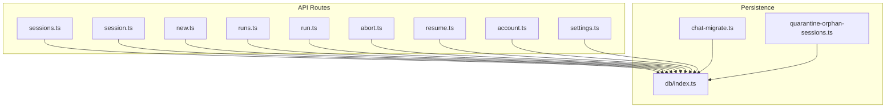
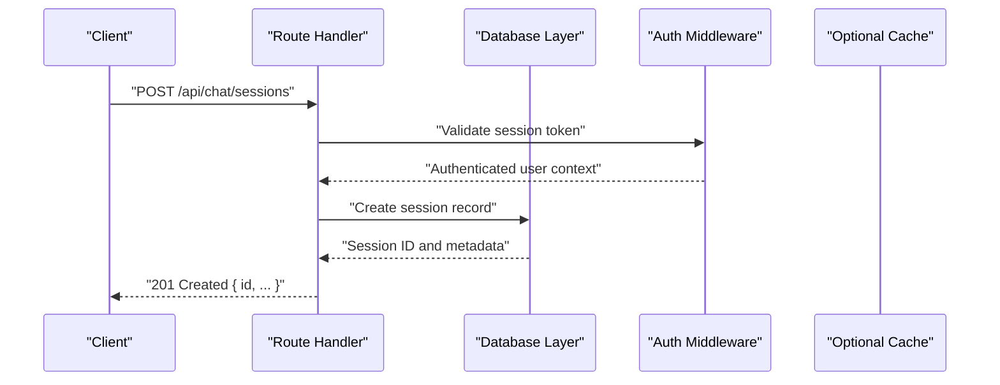
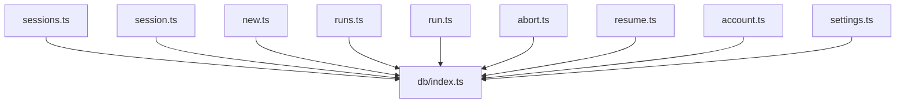

# Chat Sessions

<cite>
**Referenced Files in This Document**
- [apps/web/src/routes/api/chat/sessions.ts](file://apps/web/src/routes/api/chat/sessions.ts)
- [apps/web/src/routes/api/chat/session.ts](file://apps/web/src/routes/api/chat/session.ts)
- [apps/web/src/routes/api/chat/new.ts](file://apps/web/src/routes/api/chat/new.ts)
- [apps/web/src/routes/api/chat/runs.ts](file://apps/web/src/routes/api/chat/runs.ts)
- [apps/web/src/routes/api/chat/run.ts](file://apps/web/src/routes/api/chat/run.ts)
- [apps/web/src/routes/api/chat/abort.ts](file://apps/web/src/routes/api/chat/abort.ts)
- [apps/web/src/routes/api/chat/resume.ts](file://apps/web/src/routes/api/chat/resume.ts)
- [apps/web/src/routes/api/chat/account.ts](file://apps/web/src/routes/api/chat/account.ts)
- [apps/web/src/routes/api/chat/settings.ts](file://apps/web/src/routes/api/chat/settings.ts)
- [apps/web/src/lib/db/index.ts](file://apps/web/src/lib/db/index.ts)
- [apps/web/scripts/chat-migrate.ts](file://apps/web/scripts/chat-migrate.ts)
- [apps/web/scripts/quarantine-orphan-sessions.ts](file://apps/web/scripts/quarantine-orphan-sessions.ts)
- [apps/web/openapi.json](file://apps/web/openapi.json)
</cite>

## Table of Contents

1. [Introduction](#introduction)
2. [Project Structure](#project-structure)
3. [Core Components](#core-components)
4. [Architecture Overview](#architecture-overview)
5. [Detailed Component Analysis](#detailed-component-analysis)
6. [Dependency Analysis](#dependency-analysis)
7. [Performance Considerations](#performance-considerations)
8. [Troubleshooting Guide](#troubleshooting-guide)
9. [Conclusion](#conclusion)
10. [Appendices](#appendices)

## Introduction

This document provides detailed API documentation for Chat Session management endpoints. It covers HTTP methods, URL patterns, request/response schemas, session lifecycle management, state synchronization, and persistence mechanisms. It also includes concrete examples for creating sessions with different configurations, retrieving sessions with filtering options, and deleting sessions. Authentication requirements, error handling strategies, and rate limiting policies are documented where applicable.

## Project Structure

The chat session APIs are implemented as route handlers under the web application’s API routes. The key files include:

- Session listing and creation endpoints
- Individual session retrieval, update, and deletion endpoints
- Execution-related endpoints (runs, abort, resume)
- Account and settings endpoints related to chat behavior
- Database access layer for persistence
- Migration and maintenance scripts for session data

**Diagram sources**

- [apps/web/src/routes/api/chat/sessions.ts](file://apps/web/src/routes/api/chat/sessions.ts)
- [apps/web/src/routes/api/chat/session.ts](file://apps/web/src/routes/api/chat/session.ts)
- [apps/web/src/routes/api/chat/new.ts](file://apps/web/src/routes/api/chat/new.ts)
- [apps/web/src/routes/api/chat/runs.ts](file://apps/web/src/routes/api/chat/runs.ts)
- [apps/web/src/routes/api/chat/run.ts](file://apps/web/src/routes/api/chat/run.ts)
- [apps/web/src/routes/api/chat/abort.ts](file://apps/web/src/routes/api/chat/abort.ts)
- [apps/web/src/routes/api/chat/resume.ts](file://apps/web/src/routes/api/chat/resume.ts)
- [apps/web/src/routes/api/chat/account.ts](file://apps/web/src/routes/api/chat/account.ts)
- [apps/web/src/routes/api/chat/settings.ts](file://apps/web/src/routes/api/chat/settings.ts)
- [apps/web/src/lib/db/index.ts](file://apps/web/src/lib/db/index.ts)
- [apps/web/scripts/chat-migrate.ts](file://apps/web/scripts/chat-migrate.ts)
- [apps/web/scripts/quarantine-orphan-sessions.ts](file://apps/web/scripts/quarantine-orphan-sessions.ts)

**Section sources**

- [apps/web/src/routes/api/chat/sessions.ts](file://apps/web/src/routes/api/chat/sessions.ts)
- [apps/web/src/routes/api/chat/session.ts](file://apps/web/src/routes/api/chat/session.ts)
- [apps/web/src/routes/api/chat/new.ts](file://apps/web/src/routes/api/chat/new.ts)
- [apps/web/src/lib/db/index.ts](file://apps/web/src/lib/db/index.ts)

## Core Components

- Session listing endpoint returns paginated or filtered results based on query parameters.
- Session creation endpoint initializes a new chat session with configuration options such as model selection, provider settings, and metadata.
- Individual session endpoint supports retrieval, updates (e.g., title, tags), and deletion.
- Run endpoints manage execution of messages within a session, including streaming responses and cancellation.
- Resume endpoint restores a previously paused or interrupted run.
- Account and settings endpoints control user-specific chat behaviors and defaults.

Key responsibilities:

- Input validation and normalization
- Authorization checks tied to authenticated users
- Persistence via database operations
- Error mapping and consistent response shapes
- Rate limiting and throttling at the route level (if configured)

**Section sources**

- [apps/web/src/routes/api/chat/sessions.ts](file://apps/web/src/routes/api/chat/sessions.ts)
- [apps/web/src/routes/api/chat/session.ts](file://apps/web/src/routes/api/chat/session.ts)
- [apps/web/src/routes/api/chat/new.ts](file://apps/web/src/routes/api/chat/new.ts)
- [apps/web/src/routes/api/chat/runs.ts](file://apps/web/src/routes/api/chat/runs.ts)
- [apps/web/src/routes/api/chat/run.ts](file://apps/web/src/routes/api/chat/run.ts)
- [apps/web/src/routes/api/chat/abort.ts](file://apps/web/src/routes/api/chat/abort.ts)
- [apps/web/src/routes/api/chat/resume.ts](file://apps/web/src/routes/api/chat/resume.ts)
- [apps/web/src/routes/api/chat/account.ts](file://apps/web/src/routes/api/chat/account.ts)
- [apps/web/src/routes/api/chat/settings.ts](file://apps/web/src/routes/api/chat/settings.ts)

## Architecture Overview

The chat session API follows a layered architecture:

- Route handlers parse requests, validate inputs, enforce authentication, and delegate to services or database layers.
- Database layer abstracts persistence operations for sessions, runs, and related entities.
- Background tasks and scripts handle migrations and cleanup (e.g., quarantining orphan sessions).

**Diagram sources**

- [apps/web/src/routes/api/chat/new.ts](file://apps/web/src/routes/api/chat/new.ts)
- [apps/web/src/lib/db/index.ts](file://apps/web/src/lib/db/index.ts)

## Detailed Component Analysis

### Create Session

- Method: POST
- URL: /api/chat/sessions
- Description: Creates a new chat session with optional configuration such as model, provider, and metadata.
- Request body fields:
  - model: string (optional)
  - provider: string (optional)
  - settings: object (optional)
  - metadata: object (optional)
- Response:
  - 201 Created: { id, created_at, updated_at, owner_id, model, provider, settings, metadata }
  - 400 Bad Request: Validation errors
  - 401 Unauthorized: Missing or invalid authentication
  - 429 Too Many Requests: Rate limit exceeded

Example request:

- POST /api/chat/sessions
- Body: { "model": "gpt-4o", "provider": "openai", "settings": { "temperature": 0.7 }, "metadata": { "source": "web" } }

Example response:

- 201 Created: { "id": "sess_abc123", "created_at": "2024-01-01T00:00:00Z", "updated_at": "2024-01-01T00:00:00Z", "owner_id": "user_123", "model": "gpt-4o", "provider": "openai", "settings": { "temperature": 0.7 }, "metadata": { "source": "web" } }

Authentication:

- Requires valid session token or JWT in Authorization header.

Rate limiting:

- Enforced per user; consult server configuration for limits.

Error handling:

- Returns standardized error objects with message and code.

**Section sources**

- [apps/web/src/routes/api/chat/new.ts](file://apps/web/src/routes/api/chat/new.ts)
- [apps/web/src/lib/db/index.ts](file://apps/web/src/lib/db/index.ts)

### List Sessions

- Method: GET
- URL: /api/chat/sessions
- Query parameters:
  - page: integer (default 1)
  - per_page: integer (default 20)
  - sort_by: string (created_at, updated_at)
  - order: string (asc, desc)
  - filter_owner_id: string (optional)
  - filter_model: string (optional)
  - filter_provider: string (optional)
  - filter_tags: string[] (optional)
- Response:
  - 200 OK: { items: [Session], total: number, page: number, per_page: number }
  - 401 Unauthorized: Missing or invalid authentication
  - 429 Too Many Requests: Rate limit exceeded

Example request:

- GET /api/chat/sessions?page=1&per_page=10&sort_by=updated_at&order=desc&filter_model=gpt-4o

Example response:

- 200 OK: { "items": [{ "id": "sess_abc123", "title": "Project Discussion", "model": "gpt-4o", "provider": "openai", "updated_at": "2024-01-01T00:00:00Z" }], "total": 1, "page": 1, "per_page": 10 }

Authentication:

- Requires valid session token or JWT in Authorization header.

Rate limiting:

- Enforced per user; consult server configuration for limits.

**Section sources**

- [apps/web/src/routes/api/chat/sessions.ts](file://apps/web/src/routes/api/chat/sessions.ts)
- [apps/web/src/lib/db/index.ts](file://apps/web/src/lib/db/index.ts)

### Retrieve Session

- Method: GET
- URL: /api/chat/sessions/{sessionId}
- Path parameters:
  - sessionId: string (required)
- Response:
  - 200 OK: { id, title, model, provider, settings, metadata, created_at, updated_at, owner_id }
  - 404 Not Found: Session does not exist or is not owned by the authenticated user
  - 401 Unauthorized: Missing or invalid authentication
  - 429 Too Many Requests: Rate limit exceeded

Example request:

- GET /api/chat/sessions/sess_abc123

Example response:

- 200 OK: { "id": "sess_abc123", "title": "Project Discussion", "model": "gpt-4o", "provider": "openai", "settings": { "temperature": 0.7 }, "metadata": { "source": "web" }, "created_at": "2024-01-01T00:00:00Z", "updated_at": "2024-01-01T00:00:00Z", "owner_id": "user_123" }

Authentication:

- Requires valid session token or JWT in Authorization header.

Rate limiting:

- Enforced per user; consult server configuration for limits.

**Section sources**

- [apps/web/src/routes/api/chat/session.ts](file://apps/web/src/routes/api/chat/session.ts)
- [apps/web/src/lib/db/index.ts](file://apps/web/src/lib/db/index.ts)

### Update Session

- Method: PATCH
- URL: /api/chat/sessions/{sessionId}
- Path parameters:
  - sessionId: string (required)
- Request body fields:
  - title: string (optional)
  - model: string (optional)
  - provider: string (optional)
  - settings: object (optional)
  - metadata: object (optional)
  - tags: string[] (optional)
- Response:
  - 200 OK: Updated session object
  - 404 Not Found: Session does not exist or is not owned by the authenticated user
  - 400 Bad Request: Validation errors
  - 401 Unauthorized: Missing or invalid authentication
  - 429 Too Many Requests: Rate limit exceeded

Example request:

- PATCH /api/chat/sessions/sess_abc123
- Body: { "title": "Updated Title", "tags": ["important", "review"] }

Example response:

- 200 OK: { "id": "sess_abc123", "title": "Updated Title", "model": "gpt-4o", "provider": "openai", "settings": { "temperature": 0.7 }, "metadata": { "source": "web" }, "tags": ["important", "review"], "updated_at": "2024-01-01T00:00:00Z", "owner_id": "user_123" }

Authentication:

- Requires valid session token or JWT in Authorization header.

Rate limiting:

- Enforced per user; consult server configuration for limits.

**Section sources**

- [apps/web/src/routes/api/chat/session.ts](file://apps/web/src/routes/api/chat/session.ts)
- [apps/web/src/lib/db/index.ts](file://apps/web/src/lib/db/index.ts)

### Delete Session

- Method: DELETE
- URL: /api/chat/sessions/{sessionId}
- Path parameters:
  - sessionId: string (required)
- Response:
  - 204 No Content: Successfully deleted
  - 404 Not Found: Session does not exist or is not owned by the authenticated user
  - 401 Unauthorized: Missing or invalid authentication
  - 429 Too Many Requests: Rate limit exceeded

Example request:

- DELETE /api/chat/sessions/sess_abc123

Example response:

- 204 No Content

Authentication:

- Requires valid session token or JWT in Authorization header.

Rate limiting:

- Enforced per user; consult server configuration for limits.

**Section sources**

- [apps/web/src/routes/api/chat/session.ts](file://apps/web/src/routes/api/chat/session.ts)
- [apps/web/src/lib/db/index.ts](file://apps/web/src/lib/db/index.ts)

### Manage Runs Within a Session

- List runs:
  - Method: GET
  - URL: /api/chat/sessions/{sessionId}/runs
  - Query parameters: page, per_page, sort_by, order
  - Response: Paginated list of runs
- Create run:
  - Method: POST
  - URL: /api/chat/sessions/{sessionId}/runs
  - Request body: { prompt: string, model?: string, provider?: string, settings?: object }
  - Response: { id, status, created_at }
- Abort run:
  - Method: POST
  - URL: /api/chat/sessions/{sessionId}/runs/{runId}/abort
  - Response: { status: "aborted" }
- Resume run:
  - Method: POST
  - URL: /api/chat/sessions/{sessionId}/runs/{runId}/resume
  - Response: { status: "resumed" }

Authentication:

- Requires valid session token or JWT in Authorization header.

Rate limiting:

- Enforced per user; consult server configuration for limits.

**Section sources**

- [apps/web/src/routes/api/chat/runs.ts](file://apps/web/src/routes/api/chat/runs.ts)
- [apps/web/src/routes/api/chat/run.ts](file://apps/web/src/routes/api/chat/run.ts)
- [apps/web/src/routes/api/chat/abort.ts](file://apps/web/src/routes/api/chat/abort.ts)
- [apps/web/src/routes/api/chat/resume.ts](file://apps/web/src/routes/api/chat/resume.ts)
- [apps/web/src/lib/db/index.ts](file://apps/web/src/lib/db/index.ts)

### Account and Settings

- Account:
  - Method: GET
  - URL: /api/chat/account
  - Response: { user_id, email, preferences }
- Settings:
  - Method: GET/PUT
  - URL: /api/chat/settings
  - Request/Response: User-specific chat defaults and feature flags

Authentication:

- Requires valid session token or JWT in Authorization header.

Rate limiting:

- Enforced per user; consult server configuration for limits.

**Section sources**

- [apps/web/src/routes/api/chat/account.ts](file://apps/web/src/routes/api/chat/account.ts)
- [apps/web/src/routes/api/chat/settings.ts](file://apps/web/src/routes/api/chat/settings.ts)
- [apps/web/src/lib/db/index.ts](file://apps/web/src/lib/db/index.ts)

## Dependency Analysis

The chat session endpoints depend on:

- Authentication middleware for user context
- Database layer for persistence
- Optional caching for performance
- Background jobs for long-running operations

**Diagram sources**

- [apps/web/src/routes/api/chat/sessions.ts](file://apps/web/src/routes/api/chat/sessions.ts)
- [apps/web/src/routes/api/chat/session.ts](file://apps/web/src/routes/api/chat/session.ts)
- [apps/web/src/routes/api/chat/new.ts](file://apps/web/src/routes/api/chat/new.ts)
- [apps/web/src/routes/api/chat/runs.ts](file://apps/web/src/routes/api/chat/runs.ts)
- [apps/web/src/routes/api/chat/run.ts](file://apps/web/src/routes/api/chat/run.ts)
- [apps/web/src/routes/api/chat/abort.ts](file://apps/web/src/routes/api/chat/abort.ts)
- [apps/web/src/routes/api/chat/resume.ts](file://apps/web/src/routes/api/chat/resume.ts)
- [apps/web/src/routes/api/chat/account.ts](file://apps/web/src/routes/api/chat/account.ts)
- [apps/web/src/routes/api/chat/settings.ts](file://apps/web/src/routes/api/chat/settings.ts)
- [apps/web/src/lib/db/index.ts](file://apps/web/src/lib/db/index.ts)

**Section sources**

- [apps/web/src/lib/db/index.ts](file://apps/web/src/lib/db/index.ts)

## Performance Considerations

- Use pagination for large result sets to reduce payload size.
- Implement caching for frequently accessed session metadata.
- Optimize database queries with appropriate indexes on owner_id, created_at, updated_at, and filter fields.
- Stream responses for long-running runs to improve perceived latency.
- Apply rate limiting to prevent abuse and ensure fair usage.

[No sources needed since this section provides general guidance]

## Troubleshooting Guide

Common issues and resolutions:

- 401 Unauthorized: Ensure valid session token or JWT is included in Authorization header.
- 404 Not Found: Verify session ID exists and belongs to the authenticated user.
- 400 Bad Request: Validate request body fields against schema.
- 429 Too Many Requests: Reduce request frequency or upgrade plan if applicable.
- Database errors: Check connection strings and permissions; review migration scripts if schema changes are required.

Operational scripts:

- Migration script for chat data schema updates
- Quarantine script for orphaned sessions

**Section sources**

- [apps/web/scripts/chat-migrate.ts](file://apps/web/scripts/chat-migrate.ts)
- [apps/web/scripts/quarantine-orphan-sessions.ts](file://apps/web/scripts/quarantine-orphan-sessions.ts)

## Conclusion

The Chat Session API provides comprehensive endpoints for managing chat sessions, including creation, retrieval, updates, deletion, and execution controls. Proper authentication, input validation, and error handling ensure robust operation. Persistence is handled through a dedicated database layer, with scripts supporting schema migrations and data maintenance.

[No sources needed since this section summarizes without analyzing specific files]

## Appendices

### OpenAPI Reference

For an authoritative specification of all endpoints, request/response schemas, and examples, refer to the generated OpenAPI document.

**Section sources**

- [apps/web/openapi.json](file://apps/web/openapi.json)
