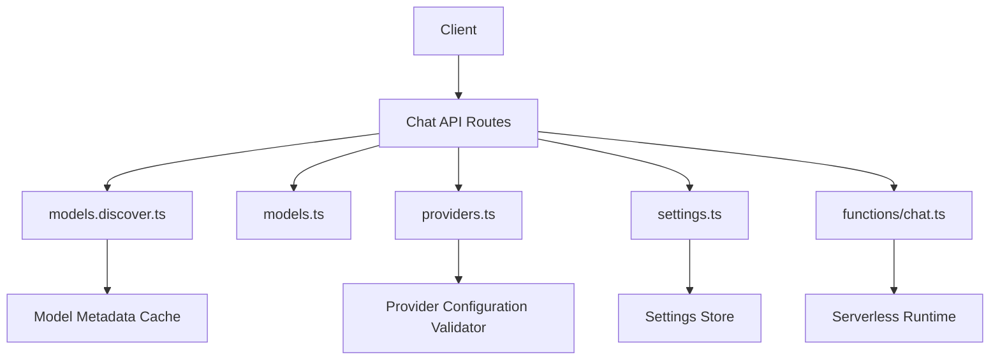
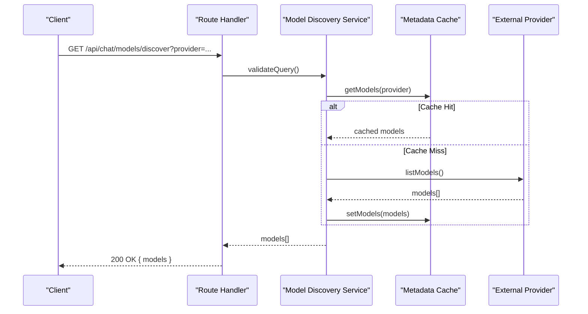
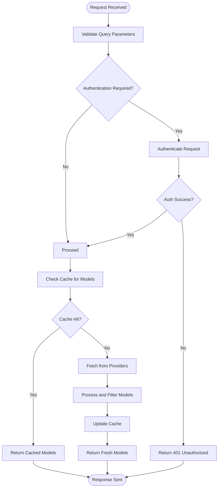
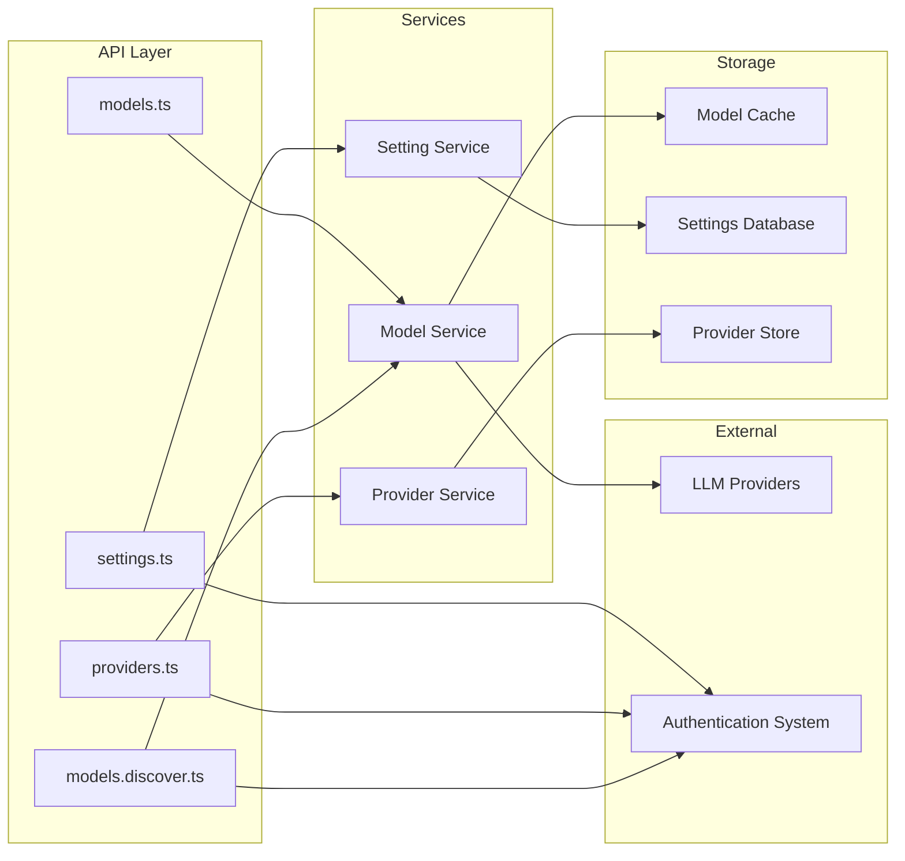

# Model Management

<cite>
**Referenced Files in This Document**
- [models.discover.ts](file://apps/web/src/routes/api/chat/models.discover.ts)
- [models.ts](file://apps/web/src/routes/api/chat/models.ts)
- [providers.ts](file://apps/web/src/routes/api/chat/providers.ts)
- [settings.ts](file://apps/web/src/routes/api/chat/settings.ts)
- [chat.ts](file://functions/chat.ts)
- [openapi.json](file://apps/web/openapi.json)
</cite>

## Table of Contents

1. [Introduction](#introduction)
2. [Project Structure](#project-structure)
3. [Core Components](#core-components)
4. [Architecture Overview](#architecture-overview)
5. [Detailed Component Analysis](#detailed-component-analysis)
6. [Dependency Analysis](#dependency-analysis)
7. [Performance Considerations](#performance-considerations)
8. [Troubleshooting Guide](#troubleshooting-guide)
9. [Conclusion](#conclusion)

## Introduction

This document provides comprehensive API documentation for Model and Provider management endpoints. It covers:

- Discovering available models
- Configuring providers
- Managing model settings
- Authentication requirements for provider access
- Rate limiting for model discovery
- Caching strategies for model metadata
- Dynamic model loading and registration workflows

The endpoints are implemented as serverless functions and route handlers within the web application, with OpenAPI definitions generated for client consumption.

## Project Structure

Model and Provider management is primarily implemented under the chat API routes and a serverless function entry point:

- apps/web/src/routes/api/chat/models.discover.ts
- apps/web/src/routes/api/chat/models.ts
- apps/web/src/routes/api/chat/providers.ts
- apps/web/src/routes/api/chat/settings.ts
- functions/chat.ts
- apps/web/openapi.json (generated OpenAPI spec)

**Diagram sources**

- [models.discover.ts](file://apps/web/src/routes/api/chat/models.discover.ts)
- [models.ts](file://apps/web/src/routes/api/chat/models.ts)
- [providers.ts](file://apps/web/src/routes/api/chat/providers.ts)
- [settings.ts](file://apps/web/src/routes/api/chat/settings.ts)
- [chat.ts](file://functions/chat.ts)

**Section sources**

- [models.discover.ts](file://apps/web/src/routes/api/chat/models.discover.ts)
- [models.ts](file://apps/web/src/routes/api/chat/models.ts)
- [providers.ts](file://apps/web/src/routes/api/chat/providers.ts)
- [settings.ts](file://apps/web/src/routes/api/chat/settings.ts)
- [chat.ts](file://functions/chat.ts)
- [openapi.json](file://apps/web/openapi.json)

## Core Components

- Model Discovery Endpoint: Exposes available models, supports filtering by provider and capability, and returns structured metadata.
- Model Management Endpoints: Allow listing, retrieving, updating, and deleting model configurations.
- Provider Configuration Endpoints: Enable adding, validating, updating, and removing provider configurations.
- Settings Endpoints: Manage global and per-model settings that influence runtime behavior.

Key responsibilities:

- Validate request payloads and query parameters
- Enforce authentication where required
- Apply rate limiting on discovery endpoints
- Cache model metadata to reduce external calls
- Persist configuration changes securely

**Section sources**

- [models.discover.ts](file://apps/web/src/routes/api/chat/models.discover.ts)
- [models.ts](file://apps/web/src/routes/api/chat/models.ts)
- [providers.ts](file://apps/web/src/routes/api/chat/providers.ts)
- [settings.ts](file://apps/web/src/routes/api/chat/settings.ts)

## Architecture Overview

The system follows a layered architecture:

- HTTP layer: Route handlers expose RESTful endpoints
- Service layer: Business logic for validation, discovery, and persistence
- Storage layer: Persistent stores for settings and provider configurations
- External integrations: LLM providers accessed via SDKs or HTTP clients

**Diagram sources**

- [models.discover.ts](file://apps/web/src/routes/api/chat/models.discover.ts)
- [models.ts](file://apps/web/src/routes/api/chat/models.ts)

## Detailed Component Analysis

### Model Discovery Endpoint

- Method: GET
- URL Pattern: /api/chat/models/discover
- Query Parameters:
  - provider: Filter models by provider name
  - capabilities: Comma-separated list of capabilities (e.g., text-generation, image-generation)
  - limit: Maximum number of results
  - offset: Pagination offset
- Response Schema:
  - models: Array of model objects
    - id: string
    - name: string
    - provider: string
    - capabilities: string[]
    - status: enum("active", "inactive")
    - metadata: object
- Authentication: Optional based on provider requirements
- Rate Limiting: Applied to prevent abuse
- Caching: In-memory cache with TTL for model metadata

**Diagram sources**

- [models.discover.ts](file://apps/web/src/routes/api/chat/models.discover.ts)

**Section sources**

- [models.discover.ts](file://apps/web/src/routes/api/chat/models.discover.ts)

### Model Management Endpoints

- List Models: GET /api/chat/models
- Get Model: GET /api/chat/models/{id}
- Update Model: PUT /api/chat/models/{id}
- Delete Model: DELETE /api/chat/models/{id}
- Create Model: POST /api/chat/models

Request/Response Schemas:

- Create/Update Model Request:
  - name: string (required)
  - provider: string (required)
  - modelId: string (required)
  - capabilities: string[] (optional)
  - settings: object (optional)
- Response:
  - id: string
  - name: string
  - provider: string
  - modelId: string
  - capabilities: string[]
  - settings: object
  - createdAt: timestamp
  - updatedAt: timestamp

Authentication: Required for write operations
Validation: Provider must be configured and active
Error Handling: Returns appropriate HTTP status codes

**Section sources**

- [models.ts](file://apps/web/src/routes/api/chat/models.ts)

### Provider Configuration Endpoints

- List Providers: GET /api/chat/providers
- Get Provider: GET /api/chat/providers/{name}
- Update Provider: PUT /api/chat/providers/{name}
- Delete Provider: DELETE /api/chat/providers/{name}
- Test Provider: POST /api/chat/providers/{name}/test

Request/Response Schemas:

- Update Provider Request:
  - apiKey: string (required for most providers)
  - baseUrl: string (optional)
  - timeout: number (optional)
  - retryAttempts: number (optional)
  - customHeaders: object (optional)
- Response:
  - name: string
  - type: string
  - status: enum("configured", "testing", "error")
  - lastTested: timestamp
  - configuration: object

Authentication: Admin privileges required
Validation: Provider-specific schema validation
Testing: Validates connectivity and credentials

**Section sources**

- [providers.ts](file://apps/web/src/routes/api/chat/providers.ts)

### Settings Management Endpoints

- Get Settings: GET /api/chat/settings
- Update Settings: PUT /api/chat/settings
- Reset Settings: POST /api/chat/settings/reset

Request/Response Schemas:

- Update Settings Request:
  - defaultProvider: string (optional)
  - maxRetries: number (optional)
  - cacheTTL: number (optional)
  - rateLimitPerMinute: number (optional)
  - featureFlags: object (optional)
- Response:
  - settings: object
  - updatedAt: timestamp

Authentication: Admin privileges required
Persistence: Settings stored in persistent storage
Defaults: System defaults applied for missing values

**Section sources**

- [settings.ts](file://apps/web/src/routes/api/chat/settings.ts)

## Dependency Analysis

The model and provider management system has clear dependency relationships:

**Diagram sources**

- [models.discover.ts](file://apps/web/src/routes/api/chat/models.discover.ts)
- [models.ts](file://apps/web/src/routes/api/chat/models.ts)
- [providers.ts](file://apps/web/src/routes/api/chat/providers.ts)
- [settings.ts](file://apps/web/src/routes/api/chat/settings.ts)

**Section sources**

- [models.discover.ts](file://apps/web/src/routes/api/chat/models.discover.ts)
- [models.ts](file://apps/web/src/routes/api/chat/models.ts)
- [providers.ts](file://apps/web/src/routes/api/chat/providers.ts)
- [settings.ts](file://apps/web/src/routes/api/chat/settings.ts)

## Performance Considerations

- **Caching Strategy**: Implement intelligent caching for model metadata with configurable TTL
- **Rate Limiting**: Apply rate limiting to prevent excessive model discovery requests
- **Connection Pooling**: Use connection pooling for database and external API calls
- **Lazy Loading**: Load provider configurations only when needed
- **Pagination**: Support pagination for large model lists
- **Compression**: Enable response compression for large payloads
- **Async Processing**: Use async processing for time-consuming operations like provider testing

## Troubleshooting Guide

Common issues and solutions:

### Authentication Errors

- Ensure proper API keys are configured for providers
- Verify user permissions for admin-only endpoints
- Check token expiration and refresh mechanisms

### Provider Connection Issues

- Validate provider endpoint URLs
- Test network connectivity to provider services
- Review timeout and retry configurations

### Model Discovery Failures

- Clear model cache if stale data is returned
- Check provider availability and status
- Verify rate limiting thresholds

### Configuration Validation Errors

- Review provider-specific configuration schemas
- Validate environment variables and secrets
- Check for deprecated configuration fields

**Section sources**

- [models.discover.ts](file://apps/web/src/routes/api/chat/models.discover.ts)
- [providers.ts](file://apps/web/src/routes/api/chat/providers.ts)
- [settings.ts](file://apps/web/src/routes/api/chat/settings.ts)

## Conclusion

The Model and Provider management system provides a comprehensive API for discovering models, configuring providers, and managing settings. The architecture supports scalability through caching, rate limiting, and asynchronous processing. Proper authentication and validation ensure security while maintaining flexibility for different provider configurations.

Key benefits:

- Centralized model discovery across multiple providers
- Flexible provider configuration with validation
- Secure settings management with persistence
- Scalable architecture with caching and rate limiting
- Comprehensive error handling and troubleshooting support

[No sources needed since this section summarizes without analyzing specific files]
