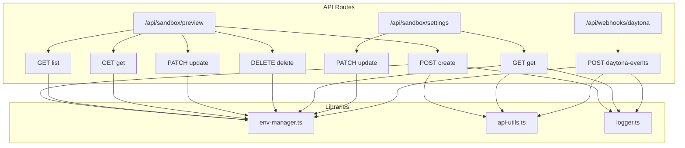
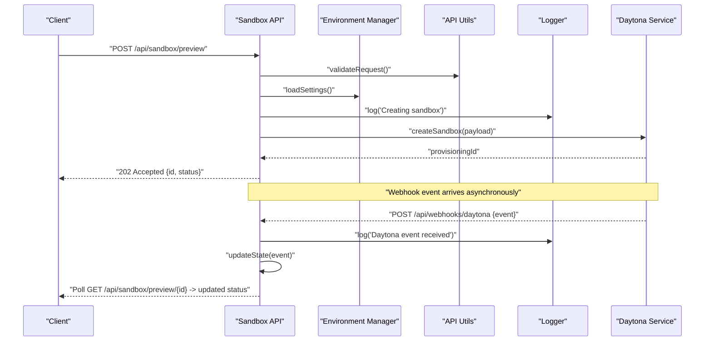
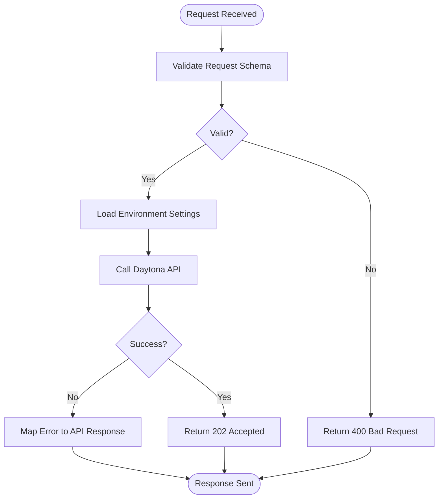
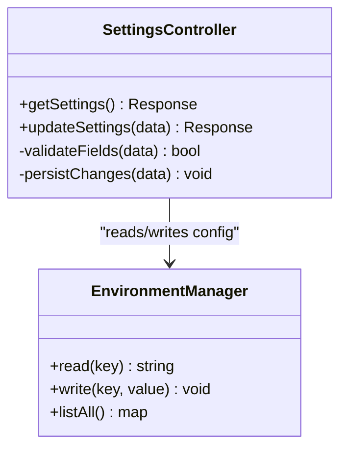
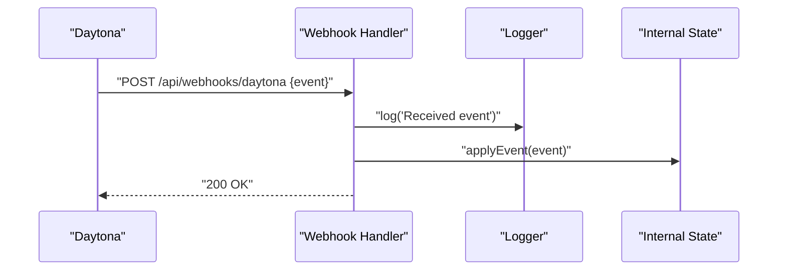
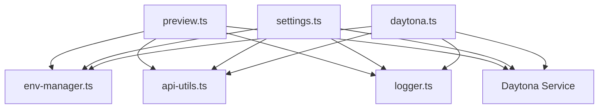

# Sandbox API

<cite>
**Referenced Files in This Document**
- [preview.ts](file://apps/web/src/routes/api/sandbox/preview.ts)
- [settings.ts](file://apps/web/src/routes/api/sandbox/settings.ts)
- [daytona.ts](file://apps/web/src/routes/api/webhooks/daytona.ts)
- [daytona.test.ts](file://apps/web/src/routes/api/webhooks/-daytona.test.ts)
- [env-manager.ts](file://apps/web/src/lib/env-manager.ts)
- [api-utils.ts](file://apps/web/src/lib/api-utils.ts)
- [logger.ts](file://apps/web/src/lib/logger.ts)
- [openapi.json](file://apps/web/openapi.json)
</cite>

## Table of Contents

1. [Introduction](#introduction)
2. [Project Structure](#project-structure)
3. [Core Components](#core-components)
4. [Architecture Overview](#architecture-overview)
5. [Detailed Component Analysis](#detailed-component-analysis)
6. [Dependency Analysis](#dependency-analysis)
7. [Performance Considerations](#performance-considerations)
8. [Troubleshooting Guide](#troubleshooting-guide)
9. [Conclusion](#conclusion)
10. [Appendices](#appendices)

## Introduction

This document provides detailed API documentation for Fleet Pi’s Sandbox Management endpoints, focusing on sandbox preview environments and settings management. It covers HTTP methods, URL patterns, request/response schemas, lifecycle operations, environment configuration, resource management, and integration with the Daytona sandbox infrastructure. It also includes examples of API calls, error handling strategies, deployment patterns, security considerations, resource limits, and performance optimization guidance for sandboxed environments.

## Project Structure

The Sandbox Management functionality is implemented as serverless API routes within the web application:

- Preview endpoints for managing sandbox previews are defined under the sandbox route group.
- Settings endpoints manage sandbox-related configuration.
- Webhook handlers integrate with Daytona to receive lifecycle events and status updates.
- Shared utilities provide environment variable access, common API helpers, and logging.

**Diagram sources**

- [preview.ts](file://apps/web/src/routes/api/sandbox/preview.ts)
- [settings.ts](file://apps/web/src/routes/api/sandbox/settings.ts)
- [daytona.ts](file://apps/web/src/routes/api/webhooks/daytona.ts)
- [env-manager.ts](file://apps/web/src/lib/env-manager.ts)
- [api-utils.ts](file://apps/web/src/lib/api-utils.ts)
- [logger.ts](file://apps/web/src/lib/logger.ts)

**Section sources**

- [preview.ts](file://apps/web/src/routes/api/sandbox/preview.ts)
- [settings.ts](file://apps/web/src/routes/api/sandbox/settings.ts)
- [daytona.ts](file://apps/web/src/routes/api/webhooks/daytona.ts)
- [env-manager.ts](file://apps/web/src/lib/env-manager.ts)
- [api-utils.ts](file://apps/web/src/lib/api-utils.ts)
- [logger.ts](file://apps/web/src/lib/logger.ts)

## Core Components

- Sandbox Preview Endpoints: Provide CRUD-like operations for creating, listing, retrieving, updating, and deleting sandbox preview environments. These endpoints coordinate with Daytona to provision and manage isolated containers or workspaces.
- Sandbox Settings Endpoints: Manage sandbox configuration such as default runtime images, resource quotas, timeouts, and feature flags.
- Daytona Webhook Handler: Receives asynchronous lifecycle events from Daytona (e.g., provisioning, ready, failed, terminated) and updates internal state accordingly.
- Environment Manager: Centralizes access to environment variables and secrets required by sandbox operations.
- API Utilities: Common helpers for request validation, response formatting, and error handling.
- Logger: Structured logging for observability and debugging.

**Section sources**

- [preview.ts](file://apps/web/src/routes/api/sandbox/preview.ts)
- [settings.ts](file://apps/web/src/routes/api/sandbox/settings.ts)
- [daytona.ts](file://apps/web/src/routes/api/webhooks/daytona.ts)
- [env-manager.ts](file://apps/web/src/lib/env-manager.ts)
- [api-utils.ts](file://apps/web/src/lib/api-utils.ts)
- [logger.ts](file://apps/web/src/lib/logger.ts)

## Architecture Overview

The Sandbox API integrates with Daytona via HTTP requests and webhook callbacks. The flow typically involves:

- Client invokes a preview endpoint to create or manage a sandbox.
- The API validates inputs, resolves environment configuration, and calls Daytona APIs.
- Daytona provisions resources and emits lifecycle events.
- The webhook handler receives events and updates the system state.
- Clients poll or subscribe to status changes through the preview endpoints.

**Diagram sources**

- [preview.ts](file://apps/web/src/routes/api/sandbox/preview.ts)
- [daytona.ts](file://apps/web/src/routes/api/webhooks/daytona.ts)
- [env-manager.ts](file://apps/web/src/lib/env-manager.ts)
- [api-utils.ts](file://apps/web/src/lib/api-utils.ts)
- [logger.ts](file://apps/web/src/lib/logger.ts)

## Detailed Component Analysis

### Sandbox Preview Endpoints

These endpoints manage the lifecycle of sandbox preview environments:

- POST /api/sandbox/preview: Create a new sandbox preview.
- GET /api/sandbox/preview: List available sandboxes.
- GET /api/sandbox/preview/:id: Retrieve details of a specific sandbox.
- PATCH /api/sandbox/preview/:id: Update sandbox configuration or metadata.
- DELETE /api/sandbox/preview/:id: Terminate and remove a sandbox.

Key behaviors:

- Input validation and schema enforcement using shared utilities.
- Environment resolution for image selection, resource limits, and timeouts.
- Asynchronous provisioning via Daytona; responses may be accepted immediately with polling semantics.
- Error mapping from Daytona errors to consistent API responses.

**Diagram sources**

- [preview.ts](file://apps/web/src/routes/api/sandbox/preview.ts)
- [api-utils.ts](file://apps/web/src/lib/api-utils.ts)
- [env-manager.ts](file://apps/web/src/lib/env-manager.ts)

**Section sources**

- [preview.ts](file://apps/web/src/routes/api/sandbox/preview.ts)
- [api-utils.ts](file://apps/web/src/lib/api-utils.ts)
- [env-manager.ts](file://apps/web/src/lib/env-manager.ts)

### Sandbox Settings Endpoints

These endpoints manage sandbox configuration:

- GET /api/sandbox/settings: Retrieve current sandbox settings.
- PATCH /api/sandbox/settings: Update sandbox settings.

Key behaviors:

- Read-only and write operations for settings like default container images, CPU/memory limits, network policies, and feature toggles.
- Validation ensures only allowed fields are updated.
- Changes propagate to subsequent sandbox creations.

**Diagram sources**

- [settings.ts](file://apps/web/src/routes/api/sandbox/settings.ts)
- [env-manager.ts](file://apps/web/src/lib/env-manager.ts)

**Section sources**

- [settings.ts](file://apps/web/src/routes/api/sandbox/settings.ts)
- [env-manager.ts](file://apps/web/src/lib/env-manager.ts)

### Daytona Webhook Integration

The webhook handler processes lifecycle events emitted by Daytona:

- POST /api/webhooks/daytona: Receives events such as provisioning, ready, failed, terminated.
- Updates internal state based on event payloads.
- Logs all events for observability and debugging.

**Diagram sources**

- [daytona.ts](file://apps/web/src/routes/api/webhooks/daytona.ts)
- [logger.ts](file://apps/web/src/lib/logger.ts)

**Section sources**

- [daytona.ts](file://apps/web/src/routes/api/webhooks/daytona.ts)
- [-daytona.test.ts](file://apps/web/src/routes/api/webhooks/-daytona.test.ts)
- [logger.ts](file://apps/web/src/lib/logger.ts)

## Dependency Analysis

The Sandbox API depends on several libraries and external services:

- Environment Manager: Provides centralized access to configuration and secrets.
- API Utils: Offers request validation, response formatting, and error mapping.
- Logger: Ensures structured logging across components.
- Daytona Service: External orchestration service responsible for provisioning and managing sandbox containers.

**Diagram sources**

- [preview.ts](file://apps/web/src/routes/api/sandbox/preview.ts)
- [settings.ts](file://apps/web/src/routes/api/sandbox/settings.ts)
- [daytona.ts](file://apps/web/src/routes/api/webhooks/daytona.ts)
- [env-manager.ts](file://apps/web/src/lib/env-manager.ts)
- [api-utils.ts](file://apps/web/src/lib/api-utils.ts)
- [logger.ts](file://apps/web/src/lib/logger.ts)

**Section sources**

- [preview.ts](file://apps/web/src/routes/api/sandbox/preview.ts)
- [settings.ts](file://apps/web/src/routes/api/sandbox/settings.ts)
- [daytona.ts](file://apps/web/src/routes/api/webhooks/daytona.ts)
- [env-manager.ts](file://apps/web/src/lib/env-manager.ts)
- [api-utils.ts](file://apps/web/src/lib/api-utils.ts)
- [logger.ts](file://apps/web/src/lib/logger.ts)

## Performance Considerations

- Use asynchronous operations for long-running Daytona provisioning to avoid blocking requests.
- Implement caching for frequently accessed settings to reduce environment lookups.
- Apply rate limiting on preview creation endpoints to prevent resource exhaustion.
- Optimize payload sizes by returning minimal data in list operations.
- Leverage connection pooling when calling Daytona APIs to reduce latency.

[No sources needed since this section provides general guidance]

## Troubleshooting Guide

Common issues and resolutions:

- Validation Errors: Ensure request payloads conform to expected schemas. Check field types and required keys.
- Daytona Connectivity: Verify network access and credentials for Daytona service. Inspect logs for upstream errors.
- Resource Limits: Review environment settings for CPU/memory constraints that may cause provisioning failures.
- Event Handling: Confirm webhook delivery and parsing logic. Validate event payloads against expected formats.

**Section sources**

- [api-utils.ts](file://apps/web/src/lib/api-utils.ts)
- [logger.ts](file://apps/web/src/lib/logger.ts)
- [-daytona.test.ts](file://apps/web/src/routes/api/webhooks/-daytona.test.ts)

## Conclusion

Fleet Pi’s Sandbox Management API provides robust endpoints for managing preview environments and settings, integrating seamlessly with Daytona for container orchestration and isolation. By following the documented patterns for request validation, error handling, and lifecycle management, developers can build reliable and secure sandbox workflows. Proper configuration, monitoring, and optimization ensure efficient resource utilization and responsive user experiences.

[No sources needed since this section summarizes without analyzing specific files]

## Appendices

### API Reference Summary

- POST /api/sandbox/preview: Create a new sandbox preview.
- GET /api/sandbox/preview: List available sandboxes.
- GET /api/sandbox/preview/:id: Retrieve sandbox details.
- PATCH /api/sandbox/preview/:id: Update sandbox configuration.
- DELETE /api/sandbox/preview/:id: Terminate and remove a sandbox.
- GET /api/sandbox/settings: Get current sandbox settings.
- PATCH /api/sandbox/settings: Update sandbox settings.
- POST /api/webhooks/daytona: Receive Daytona lifecycle events.

**Section sources**

- [preview.ts](file://apps/web/src/routes/api/sandbox/preview.ts)
- [settings.ts](file://apps/web/src/routes/api/sandbox/settings.ts)
- [daytona.ts](file://apps/web/src/routes/api/webhooks/daytona.ts)

### OpenAPI Specification

For machine-readable definitions, refer to the generated OpenAPI specification file.

**Section sources**

- [openapi.json](file://apps/web/openapi.json)
