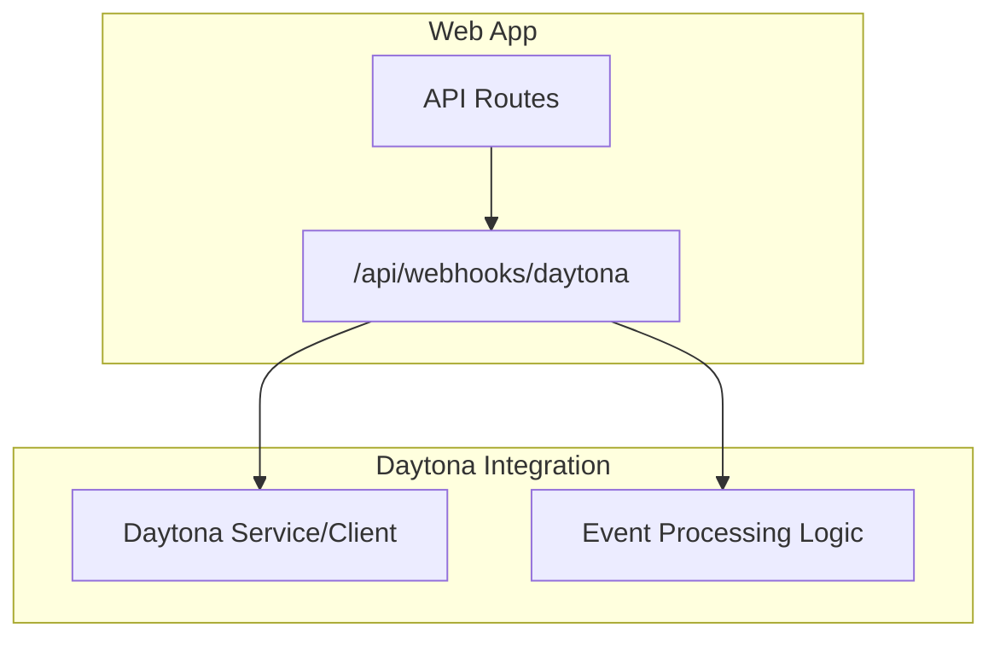
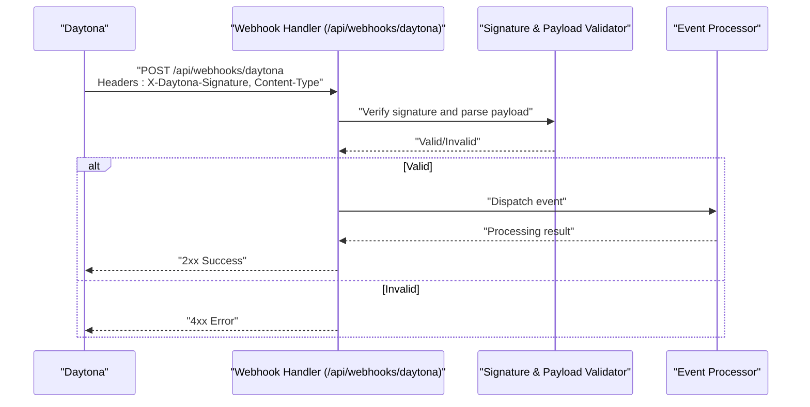
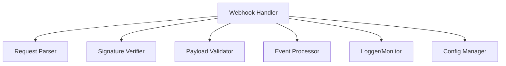

# Webhook API

<cite>
**Referenced Files in This Document**
- [daytona.ts](file://apps/web/src/routes/api/webhooks/daytona.ts)
- [-daytona.test.ts](file://apps/web/src/routes/api/webhooks/-daytona.test.ts)
- [daytona.md](file://docs/daytona.md)
</cite>

## Table of Contents

1. [Introduction](#introduction)
2. [Project Structure](#project-structure)
3. [Core Components](#core-components)
4. [Architecture Overview](#architecture-overview)
5. [Detailed Component Analysis](#detailed-component-analysis)
6. [Dependency Analysis](#dependency-analysis)
7. [Performance Considerations](#performance-considerations)
8. [Troubleshooting Guide](#troubleshooting-guide)
9. [Conclusion](#conclusion)
10. [Appendices](#appendices)

## Introduction

This document provides comprehensive API documentation for Fleet Pi’s webhook endpoints, with a focus on the Daytona webhook integration. It covers HTTP methods, URL patterns, request/response schemas, event payload formats, signature verification, retry mechanisms, registration and filtering, delivery guarantees, implementation examples, error handling strategies, monitoring approaches, security considerations, payload validation, and debugging techniques.

## Project Structure

The webhook functionality is implemented as an API route within the web application:

- Webhook handler: apps/web/src/routes/api/webhooks/daytona.ts
- Tests: apps/web/src/routes/api/webhooks/-daytona.test.ts
- Contextual documentation: docs/daytona.md

[No sources needed since this diagram shows conceptual workflow, not actual code structure]

## Core Components

- Webhook endpoint: An HTTP POST handler at /api/webhooks/daytona that receives events from Daytona.
- Event processing: Validates incoming requests, verifies signatures, parses payloads, and dispatches to internal handlers.
- Response semantics: Returns appropriate HTTP status codes to signal success or failure, enabling reliable retries.

Key responsibilities:

- Validate request headers (e.g., content-type, signature).
- Parse and validate event payloads against expected schemas.
- Enforce idempotency where applicable to prevent duplicate processing.
- Emit structured logs and metrics for observability.

**Section sources**

- [daytona.ts](file://apps/web/src/routes/api/webhooks/daytona.ts)
- [-daytona.test.ts](file://apps/web/src/routes/api/webhooks/-daytona.test.ts)

## Architecture Overview

The Daytona webhook flow involves the following steps:

1. Daytona sends an HTTP POST to /api/webhooks/daytona with an event payload and signature headers.
2. The handler validates the signature using shared secrets or public keys.
3. The payload is parsed and validated against the expected schema.
4. The event is processed by internal logic (e.g., state updates, notifications).
5. The handler returns a response indicating success or failure.

**Diagram sources**

- [daytona.ts](file://apps/web/src/routes/api/webhooks/daytona.ts)
- [-daytona.test.ts](file://apps/web/src/routes/api/webhooks/-daytona.test.ts)

## Detailed Component Analysis

### Webhook Endpoint: /api/webhooks/daytona

- Method: POST
- URL pattern: /api/webhooks/daytona
- Authentication: Signature verification via headers provided by Daytona
- Request headers:
  - Content-Type: application/json
  - X-Daytona-Signature: cryptographic signature over the payload
- Request body: JSON event payload containing event metadata and data fields
- Responses:
  - 2xx: Accepted and processed successfully
  - 4xx: Validation errors (invalid signature, malformed payload)
  - 5xx: Internal server errors during processing

Implementation notes:

- Enforce strict content-type validation.
- Verify signature using the configured secret/key before parsing payload.
- Validate payload schema; reject unknown fields if required.
- Implement idempotency based on event IDs to avoid duplicates.
- Return consistent error responses with actionable messages.

**Section sources**

- [daytona.ts](file://apps/web/src/routes/api/webhooks/daytona.ts)
- [-daytona.test.ts](file://apps/web/src/routes/api/webhooks/-daytona.test.ts)

### Event Payload Schema

Expected fields in the event payload include:

- event_id: Unique identifier for the event
- event_type: Type of event (e.g., workspace.created, session.updated)
- timestamp: ISO 8601 timestamp when the event occurred
- data: Object containing event-specific details

Validation rules:

- All required fields must be present.
- event_id must be unique per event source.
- event_type must match known values.
- timestamp must be a valid ISO 8601 string.
- data must conform to the schema defined for each event_type.

Example payload structure:

- { "event_id": "...", "event_type": "...", "timestamp": "...", "data": {...} }

**Section sources**

- [daytona.ts](file://apps/web/src/routes/api/webhooks/daytona.ts)
- [-daytona.test.ts](file://apps/web/src/routes/api/webhooks/-daytona.test.ts)

### Signature Verification

- Algorithm: HMAC-SHA256 (or equivalent) over the raw request body
- Secret management: Shared secret stored securely in environment variables
- Header format: X-Daytona-Signature contains the computed signature
- Verification steps:
  1. Extract signature from header
  2. Compute expected signature using the secret and raw body
  3. Compare computed signature with provided signature using constant-time comparison

Security considerations:

- Never log raw payloads or secrets
- Rotate secrets periodically
- Reject requests with invalid or missing signatures

**Section sources**

- [daytona.ts](file://apps/web/src/routes/api/webhooks/daytona.ts)
- [-daytona.test.ts](file://apps/web/src/routes/api/webhooks/-daytona.test.ts)

### Retry Mechanisms and Delivery Guarantees

- Idempotency: Use event_id to ensure duplicate events are processed only once
- Retry policy: Clients should implement exponential backoff with jitter
- Delivery guarantees: At-least-once delivery is typical; design handlers to be idempotent
- Failure handling: Return non-2xx responses to signal failures and trigger retries

Best practices:

- Acknowledge receipt immediately if possible
- Queue events for async processing when necessary
- Monitor retry counts and alert on excessive failures

**Section sources**

- [daytona.ts](file://apps/web/src/routes/api/webhooks/daytona.ts)
- [-daytona.test.ts](file://apps/web/src/routes/api/webhooks/-daytona.test.ts)

### Event Filtering and Registration

- Registration: Webhook endpoints are registered through the application’s routing system
- Filtering: Filter events by event_type or specific criteria within the handler
- Configuration: Use environment variables to enable/disable specific event types
- Testing: Mock events in tests to verify filtering logic

Implementation approach:

- Maintain a registry of supported event types
- Apply filters early in the processing pipeline
- Log filtered events for observability

**Section sources**

- [daytona.ts](file://apps/web/src/routes/api/webhooks/daytona.ts)
- [-daytona.test.ts](file://apps/web/src/routes/api/webhooks/-daytona.test.ts)

### Implementation Examples

Basic webhook handler structure:

- Validate content-type
- Verify signature
- Parse and validate payload
- Process event based on type
- Return appropriate HTTP status

Error handling patterns:

- Return 400 for validation errors
- Return 401/403 for authentication failures
- Return 500 for unexpected errors
- Include descriptive error messages

Monitoring and logging:

- Log all incoming requests with redacted sensitive data
- Track processing times and error rates
- Emit metrics for webhook throughput and latency

**Section sources**

- [daytona.ts](file://apps/web/src/routes/api/webhooks/daytona.ts)
- [-daytona.test.ts](file://apps/web/src/routes/api/webhooks/-daytona.test.ts)

## Dependency Analysis

The webhook handler depends on:

- Request parsing utilities for JSON bodies
- Cryptographic libraries for signature verification
- Logging and monitoring frameworks
- Application configuration for secrets and settings

**Diagram sources**

- [daytona.ts](file://apps/web/src/routes/api/webhooks/daytona.ts)

**Section sources**

- [daytona.ts](file://apps/web/src/routes/api/webhooks/daytona.ts)

## Performance Considerations

- Keep payload sizes minimal to reduce network overhead
- Use asynchronous processing for long-running operations
- Implement rate limiting to prevent abuse
- Cache frequently accessed configuration values
- Optimize database writes with batching when possible

## Troubleshooting Guide

Common issues and solutions:

- Signature verification failures: Check secret configuration and payload integrity
- Malformed payloads: Validate content-type and JSON structure
- Duplicate processing: Ensure idempotency checks are working correctly
- High latency: Profile event processing and optimize bottlenecks

Debugging techniques:

- Enable detailed logging for webhook requests
- Use request tracing to follow event processing
- Test with mock payloads to isolate issues
- Monitor error rates and alert on anomalies

**Section sources**

- [-daytona.test.ts](file://apps/web/src/routes/api/webhooks/-daytona.test.ts)

## Conclusion

Fleet Pi’s webhook API provides a secure and reliable mechanism for integrating with Daytona. By following the specifications outlined in this document, developers can implement robust webhook handlers that handle events efficiently while maintaining security and performance standards.

## Appendices

### Security Checklist

- [ ] Configure strong secrets for signature verification
- [ ] Implement proper input validation
- [ ] Add rate limiting and abuse prevention
- [ ] Monitor for suspicious activity
- [ ] Regularly rotate secrets and update configurations

### Monitoring Metrics

- Webhook request volume
- Processing latency percentiles
- Error rates by type
- Signature verification failures
- Duplicate event detection

**Section sources**

- [daytona.md](file://docs/daytona.md)
