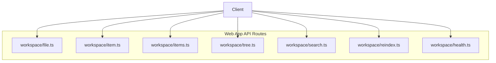
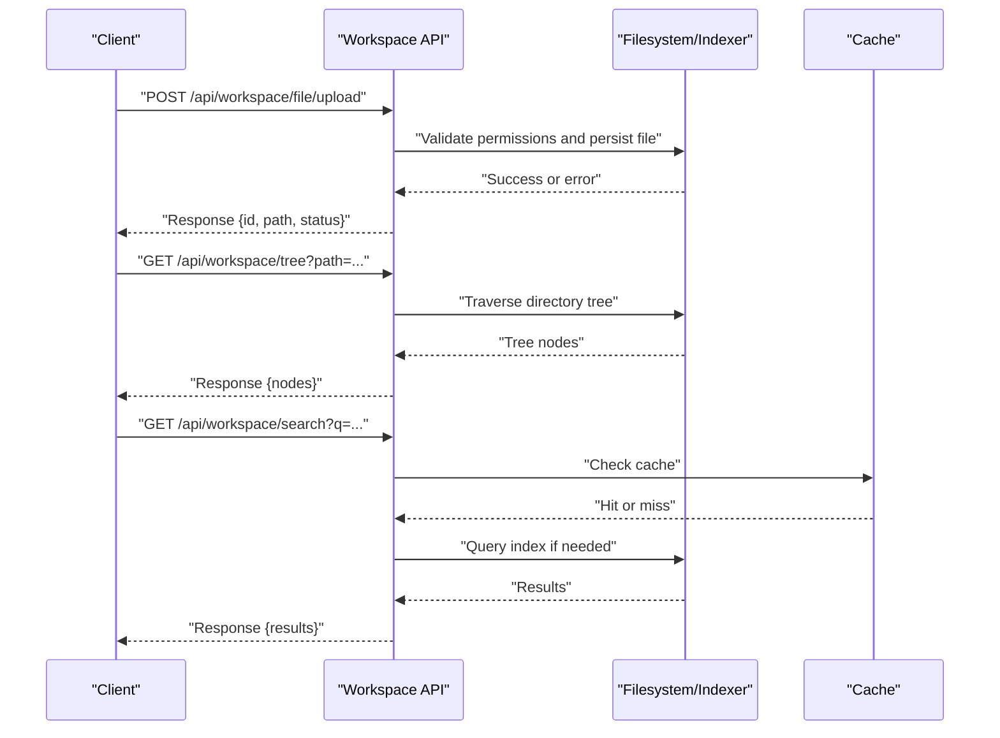
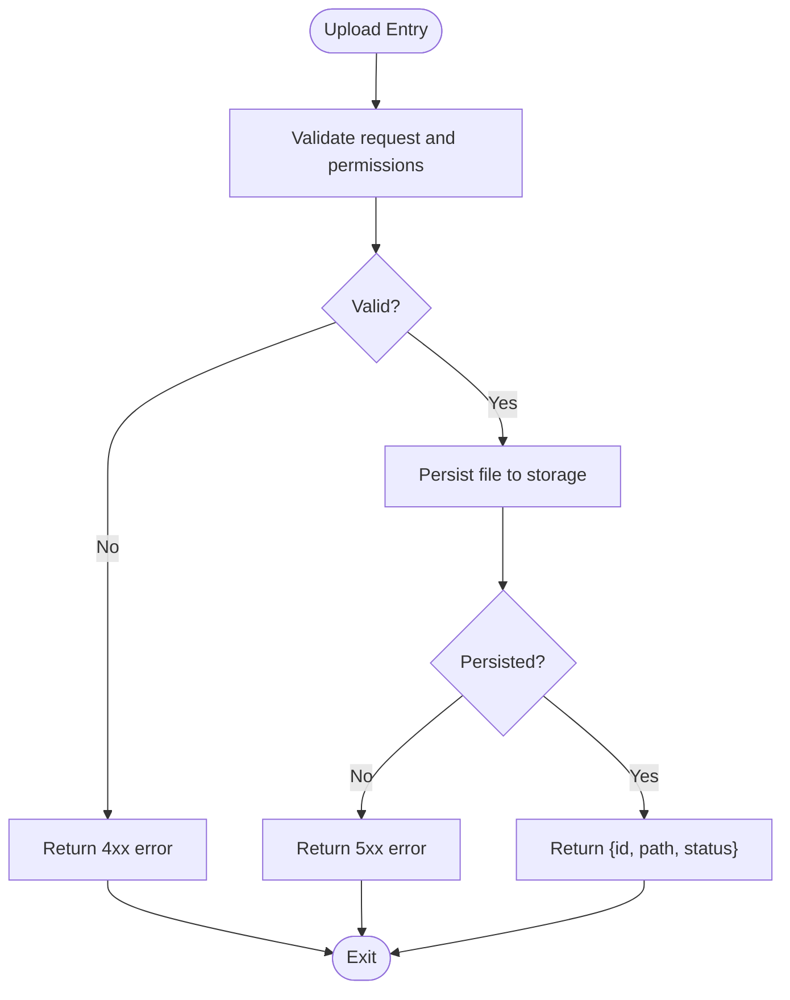
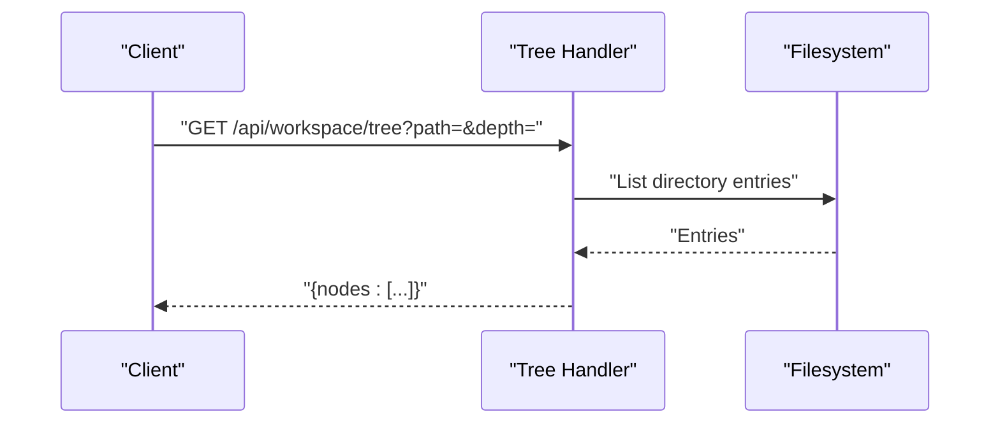
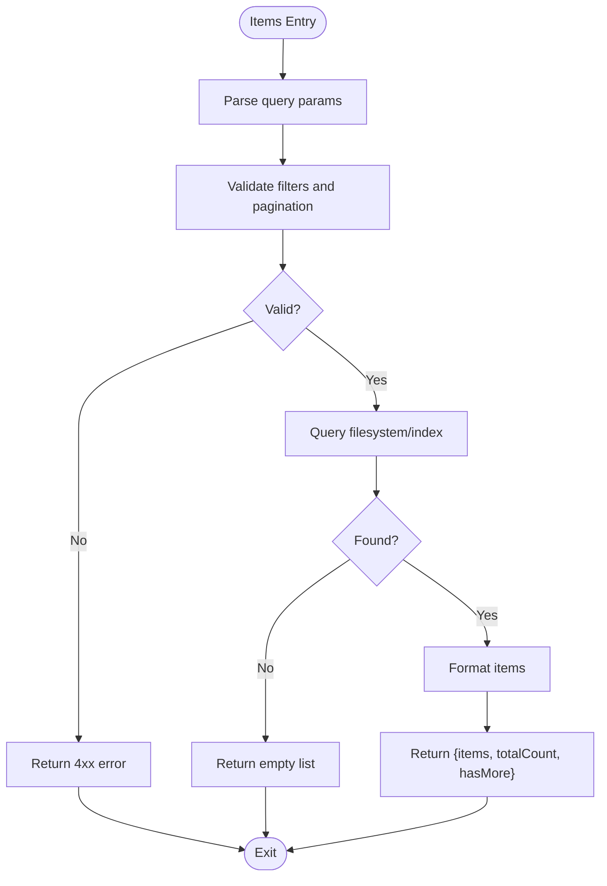
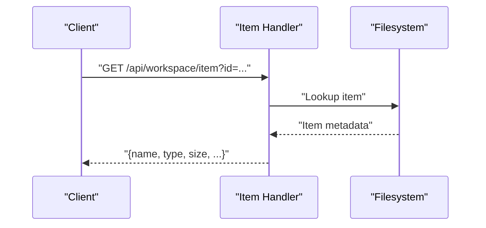
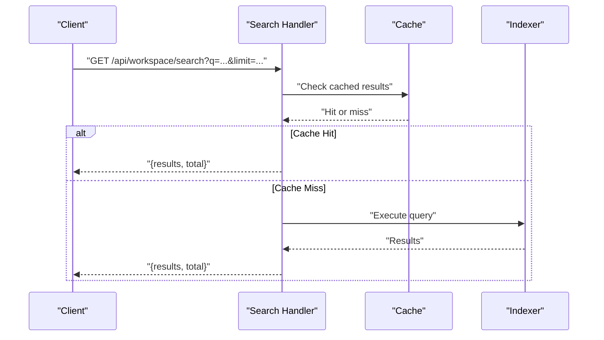
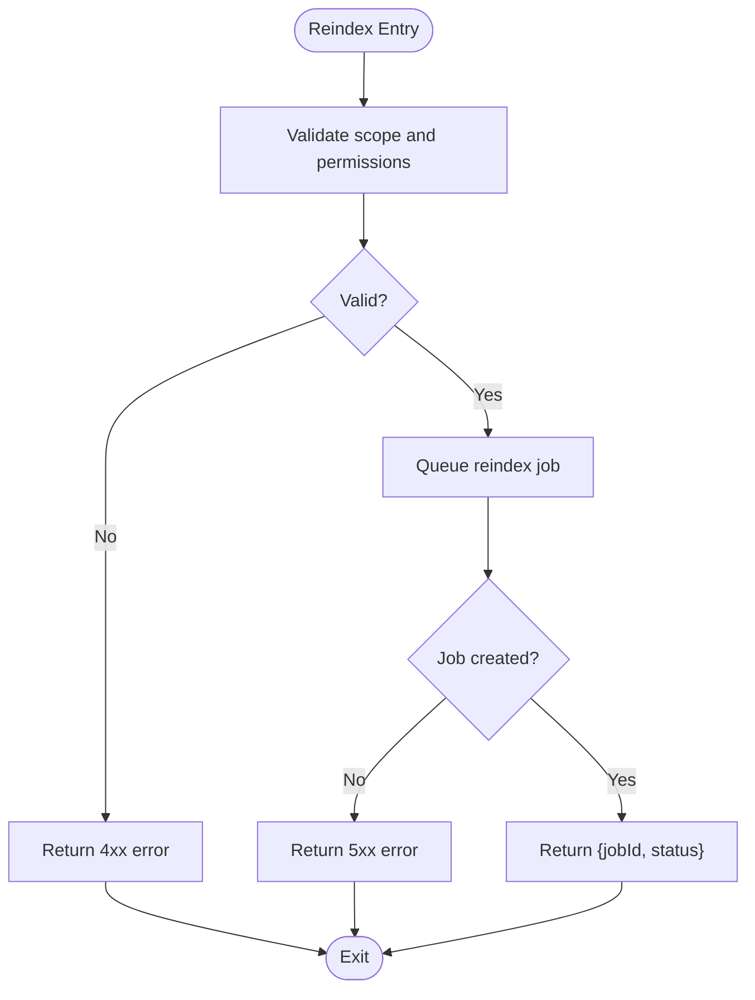
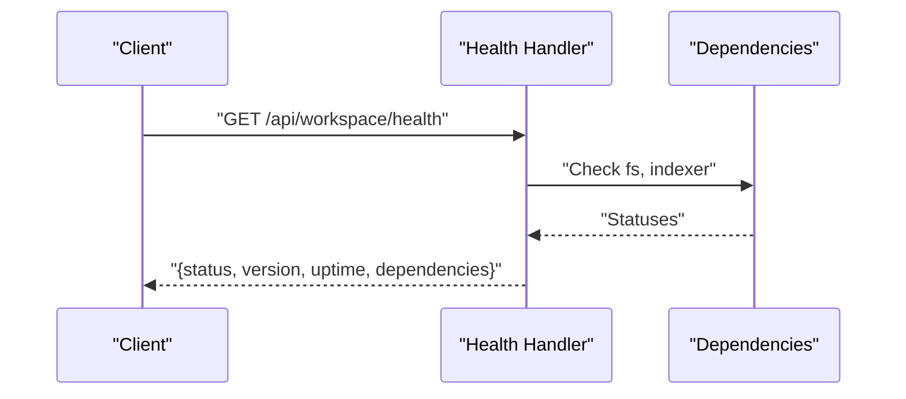
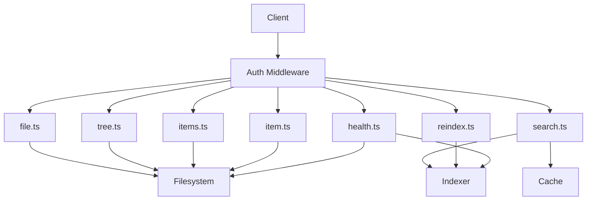

# Workspace API

<cite>
**Referenced Files in This Document**
- [file.ts](file://apps/web/src/routes/api/workspace/file.ts)
- [item.ts](file://apps/web/src/routes/api/workspace/item.ts)
- [items.ts](file://apps/web/src/routes/api/workspace/items.ts)
- [tree.ts](file://apps/web/src/routes/api/workspace/tree.ts)
- [search.ts](file://apps/web/src/routes/api/workspace/search.ts)
- [reindex.ts](file://apps/web/src/routes/api/workspace/reindex.ts)
- [health.ts](file://apps/web/src/routes/api/workspace/health.ts)
</cite>

## Table of Contents

1. [Introduction](#introduction)
2. [Project Structure](#project-structure)
3. [Core Components](#core-components)
4. [Architecture Overview](#architecture-overview)
5. [Detailed Component Analysis](#detailed-component-analysis)
6. [Dependency Analysis](#dependency-analysis)
7. [Performance Considerations](#performance-considerations)
8. [Troubleshooting Guide](#troubleshooting-guide)
9. [Conclusion](#conclusion)
10. [Appendices](#appendices)

## Introduction

This document provides detailed API documentation for Fleet Pi’s Workspace Management endpoints. It covers file operations, directory tree navigation, search functionality, and workspace indexing. The goal is to enable clients to integrate with the workspace APIs for uploading/downloading files, traversing directories, searching content, and managing indexing state. Authentication, error handling, rate limiting, security considerations, and performance guidance are included to support robust integrations.

## Project Structure

The Workspace API is implemented as a set of route handlers under the web application’s API routes. Each endpoint corresponds to a specific file that defines HTTP methods, URL patterns, request/response schemas, and business logic.

**Diagram sources**

- [file.ts](file://apps/web/src/routes/api/workspace/file.ts)
- [item.ts](file://apps/web/src/routes/api/workspace/item.ts)
- [items.ts](file://apps/web/src/routes/api/workspace/items.ts)
- [tree.ts](file://apps/web/src/routes/api/workspace/tree.ts)
- [search.ts](file://apps/web/src/routes/api/workspace/search.ts)
- [reindex.ts](file://apps/web/src/routes/api/workspace/reindex.ts)
- [health.ts](file://apps/web/src/routes/api/workspace/health.ts)

**Section sources**

- [file.ts](file://apps/web/src/routes/api/workspace/file.ts)
- [item.ts](file://apps/web/src/routes/api/workspace/item.ts)
- [items.ts](file://apps/web/src/routes/api/workspace/items.ts)
- [tree.ts](file://apps/web/src/routes/api/workspace/tree.ts)
- [search.ts](file://apps/web/src/routes/api/workspace/search.ts)
- [reindex.ts](file://apps/web/src/routes/api/workspace/reindex.ts)
- [health.ts](file://apps/web/src/routes/api/workspace/health.ts)

## Core Components

- File Operations: Upload, download, read, write, delete files within a workspace.
- Directory Tree Navigation: Traverse and list directory structures efficiently.
- Search: Full-text or metadata-based search across workspace content.
- Indexing: Trigger and manage reindexing of workspace content.
- Health: Endpoint to check service health and readiness.

These components are exposed via RESTful endpoints defined in the corresponding route files.

**Section sources**

- [file.ts](file://apps/web/src/routes/api/workspace/file.ts)
- [tree.ts](file://apps/web/src/routes/api/workspace/tree.ts)
- [search.ts](file://apps/web/src/routes/api/workspace/search.ts)
- [reindex.ts](file://apps/web/src/routes/api/workspace/reindex.ts)
- [health.ts](file://apps/web/src/routes/api/workspace/health.ts)

## Architecture Overview

The Workspace API follows a straightforward request-response model. Clients authenticate (as required by policy), send requests to specific endpoints, and receive structured responses. Error handling is centralized per endpoint, and health checks provide operational visibility.

**Diagram sources**

- [file.ts](file://apps/web/src/routes/api/workspace/file.ts)
- [tree.ts](file://apps/web/src/routes/api/workspace/tree.ts)
- [search.ts](file://apps/web/src/routes/api/workspace/search.ts)

## Detailed Component Analysis

### File Operations (/api/workspace/file)

- Purpose: Manage individual files within a workspace.
- Typical Methods:
  - POST upload: Upload a file to the workspace.
  - GET download: Download a file from the workspace.
  - PUT update: Update file content or metadata.
  - DELETE remove: Delete a file from the workspace.
- Request/Response Schema:
  - Upload: multipart/form-data with file payload; response includes file identifier and path.
  - Download: query parameters for path; returns binary stream or base64-encoded content depending on client needs.
  - Update: JSON body with fields such as path and content; response confirms update.
  - Delete: path parameter; response indicates success or failure.
- Authentication: Required per policy; typically bearer token or session-based.
- Error Handling: Validation errors, permission denied, not found, server errors.
- Rate Limiting: Enforced per user/IP to prevent abuse.

**Diagram sources**

- [file.ts](file://apps/web/src/routes/api/workspace/file.ts)

**Section sources**

- [file.ts](file://apps/web/src/routes/api/workspace/file.ts)

### Directory Tree Navigation (/api/workspace/tree)

- Purpose: Retrieve hierarchical directory structure for efficient traversal.
- Methods:
  - GET tree: Query with optional path and depth parameters; returns nodes with children indicators.
- Request/Response Schema:
  - Query params: path (optional root), depth (max recursion), includeHidden (boolean).
  - Response: array of nodes with name, type, size, modifiedAt, children flag.
- Authentication: Required per policy.
- Error Handling: Invalid paths, insufficient permissions, filesystem errors.
- Performance: Depth limits and pagination recommended for large trees.

**Diagram sources**

- [tree.ts](file://apps/web/src/routes/api/workspace/tree.ts)

**Section sources**

- [tree.ts](file://apps/web/src/routes/api/workspace/tree.ts)

### Items Listing (/api/workspace/items)

- Purpose: List items (files/directories) with filtering and sorting.
- Methods:
  - GET items: Query with filters like type, extension, modifiedAfter; supports pagination.
- Request/Response Schema:
  - Query params: filter fields, page, pageSize, sortField, sortOrder.
  - Response: items array, totalCount, hasMore.
- Authentication: Required per policy.
- Error Handling: Invalid filters, pagination bounds, permission issues.

**Diagram sources**

- [items.ts](file://apps/web/src/routes/api/workspace/items.ts)

**Section sources**

- [items.ts](file://apps/web/src/routes/api/workspace/items.ts)

### Single Item Details (/api/workspace/item)

- Purpose: Retrieve details for a single item (file or directory).
- Methods:
  - GET item: Path parameter identifies the item; returns metadata and optional preview.
- Request/Response Schema:
  - Path param: id or path.
  - Response: {name, type, size, modifiedAt, path, ...}.
- Authentication: Required per policy.
- Error Handling: Not found, permission denied, malformed path.

**Diagram sources**

- [item.ts](file://apps/web/src/routes/api/workspace/item.ts)

**Section sources**

- [item.ts](file://apps/web/src/routes/api/workspace/item.ts)

### Search (/api/workspace/search)

- Purpose: Search workspace content using full-text or metadata queries.
- Methods:
  - GET search: Query string q with optional filters (type, date range, path).
- Request/Response Schema:
  - Query params: q, type, after, before, path, limit.
  - Response: {results: [{id, title, snippet, path, score}], total}.
- Authentication: Required per policy.
- Error Handling: Invalid query, index unavailable, permission restrictions.
- Performance: Leverages cached results and indexed data; supports result limiting.

**Diagram sources**

- [search.ts](file://apps/web/src/routes/api/workspace/search.ts)

**Section sources**

- [search.ts](file://apps/web/src/routes/api/workspace/search.ts)

### Reindexing (/api/workspace/reindex)

- Purpose: Trigger or manage reindexing of workspace content.
- Methods:
  - POST reindex: Optional scope (full or incremental); returns job id and status.
- Request/Response Schema:
  - Body: {scope: "full" | "incremental", paths?: [...]}.
  - Response: {jobId, status, message}.
- Authentication: Admin-only per policy.
- Error Handling: Invalid scope, concurrent job conflicts, indexer errors.
- Performance: Background processing recommended; monitor job status via polling or webhook.

**Diagram sources**

- [reindex.ts](file://apps/web/src/routes/api/workspace/reindex.ts)

**Section sources**

- [reindex.ts](file://apps/web/src/routes/api/workspace/reindex.ts)

### Health Check (/api/workspace/health)

- Purpose: Provide operational health and readiness signals.
- Methods:
  - GET health: Returns service status, version, uptime, dependencies.
- Request/Response Schema:
  - Response: {status, version, uptime, dependencies: {fs, indexer}}.
- Authentication: Public or restricted based on deployment policy.
- Error Handling: Minimal; indicates degraded states when dependencies fail.

**Diagram sources**

- [health.ts](file://apps/web/src/routes/api/workspace/health.ts)

**Section sources**

- [health.ts](file://apps/web/src/routes/api/workspace/health.ts)

## Dependency Analysis

The Workspace API modules depend on filesystem access, indexing services, and caching layers. Authentication middleware may be applied globally or per-route. Rate limiting is enforced at the API layer.

**Diagram sources**

- [file.ts](file://apps/web/src/routes/api/workspace/file.ts)
- [tree.ts](file://apps/web/src/routes/api/workspace/tree.ts)
- [items.ts](file://apps/web/src/routes/api/workspace/items.ts)
- [item.ts](file://apps/web/src/routes/api/workspace/item.ts)
- [search.ts](file://apps/web/src/routes/api/workspace/search.ts)
- [reindex.ts](file://apps/web/src/routes/api/workspace/reindex.ts)
- [health.ts](file://apps/web/src/routes/api/workspace/health.ts)

**Section sources**

- [file.ts](file://apps/web/src/routes/api/workspace/file.ts)
- [tree.ts](file://apps/web/src/routes/api/workspace/tree.ts)
- [items.ts](file://apps/web/src/routes/api/workspace/items.ts)
- [item.ts](file://apps/web/src/routes/api/workspace/item.ts)
- [search.ts](file://apps/web/src/routes/api/workspace/search.ts)
- [reindex.ts](file://apps/web/src/routes/api/workspace/reindex.ts)
- [health.ts](file://apps/web/src/routes/api/workspace/health.ts)

## Performance Considerations

- Pagination and Limits: Use pageSize and limit parameters to avoid large payloads.
- Depth Controls: Restrict tree traversal depth to prevent excessive recursion.
- Caching: Leverage search result caching and conditional requests (ETag/Last-Modified).
- Streaming: For large downloads, use streaming responses to reduce memory pressure.
- Background Jobs: Offload reindexing to background workers; poll job status.
- Index Optimization: Maintain incremental indexes and exclude noisy files.
- Concurrency: Implement queueing for concurrent uploads and reindex jobs.

[No sources needed since this section provides general guidance]

## Troubleshooting Guide

- Authentication Failures: Verify token validity and scopes; ensure correct headers.
- Permission Denied: Confirm user roles and file permissions; audit ACLs.
- Not Found Errors: Validate paths and identifiers; check case sensitivity.
- Rate Limiting: Monitor 429 responses; implement backoff and retry strategies.
- Index Unavailable: Check indexer health; fallback to filesystem queries if supported.
- Large Payloads: Split uploads; use resumable uploads for reliability.

**Section sources**

- [file.ts](file://apps/web/src/routes/api/workspace/file.ts)
- [search.ts](file://apps/web/src/routes/api/workspace/search.ts)
- [reindex.ts](file://apps/web/src/routes/api/workspace/reindex.ts)
- [health.ts](file://apps/web/src/routes/api/workspace/health.ts)

## Conclusion

Fleet Pi’s Workspace API provides comprehensive endpoints for file management, directory traversal, search, and indexing. By following authentication policies, error handling strategies, and performance recommendations, clients can build reliable integrations. Use health checks to monitor service status and adopt best practices for scalability and security.

[No sources needed since this section summarizes without analyzing specific files]

## Appendices

### Authentication Requirements

- Bearer tokens or session cookies as configured by deployment policy.
- Role-based access control for sensitive operations (e.g., reindex).
- Scope validation per endpoint where applicable.

### Error Handling Strategies

- Consistent error codes: 4xx for client errors, 5xx for server errors.
- Structured error responses with message and code.
- Retryable errors indicated by specific codes and headers.

### Rate Limiting Policies

- Per-user and per-IP limits to prevent abuse.
- Exponential backoff recommended for retries.
- Monitoring and alerting on throttled requests.

### Security Considerations

- Validate all inputs; sanitize paths to prevent traversal attacks.
- Enforce least privilege; restrict admin-only endpoints.
- Encrypt sensitive data in transit and at rest.

### Integration Patterns

- Use SDK wrappers for consistent error handling and retries.
- Implement optimistic UI updates for non-critical operations.
- Cache frequently accessed metadata; invalidate on changes.

[No sources needed since this section provides general guidance]
