# Agent Workspace

<cite>
**Referenced Files in This Document**
- [README.md](file://agent-workspace/README.md)
- [ARCHITECTURE.md](file://agent-workspace/ARCHITECTURE.md)
- [AGENTS.md](file://agent-workspace/AGENTS.md)
- [manifest.json](file://agent-workspace/manifest.json)
- [index.md](file://agent-workspace/index.md)
- [workspace-policy.md](file://agent-workspace/system/workspace-policy.md)
- [tool-policy.md](file://agent-workspace/system/tool-policy.md)
- [behavior.md](file://agent-workspace/system/behavior.md)
- [identity.md](file://agent-workspace/system/identity.md)
- [constraints.md](file://agent-workspace/system/constraints.md)
- [self-improvement-policy.md](file://agent-workspace/system/self-improvement-policy.md)
- [codebase-research/SKILL.md](file://agent-workspace/skills/codebase-research/SKILL.md)
- [doc-gardening/SKILL.md](file://agent-workspace/skills/doc-gardening/SKILL.md)
- [execution-plan/SKILL.md](file://agent-workspace/skills/execution-plan/SKILL.md)
- [frontend-design/SKILL.md](file://agent-workspace/skills/frontend-design/SKILL.md)
- [memory-synthesis/SKILL.md](file://agent-workspace/skills/memory-synthesis/SKILL.md)
- [plans/backlog.md](file://agent-workspace/plans/backlog.md)
- [plans/active/upgrade-pi-0.80.10.md](file://agent-workspace/plans/active/upgrade-pi-0.80.10.md)
- [plans/completed/install-pi-web-access.md](file://agent-workspace/plans/completed/install-pi-web-access.md)
- [plans/completed/memory-recall-improvement.md](file://agent-workspace/plans/completed/memory-recall-improvement.md)
- [artifacts/reports/architecture-review-2026-05-12.md](file://agent-workspace/artifacts/reports/architecture-review-2026-05-12.md)
- [artifacts/reports/codebase-map-2026-05-15.md](file://agent-workspace/artifacts/reports/codebase-map-2026-05-15.md)
- [artifacts/datasets/](file://agent-workspace/artifacts/datasets/)
- [artifacts/traces/](file://agent-workspace/artifacts/traces/)
- [indexes/.gitignore](file://agent-workspace/indexes/.gitignore)
- [memory/project/architecture.md](file://agent-workspace/memory/project/architecture.md)
- [memory/project/decisions.md](file://agent-workspace/memory/project/decisions.md)
- [memory/project/known-issues.md](file://agent-workspace/memory/project/known-issues.md)
- [memory/project/open-questions.md](file://agent-workspace/memory/project/open-questions.md)
- [memory/project/preferences.md](file://agent-workspace/memory/project/preferences.md)
- [memory/research/index.md](file://agent-workspace/memory/research/index.md)
- [memory/summaries/](file://agent-workspace/memory/summaries/)
- [memory/daily/](file://agent-workspace/memory/daily/)
- [scratch/artifact-control-center.openui](file://agent-workspace/scratch/artifact-control-center.openui)
- [scratch/prompt-brainstorm.openui](file://agent-workspace/scratch/prompt-brainstorm.openui)
- [scratch/suggestions.openui](file://agent-workspace/scratch/suggestions.openui)
- [pi/extensions/enabled/](file://agent-workspace/pi/extensions/enabled/)
- [pi/extensions/staged/](file://agent-workspace/pi/extensions/staged/)
- [pi/packages/](file://agent-workspace/pi/packages/)
- [pi/prompts/](file://agent-workspace/pi/prompts/)
- [pi/skills/](file://agent-workspace/pi/skills/)
- [apps/web/src/routes/api/workspace/file.ts](file://apps/web/src/routes/api/workspace/file.ts)
- [apps/web/src/routes/api/workspace/item.ts](file://apps/web/src/routes/api/workspace/item.ts)
- [apps/web/src/routes/api/workspace/items.ts](file://apps/web/src/routes/api/workspace/items.ts)
- [apps/web/src/routes/api/workspace/tree.ts](file://apps/web/src/routes/api/workspace/tree.ts)
- [apps/web/src/routes/api/workspace/search.ts](file://apps/web/src/routes/api/workspace/search.ts)
- [apps/web/src/routes/api/workspace/reindex.ts](file://apps/web/src/routes/api/workspace/reindex.ts)
- [apps/web/src/routes/api/workspace/health.ts](file://apps/web/src/routes/api/workspace/health.ts)
- [apps/web/src/lib/workspace/](file://apps/web/src/lib/workspace/)
- [apps/web/src/lib/pi/](file://apps/web/src/lib/pi/)
- [packages/pi-protocol/](file://packages/pi-protocol/)
- [docs/adaptive-workspace.md](file://docs/adaptive-workspace.md)
- [docs/agent-workspace.md](file://docs/agent-workspace.md)
- [docs/architecture.md](file://docs/architecture.md)
- [docs/runtime-sdk-integration.md](file://docs/runtime-sdk-integration.md)
</cite>

## Table of Contents

1. [Introduction](#introduction)
2. [Project Structure](#project-structure)
3. [Core Components](#core-components)
4. [Architecture Overview](#architecture-overview)
5. [Detailed Component Analysis](#detailed-component-analysis)
6. [Dependency Analysis](#dependency-analysis)
7. [Performance Considerations](#performance-considerations)
8. [Troubleshooting Guide](#troubleshooting-guide)
9. [Conclusion](#conclusion)
10. [Appendices](#appendices)

## Introduction

The Agent Workspace is an AI-powered development environment that provides adaptive state, persistent memory, and structured collaboration between human developers and autonomous agents. It combines a filesystem-centric workspace with session management, indexing, search, and real-time synchronization to maintain context across AI interactions. The system integrates with the Pi protocol for model orchestration and tool execution, enabling agents to read/write files, execute commands, and collaborate within shared environments.

Key capabilities include:

- Adaptive workspace pattern: maintains evolving context and state across sessions
- Filesystem operations via API endpoints for reading, writing, and tree traversal
- Indexing and full-text search over workspace content
- Real-time synchronization through Open UI artifacts and session state
- Skills and extensions to extend agent behavior and integrate additional AI capabilities
- Policy-driven behavior and constraints for safe and consistent agent actions

**Section sources**

- [README.md](file://agent-workspace/README.md)
- [ARCHITECTURE.md](file://agent-workspace/ARCHITECTURE.md)
- [docs/adaptive-workspace.md](file://docs/adaptive-workspace.md)
- [docs/agent-workspace.md](file://docs/agent-workspace.md)

## Project Structure

The Agent Workspace organizes configuration, skills, plans, memory, artifacts, and policies under a dedicated directory. The web application exposes REST endpoints for workspace operations and integrates with the Pi protocol for AI orchestration.

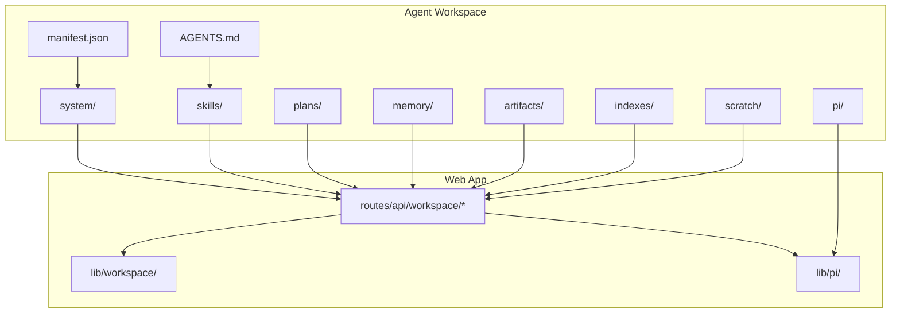

**Diagram sources**

- [manifest.json](file://agent-workspace/manifest.json)
- [AGENTS.md](file://agent-workspace/AGENTS.md)
- [apps/web/src/routes/api/workspace/file.ts](file://apps/web/src/routes/api/workspace/file.ts)
- [apps/web/src/lib/workspace/](file://apps/web/src/lib/workspace/)
- [apps/web/src/lib/pi/](file://apps/web/src/lib/pi/)

**Section sources**

- [manifest.json](file://agent-workspace/manifest.json)
- [AGENTS.md](file://agent-workspace/AGENTS.md)
- [apps/web/src/routes/api/workspace/file.ts](file://apps/web/src/routes/api/workspace/file.ts)
- [apps/web/src/routes/api/workspace/search.ts](file://apps/web/src/routes/api/workspace/search.ts)
- [apps/web/src/routes/api/workspace/tree.ts](file://apps/web/src/routes/api/workspace/tree.ts)

## Core Components

- Workspace manifest and identity: defines workspace metadata, agent identity, and policy references
- System policies: behavior, constraints, tool usage, and self-improvement guidelines
- Skills: modular capabilities such as codebase research, documentation gardening, execution planning, frontend design, and memory synthesis
- Plans: active, completed, abandoned, and backlog tracking for agent tasks
- Memory: project-level knowledge, daily logs, research notes, and summaries
- Artifacts: datasets, diagrams, reports, and traces produced by agents
- Indexes: search index configuration and gitignore rules
- Scratch: temporary workspaces and interactive prompts
- Pi integration: extensions, packages, prompts, and skills for model orchestration

**Section sources**

- [manifest.json](file://agent-workspace/manifest.json)
- [behavior.md](file://agent-workspace/system/behavior.md)
- [constraints.md](file://agent-workspace/system/constraints.md)
- [tool-policy.md](file://agent-workspace/system/tool-policy.md)
- [self-improvement-policy.md](file://agent-workspace/system/self-improvement-policy.md)
- [codebase-research/SKILL.md](file://agent-workspace/skills/codebase-research/SKILL.md)
- [doc-gardening/SKILL.md](file://agent-workspace/skills/doc-gardening/SKILL.md)
- [execution-plan/SKILL.md](file://agent-workspace/skills/execution-plan/SKILL.md)
- [frontend-design/SKILL.md](file://agent-workspace/skills/frontend-design/SKILL.md)
- [memory-synthesis/SKILL.md](file://agent-workspace/skills/memory-synthesis/SKILL.md)
- [plans/backlog.md](file://agent-workspace/plans/backlog.md)
- [memory/project/architecture.md](file://agent-workspace/memory/project/architecture.md)
- [artifacts/reports/architecture-review-2026-05-12.md](file://agent-workspace/artifacts/reports/architecture-review-2026-05-12.md)
- [indexes/.gitignore](file://agent-workspace/indexes/.gitignore)
- [pi/extensions/enabled/](file://agent-workspace/pi/extensions/enabled/)
- [pi/prompts/](file://agent-workspace/pi/prompts/)

## Architecture Overview

The Agent Workspace architecture layers the filesystem-centric workspace with API endpoints and Pi protocol integration. Agents interact with the workspace through structured APIs, while the Pi layer orchestrates model calls and tool execution.

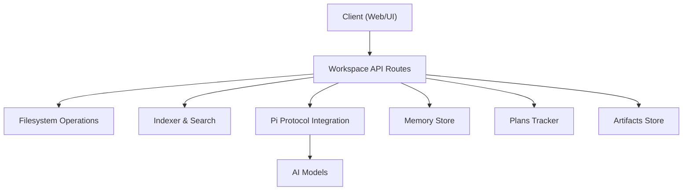

**Diagram sources**

- [apps/web/src/routes/api/workspace/file.ts](file://apps/web/src/routes/api/workspace/file.ts)
- [apps/web/src/routes/api/workspace/search.ts](file://apps/web/src/routes/api/workspace/search.ts)
- [apps/web/src/routes/api/workspace/tree.ts](file://apps/web/src/routes/api/workspace/tree.ts)
- [apps/web/src/lib/pi/](file://apps/web/src/lib/pi/)
- [packages/pi-protocol/](file://packages/pi-protocol/)

**Section sources**

- [docs/architecture.md](file://docs/architecture.md)
- [docs/runtime-sdk-integration.md](file://docs/runtime-sdk-integration.md)

## Detailed Component Analysis

### Workspace Manifest and Identity

The manifest defines workspace metadata, agent identity, and policy references. It serves as the canonical source for workspace configuration and agent behavior alignment.

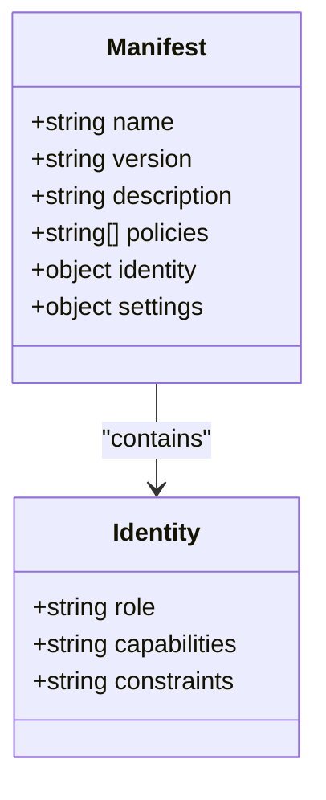

**Diagram sources**

- [manifest.json](file://agent-workspace/manifest.json)
- [identity.md](file://agent-workspace/system/identity.md)

**Section sources**

- [manifest.json](file://agent-workspace/manifest.json)
- [identity.md](file://agent-workspace/system/identity.md)

### System Policies and Behavior

Policies define how agents behave, what tools they can use, and constraints on their actions. Self-improvement policies guide iterative refinement of agent behavior based on outcomes.

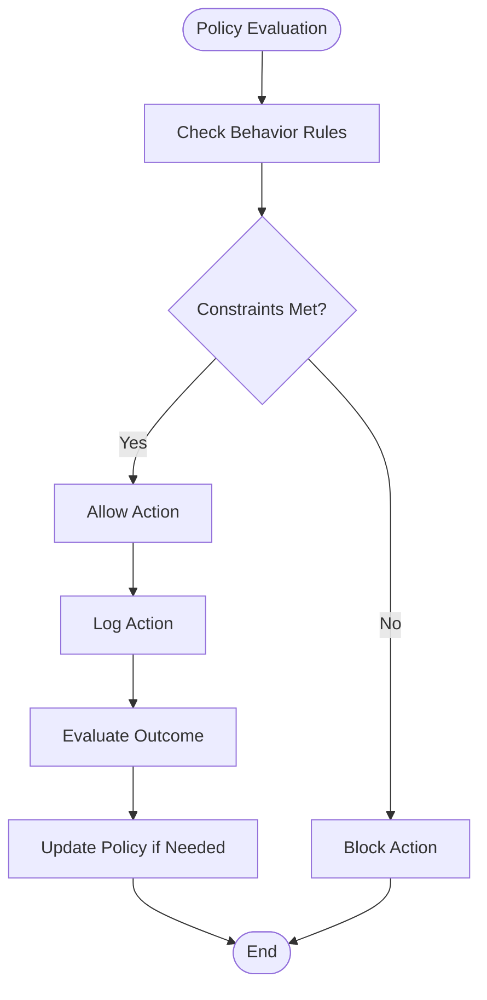

**Diagram sources**

- [behavior.md](file://agent-workspace/system/behavior.md)
- [constraints.md](file://agent-workspace/system/constraints.md)
- [tool-policy.md](file://agent-workspace/system/tool-policy.md)
- [self-improvement-policy.md](file://agent-workspace/system/self-improvement-policy.md)

**Section sources**

- [behavior.md](file://agent-workspace/system/behavior.md)
- [constraints.md](file://agent-workspace/system/constraints.md)
- [tool-policy.md](file://agent-workspace/system/tool-policy.md)
- [self-improvement-policy.md](file://agent-workspace/system/self-improvement-policy.md)

### Skills and Extensions

Skills are modular capabilities that extend agent functionality. Each skill includes instructions, examples, and evaluation criteria.

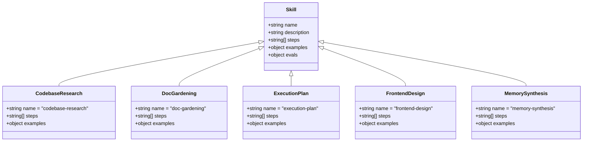

**Diagram sources**

- [codebase-research/SKILL.md](file://agent-workspace/skills/codebase-research/SKILL.md)
- [doc-gardening/SKILL.md](file://agent-workspace/skills/doc-gardening/SKILL.md)
- [execution-plan/SKILL.md](file://agent-workspace/skills/execution-plan/SKILL.md)
- [frontend-design/SKILL.md](file://agent-workspace/skills/frontend-design/SKILL.md)
- [memory-synthesis/SKILL.md](file://agent-workspace/skills/memory-synthesis/SKILL.md)

**Section sources**

- [codebase-research/SKILL.md](file://agent-workspace/skills/codebase-research/SKILL.md)
- [doc-gardening/SKILL.md](file://agent-workspace/skills/doc-gardening/SKILL.md)
- [execution-plan/SKILL.md](file://agent-workspace/skills/execution-plan/SKILL.md)
- [frontend-design/SKILL.md](file://agent-workspace/skills/frontend-design/SKILL.md)
- [memory-synthesis/SKILL.md](file://agent-workspace/skills/memory-synthesis/SKILL.md)

### Plans and Task Management

Plans track agent tasks across active, completed, abandoned, and backlog states. They provide visibility into agent workflows and progress.

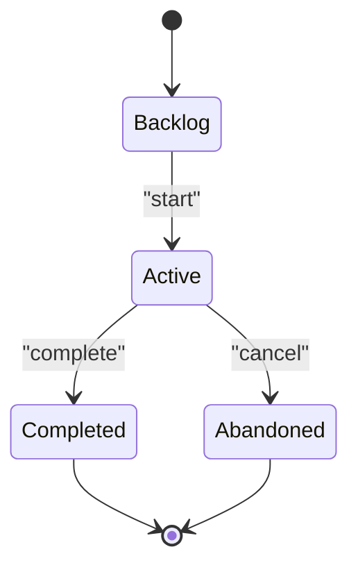

**Diagram sources**

- [plans/backlog.md](file://agent-workspace/plans/backlog.md)
- [plans/active/upgrade-pi-0.80.10.md](file://agent-workspace/plans/active/upgrade-pi-0.80.10.md)
- [plans/completed/install-pi-web-access.md](file://agent-workspace/plans/completed/install-pi-web-access.md)
- [plans/completed/memory-recall-improvement.md](file://agent-workspace/plans/completed/memory-recall-improvement.md)

**Section sources**

- [plans/backlog.md](file://agent-workspace/plans/backlog.md)
- [plans/active/upgrade-pi-0.80.10.md](file://agent-workspace/plans/active/upgrade-pi-0.80.10.md)
- [plans/completed/install-pi-web-access.md](file://agent-workspace/plans/completed/install-pi-web-access.md)
- [plans/completed/memory-recall-improvement.md](file://agent-workspace/plans/completed/memory-recall-improvement.md)

### Memory and Knowledge Management

Memory stores project knowledge, decisions, known issues, open questions, preferences, research notes, and summaries. It enables agents to maintain context across sessions.

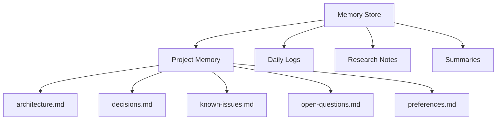

**Diagram sources**

- [memory/project/architecture.md](file://agent-workspace/memory/project/architecture.md)
- [memory/project/decisions.md](file://agent-workspace/memory/project/decisions.md)
- [memory/project/known-issues.md](file://agent-workspace/memory/project/known-issues.md)
- [memory/project/open-questions.md](file://agent-workspace/memory/project/open-questions.md)
- [memory/project/preferences.md](file://agent-workspace/memory/project/preferences.md)
- [memory/research/index.md](file://agent-workspace/memory/research/index.md)
- [memory/summaries/](file://agent-workspace/memory/summaries/)
- [memory/daily/](file://agent-workspace/memory/daily/)

**Section sources**

- [memory/project/architecture.md](file://agent-workspace/memory/project/architecture.md)
- [memory/project/decisions.md](file://agent-workspace/memory/project/decisions.md)
- [memory/project/known-issues.md](file://agent-workspace/memory/project/known-issues.md)
- [memory/project/open-questions.md](file://agent-workspace/memory/project/open-questions.md)
- [memory/project/preferences.md](file://agent-workspace/memory/project/preferences.md)
- [memory/research/index.md](file://agent-workspace/memory/research/index.md)

### Artifacts and Traces

Artifacts store datasets, diagrams, reports, and traces generated by agents. They provide evidence of agent work and enable review and analysis.

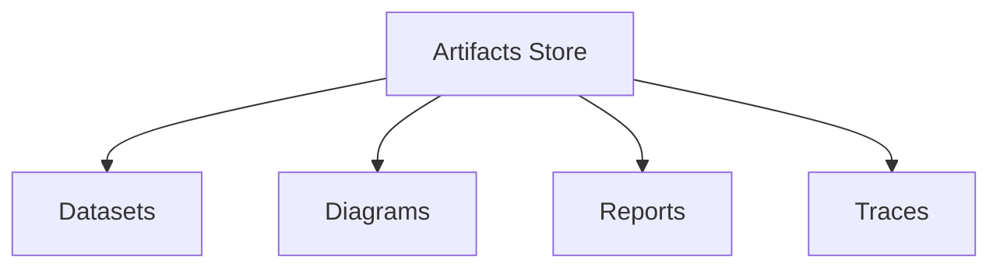

**Diagram sources**

- [artifacts/datasets/](file://agent-workspace/artifacts/datasets/)
- [artifacts/reports/architecture-review-2026-05-12.md](file://agent-workspace/artifacts/reports/architecture-review-2026-05-12.md)
- [artifacts/reports/codebase-map-2026-05-15.md](file://agent-workspace/artifacts/reports/codebase-map-2026-05-15.md)
- [artifacts/traces/](file://agent-workspace/artifacts/traces/)

**Section sources**

- [artifacts/datasets/](file://agent-workspace/artifacts/datasets/)
- [artifacts/reports/architecture-review-2026-05-12.md](file://agent-workspace/artifacts/reports/architecture-review-2026-05-12.md)
- [artifacts/reports/codebase-map-2026-05-15.md](file://agent-workspace/artifacts/reports/codebase-map-2026-05-15.md)
- [artifacts/traces/](file://agent-workspace/artifacts/traces/)

### Indexing and Search

The workspace supports indexing and search over file content. The indexer respects gitignore rules and updates indices when files change.

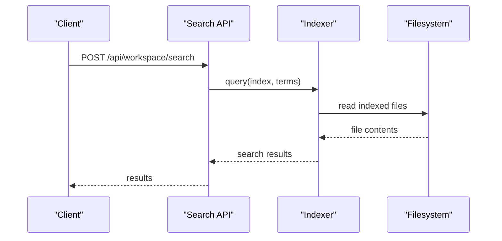

**Diagram sources**

- [apps/web/src/routes/api/workspace/search.ts](file://apps/web/src/routes/api/workspace/search.ts)
- [apps/web/src/routes/api/workspace/reindex.ts](file://apps/web/src/routes/api/workspace/reindex.ts)
- [indexes/.gitignore](file://agent-workspace/indexes/.gitignore)

**Section sources**

- [apps/web/src/routes/api/workspace/search.ts](file://apps/web/src/routes/api/workspace/search.ts)
- [apps/web/src/routes/api/workspace/reindex.ts](file://apps/web/src/routes/api/workspace/reindex.ts)
- [indexes/.gitignore](file://agent-workspace/indexes/.gitignore)

### File Operations and Tree Traversal

Agents interact with the filesystem through API endpoints for reading, writing, and traversing the workspace tree.

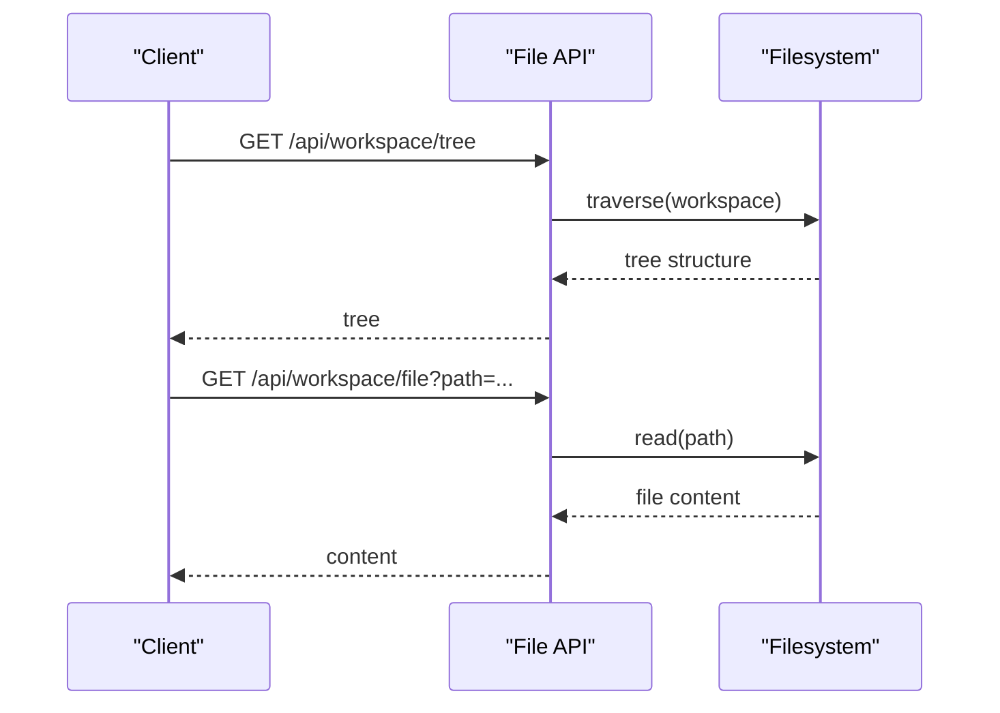

**Diagram sources**

- [apps/web/src/routes/api/workspace/tree.ts](file://apps/web/src/routes/api/workspace/tree.ts)
- [apps/web/src/routes/api/workspace/file.ts](file://apps/web/src/routes/api/workspace/file.ts)

**Section sources**

- [apps/web/src/routes/api/workspace/tree.ts](file://apps/web/src/routes/api/workspace/tree.ts)
- [apps/web/src/routes/api/workspace/file.ts](file://apps/web/src/routes/api/workspace/file.ts)

### Pi Protocol Integration

The Pi protocol integrates with AI models for orchestration, tool execution, and skill invocation. Extensions and packages extend Pi capabilities.

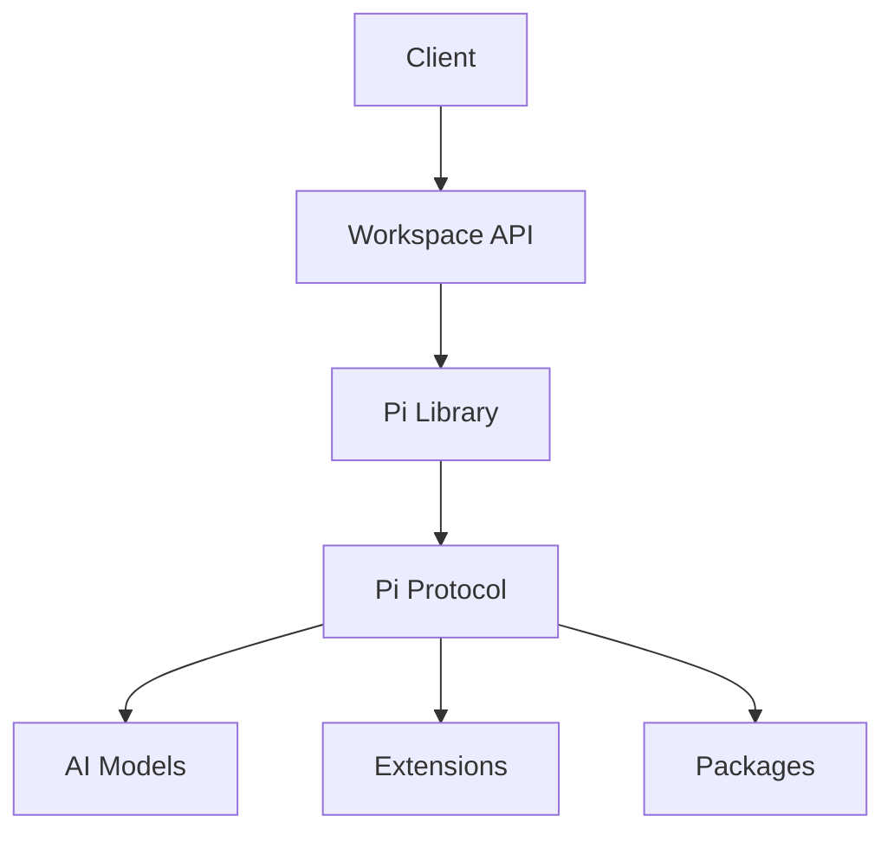

**Diagram sources**

- [apps/web/src/lib/pi/](file://apps/web/src/lib/pi/)
- [packages/pi-protocol/](file://packages/pi-protocol/)
- [pi/extensions/enabled/](file://agent-workspace/pi/extensions/enabled/)
- [pi/packages/](file://agent-workspace/pi/packages/)

**Section sources**

- [apps/web/src/lib/pi/](file://apps/web/src/lib/pi/)
- [packages/pi-protocol/](file://packages/pi-protocol/)
- [pi/extensions/enabled/](file://agent-workspace/pi/extensions/enabled/)
- [pi/packages/](file://agent-workspace/pi/packages/)

### Real-Time Synchronization

Open UI artifacts and session state enable real-time synchronization between clients and the workspace. Changes propagate instantly to all connected clients.

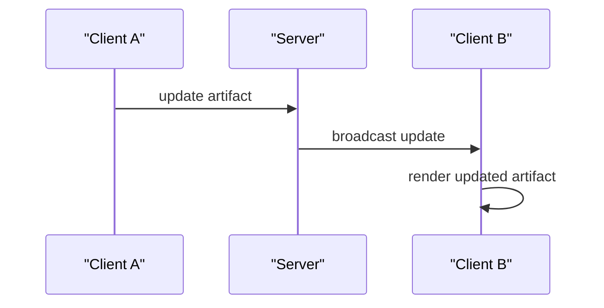

**Diagram sources**

- [scratch/artifact-control-center.openui](file://agent-workspace/scratch/artifact-control-center.openui)
- [scratch/prompt-brainstorm.openui](file://agent-workspace/scratch/prompt-brainstorm.openui)
- [scratch/suggestions.openui](file://agent-workspace/scratch/suggestions.openui)

**Section sources**

- [scratch/artifact-control-center.openui](file://agent-workspace/scratch/artifact-control-center.openui)
- [scratch/prompt-brainstorm.openui](file://agent-workspace/scratch/prompt-brainstorm.openui)
- [scratch/suggestions.openui](file://agent-workspace/scratch/suggestions.openui)

## Dependency Analysis

The Agent Workspace has clear dependencies between components:

- API routes depend on filesystem operations, indexing, and Pi protocol
- Pi protocol depends on extensions, packages, and AI models
- Skills depend on policies and constraints
- Memory and artifacts are consumed by agents and clients

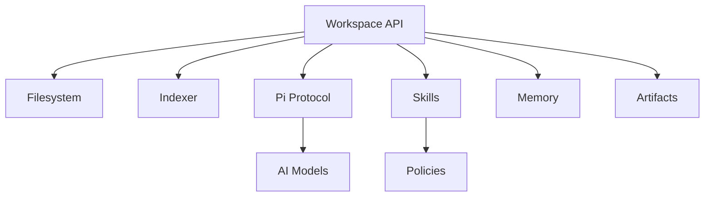

**Diagram sources**

- [apps/web/src/routes/api/workspace/file.ts](file://apps/web/src/routes/api/workspace/file.ts)
- [apps/web/src/routes/api/workspace/search.ts](file://apps/web/src/routes/api/workspace/search.ts)
- [apps/web/src/lib/pi/](file://apps/web/src/lib/pi/)
- [packages/pi-protocol/](file://packages/pi-protocol/)
- [behavior.md](file://agent-workspace/system/behavior.md)
- [tool-policy.md](file://agent-workspace/system/tool-policy.md)

**Section sources**

- [apps/web/src/routes/api/workspace/file.ts](file://apps/web/src/routes/api/workspace/file.ts)
- [apps/web/src/routes/api/workspace/search.ts](file://apps/web/src/routes/api/workspace/search.ts)
- [apps/web/src/lib/pi/](file://apps/web/src/lib/pi/)
- [packages/pi-protocol/](file://packages/pi-protocol/)
- [behavior.md](file://agent-workspace/system/behavior.md)
- [tool-policy.md](file://agent-workspace/system/tool-policy.md)

## Performance Considerations

- Indexing should be incremental to avoid full re-indexing on every change
- Search queries should leverage pre-built indexes for fast response times
- File operations should use streaming for large files to prevent memory issues
- Real-time synchronization should batch updates to reduce network overhead
- Pi protocol calls should implement caching and retry logic for reliability

[No sources needed since this section provides general guidance]

## Troubleshooting Guide

Common issues and solutions:

- Index not updating: check reindex endpoint and gitignore rules
- Search returning empty results: verify index status and file permissions
- Pi protocol errors: check extension status and model availability
- File operation failures: validate paths and permissions
- Real-time sync issues: inspect WebSocket connections and broadcast logic

**Section sources**

- [apps/web/src/routes/api/workspace/reindex.ts](file://apps/web/src/routes/api/workspace/reindex.ts)
- [apps/web/src/routes/api/workspace/health.ts](file://apps/web/src/routes/api/workspace/health.ts)
- [apps/web/src/routes/api/workspace/file.ts](file://apps/web/src/routes/api/workspace/file.ts)
- [apps/web/src/routes/api/workspace/search.ts](file://apps/web/src/routes/api/workspace/search.ts)

## Conclusion

The Agent Workspace provides a robust foundation for AI-powered development with adaptive state, persistent memory, and collaborative capabilities. Its modular architecture allows for easy extension and customization through skills and Pi protocol integrations. The system balances flexibility with safety through policy-driven behavior and constraints.

[No sources needed since this section summarizes without analyzing specific files]

## Appendices

### Configuration Examples

- Workspace manifest configuration
- Policy definitions
- Skill specifications
- Pi protocol settings

**Section sources**

- [manifest.json](file://agent-workspace/manifest.json)
- [behavior.md](file://agent-workspace/system/behavior.md)
- [constraints.md](file://agent-workspace/system/constraints.md)
- [tool-policy.md](file://agent-workspace/system/tool-policy.md)

### Extension Points

- Custom skills development
- Pi protocol extensions
- API endpoint customization
- Memory store integration

**Section sources**

- [codebase-research/SKILL.md](file://agent-workspace/skills/codebase-research/SKILL.md)
- [apps/web/src/lib/pi/](file://apps/web/src/lib/pi/)
- [packages/pi-protocol/](file://packages/pi-protocol/)
