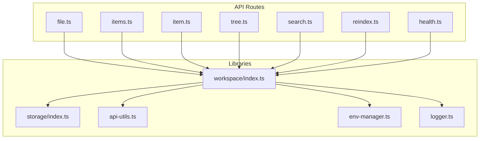
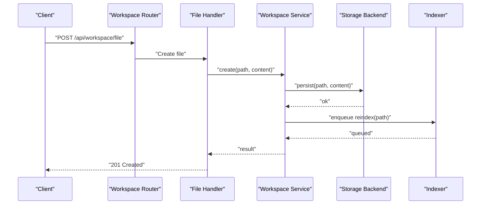
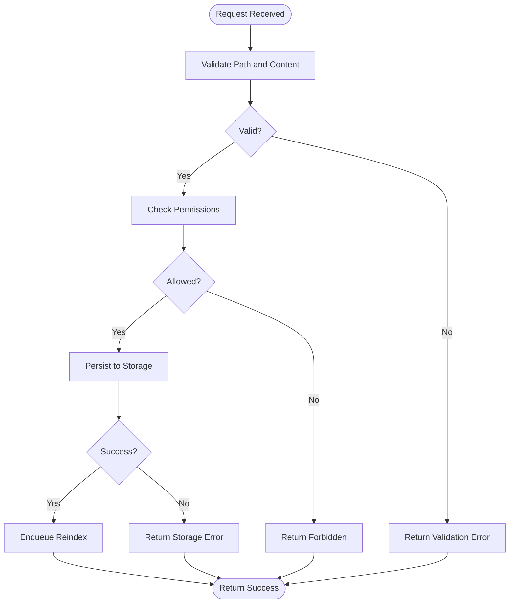
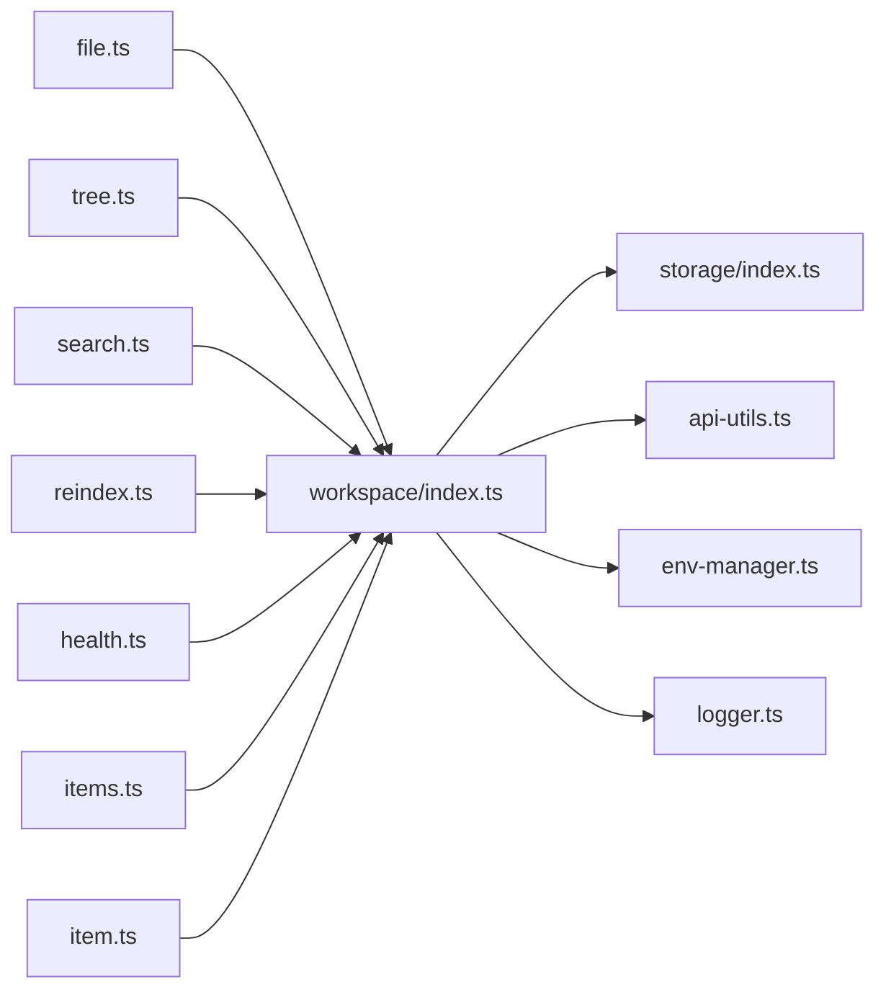

# File Operations & Workspace Management

<cite>
**Referenced Files in This Document**
- [file.ts](file://apps/web/src/routes/api/workspace/file.ts)
- [items.ts](file://apps/web/src/routes/api/workspace/items.ts)
- [item.ts](file://apps/web/src/routes/api/workspace/item.ts)
- [tree.ts](file://apps/web/src/routes/api/workspace/tree.ts)
- [search.ts](file://apps/web/src/routes/api/workspace/search.ts)
- [reindex.ts](file://apps/web/src/routes/api/workspace/reindex.ts)
- [health.ts](file://apps/web/src/routes/api/workspace/health.ts)
- [workspace/index.ts](file://apps/web/src/lib/workspace/index.ts)
- [storage/index.ts](file://apps/web/src/lib/storage/index.ts)
- [api-utils.ts](file://apps/web/src/lib/api-utils.ts)
- [env-manager.ts](file://apps/web/src/lib/env-manager.ts)
- [logger.ts](file://apps/web/src/lib/logger.ts)
</cite>

## Table of Contents

1. [Introduction](#introduction)
2. [Project Structure](#project-structure)
3. [Core Components](#core-components)
4. [Architecture Overview](#architecture-overview)
5. [Detailed Component Analysis](#detailed-component-analysis)
6. [Dependency Analysis](#dependency-analysis)
7. [Performance Considerations](#performance-considerations)
8. [Troubleshooting Guide](#troubleshooting-guide)
9. [Conclusion](#conclusion)
10. [Appendices](#appendices)

## Introduction

This document explains the file operations and workspace management capabilities exposed by the application’s workspace API. It covers:

- File indexing and search functionality
- Real-time file synchronization patterns
- Workspace API endpoints for file CRUD, directory navigation, and content management
- Implementing custom file handlers
- Managing large codebases and optimizing search performance
- File locking mechanisms, conflict resolution, and version control integration
- Security considerations for file access and content filtering

The goal is to provide both a high-level understanding and actionable guidance for developers integrating with or extending the workspace system.

## Project Structure

The workspace-related functionality is primarily implemented under the web application’s API routes and shared libraries:

- API routes for workspace operations are located under apps/web/src/routes/api/workspace
- Shared utilities for API handling, environment configuration, logging, storage, and workspace abstractions are under apps/web/src/lib

**Diagram sources**

- [file.ts](file://apps/web/src/routes/api/workspace/file.ts)
- [items.ts](file://apps/web/src/routes/api/workspace/items.ts)
- [item.ts](file://apps/web/src/routes/api/workspace/item.ts)
- [tree.ts](file://apps/web/src/routes/api/workspace/tree.ts)
- [search.ts](file://apps/web/src/routes/api/workspace/search.ts)
- [reindex.ts](file://apps/web/src/routes/api/workspace/reindex.ts)
- [health.ts](file://apps/web/src/routes/api/workspace/health.ts)
- [workspace/index.ts](file://apps/web/src/lib/workspace/index.ts)
- [storage/index.ts](file://apps/web/src/lib/storage/index.ts)
- [api-utils.ts](file://apps/web/src/lib/api-utils.ts)
- [env-manager.ts](file://apps/web/src/lib/env-manager.ts)
- [logger.ts](file://apps/web/src/lib/logger.ts)

**Section sources**

- [file.ts](file://apps/web/src/routes/api/workspace/file.ts)
- [items.ts](file://apps/web/src/routes/api/workspace/items.ts)
- [item.ts](file://apps/web/src/routes/api/workspace/item.ts)
- [tree.ts](file://apps/web/src/routes/api/workspace/tree.ts)
- [search.ts](file://apps/web/src/routes/api/workspace/search.ts)
- [reindex.ts](file://apps/web/src/routes/api/workspace/reindex.ts)
- [health.ts](file://apps/web/src/routes/api/workspace/health.ts)
- [workspace/index.ts](file://apps/web/src/lib/workspace/index.ts)
- [storage/index.ts](file://apps/web/src/lib/storage/index.ts)
- [api-utils.ts](file://apps/web/src/lib/api-utils.ts)
- [env-manager.ts](file://apps/web/src/lib/env-manager.ts)
- [logger.ts](file://apps/web/src/lib/logger.ts)

## Core Components

- Workspace API endpoints:
  - File CRUD: create, read, update, delete files via dedicated route handlers
  - Directory navigation: list directories and traverse tree structures
  - Search: index-based text search across workspace contents
  - Reindex: trigger or manage re-indexing of workspace content
  - Health: expose operational status of workspace services
- Shared libraries:
  - Workspace abstraction layer for consistent file operations
  - Storage backend abstraction for persistence and caching
  - API utilities for request/response handling and validation
  - Environment manager for configuration and feature flags
  - Logger for structured diagnostics and audit trails

Key responsibilities:

- Validate inputs and enforce permissions before any file operation
- Maintain an up-to-date index for fast search
- Provide efficient directory traversal and content retrieval
- Expose health and readiness signals for orchestration

**Section sources**

- [file.ts](file://apps/web/src/routes/api/workspace/file.ts)
- [items.ts](file://apps/web/src/routes/api/workspace/items.ts)
- [item.ts](file://apps/web/src/routes/api/workspace/item.ts)
- [tree.ts](file://apps/web/src/routes/api/workspace/tree.ts)
- [search.ts](file://apps/web/src/routes/api/workspace/search.ts)
- [reindex.ts](file://apps/web/src/routes/api/workspace/reindex.ts)
- [health.ts](file://apps/web/src/routes/api/workspace/health.ts)
- [workspace/index.ts](file://apps/web/src/lib/workspace/index.ts)
- [storage/index.ts](file://apps/web/src/lib/storage/index.ts)
- [api-utils.ts](file://apps/web/src/lib/api-utils.ts)
- [env-manager.ts](file://apps/web/src/lib/env-manager.ts)
- [logger.ts](file://apps/web/src/lib/logger.ts)

## Architecture Overview

The workspace API follows a layered architecture:

- Route handlers receive HTTP requests and delegate to the workspace service
- The workspace service coordinates with storage backends and indexers
- Utilities handle validation, logging, and environment configuration

**Diagram sources**

- [file.ts](file://apps/web/src/routes/api/workspace/file.ts)
- [workspace/index.ts](file://apps/web/src/lib/workspace/index.ts)
- [storage/index.ts](file://apps/web/src/lib/storage/index.ts)

**Section sources**

- [file.ts](file://apps/web/src/routes/api/workspace/file.ts)
- [workspace/index.ts](file://apps/web/src/lib/workspace/index.ts)
- [storage/index.ts](file://apps/web/src/lib/storage/index.ts)

## Detailed Component Analysis

### File CRUD Endpoints

- Create file: validates path and content, persists via storage, triggers index update
- Read file: resolves path, checks permissions, returns content or error
- Update file: applies atomic updates, handles conflicts, updates index
- Delete file: removes content, updates index, ensures cleanup

Implementation patterns:

- Input validation and sanitization at the route boundary
- Permission checks using environment and user context
- Error propagation with standardized responses
- Logging for auditability

**Diagram sources**

- [file.ts](file://apps/web/src/routes/api/workspace/file.ts)
- [workspace/index.ts](file://apps/web/src/lib/workspace/index.ts)
- [storage/index.ts](file://apps/web/src/lib/storage/index.ts)

**Section sources**

- [file.ts](file://apps/web/src/routes/api/workspace/file.ts)
- [workspace/index.ts](file://apps/web/src/lib/workspace/index.ts)
- [storage/index.ts](file://apps/web/src/lib/storage/index.ts)

### Directory Navigation (Tree)

- List directory contents with metadata (type, size, modified time)
- Traverse nested directories efficiently
- Support pagination and depth limits for large trees

Optimization strategies:

- Lazy loading of deeper levels
- Caching directory listings with invalidation on changes
- Filtering sensitive paths based on policy

**Section sources**

- [tree.ts](file://apps/web/src/routes/api/workspace/tree.ts)
- [workspace/index.ts](file://apps/web/src/lib/workspace/index.ts)

### Search Functionality

- Full-text search over indexed content
- Query parsing and scoring
- Incremental indexing to keep results fresh

Performance tips:

- Use tokenization and normalization
- Cache frequent queries
- Batch index updates during bulk operations

**Section sources**

- [search.ts](file://apps/web/src/routes/api/workspace/search.ts)
- [workspace/index.ts](file://apps/web/src/lib/workspace/index.ts)

### Reindexing

- Trigger full or incremental reindex
- Monitor progress and errors
- Integrate with background jobs for non-blocking operations

**Section sources**

- [reindex.ts](file://apps/web/src/routes/api/workspace/reindex.ts)
- [workspace/index.ts](file://apps/web/src/lib/workspace/index.ts)

### Health Endpoint

- Expose readiness and liveness probes
- Report indexer and storage status
- Aggregate dependency health

**Section sources**

- [health.ts](file://apps/web/src/routes/api/workspace/health.ts)
- [workspace/index.ts](file://apps/web/src/lib/workspace/index.ts)

### Items and Bulk Operations

- Manage multiple items in a single request
- Support batch create/update/delete
- Ensure transactional semantics where possible

**Section sources**

- [items.ts](file://apps/web/src/routes/api/workspace/items.ts)
- [item.ts](file://apps/web/src/routes/api/workspace/item.ts)
- [workspace/index.ts](file://apps/web/src/lib/workspace/index.ts)

## Dependency Analysis

The workspace module depends on shared utilities for consistent behavior:

- api-utils for request/response handling
- env-manager for configuration and feature toggles
- logger for structured logs
- storage for persistence and caching

**Diagram sources**

- [file.ts](file://apps/web/src/routes/api/workspace/file.ts)
- [tree.ts](file://apps/web/src/routes/api/workspace/tree.ts)
- [search.ts](file://apps/web/src/routes/api/workspace/search.ts)
- [reindex.ts](file://apps/web/src/routes/api/workspace/reindex.ts)
- [health.ts](file://apps/web/src/routes/api/workspace/health.ts)
- [items.ts](file://apps/web/src/routes/api/workspace/items.ts)
- [item.ts](file://apps/web/src/routes/api/workspace/item.ts)
- [workspace/index.ts](file://apps/web/src/lib/workspace/index.ts)
- [storage/index.ts](file://apps/web/src/lib/storage/index.ts)
- [api-utils.ts](file://apps/web/src/lib/api-utils.ts)
- [env-manager.ts](file://apps/web/src/lib/env-manager.ts)
- [logger.ts](file://apps/web/src/lib/logger.ts)

**Section sources**

- [workspace/index.ts](file://apps/web/src/lib/workspace/index.ts)
- [storage/index.ts](file://apps/web/src/lib/storage/index.ts)
- [api-utils.ts](file://apps/web/src/lib/api-utils.ts)
- [env-manager.ts](file://apps/web/src/lib/env-manager.ts)
- [logger.ts](file://apps/web/src/lib/logger.ts)

## Performance Considerations

- Indexing strategy:
  - Prefer incremental updates for frequent small changes
  - Batch reindex operations to reduce overhead
- Caching:
  - Cache directory listings and frequent queries
  - Invalidate caches on write operations
- Concurrency:
  - Use locks for conflicting writes to avoid corruption
  - Queue background tasks for heavy operations
- Large codebases:
  - Limit traversal depth and result sets
  - Stream large file reads when possible
- Search optimization:
  - Normalize and tokenize content efficiently
  - Use query filters to narrow scope

[No sources needed since this section provides general guidance]

## Troubleshooting Guide

Common issues and resolutions:

- Permission denied:
  - Verify user roles and path policies
  - Check environment configuration for access controls
- Index out of sync:
  - Trigger reindex and monitor progress
  - Inspect indexer logs for errors
- Slow directory listing:
  - Enable caching and adjust depth limits
  - Review storage backend performance
- Search inaccuracies:
  - Rebuild index and validate tokenization
  - Adjust query parameters and filters

Diagnostics:

- Use health endpoint to check subsystem status
- Review structured logs for error traces and audit events
- Validate input payloads and paths against schema

**Section sources**

- [health.ts](file://apps/web/src/routes/api/workspace/health.ts)
- [logger.ts](file://apps/web/src/lib/logger.ts)
- [env-manager.ts](file://apps/web/src/lib/env-manager.ts)

## Conclusion

The workspace API provides robust file operations, directory navigation, and search capabilities backed by a modular architecture. By following the recommended patterns for validation, permission checks, indexing, and caching, teams can build scalable and secure file workflows. For advanced scenarios like custom handlers, large codebase management, and real-time synchronization, leverage the provided abstractions and extend them with careful attention to performance and security.

[No sources needed since this section summarizes without analyzing specific files]

## Appendices

### Implementing Custom File Handlers

- Extend the workspace service to support custom storage backends
- Implement hooks for pre/post operations (e.g., linting, formatting)
- Register custom handlers through configuration or plugin interfaces

Best practices:

- Validate all inputs and sanitize paths
- Log all operations for auditability
- Handle errors consistently and return meaningful messages

[No sources needed since this section provides general guidance]

### Managing Large Codebases

- Partition indexes by directory or project
- Use lazy loading and pagination for deep trees
- Optimize search with scoped queries and filters

[No sources needed since this section provides general guidance]

### Optimizing Search Performance

- Tune tokenization and normalization rules
- Cache frequent queries and results
- Use background jobs for index maintenance

[No sources needed since this section provides general guidance]

### File Locking and Conflict Resolution

- Implement advisory locks around critical sections
- Detect concurrent modifications and resolve conflicts
- Provide merge strategies or manual resolution flows

[No sources needed since this section provides general guidance]

### Version Control Integration

- Commit changes after successful operations
- Tag releases and track provenance
- Rollback on failures with transactional semantics

[No sources needed since this section provides general guidance]

### Security Considerations

- Enforce strict path validation and canonicalization
- Filter sensitive content and apply data loss prevention
- Restrict access based on roles and scopes
- Audit all file operations and log anomalies

[No sources needed since this section provides general guidance]
