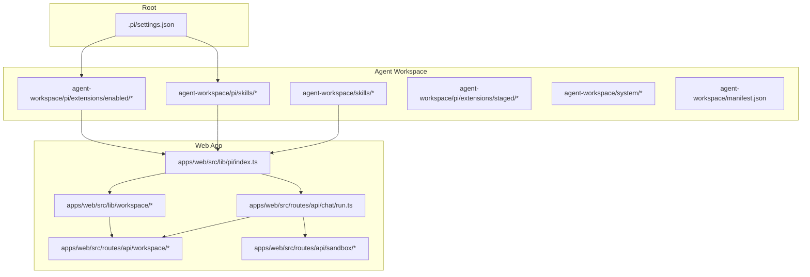
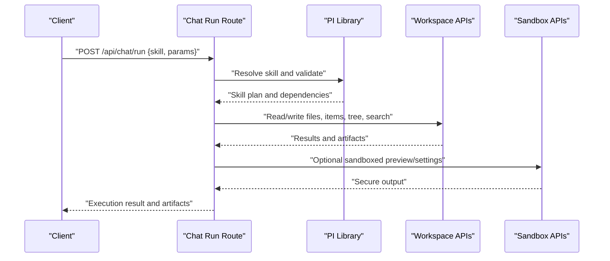
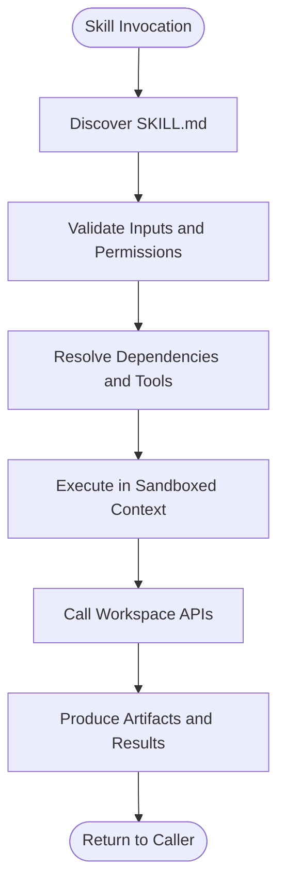
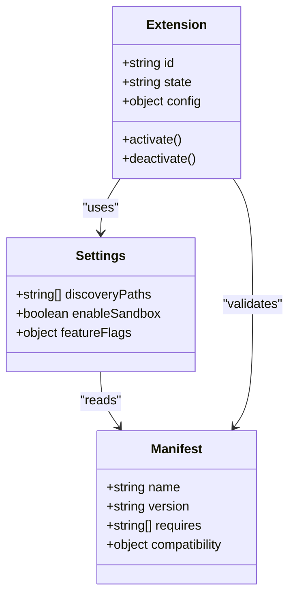
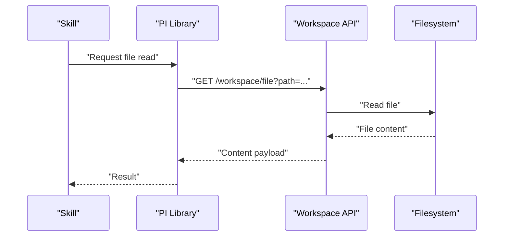
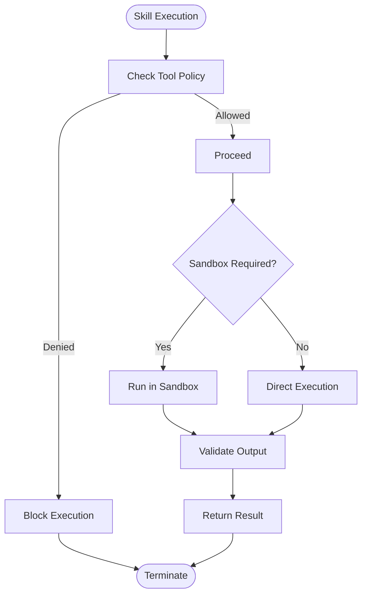
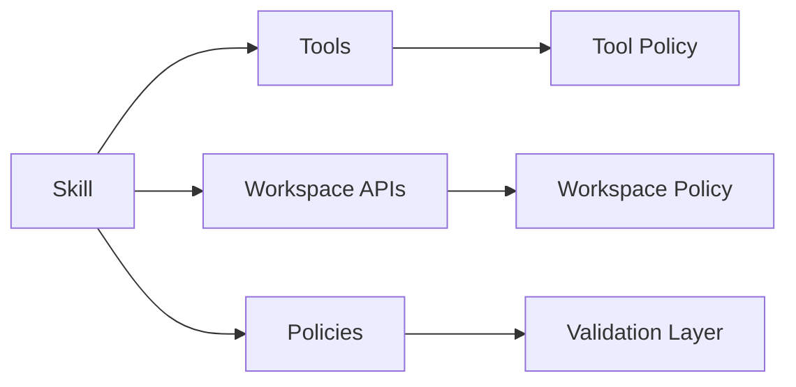

# Skills & Extension System

<cite>
**Referenced Files in This Document**
- [README.md](file://README.md)
- [AGENTS.md](file://AGENTS.md)
- [WORKSPACE.md](file://WORKSPACE.md)
- [agent-workspace/AGENTS.md](file://agent-workspace/AGENTS.md)
- [agent-workspace/skills/codebase-research/SKILL.md](file://agent-workspace/skills/codebase-research/SKILL.md)
- [agent-workspace/skills/doc-gardening/SKILL.md](file://agent-workspace/skills/doc-gardening/SKILL.md)
- [agent-workspace/skills/execution-plan/SKILL.md](file://agent-workspace/skills/execution-plan/SKILL.md)
- [agent-workspace/skills/frontend-design/SKILL.md](file://agent-workspace/skills/frontend-design/SKILL.md)
- [agent-workspace/skills/memory-synthesis/SKILL.md](file://agent-workspace/skills/memory-synthesis/SKILL.md)
- [agent-workspace/pi/skills/index.md](file://agent-workspace/pi/skills/index.md)
- [agent-workspace/pi/extensions/enabled/index.md](file://agent-workspace/pi/extensions/enabled/index.md)
- [agent-workspace/pi/extensions/staged/index.md](file://agent-workspace/pi/extensions/staged/index.md)
- [agent-workspace/system/tool-policy.md](file://agent-workspace/system/tool-policy.md)
- [agent-workspace/system/workspace-policy.md](file://agent-workspace/system/workspace-policy.md)
- [apps/web/src/routes/api/chat/run.ts](file://apps/web/src/routes/api/chat/run.ts)
- [apps/web/src/lib/pi/index.ts](file://apps/web/src/lib/pi/index.ts)
- [apps/web/src/lib/workspace/file.ts](file://apps/web/src/lib/workspace/file.ts)
- [apps/web/src/lib/workspace/items.ts](file://apps/web/src/lib/workspace/items.ts)
- [apps/web/src/lib/workspace/tree.ts](file://apps/web/src/lib/workspace/tree.ts)
- [apps/web/src/lib/workspace/search.ts](file://apps/web/src/lib/workspace/search.ts)
- [apps/web/src/routes/api/workspace/item.ts](file://apps/web/src/routes/api/workspace/item.ts)
- [apps/web/src/routes/api/workspace/items.ts](file://apps/web/src/routes/api/workspace/items.ts)
- [apps/web/src/routes/api/workspace/tree.ts](file://apps/web/src/routes/api/workspace/tree.ts)
- [apps/web/src/routes/api/workspace/search.ts](file://apps/web/src/routes/api/workspace/search.ts)
- [apps/web/src/routes/api/sandbox/settings.ts](file://apps/web/src/routes/api/sandbox/settings.ts)
- [apps/web/src/routes/api/sandbox/preview.ts](file://apps/web/src/routes/api/sandbox/preview.ts)
- [.pi/settings.json](file://.pi/settings.json)
- [agent-workspace/manifest.json](file://agent-workspace/manifest.json)
</cite>

## Table of Contents

1. [Introduction](#introduction)
2. [Project Structure](#project-structure)
3. [Core Components](#core-components)
4. [Architecture Overview](#architecture-overview)
5. [Detailed Component Analysis](#detailed-component-analysis)
6. [Dependency Analysis](#dependency-analysis)
7. [Performance Considerations](#performance-considerations)
8. [Troubleshooting Guide](#troubleshooting-guide)
9. [Conclusion](#conclusion)
10. [Appendices](#appendices)

## Introduction

This document explains the skills and extension system that enables custom agent capabilities. It covers how to create, configure, discover, execute, and deploy skills; how skills interact with the workspace; and how security sandboxing and dependency management work. It also provides practical examples for building skills for code analysis, testing automation, and development workflows, along with packaging, distribution, and version compatibility guidelines.

## Project Structure

The repository organizes skills and extensions across multiple locations:

- Root-level configuration for global settings and discovery paths
- Agent workspace containing built-in skills and policies
- Web application routes and libraries that expose workspace operations and orchestrate skill execution
- Sandbox APIs for secure preview and environment control

**Diagram sources**

- [.pi/settings.json](file://.pi/settings.json)
- [agent-workspace/skills/codebase-research/SKILL.md](file://agent-workspace/skills/codebase-research/SKILL.md)
- [agent-workspace/pi/skills/index.md](file://agent-workspace/pi/skills/index.md)
- [agent-workspace/pi/extensions/enabled/index.md](file://agent-workspace/pi/extensions/enabled/index.md)
- [agent-workspace/pi/extensions/staged/index.md](file://agent-workspace/pi/extensions/staged/index.md)
- [agent-workspace/system/tool-policy.md](file://agent-workspace/system/tool-policy.md)
- [agent-workspace/system/workspace-policy.md](file://agent-workspace/system/workspace-policy.md)
- [agent-workspace/manifest.json](file://agent-workspace/manifest.json)
- [apps/web/src/lib/pi/index.ts](file://apps/web/src/lib/pi/index.ts)
- [apps/web/src/routes/api/chat/run.ts](file://apps/web/src/routes/api/chat/run.ts)
- [apps/web/src/lib/workspace/file.ts](file://apps/web/src/lib/workspace/file.ts)
- [apps/web/src/lib/workspace/items.ts](file://apps/web/src/lib/workspace/items.ts)
- [apps/web/src/lib/workspace/tree.ts](file://apps/web/src/lib/workspace/tree.ts)
- [apps/web/src/lib/workspace/search.ts](file://apps/web/src/lib/workspace/search.ts)
- [apps/web/src/routes/api/workspace/item.ts](file://apps/web/src/routes/api/workspace/item.ts)
- [apps/web/src/routes/api/workspace/items.ts](file://apps/web/src/routes/api/workspace/items.ts)
- [apps/web/src/routes/api/workspace/tree.ts](file://apps/web/src/routes/api/workspace/tree.ts)
- [apps/web/src/routes/api/workspace/search.ts](file://apps/web/src/routes/api/workspace/search.ts)
- [apps/web/src/routes/api/sandbox/settings.ts](file://apps/web/src/routes/api/sandbox/settings.ts)
- [apps/web/src/routes/api/sandbox/preview.ts](file://apps/web/src/routes/api/sandbox/preview.ts)

**Section sources**

- [README.md](file://README.md)
- [AGENTS.md](file://AGENTS.md)
- [WORKSPACE.md](file://WORKSPACE.md)
- [agent-workspace/AGENTS.md](file://agent-workspace/AGENTS.md)
- [.pi/settings.json](file://.pi/settings.json)
- [agent-workspace/manifest.json](file://agent-workspace/manifest.json)

## Core Components

- Skill definitions: Each skill is a directory under agent-workspace/skills or agent-workspace/pi/skills with a SKILL.md describing its purpose, inputs, outputs, and usage patterns.
- Extensions: Located under agent-workspace/pi/extensions/enabled and staged, enabling feature toggles and capability augmentation.
- Policies: Under agent-workspace/system, defining tool access and workspace behavior constraints.
- Orchestration: The web app’s PI library and chat run route coordinate skill invocation and workspace interactions.
- Workspace APIs: Provide file, item, tree, and search operations used by skills during execution.
- Sandbox APIs: Control preview environments and sandbox settings for safe execution.

Key responsibilities:

- Discovery: Locate available skills and enabled extensions via configuration and manifest.
- Execution: Parse skill instructions, resolve dependencies, and invoke workspace operations safely.
- Communication: Use structured requests/responses between the orchestrator and workspace APIs.
- Security: Enforce policy-based restrictions and sandboxed execution contexts.

**Section sources**

- [agent-workspace/skills/codebase-research/SKILL.md](file://agent-workspace/skills/codebase-research/SKILL.md)
- [agent-workspace/skills/doc-gardening/SKILL.md](file://agent-workspace/skills/doc-gardening/SKILL.md)
- [agent-workspace/skills/execution-plan/SKILL.md](file://agent-workspace/skills/execution-plan/SKILL.md)
- [agent-workspace/skills/frontend-design/SKILL.md](file://agent-workspace/skills/frontend-design/SKILL.md)
- [agent-workspace/skills/memory-synthesis/SKILL.md](file://agent-workspace/skills/memory-synthesis/SKILL.md)
- [agent-workspace/pi/skills/index.md](file://agent-workspace/pi/skills/index.md)
- [agent-workspace/pi/extensions/enabled/index.md](file://agent-workspace/pi/extensions/enabled/index.md)
- [agent-workspace/pi/extensions/staged/index.md](file://agent-workspace/pi/extensions/staged/index.md)
- [agent-workspace/system/tool-policy.md](file://agent-workspace/system/tool-policy.md)
- [agent-workspace/system/workspace-policy.md](file://agent-workspace/system/workspace-policy.md)
- [apps/web/src/lib/pi/index.ts](file://apps/web/src/lib/pi/index.ts)
- [apps/web/src/routes/api/chat/run.ts](file://apps/web/src/routes/api/chat/run.ts)

## Architecture Overview

The system follows a layered architecture:

- Presentation layer (web UI) triggers chat runs.
- Orchestrator (PI library + chat run route) resolves skills and executes them within a controlled context.
- Workspace layer exposes file, item, tree, and search operations.
- Sandbox layer isolates risky operations and previews.

**Diagram sources**

- [apps/web/src/routes/api/chat/run.ts](file://apps/web/src/routes/api/chat/run.ts)
- [apps/web/src/lib/pi/index.ts](file://apps/web/src/lib/pi/index.ts)
- [apps/web/src/lib/workspace/file.ts](file://apps/web/src/lib/workspace/file.ts)
- [apps/web/src/lib/workspace/items.ts](file://apps/web/src/lib/workspace/items.ts)
- [apps/web/src/lib/workspace/tree.ts](file://apps/web/src/lib/workspace/tree.ts)
- [apps/web/src/lib/workspace/search.ts](file://apps/web/src/lib/workspace/search.ts)
- [apps/web/src/routes/api/sandbox/settings.ts](file://apps/web/src/routes/api/sandbox/settings.ts)
- [apps/web/src/routes/api/sandbox/preview.ts](file://apps/web/src/routes/api/sandbox/preview.ts)

## Detailed Component Analysis

### Skill Definition and Lifecycle

A skill is defined by a SKILL.md file that describes:

- Purpose and scope
- Inputs and expected parameters
- Outputs and artifacts produced
- Dependencies on tools or workspace features
- Usage examples and evaluation criteria

Lifecycle stages:

- Discovery: Skills are discovered from agent-workspace/skills and agent-workspace/pi/skills based on configuration and manifest.
- Resolution: The orchestrator parses the SKILL.md, validates inputs, and resolves required tools and permissions.
- Execution: The skill runs within a sandboxed context, invoking workspace APIs to read/write files, manage items, traverse trees, and search content.
- Output: Results and artifacts are returned to the caller and optionally persisted in the workspace.

**Diagram sources**

- [agent-workspace/skills/codebase-research/SKILL.md](file://agent-workspace/skills/codebase-research/SKILL.md)
- [agent-workspace/skills/doc-gardening/SKILL.md](file://agent-workspace/skills/doc-gardening/SKILL.md)
- [agent-workspace/skills/execution-plan/SKILL.md](file://agent-workspace/skills/execution-plan/SKILL.md)
- [agent-workspace/skills/frontend-design/SKILL.md](file://agent-workspace/skills/frontend-design/SKILL.md)
- [agent-workspace/skills/memory-synthesis/SKILL.md](file://agent-workspace/skills/memory-synthesis/SKILL.md)
- [apps/web/src/lib/pi/index.ts](file://apps/web/src/lib/pi/index.ts)
- [apps/web/src/routes/api/chat/run.ts](file://apps/web/src/routes/api/chat/run.ts)

**Section sources**

- [agent-workspace/skills/codebase-research/SKILL.md](file://agent-workspace/skills/codebase-research/SKILL.md)
- [agent-workspace/skills/doc-gardening/SKILL.md](file://agent-workspace/skills/doc-gardening/SKILL.md)
- [agent-workspace/skills/execution-plan/SKILL.md](file://agent-workspace/skills/execution-plan/SKILL.md)
- [agent-workspace/skills/frontend-design/SKILL.md](file://agent-workspace/skills/frontend-design/SKILL.md)
- [agent-workspace/skills/memory-synthesis/SKILL.md](file://agent-workspace/skills/memory-synthesis/SKILL.md)
- [agent-workspace/pi/skills/index.md](file://agent-workspace/pi/skills/index.md)
- [apps/web/src/lib/pi/index.ts](file://apps/web/src/lib/pi/index.ts)
- [apps/web/src/routes/api/chat/run.ts](file://apps/web/src/routes/api/chat/run.ts)

### Extension Management and Enablement

Extensions augment capabilities and are managed under agent-workspace/pi/extensions:

- enabled: Active extensions that modify behavior or add features.
- staged: Extensions prepared for activation but not yet enabled.

Configuration at root level (.pi/settings.json) controls discovery paths and feature flags. Manifest files provide metadata for versions and compatibility.

**Diagram sources**

- [.pi/settings.json](file://.pi/settings.json)
- [agent-workspace/manifest.json](file://agent-workspace/manifest.json)
- [agent-workspace/pi/extensions/enabled/index.md](file://agent-workspace/pi/extensions/enabled/index.md)
- [agent-workspace/pi/extensions/staged/index.md](file://agent-workspace/pi/extensions/staged/index.md)

**Section sources**

- [.pi/settings.json](file://.pi/settings.json)
- [agent-workspace/manifest.json](file://agent-workspace/manifest.json)
- [agent-workspace/pi/extensions/enabled/index.md](file://agent-workspace/pi/extensions/enabled/index.md)
- [agent-workspace/pi/extensions/staged/index.md](file://agent-workspace/pi/extensions/staged/index.md)

### Workspace Communication Patterns

Skills communicate with the workspace through well-defined APIs:

- File operations: Read, write, and manage files.
- Item operations: Create, update, and delete workspace items.
- Tree traversal: Navigate directory structures efficiently.
- Search: Query content across the workspace.

These operations are exposed via both library functions and REST endpoints, ensuring consistent behavior across execution contexts.

**Diagram sources**

- [apps/web/src/lib/workspace/file.ts](file://apps/web/src/lib/workspace/file.ts)
- [apps/web/src/routes/api/workspace/item.ts](file://apps/web/src/routes/api/workspace/item.ts)
- [apps/web/src/routes/api/workspace/items.ts](file://apps/web/src/routes/api/workspace/items.ts)
- [apps/web/src/routes/api/workspace/tree.ts](file://apps/web/src/routes/api/workspace/tree.ts)
- [apps/web/src/routes/api/workspace/search.ts](file://apps/web/src/routes/api/workspace/search.ts)

**Section sources**

- [apps/web/src/lib/workspace/file.ts](file://apps/web/src/lib/workspace/file.ts)
- [apps/web/src/lib/workspace/items.ts](file://apps/web/src/lib/workspace/items.ts)
- [apps/web/src/lib/workspace/tree.ts](file://apps/web/src/lib/workspace/tree.ts)
- [apps/web/src/lib/workspace/search.ts](file://apps/web/src/lib/workspace/search.ts)
- [apps/web/src/routes/api/workspace/item.ts](file://apps/web/src/routes/api/workspace/item.ts)
- [apps/web/src/routes/api/workspace/items.ts](file://apps/web/src/routes/api/workspace/items.ts)
- [apps/web/src/routes/api/workspace/tree.ts](file://apps/web/src/routes/api/workspace/tree.ts)
- [apps/web/src/routes/api/workspace/search.ts](file://apps/web/src/routes/api/workspace/search.ts)

### Security Sandboxing and Policy Enforcement

Security is enforced through:

- Tool policy: Defines allowed tools and their scopes.
- Workspace policy: Constrains workspace operations and data access.
- Sandbox APIs: Provide isolated execution for risky tasks and previews.

Skills must adhere to these policies; violations are rejected during validation or execution.

**Diagram sources**

- [agent-workspace/system/tool-policy.md](file://agent-workspace/system/tool-policy.md)
- [agent-workspace/system/workspace-policy.md](file://agent-workspace/system/workspace-policy.md)
- [apps/web/src/routes/api/sandbox/settings.ts](file://apps/web/src/routes/api/sandbox/settings.ts)
- [apps/web/src/routes/api/sandbox/preview.ts](file://apps/web/src/routes/api/sandbox/preview.ts)

**Section sources**

- [agent-workspace/system/tool-policy.md](file://agent-workspace/system/tool-policy.md)
- [agent-workspace/system/workspace-policy.md](file://agent-workspace/system/workspace-policy.md)
- [apps/web/src/routes/api/sandbox/settings.ts](file://apps/web/src/routes/api/sandbox/settings.ts)
- [apps/web/src/routes/api/sandbox/preview.ts](file://apps/web/src/routes/api/sandbox/preview.ts)

### Examples: Building Skills for Code Analysis, Testing Automation, and Development Workflows

- Code analysis skill: Uses search and tree APIs to locate relevant files, analyzes imports and dependencies, and produces reports.
- Testing automation skill: Invokes test runners via allowed tools, captures logs, and updates workspace items with results.
- Development workflow skill: Automates common tasks like linting, formatting, and generating documentation, adhering to tool policy constraints.

Each example should include:

- Clear SKILL.md definition
- Input validation and error handling
- Workspace interaction patterns
- Artifact generation and storage

**Section sources**

- [agent-workspace/skills/codebase-research/SKILL.md](file://agent-workspace/skills/codebase-research/SKILL.md)
- [agent-workspace/skills/execution-plan/SKILL.md](file://agent-workspace/skills/execution-plan/SKILL.md)
- [apps/web/src/lib/workspace/search.ts](file://apps/web/src/lib/workspace/search.ts)
- [apps/web/src/lib/workspace/tree.ts](file://apps/web/src/lib/workspace/tree.ts)

## Dependency Analysis

Skills may depend on tools and workspace features. Dependencies are resolved during skill validation and execution. Configuration and manifest files define compatibility requirements and feature flags.

**Diagram sources**

- [agent-workspace/system/tool-policy.md](file://agent-workspace/system/tool-policy.md)
- [agent-workspace/system/workspace-policy.md](file://agent-workspace/system/workspace-policy.md)
- [agent-workspace/manifest.json](file://agent-workspace/manifest.json)

**Section sources**

- [agent-workspace/system/tool-policy.md](file://agent-workspace/system/tool-policy.md)
- [agent-workspace/system/workspace-policy.md](file://agent-workspace/system/workspace-policy.md)
- [agent-workspace/manifest.json](file://agent-workspace/manifest.json)

## Performance Considerations

- Minimize workspace API calls by batching operations where possible.
- Cache frequently accessed data within the execution context.
- Use efficient search queries and limit result sets.
- Avoid heavy computations in the main thread; offload to sandboxed processes when necessary.

[No sources needed since this section provides general guidance]

## Troubleshooting Guide

Common issues and resolutions:

- Skill not discovered: Verify SKILL.md presence and correct path in configuration.
- Permission denied: Review tool and workspace policies; adjust permissions accordingly.
- Sandbox failures: Inspect sandbox settings and ensure required capabilities are enabled.
- Workspace errors: Check API responses and validate input parameters.

**Section sources**

- [agent-workspace/system/tool-policy.md](file://agent-workspace/system/tool-policy.md)
- [agent-workspace/system/workspace-policy.md](file://agent-workspace/system/workspace-policy.md)
- [apps/web/src/routes/api/sandbox/settings.ts](file://apps/web/src/routes/api/sandbox/settings.ts)

## Conclusion

The skills and extension system provides a robust framework for extending agent capabilities. By following the guidelines for creation, configuration, execution, and deployment, developers can build powerful, secure, and maintainable skills that integrate seamlessly with the workspace. Adhering to policy constraints and leveraging sandboxing ensures safe and reliable operation.

[No sources needed since this section summarizes without analyzing specific files]

## Appendices

- Best practices for skill packaging and distribution
- Version compatibility matrix and migration strategies
- Example SKILL.md templates for different use cases

[No sources needed since this section provides general guidance]
