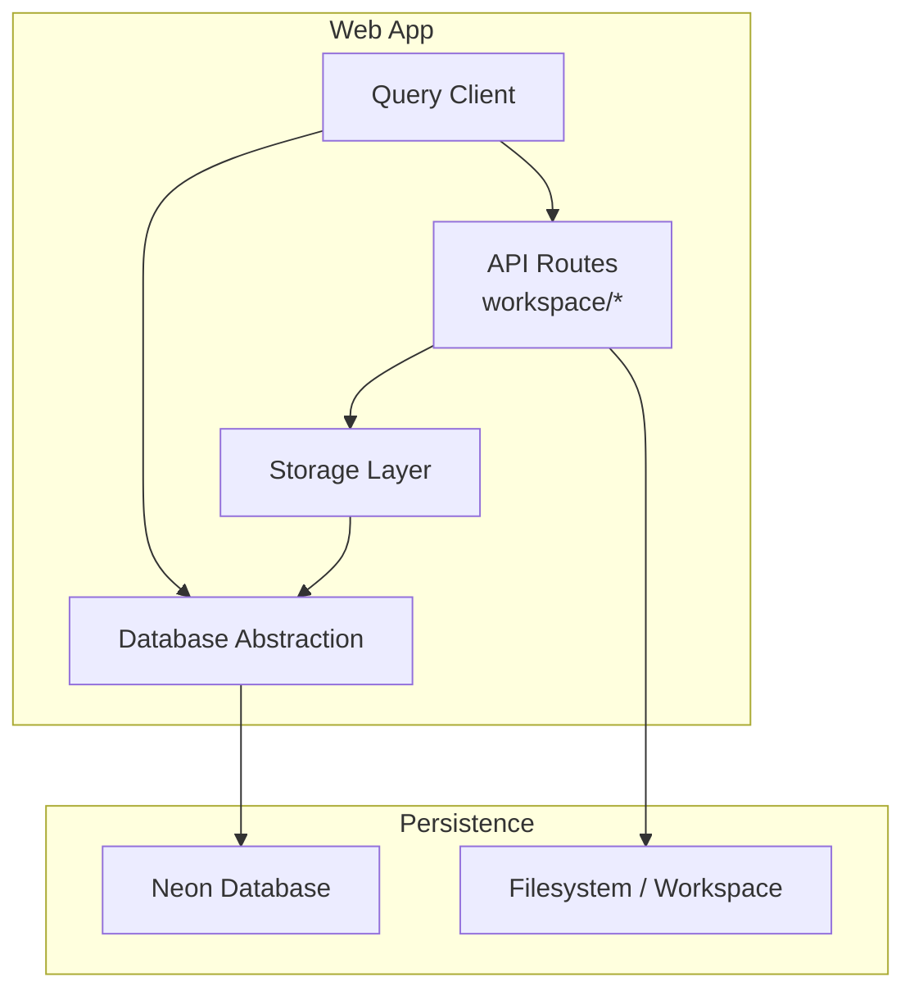
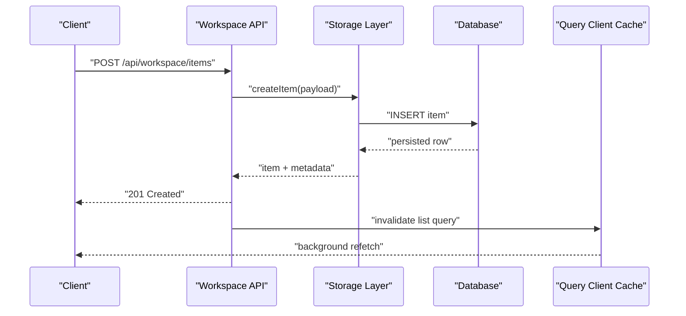
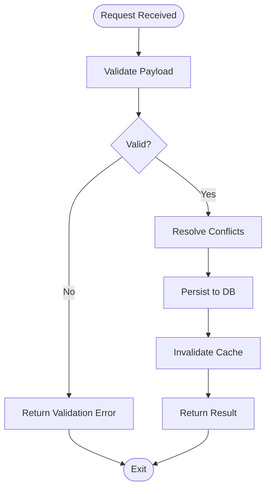
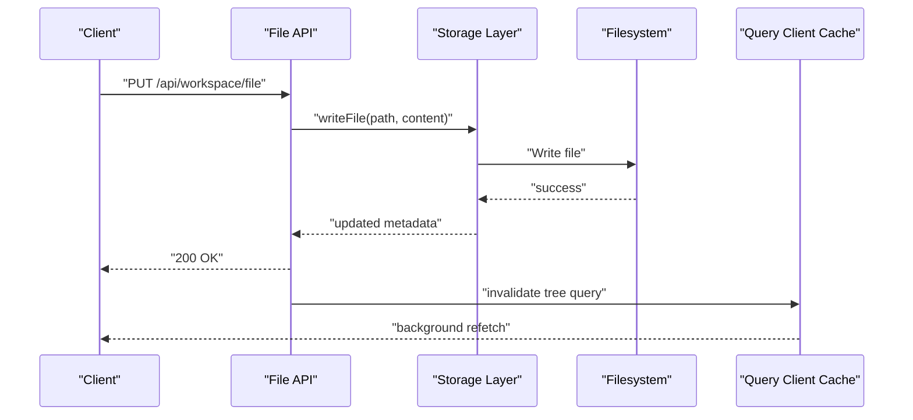
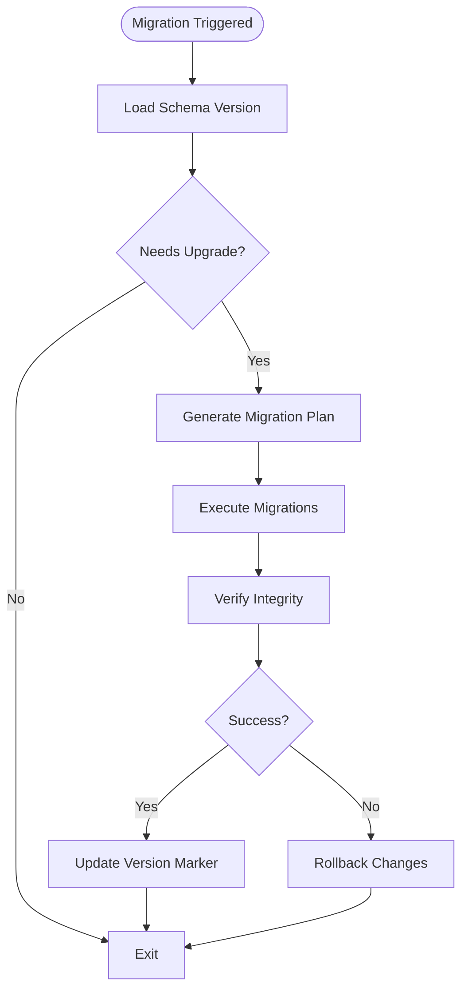
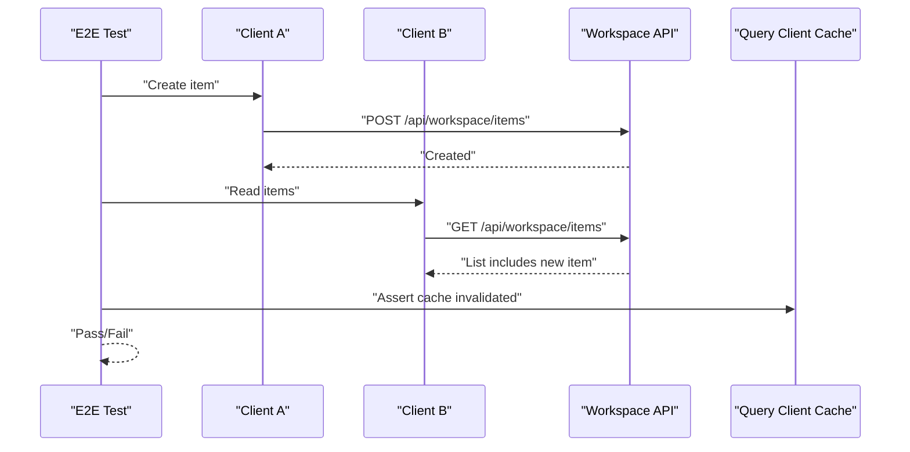
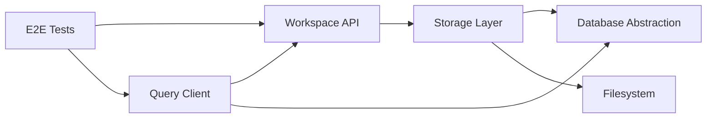

# State Synchronization & Real-time Features

<cite>
**Referenced Files in This Document**
- [openui-state-sync.e2e.ts](file://apps/web/e2e/openui-state-sync.e2e.ts)
- [chat-migrate.ts](file://apps/web/scripts/chat-migrate.ts)
- [auth-post-migrate.ts](file://apps/web/scripts/auth-post-migrate.ts)
- [remap-auth-user-ids.ts](file://apps/web/scripts/remap-auth-user-ids.ts)
- [quarantine-orphan-sessions.ts](file://apps/web/scripts/quarantine-orphan-sessions.ts)
- [architecture.md](file://docs/architecture.md)
- [0001-agent-workspace-as-canonical-adaptive-state.md](file://docs/adr/0001-agent-workspace-as-canonical-adaptive-state.md)
- [0003-owner-only-session-mirror.md](file://docs/adr/0003-owner-only-session-mirror.md)
- [agent-workspace.md](file://docs/agent-workspace.md)
- [workspace/item.ts](file://apps/web/src/routes/api/workspace/item.ts)
- [workspace/items.ts](file://apps/web/src/routes/api/workspace/items.ts)
- [workspace/file.ts](file://apps/web/src/routes/api/workspace/file.ts)
- [workspace/tree.ts](file://apps/web/src/routes/api/workspace/tree.ts)
- [storage/index.ts](file://apps/web/src/lib/storage/index.ts)
- [db/index.ts](file://apps/web/src/lib/db/index.ts)
- [query-client.ts](file://apps/web/src/lib/query-client.ts)
</cite>

## Table of Contents

1. [Introduction](#introduction)
2. [Project Structure](#project-structure)
3. [Core Components](#core-components)
4. [Architecture Overview](#architecture-overview)
5. [Detailed Component Analysis](#detailed-component-analysis)
6. [Dependency Analysis](#dependency-analysis)
7. [Performance Considerations](#performance-considerations)
8. [Troubleshooting Guide](#troubleshooting-guide)
9. [Conclusion](#conclusion)
10. [Appendices](#appendices)

## Introduction

This document explains the state synchronization mechanisms that keep workspace sessions consistent across users and devices. It covers real-time collaboration patterns, conflict resolution strategies, data persistence, storage layer architecture, caching, offline support, custom sync rules, concurrent edit handling, performance optimization, data migration, backups, and recovery. The goal is to provide both a high-level understanding and actionable guidance for implementing and maintaining robust synchronization in this codebase.

## Project Structure

The repository organizes synchronization-related logic primarily under:

- API routes for workspace operations (items, files, tree)
- Storage and database abstractions
- Query client configuration for caching and background updates
- E2E tests validating state synchronization behavior
- Scripts for data migration and maintenance
- Architecture Decision Records (ADRs) describing canonical state models and session mirroring

**Diagram sources**

- [workspace/item.ts](file://apps/web/src/routes/api/workspace/item.ts)
- [workspace/items.ts](file://apps/web/src/routes/api/workspace/items.ts)
- [workspace/file.ts](file://apps/web/src/routes/api/workspace/file.ts)
- [workspace/tree.ts](file://apps/web/src/routes/api/workspace/tree.ts)
- [storage/index.ts](file://apps/web/src/lib/storage/index.ts)
- [db/index.ts](file://apps/web/src/lib/db/index.ts)
- [query-client.ts](file://apps/web/src/lib/query-client.ts)

**Section sources**

- [architecture.md](file://docs/architecture.md)
- [0001-agent-workspace-as-canonical-adaptive-state.md](file://docs/adr/0001-agent-workspace-as-canonical-adaptive-state.md)
- [0003-owner-only-session-mirror.md](file://docs/adr/0003-owner-only-session-mirror.md)

## Core Components

- Workspace API endpoints expose operations for items, files, and tree traversal, which are the primary entry points for synchronizing workspace state.
- Storage abstraction encapsulates read/write semantics and integrates with filesystem and database layers.
- Database abstraction centralizes queries and transactions, ensuring consistency during concurrent edits.
- Query client configures caching, background refetching, and optimistic updates to improve responsiveness.
- E2E tests validate synchronization flows across sessions and users.

Key responsibilities:

- Normalize and validate inputs before persistence
- Apply conflict resolution policies on write paths
- Maintain cache coherence via invalidation and refetch strategies
- Provide migration scripts for schema evolution and data remediation

**Section sources**

- [workspace/item.ts](file://apps/web/src/routes/api/workspace/item.ts)
- [workspace/items.ts](file://apps/web/src/routes/api/workspace/items.ts)
- [workspace/file.ts](file://apps/web/src/routes/api/workspace/file.ts)
- [workspace/tree.ts](file://apps/web/src/routes/api/workspace/tree.ts)
- [storage/index.ts](file://apps/web/src/lib/storage/index.ts)
- [db/index.ts](file://apps/web/src/lib/db/index.ts)
- [query-client.ts](file://apps/web/src/lib/query-client.ts)
- [openui-state-sync.e2e.ts](file://apps/web/e2e/openui-state-sync.e2e.ts)

## Architecture Overview

The synchronization architecture follows a layered approach:

- API layer handles requests, enforces authorization, and orchestrates writes
- Storage layer abstracts persistence details and applies business rules
- Database layer ensures ACID properties and supports transactions
- Query client manages client-side caching and background synchronization
- E2E tests exercise end-to-end synchronization scenarios

**Diagram sources**

- [workspace/items.ts](file://apps/web/src/routes/api/workspace/items.ts)
- [storage/index.ts](file://apps/web/src/lib/storage/index.ts)
- [db/index.ts](file://apps/web/src/lib/db/index.ts)
- [query-client.ts](file://apps/web/src/lib/query-client.ts)

## Detailed Component Analysis

### Workspace Item Operations

- Endpoints manage creation, updates, and deletion of workspace items.
- Conflict resolution is applied at the storage layer using versioning or last-writer-wins policies.
- Transactions ensure atomicity when updating related entities.

**Diagram sources**

- [workspace/item.ts](file://apps/web/src/routes/api/workspace/item.ts)
- [workspace/items.ts](file://apps/web/src/routes/api/workspace/items.ts)
- [storage/index.ts](file://apps/web/src/lib/storage/index.ts)
- [db/index.ts](file://apps/web/src/lib/db/index.ts)
- [query-client.ts](file://apps/web/src/lib/query-client.ts)

**Section sources**

- [workspace/item.ts](file://apps/web/src/routes/api/workspace/item.ts)
- [workspace/items.ts](file://apps/web/src/routes/api/workspace/items.ts)

### File Operations and Tree Sync

- File endpoints handle content reads/writes and metadata updates.
- Tree endpoint provides hierarchical structure for efficient UI rendering and incremental sync.
- Changes propagate through cache invalidation and background refetches.

**Diagram sources**

- [workspace/file.ts](file://apps/web/src/routes/api/workspace/file.ts)
- [workspace/tree.ts](file://apps/web/src/routes/api/workspace/tree.ts)
- [storage/index.ts](file://apps/web/src/lib/storage/index.ts)
- [query-client.ts](file://apps/web/src/lib/query-client.ts)

**Section sources**

- [workspace/file.ts](file://apps/web/src/routes/api/workspace/file.ts)
- [workspace/tree.ts](file://apps/web/src/routes/api/workspace/tree.ts)

### Data Migration and Maintenance

- Migration scripts evolve schemas and reconcile data inconsistencies.
- Post-migration tasks ensure integrity and compatibility across versions.
- Quarantine processes isolate orphaned sessions to maintain system health.

**Diagram sources**

- [chat-migrate.ts](file://apps/web/scripts/chat-migrate.ts)
- [auth-post-migrate.ts](file://apps/web/scripts/auth-post-migrate.ts)
- [remap-auth-user-ids.ts](file://apps/web/scripts/remap-auth-user-ids.ts)
- [quarantine-orphan-sessions.ts](file://apps/web/scripts/quarantine-orphan-sessions.ts)

**Section sources**

- [chat-migrate.ts](file://apps/web/scripts/chat-migrate.ts)
- [auth-post-migrate.ts](file://apps/web/scripts/auth-post-migrate.ts)
- [remap-auth-user-ids.ts](file://apps/web/scripts/remap-auth-user-ids.ts)
- [quarantine-orphan-sessions.ts](file://apps/web/scripts/quarantine-orphan-sessions.ts)

### E2E Synchronization Tests

- Tests simulate multiple clients editing concurrently and verify eventual consistency.
- Assertions cover cache invalidation, background refetches, and conflict resolution outcomes.

**Diagram sources**

- [openui-state-sync.e2e.ts](file://apps/web/e2e/openui-state-sync.e2e.ts)
- [workspace/items.ts](file://apps/web/src/routes/api/workspace/items.ts)
- [query-client.ts](file://apps/web/src/lib/query-client.ts)

**Section sources**

- [openui-state-sync.e2e.ts](file://apps/web/e2e/openui-state-sync.e2e.ts)

## Dependency Analysis

The synchronization components depend on each other in a clear hierarchy:

- API routes depend on storage abstractions
- Storage depends on database and filesystem implementations
- Query client depends on API responses and cache policies
- E2E tests depend on API contracts and cache behaviors

**Diagram sources**

- [workspace/item.ts](file://apps/web/src/routes/api/workspace/item.ts)
- [workspace/items.ts](file://apps/web/src/routes/api/workspace/items.ts)
- [workspace/file.ts](file://apps/web/src/routes/api/workspace/file.ts)
- [workspace/tree.ts](file://apps/web/src/routes/api/workspace/tree.ts)
- [storage/index.ts](file://apps/web/src/lib/storage/index.ts)
- [db/index.ts](file://apps/web/src/lib/db/index.ts)
- [query-client.ts](file://apps/web/src/lib/query-client.ts)
- [openui-state-sync.e2e.ts](file://apps/web/e2e/openui-state-sync.e2e.ts)

**Section sources**

- [workspace/item.ts](file://apps/web/src/routes/api/workspace/item.ts)
- [workspace/items.ts](file://apps/web/src/routes/api/workspace/items.ts)
- [workspace/file.ts](file://apps/web/src/routes/api/workspace/file.ts)
- [workspace/tree.ts](file://apps/web/src/routes/api/workspace/tree.ts)
- [storage/index.ts](file://apps/web/src/lib/storage/index.ts)
- [db/index.ts](file://apps/web/src/lib/db/index.ts)
- [query-client.ts](file://apps/web/src/lib/query-client.ts)
- [openui-state-sync.e2e.ts](file://apps/web/e2e/openui-state-sync.e2e.ts)

## Performance Considerations

- Use batched writes to reduce database round-trips during bulk operations.
- Implement optimistic updates with rollback on failure to improve perceived latency.
- Configure cache TTL and stale-while-revalidate policies to balance freshness and performance.
- Leverage incremental tree diffs to minimize payload sizes during synchronization.
- Monitor query performance and add indexes where necessary to avoid slow lookups.

[No sources needed since this section provides general guidance]

## Troubleshooting Guide

Common issues and resolutions:

- Stale cache entries: Clear cache and force refetch; verify invalidation triggers on write paths.
- Concurrent edit conflicts: Review conflict resolution strategy; consider operational transforms or CRDTs for complex cases.
- Migration failures: Inspect migration logs; use rollback procedures to restore previous state.
- Orphaned sessions: Run quarantine scripts to isolate inconsistent sessions and prevent cascading errors.

**Section sources**

- [query-client.ts](file://apps/web/src/lib/query-client.ts)
- [chat-migrate.ts](file://apps/web/scripts/chat-migrate.ts)
- [auth-post-migrate.ts](file://apps/web/scripts/auth-post-migrate.ts)
- [quarantine-orphan-sessions.ts](file://apps/web/scripts/quarantine-orphan-sessions.ts)

## Conclusion

The synchronization architecture combines robust API design, layered storage abstractions, and intelligent caching to deliver consistent, real-time collaboration experiences. By following the documented patterns for conflict resolution, migration, and performance tuning, teams can extend and maintain reliable state synchronization across diverse environments and user scenarios.

[No sources needed since this section summarizes without analyzing specific files]

## Appendices

### Real-time Collaboration Patterns

- Implement WebSocket-based event streams for live updates where appropriate.
- Use presence indicators to show active collaborators and their cursors.
- Apply conflict-free replicated data types (CRDTs) for collaborative text editing.

[No sources needed since this section provides general guidance]

### Custom Sync Rules Implementation

- Define rule interfaces for validation and transformation at the storage layer.
- Integrate custom rules into write pipelines to enforce domain-specific constraints.
- Test rules thoroughly with unit and integration tests to ensure correctness.

[No sources needed since this section provides general guidance]

### Data Migration Strategies

- Version schemas explicitly and apply migrations incrementally.
- Provide backward-compatible transitions to avoid downtime.
- Automate migration execution in deployment pipelines with rollback capabilities.

**Section sources**

- [chat-migrate.ts](file://apps/web/scripts/chat-migrate.ts)
- [auth-post-migrate.ts](file://apps/web/scripts/auth-post-migrate.ts)
- [remap-auth-user-ids.ts](file://apps/web/scripts/remap-auth-user-ids.ts)

### Backup and Recovery Procedures

- Schedule regular backups of critical data stores and workspace files.
- Encrypt backups and store them in secure, geographically distributed locations.
- Test recovery procedures regularly to ensure data integrity and availability.

[No sources needed since this section provides general guidance]
