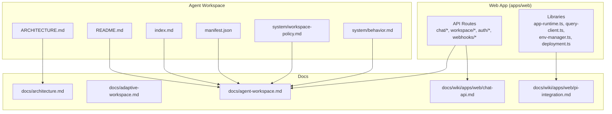
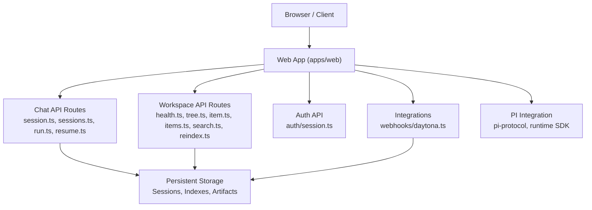
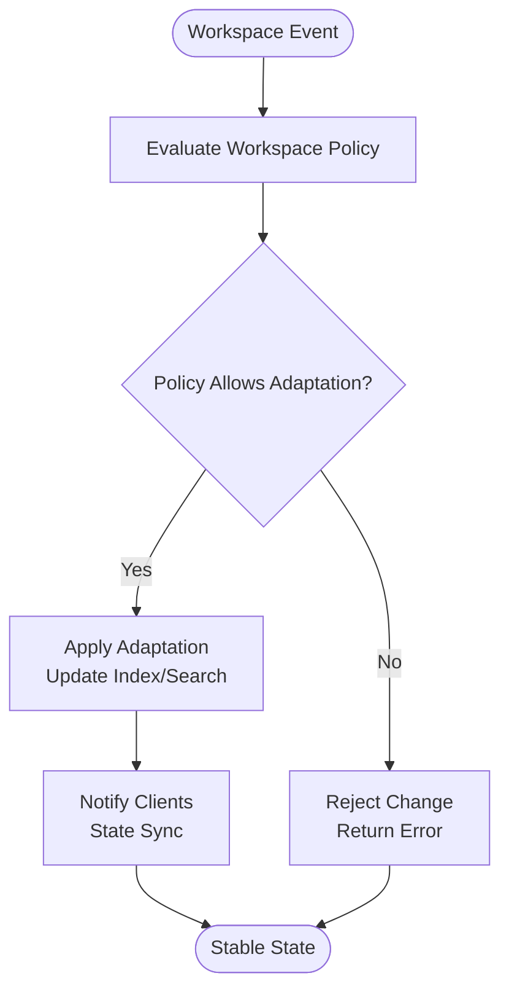
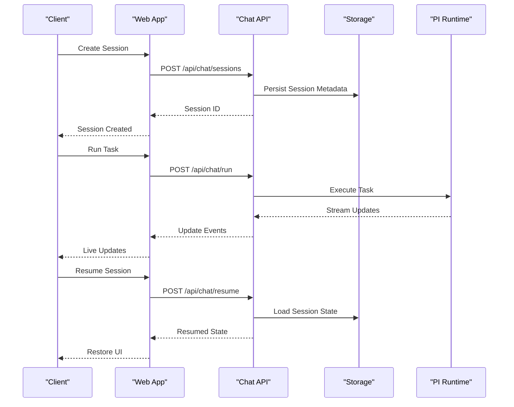
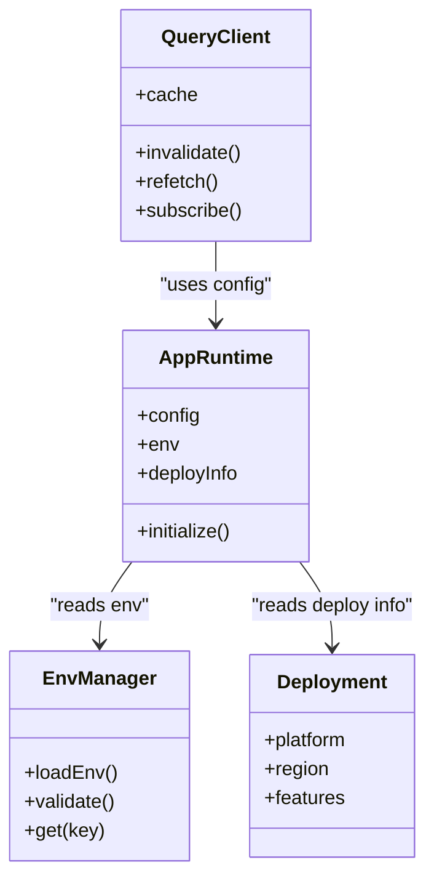
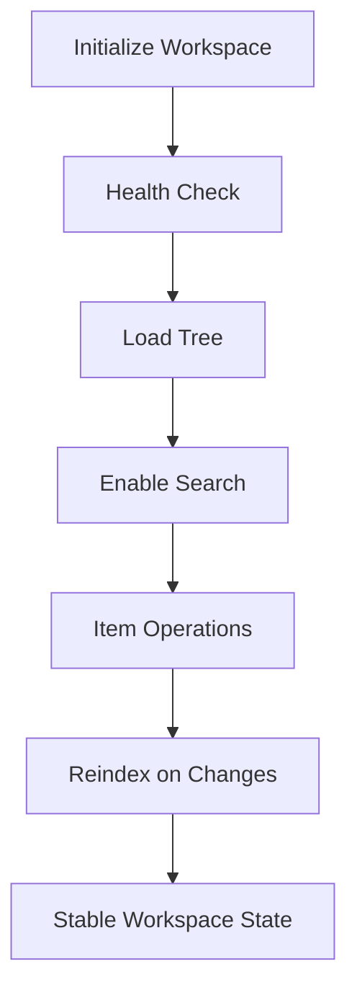
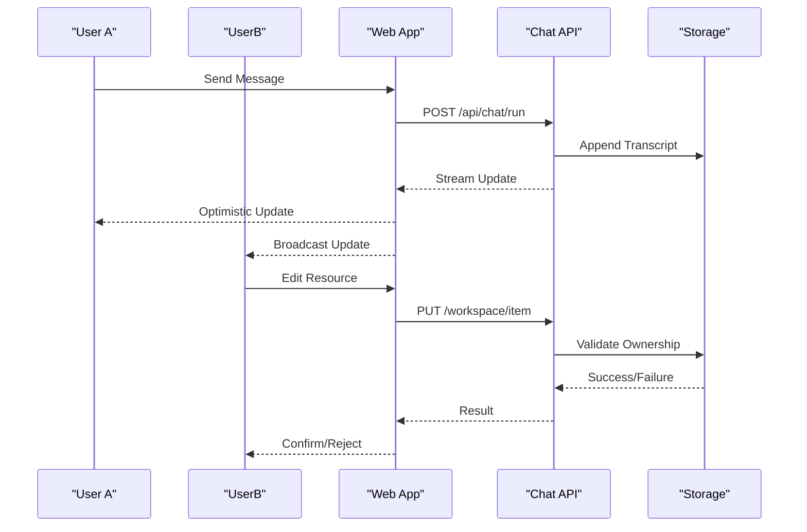
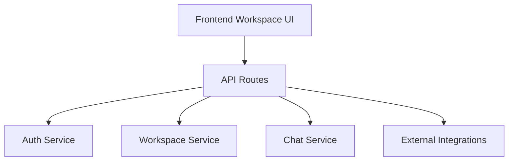
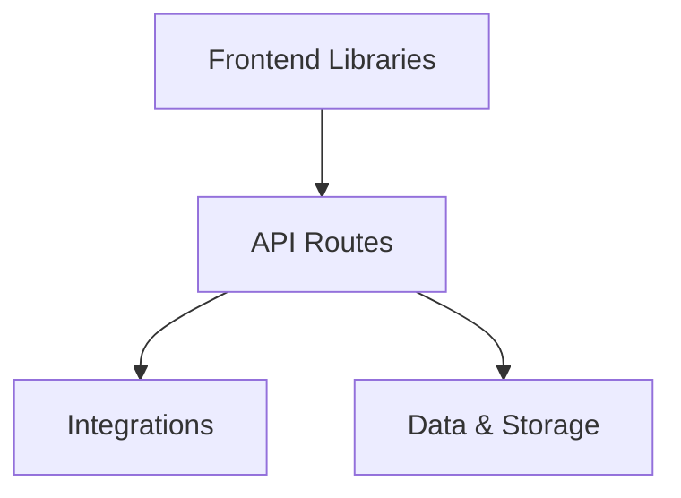

# Workspace Architecture & Core Concepts

<cite>
**Referenced Files in This Document**
- [ARCHITECTURE.md](file://agent-workspace/ARCHITECTURE.md)
- [README.md](file://agent-workspace/README.md)
- [workspace-policy.md](file://agent-workspace/system/workspace-policy.md)
- [behavior.md](file://agent-workspace/system/behavior.md)
- [index.md](file://agent-workspace/index.md)
- [manifest.json](file://agent-workspace/manifest.json)
- [architecture.md](file://docs/architecture.md)
- [adaptive-workspace.md](file://docs/adaptive-workspace.md)
- [agent-workspace.md](file://docs/agent-workspace.md)
- [chat-api.md](file://docs/wiki/apps/web/chat-api.md)
- [pi-integration.md](file://docs/wiki/apps/web/pi-integration.md)
- [session.ts](file://apps/web/src/routes/api/chat/session.ts)
- [sessions.ts](file://apps/web/src/routes/api/chat/sessions.ts)
- [run.ts](file://apps/web/src/routes/api/chat/run.ts)
- [resume.ts](file://apps/web/src/routes/api/chat/resume.ts)
- [health.ts](file://apps/web/src/routes/api/workspace/health.ts)
- [tree.ts](file://apps/web/src/routes/api/workspace/tree.ts)
- [item.ts](file://apps/web/src/routes/api/workspace/item.ts)
- [items.ts](file://apps/web/src/routes/api/workspace/items.ts)
- [search.ts](file://apps/web/src/routes/api/workspace/search.ts)
- [reindex.ts](file://apps/web/src/routes/api/workspace/reindex.ts)
- [app-runtime.ts](file://apps/web/src/lib/app-runtime.ts)
- [query-client.ts](file://apps/web/src/lib/query-client.ts)
- [env-manager.ts](file://apps/web/src/lib/env-manager.ts)
- [deployment.ts](file://apps/web/src/lib/deployment.ts)
- [auth/session.ts](file://apps/web/src/routes/api/auth/session.ts)
- [daytona.ts](file://apps/web/src/routes/api/webhooks/daytona.ts)
- [0001-agent-workspace-as-canonical-adaptive-state.md](file://docs/adr/0001-agent-workspace-as-canonical-adaptive-state.md)
- [0002-vercel-neon-deployment-trust-zones.md](file://docs/adr/0002-vercel-neon-deployment-trust-zones.md)
- [0003-owner-only-session-mirror.md](file://docs/adr/0003-owner-only-session-mirror.md)
- [0004-user-controlled-transcript-deletion.md](file://docs/adr/0004-user-controlled-transcript-deletion.md)
</cite>

## Table of Contents

1. [Introduction](#introduction)
2. [Project Structure](#project-structure)
3. [Core Components](#core-components)
4. [Architecture Overview](#architecture-overview)
5. [Detailed Component Analysis](#detailed-component-analysis)
6. [Dependency Analysis](#dependency-analysis)
7. [Performance Considerations](#performance-considerations)
8. [Troubleshooting Guide](#troubleshooting-guide)
9. [Conclusion](#conclusion)
10. [Appendices](#appendices)

## Introduction

This document explains the Agent Workspace system’s architecture and core concepts, focusing on the adaptive workspace pattern, session management, state synchronization, and real-time collaboration. It maps how the frontend workspace interface integrates with backend services, and how AI agents interact with workspace resources. The goal is to provide a clear, layered understanding for both technical and non-technical readers.

## Project Structure

The repository organizes the Agent Workspace across several areas:

- agent-workspace: workspace metadata, policies, skills, memory, plans, and artifacts that define the adaptive workspace behavior and content.
- apps/web: the web application exposing API routes for chat, workspace operations, authentication, and integrations (e.g., Daytona sandbox).
- docs: architectural decisions, feature descriptions, and wiki documentation describing the workspace design and runtime integration.
- packages: shared libraries and protocols used by the workspace and UI.

**Diagram sources**

- [ARCHITECTURE.md](file://agent-workspace/ARCHITECTURE.md)
- [README.md](file://agent-workspace/README.md)
- [index.md](file://agent-workspace/index.md)
- [manifest.json](file://agent-workspace/manifest.json)
- [workspace-policy.md](file://agent-workspace/system/workspace-policy.md)
- [behavior.md](file://agent-workspace/system/behavior.md)
- [architecture.md](file://docs/architecture.md)
- [adaptive-workspace.md](file://docs/adaptive-workspace.md)
- [agent-workspace.md](file://docs/agent-workspace.md)
- [chat-api.md](file://docs/wiki/apps/web/chat-api.md)
- [pi-integration.md](file://docs/wiki/apps/web/pi-integration.md)
- [session.ts](file://apps/web/src/routes/api/chat/session.ts)
- [sessions.ts](file://apps/web/src/routes/api/chat/sessions.ts)
- [run.ts](file://apps/web/src/routes/api/chat/run.ts)
- [resume.ts](file://apps/web/src/routes/api/chat/resume.ts)
- [health.ts](file://apps/web/src/routes/api/workspace/health.ts)
- [tree.ts](file://apps/web/src/routes/api/workspace/tree.ts)
- [item.ts](file://apps/web/src/routes/api/workspace/item.ts)
- [items.ts](file://apps/web/src/routes/api/workspace/items.ts)
- [search.ts](file://apps/web/src/routes/api/workspace/search.ts)
- [reindex.ts](file://apps/web/src/routes/api/workspace/reindex.ts)
- [app-runtime.ts](file://apps/web/src/lib/app-runtime.ts)
- [query-client.ts](file://apps/web/src/lib/query-client.ts)
- [env-manager.ts](file://apps/web/src/lib/env-manager.ts)
- [deployment.ts](file://apps/web/src/lib/deployment.ts)
- [auth/session.ts](file://apps/web/src/routes/api/auth/session.ts)
- [daytona.ts](file://apps/web/src/routes/api/webhooks/daytona.ts)

**Section sources**

- [ARCHITECTURE.md](file://agent-workspace/ARCHITECTURE.md)
- [README.md](file://agent-workspace/README.md)
- [index.md](file://agent-workspace/index.md)
- [manifest.json](file://agent-workspace/manifest.json)
- [workspace-policy.md](file://agent-workspace/system/workspace-policy.md)
- [behavior.md](file://agent-workspace/system/behavior.md)
- [architecture.md](file://docs/architecture.md)
- [adaptive-workspace.md](file://docs/adaptive-workspace.md)
- [agent-workspace.md](file://docs/agent-workspace.md)
- [chat-api.md](file://docs/wiki/apps/web/chat-api.md)
- [pi-integration.md](file://docs/wiki/apps/web/pi-integration.md)
- [session.ts](file://apps/web/src/routes/api/chat/session.ts)
- [sessions.ts](file://apps/web/src/routes/api/chat/sessions.ts)
- [run.ts](file://apps/web/src/routes/api/chat/run.ts)
- [resume.ts](file://apps/web/src/routes/api/chat/resume.ts)
- [health.ts](file://apps/web/src/routes/api/workspace/health.ts)
- [tree.ts](file://apps/web/src/routes/api/workspace/tree.ts)
- [item.ts](file://apps/web/src/routes/api/workspace/item.ts)
- [items.ts](file://apps/web/src/routes/api/workspace/items.ts)
- [search.ts](file://apps/web/src/routes/api/workspace/search.ts)
- [reindex.ts](file://apps/web/src/routes/api/workspace/reindex.ts)
- [app-runtime.ts](file://apps/web/src/lib/app-runtime.ts)
- [query-client.ts](file://apps/web/src/lib/query-client.ts)
- [env-manager.ts](file://apps/web/src/lib/env-manager.ts)
- [deployment.ts](file://apps/web/src/lib/deployment.ts)
- [auth/session.ts](file://apps/web/src/routes/api/auth/session.ts)
- [daytona.ts](file://apps/web/src/routes/api/webhooks/daytona.ts)

## Core Components

- Adaptive Workspace Pattern: The workspace evolves over time based on user actions, AI agent interactions, and environment changes. Policies and behaviors govern how the workspace adapts, ensuring consistency and safety.
- Session Management: Sessions encapsulate conversation context, run state, and resource ownership. They support creation, resumption, and lifecycle control.
- State Synchronization: The UI maintains optimistic updates and reconciles with server state via a query client. Real-time features rely on consistent event ordering and conflict resolution strategies.
- Workspace Lifecycle: Initialization, indexing, search, tree traversal, and item operations are exposed through dedicated endpoints. Health checks ensure readiness.
- Context Management: Runtime configuration, environment variables, and deployment details are managed centrally to ensure consistent behavior across components.
- Real-Time Collaboration: Chat runs and workspace events are coordinated to keep multiple participants synchronized while preserving ownership boundaries.

**Section sources**

- [workspace-policy.md](file://agent-workspace/system/workspace-policy.md)
- [behavior.md](file://agent-workspace/system/behavior.md)
- [session.ts](file://apps/web/src/routes/api/chat/session.ts)
- [sessions.ts](file://apps/web/src/routes/api/chat/sessions.ts)
- [run.ts](file://apps/web/src/routes/api/chat/run.ts)
- [resume.ts](file://apps/web/src/routes/api/chat/resume.ts)
- [health.ts](file://apps/web/src/routes/api/workspace/health.ts)
- [tree.ts](file://apps/web/src/routes/api/workspace/tree.ts)
- [item.ts](file://apps/web/src/routes/api/workspace/item.ts)
- [items.ts](file://apps/web/src/routes/api/workspace/items.ts)
- [search.ts](file://apps/web/src/routes/api/workspace/search.ts)
- [reindex.ts](file://apps/web/src/routes/api/workspace/reindex.ts)
- [app-runtime.ts](file://apps/web/src/lib/app-runtime.ts)
- [query-client.ts](file://apps/web/src/lib/query-client.ts)
- [env-manager.ts](file://apps/web/src/lib/env-manager.ts)
- [deployment.ts](file://apps/web/src/lib/deployment.ts)

## Architecture Overview

The Agent Workspace comprises three primary layers:

- Frontend Workspace Interface: Provides interactive controls, displays live updates, and manages local state with optimistic UI patterns.
- Backend Services: Expose RESTful APIs for chat sessions, workspace operations, authentication, and integrations.
- Data and Integration Layer: Manages persistent storage, indexing, search, and external services like Daytona sandboxes.

**Diagram sources**

- [session.ts](file://apps/web/src/routes/api/chat/session.ts)
- [sessions.ts](file://apps/web/src/routes/api/chat/sessions.ts)
- [run.ts](file://apps/web/src/routes/api/chat/run.ts)
- [resume.ts](file://apps/web/src/routes/api/chat/resume.ts)
- [health.ts](file://apps/web/src/routes/api/workspace/health.ts)
- [tree.ts](file://apps/web/src/routes/api/workspace/tree.ts)
- [item.ts](file://apps/web/src/routes/api/workspace/item.ts)
- [items.ts](file://apps/web/src/routes/api/workspace/items.ts)
- [search.ts](file://apps/web/src/routes/api/workspace/search.ts)
- [reindex.ts](file://apps/web/src/routes/api/workspace/reindex.ts)
- [auth/session.ts](file://apps/web/src/routes/api/auth/session.ts)
- [daytona.ts](file://apps/web/src/routes/api/webhooks/daytona.ts)
- [chat-api.md](file://docs/wiki/apps/web/chat-api.md)
- [pi-integration.md](file://docs/wiki/apps/web/pi-integration.md)

## Detailed Component Analysis

### Adaptive Workspace Pattern

The adaptive workspace pattern ensures the workspace remains aligned with user intent and evolving context. Policies define constraints and behaviors; runtime decisions adjust indexing, search relevance, and resource visibility.

**Diagram sources**

- [workspace-policy.md](file://agent-workspace/system/workspace-policy.md)
- [behavior.md](file://agent-workspace/system/behavior.md)
- [adaptive-workspace.md](file://docs/adaptive-workspace.md)

**Section sources**

- [workspace-policy.md](file://agent-workspace/system/workspace-policy.md)
- [behavior.md](file://agent-workspace/system/behavior.md)
- [adaptive-workspace.md](file://docs/adaptive-workspace.md)

### Session Management Architecture

Sessions encapsulate conversation state, ownership, and lifecycle. Key operations include creating sessions, running tasks, resuming interrupted work, and listing or retrieving session details.

**Diagram sources**

- [sessions.ts](file://apps/web/src/routes/api/chat/sessions.ts)
- [run.ts](file://apps/web/src/routes/api/chat/run.ts)
- [resume.ts](file://apps/web/src/routes/api/chat/resume.ts)
- [session.ts](file://apps/web/src/routes/api/chat/session.ts)
- [chat-api.md](file://docs/wiki/apps/web/chat-api.md)

**Section sources**

- [sessions.ts](file://apps/web/src/routes/api/chat/sessions.ts)
- [run.ts](file://apps/web/src/routes/api/chat/run.ts)
- [resume.ts](file://apps/web/src/routes/api/chat/resume.ts)
- [session.ts](file://apps/web/src/routes/api/chat/session.ts)
- [chat-api.md](file://docs/wiki/apps/web/chat-api.md)

### State Synchronization Mechanisms

The frontend uses a query client to manage optimistic updates and reconcile with server state. Environment and deployment configurations ensure consistent runtime behavior.

**Diagram sources**

- [query-client.ts](file://apps/web/src/lib/query-client.ts)
- [app-runtime.ts](file://apps/web/src/lib/app-runtime.ts)
- [env-manager.ts](file://apps/web/src/lib/env-manager.ts)
- [deployment.ts](file://apps/web/src/lib/deployment.ts)

**Section sources**

- [query-client.ts](file://apps/web/src/lib/query-client.ts)
- [app-runtime.ts](file://apps/web/src/lib/app-runtime.ts)
- [env-manager.ts](file://apps/web/src/lib/env-manager.ts)
- [deployment.ts](file://apps/web/src/lib/deployment.ts)

### Workspace Lifecycle and Context Management

Workspace operations include health checks, tree traversal, item CRUD, search, and reindexing. Context management centralizes runtime configuration and environment validation.

**Diagram sources**

- [health.ts](file://apps/web/src/routes/api/workspace/health.ts)
- [tree.ts](file://apps/web/src/routes/api/workspace/tree.ts)
- [item.ts](file://apps/web/src/routes/api/workspace/item.ts)
- [items.ts](file://apps/web/src/routes/api/workspace/items.ts)
- [search.ts](file://apps/web/src/routes/api/workspace/search.ts)
- [reindex.ts](file://apps/web/src/routes/api/workspace/reindex.ts)
- [app-runtime.ts](file://apps/web/src/lib/app-runtime.ts)
- [env-manager.ts](file://apps/web/src/lib/env-manager.ts)

**Section sources**

- [health.ts](file://apps/web/src/routes/api/workspace/health.ts)
- [tree.ts](file://apps/web/src/routes/api/workspace/tree.ts)
- [item.ts](file://apps/web/src/routes/api/workspace/item.ts)
- [items.ts](file://apps/web/src/routes/api/workspace/items.ts)
- [search.ts](file://apps/web/src/routes/api/workspace/search.ts)
- [reindex.ts](file://apps/web/src/routes/api/workspace/reindex.ts)
- [app-runtime.ts](file://apps/web/src/lib/app-runtime.ts)
- [env-manager.ts](file://apps/web/src/lib/env-manager.ts)

### Real-Time Collaboration Features

Real-time collaboration relies on streaming updates from chat runs and workspace events. Ownership boundaries ensure only authorized users can modify session state.

**Diagram sources**

- [run.ts](file://apps/web/src/routes/api/chat/run.ts)
- [item.ts](file://apps/web/src/routes/api/workspace/item.ts)
- [auth/session.ts](file://apps/web/src/routes/api/auth/session.ts)
- [chat-api.md](file://docs/wiki/apps/web/chat-api.md)

**Section sources**

- [run.ts](file://apps/web/src/routes/api/chat/run.ts)
- [item.ts](file://apps/web/src/routes/api/workspace/item.ts)
- [auth/session.ts](file://apps/web/src/routes/api/auth/session.ts)
- [chat-api.md](file://docs/wiki/apps/web/chat-api.md)

### Integration Between Frontend and Backend Services

The frontend communicates with backend services through well-defined API routes. Authentication ensures secure access, while integrations extend capabilities via webhooks and external services.

**Diagram sources**

- [chat-api.md](file://docs/wiki/apps/web/chat-api.md)
- [pi-integration.md](file://docs/wiki/apps/web/pi-integration.md)
- [auth/session.ts](file://apps/web/src/routes/api/auth/session.ts)
- [daytona.ts](file://apps/web/src/routes/api/webhooks/daytona.ts)

**Section sources**

- [chat-api.md](file://docs/wiki/apps/web/chat-api.md)
- [pi-integration.md](file://docs/wiki/apps/web/pi-integration.md)
- [auth/session.ts](file://apps/web/src/routes/api/auth/session.ts)
- [daytona.ts](file://apps/web/src/routes/api/webhooks/daytona.ts)

## Dependency Analysis

The system exhibits clear separation between UI, API routes, and data/integration layers. Dependencies are minimized through modular route handlers and centralized runtime configuration.

**Diagram sources**

- [app-runtime.ts](file://apps/web/src/lib/app-runtime.ts)
- [query-client.ts](file://apps/web/src/lib/query-client.ts)
- [env-manager.ts](file://apps/web/src/lib/env-manager.ts)
- [deployment.ts](file://apps/web/src/lib/deployment.ts)
- [session.ts](file://apps/web/src/routes/api/chat/session.ts)
- [sessions.ts](file://apps/web/src/routes/api/chat/sessions.ts)
- [run.ts](file://apps/web/src/routes/api/chat/run.ts)
- [resume.ts](file://apps/web/src/routes/api/chat/resume.ts)
- [health.ts](file://apps/web/src/routes/api/workspace/health.ts)
- [tree.ts](file://apps/web/src/routes/api/workspace/tree.ts)
- [item.ts](file://apps/web/src/routes/api/workspace/item.ts)
- [items.ts](file://apps/web/src/routes/api/workspace/items.ts)
- [search.ts](file://apps/web/src/routes/api/workspace/search.ts)
- [reindex.ts](file://apps/web/src/routes/api/workspace/reindex.ts)
- [auth/session.ts](file://apps/web/src/routes/api/auth/session.ts)
- [daytona.ts](file://apps/web/src/routes/api/webhooks/daytona.ts)

**Section sources**

- [app-runtime.ts](file://apps/web/src/lib/app-runtime.ts)
- [query-client.ts](file://apps/web/src/lib/query-client.ts)
- [env-manager.ts](file://apps/web/src/lib/env-manager.ts)
- [deployment.ts](file://apps/web/src/lib/deployment.ts)
- [session.ts](file://apps/web/src/routes/api/chat/session.ts)
- [sessions.ts](file://apps/web/src/routes/api/chat/sessions.ts)
- [run.ts](file://apps/web/src/routes/api/chat/run.ts)
- [resume.ts](file://apps/web/src/routes/api/chat/resume.ts)
- [health.ts](file://apps/web/src/routes/api/workspace/health.ts)
- [tree.ts](file://apps/web/src/routes/api/workspace/tree.ts)
- [item.ts](file://apps/web/src/routes/api/workspace/item.ts)
- [items.ts](file://apps/web/src/routes/api/workspace/items.ts)
- [search.ts](file://apps/web/src/routes/api/workspace/search.ts)
- [reindex.ts](file://apps/web/src/routes/api/workspace/reindex.ts)
- [auth/session.ts](file://apps/web/src/routes/api/auth/session.ts)
- [daytona.ts](file://apps/web/src/routes/api/webhooks/daytona.ts)

## Performance Considerations

- Optimistic UI: Reduce perceived latency by updating the UI immediately and reconciling with server responses.
- Caching: Use query client caching to minimize redundant network requests.
- Streaming: Stream updates for long-running tasks to maintain responsiveness.
- Indexing: Incremental reindexing to avoid full rebuilds on minor changes.
- Concurrency: Limit concurrent operations per session to prevent resource contention.

[No sources needed since this section provides general guidance]

## Troubleshooting Guide

Common issues and resolutions:

- Session not found: Verify session IDs and ownership permissions.
- Stale state: Invalidate cache and refetch data when inconsistencies occur.
- Health check failures: Inspect workspace readiness and dependencies.
- Integration errors: Check webhook payloads and external service status.

**Section sources**

- [health.ts](file://apps/web/src/routes/api/workspace/health.ts)
- [query-client.ts](file://apps/web/src/lib/query-client.ts)
- [auth/session.ts](file://apps/web/src/routes/api/auth/session.ts)
- [daytona.ts](file://apps/web/src/routes/api/webhooks/daytona.ts)

## Conclusion

The Agent Workspace system implements an adaptive pattern that aligns workspace state with user intent and environment changes. Robust session management, state synchronization, and real-time collaboration ensure a responsive and consistent experience. Clear separation of concerns and modular design facilitate scalability, security, and performance optimization.

[No sources needed since this section summarizes without analyzing specific files]

## Appendices

### Architectural Decisions and References

- Canonical adaptive state definition and policy enforcement.
- Trust zones and deployment considerations.
- Owner-only session mirroring and transcript deletion policies.

**Section sources**

- [0001-agent-workspace-as-canonical-adaptive-state.md](file://docs/adr/0001-agent-workspace-as-canonical-adaptive-state.md)
- [0002-vercel-neon-deployment-trust-zones.md](file://docs/adr/0002-vercel-neon-deployment-trust-zones.md)
- [0003-owner-only-session-mirror.md](file://docs/adr/0003-owner-only-session-mirror.md)
- [0004-user-controlled-transcript-deletion.md](file://docs/adr/0004-user-controlled-transcript-deletion.md)
- [architecture.md](file://docs/architecture.md)
- [agent-workspace.md](file://docs/agent-workspace.md)
- [ARCHITECTURE.md](file://agent-workspace/ARCHITECTURE.md)
- [README.md](file://agent-workspace/README.md)
- [index.md](file://agent-workspace/index.md)
- [manifest.json](file://agent-workspace/manifest.json)
