# API Layer & Service Communication

<cite>
**Referenced Files in This Document**
- [chat.ts](file://functions/chat.ts)
- [api-utils.ts](file://apps/web/src/lib/api-utils.ts)
- [logger.ts](file://apps/web/src/lib/logger.ts)
- [query-client.ts](file://apps/web/src/lib/query-client.ts)
- [env-manager.ts](file://apps/web/src/lib/env-manager.ts)
- [auth-session.ts](file://apps/web/src/routes/api/auth/session.ts)
- [auth-root.ts](file://apps/web/src/routes/api/auth/$.ts)
- [chat-run.ts](file://apps/web/src/routes/api/chat/run.ts)
- [chat-question.ts](file://apps/web/src/routes/api/chat/question.ts)
- [chat-sessions.ts](file://apps/web/src/routes/api/chat/sessions.ts)
- [chat-session.ts](file://apps/web/src/routes/api/chat/session.ts)
- [chat-abort.ts](file://apps/web/src/routes/api/chat/abort.ts)
- [chat-resume.ts](file://apps/web/src/routes/api/chat/resume.ts)
- [chat-settings.ts](file://apps/web/src/routes/api/chat/settings.ts)
- [chat-account.ts](file://apps/web/src/routes/api/chat/account.ts)
- [chat-commands.ts](file://apps/web/src/routes/api/chat/commands.ts)
- [chat-models.ts](file://apps/web/src/routes/api/chat/models.ts)
- [chat-models-discover.ts](file://apps/web/src/routes/api/chat/models.discover.ts)
- [chat-providers.ts](file://apps/web/src/routes/api/chat/providers.ts)
- [chat-resources.ts](file://apps/web/src/routes/api/chat/resources.ts)
- [chat-provenance.ts](file://apps/web/src/routes/api/chat/provenance.ts)
- [workspace-health.ts](file://apps/web/src/routes/api/workspace/health.ts)
- [workspace-tree.ts](file://apps/web/src/routes/api/workspace/tree.ts)
- [workspace-items.ts](file://apps/web/src/routes/api/workspace/items.ts)
- [workspace-item.ts](file://apps/web/src/routes/api/workspace/item.ts)
- [workspace-file.ts](file://apps/web/src/routes/api/workspace/file.ts)
- [workspace-search.ts](file://apps/web/src/routes/api/workspace/search.ts)
- [workspace-reindex.ts](file://apps/web/src/routes/api/workspace/reindex.ts)
- [webhook-daytona.ts](file://apps/web/src/routes/api/webhooks/daytona.ts)
- [daytona-test.ts](file://apps/web/src/routes/api/webhooks/-daytona.test.ts)
- [chat-api-route.ts](file://apps/web/src/routes/api/chat.ts)
- [health-route.ts](file://apps/web/src/routes/api/health.ts)
- [openapi.json](file://apps/web/openapi.json)
- [generate-openapi.ts](file://apps/web/scripts/generate-openapi.ts)
</cite>

## Table of Contents

1. [Introduction](#introduction)
2. [Project Structure](#project-structure)
3. [Core Components](#core-components)
4. [Architecture Overview](#architecture-overview)
5. [Detailed Component Analysis](#detailed-component-analysis)
6. [Dependency Analysis](#dependency-analysis)
7. [Performance Considerations](#performance-considerations)
8. [Troubleshooting Guide](#troubleshooting-guide)
9. [Conclusion](#conclusion)
10. [Appendices](#appendices)

## Introduction

This document describes Fleet Pi’s service communication layer with a focus on the RESTful API endpoints for chat operations, workspace management, authentication, and webhook handlers. It also documents the WebSocket implementation for real-time chat, including connection handling, message formats, event types, and reconnection strategies. Additional topics include API gateway patterns, rate limiting, request validation middleware, JWT-based authentication flows, session management, authorization checks, error handling, logging, monitoring integration, API versioning, backward compatibility, and deprecation policies.

## Project Structure

Fleet Pi exposes HTTP endpoints through route files under apps/web/src/routes/api. Shared utilities handle API client behavior, logging, environment configuration, and OpenAPI generation. The serverless function functions/chat.ts provides an entry point for chat-related requests.

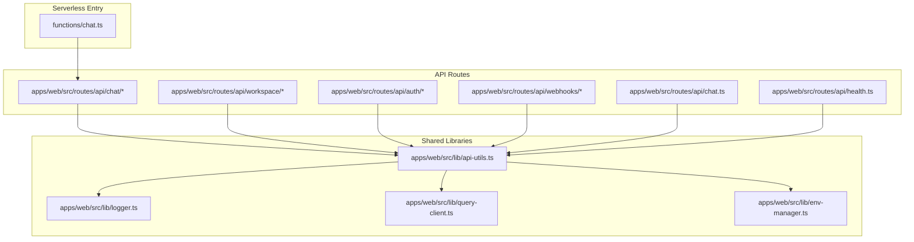

**Diagram sources**

- [chat.ts](file://functions/chat.ts)
- [chat-api-route.ts](file://apps/web/src/routes/api/chat.ts)
- [health-route.ts](file://apps/web/src/routes/api/health.ts)
- [api-utils.ts](file://apps/web/src/lib/api-utils.ts)
- [logger.ts](file://apps/web/src/lib/logger.ts)
- [query-client.ts](file://apps/web/src/lib/query-client.ts)
- [env-manager.ts](file://apps/web/src/lib/env-manager.ts)

**Section sources**

- [chat.ts](file://functions/chat.ts)
- [chat-api-route.ts](file://apps/web/src/routes/api/chat.ts)
- [health-route.ts](file://apps/web/src/routes/api/health.ts)
- [api-utils.ts](file://apps/web/src/lib/api-utils.ts)
- [logger.ts](file://apps/web/src/lib/logger.ts)
- [query-client.ts](file://apps/web/src/lib/query-client.ts)
- [env-manager.ts](file://apps/web/src/lib/env-manager.ts)

## Core Components

- API Utilities: Centralized helpers for building requests, handling responses, and managing headers (including authentication).
- Logger: Structured logging utility used across routes to capture request/response metadata and errors.
- Query Client: Configures caching, retries, and background updates for data fetching.
- Environment Manager: Loads runtime configuration and feature flags.
- OpenAPI Generator: Produces openapi.json from route definitions for documentation and tooling.

Key responsibilities:

- Normalize request/response payloads across endpoints.
- Inject auth headers and propagate correlation IDs.
- Provide consistent error shapes and status codes.
- Enable observability via structured logs and metrics hooks.

**Section sources**

- [api-utils.ts](file://apps/web/src/lib/api-utils.ts)
- [logger.ts](file://apps/web/src/lib/logger.ts)
- [query-client.ts](file://apps/web/src/lib/query-client.ts)
- [env-manager.ts](file://apps/web/src/lib/env-manager.ts)
- [generate-openapi.ts](file://apps/web/scripts/generate-openapi.ts)
- [openapi.json](file://apps/web/openapi.json)

## Architecture Overview

The API layer follows a modular route-per-feature pattern with shared middleware-like utilities. Authentication is enforced at the route level using JWT tokens. Real-time chat uses WebSockets over a dedicated endpoint, while long-running tasks are managed via run IDs and abort/resume endpoints.

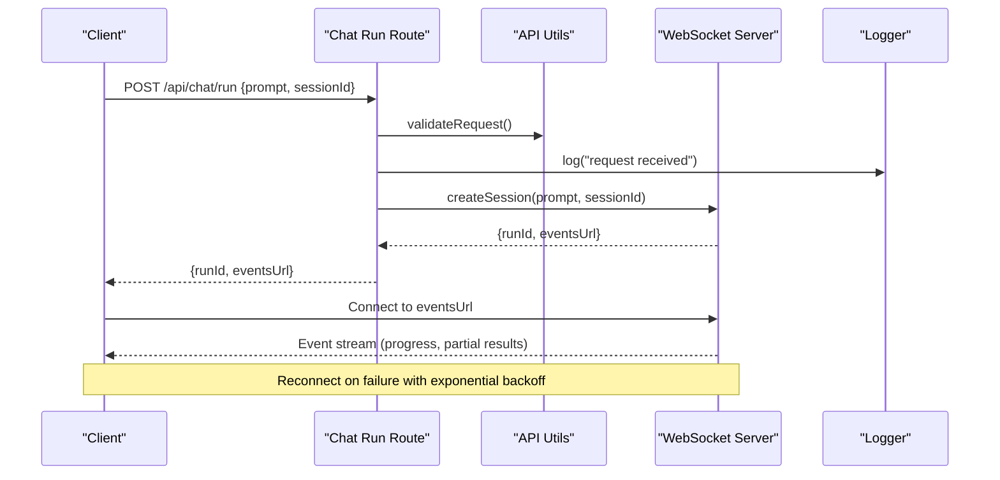

**Diagram sources**

- [chat-run.ts](file://apps/web/src/routes/api/chat/run.ts)
- [api-utils.ts](file://apps/web/src/lib/api-utils.ts)
- [logger.ts](file://apps/web/src/lib/logger.ts)
- [chat.ts](file://functions/chat.ts)

## Detailed Component Analysis

### Authentication Endpoints

- Purpose: Establish sessions, manage JWT tokens, and enforce authorization.
- Typical endpoints:
  - POST /api/auth/session: Create or refresh session; returns token payload and expiry.
  - GET/DELETE /api/auth/session: Retrieve current session or terminate it.
- Authentication: Requires valid JWT in Authorization header for protected routes; session endpoints may be public but return signed tokens.
- Request/Response:
  - Session creation: body includes credentials or provider callback params; response includes token and metadata.
  - Session retrieval: returns minimal user context and token expiry.
- Error Codes:
  - 401 Unauthorized for invalid or missing credentials.
  - 403 Forbidden for insufficient permissions.
  - 400 Bad Request for malformed payloads.
  - 500 Internal Server Error for unexpected failures.

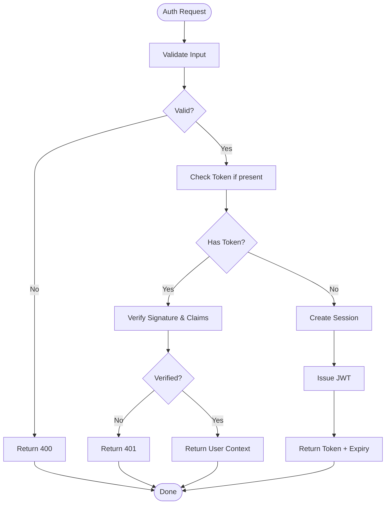

**Diagram sources**

- [auth-session.ts](file://apps/web/src/routes/api/auth/session.ts)
- [auth-root.ts](file://apps/web/src/routes/api/auth/$.ts)
- [api-utils.ts](file://apps/web/src/lib/api-utils.ts)

**Section sources**

- [auth-session.ts](file://apps/web/src/routes/api/auth/session.ts)
- [auth-root.ts](file://apps/web/src/routes/api/auth/$.ts)

### Chat API Endpoints

- Purpose: Manage chat sessions, runs, models, providers, resources, commands, settings, and provenance.
- Key endpoints:
  - POST /api/chat/new: Initialize a new chat session.
  - POST /api/chat/run: Start a run with prompt and optional context; returns runId and streaming URL.
  - GET /api/chat/sessions: List recent sessions for the authenticated user.
  - GET /api/chat/session/{id}: Retrieve session details.
  - DELETE /api/chat/session/{id}: Delete a session.
  - POST /api/chat/abort/{runId}: Abort a running task.
  - POST /api/chat/resume/{runId}: Resume a previously paused run.
  - GET /api/chat/models: List available models.
  - GET /api/chat/models/discover: Discover model capabilities dynamically.
  - GET /api/chat/providers: List configured providers.
  - GET /api/chat/resources: Enumerate resources accessible to the agent.
  - GET /api/chat/commands: List available commands.
  - PUT /api/chat/settings: Update user or session settings.
  - GET /api/chat/account: Fetch account-level info.
  - GET /api/chat/provenance/{runId}: Retrieve provenance metadata for a run.
- Authentication: All endpoints require a valid JWT unless explicitly documented otherwise.
- Request/Response:
  - Runs accept prompts, model selection, and optional parameters; responses include runId and streaming endpoint.
  - Sessions return metadata, timestamps, and summary fields.
  - Models/providers/resources expose capability descriptors and configuration options.
- Error Codes:
  - 400 Bad Request for invalid inputs.
  - 401 Unauthorized for missing/invalid tokens.
  - 403 Forbidden for insufficient permissions.
  - 404 Not Found for missing resources.
  - 409 Conflict for conflicting operations (e.g., resume non-paused run).
  - 422 Unprocessable Entity for semantic validation failures.
  - 429 Too Many Requests when rate-limited.
  - 500 Internal Server Error for unexpected failures.

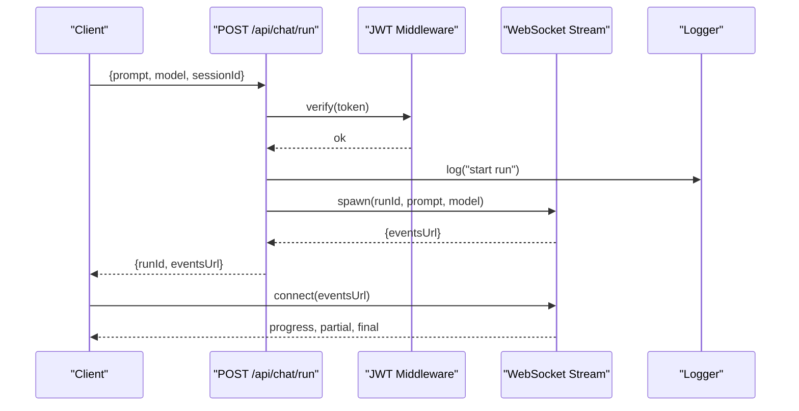

**Diagram sources**

- [chat-run.ts](file://apps/web/src/routes/api/chat/run.ts)
- [chat-question.ts](file://apps/web/src/routes/api/chat/question.ts)
- [chat-sessions.ts](file://apps/web/src/routes/api/chat/sessions.ts)
- [chat-session.ts](file://apps/web/src/routes/api/chat/session.ts)
- [chat-abort.ts](file://apps/web/src/routes/api/chat/abort.ts)
- [chat-resume.ts](file://apps/web/src/routes/api/chat/resume.ts)
- [chat-settings.ts](file://apps/web/src/routes/api/chat/settings.ts)
- [chat-account.ts](file://apps/web/src/routes/api/chat/account.ts)
- [chat-commands.ts](file://apps/web/src/routes/api/chat/commands.ts)
- [chat-models.ts](file://apps/web/src/routes/api/chat/models.ts)
- [chat-models-discover.ts](file://apps/web/src/routes/api/chat/models.discover.ts)
- [chat-providers.ts](file://apps/web/src/routes/api/chat/providers.ts)
- [chat-resources.ts](file://apps/web/src/routes/api/chat/resources.ts)
- [chat-provenance.ts](file://apps/web/src/routes/api/chat/provenance.ts)
- [api-utils.ts](file://apps/web/src/lib/api-utils.ts)
- [logger.ts](file://apps/web/src/lib/logger.ts)

**Section sources**

- [chat-run.ts](file://apps/web/src/routes/api/chat/run.ts)
- [chat-question.ts](file://apps/web/src/routes/api/chat/question.ts)
- [chat-sessions.ts](file://apps/web/src/routes/api/chat/sessions.ts)
- [chat-session.ts](file://apps/web/src/routes/api/chat/session.ts)
- [chat-abort.ts](file://apps/web/src/routes/api/chat/abort.ts)
- [chat-resume.ts](file://apps/web/src/routes/api/chat/resume.ts)
- [chat-settings.ts](file://apps/web/src/routes/api/chat/settings.ts)
- [chat-account.ts](file://apps/web/src/routes/api/chat/account.ts)
- [chat-commands.ts](file://apps/web/src/routes/api/chat/commands.ts)
- [chat-models.ts](file://apps/web/src/routes/api/chat/models.ts)
- [chat-models-discover.ts](file://apps/web/src/routes/api/chat/models.discover.ts)
- [chat-providers.ts](file://apps/web/src/routes/api/chat/providers.ts)
- [chat-resources.ts](file://apps/web/src/routes/api/chat/resources.ts)
- [chat-provenance.ts](file://apps/web/src/routes/api/chat/provenance.ts)

### Workspace Management Endpoints

- Purpose: Manage file system operations, search, indexing, and health within workspaces.
- Key endpoints:
  - GET /api/workspace/health: Health check for workspace services.
  - GET /api/workspace/tree: Retrieve hierarchical tree of items.
  - GET /api/workspace/items: List items with filters and pagination.
  - GET /api/workspace/item/{path}: Get item metadata by path.
  - GET/PUT/DELETE /api/workspace/file/{path}: Read, update, or delete file content.
  - GET /api/workspace/search: Search across workspace content.
  - POST /api/workspace/reindex: Trigger reindexing of workspace content.
- Authentication: Requires JWT for write operations; read operations may allow anonymous access depending on policy.
- Request/Response:
  - Tree and items return structured node objects with paths, types, and metadata.
  - File operations accept content payloads and return updated state.
  - Search returns ranked results with snippets and highlights.
- Error Codes:
  - 400 Bad Request for invalid paths or payloads.
  - 401 Unauthorized for missing/invalid tokens.
  - 403 Forbidden for unauthorized access.
  - 404 Not Found for missing items.
  - 409 Conflict for concurrent modifications.
  - 422 Unprocessable Entity for schema validation failures.
  - 429 Too Many Requests when rate-limited.
  - 500 Internal Server Error for unexpected failures.

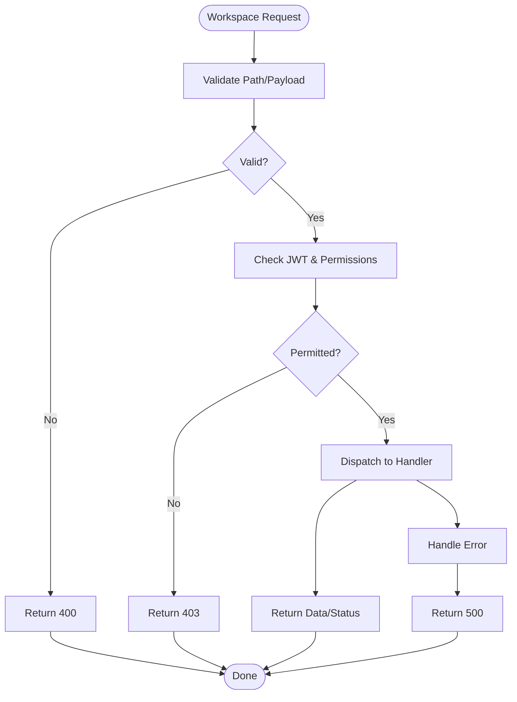

**Diagram sources**

- [workspace-health.ts](file://apps/web/src/routes/api/workspace/health.ts)
- [workspace-tree.ts](file://apps/web/src/routes/api/workspace/tree.ts)
- [workspace-items.ts](file://apps/web/src/routes/api/workspace/items.ts)
- [workspace-item.ts](file://apps/web/src/routes/api/workspace/item.ts)
- [workspace-file.ts](file://apps/web/src/routes/api/workspace/file.ts)
- [workspace-search.ts](file://apps/web/src/routes/api/workspace/search.ts)
- [workspace-reindex.ts](file://apps/web/src/routes/api/workspace/reindex.ts)
- [api-utils.ts](file://apps/web/src/lib/api-utils.ts)

**Section sources**

- [workspace-health.ts](file://apps/web/src/routes/api/workspace/health.ts)
- [workspace-tree.ts](file://apps/web/src/routes/api/workspace/tree.ts)
- [workspace-items.ts](file://apps/web/src/routes/api/workspace/items.ts)
- [workspace-item.ts](file://apps/web/src/routes/api/workspace/item.ts)
- [workspace-file.ts](file://apps/web/src/routes/api/workspace/file.ts)
- [workspace-search.ts](file://apps/web/src/routes/api/workspace/search.ts)
- [workspace-reindex.ts](file://apps/web/src/routes/api/workspace/reindex.ts)

### Webhook Handlers

- Purpose: Ingest external events (e.g., Daytana sandbox lifecycle) and trigger internal workflows.
- Key endpoints:
  - POST /api/webhooks/daytona: Accept webhook payloads, validate signatures, and dispatch events.
- Authentication: Validates webhook signature and source IP allowlist; no JWT required.
- Request/Response:
  - Payload includes event type, timestamp, and resource identifiers.
  - Response acknowledges receipt and queues processing.
- Error Codes:
  - 400 Bad Request for malformed payloads.
  - 401 Unauthorized for invalid signatures.
  - 403 Forbidden for disallowed sources.
  - 422 Unprocessable Entity for unsupported event types.
  - 500 Internal Server Error for processing failures.

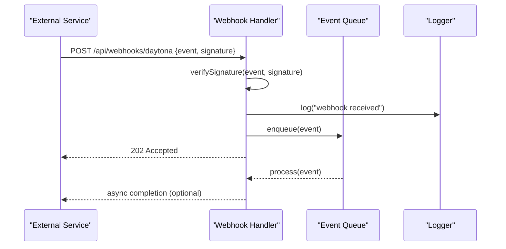

**Diagram sources**

- [webhook-daytona.ts](file://apps/web/src/routes/api/webhooks/daytona.ts)
- [daytona-test.ts](file://apps/web/src/routes/api/webhooks/-daytona.test.ts)
- [api-utils.ts](file://apps/web/src/lib/api-utils.ts)
- [logger.ts](file://apps/web/src/lib/logger.ts)

**Section sources**

- [webhook-daytona.ts](file://apps/web/src/routes/api/webhooks/daytona.ts)
- [daytona-test.ts](file://apps/web/src/routes/api/webhooks/-daytona.test.ts)

### WebSocket Implementation for Real-Time Chat

- Connection Handling:
  - Clients connect to a dedicated WebSocket endpoint returned by the chat run endpoint.
  - Handshake validates JWT and binds the connection to a specific runId and sessionId.
- Message Formats:
  - Outbound messages from server include event type, payload, and correlationId.
  - Inbound messages from clients include control signals (ping/pong, cancel).
- Event Types:
  - progress: incremental updates during execution.
  - partial: intermediate results.
  - final: completion payload with result and metadata.
  - error: error details with code and message.
- Reconnection Strategies:
  - Exponential backoff with jitter.
  - State synchronization upon reconnect using last known runId and cursor.
  - Graceful degradation if server cannot resume state.

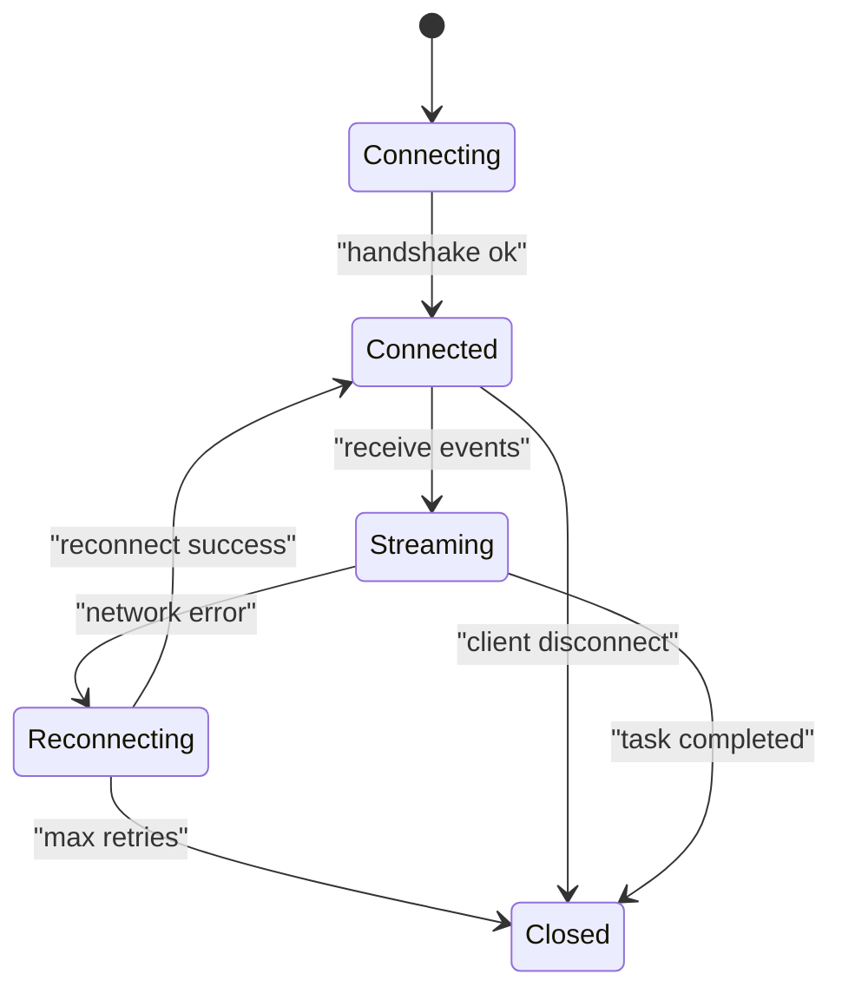

**Diagram sources**

- [chat-run.ts](file://apps/web/src/routes/api/chat/run.ts)
- [api-utils.ts](file://apps/web/src/lib/api-utils.ts)

**Section sources**

- [chat-run.ts](file://apps/web/src/routes/api/chat/run.ts)

### API Gateway Patterns, Rate Limiting, and Validation

- API Gateway Patterns:
  - Route-level middleware for authentication, input validation, and logging.
  - Centralized error shaping and response normalization.
- Rate Limiting:
  - Per-user and per-endpoint limits enforced via token bucket or sliding window.
  - Returns 429 with retry-after hints when exceeded.
- Request Validation:
  - Schema validation for JSON bodies and query parameters.
  - Rejects unknown fields and enforces required properties.

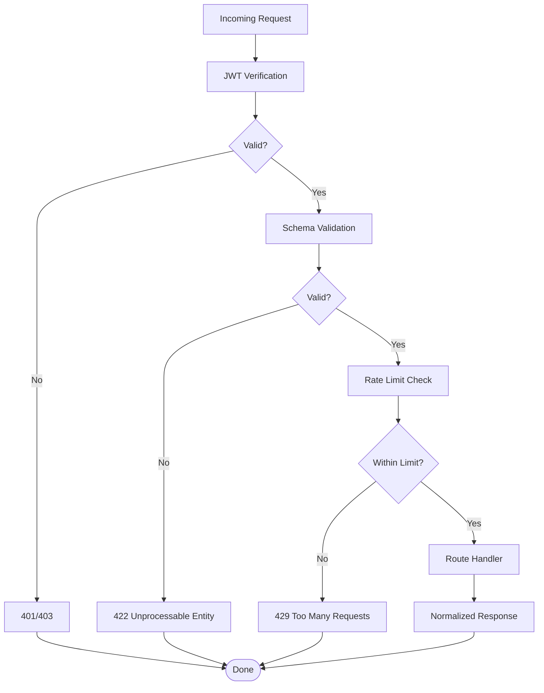

**Diagram sources**

- [api-utils.ts](file://apps/web/src/lib/api-utils.ts)
- [logger.ts](file://apps/web/src/lib/logger.ts)

**Section sources**

- [api-utils.ts](file://apps/web/src/lib/api-utils.ts)
- [logger.ts](file://apps/web/src/lib/logger.ts)

### Authentication Flows, Session Management, and Authorization

- JWT Tokens:
  - Issued upon successful authentication; contain claims for user identity and roles.
  - Short-lived access tokens with refresh mechanisms.
- Session Management:
  - Server-side session store tracks active sessions and revocation.
  - Client stores tokens securely and rotates on refresh.
- Authorization Checks:
  - Role-based access control enforced at route level.
  - Resource-level checks for workspace and chat ownership.

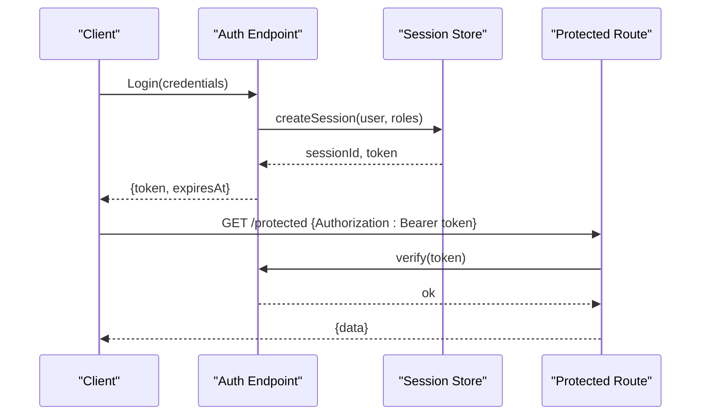

**Diagram sources**

- [auth-session.ts](file://apps/web/src/routes/api/auth/session.ts)
- [auth-root.ts](file://apps/web/src/routes/api/auth/$.ts)
- [api-utils.ts](file://apps/web/src/lib/api-utils.ts)

**Section sources**

- [auth-session.ts](file://apps/web/src/routes/api/auth/session.ts)
- [auth-root.ts](file://apps/web/src/routes/api/auth/$.ts)
- [api-utils.ts](file://apps/web/src/lib/api-utils.ts)

### Error Handling, Logging, and Monitoring

- Error Handling:
  - Consistent error shape with code, message, and traceId.
  - Client-friendly messages for user-facing errors; detailed logs for debugging.
- Logging:
  - Structured logs with correlationId, userId, and endpoint context.
  - Sensitive data redaction in logs.
- Monitoring Integration:
  - Metrics for latency, throughput, and error rates.
  - Alerts for abnormal spikes and failures.

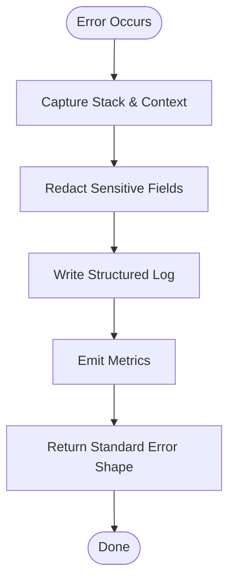

**Diagram sources**

- [logger.ts](file://apps/web/src/lib/logger.ts)
- [api-utils.ts](file://apps/web/src/lib/api-utils.ts)

**Section sources**

- [logger.ts](file://apps/web/src/lib/logger.ts)
- [api-utils.ts](file://apps/web/src/lib/api-utils.ts)

### API Versioning, Backward Compatibility, and Deprecation

- Versioning Strategy:
  - URL-based versioning (/v1/, /v2/) for major changes.
  - Header-based negotiation for minor updates.
- Backward Compatibility:
  - Preserve existing fields and behaviors; add new fields opt-in.
  - Deprecate endpoints gradually with sunsetting headers.
- Deprecation Policies:
  - Announce deprecations in release notes and via API responses.
  - Provide migration guides and support windows.

[No sources needed since this section provides general guidance]

## Dependency Analysis

The API layer depends on shared utilities for request handling, logging, and configuration. Routes are decoupled and rely on these abstractions for consistency.

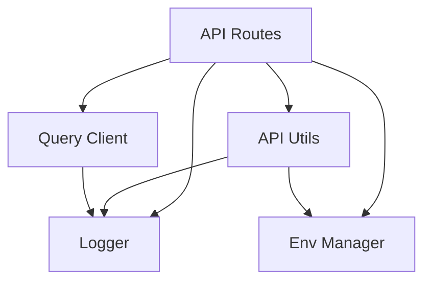

**Diagram sources**

- [api-utils.ts](file://apps/web/src/lib/api-utils.ts)
- [logger.ts](file://apps/web/src/lib/logger.ts)
- [env-manager.ts](file://apps/web/src/lib/env-manager.ts)
- [query-client.ts](file://apps/web/src/lib/query-client.ts)

**Section sources**

- [api-utils.ts](file://apps/web/src/lib/api-utils.ts)
- [logger.ts](file://apps/web/src/lib/logger.ts)
- [env-manager.ts](file://apps/web/src/lib/env-manager.ts)
- [query-client.ts](file://apps/web/src/lib/query-client.ts)

## Performance Considerations

- Use streaming for long-running chat runs to reduce latency and memory usage.
- Implement pagination and filtering for large datasets in workspace endpoints.
- Cache frequently accessed data (models, providers) with appropriate TTLs.
- Apply rate limiting to protect against abuse and ensure fair usage.
- Monitor performance metrics and set alerts for anomalies.

[No sources needed since this section provides general guidance]

## Troubleshooting Guide

Common issues and resolutions:

- Authentication Failures:
  - Verify JWT validity and expiration; refresh tokens as needed.
  - Check role assignments and resource ownership.
- WebSocket Disconnections:
  - Implement exponential backoff with jitter; resync state using last known runId.
  - Inspect server logs for handshake errors.
- Rate Limiting:
  - Respect retry-after headers; implement client-side throttling.
- Validation Errors:
  - Ensure request schemas match expected formats; remove unknown fields.

**Section sources**

- [logger.ts](file://apps/web/src/lib/logger.ts)
- [api-utils.ts](file://apps/web/src/lib/api-utils.ts)

## Conclusion

Fleet Pi’s API layer provides a robust, secure, and scalable communication interface for chat, workspace management, authentication, and webhooks. By adhering to consistent patterns for authentication, validation, error handling, and observability, the system ensures reliability and maintainability. Continuous monitoring and adherence to versioning and deprecation policies will support long-term stability and evolution.

[No sources needed since this section summarizes without analyzing specific files]

## Appendices

- OpenAPI Specification: Generated from route definitions for comprehensive endpoint documentation.
- Configuration: Runtime environment variables and feature flags managed centrally.

**Section sources**

- [openapi.json](file://apps/web/openapi.json)
- [generate-openapi.ts](file://apps/web/scripts/generate-openapi.ts)
- [env-manager.ts](file://apps/web/src/lib/env-manager.ts)
