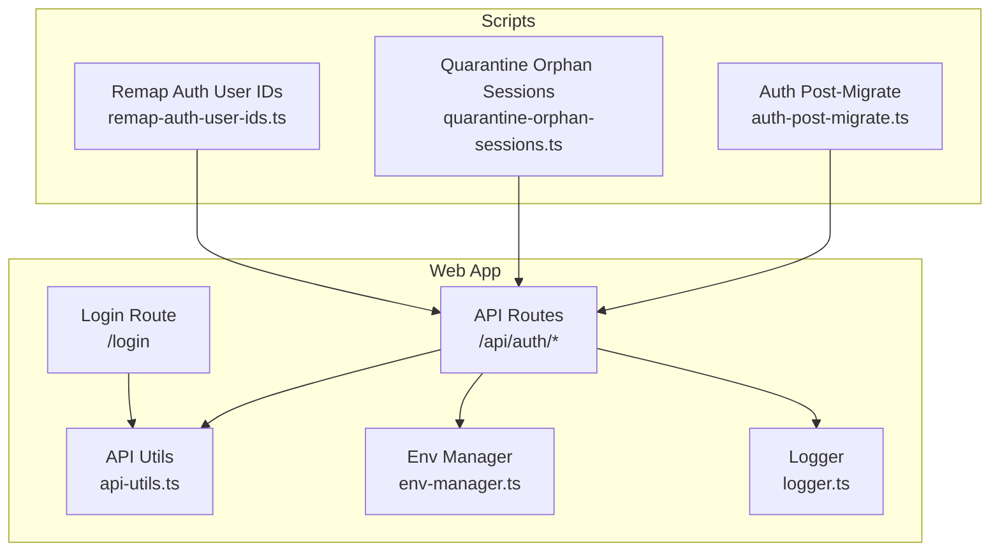
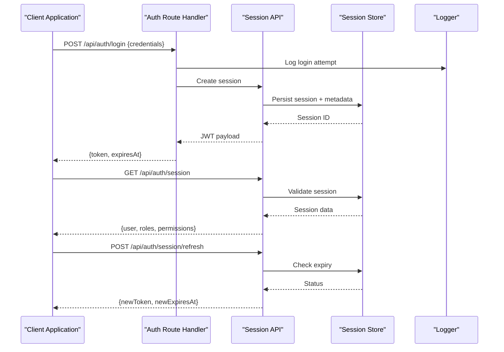
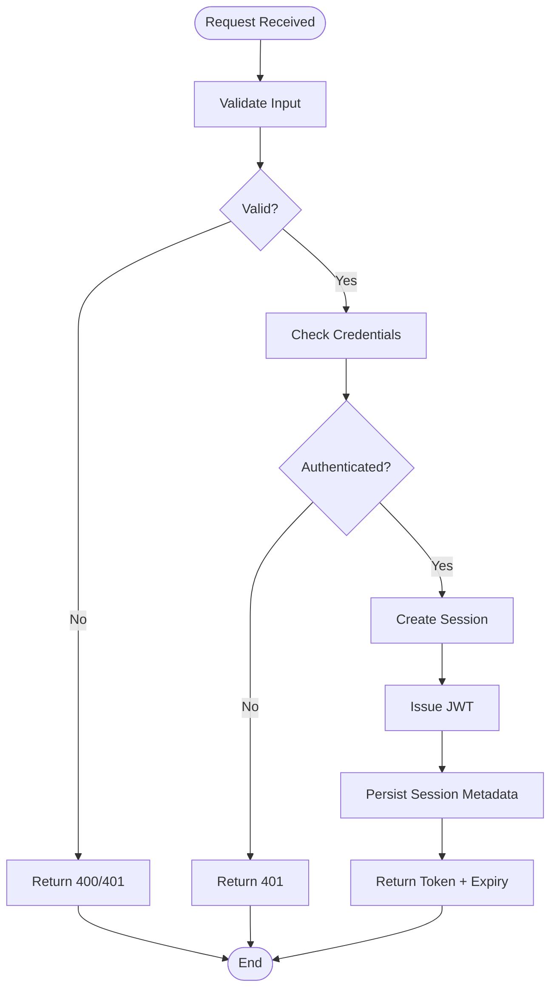
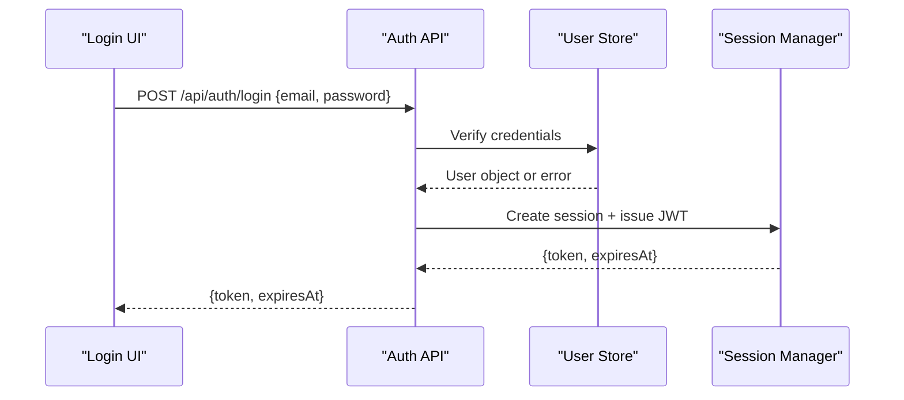
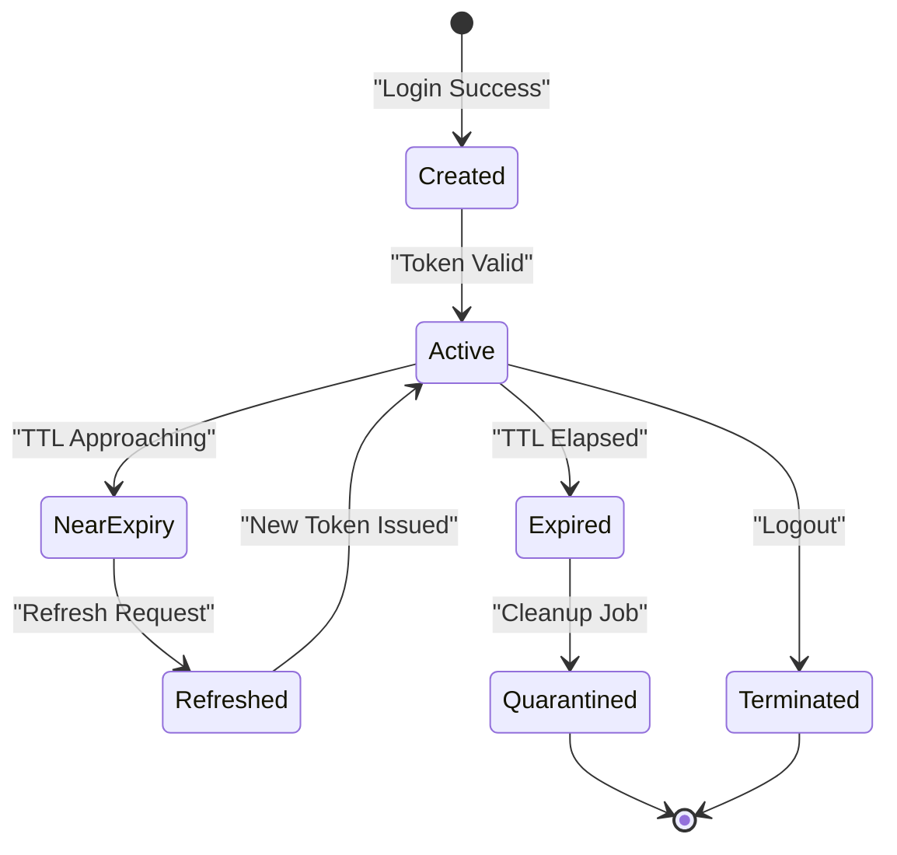
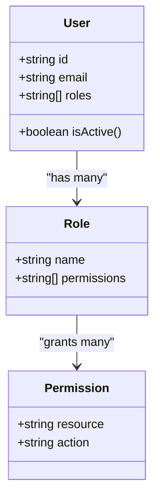
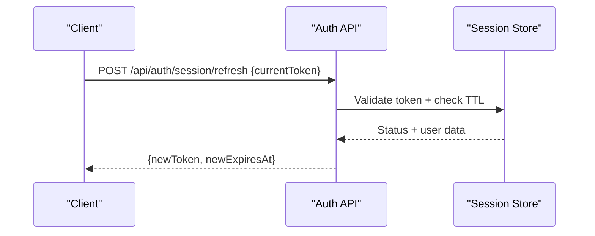
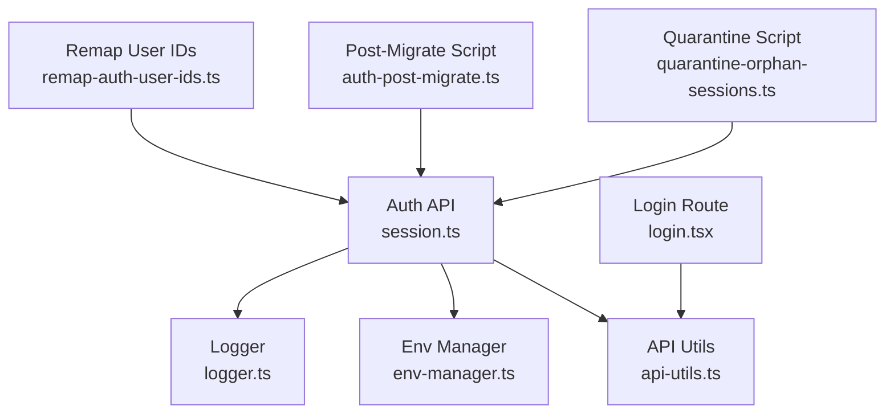

# Authentication & Authorization API

<cite>
**Referenced Files in This Document**
- [auth-post-migrate.ts](file://apps/web/scripts/auth-post-migrate.ts)
- [quarantine-orphan-sessions.ts](file://apps/web/scripts/quarantine-orphan-sessions.ts)
- [remap-auth-user-ids.ts](file://apps/web/scripts/remap-auth-user-ids.ts)
- [session.ts](file://apps/web/src/routes/api/auth/session.ts)
- [$.ts](file://apps/web/src/routes/api/auth/$.ts)
- [login.tsx](file://apps/web/src/routes/login.tsx)
- [api-utils.ts](file://apps/web/src/lib/api-utils.ts)
- [env-manager.ts](file://apps/web/src/lib/env-manager.ts)
- [logger.ts](file://apps/web/src/lib/logger.ts)
- [security.md](file://docs/wiki/security.md)
- [architecture.md](file://docs/architecture.md)
- [api.md](file://docs/api.md)
</cite>

## Table of Contents

1. [Introduction](#introduction)
2. [Project Structure](#project-structure)
3. [Core Components](#core-components)
4. [Architecture Overview](#architecture-overview)
5. [Detailed Component Analysis](#detailed-component-analysis)
6. [Dependency Analysis](#dependency-analysis)
7. [Performance Considerations](#performance-considerations)
8. [Troubleshooting Guide](#troubleshooting-guide)
9. [Conclusion](#conclusion)
10. [Appendices](#appendices)

## Introduction

This document provides comprehensive API documentation for Fleet Pi’s authentication and authorization system. It covers user registration, login, session management, JWT token handling, role-based access control (RBAC), token refresh mechanisms, and security best practices including CSRF protection and rate limiting. The goal is to enable secure client implementations that handle token expiration and manage user sessions across different contexts.

## Project Structure

The authentication and authorization features are primarily implemented within the web application routes and supporting utilities:

- API endpoints for authentication reside under apps/web/src/routes/api/auth.
- Session lifecycle scripts exist under apps/web/scripts for maintenance tasks such as orphan session quarantine and migrations.
- Client-side helpers and environment configuration support secure API calls and runtime behavior.
- Documentation and architecture references provide context on security posture and overall design.

**Diagram sources**

- [$.ts](file://apps/web/src/routes/api/auth/$.ts)
- [session.ts](file://apps/web/src/routes/api/auth/session.ts)
- [login.tsx](file://apps/web/src/routes/login.tsx)
- [api-utils.ts](file://apps/web/src/lib/api-utils.ts)
- [env-manager.ts](file://apps/web/src/lib/env-manager.ts)
- [logger.ts](file://apps/web/src/lib/logger.ts)
- [auth-post-migrate.ts](file://apps/web/scripts/auth-post-migrate.ts)
- [quarantine-orphan-sessions.ts](file://apps/web/scripts/quarantine-orphan-sessions.ts)
- [remap-auth-user-ids.ts](file://apps/web/scripts/remap-auth-user-ids.ts)

**Section sources**

- [$.ts](file://apps/web/src/routes/api/auth/$.ts)
- [session.ts](file://apps/web/src/routes/api/auth/session.ts)
- [login.tsx](file://apps/web/src/routes/login.tsx)
- [api-utils.ts](file://apps/web/src/lib/api-utils.ts)
- [env-manager.ts](file://apps/web/src/lib/env-manager.ts)
- [logger.ts](file://apps/web/src/lib/logger.ts)
- [auth-post-migrate.ts](file://apps/web/scripts/auth-post-migrate.ts)
- [quarantine-orphan-sessions.ts](file://apps/web/scripts/quarantine-orphan-sessions.ts)
- [remap-auth-user-ids.ts](file://apps/web/scripts/remap-auth-user-ids.ts)

## Core Components

- Authentication API Endpoints:
  - Session management endpoints under /api/auth provide operations for creating, validating, refreshing, and terminating sessions.
  - A generic auth route handler centralizes common behaviors like request validation, logging, and error responses.
- Login Flow:
  - The login route orchestrates user credential submission, server-side validation, session creation, and token issuance.
- Utilities:
  - API utils encapsulate HTTP request patterns, headers, and error handling for authenticated requests.
  - Environment manager exposes runtime configuration values required for secure operation (e.g., secrets, timeouts).
  - Logger records authentication events and errors for observability.
- Maintenance Scripts:
  - Post-migration script ensures data consistency after schema changes related to authentication.
  - Quarantine script isolates orphaned or expired sessions to prevent resource leaks.
  - Remap script updates user identifiers during migration or reconciliation processes.

**Section sources**

- [session.ts](file://apps/web/src/routes/api/auth/session.ts)
- [$.ts](file://apps/web/src/routes/api/auth/$.ts)
- [login.tsx](file://apps/web/src/routes/login.tsx)
- [api-utils.ts](file://apps/web/src/lib/api-utils.ts)
- [env-manager.ts](file://apps/web/src/lib/env-manager.ts)
- [logger.ts](file://apps/web/src/lib/logger.ts)
- [auth-post-migrate.ts](file://apps/web/scripts/auth-post-migrate.ts)
- [quarantine-orphan-sessions.ts](file://apps/web/scripts/quarantine-orphan-sessions.ts)
- [remap-auth-user-ids.ts](file://apps/web/scripts/remap-auth-user-ids.ts)

## Architecture Overview

The authentication architecture follows a layered approach:

- Client applications interact with the API endpoints for login, session management, and protected resource access.
- Server-side handlers validate inputs, enforce RBAC policies, and issue JWT tokens upon successful authentication.
- Session state is managed via server-side storage with periodic cleanup to remove expired or orphaned entries.
- Security controls include CSRF protection, rate limiting, and secure cookie/token handling.

**Diagram sources**

- [$.ts](file://apps/web/src/routes/api/auth/$.ts)
- [session.ts](file://apps/web/src/routes/api/auth/session.ts)
- [logger.ts](file://apps/web/src/lib/logger.ts)

## Detailed Component Analysis

### Authentication API Endpoints

- Session Management:
  - Create session: Validates credentials, generates JWT, stores session metadata.
  - Read session: Validates token, returns user profile and roles.
  - Refresh token: Issues a new token if the current one is near expiry.
  - Terminate session: Invalidates the session and removes stored metadata.
- Error Handling:
  - Consistent error responses with appropriate HTTP status codes.
  - Logging of failed attempts and suspicious activity.

**Diagram sources**

- [session.ts](file://apps/web/src/routes/api/auth/session.ts)
- [$.ts](file://apps/web/src/routes/api/auth/$.ts)

**Section sources**

- [session.ts](file://apps/web/src/routes/api/auth/session.ts)
- [$.ts](file://apps/web/src/routes/api/auth/$.ts)

### Login Flow

- Client submits credentials to the login endpoint.
- Server validates credentials against the user store.
- Upon success, a JWT is issued and session metadata is persisted.
- Client stores the token securely and includes it in subsequent requests.

**Diagram sources**

- [login.tsx](file://apps/web/src/routes/login.tsx)
- [session.ts](file://apps/web/src/routes/api/auth/session.ts)

**Section sources**

- [login.tsx](file://apps/web/src/routes/login.tsx)
- [session.ts](file://apps/web/src/routes/api/auth/session.ts)

### Session Lifecycle and Cleanup

- Creation: On successful login, a session is created with metadata including user ID, roles, and expiry.
- Validation: Each request validates the session token and checks for expiration.
- Refresh: Tokens can be refreshed before expiry to maintain continuity.
- Cleanup: Periodic jobs quarantine orphaned sessions and remove expired entries.

**Diagram sources**

- [session.ts](file://apps/web/src/routes/api/auth/session.ts)
- [quarantine-orphan-sessions.ts](file://apps/web/scripts/quarantine-orphan-sessions.ts)

**Section sources**

- [session.ts](file://apps/web/src/routes/api/auth/session.ts)
- [quarantine-orphan-sessions.ts](file://apps/web/scripts/quarantine-orphan-sessions.ts)

### Role-Based Access Control (RBAC)

- Roles are embedded in the JWT payload and validated on each request.
- Protected endpoints check roles and permissions before processing.
- Admin-only operations require elevated privileges.

**Diagram sources**

- [session.ts](file://apps/web/src/routes/api/auth/session.ts)
- [$.ts](file://apps/web/src/routes/api/auth/$.ts)

**Section sources**

- [session.ts](file://apps/web/src/routes/api/auth/session.ts)
- [$.ts](file://apps/web/src/routes/api/auth/$.ts)

### Token Refresh Mechanism

- Clients detect token nearing expiry and request a refresh.
- Server validates the existing token and issues a new one without re-authentication.
- New token replaces the old one in client storage.

**Diagram sources**

- [session.ts](file://apps/web/src/routes/api/auth/session.ts)

**Section sources**

- [session.ts](file://apps/web/src/routes/api/auth/session.ts)

### Security Best Practices

- CSRF Protection: Implement anti-CSRF tokens for state-changing requests.
- Rate Limiting: Enforce limits on login and token refresh endpoints.
- Secure Cookies: Use HttpOnly, Secure, and SameSite attributes for cookies.
- Token Storage: Prefer memory storage over localStorage for sensitive tokens.
- Logging: Record authentication events without exposing sensitive data.

**Section sources**

- [security.md](file://docs/wiki/security.md)
- [logger.ts](file://apps/web/src/lib/logger.ts)

## Dependency Analysis

Authentication components depend on shared utilities for API communication, environment configuration, and logging. Maintenance scripts interact with the same session store to ensure data integrity.

**Diagram sources**

- [session.ts](file://apps/web/src/routes/api/auth/session.ts)
- [api-utils.ts](file://apps/web/src/lib/api-utils.ts)
- [env-manager.ts](file://apps/web/src/lib/env-manager.ts)
- [logger.ts](file://apps/web/src/lib/logger.ts)
- [login.tsx](file://apps/web/src/routes/login.tsx)
- [quarantine-orphan-sessions.ts](file://apps/web/scripts/quarantine-orphan-sessions.ts)
- [auth-post-migrate.ts](file://apps/web/scripts/auth-post-migrate.ts)
- [remap-auth-user-ids.ts](file://apps/web/scripts/remap-auth-user-ids.ts)

**Section sources**

- [session.ts](file://apps/web/src/routes/api/auth/session.ts)
- [api-utils.ts](file://apps/web/src/lib/api-utils.ts)
- [env-manager.ts](file://apps/web/src/lib/env-manager.ts)
- [logger.ts](file://apps/web/src/lib/logger.ts)
- [login.tsx](file://apps/web/src/routes/login.tsx)
- [quarantine-orphan-sessions.ts](file://apps/web/scripts/quarantine-orphan-sessions.ts)
- [auth-post-migrate.ts](file://apps/web/scripts/auth-post-migrate.ts)
- [remap-auth-user-ids.ts](file://apps/web/scripts/remap-auth-user-ids.ts)

## Performance Considerations

- Minimize database queries by caching session metadata where appropriate.
- Use efficient token validation strategies to reduce latency.
- Implement connection pooling for backend services.
- Monitor and optimize slow endpoints through profiling.

[No sources needed since this section provides general guidance]

## Troubleshooting Guide

Common issues and resolutions:

- Authentication failures: Check credentials and account status.
- Token expiration: Implement automatic refresh logic.
- Session leaks: Run quarantine scripts regularly.
- Migration errors: Review post-migrate logs and rollback if necessary.

**Section sources**

- [auth-post-migrate.ts](file://apps/web/scripts/auth-post-migrate.ts)
- [quarantine-orphan-sessions.ts](file://apps/web/scripts/quarantine-orphan-sessions.ts)
- [remap-auth-user-ids.ts](file://apps/web/scripts/remap-auth-user-ids.ts)

## Conclusion

Fleet Pi’s authentication and authorization system provides a robust foundation for secure user management. By following the documented flows, implementing recommended security practices, and leveraging the provided utilities, developers can build resilient client applications that handle authentication seamlessly.

[No sources needed since this section summarizes without analyzing specific files]

## Appendices

- Architecture overview: Refer to the project’s architecture documentation for high-level design decisions.
- API reference: Consult the API documentation for detailed endpoint specifications.

**Section sources**

- [architecture.md](file://docs/architecture.md)
- [api.md](file://docs/api.md)
