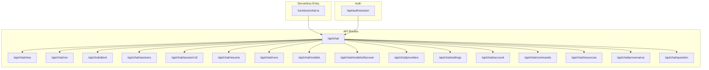
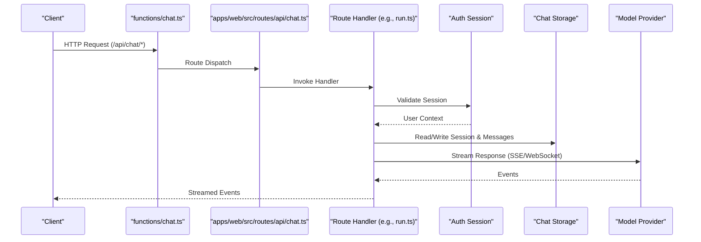
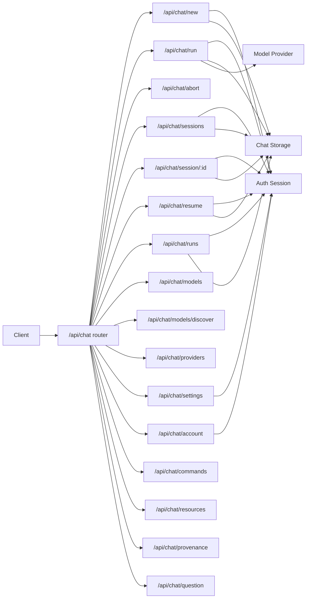

# Chat API Endpoints

<cite>
**Referenced Files in This Document**
- [chat.ts](file://functions/chat.ts)
- [chat.ts](file://apps/web/src/routes/api/chat.ts)
- [session.ts](file://apps/web/src/routes/api/auth/session.ts)
- [new.ts](file://apps/web/src/routes/api/chat/new.ts)
- [run.ts](file://apps/web/src/routes/api/chat/run.ts)
- [abort.ts](file://apps/web/src/routes/api/chat/abort.ts)
- [sessions.ts](file://apps/web/src/routes/api/chat/sessions.ts)
- [session.ts](file://apps/web/src/routes/api/chat/session.ts)
- [resume.ts](file://apps/web/src/routes/api/chat/resume.ts)
- [runs.ts](file://apps/web/src/routes/api/chat/runs.ts)
- [models.ts](file://apps/web/src/routes/api/chat/models.ts)
- [models.discover.ts](file://apps/web/src/routes/api/chat/models.discover.ts)
- [providers.ts](file://apps/web/src/routes/api/chat/providers.ts)
- [settings.ts](file://apps/web/src/routes/api/chat/settings.ts)
- [account.ts](file://apps/web/src/routes/api/chat/account.ts)
- [commands.ts](file://apps/web/src/routes/api/chat/commands.ts)
- [resources.ts](file://apps/web/src/routes/api/chat/resources.ts)
- [provenance.ts](file://apps/web/src/routes/api/chat/provenance.ts)
- [question.ts](file://apps/web/src/routes/api/chat/question.ts)
</cite>

## Table of Contents

1. [Introduction](#introduction)
2. [Project Structure](#project-structure)
3. [Core Components](#core-components)
4. [Architecture Overview](#architecture-overview)
5. [Detailed Component Analysis](#detailed-component-analysis)
6. [Dependency Analysis](#dependency-analysis)
7. [Performance Considerations](#performance-considerations)
8. [Troubleshooting Guide](#troubleshooting-guide)
9. [Conclusion](#conclusion)

## Introduction

This document provides comprehensive API documentation for Fleet Pi’s chat functionality. It covers REST endpoints for session management, message handling, model configuration, and conversation operations. It also details the WebSocket implementation for real-time chat streaming, including connection protocols, message formats, event types, and reconnection strategies. Finally, it explains chat session lifecycle, message persistence, state synchronization, practical integration examples, error handling patterns, and performance optimization techniques.

## Project Structure

The chat feature is implemented primarily under apps/web/src/routes/api/chat with a serverless function entry point at functions/chat.ts. Authentication is handled via an auth session endpoint. The structure follows a route-based organization where each file corresponds to a specific API path or operation.

**Diagram sources**

- [chat.ts](file://functions/chat.ts)
- [chat.ts](file://apps/web/src/routes/api/chat.ts)
- [session.ts](file://apps/web/src/routes/api/auth/session.ts)
- [new.ts](file://apps/web/src/routes/api/chat/new.ts)
- [run.ts](file://apps/web/src/routes/api/chat/run.ts)
- [abort.ts](file://apps/web/src/routes/api/chat/abort.ts)
- [sessions.ts](file://apps/web/src/routes/api/chat/sessions.ts)
- [session.ts](file://apps/web/src/routes/api/chat/session.ts)
- [resume.ts](file://apps/web/src/routes/api/chat/resume.ts)
- [runs.ts](file://apps/web/src/routes/api/chat/runs.ts)
- [models.ts](file://apps/web/src/routes/api/chat/models.ts)
- [models.discover.ts](file://apps/web/src/routes/api/chat/models.discover.ts)
- [providers.ts](file://apps/web/src/routes/api/chat/providers.ts)
- [settings.ts](file://apps/web/src/routes/api/chat/settings.ts)
- [account.ts](file://apps/web/src/routes/api/chat/account.ts)
- [commands.ts](file://apps/web/src/routes/api/chat/commands.ts)
- [resources.ts](file://apps/web/src/routes/api/chat/resources.ts)
- [provenance.ts](file://apps/web/src/routes/api/chat/provenance.ts)
- [question.ts](file://apps/web/src/routes/api/chat/question.ts)

**Section sources**

- [chat.ts](file://functions/chat.ts)
- [chat.ts](file://apps/web/src/routes/api/chat.ts)
- [session.ts](file://apps/web/src/routes/api/auth/session.ts)

## Core Components

- Session Management: Create, resume, list, and retrieve sessions; abort running runs.
- Message Handling: Submit messages and receive streamed responses over SSE/WebSocket.
- Model Configuration: Discover available models and providers; read settings.
- Conversation Operations: Query provenance, resources, commands, and question helpers.

Authentication is required for most endpoints using session cookies or tokens validated by the auth session mechanism.

**Section sources**

- [new.ts](file://apps/web/src/routes/api/chat/new.ts)
- [run.ts](file://apps/web/src/routes/api/chat/run.ts)
- [abort.ts](file://apps/web/src/routes/api/chat/abort.ts)
- [sessions.ts](file://apps/web/src/routes/api/chat/sessions.ts)
- [session.ts](file://apps/web/src/routes/api/chat/session.ts)
- [resume.ts](file://apps/web/src/routes/api/chat/resume.ts)
- [runs.ts](file://apps/web/src/routes/api/chat/runs.ts)
- [models.ts](file://apps/web/src/routes/api/chat/models.ts)
- [models.discover.ts](file://apps/web/src/routes/api/chat/models.discover.ts)
- [providers.ts](file://apps/web/src/routes/api/chat/providers.ts)
- [settings.ts](file://apps/web/src/routes/api/chat/settings.ts)
- [account.ts](file://apps/web/src/routes/api/chat/account.ts)
- [commands.ts](file://apps/web/src/routes/api/chat/commands.ts)
- [resources.ts](file://apps/web/src/routes/api/chat/resources.ts)
- [provenance.ts](file://apps/web/src/routes/api/chat/provenance.ts)
- [question.ts](file://apps/web/src/routes/api/chat/question.ts)

## Architecture Overview

The chat API routes are mounted under /api/chat. Each route file implements a handler that validates input, enforces authentication, interacts with storage and model providers, and returns JSON or streams events. The serverless entry point proxies requests to the appropriate route handlers.

**Diagram sources**

- [chat.ts](file://functions/chat.ts)
- [chat.ts](file://apps/web/src/routes/api/chat.ts)
- [run.ts](file://apps/web/src/routes/api/chat/run.ts)
- [session.ts](file://apps/web/src/routes/api/auth/session.ts)

## Detailed Component Analysis

### Authentication

- Endpoint: GET /api/auth/session
- Purpose: Returns current authenticated user context or indicates unauthenticated state.
- Authentication: None (used to determine auth state).
- Response: JSON object containing user identity and roles if authenticated; null or empty otherwise.

**Section sources**

- [session.ts](file://apps/web/src/routes/api/auth/session.ts)

### Session Management

#### Create New Session

- Endpoint: POST /api/chat/new
- Authentication: Required (session validation).
- Request Body: Optional metadata such as title, tags, or initial model selection.
- Response: Created session object with id and metadata.

**Section sources**

- [new.ts](file://apps/web/src/routes/api/chat/new.ts)

#### List Sessions

- Endpoint: GET /api/chat/sessions
- Authentication: Required.
- Query Parameters: Pagination and filters (e.g., limit, offset, tags).
- Response: Array of session summaries.

**Section sources**

- [sessions.ts](file://apps/web/src/routes/api/chat/sessions.ts)

#### Get Session Details

- Endpoint: GET /api/chat/session/{id}
- Authentication: Required.
- Path Parameter: Session id.
- Response: Full session object including messages and metadata.

**Section sources**

- [session.ts](file://apps/web/src/routes/api/chat/session.ts)

#### Resume Session

- Endpoint: POST /api/chat/resume
- Authentication: Required.
- Request Body: Session id and optional parameters to continue from last state.
- Response: Resumed session ready for new messages.

**Section sources**

- [resume.ts](file://apps/web/src/routes/api/chat/resume.ts)

### Message Handling and Streaming

#### Run Message (Streamed)

- Endpoint: POST /api/chat/run
- Authentication: Required.
- Request Body:
  - session_id: string
  - message: string
  - model: string (optional)
  - provider: string (optional)
  - options: object (temperature, max_tokens, etc.)
- Response: Streamed events (SSE or WebSocket frames) containing incremental content, tool calls, and completion markers.
- Error Codes:
  - 400: Invalid request body or missing fields
  - 401: Unauthenticated
  - 403: Insufficient permissions
  - 404: Session not found
  - 429: Rate limited
  - 500: Internal server error
  - 503: Provider unavailable

**Section sources**

- [run.ts](file://apps/web/src/routes/api/chat/run.ts)

#### Abort Running Run

- Endpoint: POST /api/chat/abort
- Authentication: Required.
- Request Body: run_id or session_id to cancel active generation.
- Response: Confirmation of cancellation.

**Section sources**

- [abort.ts](file://apps/web/src/routes/api/chat/abort.ts)

#### List Runs

- Endpoint: GET /api/chat/runs
- Authentication: Required.
- Query Parameters: session_id, status, pagination.
- Response: Array of run summaries with status and timestamps.

**Section sources**

- [runs.ts](file://apps/web/src/routes/api/chat/runs.ts)

### Model Configuration

#### Models

- Endpoint: GET /api/chat/models
- Authentication: Optional (depends on deployment).
- Response: Available models with capabilities and defaults.

**Section sources**

- [models.ts](file://apps/web/src/routes/api/chat/models.ts)

#### Discover Models

- Endpoint: GET /api/chat/models/discover
- Authentication: Optional.
- Response: Discovered models from configured providers.

**Section sources**

- [models.discover.ts](file://apps/web/src/routes/api/chat/models.discover.ts)

#### Providers

- Endpoint: GET /api/chat/providers
- Authentication: Optional.
- Response: Configured providers and their status.

**Section sources**

- [providers.ts](file://apps/web/src/routes/api/chat/providers.ts)

### Settings and Account

#### Settings

- Endpoint: GET /api/chat/settings
- Authentication: Required.
- Response: User-specific and global chat settings.

**Section sources**

- [settings.ts](file://apps/web/src/routes/api/chat/settings.ts)

#### Account

- Endpoint: GET /api/chat/account
- Authentication: Required.
- Response: Account details and preferences.

**Section sources**

- [account.ts](file://apps/web/src/routes/api/chat/account.ts)

### Conversation Operations

#### Commands

- Endpoint: GET /api/chat/commands
- Authentication: Optional.
- Response: Available chat commands and descriptions.

**Section sources**

- [commands.ts](file://apps/web/src/routes/api/chat/commands.ts)

#### Resources

- Endpoint: GET /api/chat/resources
- Authentication: Optional.
- Response: Resources accessible within chat context.

**Section sources**

- [resources.ts](file://apps/web/src/routes/api/chat/resources.ts)

#### Provenance

- Endpoint: GET /api/chat/provenance
- Authentication: Optional.
- Response: Provenance metadata for generated content.

**Section sources**

- [provenance.ts](file://apps/web/src/routes/api/chat/provenance.ts)

#### Question Helper

- Endpoint: GET /api/chat/question
- Authentication: Optional.
- Response: Predefined questions or suggestions.

**Section sources**

- [question.ts](file://apps/web/src/routes/api/chat/question.ts)

## Dependency Analysis

The chat API depends on:

- Authentication service for session validation.
- Storage layer for persisting sessions and messages.
- Model providers for generating responses.
- Event streaming infrastructure for real-time updates.

**Diagram sources**

- [chat.ts](file://apps/web/src/routes/api/chat.ts)
- [new.ts](file://apps/web/src/routes/api/chat/new.ts)
- [run.ts](file://apps/web/src/routes/api/chat/run.ts)
- [abort.ts](file://apps/web/src/routes/api/chat/abort.ts)
- [sessions.ts](file://apps/web/src/routes/api/chat/sessions.ts)
- [session.ts](file://apps/web/src/routes/api/chat/session.ts)
- [resume.ts](file://apps/web/src/routes/api/chat/resume.ts)
- [runs.ts](file://apps/web/src/routes/api/chat/runs.ts)
- [models.ts](file://apps/web/src/routes/api/chat/models.ts)
- [models.discover.ts](file://apps/web/src/routes/api/chat/models.discover.ts)
- [providers.ts](file://apps/web/src/routes/api/chat/providers.ts)
- [settings.ts](file://apps/web/src/routes/api/chat/settings.ts)
- [account.ts](file://apps/web/src/routes/api/chat/account.ts)
- [commands.ts](file://apps/web/src/routes/api/chat/commands.ts)
- [resources.ts](file://apps/web/src/routes/api/chat/resources.ts)
- [provenance.ts](file://apps/web/src/routes/api/chat/provenance.ts)
- [question.ts](file://apps/web/src/routes/api/chat/question.ts)
- [session.ts](file://apps/web/src/routes/api/auth/session.ts)

**Section sources**

- [chat.ts](file://apps/web/src/routes/api/chat.ts)
- [session.ts](file://apps/web/src/routes/api/auth/session.ts)

## Performance Considerations

- Use streaming responses for long-running generations to reduce perceived latency.
- Implement client-side caching for static endpoints like models and providers.
- Apply pagination and filtering for sessions and runs to minimize payload size.
- Enable compression for large responses when supported by clients.
- Prefer idempotent operations where possible to avoid duplicate work.
- Monitor rate limits and implement exponential backoff for retries.

[No sources needed since this section provides general guidance]

## Troubleshooting Guide

Common issues and resolutions:

- Authentication failures: Ensure session cookies/tokens are present and valid. Check /api/auth/session response.
- Session not found: Verify session_id correctness and ownership.
- Rate limiting: Observe retry-after headers and backoff strategies.
- Provider errors: Check provider status via /api/chat/providers and adjust model/provider selection.
- Streaming interruptions: Implement reconnection logic with last-event-id tracking.

Error codes reference:

- 400 Bad Request: Malformed input or missing required fields.
- 401 Unauthorized: Missing or invalid credentials.
- 403 Forbidden: Insufficient permissions.
- 404 Not Found: Resource does not exist.
- 429 Too Many Requests: Exceeded rate limits.
- 500 Internal Server Error: Unexpected server failure.
- 503 Service Unavailable: Provider or dependency down.

**Section sources**

- [run.ts](file://apps/web/src/routes/api/chat/run.ts)
- [abort.ts](file://apps/web/src/routes/api/chat/abort.ts)
- [session.ts](file://apps/web/src/routes/api/auth/session.ts)

## Conclusion

Fleet Pi’s chat API offers a robust set of endpoints for managing sessions, streaming messages, configuring models, and interacting with conversation context. By following the documented schemas, authentication requirements, and error handling patterns, integrators can build reliable and performant chat experiences. For real-time features, leverage streaming endpoints and implement resilient reconnection strategies.

[No sources needed since this section summarizes without analyzing specific files]
