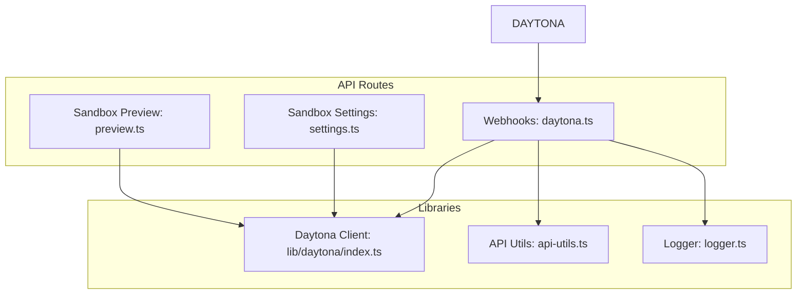
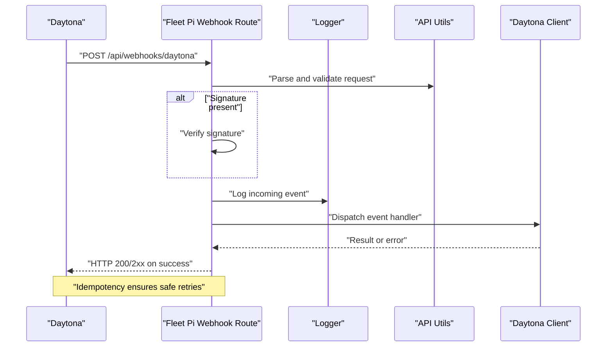
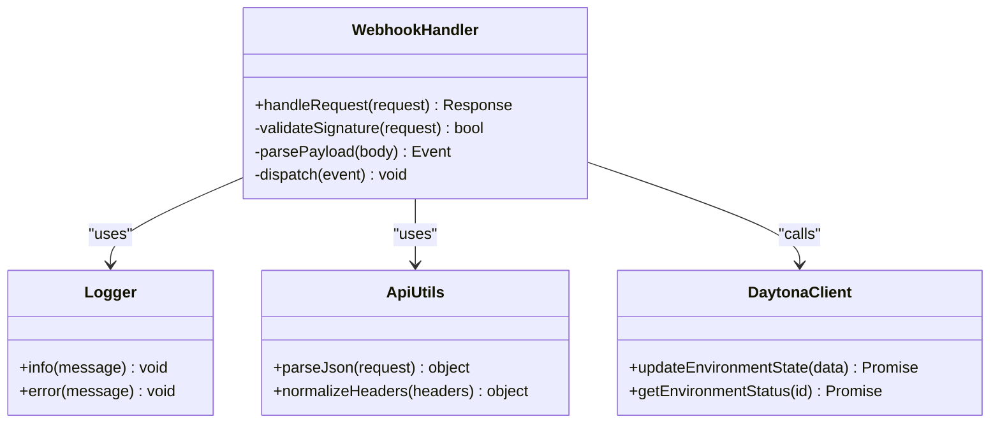
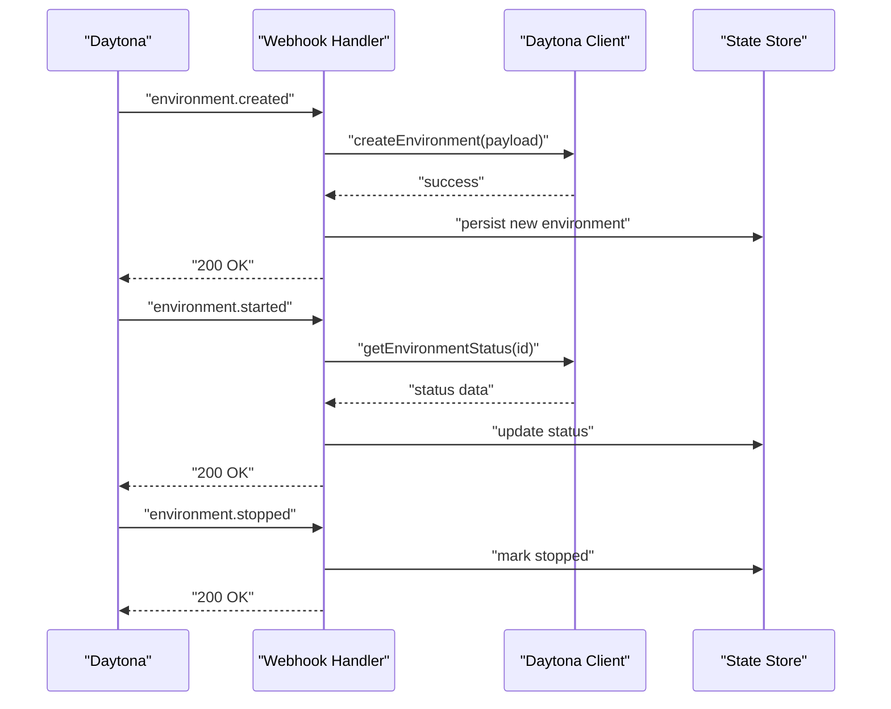
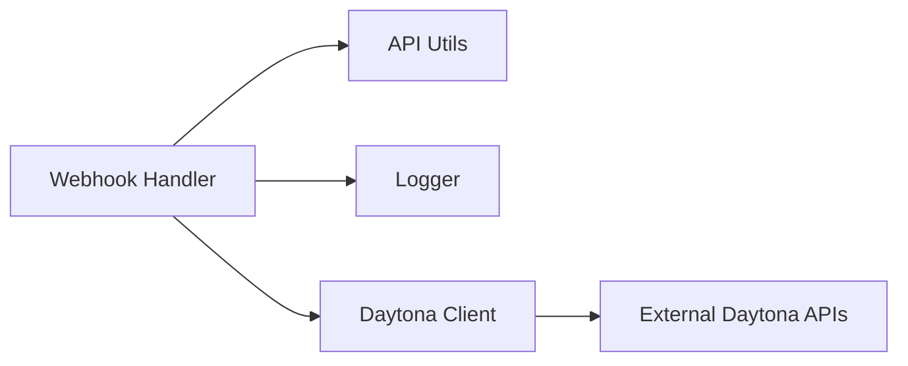

# Webhook Integration

<cite>
**Referenced Files in This Document**
- [daytona.ts](file://apps/web/src/routes/api/webhooks/daytona.ts)
- [-daytona.test.ts](file://apps/web/src/routes/api/webhooks/-daytona.test.ts)
- [daytona.md](file://docs/daytona.md)
- [sandbox-settings.ts](file://apps/web/src/routes/api/sandbox/settings.ts)
- [preview.ts](file://apps/web/src/routes/api/sandbox/preview.ts)
- [daytona](file://apps/web/src/lib/daytona/index.ts)
- [api-utils.ts](file://apps/web/src/lib/api-utils.ts)
- [logger.ts](file://apps/web/src/lib/logger.ts)
</cite>

## Table of Contents

1. [Introduction](#introduction)
2. [Project Structure](#project-structure)
3. [Core Components](#core-components)
4. [Architecture Overview](#architecture-overview)
5. [Detailed Component Analysis](#detailed-component-analysis)
6. [Dependency Analysis](#dependency-analysis)
7. [Performance Considerations](#performance-considerations)
8. [Troubleshooting Guide](#troubleshooting-guide)
9. [Conclusion](#conclusion)
10. [Appendices](#appendices)

## Introduction

This document provides detailed API documentation for Fleet Pi’s webhook system, with a focus on the Daytona sandbox integration. It explains how webhooks are delivered to Fleet Pi, what events are emitted by Daytona, and how to configure, implement, and secure webhook endpoints. It also covers payload structures, retry behavior, error handling, monitoring, and best practices for building robust webhook handlers.

## Project Structure

Fleet Pi exposes webhook endpoints under the API routes. The Daytona webhook handler is implemented as an API route that processes incoming events from Daytona sandboxes. Supporting utilities provide logging, request parsing, and shared helpers.

**Diagram sources**

- [daytona.ts](file://apps/web/src/routes/api/webhooks/daytona.ts)
- [settings.ts](file://apps/web/src/routes/api/sandbox/settings.ts)
- [preview.ts](file://apps/web/src/routes/api/sandbox/preview.ts)
- [daytona](file://apps/web/src/lib/daytona/index.ts)
- [api-utils.ts](file://apps/web/src/lib/api-utils.ts)
- [logger.ts](file://apps/web/src/lib/logger.ts)

**Section sources**

- [daytona.ts](file://apps/web/src/routes/api/webhooks/daytona.ts)
- [-daytona.test.ts](file://apps/web/src/routes/api/webhooks/-daytona.test.ts)
- [daytona.md](file://docs/daytona.md)

## Core Components

- Webhook endpoint for Daytona events: Receives and validates incoming payloads, dispatches event-specific logic, and returns appropriate HTTP status codes.
- Daytona client library: Encapsulates calls to Daytona services (e.g., environment lifecycle operations).
- Shared utilities: Logging and common API helpers used across routes.

Key responsibilities:

- Validate request origin and signature where applicable.
- Parse and normalize payloads.
- Route events to handlers based on event type.
- Persist state changes or trigger downstream actions.
- Return idempotent responses and handle retries gracefully.

**Section sources**

- [daytona.ts](file://apps/web/src/routes/api/webhooks/daytona.ts)
- [daytona](file://apps/web/src/lib/daytona/index.ts)
- [api-utils.ts](file://apps/web/src/lib/api-utils.ts)
- [logger.ts](file://apps/web/src/lib/logger.ts)

## Architecture Overview

The Daytona webhook flow integrates with Fleet Pi’s API layer and internal libraries to process environment lifecycle events.

**Diagram sources**

- [daytona.ts](file://apps/web/src/routes/api/webhooks/daytona.ts)
- [api-utils.ts](file://apps/web/src/lib/api-utils.ts)
- [logger.ts](file://apps/web/src/lib/logger.ts)
- [daytona](file://apps/web/src/lib/daytona/index.ts)

## Detailed Component Analysis

### Daytona Webhook Endpoint

Responsibilities:

- Accepts POST requests from Daytona with event payloads.
- Validates headers and optional signatures.
- Parses JSON body and normalizes fields.
- Dispatches to event-specific handlers based on event type.
- Returns consistent HTTP status codes to signal processing outcomes.

Event types and payloads:

- Environment lifecycle events such as creation, start, stop, deletion, and status updates.
- Each event includes metadata identifying the target environment and timestamp.
- Payloads may include additional context like resource IDs and operation results.

Delivery guarantees and retries:

- Expect retries from the provider; ensure handlers are idempotent.
- Use stable identifiers to deduplicate repeated events.

Error handling:

- Return 4xx for malformed requests or invalid signatures.
- Return 5xx for transient failures; avoid persisting partial state on errors.

Security considerations:

- Verify signatures when provided.
- Enforce HTTPS-only endpoints.
- Rate-limit and log suspicious activity.

**Section sources**

- [daytona.ts](file://apps/web/src/routes/api/webhooks/daytona.ts)
- [-daytona.test.ts](file://apps/web/src/routes/api/webhooks/-daytona.test.ts)

#### Class Diagram: Webhook Handler Flow

**Diagram sources**

- [daytona.ts](file://apps/web/src/routes/api/webhooks/daytona.ts)
- [logger.ts](file://apps/web/src/lib/logger.ts)
- [api-utils.ts](file://apps/web/src/lib/api-utils.ts)
- [daytona](file://apps/web/src/lib/daytona/index.ts)

### Daytona Sandbox Integration

Fleet Pi interacts with Daytona through its client library to manage environments and retrieve status information. The sandbox settings and preview endpoints demonstrate typical usage patterns.

Key operations:

- Create, update, and delete environments.
- Query environment status and details.
- Trigger previews or deployments as needed.

Integration points:

- Webhook handler uses the client to reconcile state after receiving events.
- Sandbox settings endpoint configures runtime options.
- Preview endpoint triggers preview builds or links.

**Section sources**

- [daytona.md](file://docs/daytona.md)
- [settings.ts](file://apps/web/src/routes/api/sandbox/settings.ts)
- [preview.ts](file://apps/web/src/routes/api/sandbox/preview.ts)
- [daytona](file://apps/web/src/lib/daytona/index.ts)

#### Sequence Diagram: Environment Lifecycle via Webhook

**Diagram sources**

- [daytona.ts](file://apps/web/src/routes/api/webhooks/daytona.ts)
- [daytona](file://apps/web/src/lib/daytona/index.ts)

### Configuration and Subscriptions

- Configure webhook URLs in the external service (Daytona) to point to Fleet Pi’s webhook endpoint.
- Subscribe to desired event types (environment lifecycle and status updates).
- Ensure your endpoint supports idempotent processing and handles retries.

Operational tips:

- Use feature flags to enable/disable specific event subscriptions.
- Maintain versioned endpoints if payload schemas evolve.

**Section sources**

- [daytona.md](file://docs/daytona.md)
- [settings.ts](file://apps/web/src/routes/api/sandbox/settings.ts)

### Example Handlers and Error Recovery

- Implement handlers per event type that parse payloads, perform validation, and update state.
- Use try/catch blocks around external calls and log errors with contextual data.
- On transient failures, return 5xx to signal retry; on permanent errors, return 4xx with clear messages.
- Deduplicate events using stable IDs to prevent duplicate state mutations.

Monitoring approaches:

- Log all incoming events with correlation IDs.
- Track success/failure rates and latency percentiles.
- Alert on sustained error spikes or missing expected events.

**Section sources**

- [daytona.ts](file://apps/web/src/routes/api/webhooks/daytona.ts)
- [logger.ts](file://apps/web/src/lib/logger.ts)
- [-daytona.test.ts](file://apps/web/src/routes/api/webhooks/-daytona.test.ts)

## Dependency Analysis

The webhook module depends on shared utilities and the Daytona client. Clear separation of concerns improves testability and maintainability.

**Diagram sources**

- [daytona.ts](file://apps/web/src/routes/api/webhooks/daytona.ts)
- [api-utils.ts](file://apps/web/src/lib/api-utils.ts)
- [logger.ts](file://apps/web/src/lib/logger.ts)
- [daytona](file://apps/web/src/lib/daytona/index.ts)

**Section sources**

- [daytona.ts](file://apps/web/src/routes/api/webhooks/daytona.ts)
- [api-utils.ts](file://apps/web/src/lib/api-utils.ts)
- [logger.ts](file://apps/web/src/lib/logger.ts)
- [daytona](file://apps/web/src/lib/daytona/index.ts)

## Performance Considerations

- Keep webhook handlers fast and non-blocking; offload long-running tasks to background jobs if necessary.
- Avoid heavy I/O in the critical path; use caching for read-heavy operations.
- Batch state updates where possible to reduce write contention.
- Monitor throughput and latency; scale horizontally if needed.

[No sources needed since this section provides general guidance]

## Troubleshooting Guide

Common issues and resolutions:

- Signature verification failures: Check secret configuration and header names.
- Malformed payloads: Validate content-type and schema; log raw payloads for debugging.
- Duplicate events: Implement idempotency keys and deduplication logic.
- Retry storms: Add exponential backoff and circuit breakers at the caller side; ensure your endpoint responds quickly.
- Missing events: Inspect logs and network connectivity; verify subscription configuration.

Debugging steps:

- Enable verbose logging for webhook processing.
- Replay failed events using stored payloads.
- Correlate events with environment IDs and timestamps.

**Section sources**

- [daytona.ts](file://apps/web/src/routes/api/webhooks/daytona.ts)
- [logger.ts](file://apps/web/src/lib/logger.ts)
- [-daytona.test.ts](file://apps/web/src/routes/api/webhooks/-daytona.test.ts)

## Conclusion

Fleet Pi’s webhook system integrates tightly with Daytona to keep environment state synchronized. By implementing robust handlers, enforcing security, and adopting strong monitoring and error recovery strategies, you can build reliable integrations that scale and remain resilient under retries and failures.

[No sources needed since this section summarizes without analyzing specific files]

## Appendices

### Security Checklist

- Enforce HTTPS-only endpoints.
- Verify signatures when provided by the provider.
- Validate and sanitize all inputs.
- Apply rate limiting and IP allowlists where appropriate.
- Rotate secrets regularly and store securely.

[No sources needed since this section provides general guidance]

### Monitoring and Observability

- Emit structured logs with event type, environment ID, and correlation ID.
- Track metrics: request volume, success rate, latency, error counts.
- Set up alerts for anomalies and SLA breaches.

[No sources needed since this section provides general guidance]
