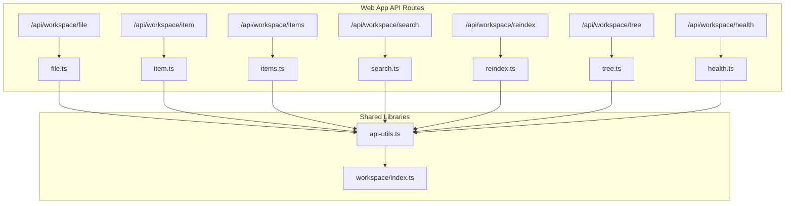
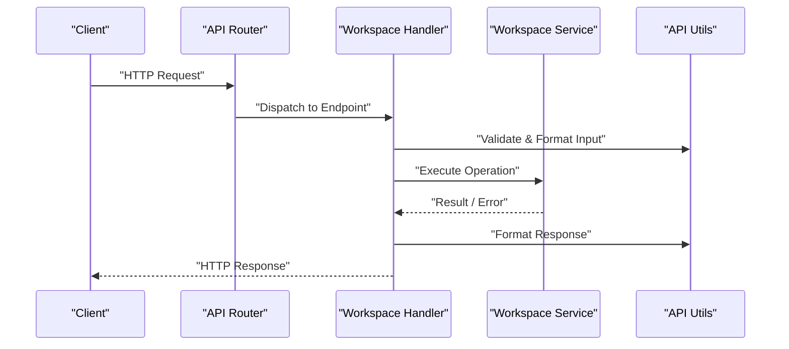
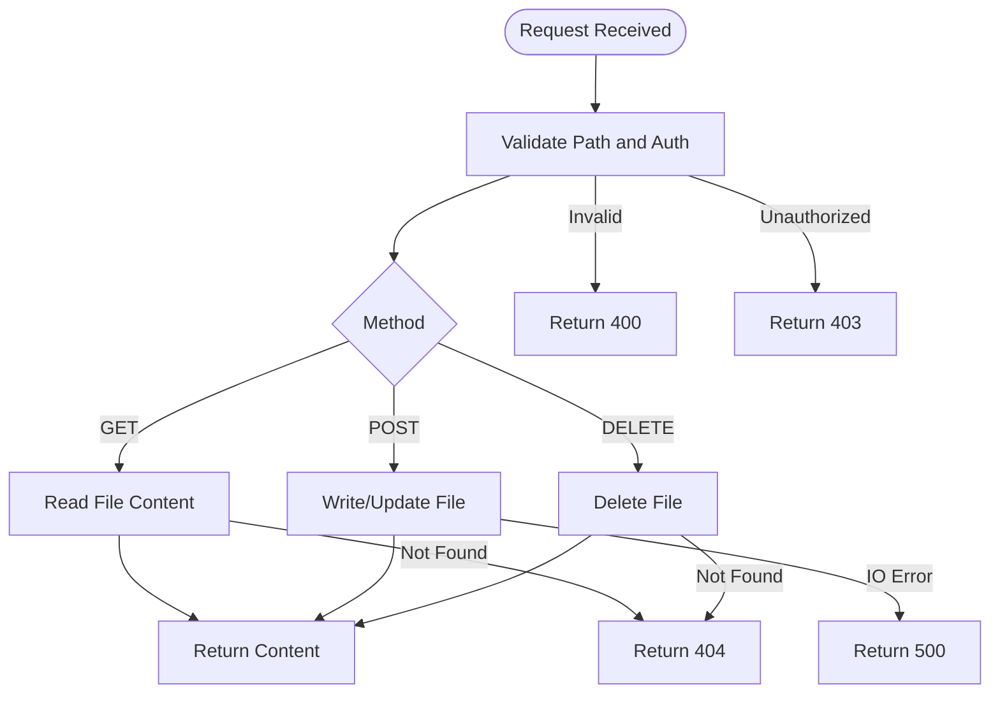
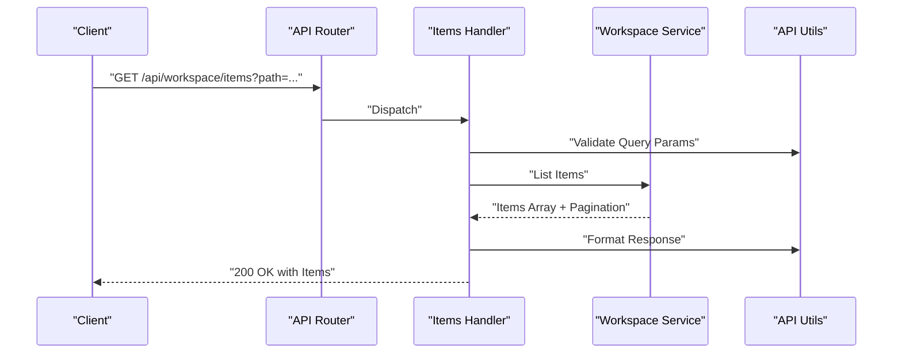
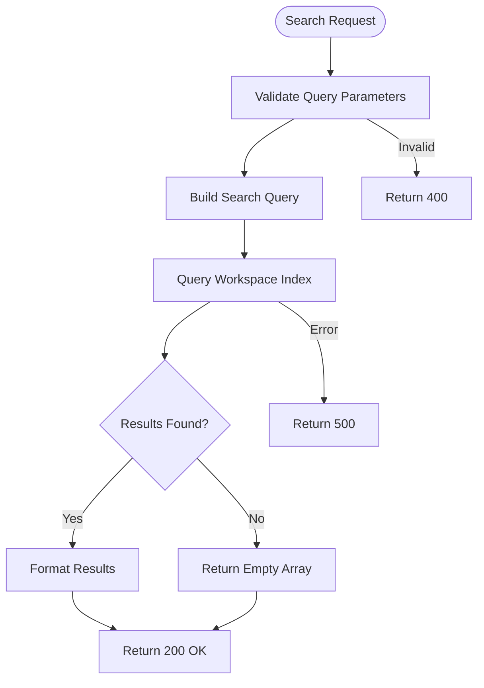
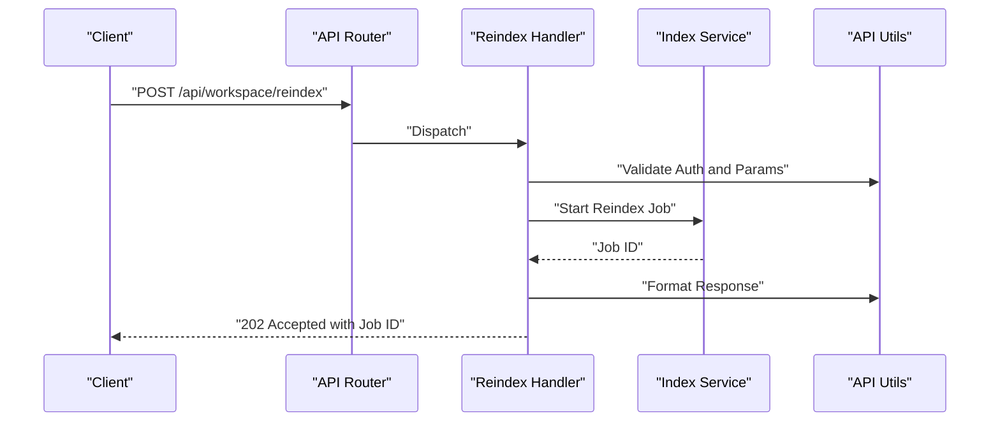
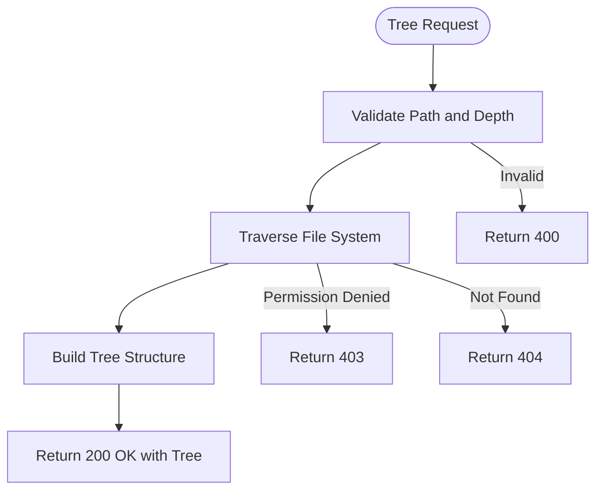
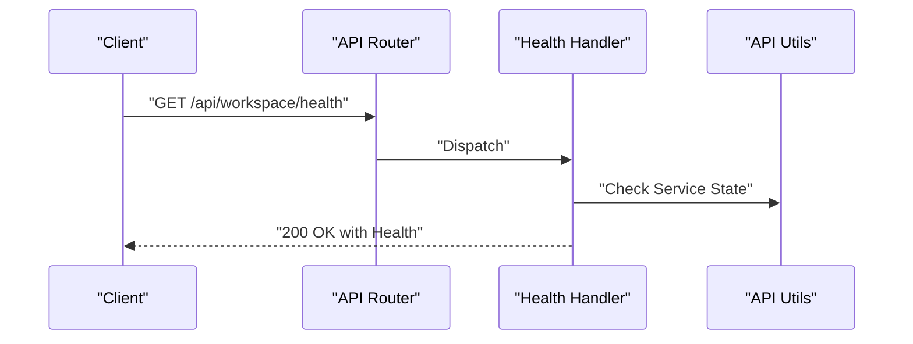
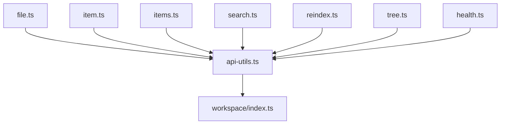

# Workspace API Endpoints

<cite>
**Referenced Files in This Document**
- [file.ts](file://apps/web/src/routes/api/workspace/file.ts)
- [item.ts](file://apps/web/src/routes/api/workspace/item.ts)
- [items.ts](file://apps/web/src/routes/api/workspace/items.ts)
- [reindex.ts](file://apps/web/src/routes/api/workspace/reindex.ts)
- [search.ts](file://apps/web/src/routes/api/workspace/search.ts)
- [tree.ts](file://apps/web/src/routes/api/workspace/tree.ts)
- [health.ts](file://apps/web/src/routes/api/workspace/health.ts)
- [api-utils.ts](file://apps/web/src/lib/api-utils.ts)
- [workspace/index.ts](file://apps/web/src/lib/workspace/index.ts)
- [openapi.json](file://apps/web/openapi.json)
</cite>

## Table of Contents

1. [Introduction](#introduction)
2. [Project Structure](#project-structure)
3. [Core Components](#core-components)
4. [Architecture Overview](#architecture-overview)
5. [Detailed Component Analysis](#detailed-component-analysis)
6. [Dependency Analysis](#dependency-analysis)
7. [Performance Considerations](#performance-considerations)
8. [Troubleshooting Guide](#troubleshooting-guide)
9. [Conclusion](#conclusion)
10. [Appendices](#appendices)

## Introduction

This document provides detailed API documentation for Fleet Pi’s workspace management system. It covers file operations, directory navigation, search functionality, and workspace indexing endpoints. The focus is on HTTP methods, URL patterns, request/response schemas, authentication requirements, error handling, real-time synchronization considerations, batch operations, performance guidance for large codebases, and security measures including permissions and access control.

## Project Structure

The workspace API endpoints are implemented as route handlers under the web application’s API routes. Each endpoint corresponds to a specific operation:

- File operations: read, write, delete
- Directory navigation: list items and tree traversal
- Search: content-based search across the workspace
- Indexing: reindex and health checks
- Utilities: shared helpers for API responses and validation

**Diagram sources**

- [file.ts](file://apps/web/src/routes/api/workspace/file.ts)
- [item.ts](file://apps/web/src/routes/api/workspace/item.ts)
- [items.ts](file://apps/web/src/routes/api/workspace/items.ts)
- [search.ts](file://apps/web/src/routes/api/workspace/search.ts)
- [reindex.ts](file://apps/web/src/routes/api/workspace/reindex.ts)
- [tree.ts](file://apps/web/src/routes/api/workspace/tree.ts)
- [health.ts](file://apps/web/src/routes/api/workspace/health.ts)
- [api-utils.ts](file://apps/web/src/lib/api-utils.ts)
- [workspace/index.ts](file://apps/web/src/lib/workspace/index.ts)

**Section sources**

- [file.ts](file://apps/web/src/routes/api/workspace/file.ts)
- [item.ts](file://apps/web/src/routes/api/workspace/item.ts)
- [items.ts](file://apps/web/src/routes/api/workspace/items.ts)
- [search.ts](file://apps/web/src/routes/api/workspace/search.ts)
- [reindex.ts](file://apps/web/src/routes/api/workspace/reindex.ts)
- [tree.ts](file://apps/web/src/routes/api/workspace/tree.ts)
- [health.ts](file://apps/web/src/routes/api/workspace/health.ts)
- [api-utils.ts](file://apps/web/src/lib/api-utils.ts)
- [workspace/index.ts](file://apps/web/src/lib/workspace/index.ts)

## Core Components

- File endpoint: Handles reading, writing, and deleting files within the workspace. Supports path-based operations and content payloads.
- Item endpoints: Provide listing and retrieval of individual items (files or directories).
- Items endpoint: Batch listing of multiple items with optional filters and pagination.
- Search endpoint: Content search across indexed workspace data with query parameters.
- Reindex endpoint: Triggers or manages workspace indexing operations.
- Tree endpoint: Returns hierarchical file tree structure for navigation.
- Health endpoint: Provides service health and readiness status.
- Shared utilities: Centralized response formatting, error handling, and validation helpers.

**Section sources**

- [file.ts](file://apps/web/src/routes/api/workspace/file.ts)
- [item.ts](file://apps/web/src/routes/api/workspace/item.ts)
- [items.ts](file://apps/web/src/routes/api/workspace/items.ts)
- [search.ts](file://apps/web/src/routes/api/workspace/search.ts)
- [reindex.ts](file://apps/web/src/routes/api/workspace/reindex.ts)
- [tree.ts](file://apps/web/src/routes/api/workspace/tree.ts)
- [health.ts](file://apps/web/src/routes/api/workspace/health.ts)
- [api-utils.ts](file://apps/web/src/lib/api-utils.ts)

## Architecture Overview

The workspace API follows a layered approach:

- Route handlers receive HTTP requests and validate inputs.
- Business logic delegates to workspace services for file operations, indexing, and search.
- Shared utilities standardize responses and errors.
- Optional real-time synchronization uses event-driven updates triggered by file changes.

[No sources needed since this diagram shows conceptual workflow, not actual code structure]

## Detailed Component Analysis

### File Operations (/api/workspace/file)

- Purpose: Read, write, and delete files within the workspace.
- Methods:
  - GET: Retrieve file content by path.
  - POST: Create or update file content.
  - DELETE: Remove a file by path.
- Authentication: Requires authenticated session; user must have appropriate permissions for the target path.
- Request schema:
  - Path parameter: file path relative to workspace root.
  - Body (POST): content payload (string or base64), metadata flags.
- Response schema:
  - Success: file content or confirmation object.
  - Error: standardized error object with code and message.
- Error handling:
  - 404 when file not found.
  - 403 for insufficient permissions.
  - 400 for invalid input.
  - 500 for server errors.
- Real-time sync: Changes trigger events for clients subscribed to file updates.

**Diagram sources**

- [file.ts](file://apps/web/src/routes/api/workspace/file.ts)
- [api-utils.ts](file://apps/web/src/lib/api-utils.ts)

**Section sources**

- [file.ts](file://apps/web/src/routes/api/workspace/file.ts)
- [api-utils.ts](file://apps/web/src/lib/api-utils.ts)

### Directory Navigation (/api/workspace/item and /api/workspace/items)

- Purpose: List and retrieve items (files/directories) within the workspace.
- Methods:
  - GET /api/workspace/item: Retrieve a single item by path.
  - GET /api/workspace/items: List multiple items with optional filters and pagination.
- Authentication: Requires authenticated session; access controlled per path.
- Request schema:
  - Query parameters: path, recursive flag, limit, offset, filter criteria.
- Response schema:
  - Single item: item metadata (type, size, modified time).
  - Multiple items: array of item metadata with pagination info.
- Error handling:
  - 404 for missing paths.
  - 403 for unauthorized access.
  - 400 for invalid queries.
  - 500 for server errors.

**Diagram sources**

- [item.ts](file://apps/web/src/routes/api/workspace/item.ts)
- [items.ts](file://apps/web/src/routes/api/workspace/items.ts)
- [api-utils.ts](file://apps/web/src/lib/api-utils.ts)

**Section sources**

- [item.ts](file://apps/web/src/routes/api/workspace/item.ts)
- [items.ts](file://apps/web/src/routes/api/workspace/items.ts)
- [api-utils.ts](file://apps/web/src/lib/api-utils.ts)

### Search Functionality (/api/workspace/search)

- Purpose: Perform content-based search across the workspace index.
- Methods:
  - GET: Execute search query with filters.
- Authentication: Requires authenticated session; respects workspace visibility rules.
- Request schema:
  - Query parameters: q (query string), scope (directory filter), type (file extension), limit, offset.
- Response schema:
  - Array of search results with matched snippets, file paths, and relevance scores.
- Error handling:
  - 400 for malformed queries.
  - 403 for unauthorized scopes.
  - 500 for indexing or backend errors.

**Diagram sources**

- [search.ts](file://apps/web/src/routes/api/workspace/search.ts)
- [api-utils.ts](file://apps/web/src/lib/api-utils.ts)

**Section sources**

- [search.ts](file://apps/web/src/routes/api/workspace/search.ts)
- [api-utils.ts](file://apps/web/src/lib/api-utils.ts)

### Workspace Indexing (/api/workspace/reindex)

- Purpose: Trigger or manage indexing operations for the workspace.
- Methods:
  - POST: Start reindexing process.
- Authentication: Requires elevated privileges; may be restricted to administrators.
- Request schema:
  - Optional body: scope (full or partial), priority flags.
- Response schema:
  - Job ID and status polling endpoint reference.
- Error handling:
  - 403 for unauthorized users.
  - 400 for invalid parameters.
  - 500 for internal errors.

**Diagram sources**

- [reindex.ts](file://apps/web/src/routes/api/workspace/reindex.ts)
- [api-utils.ts](file://apps/web/src/lib/api-utils.ts)

**Section sources**

- [reindex.ts](file://apps/web/src/routes/api/workspace/reindex.ts)
- [api-utils.ts](file://apps/web/src/lib/api-utils.ts)

### File Tree Structure (/api/workspace/tree)

- Purpose: Retrieve hierarchical file tree for navigation.
- Methods:
  - GET: Fetch tree starting from a given path.
- Authentication: Requires authenticated session; respects path permissions.
- Request schema:
  - Query parameters: path, depth limit, include metadata.
- Response schema:
  - Nested tree structure with node types, names, and metadata.
- Error handling:
  - 404 for missing root path.
  - 403 for unauthorized access.
  - 500 for server errors.

**Diagram sources**

- [tree.ts](file://apps/web/src/routes/api/workspace/tree.ts)
- [api-utils.ts](file://apps/web/src/lib/api-utils.ts)

**Section sources**

- [tree.ts](file://apps/web/src/routes/api/workspace/tree.ts)
- [api-utils.ts](file://apps/web/src/lib/api-utils.ts)

### Health Check (/api/workspace/health)

- Purpose: Provide health and readiness status for the workspace service.
- Methods:
  - GET: Return health status.
- Authentication: Public endpoint; no auth required.
- Response schema:
  - Status object with service state, version, and uptime.
- Error handling:
  - 503 if service is not ready.

**Diagram sources**

- [health.ts](file://apps/web/src/routes/api/workspace/health.ts)
- [api-utils.ts](file://apps/web/src/lib/api-utils.ts)

**Section sources**

- [health.ts](file://apps/web/src/routes/api/workspace/health.ts)
- [api-utils.ts](file://apps/web/src/lib/api-utils.ts)

## Dependency Analysis

The workspace API components depend on shared utilities and workspace services:

- Route handlers import api-utils for consistent response formatting and validation.
- Workspace services encapsulate file system operations, indexing, and search logic.
- Authentication middleware ensures secure access to endpoints.

**Diagram sources**

- [file.ts](file://apps/web/src/routes/api/workspace/file.ts)
- [item.ts](file://apps/web/src/routes/api/workspace/item.ts)
- [items.ts](file://apps/web/src/routes/api/workspace/items.ts)
- [search.ts](file://apps/web/src/routes/api/workspace/search.ts)
- [reindex.ts](file://apps/web/src/routes/api/workspace/reindex.ts)
- [tree.ts](file://apps/web/src/routes/api/workspace/tree.ts)
- [health.ts](file://apps/web/src/routes/api/workspace/health.ts)
- [api-utils.ts](file://apps/web/src/lib/api-utils.ts)
- [workspace/index.ts](file://apps/web/src/lib/workspace/index.ts)

**Section sources**

- [api-utils.ts](file://apps/web/src/lib/api-utils.ts)
- [workspace/index.ts](file://apps/web/src/lib/workspace/index.ts)

## Performance Considerations

- Large codebases: Use pagination and depth limits for tree and items endpoints to avoid excessive payloads.
- Search optimization: Leverage pre-built indexes and cache frequent queries.
- Batch operations: Prefer bulk endpoints where available to reduce network overhead.
- Real-time sync: Implement efficient delta updates and debounce change events.
- Concurrency: Handle concurrent requests with proper locking mechanisms to prevent race conditions.

[No sources needed since this section provides general guidance]

## Troubleshooting Guide

Common issues and resolutions:

- Authentication failures: Ensure valid session tokens and correct permissions.
- Permission errors: Verify user access rights for target paths.
- Indexing delays: Monitor reindex job status and check for blocking operations.
- Search inaccuracies: Refresh indexes and validate query syntax.
- Performance bottlenecks: Profile endpoint latency and optimize database queries.

**Section sources**

- [api-utils.ts](file://apps/web/src/lib/api-utils.ts)

## Conclusion

Fleet Pi’s workspace API provides comprehensive file operations, directory navigation, search capabilities, and indexing endpoints. With robust authentication, error handling, and performance optimizations, it supports efficient workspace management for both small projects and large codebases. Adhering to the documented schemas and best practices ensures reliable integration and optimal user experience.

## Appendices

### OpenAPI Reference

For complete endpoint specifications, refer to the generated OpenAPI document.

**Section sources**

- [openapi.json](file://apps/web/openapi.json)
