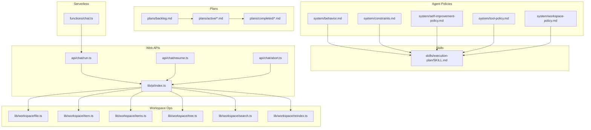
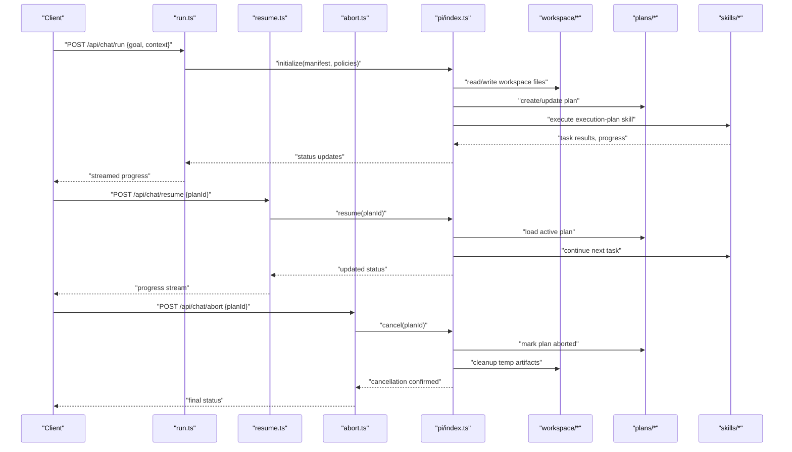
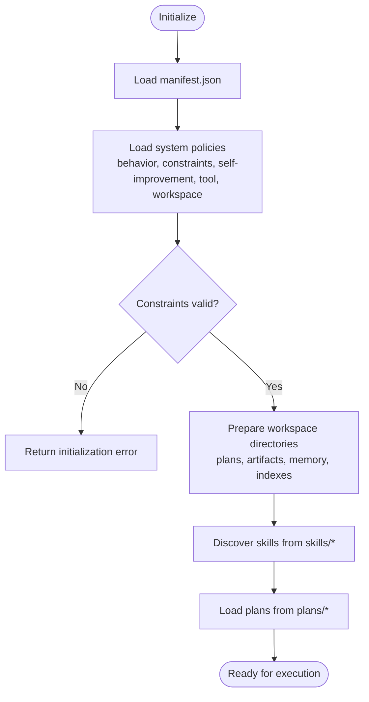
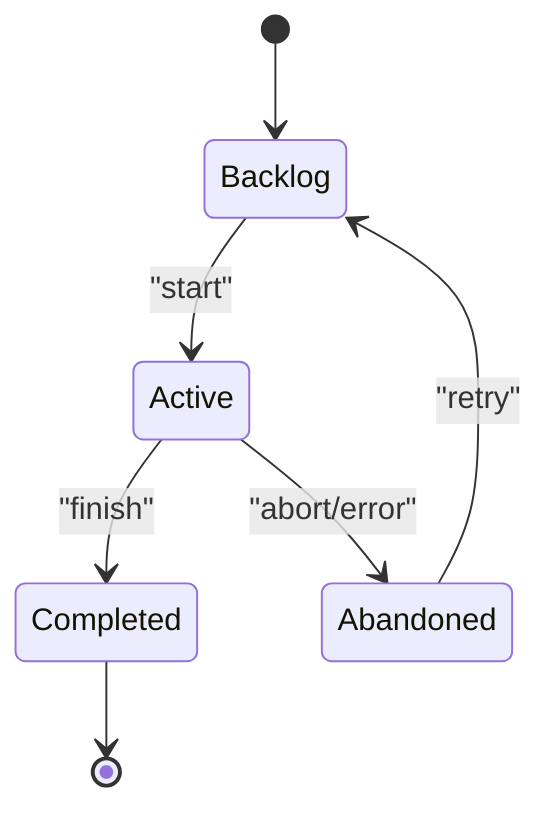
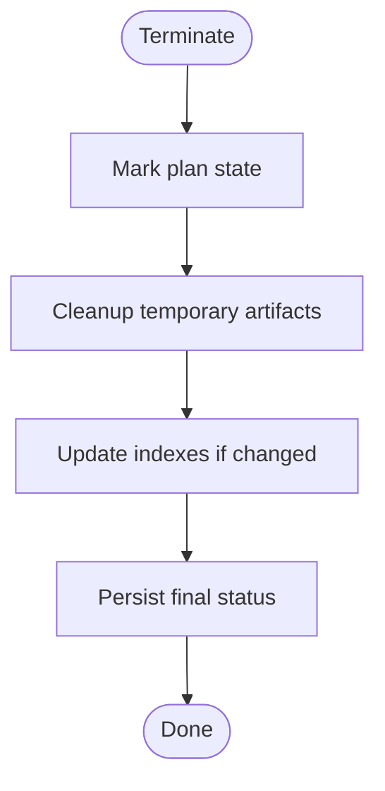
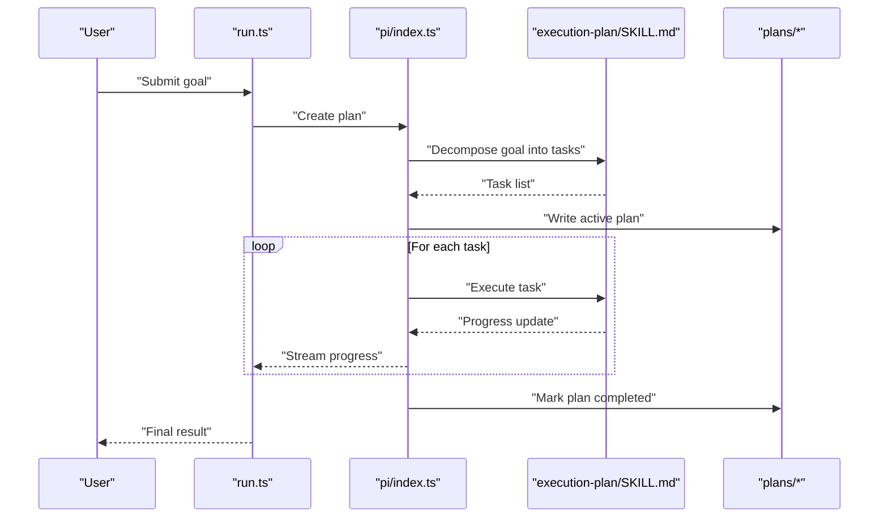
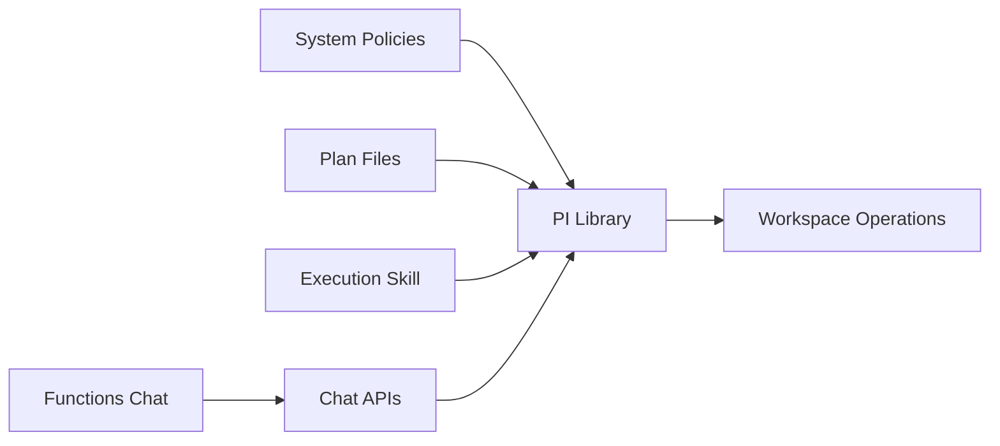

# Agent Lifecycle Management

<cite>
**Referenced Files in This Document**
- [AGENTS.md](file://AGENTS.md)
- [WORKSPACE.md](file://WORKSPACE.md)
- [agent-workspace/manifest.json](file://agent-workspace/manifest.json)
- [agent-workspace/system/behavior.md](file://agent-workspace/system/behavior.md)
- [agent-workspace/system/constraints.md](file://agent-workspace/system/constraints.md)
- [agent-workspace/system/self-improvement-policy.md](file://agent-workspace/system/self-improvement-policy.md)
- [agent-workspace/system/tool-policy.md](file://agent-workspace/system/tool-policy.md)
- [agent-workspace/system/workspace-policy.md](file://agent-workspace/system/workspace-policy.md)
- [agent-workspace/plans/backlog.md](file://agent-workspace/plans/backlog.md)
- [agent-workspace/plans/active/upgrade-pi-0.80.10.md](file://agent-workspace/plans/active/upgrade-pi-0.80.10.md)
- [agent-workspace/plans/completed/install-pi-web-access.md](file://agent-workspace/plans/completed/install-pi-web-access.md)
- [agent-workspace/skills/execution-plan/SKILL.md](file://agent-workspace/skills/execution-plan/SKILL.md)
- [apps/web/src/routes/api/chat/run.ts](file://apps/web/src/routes/api/chat/run.ts)
- [apps/web/src/routes/api/chat/resume.ts](file://apps/web/src/routes/api/chat/resume.ts)
- [apps/web/src/routes/api/chat/abort.ts](file://apps/web/src/routes/api/chat/abort.ts)
- [apps/web/src/lib/pi/index.ts](file://apps/web/src/lib/pi/index.ts)
- [apps/web/src/lib/workspace/file.ts](file://apps/web/src/lib/workspace/file.ts)
- [apps/web/src/lib/workspace/item.ts](file://apps/web/src/lib/workspace/item.ts)
- [apps/web/src/lib/workspace/items.ts](file://apps/web/src/lib/workspace/items.ts)
- [apps/web/src/lib/workspace/tree.ts](file://apps/web/src/lib/workspace/tree.ts)
- [apps/web/src/lib/workspace/search.ts](file://apps/web/src/lib/workspace/search.ts)
- [apps/web/src/lib/workspace/reindex.ts](file://apps/web/src/lib/workspace/reindex.ts)
- [functions/chat.ts](file://functions/chat.ts)
</cite>

## Table of Contents

1. Introduction
2. Project Structure
3. Core Components
4. Architecture Overview
5. Detailed Component Analysis
6. Dependency Analysis
7. Performance Considerations
8. Troubleshooting Guide
9. Conclusion

## Introduction

This document explains the agent lifecycle management for the project, focusing on initialization, state transitions, termination, planning and execution workflows, progress tracking, plan management, task scheduling, resource allocation, error handling, recovery, graceful degradation, and external system interactions including API rate limiting and timeouts. It is written to be accessible to beginners while providing sufficient technical depth for experienced developers extending agent capabilities.

## Project Structure

The agent lifecycle spans several areas:

- Agent configuration and policy files under agent-workspace/system
- Plan artifacts under agent-workspace/plans
- Execution skills under agent-workspace/skills
- Web API endpoints that orchestrate chat runs, resume, and abort operations
- Workspace utilities for file and item operations used by agents during execution
- A serverless function entry point for chat processing

**Diagram sources**

- [agent-workspace/system/behavior.md](file://agent-workspace/system/behavior.md)
- [agent-workspace/system/constraints.md](file://agent-workspace/system/constraints.md)
- [agent-workspace/system/self-improvement-policy.md](file://agent-workspace/system/self-improvement-policy.md)
- [agent-workspace/system/tool-policy.md](file://agent-workspace/system/tool-policy.md)
- [agent-workspace/system/workspace-policy.md](file://agent-workspace/system/workspace-policy.md)
- [agent-workspace/plans/backlog.md](file://agent-workspace/plans/backlog.md)
- [agent-workspace/plans/active/upgrade-pi-0.80.10.md](file://agent-workspace/plans/active/upgrade-pi-0.80.10.md)
- [agent-workspace/plans/completed/install-pi-web-access.md](file://agent-workspace/plans/completed/install-pi-web-access.md)
- [agent-workspace/skills/execution-plan/SKILL.md](file://agent-workspace/skills/execution-plan/SKILL.md)
- [apps/web/src/routes/api/chat/run.ts](file://apps/web/src/routes/api/chat/run.ts)
- [apps/web/src/routes/api/chat/resume.ts](file://apps/web/src/routes/api/chat/resume.ts)
- [apps/web/src/routes/api/chat/abort.ts](file://apps/web/src/routes/api/chat/abort.ts)
- [apps/web/src/lib/pi/index.ts](file://apps/web/src/lib/pi/index.ts)
- [apps/web/src/lib/workspace/file.ts](file://apps/web/src/lib/workspace/file.ts)
- [apps/web/src/lib/workspace/item.ts](file://apps/web/src/lib/workspace/item.ts)
- [apps/web/src/lib/workspace/items.ts](file://apps/web/src/lib/workspace/items.ts)
- [apps/web/src/lib/workspace/tree.ts](file://apps/web/src/lib/workspace/tree.ts)
- [apps/web/src/lib/workspace/search.ts](file://apps/web/src/lib/workspace/search.ts)
- [apps/web/src/lib/workspace/reindex.ts](file://apps/web/src/lib/workspace/reindex.ts)
- [functions/chat.ts](file://functions/chat.ts)

**Section sources**

- [AGENTS.md](file://AGENTS.md)
- [WORKSPACE.md](file://WORKSPACE.md)
- [agent-workspace/manifest.json](file://agent-workspace/manifest.json)

## Core Components

- Agent policies define behavior, constraints, self-improvement rules, tool usage, and workspace management. These are consumed by the agent runtime to ensure consistent operation.
- Plans represent structured work with states (backlog, active, completed). They guide execution and provide progress tracking.
- Skills encapsulate reusable behaviors such as execution planning.
- Web APIs orchestrate agent runs, resume interrupted runs, and support cancellation.
- Workspace utilities provide file and item operations needed by agents during execution.
- The serverless function provides an entry point for chat-driven agent tasks.

Key responsibilities:

- Initialization: load manifest and policies; prepare workspace; discover skills and plans.
- Planning: create or update plans; decompose goals into tasks; schedule tasks.
- Execution: run tasks using skills; track progress; persist artifacts.
- Termination: finalize plans; archive artifacts; release resources.

**Section sources**

- [agent-workspace/system/behavior.md](file://agent-workspace/system/behavior.md)
- [agent-workspace/system/constraints.md](file://agent-workspace/system/constraints.md)
- [agent-workspace/system/self-improvement-policy.md](file://agent://agent-workspace/system/self-improvement-policy.md)
- [agent-workspace/system/tool-policy.md](file://agent-workspace/system/tool-policy.md)
- [agent-workspace/system/workspace-policy.md](file://agent-workspace/system/workspace-policy.md)
- [agent-workspace/skills/execution-plan/SKILL.md](file://agent-workspace/skills/execution-plan/SKILL.md)
- [agent-workspace/plans/backlog.md](file://agent-workspace/plans/backlog.md)
- [agent-workspace/plans/active/upgrade-pi-0.80.10.md](file://agent-workspace/plans/active/upgrade-pi-0.80.10.md)
- [agent-workspace/plans/completed/install-pi-web-access.md](file://agent-workspace/plans/completed/install-pi-web-access.md)
- [apps/web/src/routes/api/chat/run.ts](file://apps/web/src/routes/api/chat/run.ts)
- [apps/web/src/routes/api/chat/resume.ts](file://apps/web/src/routes/api/chat/resume.ts)
- [apps/web/src/routes/api/chat/abort.ts](file://apps/web/src/routes/api/chat/abort.ts)
- [apps/web/src/lib/pi/index.ts](file://apps/web/src/lib/pi/index.ts)
- [apps/web/src/lib/workspace/file.ts](file://apps/web/src/lib/workspace/file.ts)
- [apps/web/src/lib/workspace/item.ts](file://apps/web/src/lib/workspace/item.ts)
- [apps/web/src/lib/workspace/items.ts](file://apps/web/src/lib/workspace/items.ts)
- [apps/web/src/lib/workspace/tree.ts](file://apps/web/src/lib/workspace/tree.ts)
- [apps/web/src/lib/workspace/search.ts](file://apps/web/src/lib/workspace/search.ts)
- [apps/web/src/lib/workspace/reindex.ts](file://apps/web/src/lib/workspace/reindex.ts)
- [functions/chat.ts](file://functions/chat.ts)

## Architecture Overview

The agent lifecycle is orchestrated through HTTP APIs that invoke a PI library which coordinates workspace operations and skill execution. Plans drive the workflow, and policies constrain behavior.

**Diagram sources**

- [apps/web/src/routes/api/chat/run.ts](file://apps/web/src/routes/api/chat/run.ts)
- [apps/web/src/routes/api/chat/resume.ts](file://apps/web/src/routes/api/chat/resume.ts)
- [apps/web/src/routes/api/chat/abort.ts](file://apps/web/src/routes/api/chat/abort.ts)
- [apps/web/src/lib/pi/index.ts](file://apps/web/src/lib/pi/index.ts)
- [apps/web/src/lib/workspace/file.ts](file://apps/web/src/lib/workspace/file.ts)
- [apps/web/src/lib/workspace/item.ts](file://apps/web/src/lib/workspace/item.ts)
- [apps/web/src/lib/workspace/items.ts](file://apps/web/src/lib/workspace/items.ts)
- [apps/web/src/lib/workspace/tree.ts](file://apps/web/src/lib/workspace/tree.ts)
- [apps/web/src/lib/workspace/search.ts](file://apps/web/src/lib/workspace/search.ts)
- [apps/web/src/lib/workspace/reindex.ts](file://apps/web/src/lib/workspace/reindex.ts)
- [agent-workspace/plans/backlog.md](file://agent-workspace/plans/backlog.md)
- [agent-workspace/plans/active/upgrade-pi-0.80.10.md](file://agent-workspace/plans/active/upgrade-pi-0.80.10.md)
- [agent-workspace/plans/completed/install-pi-web-access.md](file://agent-workspace/plans/completed/install-pi-web-access.md)
- [agent-workspace/skills/execution-plan/SKILL.md](file://agent-workspace/skills/execution-plan/SKILL.md)

## Detailed Component Analysis

### Agent Initialization

Initialization loads the agent manifest and policies, prepares the workspace, and discovers available skills and existing plans. It validates constraints and sets up execution context.

**Diagram sources**

- [agent-workspace/manifest.json](file://agent-workspace/manifest.json)
- [agent-workspace/system/behavior.md](file://agent-workspace/system/behavior.md)
- [agent-workspace/system/constraints.md](file://agent-workspace/system/constraints.md)
- [agent-workspace/system/self-improvement-policy.md](file://agent-workspace/system/self-improvement-policy.md)
- [agent-workspace/system/tool-policy.md](file://agent-workspace/system/tool-policy.md)
- [agent-workspace/system/workspace-policy.md](file://agent-workspace/system/workspace-policy.md)
- [agent-workspace/plans/backlog.md](file://agent-workspace/plans/backlog.md)
- [agent-workspace/skills/execution-plan/SKILL.md](file://agent-workspace/skills/execution-plan/SKILL.md)

**Section sources**

- [agent-workspace/manifest.json](file://agent-workspace/manifest.json)
- [agent-workspace/system/behavior.md](file://agent-workspace/system/behavior.md)
- [agent-workspace/system/constraints.md](file://agent-workspace/system/constraints.md)
- [agent-workspace/system/self-improvement-policy.md](file://agent-workspace/system/self-improvement-policy.md)
- [agent-workspace/system/tool-policy.md](file://agent-workspace/system/tool-policy.md)
- [agent-workspace/system/workspace-policy.md](file://agent-workspace/system/workspace-policy.md)

### State Transitions

Agents transition through plan states managed via the plans directory structure:

- Backlog: pending tasks
- Active: currently executing tasks
- Completed: finished tasks
- Abandoned: cancelled or failed tasks

**Diagram sources**

- [agent-workspace/plans/backlog.md](file://agent-workspace/plans/backlog.md)
- [agent-workspace/plans/active/upgrade-pi-0.80.10.md](file://agent-workspace/plans/active/upgrade-pi-0.80.10.md)
- [agent-workspace/plans/completed/install-pi-web-access.md](file://agent-workspace/plans/completed/install-pi-web-access.md)

**Section sources**

- [agent-workspace/plans/backlog.md](file://agent-workspace/plans/backlog.md)
- [agent-workspace/plans/active/upgrade-pi-0.80.10.md](file://agent-workspace/plans/active/upgrade-pi-0.80.10.md)
- [agent-workspace/plans/completed/install-pi-web-access.md](file://agent-workspace/plans/completed/install-pi-web-access.md)

### Termination Procedures

Termination ensures cleanup and finalization:

- Mark plan as aborted or completed
- Archive artifacts and logs
- Release temporary resources
- Update indexes if necessary

**Diagram sources**

- [apps/web/src/routes/api/chat/abort.ts](file://apps/web/src/routes/api/chat/abort.ts)
- [apps/web/src/lib/workspace/reindex.ts](file://apps/web/src/lib/workspace/reindex.ts)

**Section sources**

- [apps/web/src/routes/api/chat/abort.ts](file://apps/web/src/routes/api/chat/abort.ts)
- [apps/web/src/lib/workspace/reindex.ts](file://apps/web/src/lib/workspace/reindex.ts)

### Behavior Constraints and Self-Improvement Policies

Behavior constraints restrict agent actions to safe and policy-compliant operations. Self-improvement policies govern how agents may modify their own configuration or skills over time. Tool policies specify allowed tools and usage patterns. Workspace policies define file and directory access rules.

Key aspects:

- Allowed operations per environment
- Rate limits and quotas
- Audit logging requirements
- Safe defaults for risky operations

**Section sources**

- [agent-workspace/system/behavior.md](file://agent-workspace/system/behavior.md)
- [agent-workspace/system/constraints.md](file://agent-workspace/system/constraints.md)
- [agent-workspace/system/self-improvement-policy.md](file://agent-workspace/system/self-improvement-policy.md)
- [agent-workspace/system/tool-policy.md](file://agent-workspace/system/tool-policy.md)
- [agent-workspace/system/workspace-policy.md](file://agent-workspace/system/workspace-policy.md)

### Workspace Management Rules

Workspace management includes:

- Directory structure conventions
- File naming and versioning
- Artifact storage and archival
- Index maintenance and reindexing triggers

Operational guidelines:

- Use dedicated directories for artifacts, memory, and indexes
- Avoid modifying core system files directly
- Ensure idempotent writes
- Maintain consistency between content and indexes

**Section sources**

- [agent-workspace/system/workspace-policy.md](file://agent-workspace/system/workspace-policy.md)
- [apps/web/src/lib/workspace/file.ts](file://apps/web/src/lib/workspace/file.ts)
- [apps/web/src/lib/workspace/item.ts](file://apps/web/src/lib/workspace/item.ts)
- [apps/web/src/lib/workspace/items.ts](file://apps/web/src/lib/workspace/items.ts)
- [apps/web/src/lib/workspace/tree.ts](file://apps/web/src/lib/workspace/tree.ts)
- [apps/web/src/lib/workspace/search.ts](file://apps/web/src/lib/workspace/search.ts)
- [apps/web/src/lib/workspace/reindex.ts](file://apps/web/src/lib/workspace/reindex.ts)

### Planning and Execution Workflows

Planning involves creating a plan from a goal, decomposing it into tasks, and scheduling execution. Execution uses skills to perform tasks and tracks progress.

**Diagram sources**

- [apps/web/src/routes/api/chat/run.ts](file://apps/web/src/routes/api/chat/run.ts)
- [apps/web/src/lib/pi/index.ts](file://apps/web/src/lib/pi/index.ts)
- [agent-workspace/skills/execution-plan/SKILL.md](file://agent-workspace/skills/execution-plan/SKILL.md)
- [agent-workspace/plans/backlog.md](file://agent-workspace/plans/backlog.md)
- [agent-workspace/plans/active/upgrade-pi-0.80.10.md](file://agent-workspace/plans/active/upgrade-pi-0.80.10.md)
- [agent-workspace/plans/completed/install-pi-web-access.md](file://agent-workspace/plans/completed/install-pi-web-access.md)

**Section sources**

- [apps/web/src/routes/api/chat/run.ts](file://apps/web/src/routes/api/chat/run.ts)
- [apps/web/src/lib/pi/index.ts](file://apps/web/src/lib/pi/index.ts)
- [agent-workspace/skills/execution-plan/SKILL.md](file://agent-workspace/skills/execution-plan/SKILL.md)
- [agent-workspace/plans/backlog.md](file://agent-workspace/plans/backlog.md)
- [agent-workspace/plans/active/upgrade-pi-0.80.10.md](file://agent-workspace/plans/active/upgrade-pi-0.80.10.md)
- [agent-workspace/plans/completed/install-pi-web-access.md](file://agent-workspace/plans/completed/install-pi-web-access.md)

### Plan Management System

Plans are stored as markdown documents organized by state:

- Backlog: pending plans
- Active: current execution
- Completed: finished plans

Each plan contains metadata, task lists, and progress markers.

**Section sources**

- [agent-workspace/plans/backlog.md](file://agent-workspace/plans/backlog.md)
- [agent-workspace/plans/active/upgrade-pi-0.80.10.md](file://agent-workspace/plans/active/upgrade-pi-0.80.10.md)
- [agent-workspace/plans/completed/install-pi-web-access.md](file://agent-workspace/plans/completed/install-pi-web-access.md)

### Task Scheduling and Resource Allocation

Task scheduling prioritizes tasks based on dependencies and resource availability. Resource allocation ensures fair usage across concurrent runs. Strategies include:

- Queue-based scheduling
- Priority levels
- Concurrency limits
- Retry policies with backoff

**Section sources**

- [apps/web/src/lib/pi/index.ts](file://apps/web/src/lib/pi/index.ts)
- [agent-workspace/skills/execution-plan/SKILL.md](file://agent-workspace/skills/execution-plan/SKILL.md)

### Error Handling, Recovery, and Graceful Degradation

Error handling strategies:

- Catch and log errors at each step
- Implement retry with exponential backoff
- Fallback to degraded modes when services are unavailable
- Persist partial progress for recovery

Recovery mechanisms:

- Resume interrupted runs via resume API
- Rebuild indexes after failures
- Rollback inconsistent state changes

Graceful degradation:

- Skip non-critical tasks
- Return partial results
- Notify users of limitations

**Section sources**

- [apps/web/src/routes/api/chat/resume.ts](file://apps/web/src/routes/api/chat/resume.ts)
- [apps/web/src/routes/api/chat/abort.ts](file://apps/web/src/routes/api/chat/abort.ts)
- [apps/web/src/lib/workspace/reindex.ts](file://apps/web/src/lib/workspace/reindex.ts)

### External System Interactions, API Rate Limiting, and Timeouts

Interactions with external systems should:

- Implement rate limiting to respect quotas
- Set appropriate timeouts to prevent hangs
- Handle network errors gracefully
- Cache responses when possible

Best practices:

- Use circuit breakers for unstable services
- Log all external calls for auditability
- Provide user feedback on delays

**Section sources**

- [apps/web/src/lib/pi/index.ts](file://apps/web/src/lib/pi/index.ts)
- [functions/chat.ts](file://functions/chat.ts)

## Dependency Analysis

The agent lifecycle depends on several modules:

- Policy files define constraints and behavior
- Plan files drive execution flow
- Skills provide reusable functionality
- APIs orchestrate the lifecycle
- Workspace utilities handle file operations
- Serverless function provides entry point

**Diagram sources**

- [agent-workspace/system/behavior.md](file://agent-workspace/system/behavior.md)
- [agent-workspace/system/constraints.md](file://agent-workspace/system/constraints.md)
- [agent-workspace/system/self-improvement-policy.md](file://agent-workspace/system/self-improvement-policy.md)
- [agent-workspace/system/tool-policy.md](file://agent-workspace/system/tool-policy.md)
- [agent-workspace/system/workspace-policy.md](file://agent-workspace/system/workspace-policy.md)
- [agent-workspace/plans/backlog.md](file://agent-workspace/plans/backlog.md)
- [agent-workspace/skills/execution-plan/SKILL.md](file://agent-workspace/skills/execution-plan/SKILL.md)
- [apps/web/src/routes/api/chat/run.ts](file://apps/web/src/routes/api/chat/run.ts)
- [apps/web/src/lib/pi/index.ts](file://apps/web/src/lib/pi/index.ts)
- [apps/web/src/lib/workspace/file.ts](file://apps/web/src/lib/workspace/file.ts)
- [functions/chat.ts](file://functions/chat.ts)

**Section sources**

- [apps/web/src/routes/api/chat/run.ts](file://apps/web/src/routes/api/chat/run.ts)
- [apps/web/src/lib/pi/index.ts](file://apps/web/src/lib/pi/index.ts)
- [agent-workspace/skills/execution-plan/SKILL.md](file://agent-workspace/skills/execution-plan/SKILL.md)
- [agent-workspace/plans/backlog.md](file://agent-workspace/plans/backlog.md)
- [functions/chat.ts](file://functions/chat.ts)

## Performance Considerations

- Minimize I/O operations by batching file writes
- Use streaming responses for long-running tasks
- Implement caching for repeated queries
- Monitor memory usage and set appropriate limits
- Optimize index rebuilds with incremental updates

## Troubleshooting Guide

Common issues and resolutions:

- Initialization failures: verify manifest and policy files
- Plan not found: check plan IDs and directory structure
- Permission errors: validate workspace policies
- Timeout errors: adjust timeout settings and implement retries
- Index inconsistencies: trigger reindex operation

Debugging steps:

- Check API response logs
- Inspect plan files for state issues
- Verify workspace permissions
- Review error messages from external services

**Section sources**

- [apps/web/src/routes/api/chat/run.ts](file://apps/web/src/routes/api/chat/run.ts)
- [apps/web/src/routes/api/chat/resume.ts](file://apps/web/src/routes/api/chat/resume.ts)
- [apps/web/src/routes/api/chat/abort.ts](file://apps/web/src/routes/api/chat/abort.ts)
- [apps/web/src/lib/workspace/reindex.ts](file://apps/web/src/lib/workspace/reindex.ts)

## Conclusion

The agent lifecycle management system provides a robust framework for initializing, planning, executing, and terminating agent tasks. Through well-defined policies, structured plans, and modular skills, agents can operate safely and efficiently. The architecture supports resiliency through error handling, recovery mechanisms, and graceful degradation patterns. Developers can extend capabilities by adding new skills, updating policies, or enhancing workspace operations while maintaining system integrity.
