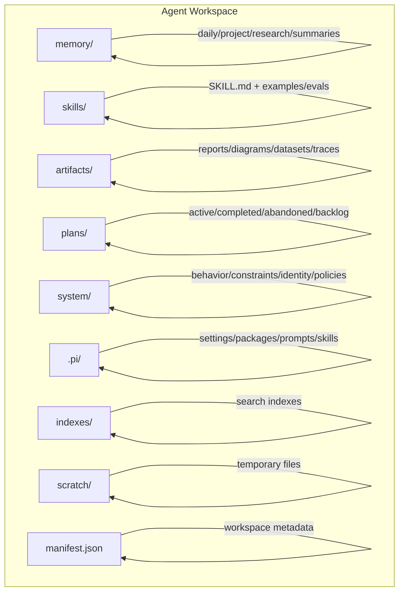
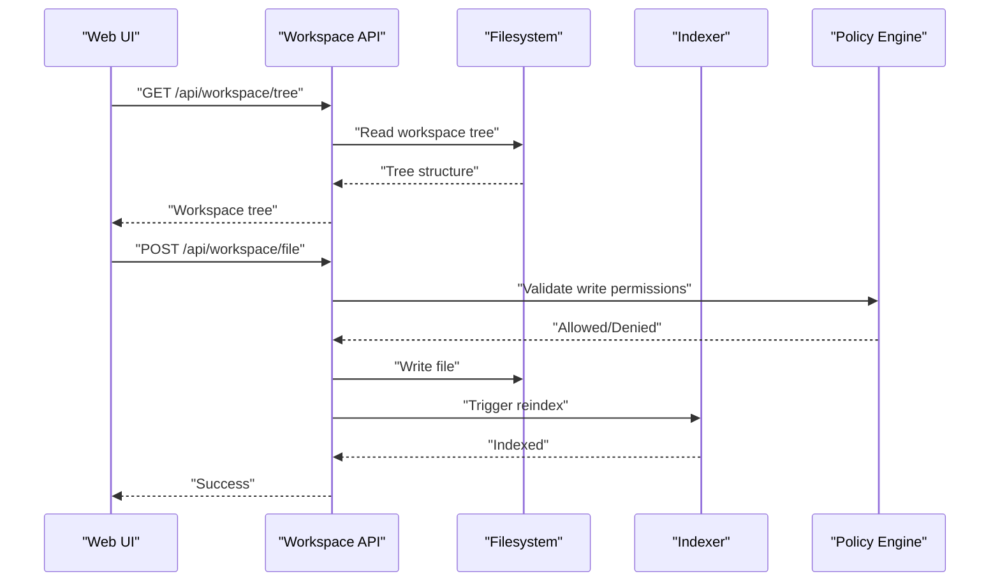
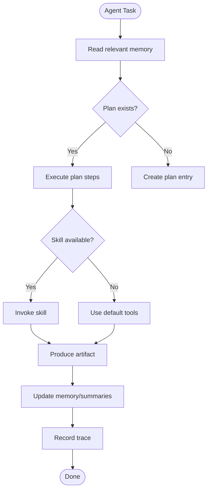
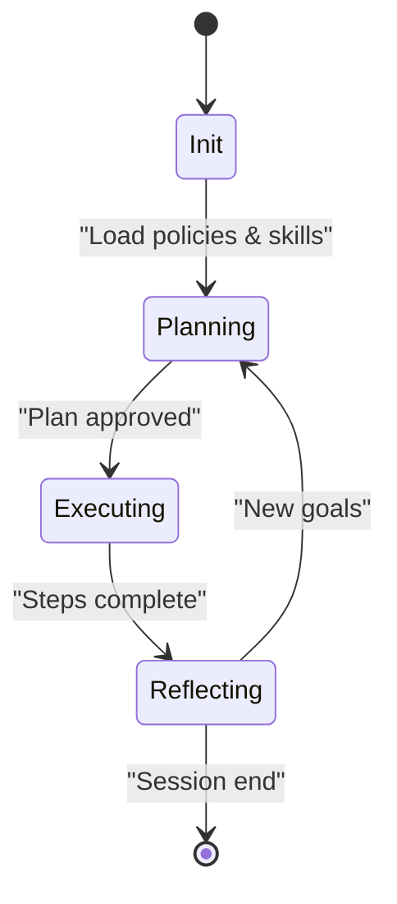
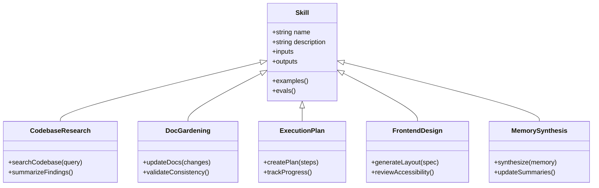
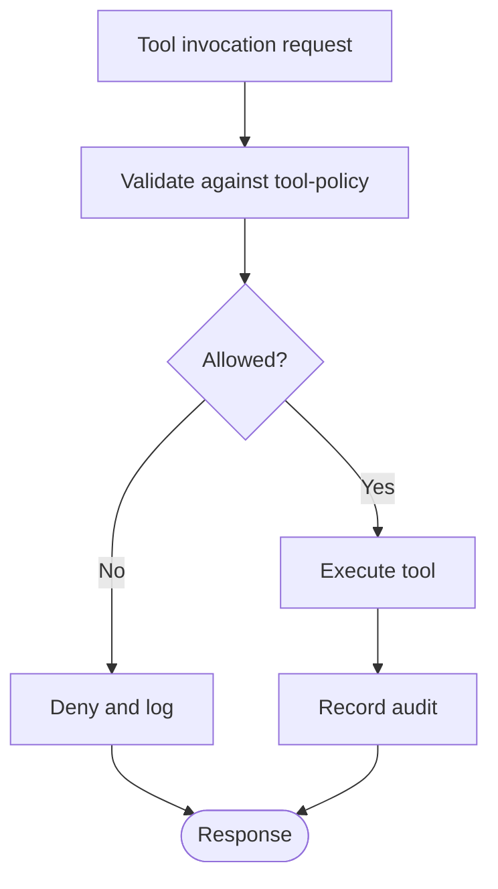
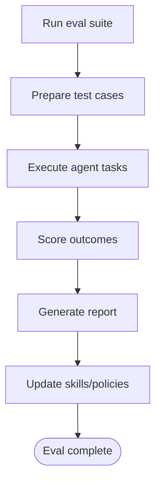
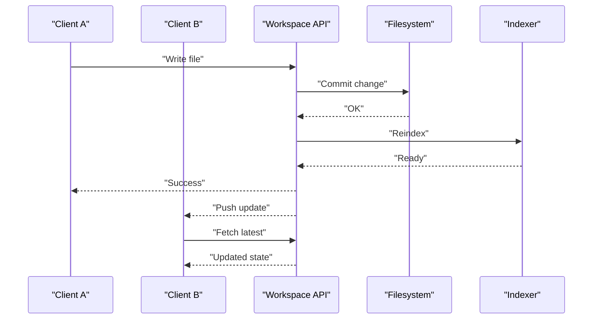
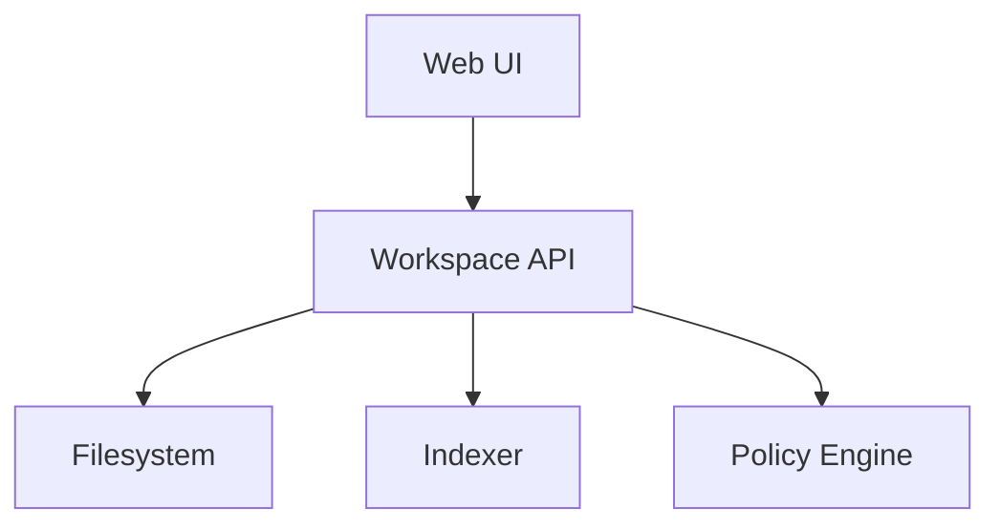

# Agent Workspace Design

<cite>
**Referenced Files in This Document**
- [agent-workspace/README.md](file://agent-workspace/README.md)
- [agent-workspace/ARCHITECTURE.md](file://agent-workspace/ARCHITECTURE.md)
- [agent-workspace/manifest.json](file://agent-workspace/manifest.json)
- [agent-workspace/system/behavior.md](file://agent-workspace/system/behavior.md)
- [agent-workspace/system/constraints.md](file://agent-workspace/system/constraints.md)
- [agent-workspace/system/tool-policy.md](file://agent-workspace/system/tool-policy.md)
- [agent-workspace/system/workspace-policy.md](file://agent-workspace/system/workspace-policy.md)
- [agent-workspace/skills/codebase-research/SKILL.md](file://agent-workspace/skills/codebase-research/SKILL.md)
- [agent-workspace/skills/doc-gardening/SKILL.md](file://agent-workspace/skills/doc-gardening/SKILL.md)
- [agent-workspace/skills/execution-plan/SKILL.md](file://agent-workspace/skills/execution-plan/SKILL.md)
- [agent-workspace/skills/frontend-design/SKILL.md](file://agent-workspace/skills/frontend-design/SKILL.md)
- [agent-workspace/skills/memory-synthesis/SKILL.md](file://agent-workspace/skills/memory-synthesis/SKILL.md)
- [agent-workspace/evals/agentic-coding.md](file://agent-workspace/evals/agentic-coding.md)
- [agent-workspace/evals/memory-quality.md](file://agent-workspace/evals/memory-quality.md)
- [agent-workspace/evals/memory-recall.md](file://agent-workspace/evals/memory-recall.md)
- [agent-workspace/evals/regression-checks.md](file://agent-workspace/evals/regression-checks.md)
- [agent-workspace/evals/tool-use.md](file://agent-workspace/evals/tool-use.md)
- [agent-workspace/memory/daily/](file://agent-workspace/memory/daily/)
- [agent-workspace/memory/project/architecture.md](file://agent-workspace/memory/project/architecture.md)
- [agent-workspace/memory/project/decisions.md](file://agent-workspace/memory/project/decisions.md)
- [agent-workspace/memory/project/known-issues.md](file://agent-workspace/memory/project/known-issues.md)
- [agent-workspace/memory/project/open-questions.md](file://agent-workspace/memory/project/open-questions.md)
- [agent-workspace/memory/project/preferences.md](file://agent-workspace/memory/project/preferences.md)
- [agent-workspace/memory/research/index.md](file://agent-workspace/memory/research/index.md)
- [agent-workspace/artifacts/reports/architecture-review-2026-05-12.md](file://agent-workspace/artifacts/reports/architecture-review-2026-05-12.md)
- [agent-workspace/artifacts/reports/codebase-map-2026-05-15.md](file://agent-workspace/artifacts/reports/codebase-map-2026-05-15.md)
- [agent-workspace/artifacts/diagrams/codebase-node-graph.openui](file://agent-workspace/artifacts/diagrams/codebase-node-graph.openui)
- [agent-workspace/plans/backlog.md](file://agent-workspace/plans/backlog.md)
- [agent-workspace/plans/active/upgrade-pi-0.80.10.md](file://agent-workspace/plans/active/upgrade-pi-0.80.10.md)
- [agent-workspace/plans/completed/install-pi-web-access.md](file://agent-workspace/plans/completed/install-pi-web-access.md)
- [agent-workspace/plans/completed/memory-recall-improvement.md](file://agent-workspace/plans/completed/memory-recall-improvement.md)
- [agent-workspace/.pi/settings.json](file://agent-workspace/.pi/settings.json)
- [apps/web/src/lib/workspace/](file://apps/web/src/lib/workspace/)
- [apps/web/src/routes/api/workspace/file.ts](file://apps/web/src/routes/api/workspace/file.ts)
- [apps/web/src/routes/api/workspace/item.ts](file://apps/web/src/routes/api/workspace/item.ts)
- [apps/web/src/routes/api/workspace/items.ts](file://apps/web/src/routes/api/workspace/items.ts)
- [apps/web/src/routes/api/workspace/tree.ts](file://apps/web/src/routes/api/workspace/tree.ts)
- [apps/web/src/routes/api/workspace/search.ts](file://apps/web/src/routes/api/workspace/search.ts)
- [apps/web/src/routes/api/workspace/reindex.ts](file://apps/web/src/routes/api/workspace/reindex.ts)
- [apps/web/src/routes/api/workspace/health.ts](file://apps/web/src/routes/api/workspace/health.ts)
- [docs/adaptive-workspace.md](file://docs/adaptive-workspace.md)
- [docs/agent-workspace.md](file://docs/agent-workspace.md)
- [docs/wiki/features/agent-workspace.md](file://docs/wiki/features/agent-workspace.md)
- [docs/adr/0001-agent-workspace-as-canonical-adaptive-state.md](file://docs/adr/0001-agent-workspace-as-canonical-adaptive-state.md)
</cite>

## Table of Contents

1. Introduction
2. Project Structure
3. Core Components
4. Architecture Overview
5. Detailed Component Analysis
6. Dependency Analysis
7. Performance Considerations
8. Troubleshooting Guide
9. Conclusion

## Introduction

This document explains the Agent Workspace design that enables AI agents to interact with codebases, manage memory, and execute tasks autonomously. It covers the adaptive workspace pattern, workspace structure (memory directories, skills registry, artifact storage), agent lifecycle, behavior constraints, tool policy enforcement, skill system architecture, custom skill development and integration, evaluation framework, real-time synchronization mechanisms, conflict resolution strategies, and data consistency across concurrent sessions.

## Project Structure

The Agent Workspace is a persistent, structured directory tree that serves as the canonical state for an agent’s knowledge, plans, artifacts, and capabilities. Key areas include:

- Memory: daily logs, project context, research notes, and summaries
- Skills: declarative skill definitions and examples
- Artifacts: reports, diagrams, datasets, and traces
- Plans: active, completed, abandoned, and backlog items
- System policies: behavior, constraints, identity, tool and workspace policies
- Configuration: per-workspace settings and package manifests

**Diagram sources**

- [agent-workspace/README.md](file://agent-workspace/README.md)
- [agent-workspace/ARCHITECTURE.md](file://agent-workspace/ARCHITECTURE.md)
- [agent-workspace/manifest.json](file://agent-workspace/manifest.json)

**Section sources**

- [agent-workspace/README.md](file://agent-workspace/README.md)
- [agent-workspace/ARCHITECTURE.md](file://agent-workspace/ARCHITECTURE.md)
- [agent-workspace/manifest.json](file://agent-workspace/manifest.json)

## Core Components

- Adaptive Workspace Pattern: The workspace is the single source of truth for agent state, enabling persistence, recall, and evolution over time.
- Memory System: Organized by time and scope (daily, project, research, summaries) to support recall and synthesis.
- Skills Registry: Declarative SKILL.md entries define capabilities, inputs, outputs, and examples; evaluated via evals.
- Artifact Storage: Reports, diagrams, datasets, and traces are stored under artifacts for traceability and reuse.
- Planning and Backlog: Active plans drive execution; completed and abandoned plans provide audit trails.
- System Policies: Behavior, constraints, identity, tool policy, and workspace policy govern agent actions and safety.

**Section sources**

- [docs/adaptive-workspace.md](file://docs/adaptive-workspace.md)
- [docs/agent-workspace.md](file://docs/agent-workspace.md)
- [docs/wiki/features/agent-workspace.md](file://docs/wiki/features/agent-workspace.md)
- [docs/adr/0001-agent-workspace-as-canonical-adaptive-state.md](file://docs/adr/0001-agent-workspace-as-canonical-adaptive-state.md)

## Architecture Overview

The Agent Workspace integrates with the web application through workspace APIs. Agents read/write to the workspace via these endpoints, which enforce policies and maintain consistency. Real-time synchronization ensures multiple sessions see consistent state.

**Diagram sources**

- [apps/web/src/routes/api/workspace/tree.ts](file://apps/web/src/routes/api/workspace/tree.ts)
- [apps/web/src/routes/api/workspace/file.ts](file://apps/web/src/routes/api/workspace/file.ts)
- [apps/web/src/routes/api/workspace/reindex.ts](file://apps/web/src/routes/api/workspace/reindex.ts)
- [agent-workspace/system/tool-policy.md](file://agent-workspace/system/tool-policy.md)

**Section sources**

- [apps/web/src/routes/api/workspace/file.ts](file://apps/web/src/routes/api/workspace/file.ts)
- [apps/web/src/routes/api/workspace/item.ts](file://apps/web/src/routes/api/workspace/item.ts)
- [apps/web/src/routes/api/workspace/items.ts](file://apps/web/src/routes/api/workspace/items.ts)
- [apps/web/src/routes/api/workspace/tree.ts](file://apps/web/src/routes/api/workspace/tree.ts)
- [apps/web/src/routes/api/workspace/search.ts](file://apps/web/src/routes/api/workspace/search.ts)
- [apps/web/src/routes/api/workspace/reindex.ts](file://apps/web/src/routes/api/workspace/reindex.ts)
- [apps/web/src/routes/api/workspace/health.ts](file://apps/web/src/routes/api/workspace/health.ts)

## Detailed Component Analysis

### Workspace Structure and Data Model

- memory/:
  - daily/: Time-based logs and reflections
  - project/: Architecture, decisions, known issues, open questions, preferences
  - research/: External docs and index
  - summaries/: Synthesized insights
- artifacts/:
  - reports/: Markdown reports and audits
  - diagrams/: Visual models and graphs
  - datasets/: Structured data used by agents
  - traces/: Execution traces for debugging
- plans/:
  - active/, completed/, abandoned/, backlog.md
- system/:
  - behavior.md, constraints.md, identity.md, tool-policy.md, workspace-policy.md
- .pi/:
  - settings.json, packages/, prompts/, skills/
- manifest.json:
  - Workspace metadata and versioning

**Diagram sources**

- [agent-workspace/memory/project/architecture.md](file://agent-workspace/memory/project/architecture.md)
- [agent-workspace/memory/project/decisions.md](file://agent-workspace/memory/project/decisions.md)
- [agent-workspace/memory/project/known-issues.md](file://agent-workspace/memory/project/known-issues.md)
- [agent-workspace/memory/project/open-questions.md](file://agent-workspace/memory/project/open-questions.md)
- [agent-workspace/memory/project/preferences.md](file://agent-workspace/memory/project/preferences.md)
- [agent-workspace/artifacts/reports/architecture-review-2026-05-12.md](file://agent-workspace/artifacts/reports/architecture-review-2026-05-12.md)
- [agent-workspace/artifacts/reports/codebase-map-2026-05-15.md](file://agent://agent-workspace/artifacts/reports/codebase-map-2026-05-15.md)
- [agent-workspace/artifacts/diagrams/codebase-node-graph.openui](file://agent-workspace/artifacts/diagrams/codebase-node-graph.openui)
- [agent-workspace/plans/backlog.md](file://agent-workspace/plans/backlog.md)
- [agent-workspace/plans/active/upgrade-pi-0.80.10.md](file://agent-workspace/plans/active/upgrade-pi-0.80.10.md)
- [agent-workspace/plans/completed/install-pi-web-access.md](file://agent-workspace/plans/completed/install-pi-web-access.md)
- [agent-workspace/plans/completed/memory-recall-improvement.md](file://agent-workspace/plans/completed/memory-recall-improvement.md)

**Section sources**

- [agent-workspace/memory/daily/](file://agent-workspace/memory/daily/)
- [agent-workspace/memory/project/architecture.md](file://agent-workspace/memory/project/architecture.md)
- [agent-workspace/memory/project/decisions.md](file://agent-workspace/memory/project/decisions.md)
- [agent-workspace/memory/project/known-issues.md](file://agent-workspace/memory/project/known-issues.md)
- [agent-workspace/memory/project/open-questions.md](file://agent-workspace/memory/project/open-questions.md)
- [agent-workspace/memory/project/preferences.md](file://agent-workspace/memory/project/preferences.md)
- [agent-workspace/memory/research/index.md](file://agent-workspace/memory/research/index.md)
- [agent-workspace/artifacts/reports/architecture-review-2026-05-12.md](file://agent-workspace/artifacts/reports/architecture-review-2026-05-12.md)
- [agent-workspace/artifacts/reports/codebase-map-2026-05-15.md](file://agent-workspace/artifacts/reports/codebase-map-2026-05-15.md)
- [agent-workspace/artifacts/diagrams/codebase-node-graph.openui](file://agent-workspace/artifacts/diagrams/codebase-node-graph.openui)
- [agent-workspace/plans/backlog.md](file://agent-workspace/plans/backlog.md)
- [agent-workspace/plans/active/upgrade-pi-0.80.10.md](file://agent-workspace/plans/active/upgrade-pi-0.80.10.md)
- [agent-workspace/plans/completed/install-pi-web-access.md](file://agent-workspace/plans/completed/install-pi-web-access.md)
- [agent-workspace/plans/completed/memory-recall-improvement.md](file://agent://agent-workspace/plans/completed/memory-recall-improvement.md)

### Agent Lifecycle and Behavior Constraints

- Lifecycle stages:
  - Initialization: Load manifest, policies, and skills
  - Planning: Create or update plans based on goals
  - Execution: Invoke skills/tools, produce artifacts, update memory
  - Reflection: Summarize outcomes, record traces, improve future behavior
- Behavior constraints:
  - Identity and role boundaries
  - Allowed operations and tool usage
  - Safety constraints and guardrails
  - Workspace policy compliance

**Diagram sources**

- [agent-workspace/system/behavior.md](file://agent-workspace/system/behavior.md)
- [agent-workspace/system/constraints.md](file://agent-workspace/system/constraints.md)
- [agent-workspace/system/tool-policy.md](file://agent-workspace/system/tool-policy.md)
- [agent-workspace/system/workspace-policy.md](file://agent-workspace/system/workspace-policy.md)

**Section sources**

- [agent-workspace/system/behavior.md](file://agent-workspace/system/behavior.md)
- [agent-workspace/system/constraints.md](file://agent-workspace/system/constraints.md)
- [agent-workspace/system/tool-policy.md](file://agent-workspace/system/tool-policy.md)
- [agent-workspace/system/workspace-policy.md](file://agent-workspace/system/workspace-policy.md)

### Skill System Architecture

- Skill definition: Each skill includes a SKILL.md describing purpose, inputs, outputs, and examples.
- Examples and evaluations: Skills may include examples.md and evals.md to validate behavior.
- Integration: Skills are registered under skills/ and can be invoked by agents during execution.
- Custom skills: Developers add new directories under skills/ with SKILL.md and supporting files.

**Diagram sources**

- [agent-workspace/skills/codebase-research/SKILL.md](file://agent-workspace/skills/codebase-research/SKILL.md)
- [agent-workspace/skills/doc-gardening/SKILL.md](file://agent-workspace/skills/doc-gardening/SKILL.md)
- [agent-workspace/skills/execution-plan/SKILL.md](file://agent-workspace/skills/execution-plan/SKILL.md)
- [agent-workspace/skills/frontend-design/SKILL.md](file://agent-workspace/skills/frontend-design/SKILL.md)
- [agent-workspace/skills/memory-synthesis/SKILL.md](file://agent-workspace/skills/memory-synthesis/SKILL.md)

**Section sources**

- [agent-workspace/skills/codebase-research/SKILL.md](file://agent-workspace/skills/codebase-research/SKILL.md)
- [agent-workspace/skills/doc-gardening/SKILL.md](file://agent-workspace/skills/doc-gardening/SKILL.md)
- [agent-workspace/skills/execution-plan/SKILL.md](file://agent-workspace/skills/execution-plan/SKILL.md)
- [agent-workspace/skills/frontend-design/SKILL.md](file://agent-workspace/skills/frontend-design/SKILL.md)
- [agent-workspace/skills/memory-synthesis/SKILL.md](file://agent-workspace/skills/memory-synthesis/SKILL.md)

### Tool Policy Enforcement

- Tool policy defines allowed tools, scopes, and constraints.
- Enforced at API layer before filesystem writes.
- Violations result in denied responses and audit logs.

**Diagram sources**

- [agent-workspace/system/tool-policy.md](file://agent-workspace/system/tool-policy.md)
- [apps/web/src/routes/api/workspace/file.ts](file://apps/web/src/routes/api/workspace/file.ts)

**Section sources**

- [agent-workspace/system/tool-policy.md](file://agent-workspace/system/tool-policy.md)
- [apps/web/src/routes/api/workspace/file.ts](file://apps/web/src/routes/api/workspace/file.ts)

### Evaluation Framework

- Evals cover agentic coding, memory quality, memory recall, regression checks, and tool use.
- Each eval defines scenarios, expected outcomes, and scoring criteria.
- Results inform skill improvements and policy updates.

**Diagram sources**

- [agent-workspace/evals/agentic-coding.md](file://agent-workspace/evals/agentic-coding.md)
- [agent-workspace/evals/memory-quality.md](file://agent-workspace/evals/memory-quality.md)
- [agent-workspace/evals/memory-recall.md](file://agent-workspace/evals/memory-recall.md)
- [agent-workspace/evals/regression-checks.md](file://agent-workspace/evals/regression-checks.md)
- [agent-workspace/evals/tool-use.md](file://agent-workspace/evals/tool-use.md)

**Section sources**

- [agent-workspace/evals/agentic-coding.md](file://agent-workspace/evals/agentic-coding.md)
- [agent-workspace/evals/memory-quality.md](file://agent-workspace/evals/memory-quality.md)
- [agent-workspace/evals/memory-recall.md](file://agent-workspace/evals/memory-recall.md)
- [agent-workspace/evals/regression-checks.md](file://agent-workspace/evals/regression-checks.md)
- [agent-workspace/evals/tool-use.md](file://agent-workspace/evals/tool-use.md)

### Real-Time Synchronization and Conflict Resolution

- Real-time sync: Workspace changes trigger indexing and notifications to connected clients.
- Conflict resolution: Last-write-wins with merge hints; critical sections protected by locks.
- Consistency: Indexes updated atomically; health endpoint monitors status.

**Diagram sources**

- [apps/web/src/routes/api/workspace/file.ts](file://apps/web/src/routes/api/workspace/file.ts)
- [apps/web/src/routes/api/workspace/reindex.ts](file://apps/web/src/routes/api/workspace/reindex.ts)
- [apps/web/src/routes/api/workspace/health.ts](file://apps/web/src/routes/api/workspace/health.ts)

**Section sources**

- [apps/web/src/routes/api/workspace/file.ts](file://apps/web/src/routes/api/workspace/file.ts)
- [apps/web/src/routes/api/workspace/reindex.ts](file://apps/web/src/routes/api/workspace/reindex.ts)
- [apps/web/src/routes/api/workspace/health.ts](file://apps/web/src/routes/api/workspace/health.ts)

## Dependency Analysis

The workspace depends on:

- Filesystem for persistence
- Indexer for search and retrieval
- Policy engine for safety and compliance
- Web API for client interactions

**Diagram sources**

- [apps/web/src/routes/api/workspace/file.ts](file://apps/web/src/routes/api/workspace/file.ts)
- [apps/web/src/routes/api/workspace/tree.ts](file://apps/web/src/routes/api/workspace/tree.ts)
- [apps/web/src/routes/api/workspace/search.ts](file://apps/web/src/routes/api/workspace/search.ts)
- [apps/web/src/routes/api/workspace/reindex.ts](file://apps/web/src/routes/api/workspace/reindex.ts)
- [apps/web/src/routes/api/workspace/health.ts](file://apps/web/src/routes/api/workspace/health.ts)

**Section sources**

- [apps/web/src/routes/api/workspace/file.ts](file://apps/web/src/routes/api/workspace/file.ts)
- [apps/web/src/routes/api/workspace/tree.ts](file://apps/web/src/routes/api/workspace/tree.ts)
- [apps/web/src/routes/api/workspace/search.ts](file://apps/web/src/routes/api/workspace/search.ts)
- [apps/web/src/routes/api/workspace/reindex.ts](file://apps/web/src/routes/api/workspace/reindex.ts)
- [apps/web/src/routes/api/workspace/health.ts](file://apps/web/src/routes/api/workspace/health.ts)

## Performance Considerations

- Indexing latency: Batch updates and incremental reindexing reduce overhead.
- Memory access patterns: Cache frequently accessed memory segments.
- Concurrency: Use locks for critical sections to avoid race conditions.
- Artifact size: Compress large artifacts and prune old traces.

[No sources needed since this section provides general guidance]

## Troubleshooting Guide

- Health checks: Use the health endpoint to verify workspace status.
- Reindexing: Trigger reindex when inconsistencies are detected.
- Policy violations: Review tool-policy logs to diagnose denials.
- Sync issues: Check reindex status and client connections.

**Section sources**

- [apps/web/src/routes/api/workspace/health.ts](file://apps/web/src/routes/api/workspace/health.ts)
- [apps/web/src/routes/api/workspace/reindex.ts](file://apps/web/src/routes/api/workspace/reindex.ts)
- [agent-workspace/system/tool-policy.md](file://agent-workspace/system/tool-policy.md)

## Conclusion

The Agent Workspace provides a robust, adaptive foundation for AI agents to operate within codebases. Its structured memory, skills registry, artifact storage, and policy-driven execution enable safe, autonomous task completion. Real-time synchronization and evaluation frameworks ensure consistency and continuous improvement.

[No sources needed since this section summarizes without analyzing specific files]
