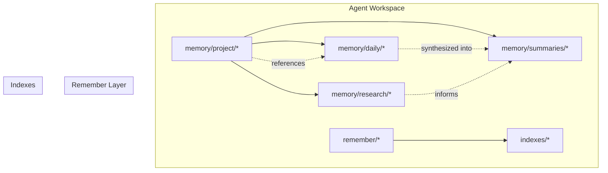
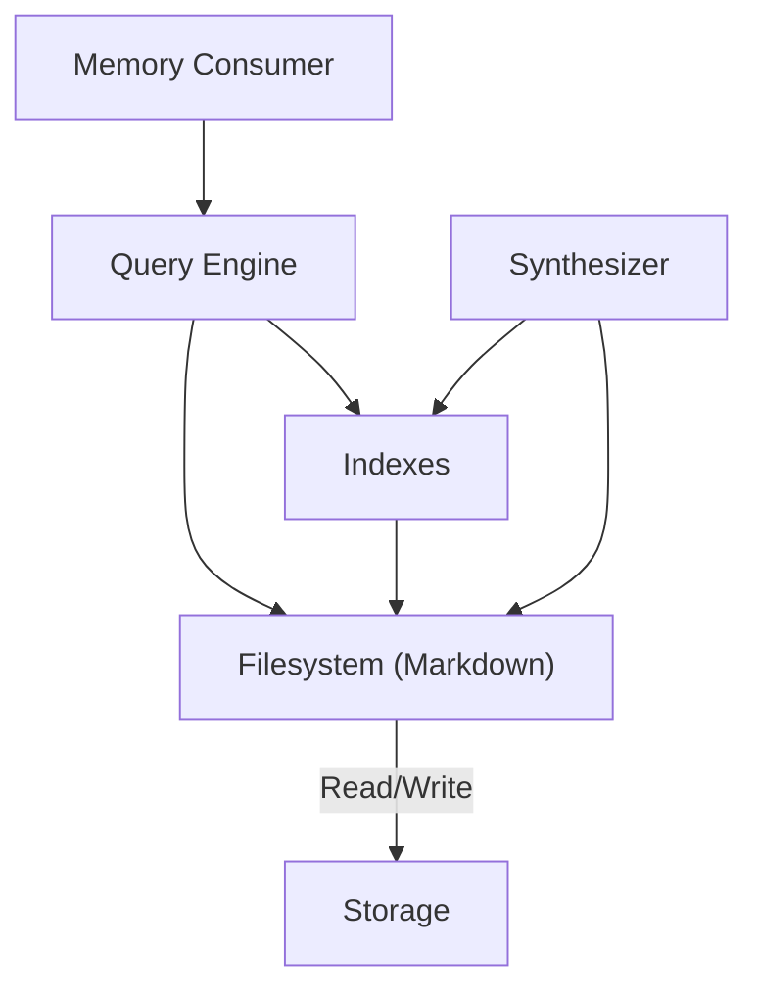
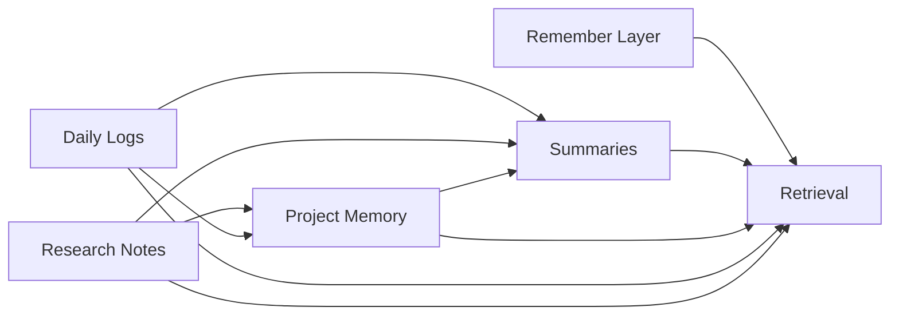

# Memory System

<cite>
**Referenced Files in This Document**
- [memory-recall-scenario-spec.md](file://agent-workspace/artifacts/reports/memory-recall-scenario-spec.md)
- [memory-quality.md](file://agent-workspace/evals/memory-quality.md)
- [memory-recall.md](file://agent-workspace/evals/memory-recall.md)
- [index.md](file://agent-workspace/memory/research/index.md)
- [daytona-docs.md](file://agent-workspace/memory/research/daytona-docs.md)
- [architecture.md](file://agent-workspace/memory/project/architecture.md)
- [decisions.md](file://agent-workspace/memory/project/decisions.md)
- [known-issues.md](file://agent-workspace/memory/project/known-issues.md)
- [open-questions.md](file://agent-workspace/memory/project/open-questions.md)
- [preferences.md](file://agent-workspace/memory/project/preferences.md)
- [recent.md](file://remember/recent.md)
- [now.md](file://remember/now.md)
- [archive.md](file://remember/archive.md)
- [today-2026-05-20.done.md](file://remember/today-2026-05-20.done.md)
</cite>

## Table of Contents

1. [Introduction](#introduction)
2. [Project Structure](#project-structure)
3. [Core Components](#core-components)
4. [Architecture Overview](#architecture-overview)
5. [Detailed Component Analysis](#detailed-component-analysis)
6. [Dependency Analysis](#dependency-analysis)
7. [Performance Considerations](#performance-considerations)
8. [Troubleshooting Guide](#troubleshooting-guide)
9. [Conclusion](#conclusion)
10. [Appendices](#appendices)

## Introduction

This document explains the memory system sub-component that organizes and persists knowledge across sessions. It covers the hierarchical memory architecture (project memory, daily logs, summaries, research notes), storage formats, indexing strategies, retrieval mechanisms, lifecycle management, synchronization across sessions, conflict resolution, consistency guarantees, API interfaces, query capabilities, and search functionality. The goal is to make the system accessible to beginners while providing sufficient technical depth for experienced developers implementing custom memory handlers.

## Project Structure

The memory system is organized into distinct directories and files that reflect different scopes and lifetimes:

- Project memory: long-lived, shared context about the project’s architecture, decisions, known issues, open questions, and preferences.
- Daily logs: time-based entries capturing what happened on a given day, including completion markers.
- Summaries: synthesized overviews derived from daily logs or other sources.
- Research notes: focused documents for specific topics or external references.
- Remember layer: lightweight, session-aware state such as “now,” “recent,” and “archive.”

**Diagram sources**

- [architecture.md](file://agent-workspace/memory/project/architecture.md)
- [decisions.md](file://agent-workspace/memory/project/decisions.md)
- [known-issues.md](file://agent-workspace/memory/project/known-issues.md)
- [open-questions.md](file://agent-workspace/memory/project/open-questions.md)
- [preferences.md](file://agent-workspace/memory/project/preferences.md)
- [index.md](file://agent-workspace/memory/research/index.md)
- [daytona-docs.md](file://agent-workspace/memory/research/daytona-docs.md)
- [recent.md](file://remember/recent.md)
- [now.md](file://remember/now.md)
- [archive.md](file://remember/archive.md)
- [today-2026-05-20.done.md](file://remember/today-2026-05-20.done.md)

**Section sources**

- [architecture.md](file://agent-workspace/memory/project/architecture.md)
- [decisions.md](file://agent-workspace/memory/project/decisions.md)
- [known-issues.md](file://agent-workspace/memory/project/known-issues.md)
- [open-questions.md](file://agent-workspace/memory/project/open-questions.md)
- [preferences.md](file://agent-workspace/memory/project/preferences.md)
- [index.md](file://agent-workspace/memory/research/index.md)
- [daytona-docs.md](file://agent-workspace/memory/research/daytona-docs.md)
- [recent.md](file://remember/recent.md)
- [now.md](file://remember/now.md)
- [archive.md](file://remember/archive.md)
- [today-2026-05-20.done.md](file://remember/today-2026-05-20.done.md)

## Core Components

- Project memory: persistent knowledge about the project scope, architecture, decisions, known issues, open questions, and user preferences. These files are stable and referenced by other memory layers.
- Daily logs: chronological records of activities and outcomes per day, often with completion markers. They feed summaries and inform project memory updates.
- Summaries: concise overviews distilled from daily logs or research notes to provide quick context.
- Research notes: focused documents for investigations, external documentation, or topic-specific knowledge.
- Remember layer: ephemeral or short-lived state like current focus (“now”), recent items, and archived entries.

Key responsibilities:

- Creation: new entries are authored in appropriate directories based on type and scope.
- Updates: incremental edits maintain versioned history within files; summaries may be regenerated periodically.
- Deletion: archival moves content out of active views while preserving history.

Lifecycle management:

- Project memory has a long lifecycle and is updated via deliberate change processes.
- Daily logs have a daily lifecycle and are later summarized or archived.
- Summaries have a rolling lifecycle tied to synthesis triggers.
- Research notes have a topic-driven lifecycle.
- Remember entries are transient and refreshed per session.

**Section sources**

- [architecture.md](file://agent-workspace/memory/project/architecture.md)
- [decisions.md](file://agent-workspace/memory/project/decisions.md)
- [known-issues.md](file://agent-workspace/memory/project/known-issues.md)
- [open-questions.md](file://agent-workspace/memory/project/open-questions.md)
- [preferences.md](file://agent-workspace/memory/project/preferences.md)
- [index.md](file://agent-workspace/memory/research/index.md)
- [daytona-docs.md](file://agent-workspace/memory/research/daytona-docs.md)
- [recent.md](file://remember/recent.md)
- [now.md](file://remember/now.md)
- [archive.md](file://remember/archive.md)
- [today-2026-05-20.done.md](file://remember/today-2026-05-20.done.md)

## Architecture Overview

The memory system follows a layered architecture:

- Storage layer: Markdown files under memory/* and remember/* represent structured text artifacts.
- Indexing layer: indexes/* hold auxiliary structures to accelerate retrieval and search.
- Retrieval layer: queries and searches operate over both raw files and indexes.
- Synthesis layer: summaries are generated from daily logs and research notes.

**Diagram sources**

- [memory-recall-scenario-spec.md](file://agent-workspace/artifacts/reports/memory-recall-scenario-spec.md)
- [memory-quality.md](file://agent-workspace/evals/memory-quality.md)
- [memory-recall.md](file://agent-workspace/evals/memory-recall.md)

**Section sources**

- [memory-recall-scenario-spec.md](file://agent-workspace/artifacts/reports/memory-recall-scenario-spec.md)
- [memory-quality.md](file://agent-workspace/evals/memory-quality.md)
- [memory-recall.md](file://agent-workspace/evals/memory-recall.md)

## Detailed Component Analysis

### Project Memory

Project memory captures enduring knowledge:

- Architecture: structural design and component relationships.
- Decisions: rationale and trade-offs for key choices.
- Known issues: tracked problems and workarounds.
- Open questions: unresolved topics requiring attention.
- Preferences: user or team preferences guiding behavior.

Operations:

- Create: add a new file under memory/project with clear headings and metadata.
- Update: edit existing files to reflect changes; preserve history through version control.
- Delete: remove obsolete content or move to archive when no longer relevant.

Indexing and retrieval:

- Content is searchable via full-text search over Markdown.
- Indexes can include tags, categories, or cross-references for faster lookup.

Consistency and synchronization:

- Changes should be committed consistently across sessions.
- Conflicts resolved by merging edits and updating dependent summaries.

**Section sources**

- [architecture.md](file://agent-workspace/memory/project/architecture.md)
- [decisions.md](file://agent-workspace/memory/project/decisions.md)
- [known-issues.md](file://agent-workspace/memory/project/known-issues.md)
- [open-questions.md](file://agent-workspace/memory/project/open-questions.md)
- [preferences.md](file://agent-workspace/memory/project/preferences.md)

### Daily Logs

Daily logs record chronological events:

- Each day typically has a dedicated file or entry.
- Completion markers indicate finished tasks or milestones.
- Logs feed summaries and inform project memory updates.

Operations:

- Create: start a new daily log entry with date and initial observations.
- Update: append progress, outcomes, and reflections throughout the day.
- Archive: move completed logs to archive after synthesis.

Indexing and retrieval:

- Date-based indexing enables quick access to specific days.
- Search supports filtering by keywords and status markers.

Synchronization:

- Daily logs are appended safely; concurrent writes should be serialized at the filesystem level.

**Section sources**

- [today-2026-05-20.done.md](file://remember/today-2026-05-20.done.md)
- [recent.md](file://remember/recent.md)
- [archive.md](file://remember/archive.md)

### Summaries

Summaries provide condensed insights:

- Generated from daily logs and research notes.
- Offer high-level context for quick orientation.
- Updated periodically or on-demand.

Operations:

- Create: synthesize from recent logs and notes.
- Update: refresh when significant changes occur.
- Delete: replace with newer versions rather than deleting outright.

Indexing and retrieval:

- Summaries are indexed for fast retrieval and linked to source logs.

**Section sources**

- [memory-recall-scenario-spec.md](file://agent-workspace/artifacts/reports/memory-recall-scenario-spec.md)
- [memory-quality.md](file://agent-workspace/evals/memory-quality.md)
- [memory-recall.md](file://agent-workspace/evals/memory-recall.md)

### Research Notes

Research notes capture focused knowledge:

- Topic-specific documents with references and findings.
- Often linked to project memory decisions or open questions.

Operations:

- Create: author a new note with clear scope and references.
- Update: refine findings and integrate insights into project memory.
- Archive: move completed research to archive or merge into summaries.

Indexing and retrieval:

- Indexed by topic tags and cross-references.
- Searchable via full-text and tag filters.

**Section sources**

- [index.md](file://agent-workspace/memory/research/index.md)
- [daytona-docs.md](file://agent-workspace/memory/research/daytona-docs.md)

### Remember Layer

The remember layer holds transient state:

- Now: current focus or active task.
- Recent: recently accessed or created items.
- Archive: historical entries moved out of active view.

Operations:

- Create: update “now” and “recent” as work progresses.
- Update: refresh frequently to reflect current state.
- Delete: move to archive when no longer relevant.

Indexing and retrieval:

- Lightweight indexes support quick reads for UI or agent context.

**Section sources**

- [now.md](file://remember/now.md)
- [recent.md](file://remember/recent.md)
- [archive.md](file://remember/archive.md)

## Dependency Analysis

Memory components depend on each other in a controlled manner:

- Daily logs influence summaries and may trigger project memory updates.
- Research notes inform project memory decisions and open questions.
- Summaries reference project memory and daily logs for context.
- Remember layer provides immediate context but does not alter core memory.

**Diagram sources**

- [architecture.md](file://agent-workspace/memory/project/architecture.md)
- [decisions.md](file://agent-workspace/memory/project/decisions.md)
- [known-issues.md](file://agent-workspace/memory/project/known-issues.md)
- [open-questions.md](file://agent-workspace/memory/project/open-questions.md)
- [preferences.md](file://agent-workspace/memory/project/preferences.md)
- [index.md](file://agent-workspace/memory/research/index.md)
- [daytona-docs.md](file://agent-workspace/memory/research/daytona-docs.md)
- [recent.md](file://remember/recent.md)
- [now.md](file://remember/now.md)
- [archive.md](file://remember/archive.md)
- [today-2026-05-20.done.md](file://remember/today-2026-05-20.done.md)

**Section sources**

- [memory-recall-scenario-spec.md](file://agent-workspace/artifacts/reports/memory-recall-scenario-spec.md)
- [memory-quality.md](file://agent-workspace/evals/memory-quality.md)
- [memory-recall.md](file://agent-workspace/evals/memory-recall.md)

## Performance Considerations

- Use incremental updates to avoid rewriting large files.
- Maintain indexes to reduce full-text scanning overhead.
- Batch operations where possible to minimize I/O.
- Cache frequently accessed summaries and project memory during sessions.
- Limit remember layer size to keep retrieval fast.

[No sources needed since this section provides general guidance]

## Troubleshooting Guide

Common issues and resolutions:

- Stale summaries: regenerate summaries after significant daily log updates.
- Missing cross-references: ensure research notes link to project memory decisions.
- Duplicate entries: deduplicate daily logs before archiving.
- Slow queries: rebuild indexes and verify tag consistency.
- Sync conflicts: adopt atomic writes and merge strategies for concurrent edits.

**Section sources**

- [memory-quality.md](file://agent-workspace/evals/memory-quality.md)
- [memory-recall.md](file://agent-workspace/evals/memory-recall.md)

## Conclusion

The memory system organizes knowledge across hierarchical layers to support consistent, retrievable, and synthesizable information. By adhering to clear creation, update, and deletion practices, maintaining robust indexes, and ensuring synchronization and conflict resolution, the system delivers reliable context for agents and users alike.

[No sources needed since this section summarizes without analyzing specific files]

## Appendices

### Memory API Interfaces

- Create: write new entries to appropriate directories with standardized headers and metadata.
- Read: retrieve entries via direct file access or index-backed queries.
- Update: perform targeted edits to preserve history and avoid full rewrites.
- Delete: move entries to archive or remove if permanently obsolete.

### Query Capabilities and Search

- Full-text search over Markdown content.
- Tag-based filtering for research notes and project memory.
- Date-range queries for daily logs.
- Cross-reference lookups between summaries, project memory, and research notes.

### Data Consistency Guarantees

- Version control ensures history preservation.
- Atomic writes prevent partial updates.
- Index rebuilds maintain query accuracy.
- Conflict resolution merges changes deterministically.

**Section sources**

- [memory-recall-scenario-spec.md](file://agent-workspace/artifacts/reports/memory-recall-scenario-spec.md)
- [memory-quality.md](file://agent-workspace/evals/memory-quality.md)
- [memory-recall.md](file://agent-workspace/evals/memory-recall.md)
