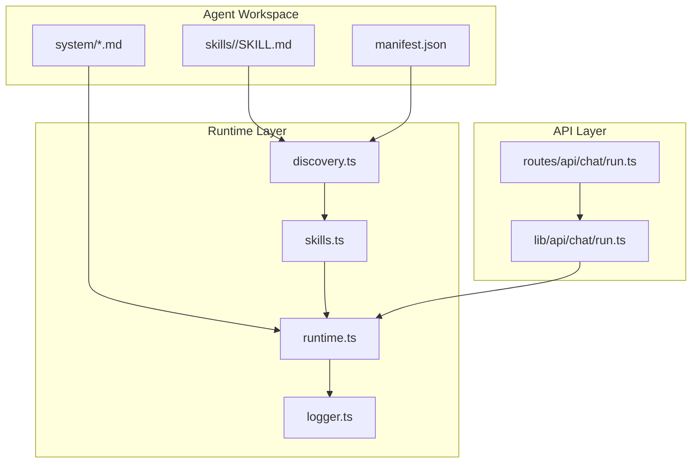
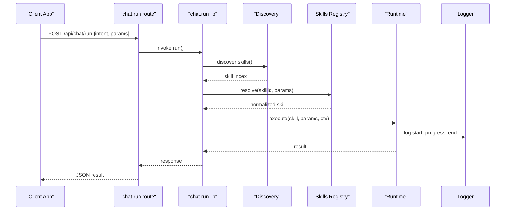
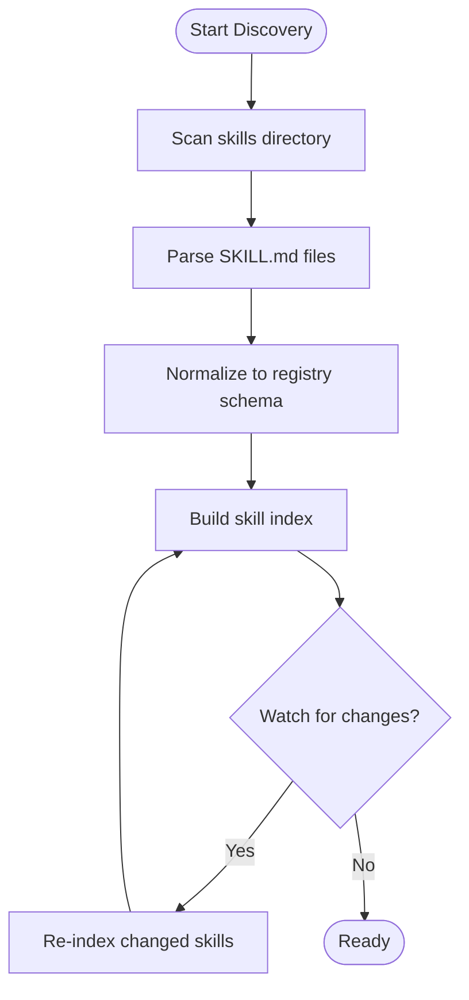
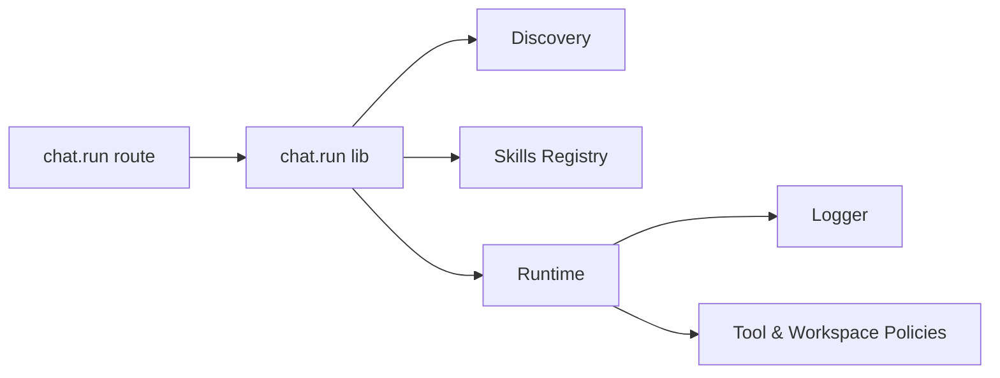

# Skill Framework

<cite>
**Referenced Files in This Document**
- [agent-workspace/skills/codebase-research/SKILL.md](file://agent-workspace/skills/codebase-research/SKILL.md)
- [agent-workspace/skills/doc-gardening/SKILL.md](file://agent-workspace/skills/doc-gardening/SKILL.md)
- [agent-workspace/skills/execution-plan/SKILL.md](file://agent-workspace/skills/execution-plan/SKILL.md)
- [agent-workspace/skills/frontend-design/SKILL.md](file://agent-workspace/skills/frontend-design/SKILL.md)
- [agent-workspace/skills/memory-synthesis/SKILL.md](file://agent-workspace/skills/memory-synthesis/SKILL.md)
- [agent-workspace/manifest.json](file://agent-workspace/manifest.json)
- [agent-workspace/AGENTS.md](file://agent-workspace/AGENTS.md)
- [agent-workspace/system/behavior.md](file://agent-workspace/system/behavior.md)
- [agent-workspace/system/constraints.md](file://agent-workspace/system/constraints.md)
- [agent-workspace/system/tool-policy.md](file://agent-workspace/system/tool-policy.md)
- [agent-workspace/system/workspace-policy.md](file://agent-workspace/system/workspace-policy.md)
- [apps/web/src/lib/pi/index.ts](file://apps/web/src/lib/pi/index.ts)
- [apps/web/src/lib/pi/skills.ts](file://apps/web/src/lib/pi/skills.ts)
- [apps/web/src/lib/pi/discovery.ts](file://apps/web/src/lib/pi/discovery.ts)
- [apps/web/src/lib/pi/runtime.ts](file://apps/web/src/lib/pi/runtime.ts)
- [apps/web/src/lib/pi/evals.ts](file://apps/web/src/lib/pi/evals.ts)
- [apps/web/src/lib/pi/logger.ts](file://apps/web/src/lib/pi/logger.ts)
- [apps/web/src/lib/api/chat/run.ts](file://apps/web/src/lib/api/chat/run.ts)
- [apps/web/src/routes/api/chat/run.ts](file://apps/web/src/routes/api/chat/run.ts)
</cite>

## Table of Contents

1. [Introduction](#introduction)
2. [Project Structure](#project-structure)
3. [Core Components](#core-components)
4. [Architecture Overview](#architecture-overview)
5. [Detailed Component Analysis](#detailed-component-analysis)
6. [Dependency Analysis](#dependency-analysis)
7. [Performance Considerations](#performance-considerations)
8. [Troubleshooting Guide](#troubleshooting-guide)
9. [Conclusion](#conclusion)
10. [Appendices](#appendices)

## Introduction

This document explains the skill framework used by the agent workspace to discover, define, register, and execute skills. It covers the skill manifest format, parameter handling, output processing, built-in skills (codebase research, documentation gardening, execution planning, frontend design, memory synthesis), custom skill development, discovery mechanisms, dependency management, version compatibility, evaluation and testing strategies, performance monitoring, composition patterns, and integration with external tools and APIs.

## Project Structure

Skills are organized under the agent workspace as markdown-based definitions paired with optional artifacts and examples. The workspace manifest centralizes configuration for the runtime and tool policies govern how skills interact with external systems.

**Diagram sources**

- [agent-workspace/skills/codebase-research/SKILL.md](file://agent-workspace/skills/codebase-research/SKILL.md)
- [agent-workspace/manifest.json](file://agent-workspace/manifest.json)
- [agent-workspace/system/behavior.md](file://agent-workspace/system/behavior.md)
- [apps/web/src/lib/pi/discovery.ts](file://apps/web/src/lib/pi/discovery.ts)
- [apps/web/src/lib/pi/skills.ts](file://apps/web/src/lib/pi/skills.ts)
- [apps/web/src/lib/pi/runtime.ts](file://apps/web/src/lib/pi/runtime.ts)
- [apps/web/src/lib/pi/logger.ts](file://apps/web/src/lib/pi/logger.ts)
- [apps/web/src/routes/api/chat/run.ts](file://apps/web/src/routes/api/chat/run.ts)
- [apps/web/src/lib/api/chat/run.ts](file://apps/web/src/lib/api/chat/run.ts)

**Section sources**

- [agent-workspace/manifest.json](file://agent-workspace/manifest.json)
- [agent-workspace/AGENTS.md](file://agent-workspace/AGENTS.md)
- [agent-workspace/system/behavior.md](file://agent-workspace/system/behavior.md)
- [agent-workspace/system/constraints.md](file://agent-workspace/system/constraints.md)
- [agent-workspace/system/tool-policy.md](file://agent-workspace/system/tool-policy.md)
- [agent-workspace/system/workspace-policy.md](file://agent-workspace/system/workspace-policy.md)

## Core Components

- Skill Manifest: Each skill is defined by a SKILL.md file that describes its purpose, parameters, inputs, outputs, and usage notes. The workspace manifest aggregates metadata and configuration for the runtime.
- Discovery: The discovery module scans the skills directory to build an index of available skills and their capabilities.
- Skills Registry: The registry normalizes discovered skills into a consistent interface for invocation.
- Runtime: The runtime orchestrates execution, including validation, context preparation, tool calls, and result aggregation.
- Logging: Centralized logging captures lifecycle events, errors, and metrics for observability.

Key responsibilities:

- Define skill contracts via SKILL.md
- Discover and register skills at startup or on demand
- Validate parameters and enforce constraints
- Execute skills within the agent workspace context
- Capture and normalize outputs for downstream consumers

**Section sources**

- [agent-workspace/skills/codebase-research/SKILL.md](file://agent-workspace/skills/codebase-research/SKILL.md)
- [agent-workspace/skills/doc-gardening/SKILL.md](file://agent-workspace/skills/doc-gardening/SKILL.md)
- [agent-workspace/skills/execution-plan/SKILL.md](file://agent-workspace/skills/execution-plan/SKILL.md)
- [agent-workspace/skills/frontend-design/SKILL.md](file://agent-workspace/skills/frontend-design/SKILL.md)
- [agent-workspace/skills/memory-synthesis/SKILL.md](file://agent-workspace/skills/memory-synthesis/SKILL.md)
- [agent-workspace/manifest.json](file://agent-workspace/manifest.json)
- [apps/web/src/lib/pi/discovery.ts](file://apps/web/src/lib/pi/discovery.ts)
- [apps/web/src/lib/pi/skills.ts](file://apps/web/src/lib/pi/skills.ts)
- [apps/web/src/lib/pi/runtime.ts](file://apps/web/src/lib/pi/runtime.ts)
- [apps/web/src/lib/pi/logger.ts](file://apps/web/src/lib/pi/logger.ts)

## Architecture Overview

The skill framework integrates with the chat API to enable agentic workflows. Requests flow from the UI through API routes into the runtime, which discovers and executes skills based on user intent and policy constraints.

**Diagram sources**

- [apps/web/src/routes/api/chat/run.ts](file://apps/web/src/routes/api/chat/run.ts)
- [apps/web/src/lib/api/chat/run.ts](file://apps/web/src/lib/api/chat/run.ts)
- [apps/web/src/lib/pi/discovery.ts](file://apps/web/src/lib/pi/discovery.ts)
- [apps/web/src/lib/pi/skills.ts](file://apps/web/src/lib/pi/skills.ts)
- [apps/web/src/lib/pi/runtime.ts](file://apps/web/src/lib/pi/runtime.ts)
- [apps/web/src/lib/pi/logger.ts](file://apps/web/src/lib/pi/logger.ts)

## Detailed Component Analysis

### Skill Manifest Format and Parameter Handling

- Purpose and Scope: SKILL.md files describe what a skill does, when to use it, and how to configure it.
- Parameters: Inputs are declared with types and constraints; defaults and required flags guide validation.
- Outputs: Expected outputs are documented to standardize downstream consumption.
- Examples: Usage examples illustrate typical invocations and expected results.

Validation and normalization occur during registration and execution, ensuring type safety and consistent behavior across skills.

**Section sources**

- [agent-workspace/skills/codebase-research/SKILL.md](file://agent-workspace/skills/codebase-research/SKILL.md)
- [agent-workspace/skills/doc-gardening/SKILL.md](file://agent-workspace/skills/doc-gardening/SKILL.md)
- [agent-workspace/skills/execution-plan/SKILL.md](file://agent-workspace/skills/execution-plan/SKILL.md)
- [agent-workspace/skills/frontend-design/SKILL.md](file://agent-workspace/skills/frontend-design/SKILL.md)
- [agent-workspace/skills/memory-synthesis/SKILL.md](file://agent-workspace/skills/memory-synthesis/SKILL.md)

### Built-in Skills

- Codebase Research: Scans repository structure and code to answer questions about architecture, dependencies, and implementation details.
- Documentation Gardening: Maintains and improves project documentation, ensuring accuracy and consistency.
- Execution Planning: Generates step-by-step plans for complex tasks, aligning with workspace policies and constraints.
- Frontend Design: Produces design specifications and component blueprints aligned with project standards.
- Memory Synthesis: Aggregates insights and decisions into structured memory artifacts for long-term retention.

Each skill follows the same manifest contract and is executed through the unified runtime.

**Section sources**

- [agent-workspace/skills/codebase-research/SKILL.md](file://agent-workspace/skills/codebase-research/SKILL.md)
- [agent-workspace/skills/doc-gardening/SKILL.md](file://agent-workspace/skills/doc-gardening/SKILL.md)
- [agent-workspace/skills/execution-plan/SKILL.md](file://agent-workspace/skills/execution-plan/SKILL.md)
- [agent-workspace/skills/frontend-design/SKILL.md](file://agent-workspace/skills/frontend-design/SKILL.md)
- [agent-workspace/skills/memory-synthesis/SKILL.md](file://agent-workspace/skills/memory-synthesis/SKILL.md)

### Custom Skill Development Guide

Steps to create a new skill:

1. Create a folder under agent-workspace/skills/<your-skill>.
2. Add SKILL.md describing purpose, parameters, inputs, outputs, and examples.
3. Ensure parameters match the expected schema enforced by the registry.
4. Test locally using the runtime’s execution path via the chat API.
5. Validate outputs against documented expectations.
6. Integrate with external tools if needed, adhering to tool-policy constraints.

Best practices:

- Keep SKILL.md concise and precise.
- Use explicit parameter types and constraints.
- Provide clear examples and edge cases.
- Follow workspace and system policies for security and reliability.

**Section sources**

- [agent-workspace/system/tool-policy.md](file://agent-workspace/system/tool-policy.md)
- [agent-workspace/system/workspace-policy.md](file://agent-workspace/system/workspace-policy.md)
- [agent-workspace/system/behavior.md](file://agent-workspace/system/behavior.md)
- [agent-workspace/system/constraints.md](file://agent-workspace/system/constraints.md)

### Skill Discovery Mechanisms

Discovery scans the skills directory and builds an index of available skills. It reads manifests and normalizes them into a registry-friendly format. Discovery supports hot reloading and incremental updates when skills change.

**Diagram sources**

- [apps/web/src/lib/pi/discovery.ts](file://apps/web/src/lib/pi/discovery.ts)

**Section sources**

- [apps/web/src/lib/pi/discovery.ts](file://apps/web/src/lib/pi/discovery.ts)

### Dependency Management and Version Compatibility

- Dependencies: Skills may depend on workspace packages or external tools. Dependencies should be declared in SKILL.md where applicable and validated by the runtime.
- Version Compatibility: The runtime enforces minimum versions for core components and checks compatibility with skill manifests.
- Policy Enforcement: Tool-policy and workspace-policy ensure safe interactions with external systems.

Recommendations:

- Pin versions for deterministic behavior.
- Validate compatibility at startup.
- Document breaking changes in SKILL.md.

**Section sources**

- [agent-workspace/manifest.json](file://agent-workspace/manifest.json)
- [agent-workspace/system/tool-policy.md](file://agent-workspace/system/tool-policy.md)
- [agent-workspace/system/workspace-policy.md](file://agent-workspace/system/workspace-policy.md)

### Skill Evaluation Framework and Testing Strategies

- Evaluation: Evals define scenarios and expected outcomes for skills. They can be run against the runtime to validate correctness.
- Testing: Unit tests validate parameter parsing and output normalization. Integration tests exercise full execution paths via the chat API.
- Metrics: Logger captures timing, error rates, and throughput for performance monitoring.

Testing checklist:

- Validate parameter schemas and defaults.
- Assert output structures and content quality.
- Measure latency and resource usage.
- Verify policy compliance.

**Section sources**

- [apps/web/src/lib/pi/evals.ts](file://apps/web/src/lib/pi/evals.ts)
- [apps/web/src/lib/pi/logger.ts](file://apps/web/src/lib/pi/logger.ts)

### Performance Monitoring and Observability

- Logging: Centralized logger records lifecycle events, errors, and metrics.
- Tracing: Request traces link client calls to skill executions and tool invocations.
- Metrics: Collect success rates, durations, and error categories.

Guidelines:

- Log at appropriate levels (info, warn, error).
- Include correlation IDs for traceability.
- Avoid sensitive data in logs.

**Section sources**

- [apps/web/src/lib/pi/logger.ts](file://apps/web/src/lib/pi/logger.ts)

### Skill Composition Patterns and External Integrations

- Composition: Chain multiple skills to achieve complex goals. The runtime supports sequential and conditional flows.
- External Tools: Integrate via tool-policy-compliant interfaces. Validate inputs and handle failures gracefully.
- Error Handling: Implement retries, fallbacks, and clear error messages.

Patterns:

- Pipeline: Sequential steps with intermediate validations.
- Router: Conditional branching based on inputs or context.
- Fan-out: Parallel execution of independent skills with aggregation.

**Section sources**

- [agent-workspace/system/tool-policy.md](file://agent-workspace/system/tool-policy.md)
- [agent-workspace/system/workspace-policy.md](file://agent-workspace/system/workspace-policy.md)

## Dependency Analysis

The runtime layer depends on discovery, registry, and logger modules. API routes delegate to library functions that orchestrate skill execution. Policies and workspace configuration influence behavior.

**Diagram sources**

- [apps/web/src/routes/api/chat/run.ts](file://apps/web/src/routes/api/chat/run.ts)
- [apps/web/src/lib/api/chat/run.ts](file://apps/web/src/lib/api/chat/run.ts)
- [apps/web/src/lib/pi/discovery.ts](file://apps/web/src/lib/pi/discovery.ts)
- [apps/web/src/lib/pi/skills.ts](file://apps/web/src/lib/pi/skills.ts)
- [apps/web/src/lib/pi/runtime.ts](file://apps/web/src/lib/pi/runtime.ts)
- [apps/web/src/lib/pi/logger.ts](file://apps/web/src/lib/pi/logger.ts)
- [agent-workspace/system/tool-policy.md](file://agent-workspace/system/tool-policy.md)
- [agent-workspace/system/workspace-policy.md](file://agent-workspace/system/workspace-policy.md)

**Section sources**

- [apps/web/src/routes/api/chat/run.ts](file://apps/web/src/routes/api/chat/run.ts)
- [apps/web/src/lib/api/chat/run.ts](file://apps/web/src/lib/api/chat/run.ts)
- [apps/web/src/lib/pi/discovery.ts](file://apps/web/src/lib/pi/discovery.ts)
- [apps/web/src/lib/pi/skills.ts](file://apps/web/src/lib/pi/skills.ts)
- [apps/web/src/lib/pi/runtime.ts](file://apps/web/src/lib/pi/runtime.ts)
- [apps/web/src/lib/pi/logger.ts](file://apps/web/src/lib/pi/logger.ts)

## Performance Considerations

- Minimize discovery overhead by caching indexes and re-indexing only changed skills.
- Validate parameters early to fail fast and reduce unnecessary work.
- Batch tool calls where possible to reduce latency.
- Monitor and optimize hot paths with profiling and metrics.
- Enforce timeouts and rate limits for external integrations.

[No sources needed since this section provides general guidance]

## Troubleshooting Guide

Common issues and resolutions:

- Skill not found: Ensure SKILL.md exists and is correctly placed under the skills directory.
- Parameter validation errors: Check SKILL.md schema and input payloads.
- Policy violations: Review tool-policy and workspace-policy configurations.
- Performance regressions: Inspect logs and metrics for bottlenecks.

Debugging steps:

- Enable verbose logging during development.
- Run evals to validate expected behavior.
- Isolate failing skills and test independently.

**Section sources**

- [apps/web/src/lib/pi/logger.ts](file://apps/web/src/lib/pi/logger.ts)
- [apps/web/src/lib/pi/evals.ts](file://apps/web/src/lib/pi/evals.ts)
- [agent-workspace/system/tool-policy.md](file://agent-workspace/system/tool-policy.md)
- [agent-workspace/system/workspace-policy.md](file://agent-workspace/system/workspace-policy.md)

## Conclusion

The skill framework provides a robust, policy-driven mechanism for defining, discovering, and executing skills within the agent workspace. By following manifest conventions, leveraging discovery and runtime services, and adhering to evaluation and monitoring best practices, teams can build reliable, composable skills that integrate seamlessly with external tools and APIs.

[No sources needed since this section summarizes without analyzing specific files]

## Appendices

### Quick Reference: Built-in Skills

- Codebase Research: Repository analysis and insight extraction.
- Documentation Gardening: Maintenance and improvement of docs.
- Execution Planning: Structured task planning aligned with policies.
- Frontend Design: Design specs and component blueprints.
- Memory Synthesis: Consolidation of insights into memory artifacts.

**Section sources**

- [agent-workspace/skills/codebase-research/SKILL.md](file://agent-workspace/skills/codebase-research/SKILL.md)
- [agent-workspace/skills/doc-gardening/SKILL.md](file://agent-workspace/skills/doc-gardening/SKILL.md)
- [agent-workspace/skills/execution-plan/SKILL.md](file://agent-workspace/skills/execution-plan/SKILL.md)
- [agent-workspace/skills/frontend-design/SKILL.md](file://agent-workspace/skills/frontend-design/SKILL.md)
- [agent-workspace/skills/memory-synthesis/SKILL.md](file://agent-workspace/skills/memory-synthesis/SKILL.md)
