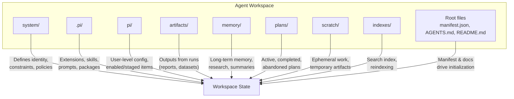
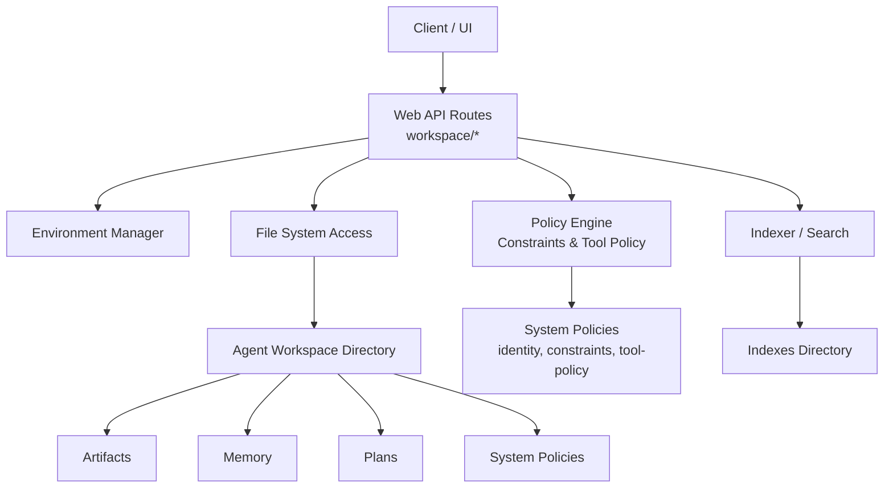
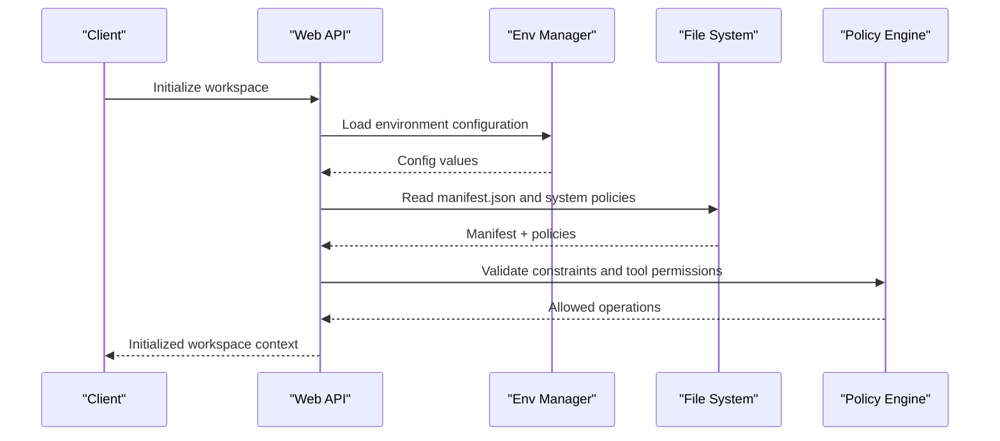
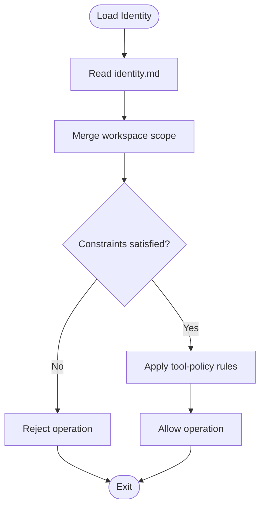
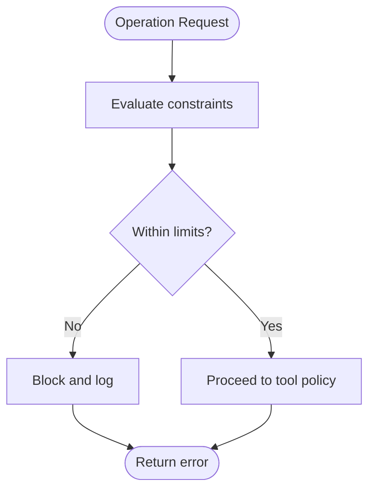
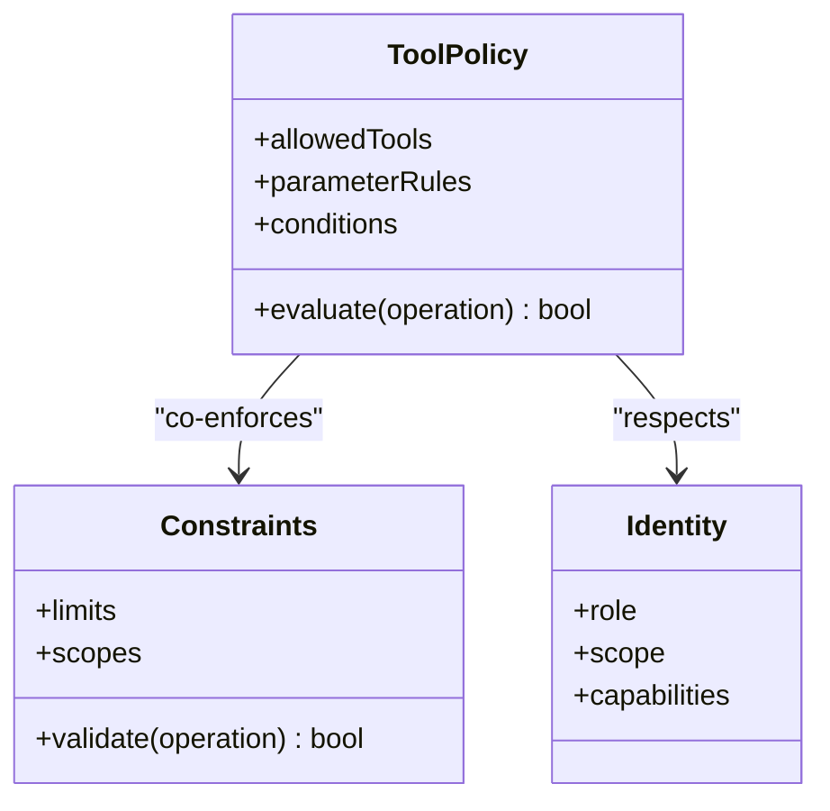
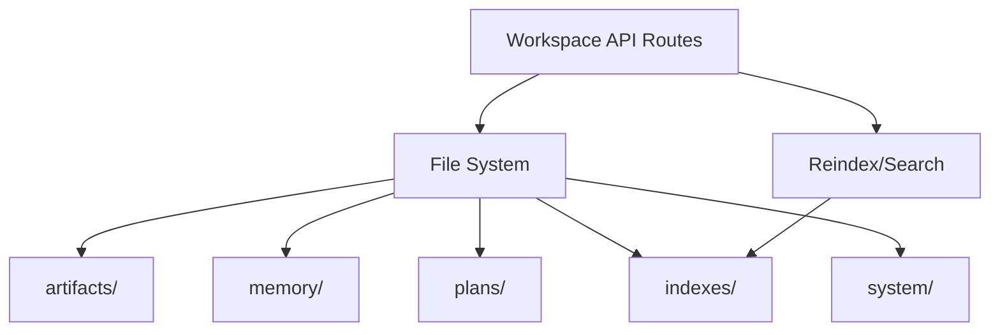
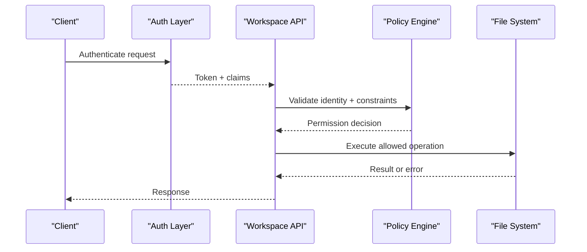
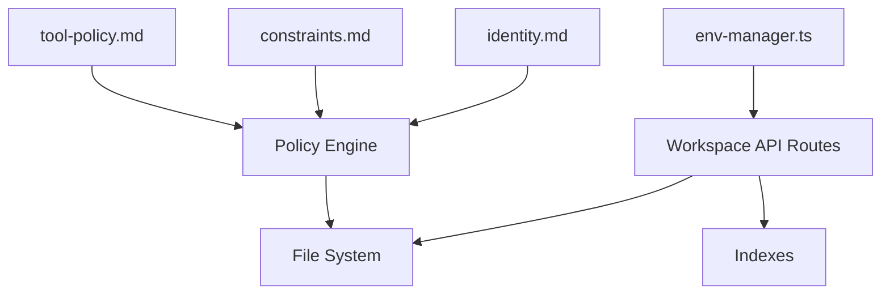

# Workspace Architecture

<cite>
**Referenced Files in This Document**
- [ARCHITECTURE.md](file://agent-workspace/ARCHITECTURE.md)
- [manifest.json](file://agent-workspace/manifest.json)
- [identity.md](file://agent-workspace/system/identity.md)
- [constraints.md](file://agent-workspace/system/constraints.md)
- [tool-policy.md](file://agent-workspace/system/tool-policy.md)
- [workspace-policy.md](file://agent-workspace/system/workspace-policy.md)
- [behavior.md](file://agent-workspace/system/behavior.md)
- [self-improvement-policy.md](file://agent-workspace/system/self-improvement-policy.md)
- [index.md](file://agent-workspace/index.md)
- [AGENTS.md](file://agent-workspace/AGENTS.md)
- [README.md](file://agent-workspace/README.md)
- [architecture.md](file://docs/overview/architecture.md)
- [agent-workspace.md](file://docs/features/agent-workspace.md)
- [0001-agent-workspace-as-canonical-adaptive-state.md](file://docs/adr/0001-agent-workspace-as-canonical-adaptive-state.md)
- [0002-vercel-neon-deployment-trust-zones.md](file://docs/adr/0002-vercel-neon-deployment-trust-zones.md)
- [env-manager.ts](file://apps/web/src/lib/env-manager.ts)
- [workspace/file.ts](file://apps/web/src/routes/api/workspace/file.ts)
- [workspace/item.ts](file://apps/web/src/routes/api/workspace/item.ts)
- [workspace/items.ts](file://apps/web/src/routes/api/workspace/items.ts)
- [workspace/tree.ts](file://apps/web/src/routes/api/workspace/tree.ts)
- [workspace/search.ts](file://apps/web/src/routes/api/workspace/search.ts)
- [workspace/reindex.ts](file://apps/web/src/routes/api/workspace/reindex.ts)
- [workspace/health.ts](file://apps/web/src/routes/api/workspace/health.ts)
</cite>

## Table of Contents

1. [Introduction](#introduction)
2. [Project Structure](#project-structure)
3. [Core Components](#core-components)
4. [Architecture Overview](#architecture-overview)
5. [Detailed Component Analysis](#detailed-component-analysis)
6. [Dependency Analysis](#dependency-analysis)
7. [Performance Considerations](#performance-considerations)
8. [Troubleshooting Guide](#troubleshooting-guide)
9. [Conclusion](#conclusion)
10. [Appendices](#appendices)

## Introduction

This document explains the Agent Workspace architecture, focusing on system design, core patterns, and component interactions. It covers workspace initialization, configuration management, environment setup, agent identity, constraint enforcement, tool policy framework, file system structure, data persistence strategies, security boundaries, isolation mechanisms, and access control patterns. The content synthesizes repository documentation and API routes to provide a comprehensive view for both technical and non-technical readers.

## Project Structure

The Agent Workspace is organized as a persistent, structured directory tree that serves as the canonical state for agents. Key areas include:

- System policies and behavior definitions under system/
- Skills, prompts, packages, and extensions under .pi/ and pi/
- Artifacts (datasets, diagrams, reports, traces) under artifacts/
- Memory and research notes under memory/
- Plans and backlog under plans/
- Scratch space for temporary work under scratch/
- Indexes and search metadata under indexes/
- Root-level manifest and documentation files

**Diagram sources**

- [manifest.json](file://agent-workspace/manifest.json)
- [AGENTS.md](file://agent-workspace/AGENTS.md)
- [README.md](file://agent-workspace/README.md)
- [index.md](file://agent-workspace/index.md)

**Section sources**

- [ARCHITECTURE.md](file://agent-workspace/ARCHITECTURE.md)
- [manifest.json](file://agent-workspace/manifest.json)
- [AGENTS.md](file://agent-workspace/AGENTS.md)
- [README.md](file://agent-workspace/README.md)
- [index.md](file://agent-workspace/index.md)

## Core Components

- Workspace Manifest and Documentation: The manifest and root documents define the workspace identity, capabilities, and entry points for initialization.
- System Policies: Identity, constraints, behavior, tool policy, workspace policy, and self-improvement policy collectively govern agent actions and safety.
- Skills and Prompts: Reusable capabilities and prompt templates are stored under .pi/ and pi/ directories.
- Artifacts and Memory: Outputs and long-term knowledge are persisted under artifacts/ and memory/.
- Plans: Lifecycle-managed plans under plans/ track active and completed work.
- Search and Indexing: indexes/ store search metadata; reindexing endpoints maintain consistency.

Key responsibilities:

- Initialization: Read manifest and system policies to bootstrap agent context.
- Policy Enforcement: Validate operations against constraints and tool policies.
- Data Persistence: Write artifacts, memory, and plan states to disk.
- Searchability: Maintain and update indexes for efficient retrieval.

**Section sources**

- [manifest.json](file://agent-workspace/manifest.json)
- [identity.md](file://agent-workspace/system/identity.md)
- [constraints.md](file://agent-workspace/system/constraints.md)
- [tool-policy.md](file://agent-workspace/system/tool-policy.md)
- [workspace-policy.md](file://agent-workspace/system/workspace-policy.md)
- [behavior.md](file://agent-workspace/system/behavior.md)
- [self-improvement-policy.md](file://agent-workspace/system/self-improvement-policy.md)

## Architecture Overview

The workspace follows a policy-driven, file-system-centric architecture with clear separation between read/write paths and policy enforcement. The web application exposes REST-like routes to interact with the workspace, while the workspace itself persists state as structured files and directories.

**Diagram sources**

- [workspace/file.ts](file://apps/web/src/routes/api/workspace/file.ts)
- [workspace/item.ts](file://apps/web/src/routes/api/workspace/item.ts)
- [workspace/items.ts](file://apps/web/src/routes/api/workspace/items.ts)
- [workspace/tree.ts](file://apps/web/src/routes/api/workspace/tree.ts)
- [workspace/search.ts](file://apps/web/src/routes/api/workspace/search.ts)
- [workspace/reindex.ts](file://apps/web/src/routes/api/workspace/reindex.ts)
- [workspace/health.ts](file://apps/web/src/routes/api/workspace/health.ts)
- [env-manager.ts](file://apps/web/src/lib/env-manager.ts)
- [identity.md](file://agent-workspace/system/identity.md)
- [constraints.md](file://agent-workspace/system/constraints.md)
- [tool-policy.md](file://agent-workspace/system/tool-policy.md)

## Detailed Component Analysis

### Workspace Initialization and Configuration Management

Initialization reads the workspace manifest and system policies to establish agent identity, available skills, and operational constraints. Environment variables are managed via an environment manager to configure runtime settings such as storage paths and feature flags.

**Diagram sources**

- [manifest.json](file://agent-workspace/manifest.json)
- [env-manager.ts](file://apps/web/src/lib/env-manager.ts)
- [identity.md](file://agent-workspace/system/identity.md)
- [constraints.md](file://agent-workspace/system/constraints.md)
- [tool-policy.md](file://agent-workspace/system/tool-policy.md)

**Section sources**

- [manifest.json](file://agent-workspace/manifest.json)
- [env-manager.ts](file://apps/web/src/lib/env-manager.ts)
- [identity.md](file://agent-workspace/system/identity.md)
- [constraints.md](file://agent-workspace/system/constraints.md)
- [tool-policy.md](file://agent-workspace/system/tool-policy.md)

### Agent Identity System

Identity defines who the agent is, its scope, and permitted roles within the workspace. It interacts with constraints and tool policies to ensure actions align with declared identity.

**Diagram sources**

- [identity.md](file://agent-workspace/system/identity.md)
- [constraints.md](file://agent-workspace/system/constraints.md)
- [tool-policy.md](file://agent-workspace/system/tool-policy.md)

**Section sources**

- [identity.md](file://agent-workspace/system/identity.md)
- [constraints.md](file://agent-workspace/system/constraints.md)
- [tool-policy.md](file://agent-workspace/system/tool-policy.md)

### Constraint Enforcement Mechanisms

Constraints enforce limits on operations, resource usage, and allowed behaviors. They act as a gate before tool execution and write operations.

**Diagram sources**

- [constraints.md](file://agent-workspace/system/constraints.md)

**Section sources**

- [constraints.md](file://agent-workspace/system/constraints.md)

### Tool Policy Framework

Tool policy enumerates allowed tools, parameters, and conditions. It complements constraints by specifying fine-grained permissions for tool invocation.

**Diagram sources**

- [tool-policy.md](file://agent-workspace/system/tool-policy.md)
- [constraints.md](file://agent-workspace/system/constraints.md)
- [identity.md](file://agent-workspace/system/identity.md)

**Section sources**

- [tool-policy.md](file://agent-workspace/system/tool-policy.md)
- [constraints.md](file://agent-workspace/system/constraints.md)
- [identity.md](file://agent-workspace/system/identity.md)

### File System Structure and Data Persistence

The workspace persists state as files and directories. Artifacts, memory, plans, and indexes are organized for clarity and discoverability. Writes are mediated through API routes that enforce policies and maintain index consistency.

**Diagram sources**

- [workspace/file.ts](file://apps/web/src/routes/api/workspace/file.ts)
- [workspace/item.ts](file://apps/web/src/routes/api/workspace/item.ts)
- [workspace/items.ts](file://apps/web/src/routes/api/workspace/items.ts)
- [workspace/tree.ts](file://apps/web/src/routes/api/workspace/tree.ts)
- [workspace/search.ts](file://apps/web/src/routes/api/workspace/search.ts)
- [workspace/reindex.ts](file://apps/web/src/routes/api/workspace/reindex.ts)

**Section sources**

- [workspace/file.ts](file://apps/web/src/routes/api/workspace/file.ts)
- [workspace/item.ts](file://apps/web/src/routes/api/workspace/item.ts)
- [workspace/items.ts](file://apps/web/src/routes/api/workspace/items.ts)
- [workspace/tree.ts](file://apps/web/src/routes/api/workspace/tree.ts)
- [workspace/search.ts](file://apps/web/src/routes/api/workspace/search.ts)
- [workspace/reindex.ts](file://apps/web/src/routes/api/workspace/reindex.ts)

### Security Boundaries, Isolation, and Access Control

Security boundaries are enforced at the policy layer and API routes. Identity and constraints define scope; tool policy restricts operations. Environment configuration isolates runtime settings. Health endpoints expose status without leaking sensitive details.

**Diagram sources**

- [env-manager.ts](file://apps/web/src/lib/env-manager.ts)
- [workspace/health.ts](file://apps/web/src/routes/api/workspace/health.ts)
- [identity.md](file://agent-workspace/system/identity.md)
- [constraints.md](file://agent-workspace/system/constraints.md)
- [tool-policy.md](file://agent-workspace/system/tool-policy.md)

**Section sources**

- [env-manager.ts](file://apps/web/src/lib/env-manager.ts)
- [workspace/health.ts](file://apps/web/src/routes/api/workspace/health.ts)
- [identity.md](file://agent-workspace/system/identity.md)
- [constraints.md](file://agent-workspace/system/constraints.md)
- [tool-policy.md](file://agent-workspace/system/tool-policy.md)

## Dependency Analysis

The workspace depends on:

- Environment configuration for runtime settings
- File system for persistence
- Policy engine for identity, constraints, and tool permissions
- Indexer for search and discovery

**Diagram sources**

- [env-manager.ts](file://apps/web/src/lib/env-manager.ts)
- [identity.md](file://agent-workspace/system/identity.md)
- [constraints.md](file://agent-workspace/system/constraints.md)
- [tool-policy.md](file://agent-workspace/system/tool-policy.md)
- [workspace/file.ts](file://apps/web/src/routes/api/workspace/file.ts)
- [workspace/search.ts](file://apps/web/src/routes/api/workspace/search.ts)
- [workspace/reindex.ts](file://apps/web/src/routes/api/workspace/reindex.ts)

**Section sources**

- [env-manager.ts](file://apps/web/src/lib/env-manager.ts)
- [identity.md](file://agent-workspace/system/identity.md)
- [constraints.md](file://agent-workspace/system/constraints.md)
- [tool-policy.md](file://agent-workspace/system/tool-policy.md)
- [workspace/file.ts](file://apps/web/src/routes/api/workspace/file.ts)
- [workspace/search.ts](file://apps/web/src/routes/api/workspace/search.ts)
- [workspace/reindex.ts](file://apps/web/src/routes/api/workspace/reindex.ts)

## Performance Considerations

- Indexing efficiency: Use incremental updates and batched writes to minimize reindex overhead.
- File system operations: Prefer streaming large artifacts and avoid unnecessary reads.
- Policy evaluation: Cache policy decisions where safe to reduce repeated checks.
- Concurrency: Serialize writes to shared directories (e.g., indexes/) to prevent corruption.

[No sources needed since this section provides general guidance]

## Troubleshooting Guide

Common issues and resolutions:

- Initialization failures: Verify manifest.json and system policies are present and valid.
- Permission errors: Review identity, constraints, and tool-policy configurations.
- Search inconsistencies: Trigger reindexing and validate index integrity.
- Health checks: Use health endpoint to confirm service readiness and dependencies.

**Section sources**

- [workspace/health.ts](file://apps/web/src/routes/api/workspace/health.ts)
- [workspace/reindex.ts](file://apps/web/src/routes/api/workspace/reindex.ts)
- [manifest.json](file://agent-workspace/manifest.json)
- [identity.md](file://agent-workspace/system/identity.md)
- [constraints.md](file://agent-workspace/system/constraints.md)
- [tool-policy.md](file://agent-workspace/system/tool-policy.md)

## Conclusion

The Agent Workspace architecture centers on a policy-driven, file-system-based design that ensures secure, auditable, and extensible agent operations. Clear separation of concerns across identity, constraints, tool policies, and persistence enables robust isolation and access control. The provided diagrams and analyses offer a foundation for understanding, extending, and troubleshooting the workspace subsystems.

[No sources needed since this section summarizes without analyzing specific files]

## Appendices

- Additional architectural context and decisions can be found in the repository’s documentation and ADRs.

**Section sources**

- [architecture.md](file://docs/overview/architecture.md)
- [agent-workspace.md](file://docs/features/agent-workspace.md)
- [0001-agent-workspace-as-canonical-adaptive-state.md](file://docs/adr/0001-agent-workspace-as-canonical-adaptive-state.md)
- [0002-vercel-neon-deployment-trust-zones.md](file://docs/adr/0002-vercel-neon-deployment-trust-zones.md)
