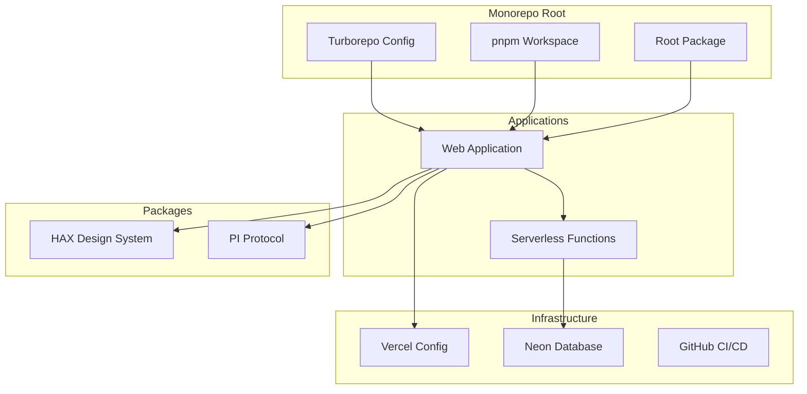
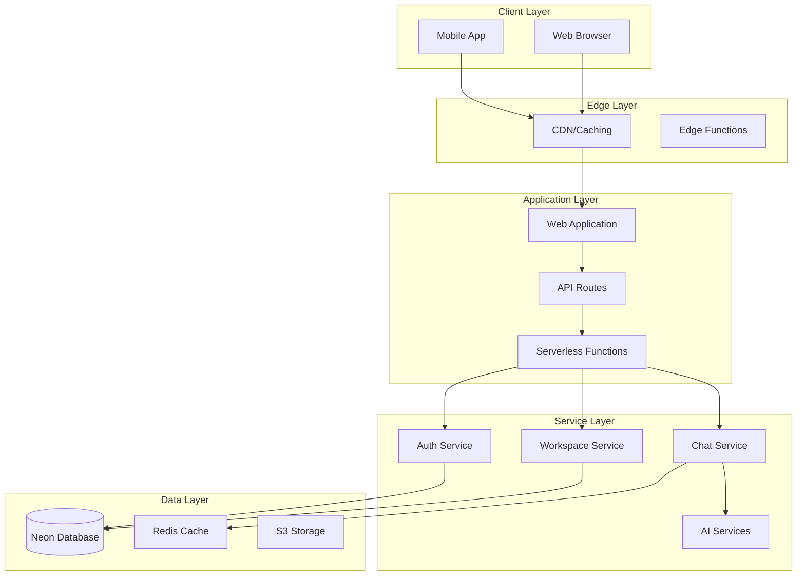
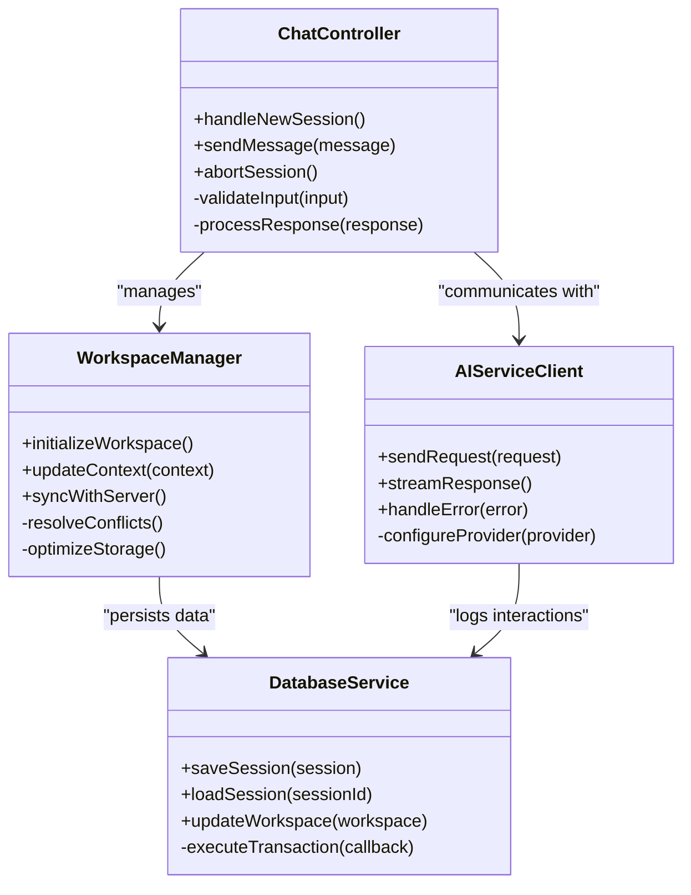
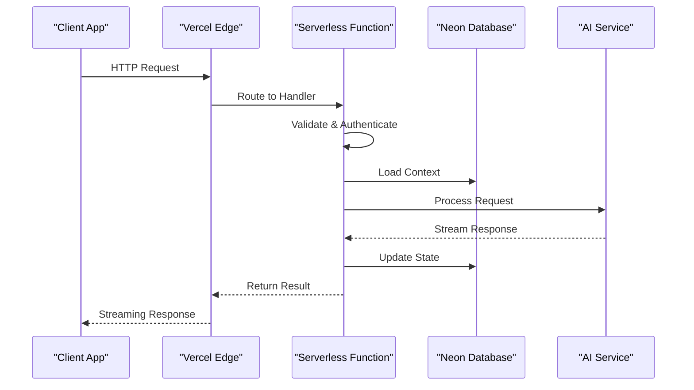
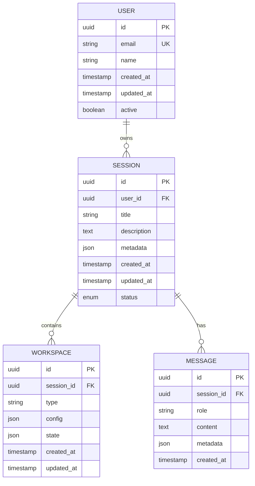
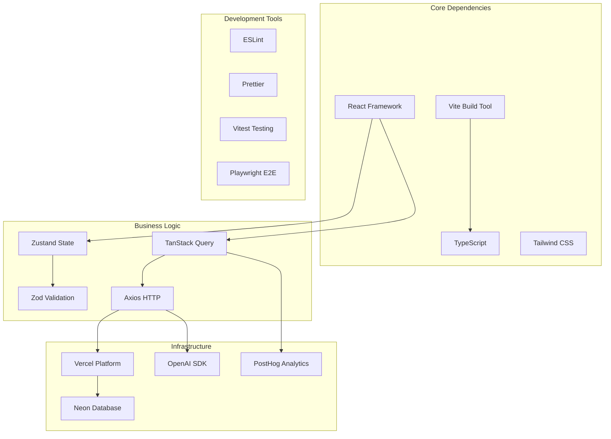

# Architecture & Design

<cite>
**Referenced Files in This Document**
- [README.md](file://README.md)
- [turbo.json](file://turbo.json)
- [package.json](file://package.json)
- [apps/web/package.json](file://apps/web/package.json)
- [apps/web/vercel.json](file://apps/web/vercel.json)
- [neon.ts](file://neon.ts)
- [functions/chat.ts](file://functions/chat.ts)
- [pnpm-workspace.yaml](file://pnpm-workspace.yaml)
- [tsconfig.json](file://tsconfig.json)
- [docs/architecture.md](file://docs/architecture.md)
- [docs/adaptive-workspace.md](file://docs/adaptive-workspace.md)
- [docs/agent-workspace.md](file://docs/agent-workspace.md)
- [apps/web/src/routes/api/chat/session.ts](file://apps/web/src/routes/api/chat/session.ts)
- [apps/web/src/lib/workspace/index.ts](file://apps/web/src/lib/workspace/index.ts)
- [apps/web/src/lib/db/index.ts](file://apps/web/src/lib/db/index.ts)
- [apps/web/src/lib/deployment/index.ts](file://apps/web/src/lib/deployment/index.ts)
</cite>

## Table of Contents

1. [Introduction](#introduction)
2. [Project Structure](#project-structure)
3. [Core Components](#core-components)
4. [Architecture Overview](#architecture-overview)
5. [Detailed Component Analysis](#detailed-component-analysis)
6. [Dependency Analysis](#dependency-analysis)
7. [Performance Considerations](#performance-considerations)
8. [Troubleshooting Guide](#troubleshooting-guide)
9. [Conclusion](#conclusion)

## Introduction

Fleet Pi is a sophisticated AI-powered development platform built as a monorepo using Turborepo for efficient build orchestration. The system combines a modern web frontend with backend services, leveraging cloud-native deployment patterns through Vercel and Neon database integration. The architecture emphasizes scalability, security, and developer experience through its adaptive workspace pattern and microservices communication approach.

The platform serves as an intelligent coding assistant that provides real-time collaboration, AI-powered code generation, and comprehensive development environment management. It follows modern software engineering practices with TypeScript throughout the stack, ensuring type safety and maintainability across all components.

## Project Structure

The Fleet Pi monorepo follows a feature-based organization with clear separation between applications, packages, and infrastructure:

**Diagram sources**

- [turbo.json:1-50](file://turbo.json#L1-L50)
- [pnpm-workspace.yaml:1-30](file://pnpm-workspace.yaml#L1-L30)
- [package.json:1-100](file://package.json#L1-L100)

The monorepo structure enables:

- **Shared Dependencies**: Common libraries and utilities are managed centrally
- **Consistent Tooling**: Unified linting, formatting, and testing configurations
- **Efficient Builds**: Turborepo optimizes build processes across packages
- **Type Safety**: Shared TypeScript configurations ensure consistency

**Section sources**

- [turbo.json:1-50](file://turbo.json#L1-L50)
- [pnpm-workspace.yaml:1-30](file://pnpm-workspace.yaml#L1-L30)
- [package.json:1-100](file://package.json#L1-L100)

## Core Components

### Web Application Layer

The web application serves as the primary user interface, built with modern React patterns and Vite for optimal performance. It handles user interactions, state management, and API communications.

### Agent Workspace System

The agent workspace implements an adaptive pattern that dynamically adjusts to user needs and context. This system manages conversation history, code artifacts, and AI service integrations.

### Backend Services

Backend functionality is distributed across serverless functions and API routes, providing scalable processing capabilities for chat operations, file management, and AI service coordination.

### Data Persistence Layer

Database operations are abstracted through a centralized configuration that supports Neon's serverless PostgreSQL capabilities, enabling automatic scaling and connection pooling.

**Section sources**

- [apps/web/package.json:1-100](file://apps/web/package.json#L1-L100)
- [apps/web/src/routes/api/chat/session.ts:1-50](file://apps/web/src/routes/api/chat/session.ts#L1-L50)
- [apps/web/src/lib/workspace/index.ts:1-100](file://apps/web/src/lib/workspace/index.ts#L1-L100)
- [apps/web/src/lib/db/index.ts:1-50](file://apps/web/src/lib/db/index.ts#L1-L50)

## Architecture Overview

The Fleet Pi architecture follows a modern microservices pattern with clear separation of concerns:

**Diagram sources**

- [apps/web/vercel.json:1-50](file://apps/web/vercel.json#L1-L50)
- [functions/chat.ts:1-100](file://functions/chat.ts#L1-L100)
- [neon.ts:1-50](file://neon.ts#L1-L50)

### Key Architectural Patterns

**Adaptive Workspace Pattern**: The workspace system dynamically adapts to user context, managing different types of content (code, documents, conversations) with appropriate storage and retrieval strategies.

**Event-Driven Communication**: Services communicate through well-defined events and APIs, enabling loose coupling and independent scaling.

**State Management Strategy**: Client-side state is managed through React hooks and context providers, while server-side state leverages database transactions and caching layers.

**Security Zones**: Clear separation between trusted and untrusted environments with appropriate authentication and authorization mechanisms.

## Detailed Component Analysis

### Web Application Architecture

The web application follows a component-based architecture with clear separation between UI components, business logic, and data access layers:

**Diagram sources**

- [apps/web/src/routes/api/chat/session.ts:1-100](file://apps/web/src/routes/api/chat/session.ts#L1-L100)
- [apps/web/src/lib/workspace/index.ts:1-150](file://apps/web/src/lib/workspace/index.ts#L1-L150)
- [apps/web/src/lib/db/index.ts:1-100](file://apps/web/src/lib/db/index.ts#L1-L100)

### Serverless Function Architecture

Serverless functions handle specific business logic with minimal overhead:

**Diagram sources**

- [functions/chat.ts:1-200](file://functions/chat.ts#L1-L200)
- [apps/web/src/lib/deployment/index.ts:1-100](file://apps/web/src/lib/deployment/index.ts#L1-L100)

### Database Schema and Relationships

The data layer uses a normalized schema optimized for concurrent access and query performance:

**Diagram sources**

- [apps/web/src/lib/db/index.ts:1-200](file://apps/web/src/lib/db/index.ts#L1-L200)
- [neon.ts:1-100](file://neon.ts#L1-L100)

**Section sources**

- [apps/web/src/routes/api/chat/session.ts:1-150](file://apps/web/src/routes/api/chat/session.ts#L1-L150)
- [functions/chat.ts:1-300](file://functions/chat.ts#L1-L300)
- [apps/web/src/lib/workspace/index.ts:1-200](file://apps/web/src/lib/workspace/index.ts#L1-L200)

## Dependency Analysis

The project dependencies follow a layered approach with clear separation between core functionality and optional features:

**Diagram sources**

- [apps/web/package.json:1-200](file://apps/web/package.json#L1-L200)
- [package.json:1-150](file://package.json#L1-L150)

### External Service Integrations

**Neon Database Integration**: Uses serverless PostgreSQL with automatic connection pooling and scaling capabilities.

**Vercel Deployment**: Leverages edge functions, static site generation, and preview deployments for optimal performance.

**AI Service Providers**: Abstracted through a unified interface supporting multiple AI providers with fallback mechanisms.

**Authentication**: Implements secure authentication flows with support for multiple providers and session management.

**Section sources**

- [apps/web/package.json:1-200](file://apps/web/package.json#L1-L200)
- [neon.ts:1-100](file://neon.ts#L1-L100)
- [apps/web/vercel.json:1-100](file://apps/web/vercel.json#L1-L100)

## Performance Considerations

### Scalability Architecture

The system is designed for horizontal scaling with several key strategies:

**Stateless Services**: All backend services are stateless, enabling easy horizontal scaling across multiple instances.

**Connection Pooling**: Database connections are pooled and managed efficiently to handle high concurrency.

**Caching Strategy**: Multi-layer caching including CDN, edge cache, and application-level cache for optimal response times.

**Load Balancing**: Automatic load balancing across available instances with health checks and failover capabilities.

### Memory and Resource Optimization

**Lazy Loading**: Components and features are loaded on-demand to minimize initial bundle size.

**Streaming Responses**: Large responses are streamed to reduce memory usage and improve perceived performance.

**Background Processing**: Long-running tasks are offloaded to background workers or queues.

**Resource Cleanup**: Proper cleanup of resources, connections, and temporary files to prevent memory leaks.

### Monitoring and Observability

**Structured Logging**: Centralized logging with correlation IDs for request tracing across services.

**Metrics Collection**: Key performance indicators and business metrics are collected and analyzed.

**Error Tracking**: Comprehensive error tracking with context and stack traces for debugging.

**Health Checks**: Regular health checks and readiness probes for container orchestration.

## Troubleshooting Guide

### Common Issues and Solutions

**Database Connection Problems**:

- Verify Neon cluster availability and credentials
- Check connection pool limits and timeout settings
- Monitor database performance metrics and slow queries

**Authentication Failures**:

- Validate JWT tokens and expiration times
- Check OAuth provider configurations
- Review session storage and cookie settings

**Performance Degradation**:

- Analyze database query performance and indexes
- Monitor memory usage and garbage collection
- Check external API rate limits and response times

**Deployment Issues**:

- Verify environment variables and secrets
- Check build dependencies and compatibility
- Review deployment logs and error messages

### Debugging Strategies

**Local Development**:

- Use Docker containers for consistent environments
- Enable detailed logging and debug modes
- Mock external services for isolated testing

**Production Debugging**:

- Access structured logs with proper filtering
- Use distributed tracing for request flow analysis
- Implement synthetic monitoring for critical paths

**Section sources**

- [apps/web/src/lib/db/index.ts:1-100](file://apps/web/src/lib/db/index.ts#L1-L100)
- [apps/web/src/lib/deployment/index.ts:1-100](file://apps/web/src/lib/deployment/index.ts#L1-L100)

## Conclusion

Fleet Pi's architecture demonstrates modern best practices in building scalable, maintainable AI-powered applications. The monorepo structure with Turborepo provides excellent developer experience and build efficiency, while the microservices architecture ensures scalability and resilience.

Key strengths include:

- **Adaptive Workspace Pattern**: Dynamic adaptation to user context and requirements
- **Cloud-Native Design**: Optimized for serverless deployment and auto-scaling
- **Comprehensive Security**: Multi-layered security with proper authentication and authorization
- **Developer Experience**: Modern tooling, TypeScript throughout, and comprehensive testing

The system is well-positioned to handle growing user loads while maintaining performance and reliability. Future enhancements could focus on advanced caching strategies, improved monitoring capabilities, and additional AI service integrations.
