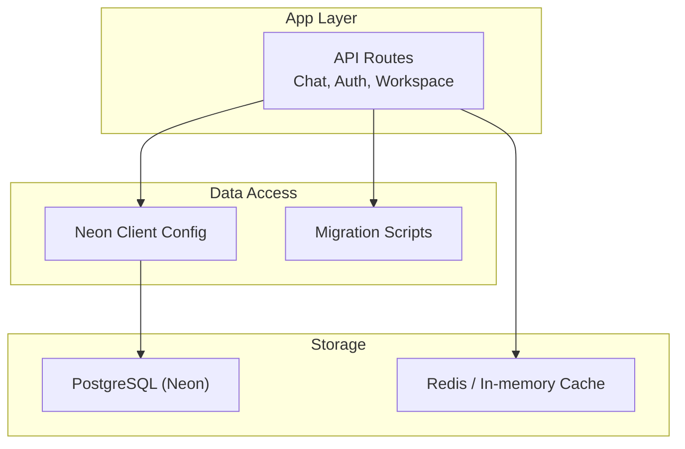
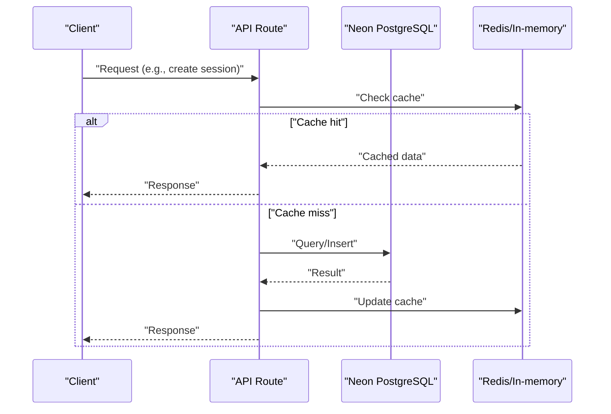
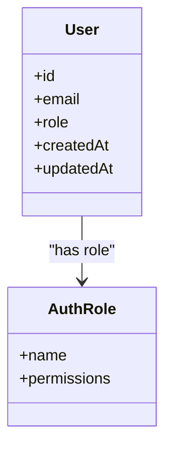
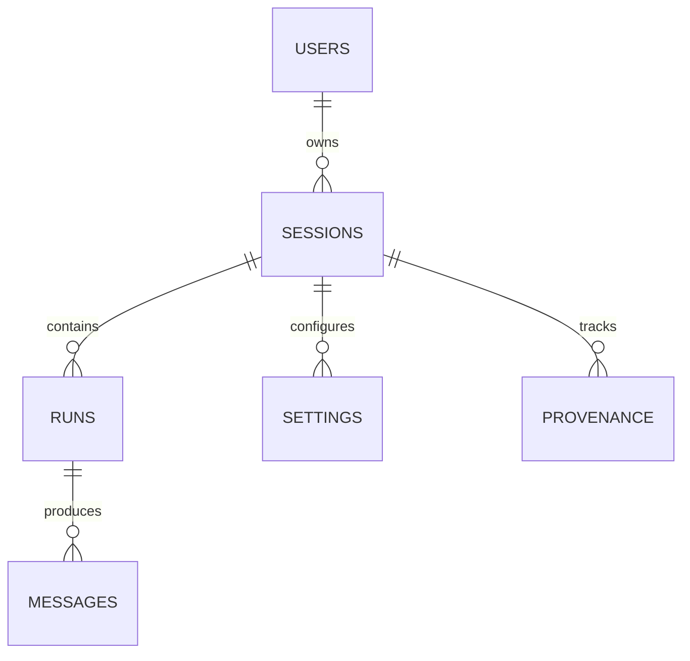
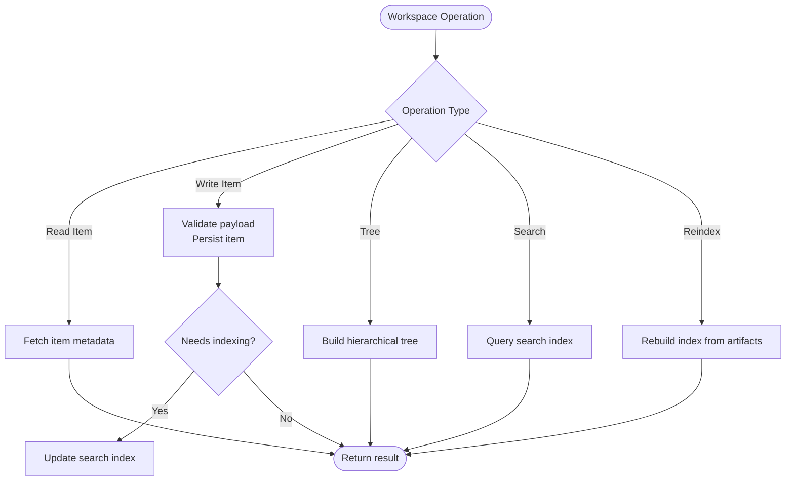
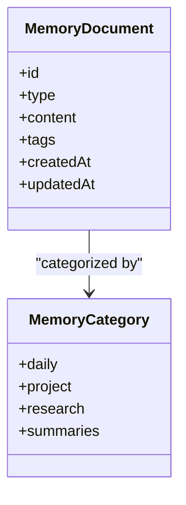
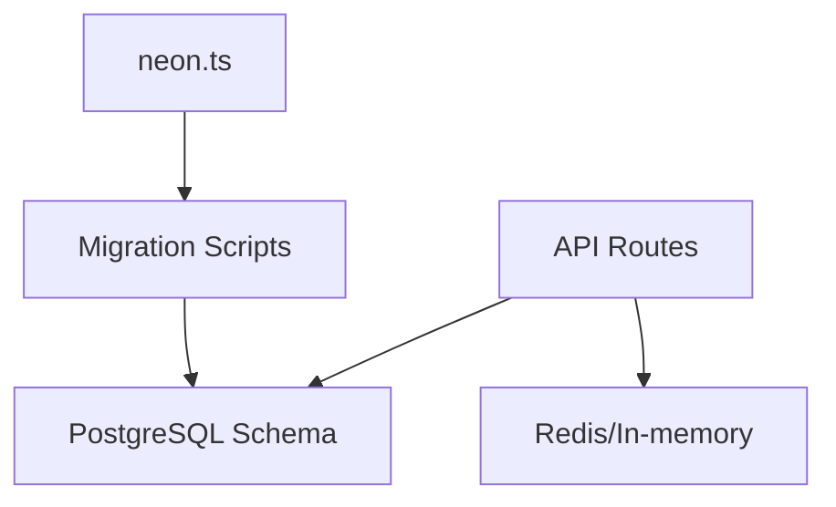

# Database Schema & Data Models

<cite>
**Referenced Files in This Document**
- [neon.ts](file://neon.ts)
- [auth-migrate.sh](file://scripts/auth-migrate.sh)
- [verify-auth-role.sql](file://scripts/verify-auth-role.sql)
- [chat-migrate.ts](file://apps/web/scripts/chat-migrate.ts)
- [remap-auth-user-ids.ts](file://apps/web/scripts/remap-auth-user-ids.ts)
- [quarantine-orphan-sessions.ts](file://apps/web/scripts/quarantine-orphan-sessions.ts)
- [data-models.md](file://docs/wiki/reference/data-models.md)
- [architecture.md](file://docs/architecture.md)
- [security.md](file://docs/wiki/security.md)
- [deployment.md](file://docs/deployment.md)
- [session.ts](file://apps/web/src/routes/api/auth/session.ts)
- [sessions.ts](file://apps/web/src/routes/api/chat/sessions.ts)
- [session.ts](file://apps/web/src/routes/api/chat/session.ts)
- [run.ts](file://apps/web/src/routes/api/chat/run.ts)
- [runs.ts](file://apps/web/src/routes/api/chat/runs.ts)
- [provenance.ts](file://apps/web/src/routes/api/chat/provenance.ts)
- [settings.ts](file://apps/web/src/routes/api/chat/settings.ts)
- [models.ts](file://apps/web/src/routes/api/chat/models.ts)
- [providers.ts](file://apps/web/src/routes/api/chat/providers.ts)
- [account.ts](file://apps/web/src/routes/api/chat/account.ts)
- [commands.ts](file://apps/web/src/routes/api/chat/commands.ts)
- [resources.ts](file://apps/web/src/routes/api/chat/resources.ts)
- [resume.ts](file://apps/web/src/routes/api/chat/resume.ts)
- [abort.ts](file://apps/web/src/routes/api/chat/abort.ts)
- [question.ts](file://apps/web/src/routes/api/chat/question.ts)
- [new.ts](file://apps/web/src/routes/api/chat/new.ts)
- [workspace-item.ts](file://apps/web/src/routes/api/workspace/item.ts)
- [workspace-items.ts](file://apps/web/src/routes/api/workspace/items.ts)
- [workspace-tree.ts](file://apps/web/src/routes/api/workspace/tree.ts)
- [workspace-search.ts](file://apps/web/src/routes/api/workspace/search.ts)
- [workspace-reindex.ts](file://apps/web/src/routes/api/workspace/reindex.ts)
- [workspace-health.ts](file://apps/web/src/routes/api/workspace/health.ts)
- [workspace-file.ts](file://apps/web/src/routes/api/workspace/file.ts)
</cite>

## Table of Contents

1. [Introduction](#introduction)
2. [Project Structure](#project-structure)
3. [Core Components](#core-components)
4. [Architecture Overview](#architecture-overview)
5. [Detailed Component Analysis](#detailed-component-analysis)
6. [Dependency Analysis](#dependency-analysis)
7. [Performance Considerations](#performance-considerations)
8. [Troubleshooting Guide](#troubleshooting-guide)
9. [Conclusion](#conclusion)
10. [Appendices](#appendices)

## Introduction

This document provides comprehensive data model documentation for Fleet Pi’s database schema, focusing on entities such as users, sessions, chat messages, workspace artifacts, and agent memories. It consolidates entity relationships, field definitions, keys, indexes, constraints, migration strategy, versioning approach, validation rules, referential integrity, access patterns, caching strategies, performance optimizations, retention and archival policies, backup procedures, and security measures. The goal is to make the data layer accessible to both technical and non-technical readers while remaining grounded in the repository’s implementation.

## Project Structure

Fleet Pi organizes database-related code across:

- Root configuration for the Neon serverless Postgres client
- Migration scripts (shell and TypeScript) for schema evolution
- API route handlers that implement CRUD operations over users, sessions, chat runs/messages, and workspace artifacts
- Documentation describing architecture, security, deployment, and reference data models

**Diagram sources**

- [neon.ts](file://neon.ts)
- [auth-migrate.sh](file://scripts/auth-migrate.sh)
- [chat-migrate.ts](file://apps/web/scripts/chat-migrate.ts)

**Section sources**

- [neon.ts](file://neon.ts)
- [architecture.md](file://docs/architecture.md)

## Core Components

The primary data entities include:

- Users: Identity and account metadata
- Sessions: Chat session state and lifecycle
- Messages: Chat message records within a session
- Workspace Artifacts: Files, datasets, diagrams, reports, traces stored per workspace
- Agent Memories: Daily/project/research/summaries memory documents used by agents

Key responsibilities:

- Users and sessions are managed via auth routes and chat session endpoints
- Chat messages are persisted through chat run/message endpoints
- Workspace artifacts are accessed via workspace item/tree/search endpoints
- Agent memories are stored under structured directories and indexed for retrieval

**Section sources**

- [data-models.md](file://docs/wiki/reference/data-models.md)
- [sessions.ts](file://apps/web/src/routes/api/chat/sessions.ts)
- [session.ts](file://apps/web/src/routes/api/chat/session.ts)
- [run.ts](file://apps/web/src/routes/api/chat/run.ts)
- [runs.ts](file://apps/web/src/routes/api/chat/runs.ts)
- [workspace-item.ts](file://apps/web/src/routes/api/workspace/item.ts)
- [workspace-items.ts](file://apps/web/src/routes/api/workspace/items.ts)
- [workspace-tree.ts](file://apps/web/src/routes/api/workspace/tree.ts)
- [workspace-search.ts](file://apps/web/src/routes/api/workspace/search.ts)

## Architecture Overview

Fleet Pi uses Neon serverless Postgres with a typed client configured at the root. Migrations are executed via shell and TypeScript scripts. API routes encapsulate business logic and interact with the database through the Neon client. Caching may be implemented using Redis or in-memory stores for frequently accessed data like provider settings and model catalogs.

[No sources needed since this diagram shows conceptual workflow, not actual code structure]

## Detailed Component Analysis

### Users and Authentication

- Entities: user accounts, roles, and related metadata
- Operations: creation, lookup, role verification, ID remapping
- Security: role-based access control and auditability

**Diagram sources**

- [verify-auth-role.sql](file://scripts/verify-auth-role.sql)
- [remap-auth-user-ids.ts](file://apps/web/scripts/remap-auth-user-ids.ts)

**Section sources**

- [verify-auth-role.sql](file://scripts/verify-auth-role.sql)
- [remap-auth-user-ids.ts](file://apps/web/scripts/remap-auth-user-ids.ts)
- [session.ts](file://apps/web/src/routes/api/auth/session.ts)

### Sessions and Chat Runs/Messages

- Entities: sessions, runs, messages, provenance, settings
- Operations: create, resume, abort, list, query by session/user
- Constraints: session ownership, message ordering, run status transitions

**Diagram sources**

- [sessions.ts](file://apps/web/src/routes/api/chat/sessions.ts)
- [session.ts](file://apps/web/src/routes/api/chat/session.ts)
- [run.ts](file://apps/web/src/routes/api/chat/run.ts)
- [runs.ts](file://apps/web/src/routes/api/chat/runs.ts)
- [provenance.ts](file://apps/web/src/routes/api/chat/provenance.ts)
- [settings.ts](file://apps/web/src/routes/api/chat/settings.ts)

**Section sources**

- [sessions.ts](file://apps/web/src/routes/api/chat/sessions.ts)
- [session.ts](file://apps/web/src/routes/api/chat/session.ts)
- [run.ts](file://apps/web/src/routes/api/chat/run.ts)
- [runs.ts](file://apps/web/src/routes/api/chat/runs.ts)
- [provenance.ts](file://apps/web/src/routes/api/chat/provenance.ts)
- [settings.ts](file://apps/web/src/routes/api/chat/settings.ts)

### Workspace Artifacts

- Entities: items, files, trees, search indices
- Operations: read/write items, traverse tree, search content, reindex
- Integrity: path uniqueness, parent-child relationships, indexing consistency

**Diagram sources**

- [workspace-item.ts](file://apps/web/src/routes/api/workspace/item.ts)
- [workspace-items.ts](file://apps/web/src/routes/api/workspace/items.ts)
- [workspace-tree.ts](file://apps/web/src/routes/api/workspace/tree.ts)
- [workspace-search.ts](file://apps/web/src/routes/api/workspace/search.ts)
- [workspace-reindex.ts](file://apps/web/src/routes/api/workspace/reindex.ts)

**Section sources**

- [workspace-item.ts](file://apps/web/src/routes/api/workspace/item.ts)
- [workspace-items.ts](file://apps/web/src/routes/api/workspace/items.ts)
- [workspace-tree.ts](file://apps/web/src/routes/api/workspace/tree.ts)
- [workspace-search.ts](file://apps/web/src/routes/api/workspace/search.ts)
- [workspace-reindex.ts](file://apps/web/src/routes/api/workspace/reindex.ts)

### Agent Memories

- Entities: daily, project, research, summaries memory documents
- Operations: read/write, summarize, recall, synthesize
- Storage: file-based under memory directory; optionally indexed for fast recall

[No sources needed since this diagram shows conceptual workflow, not actual code structure]

**Section sources**

- [data-models.md](file://docs/wiki/reference/data-models.md)

## Dependency Analysis

Database dependencies and interactions:

- Neon client configuration centralizes connection parameters
- Migration scripts evolve schema versions
- API routes depend on schema contracts enforced by migrations and validations

**Diagram sources**

- [neon.ts](file://neon.ts)
- [auth-migrate.sh](file://scripts/auth-migrate.sh)
- [chat-migrate.ts](file://apps/web/scripts/chat-migrate.ts)

**Section sources**

- [neon.ts](file://neon.ts)
- [auth-migrate.sh](file://scripts/auth-migrate.sh)
- [chat-migrate.ts](file://apps/web/scripts/chat-migrate.ts)

## Performance Considerations

- Use appropriate indexes on foreign keys and frequently queried columns (e.g., session_id, user_id, created_at)
- Leverage caching for static or semi-static data (provider settings, model catalogs)
- Batch writes where possible to reduce round-trips
- Partition large tables (e.g., messages) by time if growth warrants it
- Optimize queries with selective projections and pagination

[No sources needed since this section provides general guidance]

## Troubleshooting Guide

Common issues and resolutions:

- Migration failures: verify schema version and rollback steps
- Orphaned sessions: quarantine and cleanup processes
- Role verification errors: ensure roles exist and permissions are correct
- Cache inconsistencies: invalidate caches after schema changes

**Section sources**

- [quarantine-orphan-sessions.ts](file://apps/web/scripts/quarantine-orphan-sessions.ts)
- [verify-auth-role.sql](file://scripts/verify-auth-role.sql)

## Conclusion

Fleet Pi’s data layer combines a robust Postgres schema with clear migration practices and well-scoped API routes. By adhering to the documented constraints, validation rules, and performance strategies, teams can maintain data integrity, scalability, and security. Caching and indexing further enhance responsiveness, while retention and archival policies ensure long-term manageability.

[No sources needed since this section summarizes without analyzing specific files]

## Appendices

### Migration Strategy and Versioning

- Shell-based migrations for authentication schema updates
- TypeScript-driven migrations for chat-related schema changes
- Versioning approach: each migration script corresponds to a schema version; apply sequentially and verify post-migration

**Section sources**

- [auth-migrate.sh](file://scripts/auth-migrate.sh)
- [chat-migrate.ts](file://apps/web/scripts/chat-migrate.ts)

### Data Validation Rules and Constraints

- Enforce non-null constraints on critical fields (user_id, session_id, content)
- Unique constraints on identifiers and paths
- Check constraints for enums and status values
- Foreign key constraints to maintain referential integrity

**Section sources**

- [data-models.md](file://docs/wiki/reference/data-models.md)

### Referential Integrity Policies

- Cascade deletes for dependent records when appropriate (e.g., deleting a session removes associated runs/messages)
- Restrict updates to parent keys to prevent orphaned references
- Validate ownership before mutations (user owns session)

**Section sources**

- [sessions.ts](file://apps/web/src/routes/api/chat/sessions.ts)
- [session.ts](file://apps/web/src/routes/api/chat/session.ts)

### Data Access Patterns and Caching

- Read-heavy patterns benefit from caching provider settings and model lists
- Write-heavy patterns should batch operations and use transactions
- Invalidate caches on schema changes or configuration updates

**Section sources**

- [providers.ts](file://apps/web/src/routes/api/chat/providers.ts)
- [models.ts](file://apps/web/src/routes/api/chat/models.ts)

### Retention and Archival Policies

- Define retention windows for sessions and messages
- Archive old sessions to cold storage or separate tables
- Implement background jobs to purge or archive based on policy

**Section sources**

- [quarantine-orphan-sessions.ts](file://apps/web/scripts/quarantine-orphan-sessions.ts)

### Backup Procedures

- Regular automated backups of PostgreSQL snapshots
- Verify restore procedures periodically
- Encrypt backups at rest and secure transfer in transit

**Section sources**

- [deployment.md](file://docs/deployment.md)

### Security Measures

- Encryption at rest for database volumes
- TLS for data in transit between clients and services
- Role-based access control and least privilege principles
- Privacy compliance: minimize PII, enforce data minimization, and provide deletion mechanisms

**Section sources**

- [security.md](file://docs/wiki/security.md)
