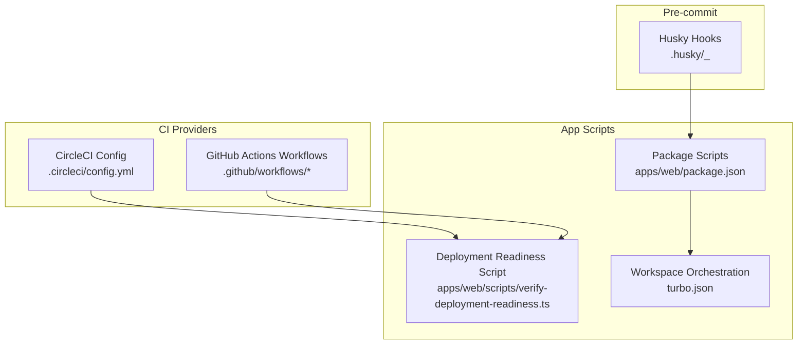
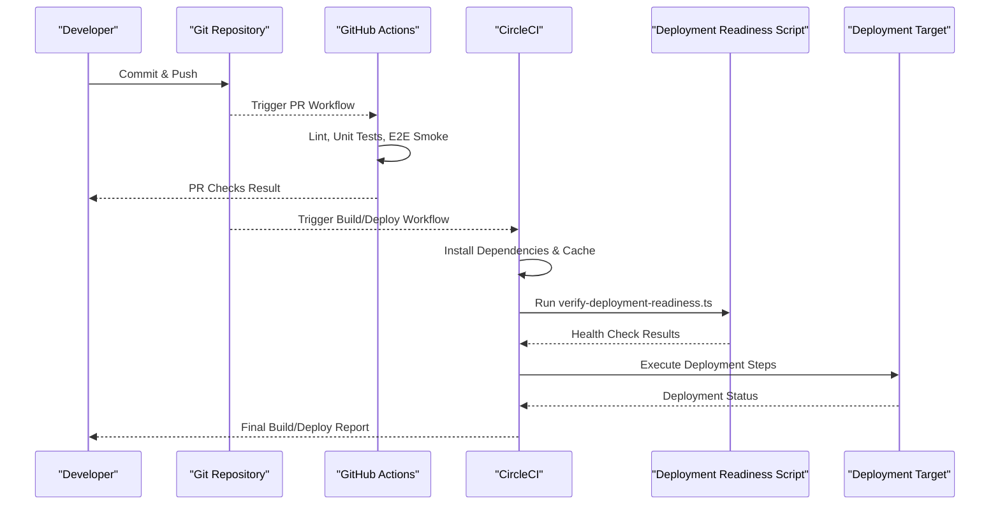
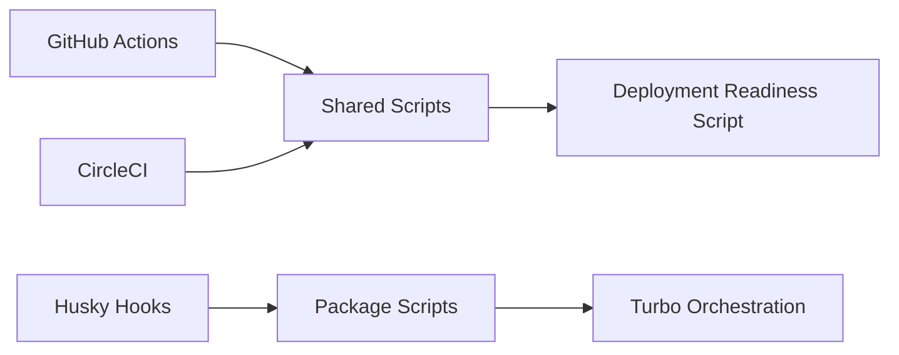

# CI/CD Pipeline

<cite>
**Referenced Files in This Document**
- [.circleci/config.yml](file://.circleci/config.yml)
- [apps/web/scripts/verify-deployment-readiness.ts](file://apps/web/scripts/verify-deployment-readiness.ts)
- [apps/web/package.json](file://apps/web/package.json)
- [turbo.json](file://turbo.json)
- [.github/workflows](file://.github/workflows)
- [.husky/_](file://.husky/_)
</cite>

## Table of Contents

1. [Introduction](#introduction)
2. [Project Structure](#project-structure)
3. [Core Components](#core-components)
4. [Architecture Overview](#architecture-overview)
5. [Detailed Component Analysis](#detailed-component-analysis)
6. [Dependency Analysis](#dependency-analysis)
7. [Performance Considerations](#performance-considerations)
8. [Troubleshooting Guide](#troubleshooting-guide)
9. [Conclusion](#conclusion)

## Introduction

This document explains Fleet Pi’s CI/CD pipeline infrastructure with a focus on CircleCI configuration, GitHub Actions workflows, pre-commit hooks via Husky, and the deployment readiness verification script. It covers build stages, test execution, deployment automation, caching strategies, parallelization, artifact management, environment-specific configurations, secrets management, branch protection, pull request validation, and automated rollback procedures.

## Project Structure

The CI/CD surface area spans several directories and files:

- CircleCI configuration under .circleci/config.yml defines jobs, workflows, and deployment steps.
- GitHub Actions workflows live under .github/workflows for automated testing, code quality checks, and release processes.
- Pre-commit hooks are configured under .husky to enforce formatting and linting before commits.
- The deployment readiness verification script is located at apps/web/scripts/verify-deployment-readiness.ts and is invoked by CI jobs.
- Package scripts and workspace orchestration are defined in apps/web/package.json and turbo.json.

**Diagram sources**

- [.circleci/config.yml](file://.circleci/config.yml)
- [.github/workflows](file://.github/workflows)
- [.husky/_](file://.husky/_)
- [apps/web/scripts/verify-deployment-readiness.ts](file://apps/web/scripts/verify-deployment-readiness.ts)
- [apps/web/package.json](file://apps/web/package.json)
- [turbo.json](file://turbo.json)

**Section sources**

- [.circleci/config.yml](file://.circleci/config.yml)
- [.github/workflows](file://.github/workflows)
- [.husky/_](file://.husky/_)
- [apps/web/scripts/verify-deployment-readiness.ts](file://apps/web/scripts/verify-deployment-readiness.ts)
- [apps/web/package.json](file://apps/web/package.json)
- [turbo.json](file://turbo.json)

## Core Components

- CircleCI Configuration: Defines jobs (build, test, deploy), workflow triggers, caching, and environment variables.
- GitHub Actions Workflows: Provide PR checks, main branch builds, quality gates, and release automation.
- Husky Pre-commit Hooks: Enforce consistent code style and run lightweight validations locally before pushing.
- Deployment Readiness Verification Script: Validates runtime dependencies, environment variables, and service health prior to deployment.
- Workspace Orchestration: Turbo coordinates tasks across packages/apps to enable parallelization and caching.

**Section sources**

- [.circleci/config.yml](file://.circleci/config.yml)
- [.github/workflows](file://.github/workflows)
- [.husky/_](file://.husky/_)
- [apps/web/scripts/verify-deployment-readiness.ts](file://apps/web/scripts/verify-deployment-readiness.ts)
- [apps/web/package.json](file://apps/web/package.json)
- [turbo.json](file://turbo.json)

## Architecture Overview

The CI/CD architecture integrates local pre-commit enforcement, CI providers for automated checks and deployments, and a verification step that ensures the target environment is ready before releasing changes.

**Diagram sources**

- [.github/workflows](file://.github/workflows)
- [.circleci/config.yml](file://.circleci/config.yml)
- [apps/web/scripts/verify-deployment-readiness.ts](file://apps/web/scripts/verify-deployment-readiness.ts)

## Detailed Component Analysis

### CircleCI Configuration

- Jobs: Typically include setup, dependency installation, building the app, running tests (unit and e2e), and deploying to staging or production.
- Workflows: Define triggers (push, PR, tags), job ordering, and conditional execution based on branches or paths.
- Caching: Uses persistent caches for node modules and build artifacts to speed up subsequent runs.
- Environment Variables: Secrets and config values are injected via CircleCI context or project settings.

Key responsibilities:

- Parallelize test suites where possible using split commands or test sharding.
- Upload test reports and build artifacts for traceability.
- Gate deployments behind successful test runs and readiness verification.

**Section sources**

- [.circleci/config.yml](file://.circleci/config.yml)

### GitHub Actions Workflows

- PR Validation: Runs linting, type checks, unit tests, and optional e2e smoke tests on pull requests.
- Main Branch Builds: Executes full test suites and builds artifacts for releases.
- Release Automation: Creates tags, publishes artifacts, and triggers downstream deployment pipelines.
- Code Quality: Integrates linters and static analysis tools to maintain standards.

Best practices:

- Use matrix builds for multiple Node versions or environments.
- Cache dependencies between runs.
- Store artifacts such as logs and coverage reports.

**Section sources**

- [.github/workflows](file://.github/workflows)

### Husky Pre-commit Hooks

- Purpose: Enforce formatting and linting locally before committing to reduce CI failures.
- Typical Commands: Prettier formatting, ESLint checks, and small-scale tests.
- Integration: Hook scripts are stored under .husky and executed automatically on commit.

Benefits:

- Faster feedback loop for developers.
- Consistent code style across contributors.
- Reduced noise in CI due to preventable issues.

**Section sources**

- [.husky/_](file://.husky/_)
- [apps/web/package.json](file://apps/web/package.json)

### Deployment Readiness Verification Script

- Functionality: Validates required environment variables, checks connectivity to services (e.g., databases, APIs), and performs basic health checks.
- Execution: Invoked by CI jobs prior to deployment to ensure the target environment is healthy and properly configured.
- Outputs: Returns success or failure status; may produce structured logs for CI consumption.

Typical checks:

- Presence of critical env vars.
- Database connectivity and schema readiness.
- External API availability and authentication.

**Section sources**

- [apps/web/scripts/verify-deployment-readiness.ts](file://apps/web/scripts/verify-deployment-readiness.ts)

### Package Scripts and Workspace Orchestration

- apps/web/package.json: Contains scripts for building, testing, linting, and preparing artifacts.
- turbo.json: Coordinates task execution across the monorepo, enabling parallelism and caching.

Usage in CI:

- CI jobs call these scripts to perform consistent operations across environments.
- Turbo ensures efficient caching and parallel execution of independent tasks.

**Section sources**

- [apps/web/package.json](file://apps/web/package.json)
- [turbo.json](file://turbo.json)

## Dependency Analysis

The CI/CD components interact through well-defined interfaces:

- GitHub Actions and CircleCI trigger on repository events and execute shared scripts.
- Husky hooks depend on package scripts to enforce local quality.
- The deployment readiness script depends on environment configuration and external services.

**Diagram sources**

- [.github/workflows](file://.github/workflows)
- [.circleci/config.yml](file://.circleci/config.yml)
- [apps/web/scripts/verify-deployment-readiness.ts](file://apps/web/scripts/verify-deployment-readiness.ts)
- [apps/web/package.json](file://apps/web/package.json)
- [turbo.json](file://turbo.json)

**Section sources**

- [.github/workflows](file://.github/workflows)
- [.circleci/config.yml](file://.circleci/config.yml)
- [apps/web/scripts/verify-deployment-readiness.ts](file://apps/web/scripts/verify-deployment-readiness.ts)
- [apps/web/package.json](file://apps/web/package.json)
- [turbo.json](file://turbo.json)

## Performance Considerations

- Caching Strategies:
  - Cache node_modules and build outputs in both CircleCI and GitHub Actions.
  - Use Turbo’s cache for workspace tasks to avoid redundant work.
- Parallel Test Execution:
  - Split test suites across multiple jobs or workers.
  - Leverage test runners’ sharding capabilities.
- Artifact Management:
  - Upload logs, coverage reports, and build artifacts for debugging and audit trails.
- Dependency Installation Optimization:
  - Pin versions and use lockfiles to minimize resolution time.
  - Prefer incremental installs when possible.

[No sources needed since this section provides general guidance]

## Troubleshooting Guide

Common issues and resolutions:

- Missing Environment Variables:
  - Ensure all required secrets are configured in CI providers and referenced correctly in scripts.
- Service Connectivity Failures:
  - Review network policies, firewall rules, and endpoint URLs used by the readiness script.
- Slow Builds:
  - Validate cache keys and sizes; clear stale caches if necessary.
- Test Flakiness:
  - Isolate failing tests, add retries cautiously, and stabilize external mocks.
- Deployment Rollbacks:
  - Implement versioned deployments and quick rollback mechanisms triggered by failed health checks.

**Section sources**

- [apps/web/scripts/verify-deployment-readiness.ts](file://apps/web/scripts/verify-deployment-readiness.ts)

## Conclusion

Fleet Pi’s CI/CD pipeline combines CircleCI and GitHub Actions to provide robust automated testing, quality checks, and deployment automation. Husky enforces local code quality, while the deployment readiness script ensures environments are healthy before release. By leveraging caching, parallelization, and artifact management, the pipeline achieves speed and reliability. Branch protection and PR validation further safeguard the codebase, and automated rollback procedures mitigate risks during deployments.

[No sources needed since this section summarizes without analyzing specific files]
