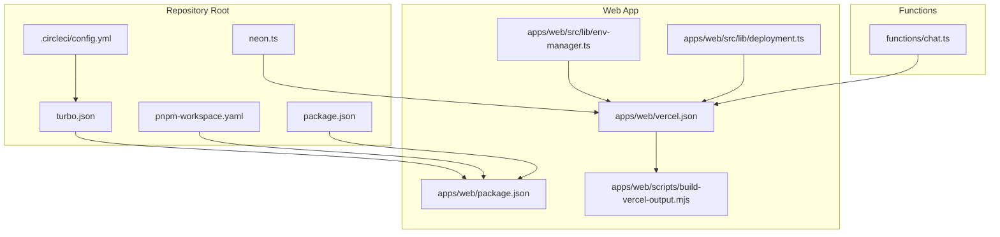
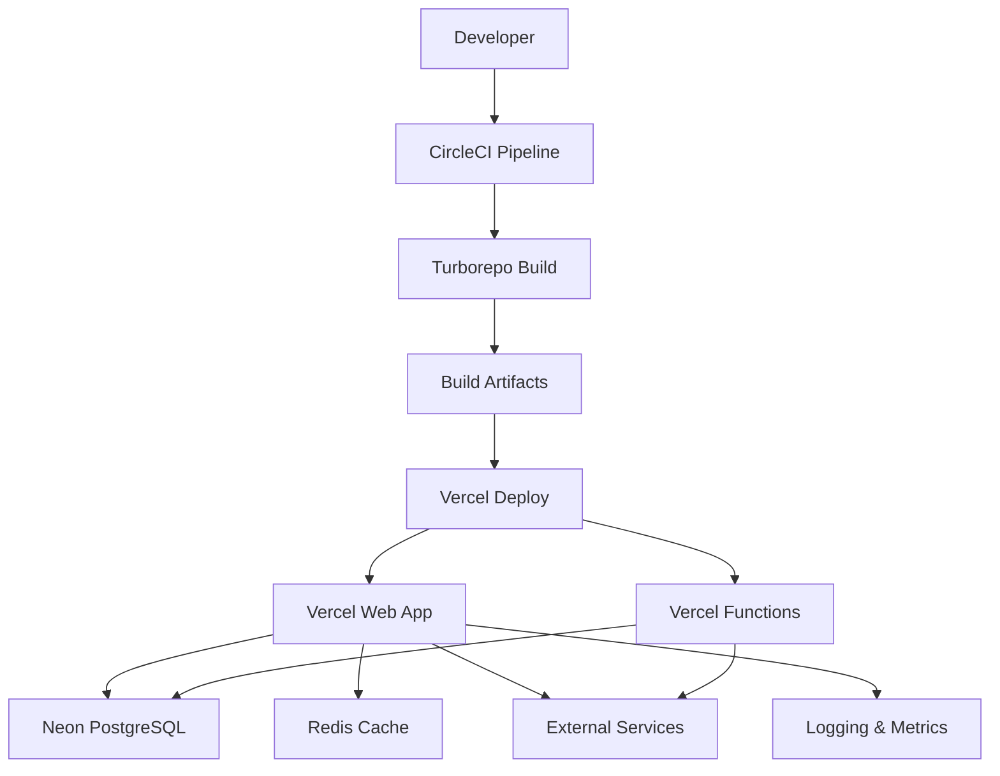
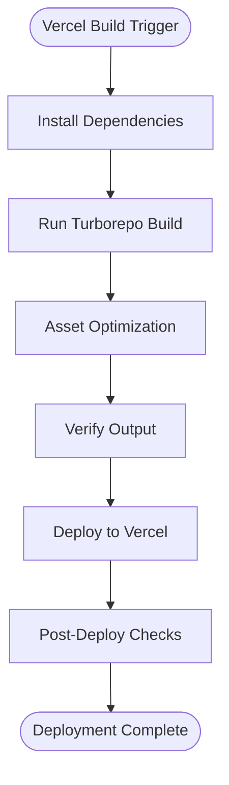
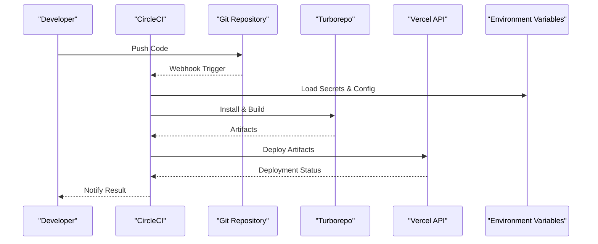
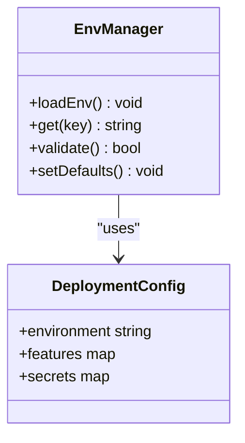
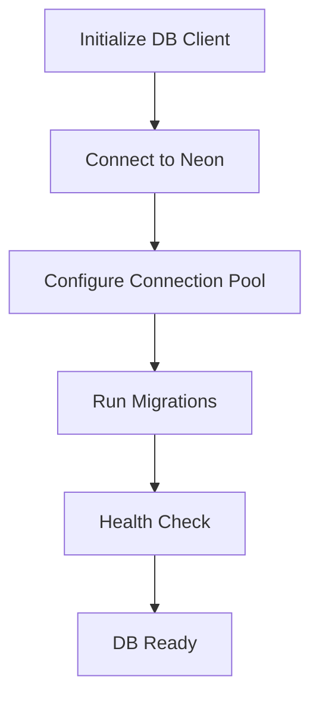
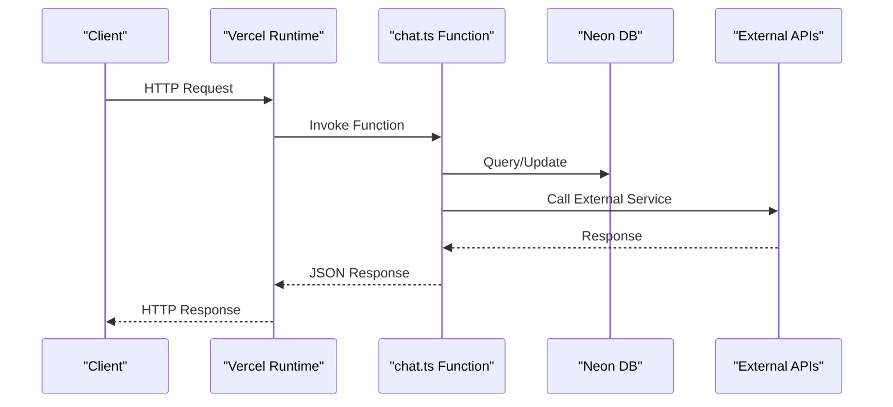
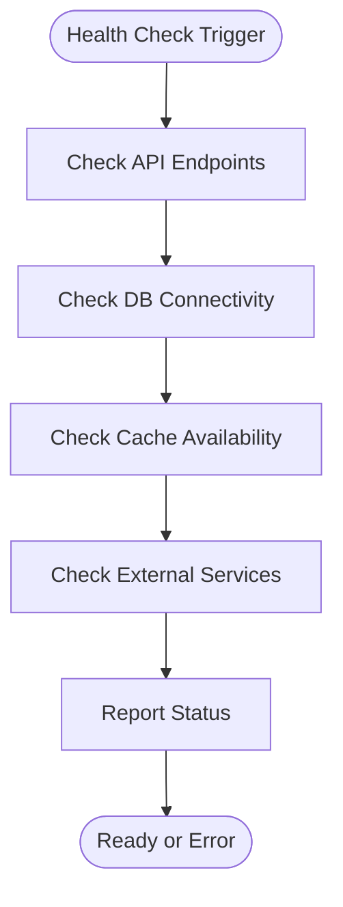
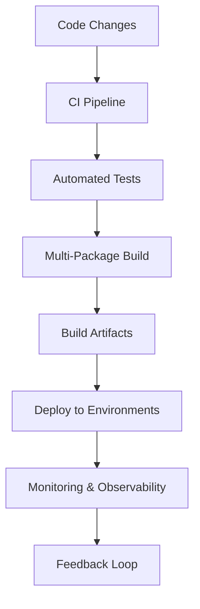
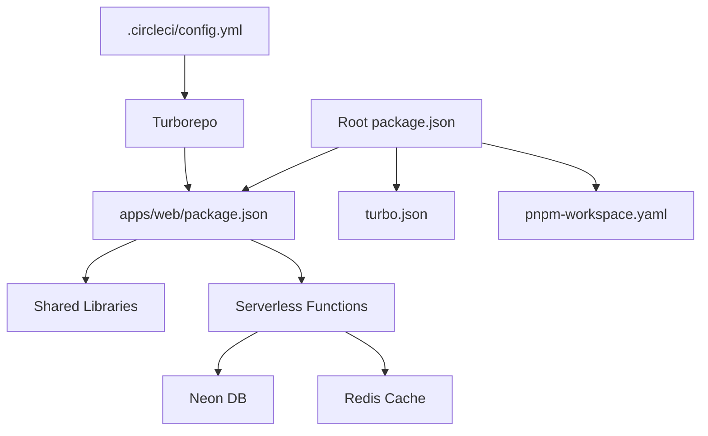

# Deployment & Infrastructure

<cite>
**Referenced Files in This Document**
- [vercel.json](file://apps/web/vercel.json)
- [.circleci/config.yml](file://.circleci/config.yml)
- [turbo.json](file://turbo.json)
- [pnpm-workspace.yaml](file://pnpm-workspace.yaml)
- [package.json](file://package.json)
- [apps/web/package.json](file://apps/web/package.json)
- [neon.ts](file://neon.ts)
- [apps/web/scripts/build-vercel-output.mjs](file://apps/web/scripts/build-vercel-output.mjs)
- [apps/web/scripts/verify-deployment-readiness.mjs](file://apps/web/scripts/verify-deployment-readiness.mjs)
- [functions/chat.ts](file://functions/chat.ts)
- [apps/web/src/lib/env-manager.ts](file://apps/web/src/lib/env-manager.ts)
- [apps/web/src/lib/logger.ts](file://apps/web/src/lib/logger.ts)
- [apps/web/src/lib/deployment.ts](file://apps/web/src/lib/deployment.ts)
- [apps/web/src/lib/api-utils.ts](file://apps/web/src/lib/api-utils.ts)
- [apps/web/src/routes/api/chat.ts](file://apps/web/src/routes/api/chat.ts)
- [apps/web/src/routes/api/health.ts](file://apps/web/src/routes/api/health.ts)
- [apps/web/e2e/vercel-preview-smoke.e2e.ts](file://apps/web/e2e/vercel-preview-smoke.e2e.ts)
- [docs/runbooks/deployment-release-gate.md](file://docs/runbooks/deployment-release-gate.md)
- [docs/wiki/deployment.md](file://docs/wiki/deployment.md)
- [scripts/verify-neon-backend.mjs](file://scripts/verify-neon-backend.mjs)
</cite>

## Table of Contents

1. [Introduction](#introduction)
2. [Project Structure](#project-structure)
3. [Core Components](#core-components)
4. [Architecture Overview](#architecture-overview)
5. [Detailed Component Analysis](#detailed-component-analysis)
6. [Dependency Analysis](#dependency-analysis)
7. [Performance Considerations](#performance-considerations)
8. [Troubleshooting Guide](#troubleshooting-guide)
9. [Conclusion](#conclusion)
10. [Appendices](#appendices)

## Introduction

This document describes Fleet Pi’s deployment infrastructure and operational practices. It covers the Vercel-based hosting strategy, CircleCI-driven CI/CD pipeline, environment management across development, staging, and production, and infrastructure requirements including Neon database, Redis caching, and external integrations. It also explains the Turborepo build system for efficient multi-package builds, asset optimization, and deployment automation. Scaling considerations, monitoring and observability, disaster recovery, backup strategies, rollback mechanisms, and security practices are included to provide a comprehensive guide for operators and contributors.

## Project Structure

Fleet Pi is organized as a monorepo with a web application under apps/web, shared packages under packages, serverless functions under functions, and configuration files at the repository root. The deployment targets Vercel for hosting and edge/serverless execution, while CI/CD is orchestrated by CircleCI. Build orchestration uses Turborepo and pnpm workspaces to coordinate tasks across packages.

**Diagram sources**

- [turbo.json](file://turbo.json)
- [pnpm-workspace.yaml](file://pnpm-workspace.yaml)
- [package.json](file://package.json)
- [.circleci/config.yml](file://.circleci/config.yml)
- [neon.ts](file://neon.ts)
- [apps/web/vercel.json](file://apps/web/vercel.json)
- [apps/web/package.json](file://apps/web/package.json)
- [apps/web/src/lib/env-manager.ts](file://apps/web/src/lib/env-manager.ts)
- [apps/web/src/lib/deployment.ts](file://apps/web/src/lib/deployment.ts)
- [apps/web/scripts/build-vercel-output.mjs](file://apps/web/scripts/build-vercel-output.mjs)
- [functions/chat.ts](file://functions/chat.ts)

**Section sources**

- [turbo.json](file://turbo.json)
- [pnpm-workspace.yaml](file://pnpm-workspace.yaml)
- [package.json](file://package.json)
- [.circleci/config.yml](file://.circleci/config.yml)
- [apps/web/vercel.json](file://apps/web/vercel.json)

## Core Components

- Vercel Hosting Configuration: Defines how the app is built and deployed on Vercel, including framework settings, build commands, output handling, and routing rules.
- CircleCI Pipeline: Orchestrates CI/CD steps such as dependency installation, linting, testing, building artifacts, and deploying to Vercel environments.
- Turborepo Orchestration: Coordinates multi-package builds and caches outputs to accelerate repeated builds across environments.
- Environment Management: Centralized environment variable handling for runtime configuration, secrets, and feature flags.
- Database Integration: Neon PostgreSQL connection setup and verification scripts for health checks and migrations.
- Serverless Functions: Edge or Node.js functions for API endpoints and background tasks.
- Health and Readiness Checks: Endpoints and scripts to validate deployment readiness and service health.

**Section sources**

- [apps/web/vercel.json](file://apps/web/vercel.json)
- [.circleci/config.yml](file://.circleci/config.yml)
- [turbo.json](file://turbo.json)
- [apps/web/src/lib/env-manager.ts](file://apps/web/src/lib/env-manager.ts)
- [neon.ts](file://neon.ts)
- [functions/chat.ts](file://functions/chat.ts)
- [apps/web/src/routes/api/health.ts](file://apps/web/src/routes/api/health.ts)
- [apps/web/scripts/verify-deployment-readiness.mjs](file://apps/web/scripts/verify-deployment-readiness.mjs)

## Architecture Overview

The deployment architecture leverages Vercel for static assets, serverless functions, and edge runtime. CircleCI automates the build and deploy process across branches and tags. Turborepo coordinates multi-package builds and caches outputs. Neon provides managed PostgreSQL with connection pooling and scaling. Redis is used for caching where applicable. Monitoring and observability integrate via logging utilities and health endpoints.

**Diagram sources**

- [.circleci/config.yml](file://.circleci/config.yml)
- [turbo.json](file://turbo.json)
- [apps/web/vercel.json](file://apps/web/vercel.json)
- [neon.ts](file://neon.ts)
- [functions/chat.ts](file://functions/chat.ts)
- [apps/web/src/lib/logger.ts](file://apps/web/src/lib/logger.ts)

## Detailed Component Analysis

### Vercel Deployment Strategy

Vercel hosts the web application and serverless functions. The configuration defines build commands, framework integration, output directory, and routing rules. Custom build scripts ensure compatibility with Vercel’s runtime and optimize assets.

**Diagram sources**

- [apps/web/vercel.json](file://apps/web/vercel.json)
- [apps/web/scripts/build-vercel-output.mjs](file://apps/web/scripts/build-vercel-output.mjs)
- [turbo.json](file://turbo.json)

**Section sources**

- [apps/web/vercel.json](file://apps/web/vercel.json)
- [apps/web/scripts/build-vercel-output.mjs](file://apps/web/scripts/build-vercel-output.mjs)

### CircleCI Pipeline Configuration

The CI/CD pipeline installs dependencies, runs tests, builds artifacts using Turborepo, and deploys to Vercel environments based on branch and tag triggers. Secrets and environment variables are injected securely.

**Diagram sources**

- [.circleci/config.yml](file://.circleci/config.yml)
- [turbo.json](file://turbo.json)
- [apps/web/package.json](file://apps/web/package.json)

**Section sources**

- [.circleci/config.yml](file://.circleci/config.yml)
- [apps/web/package.json](file://apps/web/package.json)

### Environment Management

Environment variables are managed centrally and injected into the runtime. The environment manager handles loading, validation, and fallbacks for different environments (development, staging, production).

**Diagram sources**

- [apps/web/src/lib/env-manager.ts](file://apps/web/src/lib/env-manager.ts)
- [apps/web/src/lib/deployment.ts](file://apps/web/src/lib/deployment.ts)

**Section sources**

- [apps/web/src/lib/env-manager.ts](file://apps/web/src/lib/env-manager.ts)
- [apps/web/src/lib/deployment.ts](file://apps/web/src/lib/deployment.ts)

### Database Integration with Neon

Neon PostgreSQL is configured for connection pooling, scaling, and high availability. Scripts verify connectivity and run migrations during deployment.

**Diagram sources**

- [neon.ts](file://neon.ts)
- [scripts/verify-neon-backend.mjs](file://scripts/verify-neon-backend.mjs)

**Section sources**

- [neon.ts](file://neon.ts)
- [scripts/verify-neon-backend.mjs](file://scripts/verify-neon-backend.mjs)

### Serverless Functions

Serverless functions handle API endpoints and background tasks. They are deployed alongside the web app and share environment variables and configurations.

**Diagram sources**

- [functions/chat.ts](file://functions/chat.ts)
- [apps/web/src/lib/api-utils.ts](file://apps/web/src/lib/api-utils.ts)

**Section sources**

- [functions/chat.ts](file://functions/chat.ts)
- [apps/web/src/lib/api-utils.ts](file://apps/web/src/lib/api-utils.ts)

### Health and Readiness Checks

Health endpoints and deployment readiness scripts ensure services are operational before routing traffic. These checks are integrated into CI/CD and deployment workflows.

**Diagram sources**

- [apps/web/src/routes/api/health.ts](file://apps/web/src/routes/api/health.ts)
- [apps/web/scripts/verify-deployment-readiness.mjs](file://apps/web/scripts/verify-deployment-readiness.mjs)

**Section sources**

- [apps/web/src/routes/api/health.ts](file://apps/web/src/routes/api/health.ts)
- [apps/web/scripts/verify-deployment-readiness.mjs](file://apps/web/scripts/verify-deployment-readiness.mjs)

### Conceptual Overview

The conceptual workflow illustrates how code changes flow through CI/CD, build systems, and deployment targets, ensuring consistent and reliable releases across environments.

[No sources needed since this diagram shows conceptual workflow, not actual code structure]

## Dependency Analysis

Dependencies between components are managed through pnpm workspaces and Turborepo. The web app depends on shared packages, serverless functions, and external services. CI/CD orchestrates these dependencies consistently across environments.

**Diagram sources**

- [package.json](file://package.json)
- [apps/web/package.json](file://apps/web/package.json)
- [turbo.json](file://turbo.json)
- [pnpm-workspace.yaml](file://pnpm-workspace.yaml)
- [.circleci/config.yml](file://.circleci/config.yml)

**Section sources**

- [package.json](file://package.json)
- [apps/web/package.json](file://apps/web/package.json)
- [turbo.json](file://turbo.json)
- [pnpm-workspace.yaml](file://pnpm-workspace.yaml)
- [.circleci/config.yml](file://.circleci/config.yml)

## Performance Considerations

- Multi-Package Builds: Turborepo caches outputs and parallelizes tasks to reduce build times.
- Asset Optimization: Vercel optimizes static assets and serves them via CDN.
- Database Scaling: Neon supports horizontal scaling and connection pooling for concurrent users.
- Caching: Redis reduces database load and improves response times for frequently accessed data.
- Load Balancing: Vercel automatically distributes traffic across edge locations and serverless instances.

[No sources needed since this section provides general guidance]

## Troubleshooting Guide

Common issues include failed deployments due to missing environment variables, database connectivity problems, and function invocation errors. Use health endpoints and logs to diagnose issues. Rollback mechanisms allow quick recovery from failed deployments.

**Section sources**

- [apps/web/src/routes/api/health.ts](file://apps/web/src/routes/api/health.ts)
- [apps/web/src/lib/logger.ts](file://apps/web/src/lib/logger.ts)
- [docs/runbooks/deployment-release-gate.md](file://docs/runbooks/deployment-release-gate.md)

## Conclusion

Fleet Pi’s deployment infrastructure combines Vercel, CircleCI, and Turborepo to deliver scalable, secure, and maintainable applications. Proper environment management, database integration, and monitoring ensure reliability and performance. Following the documented procedures enables efficient development, testing, and deployment across environments.

[No sources needed since this section summarizes without analyzing specific files]

## Appendices

- Deployment Runbook: Step-by-step instructions for releasing and rolling back deployments.
- Security Policies: Guidelines for managing secrets, rotating credentials, and securing network policies.
- Monitoring Setup: Instructions for configuring logging, metrics, and alerting.

**Section sources**

- [docs/runbooks/deployment-release-gate.md](file://docs/runbooks/deployment-release-gate.md)
- [docs/wiki/deployment.md](file://docs/wiki/deployment.md)
- [apps/web/e2e/vercel-preview-smoke.e2e.ts](file://apps/web/e2e/vercel-preview-smoke.e2e.ts)
