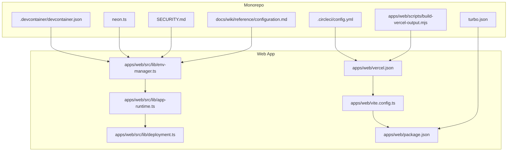
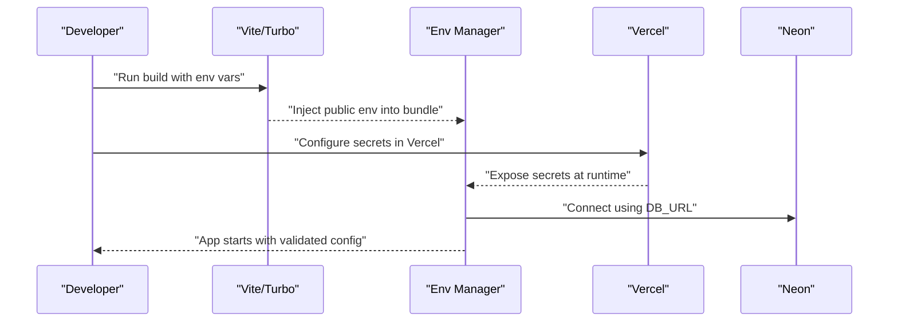
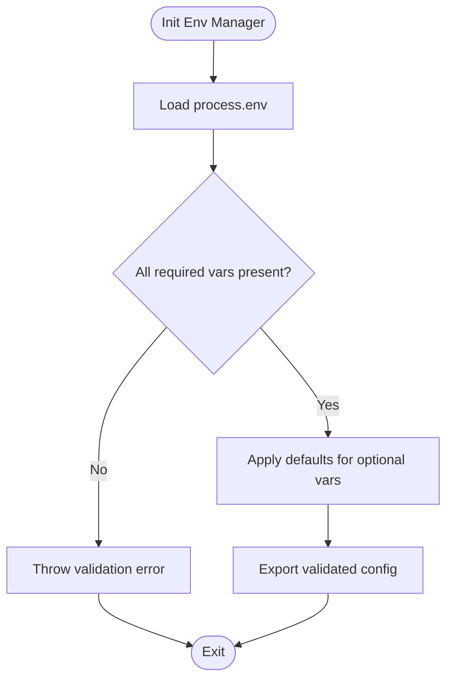
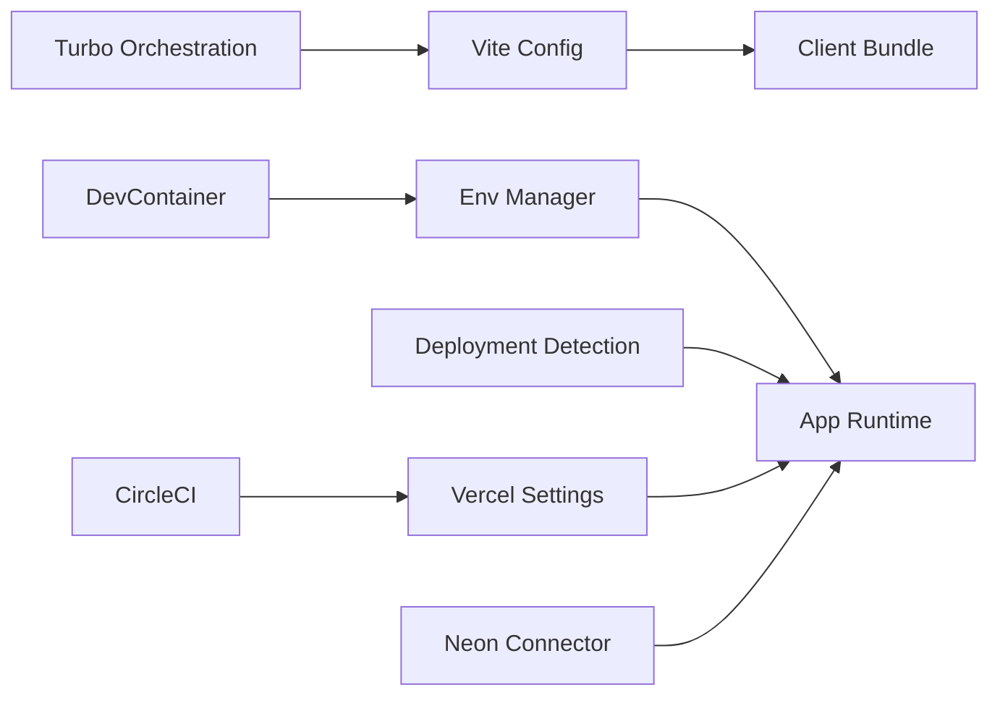

# Environment Configuration

<cite>
**Referenced Files in This Document**
- [vercel.json](file://apps/web/vercel.json)
- [vite.config.ts](file://apps/web/vite.config.ts)
- [env-manager.ts](file://apps/web/src/lib/env-manager.ts)
- [app-runtime.ts](file://apps/web/src/lib/app-runtime.ts)
- [deployment.ts](file://apps/web/src/lib/deployment.ts)
- [package.json](file://apps/web/package.json)
- [neon.ts](file://neon.ts)
- [.circleci/config.yml](file://.circleci/config.yml)
- [devcontainer.json](file://.devcontainer/devcontainer.json)
- [turbo.json](file://turbo.json)
- [SECURITY.md](file://SECURITY.md)
- [docs/wiki/reference/configuration.md](file://docs/wiki/reference/configuration.md)
- [scripts/build-vercel-output.mjs](file://apps/web/scripts/build-vercel-output.mjs)
</cite>

## Table of Contents

1. [Introduction](#introduction)
2. [Project Structure](#project-structure)
3. [Core Components](#core-components)
4. [Architecture Overview](#architecture-overview)
5. [Detailed Component Analysis](#detailed-component-analysis)
6. [Dependency Analysis](#dependency-analysis)
7. [Performance Considerations](#performance-considerations)
8. [Troubleshooting Guide](#troubleshooting-guide)
9. [Conclusion](#conclusion)
10. [Appendices](#appendices)

## Introduction

This document explains Fleet Pi’s environment configuration management across development, staging, and production environments. It covers Vercel project settings, environment variable organization, runtime configuration patterns, environment detection logic, configuration validation, default value handling, database connection strings, API keys, third-party service credentials, feature flags, environment-specific build optimizations, asset hosting configuration, domain routing, security best practices for secret management, environment isolation, credential rotation, local development setup, Docker environment configuration, and container orchestration settings.

## Project Structure

Fleet Pi is a monorepo with the web application under apps/web. Environment configuration spans:

- Build-time configuration (Vite, Turbo)
- Runtime configuration (environment variables, env manager)
- Deployment configuration (Vercel, CI/CD)
- Local development (DevContainer)
- Database connectivity (Neon)

**Diagram sources**

- [vercel.json](file://apps/web/vercel.json)
- [vite.config.ts](file://apps/web/vite.config.ts)
- [env-manager.ts](file://apps/web/src/lib/env-manager.ts)
- [app-runtime.ts](file://apps/web/src/lib/app-runtime.ts)
- [deployment.ts](file://apps/web/src/lib/deployment.ts)
- [package.json](file://apps/web/package.json)
- [turbo.json](file://turbo.json)
- [.circleci/config.yml](file://.circleci/config.yml)
- [devcontainer.json](file://.devcontainer/devcontainer.json)
- [neon.ts](file://neon.ts)
- [SECURITY.md](file://SECURITY.md)
- [docs/wiki/reference/configuration.md](file://docs/wiki/reference/configuration.md)
- [build-vercel-output.mjs](file://apps/web/scripts/build-vercel-output.mjs)

**Section sources**

- [vercel.json](file://apps/web/vercel.json)
- [vite.config.ts](file://apps/web/vite.config.ts)
- [env-manager.ts](file://apps/web/src/lib/env-manager.ts)
- [app-runtime.ts](file://apps/web/src/lib/app-runtime.ts)
- [deployment.ts](file://apps/web/src/lib/deployment.ts)
- [package.json](file://apps/web/package.json)
- [turbo.json](file://turbo.json)
- [.circleci/config.yml](file://.circleci/config.yml)
- [devcontainer.json](file://.devcontainer/devcontainer.json)
- [neon.ts](file://neon.ts)
- [SECURITY.md](file://SECURITY.md)
- [docs/wiki/reference/configuration.md](file://docs/wiki/reference/configuration.md)
- [build-vercel-output.mjs](file://apps/web/scripts/build-vercel-output.mjs)

## Core Components

- Environment Manager: Centralizes environment variable access, validation, and defaults at runtime.
- App Runtime: Exposes environment-aware runtime metadata to the application.
- Deployment Detection: Determines deployment target (e.g., Vercel preview vs production).
- Build Configuration: Vite and package scripts define how environment variables are injected and optimized per environment.
- Vercel Configuration: Defines domains, redirects, rewrites, and environment variables for deployments.
- Database Connector: Neon integration for database connections using environment variables.
- CI/CD and DevContainer: Provide consistent environments for builds and local development.

Key responsibilities:

- Validate required variables and fail fast on misconfiguration.
- Provide safe defaults for non-sensitive settings.
- Separate secrets from public config.
- Enable feature flags via environment variables.
- Optimize assets and bundles per environment.

**Section sources**

- [env-manager.ts](file://apps/web/src/lib/env-manager.ts)
- [app-runtime.ts](file://apps/web/src/lib/app-runtime.ts)
- [deployment.ts](file://apps/web/src/lib/deployment.ts)
- [vite.config.ts](file://apps/web/vite.config.ts)
- [package.json](file://apps/web/package.json)
- [vercel.json](file://apps/web/vercel.json)
- [neon.ts](file://neon.ts)

## Architecture Overview

The environment configuration architecture follows a layered approach:

- Build-time layer injects environment variables into the bundle based on Vite and package scripts.
- Runtime layer reads process.env and validates against expected schemas.
- Deployment layer detects where the app runs and adjusts behavior accordingly.
- Secrets are managed through platform-specific mechanisms (Vercel project settings, CI/CD secrets, local .env files).

**Diagram sources**

- [vite.config.ts](file://apps/web/vite.config.ts)
- [env-manager.ts](file://apps/web/src/lib/env-manager.ts)
- [vercel.json](file://apps/web/vercel.json)
- [neon.ts](file://neon.ts)

**Section sources**

- [vite.config.ts](file://apps/web/vite.config.ts)
- [env-manager.ts](file://apps/web/src/lib/env-manager.ts)
- [vercel.json](file://apps/web/vercel.json)
- [neon.ts](file://neon.ts)

## Detailed Component Analysis

### Environment Manager

Responsibilities:

- Define typed environment variables with defaults and validation rules.
- Provide getters for sensitive and non-sensitive values.
- Fail fast when required variables are missing or invalid.

Patterns:

- Strict mode for production to enforce presence of secrets.
- Graceful fallbacks for optional features.
- Centralized error messages for debugging.

**Diagram sources**

- [env-manager.ts](file://apps/web/src/lib/env-manager.ts)

**Section sources**

- [env-manager.ts](file://apps/web/src/lib/env-manager.ts)

### App Runtime

Responsibilities:

- Expose runtime metadata such as environment name, version, and feature flags.
- Provide utilities to check if running in browser/server contexts.
- Integrate with environment manager to read configuration safely.

Usage:

- Feature toggles controlled by environment variables.
- Conditional logging and analytics initialization.

**Section sources**

- [app-runtime.ts](file://apps/web/src/lib/app-runtime.ts)

### Deployment Detection

Responsibilities:

- Detect deployment target (e.g., Vercel preview, staging, production).
- Adjust behavior based on detected environment (e.g., enable debug logs in previews).

Implementation:

- Inspect hostnames and environment variables set by the platform.
- Normalize environment names for consistent behavior.

**Section sources**

- [deployment.ts](file://apps/web/src/lib/deployment.ts)

### Build Configuration (Vite and Package Scripts)

Responsibilities:

- Inject environment variables into the client bundle.
- Define environment-specific build flags.
- Optimize assets and code splitting per environment.

Key points:

- Public-only variables are exposed to the client.
- Secrets must not be baked into the bundle.
- Use Vite’s env prefixing to control exposure.

**Section sources**

- [vite.config.ts](file://apps/web/vite.config.ts)
- [package.json](file://apps/web/package.json)

### Vercel Configuration

Responsibilities:

- Configure domains, redirects, rewrites, and headers.
- Map environment variables to Vercel project settings.
- Control build outputs and caching behavior.

Best practices:

- Use Vercel’s environment variables for secrets.
- Leverage preview deployments with isolated variables.
- Set appropriate cache-control headers for static assets.

**Section sources**

- [vercel.json](file://apps/web/vercel.json)

### Database Connection (Neon)

Responsibilities:

- Manage database connection strings securely.
- Handle connection pooling and retries.
- Support multiple environments with separate databases.

Security:

- Store DB_URL in Vercel secrets.
- Avoid logging connection details.
- Rotate credentials regularly.

**Section sources**

- [neon.ts](file://neon.ts)

### CI/CD and DevContainer

Responsibilities:

- Standardize build and test environments.
- Provide local development parity with production.
- Automate environment validation during CI.

Local setup:

- DevContainer defines tools, Node version, and env setup.
- CircleCI runs checks and deploys with proper secrets.

**Section sources**

- [.circleci/config.yml](file://.circleci/config.yml)
- [devcontainer.json](file://.devcontainer/devcontainer.json)

### Monorepo Orchestration (Turbo)

Responsibilities:

- Coordinate builds across packages.
- Cache build artifacts for faster iterations.
- Enforce consistent environment usage across apps.

**Section sources**

- [turbo.json](file://turbo.json)

### Security Best Practices

Guidelines:

- Never commit secrets to version control.
- Use platform-native secret stores (Vercel, CI/CD).
- Rotate credentials periodically.
- Limit environment variable scope to necessary components.

References:

- Project security policy outlines handling of vulnerabilities and secrets.

**Section sources**

- [SECURITY.md](file://SECURITY.md)

### Reference Documentation

Guidelines:

- Central reference for configuration keys and their purposes.
- Examples of environment-specific overrides.

**Section sources**

- [docs/wiki/reference/configuration.md](file://docs/wiki/reference/configuration.md)

### Vercel Output Build Script

Purpose:

- Post-build adjustments for Vercel deployment.
- Ensure correct asset paths and environment readiness.

**Section sources**

- [build-vercel-output.mjs](file://apps/web/scripts/build-vercel-output.mjs)

## Dependency Analysis

Environment configuration dependencies:

- Vite depends on package scripts and env prefixes.
- Env manager depends on process.env and validation rules.
- Deployment detection depends on platform-provided variables.
- Database connector depends on secure connection strings.

**Diagram sources**

- [vite.config.ts](file://apps/web/vite.config.ts)
- [env-manager.ts](file://apps/web/src/lib/env-manager.ts)
- [deployment.ts](file://apps/web/src/lib/deployment.ts)
- [vercel.json](file://apps/web/vercel.json)
- [neon.ts](file://neon.ts)
- [turbo.json](file://turbo.json)
- [.circleci/config.yml](file://.circleci/config.yml)
- [devcontainer.json](file://.devcontainer/devcontainer.json)

**Section sources**

- [vite.config.ts](file://apps/web/vite.config.ts)
- [env-manager.ts](file://apps/web/src/lib/env-manager.ts)
- [deployment.ts](file://apps/web/src/lib/deployment.ts)
- [vercel.json](file://apps/web/vercel.json)
- [neon.ts](file://neon.ts)
- [turbo.json](file://turbo.json)
- [.circleci/config.yml](file://.circleci/config.yml)
- [devcontainer.json](file://.devcontainer/devcontainer.json)

## Performance Considerations

- Minimize client-side environment variables to reduce bundle size.
- Use environment-specific builds to exclude unused features.
- Enable compression and caching for static assets in production.
- Prefer lazy loading for heavy modules gated by feature flags.
- Optimize database connections with pooling and connection reuse.

[No sources needed since this section provides general guidance]

## Troubleshooting Guide

Common issues:

- Missing environment variables cause runtime errors; ensure all required vars are set in Vercel and local .env.
- Incorrect env prefixes prevent variables from being injected into the client bundle.
- Database connection failures due to malformed connection strings or network restrictions.
- Preview deployments inheriting production secrets inadvertently.

Debugging steps:

- Log environment names and feature flags at startup.
- Validate env schema early in the application lifecycle.
- Check Vercel environment variable scopes and branch-specific settings.
- Verify CI/CD secrets are correctly mapped.

**Section sources**

- [env-manager.ts](file://apps/web/src/lib/env-manager.ts)
- [vercel.json](file://apps/web/vercel.json)
- [neon.ts](file://neon.ts)

## Conclusion

Fleet Pi’s environment configuration is designed for clarity, security, and scalability. By centralizing validation, leveraging platform-native secret management, and separating build-time from runtime concerns, the system supports robust deployments across development, staging, and production. Adhering to the documented best practices ensures reliable operation and maintainability.

[No sources needed since this section summarizes without analyzing specific files]

## Appendices

### Environment Variable Categories

- Public variables: Safe to expose to the client (e.g., feature flags, analytics IDs).
- Private variables: Secrets that must remain server-side (e.g., DB_URL, API keys).
- Optional variables: Non-critical settings with sensible defaults.

### Domain Routing and Asset Hosting

- Configure domains and redirects in Vercel for clean URLs.
- Use CDN caching for static assets and set appropriate cache headers.
- Isolate preview deployments with unique subdomains.

### Credential Rotation

- Rotate secrets regularly and update Vercel project settings.
- Use short-lived tokens where possible.
- Audit access logs for unauthorized usage.

[No sources needed since this section provides general guidance]
