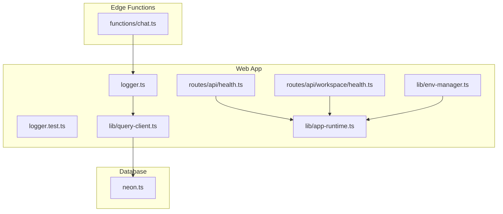
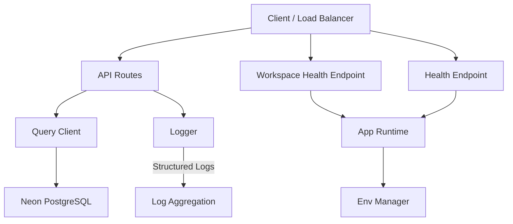
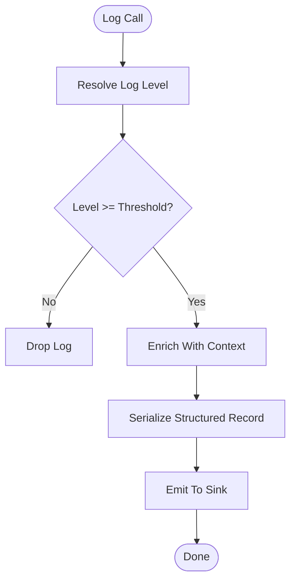
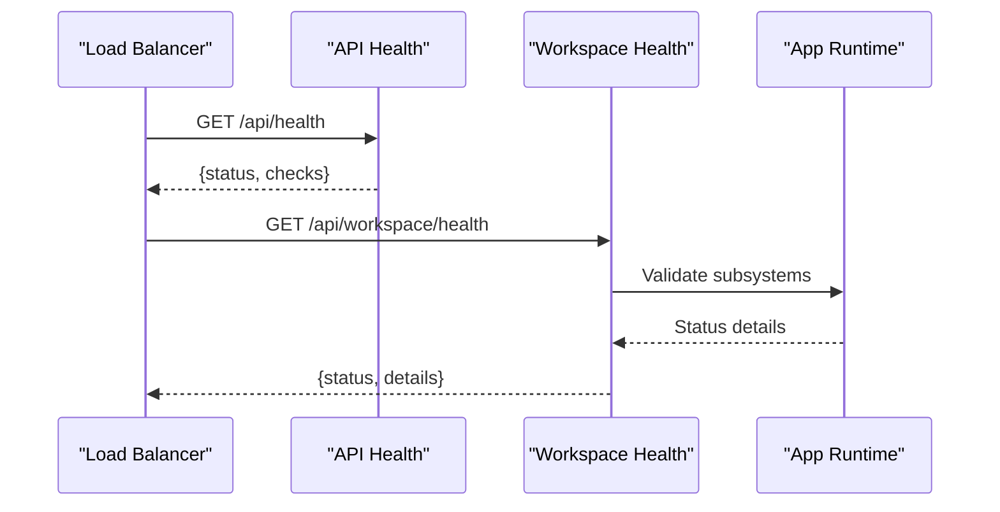
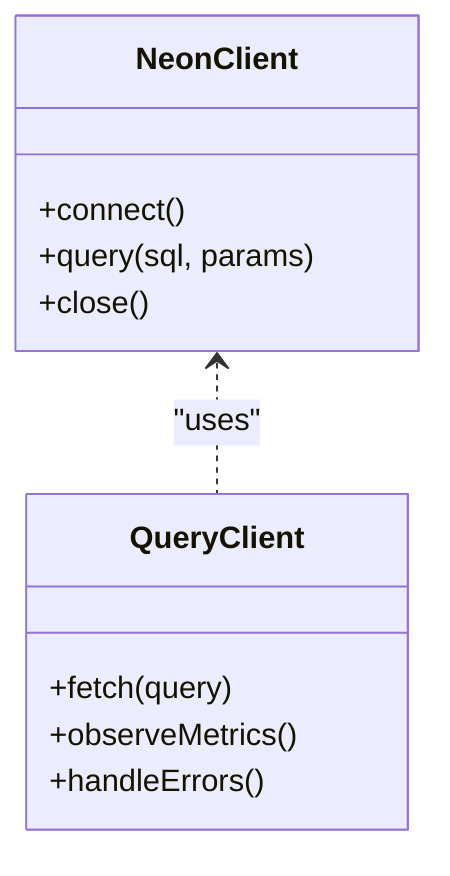
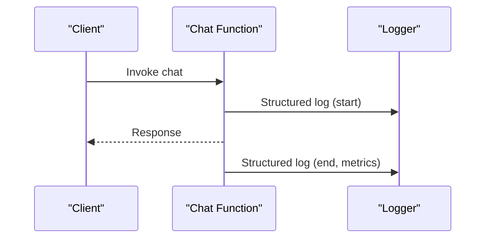
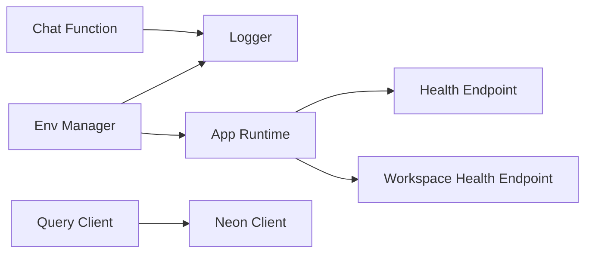

# Monitoring & Observability

<cite>
**Referenced Files in This Document**
- [logger.ts](file://apps/web/src/lib/logger.ts)
- [logger.test.ts](file://apps/web/src/lib/logger.test.ts)
- [health.ts](file://apps/web/src/routes/api/health.ts)
- [workspace-health.ts](file://apps/web/src/routes/api/workspace/health.ts)
- [neon.ts](file://neon.ts)
- [query-client.ts](file://apps/web/src/lib/query-client.ts)
- [env-manager.ts](file://apps/web/src/lib/env-manager.ts)
- [app-runtime.ts](file://apps/web/src/lib/app-runtime.ts)
- [chat.ts](file://functions/chat.ts)
- [index.md](file://docs/wiki/apps/web/index.md)
- [architecture.md](file://docs/architecture.md)
- [deployment.md](file://docs/deployment.md)
- [runbooks.md](file://docs/runbooks.md)
- [security.md](file://docs/wiki/security.md)
- [configuration.md](file://docs/wiki/reference/configuration.md)
</cite>

## Table of Contents

1. Introduction
2. Project Structure
3. Core Components
4. Architecture Overview
5. Detailed Component Analysis
6. Dependency Analysis
7. Performance Considerations
8. Troubleshooting Guide
9. Conclusion

## Introduction

This document describes Fleet Pi’s monitoring and observability infrastructure with a focus on:

- Logging strategy (structured logging, levels, aggregation)
- Analytics for user behavior, performance metrics, and error reporting
- Database monitoring using Neon PostgreSQL (queries, connection pools)
- Application health checks, uptime monitoring, and alerting
- Distributed tracing, profiling, and debugging utilities
- Log retention, data privacy, and compliance considerations
- Incident response, on-call escalation, and post-mortem processes

The goal is to provide both technical depth and accessible guidance for engineers, operators, and stakeholders.

## Project Structure

Fleet Pi organizes observability-related code primarily under the web application package and shared runtime modules:

- Structured logging implementation and tests
- Health check endpoints for API and workspace services
- Database client configuration for Neon PostgreSQL
- Query client setup for request-level metrics
- Environment and runtime configuration helpers
- Edge functions that may emit logs and metrics

**Diagram sources**

- [logger.ts](file://apps/web/src/lib/logger.ts)
- [logger.test.ts](file://apps/web/src/lib/logger.test.ts)
- [health.ts](file://apps/web/src/routes/api/health.ts)
- [workspace-health.ts](file://apps/web/src/routes/api/workspace/health.ts)
- [query-client.ts](file://apps/web/src/lib/query-client.ts)
- [env-manager.ts](file://apps/web/src/lib/env-manager.ts)
- [app-runtime.ts](file://apps/web/src/lib/app-runtime.ts)
- [neon.ts](file://neon.ts)
- [chat.ts](file://functions/chat.ts)

**Section sources**

- [index.md](file://docs/wiki/apps/web/index.md)
- [architecture.md](file://docs/architecture.md)

## Core Components

- Structured Logger: Centralized logging utility used across the app and edge functions, supporting structured fields and log levels.
- Health Endpoints: Dedicated routes exposing liveness/readiness signals for API and workspace components.
- Database Client: Configuration for Neon PostgreSQL connections and query execution.
- Query Client: Request/response instrumentation and metrics collection around data fetching.
- Environment/Runtime: Helpers for environment variables and runtime context that influence observability behavior.

Key responsibilities:

- Emit consistent, structured logs with contextual metadata
- Expose health status for orchestrators and load balancers
- Capture database connectivity and query performance indicators
- Instrument network requests for latency and error rates
- Provide configuration hooks for log levels and feature flags

**Section sources**

- [logger.ts](file://apps/web/src/lib/logger.ts)
- [logger.test.ts](file://apps/web/src/lib/logger.test.ts)
- [health.ts](file://apps/web/src/routes/api/health.ts)
- [workspace-health.ts](file://apps/web/src/routes/api/workspace/health.ts)
- [neon.ts](file://neon.ts)
- [query-client.ts](file://apps/web/src/lib/query-client.ts)
- [env-manager.ts](file://apps/web/src/lib/env-manager.ts)
- [app-runtime.ts](file://apps/web/src/lib/app-runtime.ts)

## Architecture Overview

Observability spans multiple layers:

- Application layer: structured logs, health endpoints, request instrumentation
- Data layer: Neon PostgreSQL client configuration and query metrics
- Edge/runtime: function-level logging and environment-driven behavior

**Diagram sources**

- [health.ts](file://apps/web/src/routes/api/health.ts)
- [workspace-health.ts](file://apps/web/src/routes/api/workspace/health.ts)
- [query-client.ts](file://apps/web/src/lib/query-client.ts)
- [neon.ts](file://neon.ts)
- [logger.ts](file://apps/web/src/lib/logger.ts)
- [env-manager.ts](file://apps/web/src/lib/env-manager.ts)
- [app-runtime.ts](file://apps/web/src/lib/app-runtime.ts)

## Detailed Component Analysis

### Structured Logging Strategy

- Purpose: Consistent, machine-readable logs with contextual fields (request IDs, user IDs, operation names).
- Levels: Standard severity levels (e.g., debug, info, warn, error) controlled via environment configuration.
- Context: Enrich logs with runtime metadata such as environment, version, and deployment identifiers.
- Aggregation: Logs are emitted in a structured format suitable for centralized ingestion by external systems.

**Diagram sources**

- [logger.ts](file://apps/web/src/lib/logger.ts)
- [env-manager.ts](file://apps/web/src/lib/env-manager.ts)

**Section sources**

- [logger.ts](file://apps/web/src/lib/logger.ts)
- [logger.test.ts](file://apps/web/src/lib/logger.test.ts)
- [env-manager.ts](file://apps/web/src/lib/env-manager.ts)

### Health Checks and Uptime Monitoring

- API Health: A dedicated endpoint returns service readiness and basic dependency status.
- Workspace Health: A separate endpoint validates workspace-specific subsystems.
- Integration: Orchestrators and load balancers poll these endpoints to manage traffic and scaling.

**Diagram sources**

- [health.ts](file://apps/web/src/routes/api/health.ts)
- [workspace-health.ts](file://apps/web/src/routes/api/workspace/health.ts)
- [app-runtime.ts](file://apps/web/src/lib/app-runtime.ts)

**Section sources**

- [health.ts](file://apps/web/src/routes/api/health.ts)
- [workspace-health.ts](file://apps/web/src/routes/api/workspace/health.ts)
- [app-runtime.ts](file://apps/web/src/lib/app-runtime.ts)

### Database Monitoring with Neon PostgreSQL

- Connection Management: The Neon client configures connection pooling and retry policies.
- Query Metrics: The query client captures timing and error information for executed queries.
- Observability Hooks: Enable slow query detection and error rate tracking at the client level.

**Diagram sources**

- [neon.ts](file://neon.ts)
- [query-client.ts](file://apps/web/src/lib/query-client.ts)

**Section sources**

- [neon.ts](file://neon.ts)
- [query-client.ts](file://apps/web/src/lib/query-client.ts)

### Analytics and Error Reporting

- User Behavior: Track key interactions through analytics events emitted from UI and API flows.
- Performance Metrics: Collect latency, throughput, and error rates via request instrumentation.
- Error Reporting: Aggregate errors with stack traces and contextual metadata for triage.

Note: Specific analytics providers and event schemas are configured via environment settings and runtime initialization.

**Section sources**

- [app-runtime.ts](file://apps/web/src/lib/app-runtime.ts)
- [env-manager.ts](file://apps/web/src/lib/env-manager.ts)

### Edge Function Observability

- Chat Function: Emits structured logs for chat operations and integrates with the central logger.
- Metrics: Captures invocation duration and error outcomes for operational dashboards.

**Diagram sources**

- [chat.ts](file://functions/chat.ts)
- [logger.ts](file://apps/web/src/lib/logger.ts)

**Section sources**

- [chat.ts](file://functions/chat.ts)
- [logger.ts](file://apps/web/src/lib/logger.ts)

## Dependency Analysis

Observability components depend on environment configuration and runtime context:

- Logger depends on environment variables for log level and output sinks.
- Health endpoints rely on runtime validation logic.
- Query client depends on the database client for telemetry.
- Edge functions use the logger for consistent output.

**Diagram sources**

- [env-manager.ts](file://apps/web/src/lib/env-manager.ts)
- [logger.ts](file://apps/web/src/lib/logger.ts)
- [app-runtime.ts](file://apps/web/src/lib/app-runtime.ts)
- [health.ts](file://apps/web/src/routes/api/health.ts)
- [workspace-health.ts](file://apps/web/src/routes/api/workspace/health.ts)
- [query-client.ts](file://apps/web/src/lib/query-client.ts)
- [neon.ts](file://neon.ts)
- [chat.ts](file://functions/chat.ts)

**Section sources**

- [env-manager.ts](file://apps/web/src/lib/env-manager.ts)
- [logger.ts](file://apps/web/src/lib/logger.ts)
- [app-runtime.ts](file://apps/web/src/lib/app-runtime.ts)
- [health.ts](file://apps/web/src/routes/api/health.ts)
- [workspace-health.ts](file://apps/web/src/routes/api/workspace/health.ts)
- [query-client.ts](file://apps/web/src/lib/query-client.ts)
- [neon.ts](file://neon.ts)
- [chat.ts](file://functions/chat.ts)

## Performance Considerations

- Logging overhead: Ensure log sampling or throttling for high-volume environments.
- Health checks: Keep responses lightweight; avoid heavy dependency checks in frequent polls.
- Database queries: Use indexes and prepared statements; monitor slow queries and connection pool saturation.
- Request instrumentation: Limit payload sizes in metrics; aggregate where possible.

[No sources needed since this section provides general guidance]

## Troubleshooting Guide

Common issues and remedies:

- Missing logs: Verify log level configuration and environment variables.
- Health check failures: Inspect dependency statuses returned by health endpoints.
- Database errors: Check connection pool settings and query timeouts.
- Edge function errors: Review structured logs and error payloads for root causes.

Operational references:

- Deployment runbooks for release gates and rollback procedures
- Security guidelines for handling sensitive data in logs and metrics

**Section sources**

- [logger.ts](file://apps/web/src/lib/logger.ts)
- [health.ts](file://apps/web/src/routes/api/health.ts)
- [workspace-health.ts](file://apps/web/src/routes/api/workspace/health.ts)
- [neon.ts](file://neon.ts)
- [query-client.ts](file://apps/web/src/lib/query-client.ts)
- [runbooks.md](file://docs/runbooks.md)
- [security.md](file://docs/wiki/security.md)

## Conclusion

Fleet Pi’s observability stack centers on structured logging, robust health endpoints, and database/client instrumentation. By standardizing log formats, configuring appropriate log levels, and integrating with centralized aggregation systems, teams can achieve reliable monitoring, rapid incident response, and continuous improvement. Adhering to privacy and compliance requirements ensures responsible data handling across all observability pipelines.

[No sources needed since this section summarizes without analyzing specific files]
