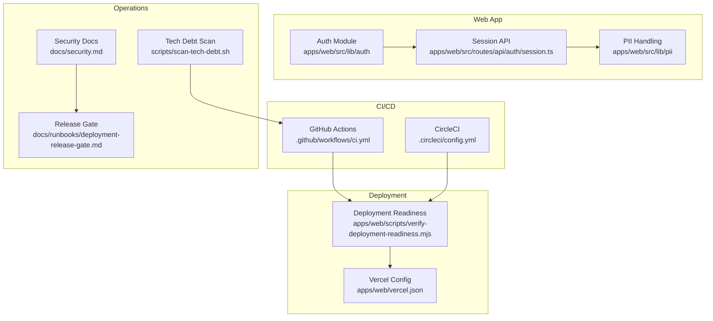
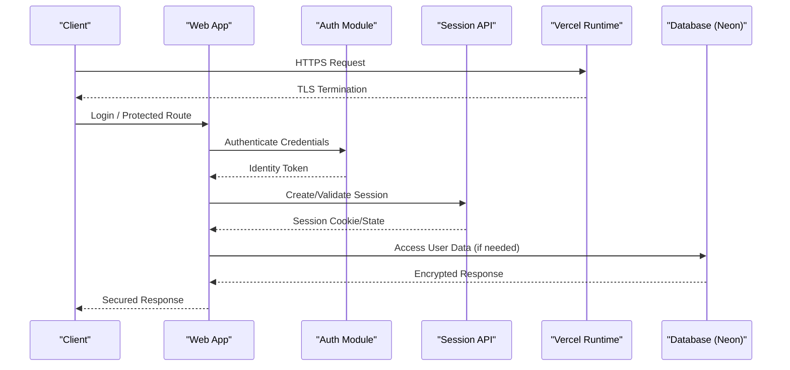
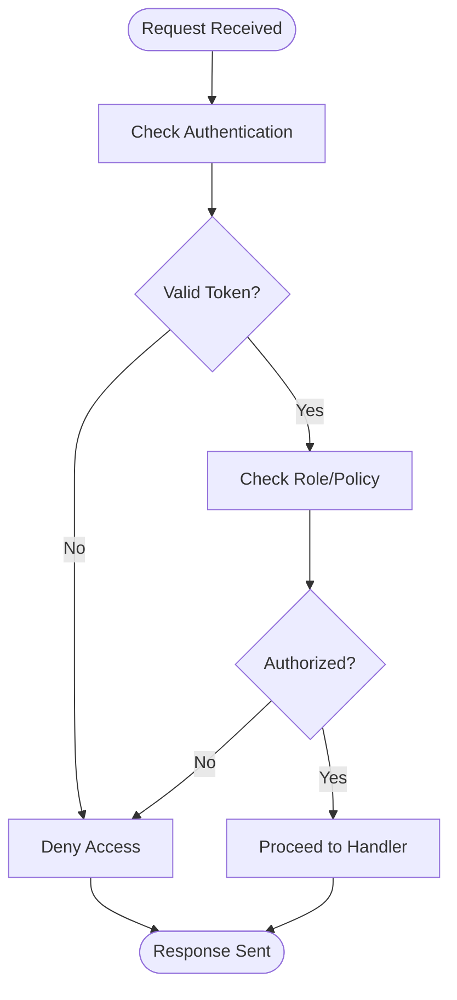
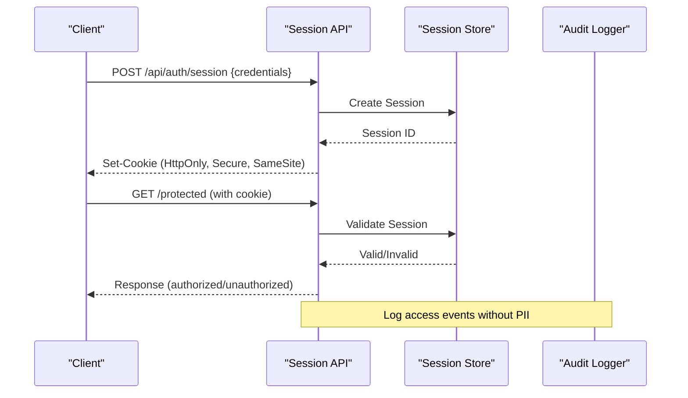
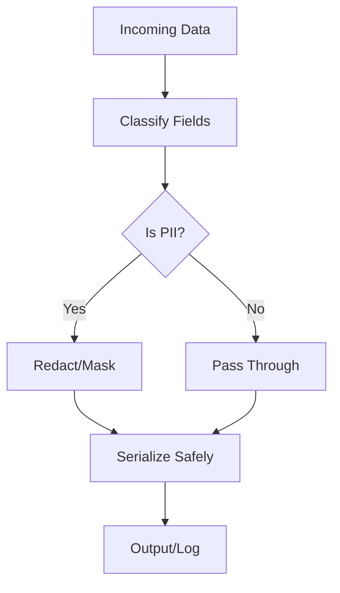
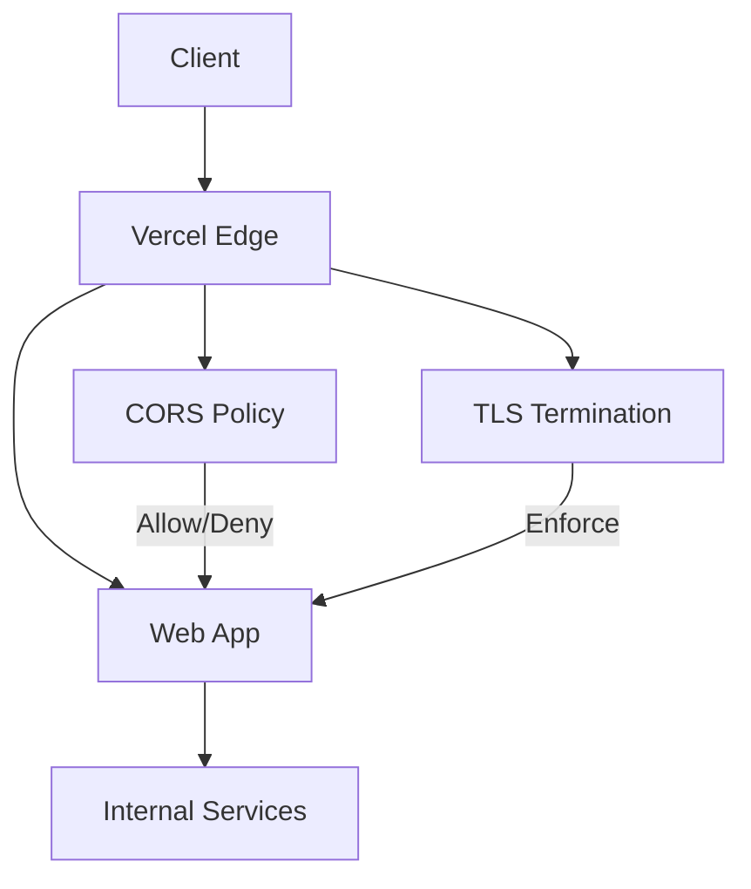
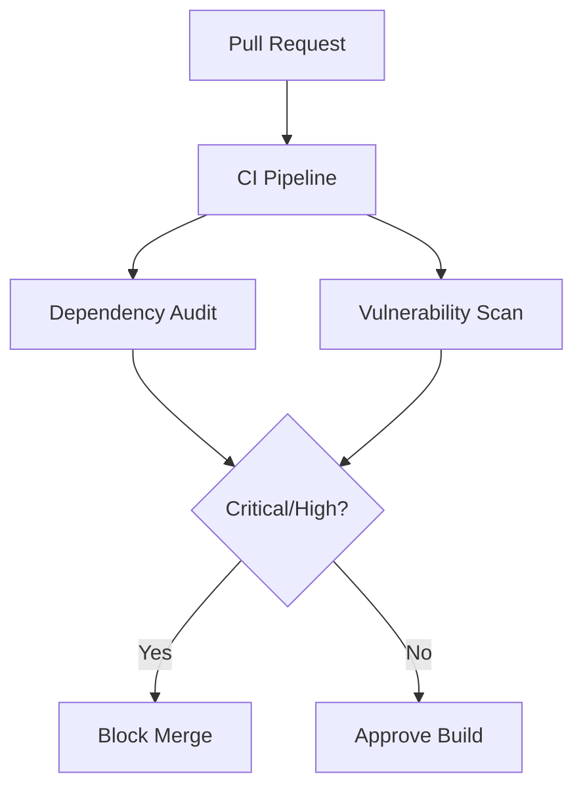
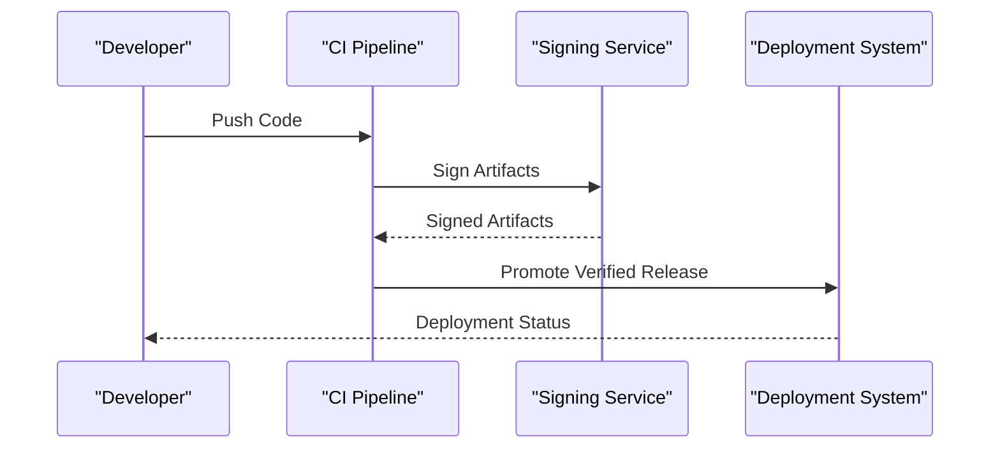
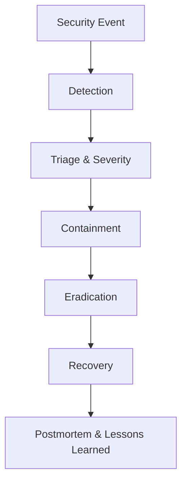
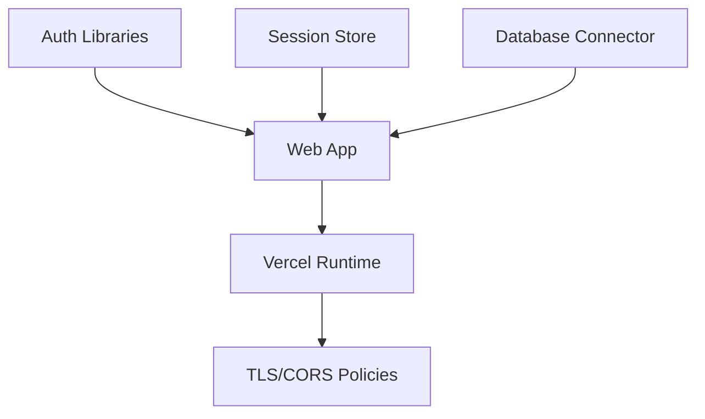

# Security & Deployment

<cite>
**Referenced Files in This Document**
- [SECURITY.md](file://SECURITY.md)
- [docs/security.md](file://docs/security.md)
- [apps/web/vercel.json](file://apps/web/vercel.json)
- [apps/web/src/lib/auth/index.ts](file://apps/web/src/lib/auth/index.ts)
- [apps/web/src/routes/api/auth/session.ts](file://apps/web/src/routes/api/auth/session.ts)
- [apps/web/src/lib/pii/index.ts](file://apps/web/src/lib/pii/index.ts)
- [apps/web/src/lib/deployment.ts](file://apps/web/src/lib/deployment.ts)
- [apps/web/scripts/verify-deployment-readiness.mjs](file://apps/web/scripts/verify-deployment-readiness.mjs)
- [.github/workflows/ci.yml](file://.github/workflows/ci.yml)
- [.circleci/config.yml](file://.circleci/config.yml)
- [neon.ts](file://neon.ts)
- [scripts/scan-tech-debt.sh](file://scripts/scan-tech-debt.sh)
- [docs/runbooks/deployment-release-gate.md](file://docs/runbooks/deployment-release-gate.md)
</cite>

## Table of Contents

1. [Introduction](#introduction)
2. [Project Structure](#project-structure)
3. [Core Components](#core-components)
4. [Architecture Overview](#architecture-overview)
5. [Detailed Component Analysis](#detailed-component-analysis)
6. [Dependency Analysis](#dependency-analysis)
7. [Performance Considerations](#performance-considerations)
8. [Troubleshooting Guide](#troubleshooting-guide)
9. [Conclusion](#conclusion)
10. [Appendices](#appendices)

## Introduction

This document provides a comprehensive security and deployment guide for Fleet Pi. It covers authentication and authorization, session management, access control, PII handling, encryption strategies, network security (SSL/TLS, CORS, firewall), vulnerability scanning, dependency auditing, patching procedures, backup and disaster recovery, data retention, compliance considerations, deployment security (signed releases, supply chain, environment hardening), incident response, monitoring, and audit logging. The guidance is grounded in the repository’s configuration, scripts, and documentation to ensure operational accuracy.

## Project Structure

Fleet Pi organizes security-related concerns across application code, deployment configuration, CI/CD pipelines, and operational runbooks:

- Application security logic resides under apps/web/src/lib/auth and apps/web/src/lib/pii.
- API endpoints for sessions and authentication are defined under apps/web/src/routes/api/auth.
- Deployment configuration is centralized in apps/web/vercel.json and related scripts.
- CI/CD pipelines are configured via .github/workflows and .circleci/config.yml.
- Operational guidance and policies are documented in docs/security.md and docs/runbooks.

**Diagram sources**

- [apps/web/src/lib/auth/index.ts](file://apps/web/src/lib/auth/index.ts)
- [apps/web/src/routes/api/auth/session.ts](file://apps/web/src/routes/api/auth/session.ts)
- [apps/web/src/lib/pii/index.ts](file://apps/web/src/lib/pii/index.ts)
- [apps/web/vercel.json](file://apps/web/vercel.json)
- [apps/web/scripts/verify-deployment-readiness.mjs](file://apps/web/scripts/verify-deployment-readiness.mjs)
- [.github/workflows/ci.yml](file://.github/workflows/ci.yml)
- [.circleci/config.yml](file://.circleci/config.yml)
- [docs/security.md](file://docs/security.md)
- [docs/runbooks/deployment-release-gate.md](file://docs/runbooks/deployment-release-gate.md)
- [scripts/scan-tech-debt.sh](file://scripts/scan-tech-debt.sh)

**Section sources**

- [docs/security.md](file://docs/security.md)
- [apps/web/vercel.json](file://apps/web/vercel.json)
- [apps/web/src/lib/auth/index.ts](file://apps/web/src/lib/auth/index.ts)
- [apps/web/src/routes/api/auth/session.ts](file://apps/web/src/routes/api/auth/session.ts)
- [apps/web/src/lib/pii/index.ts](file://apps/web/src/lib/pii/index.ts)
- [.github/workflows/ci.yml](file://.github/workflows/ci.yml)
- [.circleci/config.yml](file://.circleci/config.yml)
- [scripts/scan-tech-debt.sh](file://scripts/scan-tech-debt.sh)
- [docs/runbooks/deployment-release-gate.md](file://docs/runbooks/deployment-release-gate.md)

## Core Components

- Authentication and Authorization: Centralized auth module and session API enforce identity verification and role-based access where applicable.
- Session Management: Secure session creation, validation, and lifecycle handled by the session endpoint and supporting utilities.
- PII Data Handling: Dedicated PII utilities manage sensitive data classification, minimization, and safe processing.
- Deployment Configuration: Vercel settings define runtime security posture including headers and environment constraints.
- CI/CD Gates: Automated checks validate deployment readiness and perform security scans before release.

**Section sources**

- [apps/web/src/lib/auth/index.ts](file://apps/web/src/lib/auth/index.ts)
- [apps/web/src/routes/api/auth/session.ts](file://apps/web/src/routes/api/auth/session.ts)
- [apps/web/src/lib/pii/index.ts](file://apps/web/src/lib/pii/index.ts)
- [apps/web/vercel.json](file://apps/web/vercel.json)
- [apps/web/scripts/verify-deployment-readiness.mjs](file://apps/web/scripts/verify-deployment-readiness.mjs)

## Architecture Overview

The security architecture integrates client-side protections, server-side authentication, secure session handling, and strict deployment gates. Network security is enforced at the platform layer (Vercel) with TLS termination and header controls. CI/CD pipelines enforce policy checks and vulnerability scans prior to promotion.

**Diagram sources**

- [apps/web/src/lib/auth/index.ts](file://apps/web/src/lib/auth/index.ts)
- [apps/web/src/routes/api/auth/session.ts](file://apps/web/src/routes/api/session.ts)
- [apps/web/vercel.json](file://apps/web/vercel.json)
- [neon.ts](file://neon.ts)

**Section sources**

- [apps/web/vercel.json](file://apps/web/vercel.json)
- [neon.ts](file://neon.ts)

## Detailed Component Analysis

### Authentication and Authorization

- Responsibilities: Validate user credentials, issue tokens or session identifiers, enforce access control on protected routes.
- Implementation patterns: Centralized auth module abstracts provider integrations; route guards check identity and roles.
- Best practices: Enforce least privilege, rotate secrets, and log failed attempts without exposing sensitive details.

**Diagram sources**

- [apps/web/src/lib/auth/index.ts](file://apps/web/src/lib/auth/index.ts)
- [apps/web/src/routes/api/auth/session.ts](file://apps/web/src/routes/api/auth/session.ts)

**Section sources**

- [apps/web/src/lib/auth/index.ts](file://apps/web/src/lib/auth/index.ts)
- [apps/web/src/routes/api/auth/session.ts](file://apps/web/src/routes/api/auth/session.ts)

### Session Management

- Responsibilities: Create secure sessions, validate on each request, handle expiration and revocation.
- Implementation patterns: HTTP-only cookies, short-lived tokens, secure flags, and CSRF protection where applicable.
- Lifecycle: Creation upon successful login, renewal strategies, and cleanup of orphaned sessions.

**Diagram sources**

- [apps/web/src/routes/api/auth/session.ts](file://apps/web/src/routes/api/auth/session.ts)

**Section sources**

- [apps/web/src/routes/api/auth/session.ts](file://apps/web/src/routes/api/auth/session.ts)

### PII Data Handling

- Responsibilities: Classify sensitive fields, minimize exposure, and apply safe serialization/redaction.
- Implementation patterns: PII utilities wrap data transformations to strip or mask sensitive attributes before logging or responses.
- Policies: Default deny for PII in logs; explicit allowlist for required fields; encryption at rest for storage.

**Diagram sources**

- [apps/web/src/lib/pii/index.ts](file://apps/web/src/lib/pii/index.ts)

**Section sources**

- [apps/web/src/lib/pii/index.ts](file://apps/web/src/lib/pii/index.ts)

### Network Security (SSL/TLS, CORS, Firewall)

- SSL/TLS: Enforced at the platform boundary (Vercel); ensure HSTS and modern cipher suites.
- CORS: Configure allowed origins, methods, and headers; restrict to known domains.
- Firewall: Use platform-level IP allowlists and rate limiting; avoid exposing internal services directly.

**Diagram sources**

- [apps/web/vercel.json](file://apps/web/vercel.json)

**Section sources**

- [apps/web/vercel.json](file://apps/web/vercel.json)

### Vulnerability Scanning and Dependency Auditing

- Tools: Automated scans in CI/CD for known vulnerabilities; lockfiles pinned; regular audits.
- Procedures: Fail builds on critical/high severity; track remediation SLAs; maintain an inventory of dependencies.
- Integration: GitHub Actions and CircleCI execute scans and report results.

**Diagram sources**

- [.github/workflows/ci.yml](file://.github/workflows/ci.yml)
- [.circleci/config.yml](file://.circleci/config.yml)
- [scripts/scan-tech-debt.sh](file://scripts/scan-tech-debt.sh)

**Section sources**

- [.github/workflows/ci.yml](file://.github/workflows/ci.yml)
- [.circleci/config.yml](file://.circleci/config.yml)
- [scripts/scan-tech-debt.sh](file://scripts/scan-tech-debt.sh)

### Backup and Disaster Recovery

- Strategies: Regular snapshots of databases and critical artifacts; encrypted backups stored offsite.
- Recovery: Documented RTO/RPO targets; test restore procedures periodically.
- Retention: Define retention periods aligned with compliance requirements.

[No sources needed since this section provides general guidance]

### Data Retention and Compliance

- Policies: Define retention windows for logs, sessions, and user data; implement automated purging.
- Compliance: Align with frameworks such as GDPR, SOC 2; maintain evidence of controls and audits.
- Documentation: Maintain up-to-date security policies and incident response plans.

**Section sources**

- [docs/security.md](file://docs/security.md)

### Deployment Security (Signed Releases, Supply Chain, Environment Hardening)

- Signed Releases: Ensure build artifacts are signed and verified pre-deployment.
- Supply Chain: Pin versions, use trusted registries, and scan images/packages.
- Environment Hardening: Minimize permissions, use secret managers, and enforce runtime policies.

**Diagram sources**

- [docs/runbooks/deployment-release-gate.md](file://docs/runbooks/deployment-release-gate.md)
- [apps/web/scripts/verify-deployment-readiness.mjs](file://apps/web/scripts/verify-deployment-readiness.mjs)

**Section sources**

- [docs/runbooks/deployment-release-gate.md](file://docs/runbooks/deployment-release-gate.md)
- [apps/web/scripts/verify-deployment-readiness.mjs](file://apps/web/scripts/verify-deployment-readiness.mjs)

### Incident Response, Monitoring, and Audit Logging

- Monitoring: Centralized metrics and alerts for anomalies; track auth failures and session issues.
- Audit Logging: Record access events, configuration changes, and data operations without PII.
- Response: Playbooks for containment, eradication, recovery, and postmortem analysis.

[No sources needed since this section provides general guidance]

## Dependency Analysis

Security-critical dependencies include authentication libraries, session stores, and database connectors. Their configurations and update cadence impact overall security posture.

**Diagram sources**

- [apps/web/src/lib/auth/index.ts](file://apps/web/src/lib/auth/index.ts)
- [apps/web/src/routes/api/auth/session.ts](file://apps/web/src/routes/api/auth/session.ts)
- [neon.ts](file://neon.ts)
- [apps/web/vercel.json](file://apps/web/vercel.json)

**Section sources**

- [apps/web/src/lib/auth/index.ts](file://apps/web/src/lib/auth/index.ts)
- [apps/web/src/routes/api/auth/session.ts](file://apps/web/src/routes/api/auth/session.ts)
- [neon.ts](file://neon.ts)
- [apps/web/vercel.json](file://apps/web/vercel.json)

## Performance Considerations

- Optimize session validation to reduce latency; cache non-sensitive metadata where appropriate.
- Avoid logging PII to prevent overhead and privacy risks.
- Use efficient serialization and redaction strategies for large payloads.

[No sources needed since this section provides general guidance]

## Troubleshooting Guide

- Authentication failures: Verify credentials, token validity, and session state; check audit logs for error codes.
- CORS errors: Inspect origin headers and platform CORS configuration; ensure allowed methods and headers match requests.
- Deployment readiness: Run verification scripts to confirm environment variables, secrets, and dependencies are correct.

**Section sources**

- [apps/web/scripts/verify-deployment-readiness.mjs](file://apps/web/scripts/verify-deployment-readiness.mjs)

## Conclusion

Fleet Pi’s security model integrates robust authentication, secure session management, careful PII handling, and strong deployment gates. By enforcing network security at the platform layer, automating vulnerability scans, and maintaining clear operational runbooks, the system achieves a resilient security posture. Continuous improvement through monitoring, auditing, and compliance alignment ensures long-term safety and reliability.

[No sources needed since this section summarizes without analyzing specific files]

## Appendices

- Security Policy Reference: See docs/security.md for detailed policies and procedures.
- Deployment Release Gate: Follow docs/runbooks/deployment-release-gate.md for controlled releases.
- Tech Debt Scanning: Use scripts/scan-tech-debt.sh to identify and prioritize remediation tasks.

**Section sources**

- [docs/security.md](file://docs/security.md)
- [docs/runbooks/deployment-release-gate.md](file://docs/runbooks/deployment-release-gate.md)
- [scripts/scan-tech-debt.sh](file://scripts/scan-tech-debt.sh)
