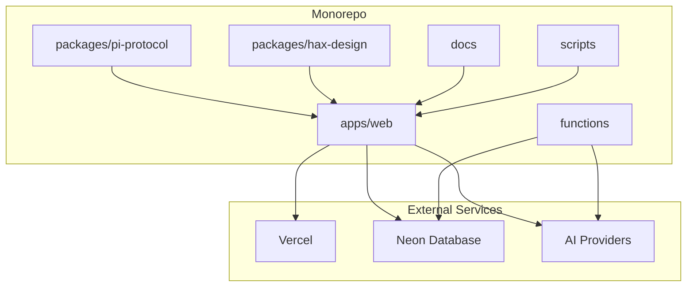
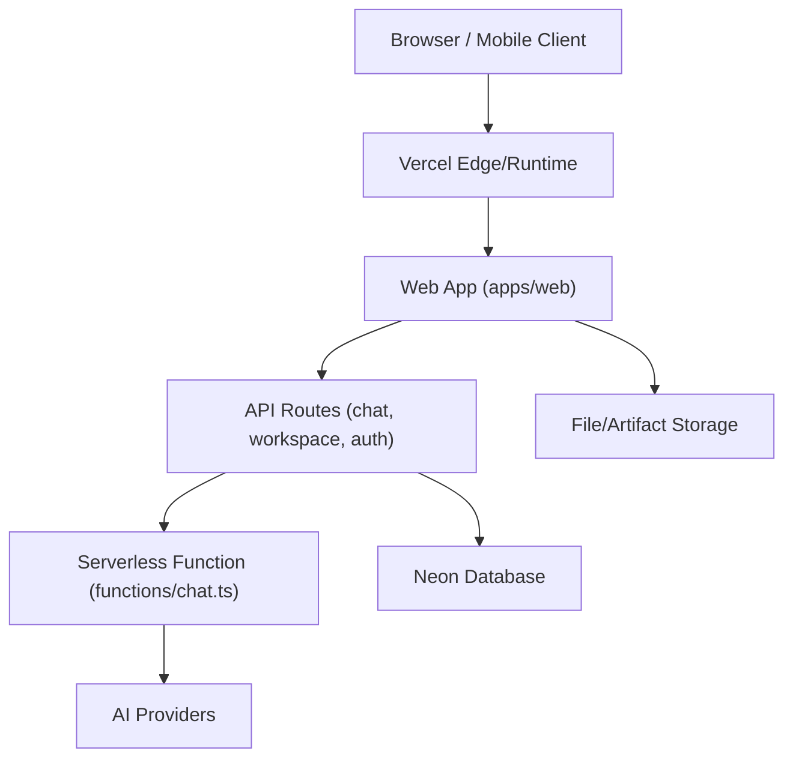
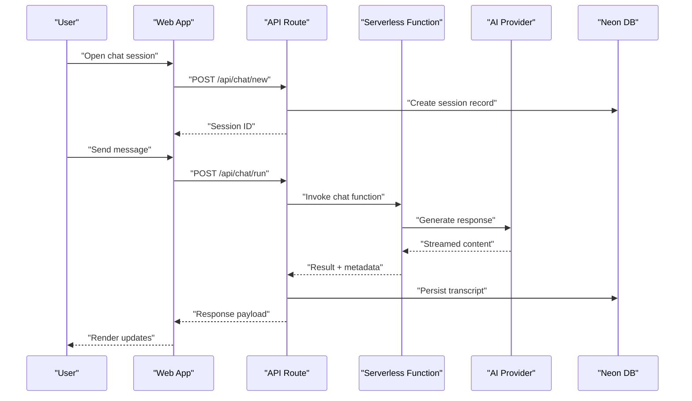
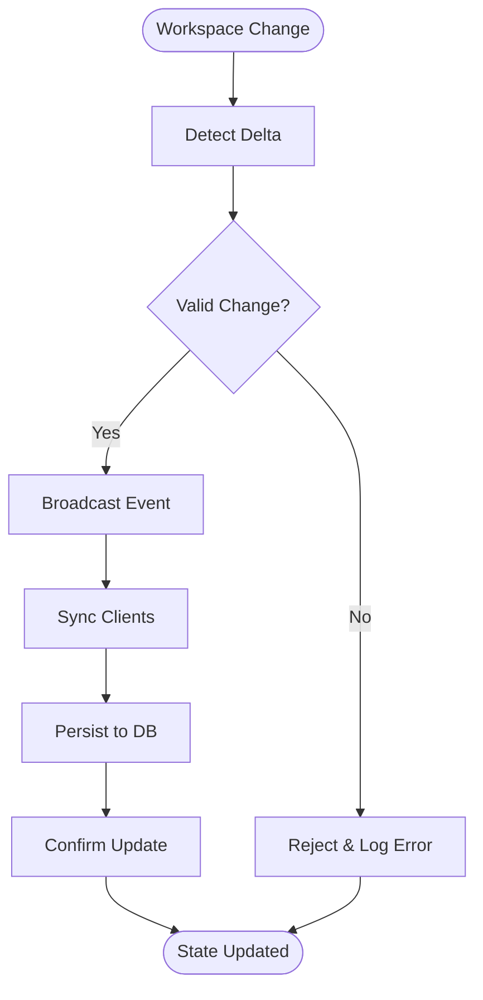
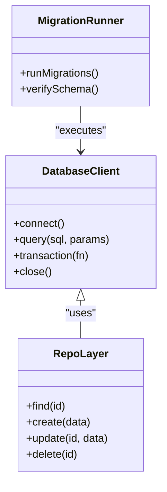
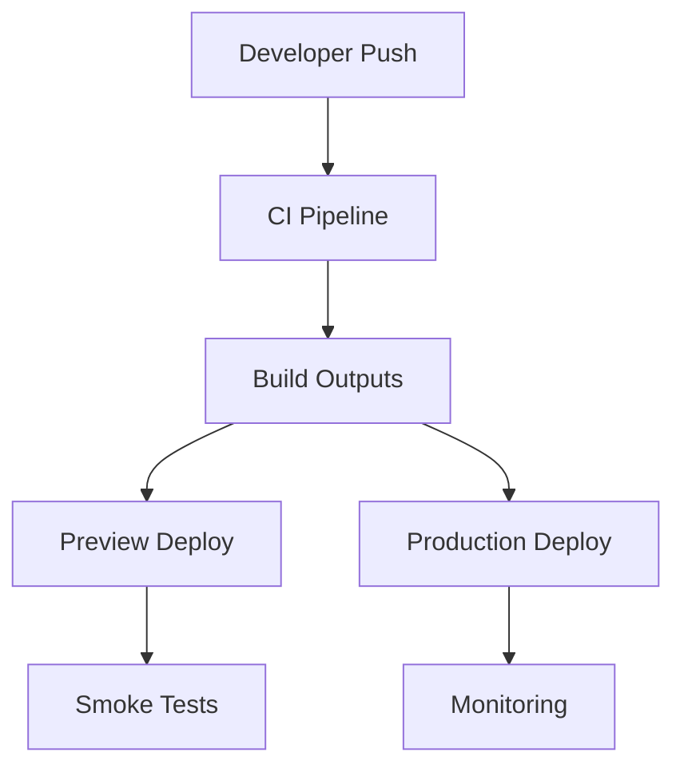
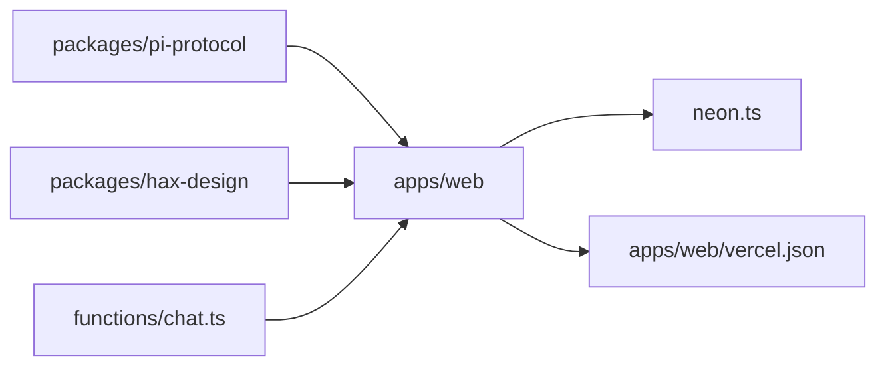

# System Overview

<cite>
**Referenced Files in This Document**
- [README.md](file://README.md)
- [turbo.json](file://turbo.json)
- [pnpm-workspace.yaml](file://pnpm-workspace.yaml)
- [package.json](file://package.json)
- [apps/web/package.json](file://apps/web/package.json)
- [apps/web/vercel.json](file://apps/web/vercel.json)
- [neon.ts](file://neon.ts)
- [functions/chat.ts](file://functions/chat.ts)
- [docs/architecture.mmd](file://docs/architecture.mmd)
- [docs/architecture.md](file://docs/architecture.md)
- [docs/adaptive-workspace.md](file://docs/adaptive-workspace.md)
- [docs/agent-workspace.md](file://docs/agent-workspace.md)
- [docs/deployment.md](file://docs/deployment.md)
- [docs/runbooks/deployment-release-gate.md](file://docs/runbooks/deployment-release-gate.md)
- [apps/web/src/routes/api/chat/new.ts](file://apps/web/src/routes/api/chat/new.ts)
- [apps/web/src/routes/api/workspace/items.ts](file://apps/web/src/routes/api/workspace/items.ts)
- [apps/web/src/lib/db/index.ts](file://apps/web/src/lib/db/index.ts)
- [apps/web/src/lib/deployment.ts](file://apps/web/src/lib/deployment.ts)
- [apps/web/scripts/build-vercel-output.mjs](file://apps/web/scripts/build-vercel-output.mjs)
</cite>

## Table of Contents

1. [Introduction](#introduction)
2. [Project Structure](#project-structure)
3. [Core Components](#core-components)
4. [Architecture Overview](#architecture-overview)
5. [Detailed Component Analysis](#detailed-component-analysis)
6. [Dependency Analysis](#dependency-analysis)
7. [Performance Considerations](#performance-considerations)
8. [Troubleshooting Guide](#troubleshooting-guide)
9. [Conclusion](#conclusion)

## Introduction

Fleet Pi is a monorepo that hosts a web application, shared packages, and supporting tooling for an adaptive agent workspace with real-time collaboration. The system combines a modern web frontend with backend APIs, serverless functions, and external services to deliver collaborative coding experiences powered by AI. It uses Turborepo for build orchestration, pnpm workspaces for dependency management, Vercel for deployment, and Neon for the database layer. The architecture emphasizes clear service boundaries, event-driven interactions, and state synchronization across users and agents.

## Project Structure

The repository follows a feature-oriented monorepo layout:

- apps/web: The primary web application and API routes served on Vercel.
- packages: Shared libraries (e.g., design system, protocol definitions).
- functions: Serverless functions for specific integrations.
- docs: Architecture decisions, runbooks, and feature documentation.
- scripts: Utility scripts for migrations, verification, and deployment readiness checks.
- Configuration files: turbo.json, pnpm-workspace.yaml, package.json define the monorepo runtime and tooling.

**Diagram sources**

- [turbo.json](file://turbo.json)
- [pnpm-workspace.yaml](file://pnpm-workspace.yaml)
- [package.json](file://package.json)
- [apps/web/package.json](file://apps/web/package.json)
- [functions/chat.ts](file://functions/chat.ts)
- [neon.ts](file://neon.ts)

**Section sources**

- [turbo.json](file://turbo.json)
- [pnpm-workspace.yaml](file://pnpm-workspace.yaml)
- [package.json](file://package.json)
- [apps/web/package.json](file://apps/web/package.json)

## Core Components

- Web Application (apps/web): Serves UI, client-side logic, and API routes for chat, workspace operations, authentication, and sandbox integration.
- Agent Workspace: Adaptive workspace enabling real-time collaboration and state synchronization between users and AI agents.
- AI Services: External LLM providers integrated via API calls from both the web app and serverless functions.
- Data Persistence: Neon-managed PostgreSQL accessed through typed clients and migration scripts.
- Deployment Runtime: Vercel hosting for serverless functions and static assets, with build outputs tailored for preview and production.

Key responsibilities:

- apps/web handles routing, state management, API requests, and environment configuration.
- functions/chat.ts orchestrates chat flows and integrates with AI providers.
- neon.ts configures database connectivity and query patterns.
- docs/adaptive-workspace.md defines the adaptive workspace pattern and synchronization model.

**Section sources**

- [apps/web/package.json](file://apps/web/package.json)
- [functions/chat.ts](file://functions/chat.ts)
- [neon.ts](file://neon.ts)
- [docs/adaptive-workspace.md](file://docs/adaptive-workspace.md)

## Architecture Overview

Fleet Pi’s architecture separates concerns into distinct layers:

- Frontend/UI: Built with modern frameworks, hosted on Vercel.
- Backend APIs: Route handlers under apps/web/src/routes/api for domain features.
- Serverless Functions: Standalone functions for specialized tasks like chat orchestration.
- Data Layer: Neon database with typed accessors and migrations.
- External Integrations: AI providers and optional sandboxes.

**Diagram sources**

- [apps/web/src/routes/api/chat/new.ts](file://apps/web/src/routes/api/chat/new.ts)
- [functions/chat.ts](file://functions/chat.ts)
- [neon.ts](file://neon.ts)
- [apps/web/vercel.json](file://apps/web/vercel.json)

**Section sources**

- [docs/architecture.md](file://docs/architecture.md)
- [docs/architecture.mmd](file://docs/architecture.mmd)
- [apps/web/vercel.json](file://apps/web/vercel.json)

## Detailed Component Analysis

### Web Application and API Routes

The web application exposes REST-like endpoints for chat sessions, workspace items, and settings. These routes coordinate with the database and external services while maintaining request/response contracts.

**Diagram sources**

- [apps/web/src/routes/api/chat/new.ts](file://apps/web/src/routes/api/chat/new.ts)
- [functions/chat.ts](file://functions/chat.ts)
- [neon.ts](file://neon.ts)

**Section sources**

- [apps/web/src/routes/api/chat/new.ts](file://apps/web/src/routes/api/chat/new.ts)
- [apps/web/src/routes/api/workspace/items.ts](file://apps/web/src/routes/api/workspace/items.ts)

### Agent Workspace and Adaptive State

The adaptive workspace pattern enables real-time collaboration and synchronized state across users and agents. It treats the workspace as the canonical source of truth, with changes propagated via events and deltas.

**Diagram sources**

- [docs/adaptive-workspace.md](file://docs/adaptive-workspace.md)
- [docs/agent-workspace.md](file://docs/agent-workspace.md)

**Section sources**

- [docs/adaptive-workspace.md](file://docs/adaptive-workspace.md)
- [docs/agent-workspace.md](file://docs/agent-workspace.md)

### Data Persistence with Neon

Database access is centralized through a typed client configured in neon.ts. Migrations and utilities ensure schema consistency and safe operations.

**Diagram sources**

- [neon.ts](file://neon.ts)
- [apps/web/src/lib/db/index.ts](file://apps/web/src/lib/db/index.ts)

**Section sources**

- [neon.ts](file://neon.ts)
- [apps/web/src/lib/db/index.ts](file://apps/web/src/lib/db/index.ts)

### Deployment with Vercel

Vercel serves the web app and serverless functions. Build outputs are customized for preview environments and production deployments.

**Diagram sources**

- [apps/web/vercel.json](file://apps/web/vercel.json)
- [apps/web/scripts/build-vercel-output.mjs](file://apps/web/scripts/build-vercel-output.mjs)
- [docs/deployment.md](file://docs/deployment.md)
- [docs/runbooks/deployment-release-gate.md](file://docs/runbooks/deployment-release-gate.md)

**Section sources**

- [apps/web/vercel.json](file://apps/web/vercel.json)
- [apps/web/scripts/build-vercel-output.mjs](file://apps/web/scripts/build-vercel-output.mjs)
- [docs/deployment.md](file://docs/deployment.md)
- [docs/runbooks/deployment-release-gate.md](file://docs/runbooks/deployment-release-gate.md)

### Technology Stack Decisions

- Monorepo tooling: Turborepo for task orchestration and caching; pnpm workspaces for efficient dependency resolution.
- Frontend/runtime: Modern web framework with Vite-based builds and Vercel hosting.
- Backend: API routes within the web app and isolated serverless functions for heavy or external integrations.
- Database: Neon-managed Postgres with typed accessors and migration tooling.
- AI integration: Pluggable providers invoked via HTTP streams and retries.

**Section sources**

- [turbo.json](file://turbo.json)
- [pnpm-workspace.yaml](file://pnpm-workspace.yaml)
- [package.json](file://package.json)
- [apps/web/package.json](file://apps/web/package.json)

## Dependency Analysis

The monorepo organizes dependencies across apps and packages, ensuring consistent versions and shared code reuse.

**Diagram sources**

- [pnpm-workspace.yaml](file://pnpm-workspace.yaml)
- [apps/web/package.json](file://apps/web/package.json)
- [functions/chat.ts](file://functions/chat.ts)
- [neon.ts](file://neon.ts)
- [apps/web/vercel.json](file://apps/web/vercel.json)

**Section sources**

- [pnpm-workspace.yaml](file://pnpm-workspace.yaml)
- [apps/web/package.json](file://apps/web/package.json)

## Performance Considerations

- Use Turborepo caching to speed up builds and tests across the monorepo.
- Stream responses from AI providers to reduce latency and memory usage.
- Optimize database queries with proper indexing and connection pooling via Neon.
- Minimize bundle size by tree-shaking and lazy-loading routes.
- Leverage Vercel edge functions where appropriate for low-latency responses.

[No sources needed since this section provides general guidance]

## Troubleshooting Guide

Common issues and resolutions:

- Database connectivity errors: Verify Neon credentials and network policies; check connection pooling limits.
- Vercel build failures: Inspect build logs; ensure all workspace dependencies are installed and scripts are correct.
- AI provider timeouts: Implement retries and fallbacks; monitor rate limits and adjust concurrency.
- Workspace sync conflicts: Ensure idempotent updates and conflict resolution strategies; log deltas for debugging.

**Section sources**

- [neon.ts](file://neon.ts)
- [apps/web/vercel.json](file://apps/web/vercel.json)
- [functions/chat.ts](file://functions/chat.ts)

## Conclusion

Fleet Pi’s system overview highlights a well-structured monorepo with clear separation between the web application, backend APIs, serverless functions, and external integrations. The adaptive workspace pattern enables robust real-time collaboration, while Vercel and Neon provide scalable deployment and persistence. By adhering to microservices and event-driven principles, the system achieves modularity, maintainability, and performance.

[No sources needed since this section summarizes without analyzing specific files]
