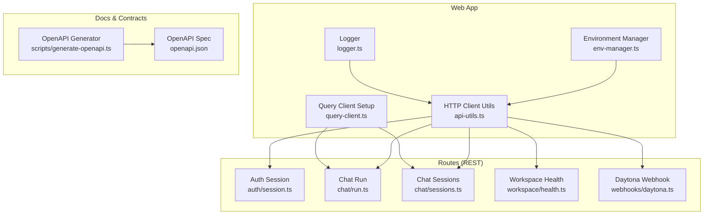
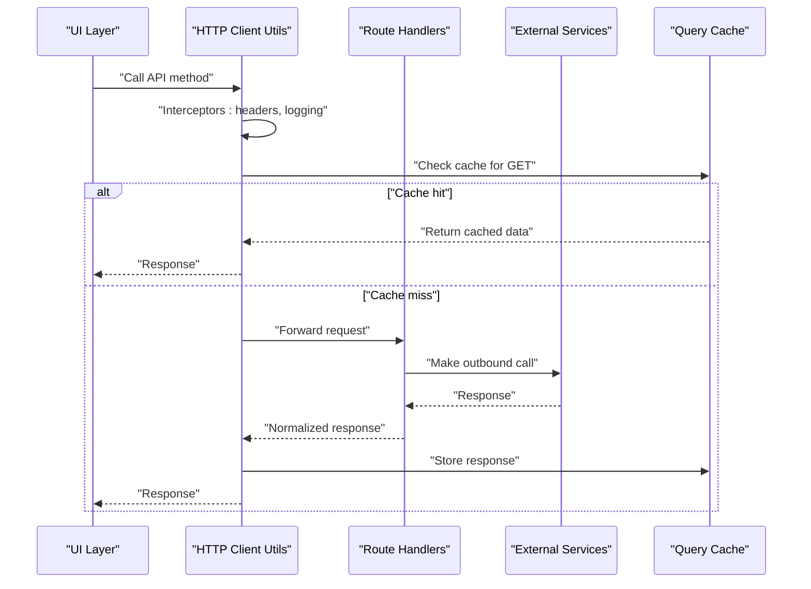
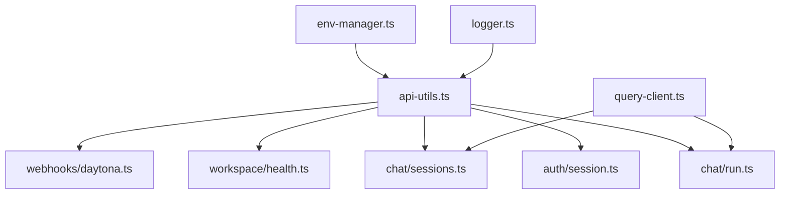

# API Integration Layer

<cite>
**Referenced Files in This Document**
- [api-utils.ts](file://apps/web/src/lib/api-utils.ts)
- [query-client.ts](file://apps/web/src/lib/query-client.ts)
- [env-manager.ts](file://apps/web/src/lib/env-manager.ts)
- [logger.ts](file://apps/web/src/lib/logger.ts)
- [auth/session.ts](file://apps/web/src/routes/api/auth/session.ts)
- [chat.run.ts](file://apps/web/src/routes/api/chat/run.ts)
- [chat.sessions.ts](file://apps/web/src/routes/api/chat/sessions.ts)
- [workspace.health.ts](file://apps/web/src/routes/api/workspace/health.ts)
- [webhooks.daytona.ts](file://apps/web/src/routes/api/webhooks/daytona.ts)
- [generate-openapi.ts](file://apps/web/scripts/generate-openapi.ts)
- [openapi.json](file://apps/web/openapi.json)
</cite>

## Table of Contents

1. [Introduction](#introduction)
2. [Project Structure](#project-structure)
3. [Core Components](#core-components)
4. [Architecture Overview](#architecture-overview)
5. [Detailed Component Analysis](#detailed-component-analysis)
6. [Dependency Analysis](#dependency-analysis)
7. [Performance Considerations](#performance-considerations)
8. [Troubleshooting Guide](#troubleshooting-guide)
9. [Conclusion](#conclusion)
10. [Appendices](#appendices)

## Introduction

This document describes the API integration layer used by the web application to communicate with backend services and agent workspaces. It covers HTTP client implementation, request/response interceptors, authentication flows, token management, session persistence, WebSocket usage for real-time communication, API versioning, rate limiting, retry mechanisms, offline support, security considerations, input validation, and caching strategies. It also provides common interaction patterns and troubleshooting guidance for connectivity issues.

## Project Structure

The API integration layer is primarily implemented within the web application’s library and route layers:

- Library utilities provide shared HTTP behavior, environment configuration, logging, and query client setup.
- Route handlers expose REST endpoints that proxy or orchestrate calls to external services and manage sessions and webhooks.
- Scripts generate OpenAPI specifications from routes to keep documentation aligned with implementations.

**Diagram sources**

- [api-utils.ts](file://apps/web/src/lib/api-utils.ts)
- [query-client.ts](file://apps/web/src/lib/query-client.ts)
- [env-manager.ts](file://apps/web/src/lib/env-manager.ts)
- [logger.ts](file://apps/web/src/lib/logger.ts)
- [auth/session.ts](file://apps/web/src/routes/api/auth/session.ts)
- [chat.run.ts](file://apps/web/src/routes/api/chat/run.ts)
- [chat.sessions.ts](file://apps/web/src/routes/api/chat/sessions.ts)
- [workspace.health.ts](file://apps/web/src/routes/api/workspace/health.ts)
- [webhooks.daytona.ts](file://apps/web/src/routes/api/webhooks/daytona.ts)
- [generate-openapi.ts](file://apps/web/scripts/generate-openapi.ts)
- [openapi.json](file://apps/web/openapi.json)

**Section sources**

- [api-utils.ts](file://apps/web/src/lib/api-utils.ts)
- [query-client.ts](file://apps/web/src/lib/query-client.ts)
- [env-manager.ts](file://apps/web/src/lib/env-manager.ts)
- [logger.ts](file://apps/web/src/lib/logger.ts)
- [auth/session.ts](file://apps/web/src/routes/api/auth/session.ts)
- [chat.run.ts](file://apps/web/src/routes/api/chat/run.ts)
- [chat.sessions.ts](file://apps/web/src/routes/api/chat/sessions.ts)
- [workspace.health.ts](file://apps/web/src/routes/api/workspace/health.ts)
- [webhooks.daytona.ts](file://apps/web/src/routes/api/webhooks/daytona.ts)
- [generate-openapi.ts](file://apps/web/scripts/generate-openapi.ts)
- [openapi.json](file://apps/web/openapi.json)

## Core Components

- HTTP client utilities centralize base URL resolution, headers, timeouts, retries, and error normalization.
- Query client configures caching, background refetch policies, and optimistic updates for UI responsiveness.
- Environment manager abstracts runtime configuration such as API base URLs, feature flags, and secrets.
- Logger standardizes structured logs for requests, responses, and errors across the integration layer.
- Auth session route manages user sessions and tokens, providing secure endpoints for login, refresh, and logout.
- Chat routes implement chat run and session management, including streaming responses and state synchronization.
- Workspace health endpoint exposes readiness/liveness checks for agent workspace availability.
- Daytona webhook handler processes incoming events from external sandboxes and integrates them into the app state.

Key responsibilities:

- Normalize network errors and map them to consistent domain errors.
- Inject authentication headers and handle token refresh flows transparently.
- Cache GET responses and invalidate on mutations.
- Provide retry and backoff strategies for transient failures.
- Validate inputs at route boundaries before calling downstream services.

**Section sources**

- [api-utils.ts](file://apps/web/src/lib/api-utils.ts)
- [query-client.ts](file://apps/web/src/lib/query-client.ts)
- [env-manager.ts](file://apps/web/src/lib/env-manager.ts)
- [logger.ts](file://apps/web/src/lib/logger.ts)
- [auth/session.ts](file://apps/web/src/routes/api/auth/session.ts)
- [chat.run.ts](file://apps/web/src/routes/api/chat/run.ts)
- [chat.sessions.ts](file://apps/web/src/routes/api/chat/sessions.ts)
- [workspace.health.ts](file://apps/web/src/routes/api/workspace/health.ts)
- [webhooks.daytona.ts](file://apps/web/src/routes/api/webhooks/daytona.ts)

## Architecture Overview

The integration layer follows a layered architecture:

- Presentation layer invokes typed API methods exposed by the HTTP client utilities.
- Middleware-like interceptors add auth headers, log requests/responses, and handle retries.
- Route handlers orchestrate business logic, validate payloads, and call downstream services.
- External services include chat providers, agent workspaces, and sandbox integrations.

**Diagram sources**

- [api-utils.ts](file://apps/web/src/lib/api-utils.ts)
- [query-client.ts](file://apps/web/src/lib/query-client.ts)
- [chat.run.ts](file://apps/web/src/routes/api/chat/run.ts)
- [chat.sessions.ts](file://apps/web/src/routes/api/chat/sessions.ts)

## Detailed Component Analysis

### HTTP Client Implementation

Responsibilities:

- Base URL resolution from environment configuration.
- Request interception to attach authentication headers and correlation IDs.
- Response interception to parse JSON, normalize errors, and log outcomes.
- Retry policy with exponential backoff for transient errors.
- Timeouts and cancellation support for long-running operations.

Common patterns:

- Centralized error mapping to domain-specific error types.
- Configurable retry counts and backoff multipliers.
- Optional request deduplication for identical GET requests.

Security considerations:

- Never log sensitive headers or bodies.
- Enforce HTTPS and strict transport settings where applicable.
- Sanitize inputs before forwarding to downstream services.

**Section sources**

- [api-utils.ts](file://apps/web/src/lib/api-utils.ts)
- [env-manager.ts](file://apps/web/src/lib/env-manager.ts)
- [logger.ts](file://apps/web/src/lib/logger.ts)

### Request/Response Interceptors

Behavior:

- Attach Authorization headers when tokens are present.
- Add tracing headers for distributed logging.
- Transform responses into consistent shapes.
- Handle 401 Unauthorized by triggering token refresh flow.

Error handling:

- Map network errors to user-friendly messages.
- Surface server-side validation errors with field-level details.
- Log errors with context without exposing secrets.

**Section sources**

- [api-utils.ts](file://apps/web/src/lib/api-utils.ts)
- [logger.ts](file://apps/web/src/lib/logger.ts)

### Authentication Flow Integration

Flow overview:

- Login route validates credentials and returns tokens.
- Token refresh route renews access tokens using refresh tokens.
- Logout clears local storage and invalidates sessions.
- Interceptors automatically attach tokens and refresh when needed.

Session persistence:

- Tokens stored securely in memory or secure storage depending on platform constraints.
- Session state persisted minimally to avoid stale tokens.

Security best practices:

- Use short-lived access tokens and rotate refresh tokens.
- Enforce CSRF protections for browser-based flows.
- Validate token scopes and roles before granting access.

**Section sources**

- [auth/session.ts](file://apps/web/src/routes/api/auth/session.ts)
- [api-utils.ts](file://apps/web/src/lib/api-utils.ts)

### Token Management and Session Persistence

Token lifecycle:

- On app start, check for existing tokens and validate expiry.
- Refresh tokens proactively before expiration.
- Clear tokens on logout or security events.

Persistence strategy:

- Prefer secure storage mechanisms provided by the runtime.
- Avoid storing sensitive data in localStorage unless necessary; use httpOnly cookies where possible.

Recovery:

- Gracefully handle expired tokens by prompting re-authentication.
- Queue pending requests until tokens are refreshed.

**Section sources**

- [auth/session.ts](file://apps/web/src/routes/api/auth/session.ts)
- [api-utils.ts](file://apps/web/src/lib/api-utils.ts)

### WebSocket Connections for Real-Time Communication

Use cases:

- Streaming chat responses from agent workspace.
- Live updates for workspace changes and sandbox events.

Lifecycle management:

- Establish connection on demand and reconnect on failure with backoff.
- Send heartbeat messages to detect dead connections.
- Close connections gracefully on component unmount.

Message handling:

- Parse message types and dispatch to appropriate handlers.
- Buffer messages during reconnection and replay if supported.
- Throttle high-frequency updates to prevent UI overload.

Error handling:

- Detect network drops and trigger reconnection.
- Surface connection errors to users with actionable messages.

**Section sources**

- [chat.run.ts](file://apps/web/src/routes/api/chat/run.ts)
- [webhooks.daytona.ts](file://apps/web/src/routes/api/webhooks/daytona.ts)

### API Versioning

Strategy:

- Prefix endpoints with version segments (e.g., /v1).
- Maintain backward compatibility within major versions.
- Deprecate old versions with clear migration guides.

Implementation:

- Centralized router prefixes for each API version.
- Version negotiation via Accept headers when needed.

**Section sources**

- [openapi.json](file://apps/web/openapi.json)
- [generate-openapi.ts](file://apps/web/scripts/generate-openapi.ts)

### Rate Limiting

Approach:

- Implement client-side rate limiting per endpoint or globally.
- Respect server-provided rate limit headers and adjust behavior accordingly.
- Queue or delay requests when limits are reached.

Configuration:

- Expose rate limit thresholds via environment variables.
- Allow dynamic tuning based on deployment context.

**Section sources**

- [api-utils.ts](file://apps/web/src/lib/api-utils.ts)

### Retry Mechanisms

Policy:

- Retry idempotent requests (GET, HEAD) on transient errors.
- Use exponential backoff with jitter to avoid thundering herds.
- Limit maximum retries to prevent excessive delays.

Circuit breaker:

- Temporarily halt requests when failure rates exceed thresholds.
- Resume after cooldown period.

**Section sources**

- [api-utils.ts](file://apps/web/src/lib/api-utils.ts)

### Offline Support

Capabilities:

- Cache GET responses for offline reads.
- Queue mutations while offline and replay on reconnect.
- Show offline indicators and disable write operations.

Storage:

- Use service worker caches or IndexedDB for persistent offline data.
- Sync queued mutations when connectivity resumes.

**Section sources**

- [query-client.ts](file://apps/web/src/lib/query-client.ts)
- [api-utils.ts](file://apps/web/src/lib/api-utils.ts)

### Security Considerations

- Validate all inputs at route boundaries.
- Sanitize outputs to prevent injection attacks.
- Enforce CORS policies and CSP headers.
- Audit sensitive operations and log access patterns.

**Section sources**

- [chat.run.ts](file://apps/web/src/routes/api/chat/run.ts)
- [webhooks.daytona.ts](file://apps/web/src/routes/api/webhooks/daytona.ts)

### Input Validation

Patterns:

- Use schema validation libraries to enforce contracts.
- Return detailed validation errors with field names.
- Reject malformed requests early to reduce load.

**Section sources**

- [chat.run.ts](file://apps/web/src/routes/api/chat/run.ts)
- [webhooks.daytona.ts](file://apps/web/src/routes/api/webhooks/daytona.ts)

### Response Caching Strategies

Strategies:

- Cache GET responses with TTL and cache-busting keys.
- Invalidate caches on mutations or explicit invalidation calls.
- Use optimistic updates for immediate UI feedback.

Configuration:

- Tune cache sizes and TTLs per endpoint characteristics.
- Monitor cache hit rates and adjust policies.

**Section sources**

- [query-client.ts](file://apps/web/src/lib/query-client.ts)

## Dependency Analysis

The integration layer depends on environment configuration, logging, and external services. Routes depend on the HTTP client utilities and query client for consistent behavior.

**Diagram sources**

- [env-manager.ts](file://apps/web/src/lib/env-manager.ts)
- [logger.ts](file://apps/web/src/lib/logger.ts)
- [api-utils.ts](file://apps/web/src/lib/api-utils.ts)
- [query-client.ts](file://apps/web/src/lib/query-client.ts)
- [auth/session.ts](file://apps/web/src/routes/api/auth/session.ts)
- [chat.run.ts](file://apps/web/src/routes/api/chat/run.ts)
- [chat.sessions.ts](file://apps/web/src/routes/api/chat/sessions.ts)
- [workspace.health.ts](file://apps/web/src/routes/api/workspace/health.ts)
- [webhooks.daytona.ts](file://apps/web/src/routes/api/webhooks/daytona.ts)

**Section sources**

- [api-utils.ts](file://apps/web/src/lib/api-utils.ts)
- [query-client.ts](file://apps/web/src/lib/query-client.ts)
- [env-manager.ts](file://apps/web/src/lib/env-manager.ts)
- [logger.ts](file://apps/web/src/lib/logger.ts)
- [auth/session.ts](file://apps/web/src/routes/api/auth/session.ts)
- [chat.run.ts](file://apps/web/src/routes/api/chat/run.ts)
- [chat.sessions.ts](file://apps/web/src/routes/api/chat/sessions.ts)
- [workspace.health.ts](file://apps/web/src/routes/api/workspace/health.ts)
- [webhooks.daytona.ts](file://apps/web/src/routes/api/webhooks/daytona.ts)

## Performance Considerations

- Minimize payload sizes by selecting only required fields.
- Use pagination and cursor-based fetching for large datasets.
- Enable compression for large responses.
- Optimize WebSocket message batching to reduce overhead.
- Monitor latency and throughput metrics to identify bottlenecks.

[No sources needed since this section provides general guidance]

## Troubleshooting Guide

Common issues and resolutions:

- Network timeouts: Increase timeout values or optimize request payloads.
- Authentication failures: Verify token validity and refresh flow; check CORS and cookie settings.
- Rate limiting: Implement backoff and respect server headers; consider queuing requests.
- WebSocket disconnects: Reconnect with exponential backoff; ensure heartbeat messages are sent.
- Cache inconsistencies: Invalidate caches explicitly after mutations; verify cache keys.

Diagnostic steps:

- Inspect logs for request/response traces and error details.
- Use OpenAPI spec to validate payloads and endpoints.
- Test connectivity with health endpoints and simple fetch calls.

**Section sources**

- [logger.ts](file://apps/web/src/lib/logger.ts)
- [workspace.health.ts](file://apps/web/src/routes/api/workspace/health.ts)
- [openapi.json](file://apps/web/openapi.json)

## Conclusion

The API integration layer provides a robust foundation for reliable, secure, and performant communication with backend services and agent workspaces. By centralizing HTTP behavior, enforcing authentication and validation, and implementing resilient retry and caching strategies, it ensures a smooth developer and user experience. Continuous monitoring and adherence to security best practices will further strengthen the system.

[No sources needed since this section summarizes without analyzing specific files]

## Appendices

### Common API Interaction Patterns

- Fetch with caching: Use GET endpoints with query client caching for read-heavy data.
- Mutate with invalidation: Perform POST/PUT/DELETE and invalidate related caches.
- Stream responses: Subscribe to WebSocket channels for real-time updates.
- Retry on failure: Configure retry policies for idempotent operations.

[No sources needed since this section provides general guidance]
