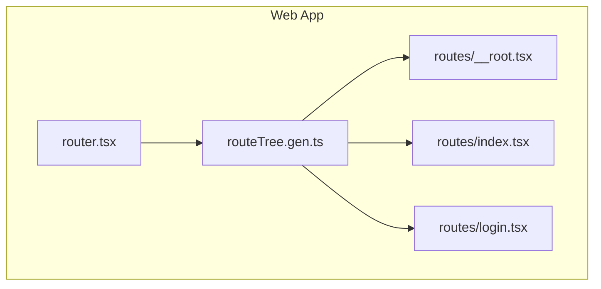
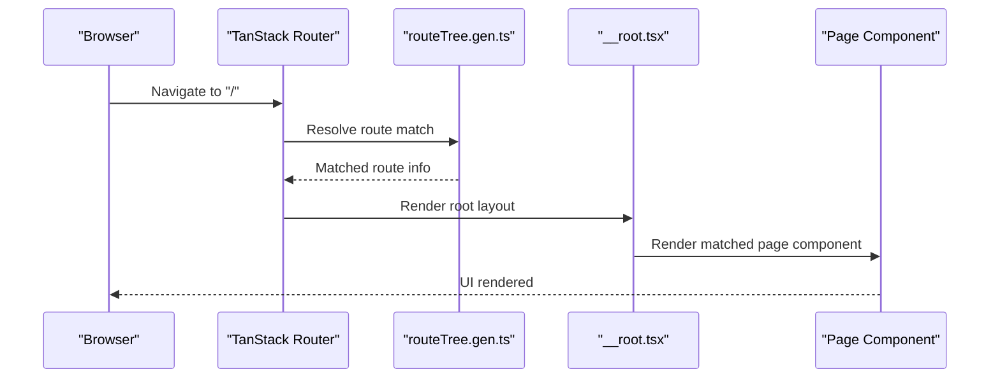
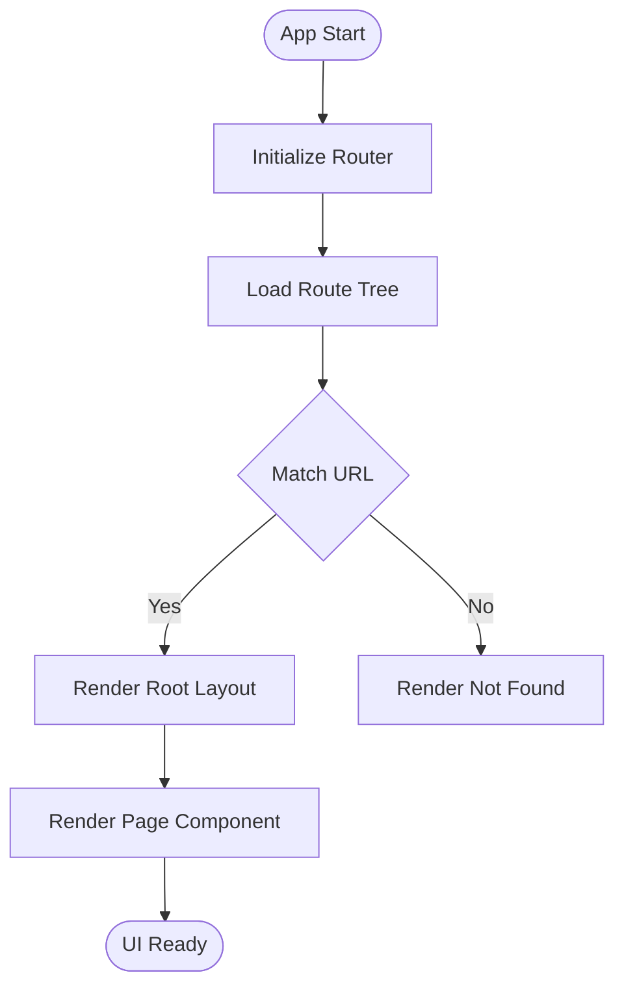
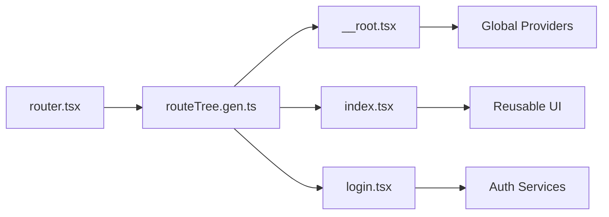

# Component Architecture

<cite>
**Referenced Files in This Document**
- [router.tsx](file://apps/web/src/router.tsx)
- [__root.tsx](file://apps/web/src/routes/__root.tsx)
- [index.tsx](file://apps/web/src/routes/index.tsx)
- [login.tsx](file://apps/web/src/routes/login.tsx)
- [routeTree.gen.ts](file://apps/web/src/routeTree.gen.ts)
- [package.json](file://apps/web/package.json)
</cite>

## Table of Contents

1. [Introduction](#introduction)
2. [Project Structure](#project-structure)
3. [Core Components](#core-components)
4. [Architecture Overview](#architecture-overview)
5. [Detailed Component Analysis](#detailed-component-analysis)
6. [Dependency Analysis](#dependency-analysis)
7. [Performance Considerations](#performance-considerations)
8. [Troubleshooting Guide](#troubleshooting-guide)
9. [Conclusion](#conclusion)

## Introduction

This document explains the React component architecture used in the web application, focusing on how components are organized by feature and route, how the root component bootstraps the app, and how routing drives component loading. It also covers composition patterns, prop interfaces, state management within components, examples of reusable UI and layout components, testing strategies, performance optimizations such as memoization and lazy loading, and accessibility considerations.

## Project Structure

The frontend is a Vite-based React application using TanStack Router for file-based routing. The key entry points for component organization are:

- The router configuration that wires up routes to components
- The generated route tree that reflects the file-based structure
- Route-level components under src/routes that represent page-level features
- A root layout component that provides global context and shell UI

**Diagram sources**

- [router.tsx](file://apps/web/src/router.tsx)
- [routeTree.gen.ts](file://apps/web/src/routeTree.gen.ts)
- [__root.tsx](file://apps/web/src/routes/__root.tsx)
- [index.tsx](file://apps/web/src/routes/index.tsx)
- [login.tsx](file://apps/web/src/routes/login.tsx)

**Section sources**

- [router.tsx](file://apps/web/src/router.tsx)
- [routeTree.gen.ts](file://apps/web/src/routeTree.gen.ts)
- [__root.tsx](file://apps/web/src/routes/__root.tsx)
- [index.tsx](file://apps/web/src/routes/index.tsx)
- [login.tsx](file://apps/web/src/routes/login.tsx)

## Core Components

- Root layout component: Provides the application shell, global providers, and common layout elements. It is typically the first route and wraps all other pages with shared UI and context.
- Page components: Each route maps to a page component (for example, index and login). These encapsulate feature-specific logic and UI.
- Router configuration: Declares routes and links them to their corresponding components, enabling code-splitting and navigation.

Key responsibilities:

- Root component: Global state providers, theme, authentication context, and layout scaffolding.
- Page components: Feature-specific state, data fetching, and presentation.
- Router: Declarative mapping from URL paths to components, supporting nested routes and layouts.

**Section sources**

- [__root.tsx](file://apps/web/src/routes/__root.tsx)
- [index.tsx](file://apps/web/src/routes/index.tsx)
- [login.tsx](file://apps/web/src/routes/login.tsx)
- [router.tsx](file://apps/web/src/router.tsx)

## Architecture Overview

The application uses a file-based routing approach where each route file corresponds to a component. The router reads the generated route tree and renders the appropriate component based on the current URL. The root component acts as a layout wrapper for all pages.

**Diagram sources**

- [router.tsx](file://apps/web/src/router.tsx)
- [routeTree.gen.ts](file://apps/web/src/routeTree.gen.ts)
- [__root.tsx](file://apps/web/src/routes/__root.tsx)
- [index.tsx](file://apps/web/src/routes/index.tsx)

## Detailed Component Analysis

### Root Layout Component

Responsibilities:

- Establishes the application shell (header, footer, sidebar if applicable)
- Wraps child routes with global providers (e.g., auth, theme, query client)
- Handles global error boundaries and notifications

Composition patterns:

- Uses children prop to render nested routes
- Composes layout primitives (containers, grids) to maintain consistent spacing and alignment

State management:

- May hold global UI state (e.g., sidebar open/close) via local state or context
- Delegates feature state to page components

Accessibility:

- Ensures semantic HTML structure and proper heading hierarchy
- Provides skip-to-content links and keyboard navigation support

**Section sources**

- [__root.tsx](file://apps/web/src/routes/__root.tsx)

### Index Page Component

Responsibilities:

- Serves as the landing page
- Presents high-level navigation or dashboard content
- May redirect authenticated users to a default feature route

Composition patterns:

- Composes reusable UI cards, buttons, and lists
- Integrates with feature modules through props and context

State management:

- Local state for UI interactions (e.g., toggles, modals)
- Data fetching via hooks or query libraries

Accessibility:

- Descriptive link text and aria-labels for interactive elements
- Focus management when navigating to new sections

**Section sources**

- [index.tsx](file://apps/web/src/routes/index.tsx)

### Login Page Component

Responsibilities:

- Handles user authentication flow
- Validates inputs and displays errors
- Redirects to protected routes upon success

Composition patterns:

- Reuses form fields, validation messages, and action buttons
- Integrates with auth provider via context or hooks

State management:

- Form state and validation results
- Loading and error states during authentication

Accessibility:

- Proper labeling for inputs and error messages
- Keyboard-friendly form submission and focus indicators

**Section sources**

- [login.tsx](file://apps/web/src/routes/login.tsx)

### Router Configuration

Responsibilities:

- Defines routes and maps them to components
- Enables code-splitting per route
- Supports nested routes and layouts

Patterns:

- File-based route generation ensures consistency between filesystem and runtime routes
- Centralized route definitions simplify navigation and guards

**Section sources**

- [router.tsx](file://apps/web/src/router.tsx)
- [routeTree.gen.ts](file://apps/web/src/routeTree.gen.ts)

### Conceptual Overview

Component organization follows feature-based grouping at the route level, while reusable UI components live in shared directories. Composition is achieved through props, context, and higher-order components. State is managed locally within components or via global providers for cross-cutting concerns.

[No sources needed since this diagram shows conceptual workflow, not actual code structure]

## Dependency Analysis

The router depends on the generated route tree to map URLs to components. Page components depend on shared utilities, UI libraries, and feature-specific services. The root component may depend on global providers and environment configuration.

**Diagram sources**

- [router.tsx](file://apps/web/src/router.tsx)
- [routeTree.gen.ts](file://apps/web/src/routeTree.gen.ts)
- [__root.tsx](file://apps/web/src/routes/__root.tsx)
- [index.tsx](file://apps/web/src/routes/index.tsx)
- [login.tsx](file://apps/web/src/routes/login.tsx)

**Section sources**

- [router.tsx](file://apps/web/src/router.tsx)
- [routeTree.gen.ts](file://apps/web/src/routeTree.gen.ts)
- [__root.tsx](file://apps/web/src/routes/__root.tsx)
- [index.tsx](file://apps/web/src/routes/index.tsx)
- [login.tsx](file://apps/web/src/routes/login.tsx)

## Performance Considerations

- Code splitting: Routes are split automatically by the router, reducing initial bundle size.
- Memoization: Use memoization for expensive computations and stable props to avoid unnecessary re-renders.
- Lazy loading: Defer non-critical components until they are needed.
- Virtualization: For large lists, virtualize items to improve rendering performance.
- Image optimization: Use optimized image formats and lazy loading for media assets.
- Bundle analysis: Regularly analyze bundle size and remove unused dependencies.

[No sources needed since this section provides general guidance]

## Troubleshooting Guide

Common issues and resolutions:

- Route mismatch: Ensure the route tree matches the filesystem structure and that components are correctly exported.
- Missing providers: Verify that the root component includes necessary providers for context-dependent features.
- Authentication redirects: Confirm that guards and redirects are implemented consistently across protected routes.
- Performance regressions: Profile components with heavy rendering and apply memoization or lazy loading where appropriate.
- Accessibility violations: Use automated tools and manual audits to fix missing labels, roles, and keyboard navigation issues.

**Section sources**

- [router.tsx](file://apps/web/src/router.tsx)
- [routeTree.gen.ts](file://apps/web/src/routeTree.gen.ts)
- [__root.tsx](file://apps/web/src/routes/__root.tsx)

## Conclusion

The web application’s component architecture centers around a clear separation of concerns: a root layout for global concerns, route-based page components for features, and a router that drives navigation and code splitting. By following composition patterns, managing state effectively, and applying performance and accessibility best practices, the application remains scalable, maintainable, and user-friendly.
