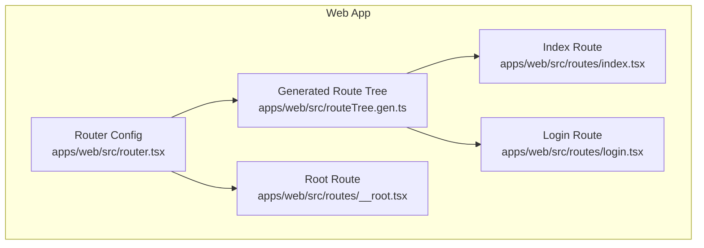
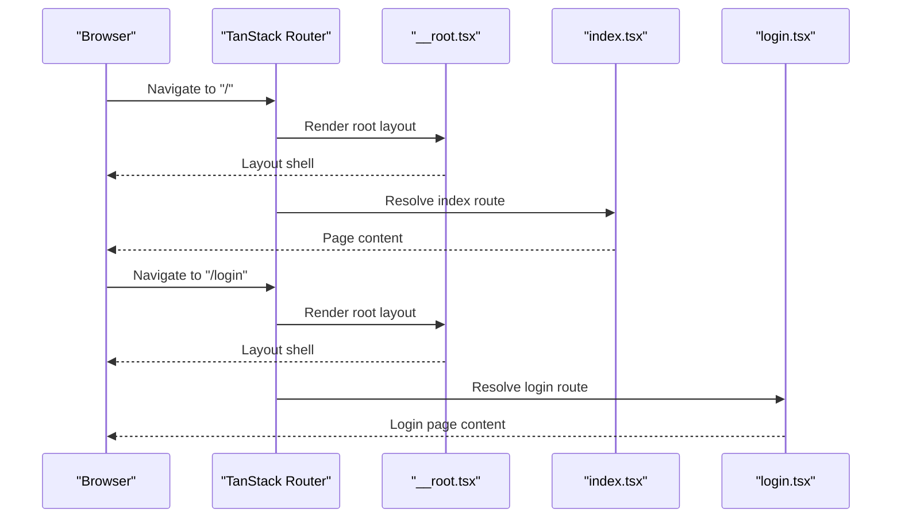
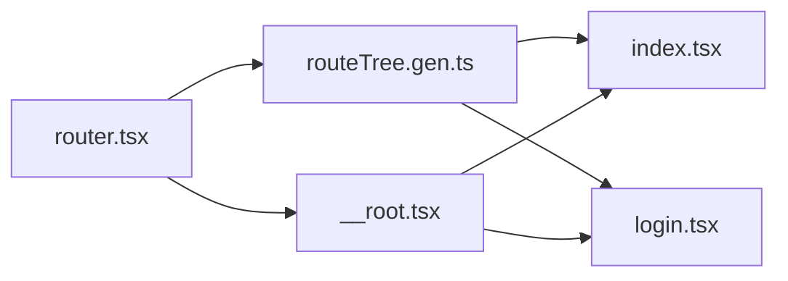

# Routing & Navigation

<cite>
**Referenced Files in This Document**
- [router.tsx](file://apps/web/src/router.tsx)
- [routeTree.gen.ts](file://apps/web/src/routeTree.gen.ts)
- [__root.tsx](file://apps/web/src/routes/__root.tsx)
- [index.tsx](file://apps/web/src/routes/index.tsx)
- [login.tsx](file://apps/web/src/routes/login.tsx)
</cite>

## Table of Contents

1. [Introduction](#introduction)
2. [Project Structure](#project-structure)
3. [Core Components](#core-components)
4. [Architecture Overview](#architecture-overview)
5. [Detailed Component Analysis](#detailed-component-analysis)
6. [Dependency Analysis](#dependency-analysis)
7. [Performance Considerations](#performance-considerations)
8. [Troubleshooting Guide](#troubleshooting-guide)
9. [Conclusion](#conclusion)

## Introduction

This document explains the routing and navigation system implemented with TanStack Router in the web application. It covers how routes are defined, how the route tree is generated, nested layout behavior, dynamic segments, authentication guards and redirects, programmatic navigation, data loading patterns, error boundaries, code splitting, URL state management (query parameters), and deep linking support. The goal is to help both new contributors and experienced developers understand how navigation works end-to-end and how to extend it safely.

## Project Structure

The routing implementation follows a file-based convention where each route is a file under apps/web/src/routes. A root route defines shared layout and global providers, while other files define page-level routes. The router configuration wires everything together and the build process generates a type-safe route tree for compile-time safety.

**Diagram sources**

- [router.tsx](file://apps/web/src/router.tsx)
- [routeTree.gen.ts](file://apps/web/src/routeTree.gen.ts)
- [__root.tsx](file://apps/web/src/routes/__root.tsx)
- [index.tsx](file://apps/web/src/routes/index.tsx)
- [login.tsx](file://apps/web/src/routes/login.tsx)

**Section sources**

- [router.tsx](file://apps/web/src/router.tsx)
- [routeTree.gen.ts](file://apps/web/src/routeTree.gen.ts)
- [__root.tsx](file://apps/web/src/routes/__root.tsx)
- [index.tsx](file://apps/web/src/routes/index.tsx)
- [login.tsx](file://apps/web/src/routes/login.tsx)

## Core Components

- Router configuration: Initializes TanStack Router, sets up the root element, and registers any global providers or loaders.
- Generated route tree: Provides type-safe path definitions and component mappings used by the router.
- Root route: Defines the top-level layout, global error boundary, and shared UI chrome.
- Page routes: Implement individual pages such as index and login, including their own data loaders and UI.

Key responsibilities:

- Router configuration centralizes navigation setup and ensures consistent behavior across the app.
- The generated route tree enforces correct paths and props at compile time.
- The root route encapsulates global concerns like auth state, analytics, and common UI wrappers.
- Page routes focus on domain-specific logic and presentation.

**Section sources**

- [router.tsx](file://apps/web/src/router.tsx)
- [routeTree.gen.ts](file://apps/web/src/routeTree.gen.ts)
- [__root.tsx](file://apps/web/src/routes/__root.tsx)
- [index.tsx](file://apps/web/src/routes/index.tsx)
- [login.tsx](file://apps/web/src/routes/login.tsx)

## Architecture Overview

TanStack Router uses a declarative route tree that maps file paths to components. The router instance is created once and mounts the root route. Nested layouts are achieved through parent-child relationships in the route tree, enabling shared UI and data loading strategies.

**Diagram sources**

- [router.tsx](file://apps/web/src/router.tsx)
- [__root.tsx](file://apps/web/src/routes/__root.tsx)
- [index.tsx](file://apps/web/src/routes/index.tsx)
- [login.tsx](file://apps/web/src/routes/login.tsx)

## Detailed Component Analysis

### Router Configuration

- Purpose: Create and configure the TanStack Router instance, set the root element, and integrate with app-wide providers.
- Typical features:
  - Base path configuration for deployment environments.
  - Global data fetching integration (e.g., React Query).
  - Error boundary wiring at the router level.
  - Optional history mode (browser vs memory).

Best practices:

- Keep router configuration minimal and centralized.
- Use lazy loading for heavy routes when possible.
- Ensure consistent query client initialization to avoid hydration mismatches.

**Section sources**

- [router.tsx](file://apps/web/src/router.tsx)

### Generated Route Tree

- Purpose: Provide a type-safe map of all routes, including path segments, params, and associated components.
- Benefits:
  - Compile-time validation of paths and search/query types.
  - Autocomplete and refactoring safety.
  - Enables code-splitting per route via dynamic imports.

Usage tips:

- Import the generated route tree into the router configuration.
- Do not edit this file manually; changes come from the build process.

**Section sources**

- [routeTree.gen.ts](file://apps/web/src/routeTree.gen.ts)

### Root Route (__root.tsx)

- Purpose: Define the top-level layout, global providers, and shared UI elements.
- Common responsibilities:
  - Wrap children with global providers (auth, theme, analytics).
  - Set up global error boundaries and fallbacks.
  - Manage global state that affects all routes (e.g., user session).
  - Configure meta tags and document head if needed.

Navigation patterns:

- Use outlet rendering to nest child routes within the root layout.
- Apply global guards here to protect entire sections of the app.

**Section sources**

- [__root.tsx](file://apps/web/src/routes/__root.tsx)

### Index Route (index.tsx)

- Purpose: Represent the home page and its specific data requirements.
- Data loading:
  - Define a loader to fetch initial data for the index route.
  - Handle loading states and errors locally within the component.
- Navigation:
  - Link to other routes using typed links from the generated route tree.
  - Support programmatic navigation for actions like redirects after login.

**Section sources**

- [index.tsx](file://apps/web/src/routes/index.tsx)

### Login Route (login.tsx)

- Purpose: Handle user authentication flow and redirect unauthenticated users away from protected areas.
- Authentication guard:
  - Check current session state before rendering.
  - Redirect to a landing or previously requested route upon successful authentication.
- Data loading:
  - Optionally preload necessary resources or validate session state.
- Error handling:
  - Display meaningful messages for network or auth failures.
  - Provide retry mechanisms where appropriate.

Common patterns:

- Use search parameters to pass return URLs or error codes.
- Leverage programmatic navigation to move between login and dashboard flows.

**Section sources**

- [login.tsx](file://apps/web/src/routes/login.tsx)

### Route Guards and Authentication Redirects

- Guard strategy:
  - Centralize authentication checks in the root route or a dedicated layout route.
  - Redirect unauthenticated users to the login route with a return URL parameter.
- Session validation:
  - Validate session on route entry and refresh tokens as needed.
- Protected routes:
  - Group protected routes under a layout that enforces access control.

Redirect flow example:

- Unauthenticated user tries to access a protected route.
- Router detects missing session and redirects to login with a return URL.
- After successful login, navigate back to the original destination.

**Section sources**

- [__root.tsx](file://apps/web/src/routes/__root.tsx)
- [login.tsx](file://apps/web/src/routes/login.tsx)

### Programmatic Navigation

- Use typed navigation APIs provided by TanStack Router to navigate programmatically.
- Patterns:
  - Replace current history entry for actions like logout.
  - Push new entries for multi-step flows.
  - Preserve search parameters when navigating between related pages.

Best practices:

- Always use typed paths from the generated route tree to avoid typos.
- Handle navigation errors gracefully and provide user feedback.

**Section sources**

- [index.tsx](file://apps/web/src/routes/index.tsx)
- [login.tsx](file://apps/web/src/routes/login.tsx)

### Data Loading and Error Boundaries

- Data loading:
  - Define loaders per route to fetch data before rendering.
  - Use optimistic updates and background refetching where applicable.
- Error boundaries:
  - Wrap route components with local error boundaries for isolated failure handling.
  - Provide global error boundary in the root route for unexpected errors.
- Fallback UI:
  - Show skeletons or placeholders during loading states.
  - Offer retry actions for failed requests.

**Section sources**

- [__root.tsx](file://apps/web/src/routes/__root.tsx)
- [index.tsx](file://apps/web/src/routes/index.tsx)
- [login.tsx](file://apps/web/src/routes/login.tsx)

### Route-Based Code Splitting

- Lazy loading:
  - Dynamically import route components to reduce initial bundle size.
  - Ensure consistent loading indicators for better UX.
- Prefetching:
  - Preload critical routes on hover or idle to improve perceived performance.

**Section sources**

- [routeTree.gen.ts](file://apps/web/src/routeTree.gen.ts)

### URL State Management and Deep Linking

- Search parameters:
  - Use typed search schemas to manage query parameters safely.
  - Persist important filters and pagination state in the URL.
- Deep linking:
  - Ensure every meaningful state can be represented via URL segments and search params.
  - Validate incoming parameters and handle invalid states gracefully.

Examples:

- Filtering lists with query parameters.
- Sharing direct links to specific items or views.

**Section sources**

- [index.tsx](file://apps/web/src/routes/index.tsx)
- [login.tsx](file://apps/web/src/routes/login.tsx)

## Dependency Analysis

The routing layer depends on the generated route tree for type safety and on the root route for global context. Page routes depend on the router’s navigation APIs and may consume shared services for data and authentication.

**Diagram sources**

- [router.tsx](file://apps/web/src/router.tsx)
- [routeTree.gen.ts](file://apps/web/src/routeTree.gen.ts)
- [__root.tsx](file://apps/web/src/routes/__root.tsx)
- [index.tsx](file://apps/web/src/routes/index.tsx)
- [login.tsx](file://apps/web/src/routes/login.tsx)

**Section sources**

- [router.tsx](file://apps/web/src/router.tsx)
- [routeTree.gen.ts](file://apps/web/src/routeTree.gen.ts)
- [__root.tsx](file://apps/web/src/routes/__root.tsx)
- [index.tsx](file://apps/web/src/routes/index.tsx)
- [login.tsx](file://apps/web/src/routes/login.tsx)

## Performance Considerations

- Prefer lazy loading for non-critical routes to minimize initial load.
- Use route-level data loaders to fetch only what is needed for the current view.
- Avoid heavy computations in render paths; offload to loaders or workers.
- Cache frequently accessed data with appropriate invalidation strategies.
- Monitor bundle sizes and split routes aggressively.

[No sources needed since this section provides general guidance]

## Troubleshooting Guide

Common issues and resolutions:

- 404 errors on refresh:
  - Ensure server-side fallback to the SPA entry point.
  - Verify base path configuration matches deployment settings.
- Authentication loops:
  - Check guard conditions and redirect logic for infinite loops.
  - Validate session persistence and token refresh behavior.
- Missing search parameters:
  - Confirm typed search schemas and default values.
  - Inspect URL encoding and special characters.
- Hydration mismatches:
  - Ensure data fetching and state initialization are consistent between server and client.

Debugging tips:

- Log navigation events and route transitions.
- Use browser dev tools to inspect route state and query parameters.
- Add temporary console logs in loaders and guards to trace execution flow.

**Section sources**

- [__root.tsx](file://apps/web/src/routes/__root.tsx)
- [login.tsx](file://apps/web/src/routes/login.tsx)

## Conclusion

The routing and navigation system leverages TanStack Router to deliver a type-safe, modular, and scalable solution. By centralizing configuration, leveraging the generated route tree, and implementing robust guards and data loaders, the application achieves strong developer experience and reliable runtime behavior. Following the patterns outlined here will help maintain consistency and performance as the app grows.

[No sources needed since this section summarizes without analyzing specific files]
