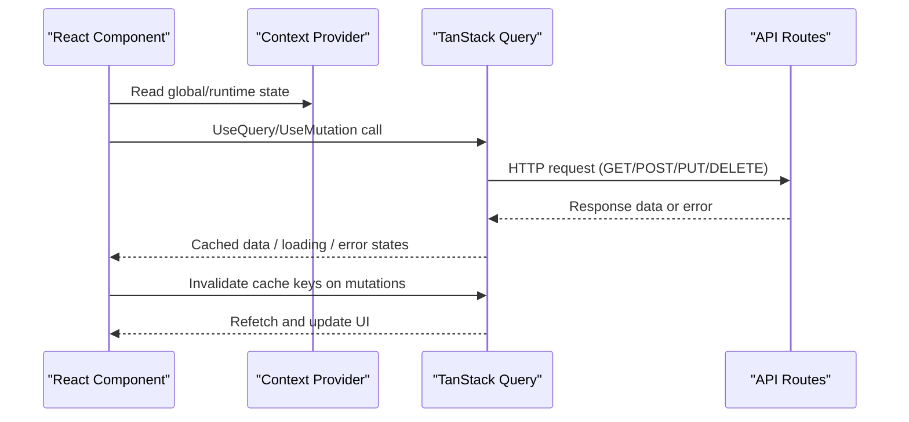
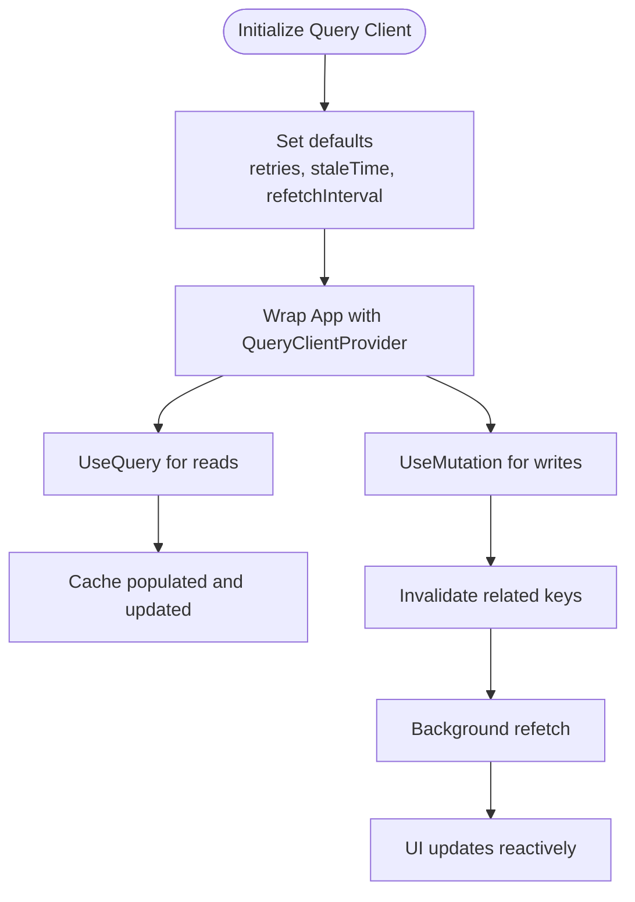
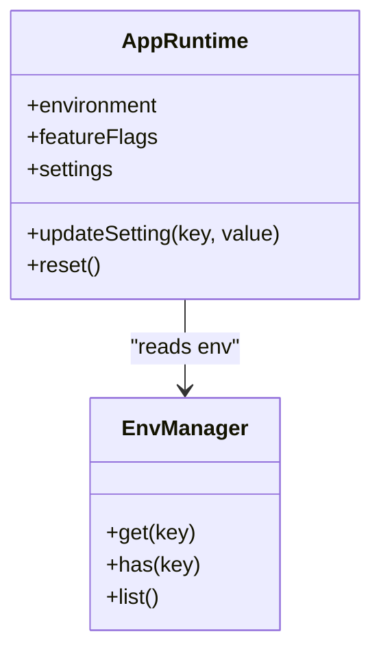
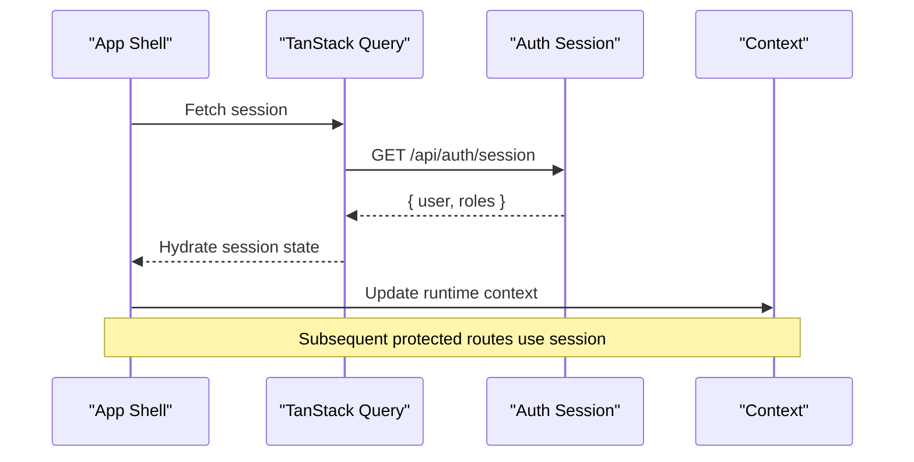
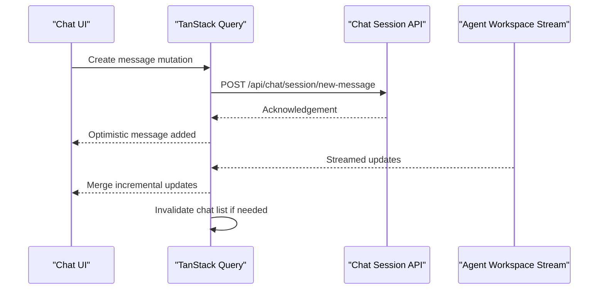
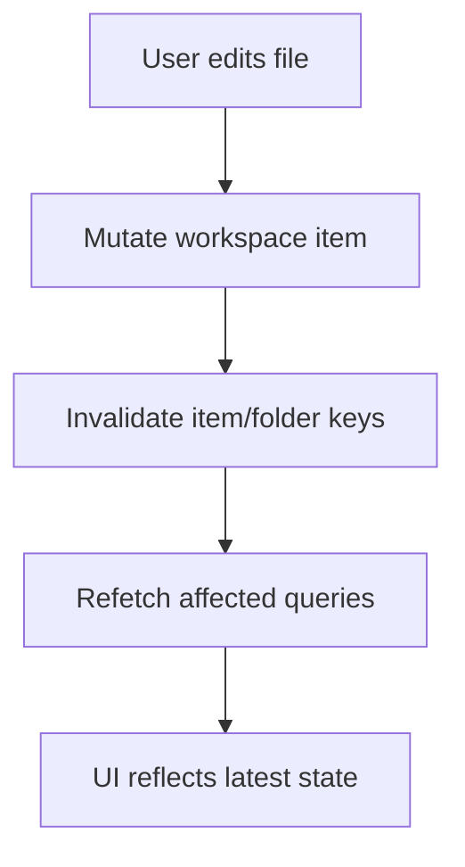
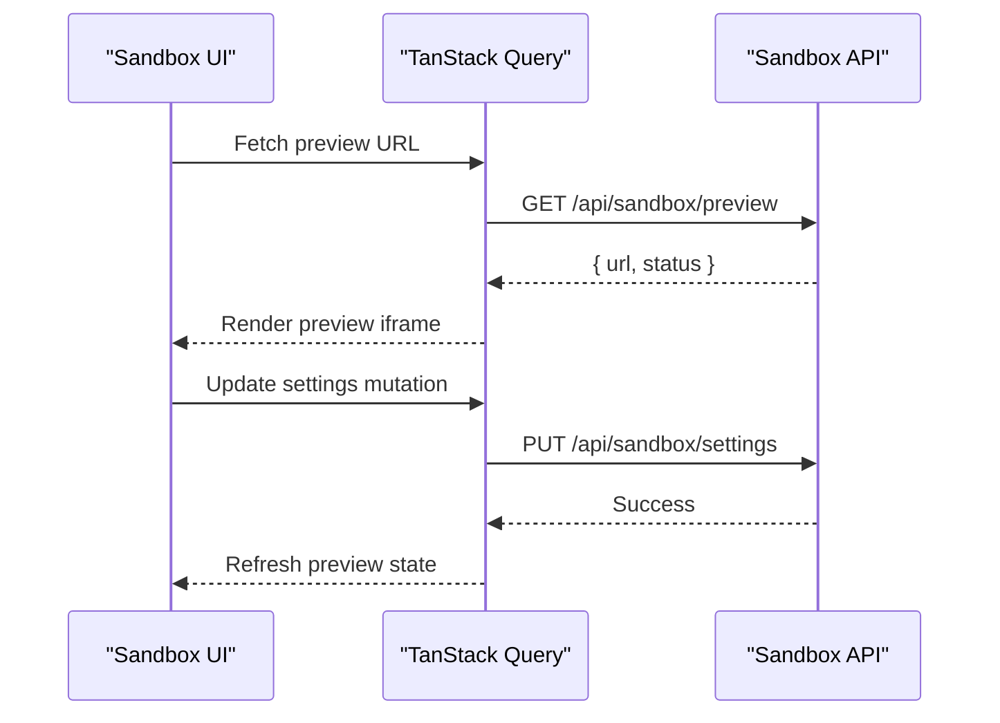
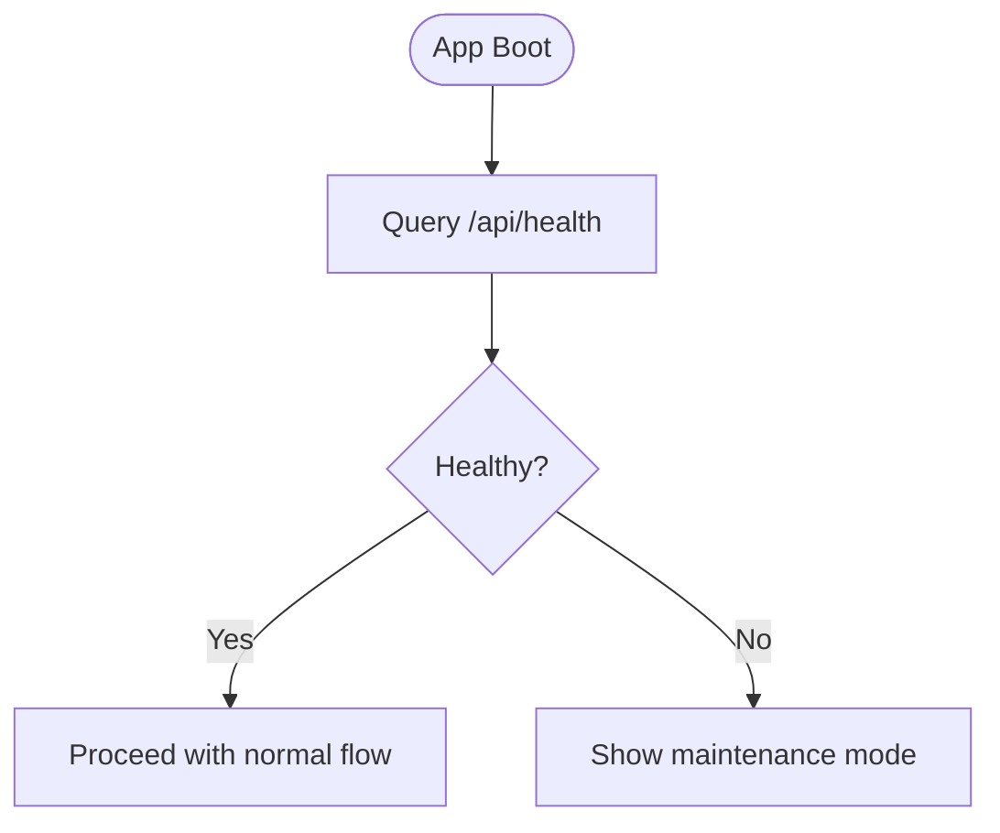
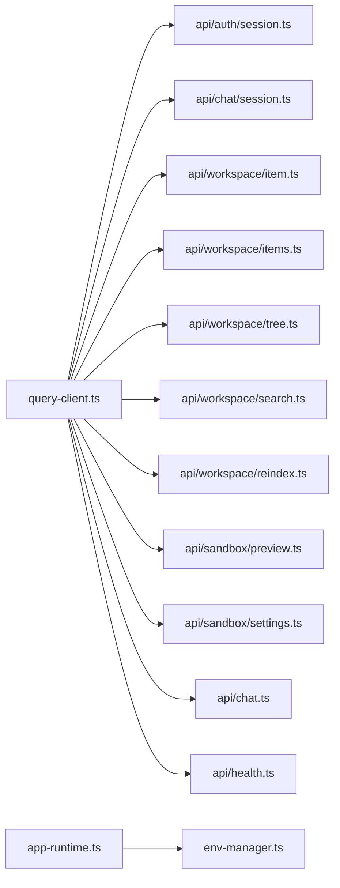

# State Management

<cite>
**Referenced Files in This Document**
- [query-client.ts](file://apps/web/src/lib/query-client.ts)
- [app-runtime.ts](file://apps/web/src/lib/app-runtime.ts)
- [env-manager.ts](file://apps/web/src/lib/env-manager.ts)
- [__root.tsx](file://apps/web/src/routes/__root.tsx)
- [index.tsx](file://apps/web/src/routes/index.tsx)
- [login.tsx](file://apps/web/src/routes/login.tsx)
- [session.ts](file://apps/web/src/routes/api/auth/session.ts)
- [chat-session.ts](file://apps/web/src/routes/api/chat/session.ts)
- [workspace-item.ts](file://apps/web/src/routes/api/workspace/item.ts)
- [workspace-items.ts](file://apps/web/src/routes/api/workspace/items.ts)
- [workspace-tree.ts](file://apps/web/src/routes/api/workspace/tree.ts)
- [workspace-search.ts](file://apps/web/src/routes/api/workspace/search.ts)
- [workspace-reindex.ts](file://apps/web/src/routes/api/workspace/reindex.ts)
- [daytona-preview.ts](file://apps/web/src/routes/api/sandbox/preview.ts)
- [daytona-settings.ts](file://apps/web/src/routes/api/sandbox/settings.ts)
- [chat-api.ts](file://apps/web/src/routes/api/chat.ts)
- [health.ts](file://apps/web/src/routes/api/health.ts)
</cite>

## Table of Contents

1. [Introduction](#introduction)
2. [Project Structure](#project-structure)
3. [Core Components](#core-components)
4. [Architecture Overview](#architecture-overview)
5. [Detailed Component Analysis](#detailed-component-analysis)
6. [Dependency Analysis](#dependency-analysis)
7. [Performance Considerations](#performance-considerations)
8. [Troubleshooting Guide](#troubleshooting-guide)
9. [Conclusion](#conclusion)

## Introduction

This document explains the state management architecture that combines React Context for UI and application runtime state, TanStack Query for server state, and local component state for transient UI concerns. It covers session handling, user preferences, global settings, data fetching patterns, cache invalidation, optimistic updates, real-time synchronization with the agent workspace, error state handling, performance considerations, memory management, and debugging techniques.

## Project Structure

The web application organizes state-related logic across:

- A shared query client configuration for TanStack Query
- An application runtime module for cross-cutting app state (e.g., environment, feature flags)
- Route-level components that compose context providers and render pages
- API route handlers that expose endpoints consumed by TanStack Query queries and mutations

```mermaid
graph TB
subgraph "App Shell"
Root["Root Route (__root.tsx)"]
Index["Index Route (index.tsx)"]
Login["Login Route (login.tsx)"]
end
subgraph "State Layer"
QueryClient["TanStack Query Client (query-client.ts)"]
AppRuntime["App Runtime (app-runtime.ts)"]
EnvManager["Environment Manager (env-manager.ts)"]
end
subgraph "Server State APIs"
AuthSession["Auth Session (api/auth/session.ts)"]
ChatSession["Chat Session (api/chat/session.ts)"]
WorkspaceItem["Workspace Item (api/workspace/item.ts)"]
WorkspaceItems["Workspace Items (api/workspace/items.ts)"]
WorkspaceTree["Workspace Tree (api/workspace/tree.ts)"]
WorkspaceSearch["Workspace Search (api/workspace/search.ts)"]
WorkspaceReindex["Workspace Reindex (api/workspace/reindex.ts)"]
SandboxPreview["Sandbox Preview (api/sandbox/preview.ts)"]
SandboxSettings["Sandbox Settings (api/sandbox/settings.ts)"]
ChatAPI["Chat API (api/chat.ts)"]
Health["Health (api/health.ts)"]
end
Root --> QueryClient
Root --> AppRuntime
AppRuntime --> EnvManager
Index --> QueryClient
Login --> QueryClient
QueryClient --> AuthSession
QueryClient --> ChatSession
QueryClient --> WorkspaceItem
QueryClient --> WorkspaceItems
QueryClient --> WorkspaceTree
QueryClient --> WorkspaceSearch
QueryClient --> WorkspaceReindex
QueryClient --> SandboxPreview
QueryClient --> SandboxSettings
QueryClient --> ChatAPI
QueryClient --> Health
```

**Diagram sources**

- [__root.tsx](file://apps/web/src/routes/__root.tsx)
- [index.tsx](file://apps/web/src/routes/index.tsx)
- [login.tsx](file://apps/web/src/routes/login.tsx)
- [query-client.ts](file://apps/web/src/lib/query-client.ts)
- [app-runtime.ts](file://apps/web/src/lib/app-runtime.ts)
- [env-manager.ts](file://apps/web/src/lib/env-manager.ts)
- [session.ts](file://apps/web/src/routes/api/auth/session.ts)
- [chat-session.ts](file://apps/web/src/routes/api/chat/session.ts)
- [workspace-item.ts](file://apps/web/src/routes/api/workspace/item.ts)
- [workspace-items.ts](file://apps/web/src/routes/api/workspace/items.ts)
- [workspace-tree.ts](file://apps/web/src/routes/api/workspace/tree.ts)
- [workspace-search.ts](file://apps/web/src/routes/api/workspace/search.ts)
- [workspace-reindex.ts](file://apps/web/src/routes/api/workspace/reindex.ts)
- [daytona-preview.ts](file://apps/web/src/routes/api/sandbox/preview.ts)
- [daytona-settings.ts](file://apps/web/src/routes/api/sandbox/settings.ts)
- [chat-api.ts](file://apps/web/src/routes/api/chat.ts)
- [health.ts](file://apps/web/src/routes/api/health.ts)

**Section sources**

- [query-client.ts](file://apps/web/src/lib/query-client.ts)
- [app-runtime.ts](file://apps/web/src/lib/app-runtime.ts)
- [env-manager.ts](file://apps/web/src/lib/env-manager.ts)
- [__root.tsx](file://apps/web/src/routes/__root.tsx)
- [index.tsx](file://apps/web/src/routes/index.tsx)
- [login.tsx](file://apps/web/src/routes/login.tsx)

## Core Components

- TanStack Query Client: Centralized configuration for caching, retries, refetching, and background updates. Used by all server-state hooks to fetch and mutate data.
- Application Runtime: Holds global application state such as environment variables, feature flags, and runtime configuration. Exposed via React Context for consumption across components.
- Environment Manager: Provides typed access to environment-specific values and secrets, ensuring consistent configuration across the app.
- Route Providers: The root and page routes wrap the app with necessary contexts (Query Client provider, App Runtime provider) and manage lifecycle events like authentication checks.

Key responsibilities:

- Server state is managed exclusively through TanStack Query; no manual caching or deduplication is needed at the component level.
- Global UI and runtime state are provided via React Context to avoid prop drilling and to keep components focused on presentation and behavior.
- Local component state handles ephemeral UI concerns like form inputs, toggles, and temporary selections.

**Section sources**

- [query-client.ts](file://apps/web/src/lib/query-client.ts)
- [app-runtime.ts](file://apps/web/src/lib/app-runtime.ts)
- [env-manager.ts](file://apps/web/src/lib/env-manager.ts)
- [__root.tsx](file://apps/web/src/routes/__root.tsx)

## Architecture Overview

The hybrid state architecture separates concerns clearly:

- Server state: TanStack Query manages network requests, caching, background refetches, and optimistic updates.
- Global state: React Context provides application-wide settings, session metadata, and feature flags.
- Local state: Components maintain transient UI state using standard React primitives.

**Diagram sources**

- [query-client.ts](file://apps/web/src/lib/query-client.ts)
- [session.ts](file://apps/web/src/routes/api/auth/session.ts)
- [chat-session.ts](file://apps/web/src/routes/api/chat/session.ts)
- [workspace-item.ts](file://apps/web/src/routes/api/workspace/item.ts)
- [workspace-items.ts](file://apps/web/src/routes/api/workspace/items.ts)
- [workspace-tree.ts](file://apps/web/src/routes/api/workspace/tree.ts)
- [workspace-search.ts](file://apps/web/src/routes/api/workspace/search.ts)
- [workspace-reindex.ts](file://apps/web/src/routes/api/workspace/reindex.ts)
- [daytona-preview.ts](file://apps/web/src/routes/api/sandbox/preview.ts)
- [daytona-settings.ts](file://apps/web/src/routes/api/sandbox/settings.ts)
- [chat-api.ts](file://apps/web/src/routes/api/chat.ts)
- [health.ts](file://apps/web/src/routes/api/health.ts)

## Detailed Component Analysis

### TanStack Query Client Configuration

- Purpose: Define default retry policies, stale times, refetch intervals, and error handling strategies.
- Usage: Imported by route providers and components to ensure consistent caching behavior across the app.
- Cache Keys: Organize by domain (auth, chat, workspace, sandbox) to enable targeted invalidation.

**Diagram sources**

- [query-client.ts](file://apps/web/src/lib/query-client.ts)

**Section sources**

- [query-client.ts](file://apps/web/src/lib/query-client.ts)

### Application Runtime Context

- Purpose: Provide global settings, environment variables, and feature flags to all components.
- Lifecycle: Initialized early in the root route and consumed by child routes and components.
- Updates: Changes trigger re-renders only where the context value is used.

**Diagram sources**

- [app-runtime.ts](file://apps/web/src/lib/app-runtime.ts)
- [env-manager.ts](file://apps/web/src/lib/env-manager.ts)

**Section sources**

- [app-runtime.ts](file://apps/web/src/lib/app-runtime.ts)
- [env-manager.ts](file://apps/web/src/lib/env-manager.ts)

### Authentication and Session Handling

- Flow: On app load, check session via an auth endpoint. If authenticated, hydrate user state; otherwise redirect to login.
- Caching: Session data cached with appropriate stale time and refetch on focus.
- Invalidations: On logout or token refresh, invalidate session and dependent queries.

**Diagram sources**

- [session.ts](file://apps/web/src/routes/api/auth/session.ts)
- [query-client.ts](file://apps/web/src/lib/query-client.ts)
- [app-runtime.ts](file://apps/web/src/lib/app-runtime.ts)

**Section sources**

- [session.ts](file://apps/web/src/routes/api/auth/session.ts)
- [query-client.ts](file://apps/web/src/lib/query-client.ts)
- [app-runtime.ts](file://apps/web/src/lib/app-runtime.ts)

### Chat State and Real-Time Synchronization

- Data Model: Chat sessions, messages, and runs are fetched and mutated via dedicated endpoints.
- Real-Time Sync: Use polling or WebSocket-like patterns through TanStack Query’s refetch intervals and optimistic updates to mirror agent workspace changes.
- Optimistic Updates: Immediately reflect user actions before server confirmation; revert on error.

**Diagram sources**

- [chat-session.ts](file://apps/web/src/routes/api/chat/session.ts)
- [chat-api.ts](file://apps/web/src/routes/api/chat.ts)
- [query-client.ts](file://apps/web/src/lib/query-client.ts)

**Section sources**

- [chat-session.ts](file://apps/web/src/routes/api/chat/session.ts)
- [chat-api.ts](file://apps/web/src/routes/api/chat.ts)
- [query-client.ts](file://apps/web/src/lib/query-client.ts)

### Workspace State and File Operations

- Endpoints: CRUD operations for workspace items, tree traversal, search, and reindexing.
- Cache Strategy: Fine-grained cache keys per item and folder; invalidated on create/update/delete.
- Real-Time Sync: Reindex triggers invalidate related caches to reflect file system changes.

**Diagram sources**

- [workspace-item.ts](file://apps/web/src/routes/api/workspace/item.ts)
- [workspace-items.ts](file://apps/web/src/routes/api/workspace/items.ts)
- [workspace-tree.ts](file://apps/web/src/routes/api/workspace/tree.ts)
- [workspace-search.ts](file://apps/web/src/routes/api/workspace/search.ts)
- [workspace-reindex.ts](file://apps/web/src/routes/api/workspace/reindex.ts)
- [query-client.ts](file://apps/web/src/lib/query-client.ts)

**Section sources**

- [workspace-item.ts](file://apps/web/src/routes/api/workspace/item.ts)
- [workspace-items.ts](file://apps/web/src/routes/api/workspace/items.ts)
- [workspace-tree.ts](file://apps/web/src/routes/api/workspace/tree.ts)
- [workspace-search.ts](file://apps/web/src/routes/api/workspace/search.ts)
- [workspace-reindex.ts](file://apps/web/src/routes/api/workspace/reindex.ts)
- [query-client.ts](file://apps/web/src/lib/query-client.ts)

### Sandbox and Preview State

- Endpoints: Manage preview URLs and sandbox settings.
- Caching: Short-lived cache for previews; long-lived cache for settings.
- Invalidations: Triggered when settings change or preview status updates.

**Diagram sources**

- [daytona-preview.ts](file://apps/web/src/routes/api/sandbox/preview.ts)
- [daytona-settings.ts](file://apps/web/src/routes/api/sandbox/settings.ts)
- [query-client.ts](file://apps/web/src/lib/query-client.ts)

**Section sources**

- [daytona-preview.ts](file://apps/web/src/routes/api/sandbox/preview.ts)
- [daytona-settings.ts](file://apps/web/src/routes/api/sandbox/settings.ts)
- [query-client.ts](file://apps/web/src/lib/query-client.ts)

### Health Check and Resilience

- Endpoint: Simple health probe to verify backend availability.
- Usage: Gate features or display maintenance banners based on health status.
- Caching: Long stale time to avoid frequent polling.

**Diagram sources**

- [health.ts](file://apps/web/src/routes/api/health.ts)
- [query-client.ts](file://apps/web/src/lib/query-client.ts)

**Section sources**

- [health.ts](file://apps/web/src/routes/api/health.ts)
- [query-client.ts](file://apps/web/src/lib/query-client.ts)

## Dependency Analysis

The state layer depends on well-defined API contracts. TanStack Query decouples components from direct HTTP calls, while React Context centralizes global state.

**Diagram sources**

- [query-client.ts](file://apps/web/src/lib/query-client.ts)
- [session.ts](file://apps/web/src/routes/api/auth/session.ts)
- [chat-session.ts](file://apps/web/src/routes/api/chat/session.ts)
- [workspace-item.ts](file://apps/web/src/routes/api/workspace/item.ts)
- [workspace-items.ts](file://apps/web/src/routes/api/workspace/items.ts)
- [workspace-tree.ts](file://apps/web/src/routes/api/workspace/tree.ts)
- [workspace-search.ts](file://apps/web/src/routes/api/workspace/search.ts)
- [workspace-reindex.ts](file://apps/web/src/routes/api/workspace/reindex.ts)
- [daytona-preview.ts](file://apps/web/src/routes/api/sandbox/preview.ts)
- [daytona-settings.ts](file://apps/web/src/routes/api/sandbox/settings.ts)
- [chat-api.ts](file://apps/web/src/routes/api/chat.ts)
- [health.ts](file://apps/web/src/routes/api/health.ts)
- [app-runtime.ts](file://apps/web/src/lib/app-runtime.ts)
- [env-manager.ts](file://apps/web/src/lib/env-manager.ts)

**Section sources**

- [query-client.ts](file://apps/web/src/lib/query-client.ts)
- [app-runtime.ts](file://apps/web/src/lib/app-runtime.ts)
- [env-manager.ts](file://apps/web/src/lib/env-manager.ts)

## Performance Considerations

- Cache tuning: Configure staleTime and gcTime per query type to balance freshness and memory usage.
- Pagination and virtualization: For large lists (workspace items), implement pagination and virtual scrolling to reduce DOM size.
- Debounce and throttling: Apply debouncing to search queries and throttling to frequent updates (e.g., streaming logs).
- Selectors and memoization: Use selectors to derive data efficiently and prevent unnecessary re-renders.
- Background refetch: Enable refetchOnWindowFocus and refetchOnMount to keep data fresh without excessive polling.
- Memory management: Clear unused cache entries and abort in-flight requests on unmount to prevent leaks.

[No sources needed since this section provides general guidance]

## Troubleshooting Guide

Common issues and resolutions:

- Stale data: Verify cache keys and invalidation points; ensure mutations trigger correct invalidations.
- Network errors: Inspect retry policies and error boundaries; log failed requests and responses.
- Race conditions: Use query versioning or timestamps to handle concurrent updates; prefer optimistic updates with rollback.
- Context mismatches: Ensure providers are correctly wrapped around routes consuming context values.
- Debugging: Leverage TanStack Query DevTools to inspect cache, queries, and mutations; add logging around API calls and context updates.

**Section sources**

- [query-client.ts](file://apps/web/src/lib/query-client.ts)
- [app-runtime.ts](file://apps/web/src/lib/app-runtime.ts)

## Conclusion

The hybrid state management approach leverages TanStack Query for robust server state, React Context for global application state, and local component state for transient UI concerns. This separation yields predictable data flows, efficient caching, and scalable real-time synchronization. By applying careful cache invalidation, optimistic updates, and performance tuning, the application maintains responsiveness and reliability under complex state scenarios.

[No sources needed since this section summarizes without analyzing specific files]
