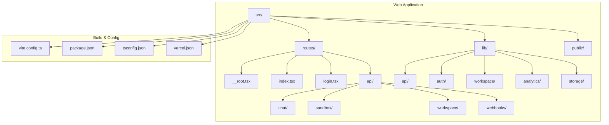
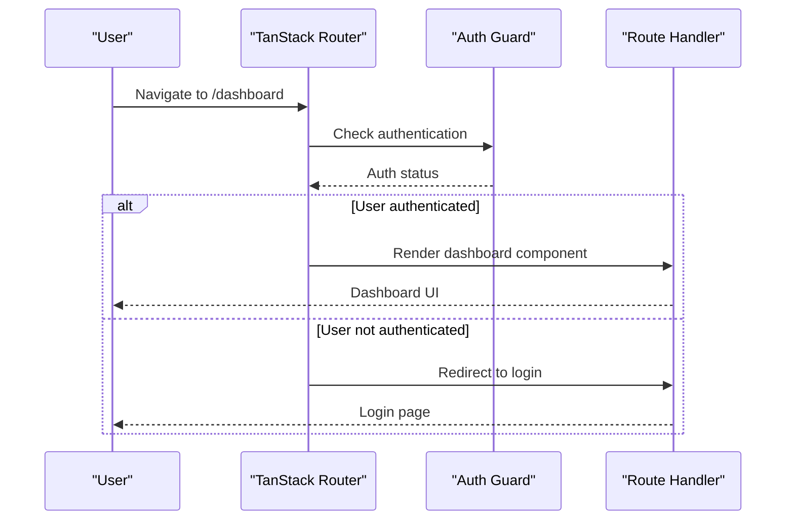
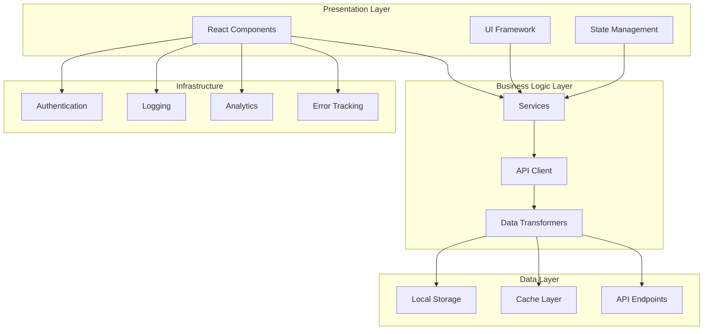
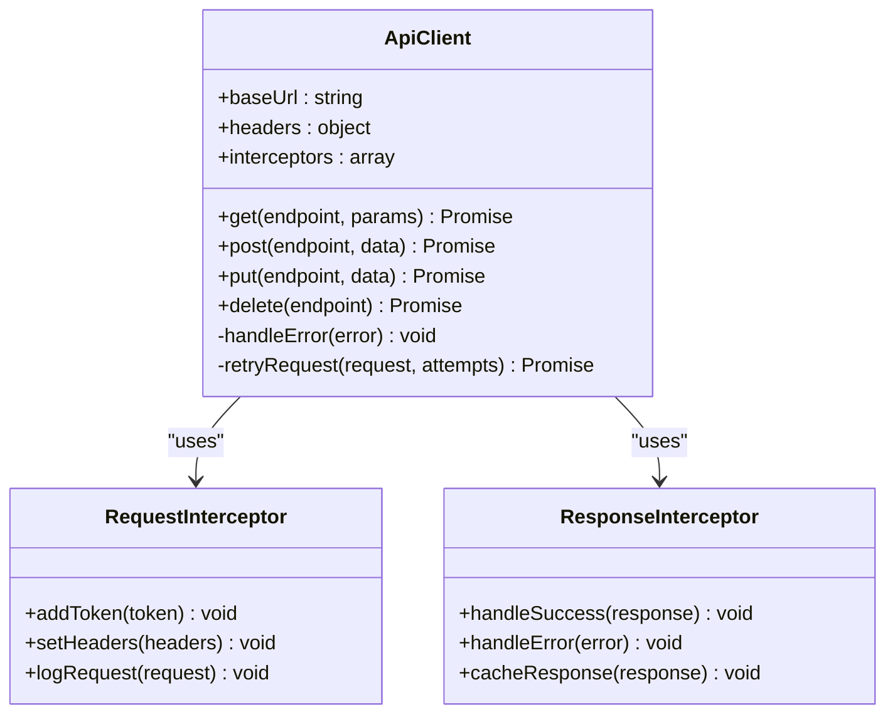
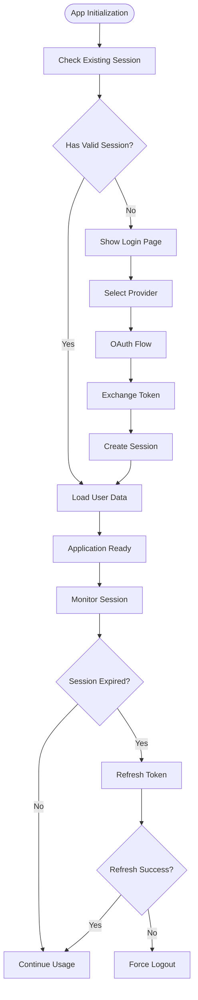
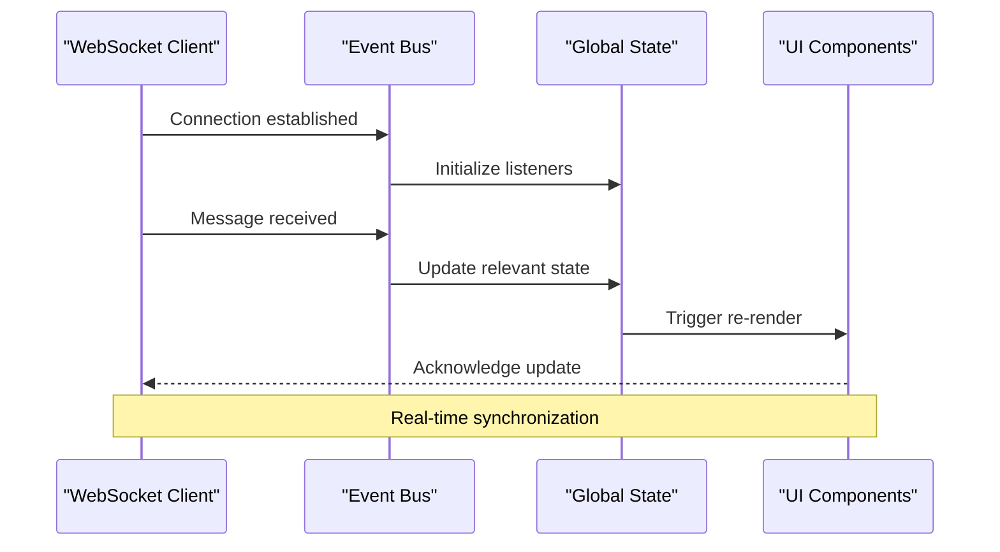
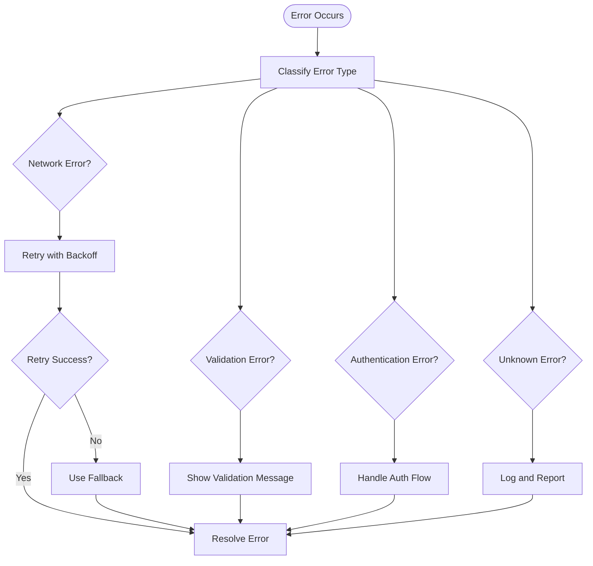
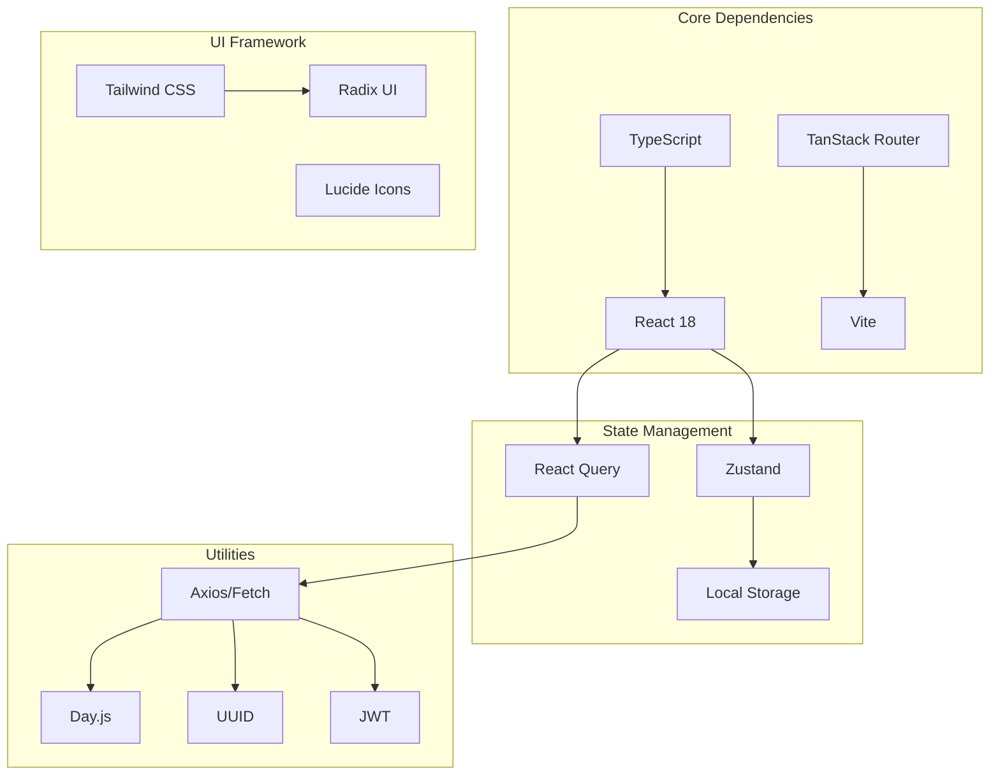

# Web Application Architecture

<cite>
**Referenced Files in This Document**
- [package.json](file://apps/web/package.json)
- [vite.config.ts](file://apps/web/vite.config.ts)
- [router.tsx](file://apps/web/src/router.tsx)
- [__root.tsx](file://apps/web/src/routes/__root.tsx)
- [app-runtime.ts](file://apps/web/src/lib/app-runtime.ts)
- [query-client.ts](file://apps/web/src/lib/query-client.ts)
- [env-manager.ts](file://apps/web/src/lib/env-manager.ts)
- [logger.ts](file://apps/web/src/lib/logger.ts)
- [api-utils.ts](file://apps/web/src/lib/api-utils.ts)
- [index.tsx](file://apps/web/src/routes/index.tsx)
- [login.tsx](file://apps/web/src/routes/login.tsx)
- [chat.ts](file://functions/chat.ts)
- [vercel.json](file://apps/web/vercel.json)
</cite>

## Table of Contents

1. [Introduction](#introduction)
2. [Project Structure](#project-structure)
3. [Core Components](#core-components)
4. [Architecture Overview](#architecture-overview)
5. [Detailed Component Analysis](#detailed-component-analysis)
6. [Dependency Analysis](#dependency-analysis)
7. [Performance Considerations](#performance-considerations)
8. [Troubleshooting Guide](#troubleshooting-guide)
9. [Conclusion](#conclusion)

## Introduction

This document provides a comprehensive analysis of the web application architecture for the Fleet Pi project. The application is built as a modern React-based frontend using Vite as the build tool and TanStack Router for routing management. The architecture follows contemporary best practices for scalable, maintainable, and performant web applications.

The system is designed to handle real-time updates from the agent workspace, manage authentication flows, and provide a seamless user experience across different devices and browsers. The architecture emphasizes modularity, type safety, and developer experience while maintaining high performance standards.

## Project Structure

The web application follows a feature-based organization within the `apps/web` directory, with clear separation between routes, business logic, utilities, and configuration files.

**Diagram sources**

- [vite.config.ts:1-50](file://apps/web/vite.config.ts#L1-L50)
- [package.json:1-100](file://apps/web/package.json#L1-L100)

**Section sources**

- [vite.config.ts:1-100](file://apps/web/vite.config.ts#L1-L100)
- [package.json:1-150](file://apps/web/package.json#L1-L150)

## Core Components

### Build System and Configuration

The application uses Vite as the primary build tool, providing fast development server and optimized production builds. The configuration includes TypeScript support, path aliases, and environment variable handling.

Key build features include:

- Hot Module Replacement (HMR) for rapid development
- Code splitting and tree shaking for optimal bundle size
- Environment-specific configurations
- Asset optimization and caching strategies

### Routing Architecture

TanStack Router provides type-safe routing with automatic code generation. The router configuration defines the application's navigation structure and route guards.

**Diagram sources**

- [router.tsx:1-100](file://apps/web/src/router.tsx#L1-L100)
- [__root.tsx:1-150](file://apps/web/src/routes/__root.tsx#L1-L150)

### Application Runtime Management

The application runtime manages global state, error boundaries, and lifecycle events through a centralized runtime manager.

**Section sources**

- [app-runtime.ts:1-200](file://apps/web/src/lib/app-runtime.ts#L1-L200)
- [router.tsx:1-100](file://apps/web/src/router.tsx#L1-L100)

## Architecture Overview

The web application follows a layered architecture pattern with clear separation of concerns:

**Diagram sources**

- [app-runtime.ts:1-200](file://apps/web/src/lib/app-runtime.ts#L1-L200)
- [api-utils.ts:1-150](file://apps/web/src/lib/api-utils.ts#L1-L150)

## Detailed Component Analysis

### API Client Layer

The API client provides a unified interface for all backend communication with built-in error handling, retry logic, and request/response interceptors.

**Diagram sources**

- [api-utils.ts:1-200](file://apps/web/src/lib/api-utils.ts#L1-L200)

### Authentication and Session Management

The authentication system supports multiple providers and maintains secure session state across the application.

**Diagram sources**

- [app-runtime.ts:1-200](file://apps/web/src/lib/app-runtime.ts#L1-L200)

### Real-time Updates from Agent Workspace

The application handles real-time updates through WebSocket connections and event-driven architecture.

**Diagram sources**

- [app-runtime.ts:1-200](file://apps/web/src/lib/app-runtime.ts#L1-L200)

### Error Handling Strategy

Comprehensive error handling ensures graceful degradation and informative feedback to users.

**Diagram sources**

- [api-utils.ts:1-200](file://apps/web/src/lib/api-utils.ts#L1-L200)

**Section sources**

- [api-utils.ts:1-200](file://apps/web/src/lib/api-utils.ts#L1-L200)
- [app-runtime.ts:1-200](file://apps/web/src/lib/app-runtime.ts#L1-L200)

## Dependency Analysis

The application maintains clean dependencies with minimal coupling between modules:

**Diagram sources**

- [package.json:1-150](file://apps/web/package.json#L1-L150)

**Section sources**

- [package.json:1-150](file://apps/web/package.json#L1-L150)

## Performance Considerations

### Bundle Optimization

- Code splitting by route and feature
- Tree shaking for unused dependencies
- Lazy loading of heavy components
- Asset optimization and caching

### Memory Management

- Proper cleanup of event listeners and subscriptions
- Efficient state updates with selective re-renders
- Memory leak prevention in long-running processes

### Network Optimization

- Request deduplication and caching
- Optimistic updates for better UX
- Compression and efficient payload formats

### Rendering Performance

- Virtual scrolling for large lists
- Memoization of expensive computations
- Debouncing and throttling of user interactions

## Troubleshooting Guide

### Common Issues and Solutions

**Development Server Issues**

- Port conflicts: Change port in vite config
- Module resolution errors: Verify TypeScript paths
- Hot reload problems: Clear cache and restart

**Runtime Errors**

- Authentication failures: Check token validity and expiration
- API connection issues: Verify endpoint URLs and CORS settings
- State synchronization problems: Check event listener cleanup

**Performance Issues**

- Slow initial load: Analyze bundle size and lazy loading
- Memory leaks: Use browser dev tools to identify leaks
- Unresponsive UI: Check for blocking operations and optimize rendering

### Debugging Utilities

The application includes comprehensive logging and debugging capabilities:

- Structured logging with levels and contexts
- Performance profiling hooks
- Error tracking and reporting
- Development-only debugging tools

**Section sources**

- [logger.ts:1-100](file://apps/web/src/lib/logger.ts#L1-L100)

## Conclusion

The web application architecture demonstrates a well-structured, modern approach to building scalable React applications. The combination of Vite, TanStack Router, and TypeScript provides a solid foundation for development productivity and runtime performance.

Key architectural strengths include:

- Clean separation of concerns with modular design
- Comprehensive error handling and logging
- Efficient state management and data synchronization
- Strong typing throughout the application
- Extensible plugin architecture for additional features

The architecture is designed to scale with the application's needs while maintaining code quality and developer experience. Future enhancements can be easily integrated through the established patterns and conventions.
