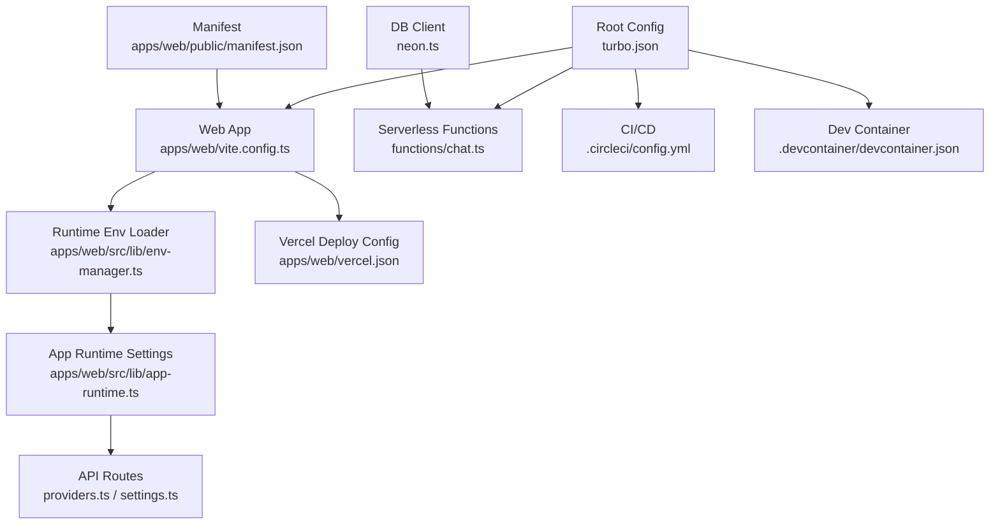
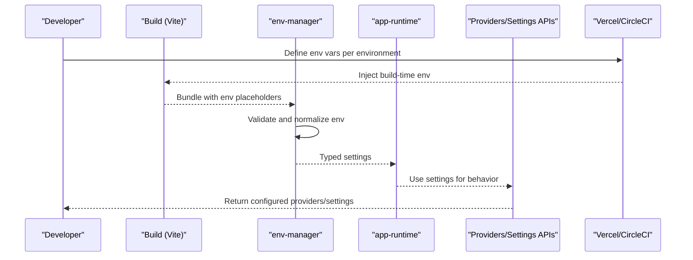
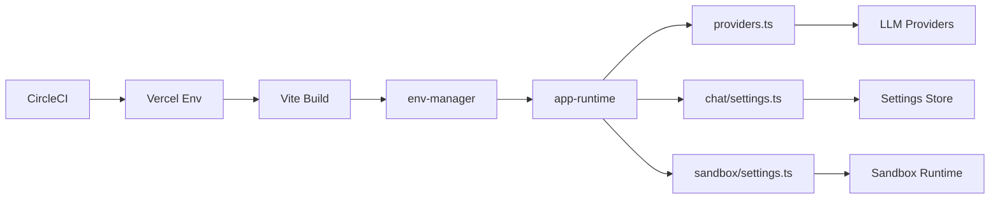

# Configuration & Customization

<cite>
**Referenced Files in This Document**
- [README.md](file://README.md)
- [package.json](file://package.json)
- [apps/web/package.json](file://apps/web/package.json)
- [apps/web/vite.config.ts](file://apps/web/vite.config.ts)
- [apps/web/vercel.json](file://apps/web/vercel.json)
- [apps/web/src/lib/env-manager.ts](file://apps/web/src/lib/env-manager.ts)
- [apps/web/src/lib/app-runtime.ts](file://apps/web/src/lib/app-runtime.ts)
- [apps/web/src/routes/api/chat/providers.ts](file://apps/web/src/routes/api/chat/providers.ts)
- [apps/web/src/routes/api/chat/settings.ts](file://apps/web/src/routes/api/chat/settings.ts)
- [apps/web/src/routes/api/sandbox/settings.ts](file://apps/web/src/routes/api/sandbox/settings.ts)
- [apps/web/src/routes/api/workspace/health.ts](file://apps/web/src/routes/api/workspace/health.ts)
- [apps/web/public/manifest.json](file://apps/web/public/manifest.json)
- [functions/chat.ts](file://functions/chat.ts)
- [neon.ts](file://neon.ts)
- [turbo.json](file://turbo.json)
- [.circleci/config.yml](file://.circleci/config.yml)
- [.devcontainer/devcontainer.json](file://.devcontainer/devcontainer.json)
- [docs/wiki/reference/configuration.md](file://docs/wiki/reference/configuration.md)
</cite>

## Table of Contents

1. [Introduction](#introduction)
2. [Project Structure](#project-structure)
3. [Core Components](#core-components)
4. [Architecture Overview](#architecture-overview)
5. [Detailed Component Analysis](#detailed-component-analysis)
6. [Dependency Analysis](#dependency-analysis)
7. [Performance Considerations](#performance-considerations)
8. [Troubleshooting Guide](#troubleshooting-guide)
9. [Conclusion](#conclusion)
10. [Appendices](#appendices)

## Introduction

This document provides comprehensive configuration and customization guidance for Fleet Pi. It covers environment variables, application settings, theme and UI customization, authentication providers, third-party integrations, and environment-specific configurations for development, staging, and production. It also includes common configuration scenarios and troubleshooting tips to help you deploy and operate Fleet Pi reliably.

## Project Structure

Fleet Pi is a monorepo with a web application under apps/web, serverless functions under functions, and shared tooling and documentation at the root. Configuration spans multiple layers:

- Build-time configuration (Vite, Vercel, Turbo)
- Runtime environment variables (env-manager, app-runtime)
- API routes that expose settings and provider configuration
- Deployment and CI/CD configuration (CircleCI, devcontainer)
- Documentation reference for configuration

**Diagram sources**

- [turbo.json](file://turbo.json)
- [apps/web/vite.config.ts](file://apps/web/vite.config.ts)
- [functions/chat.ts](file://functions/chat.ts)
- [apps/web/src/lib/env-manager.ts](file://apps/web/src/lib/env-manager.ts)
- [apps/web/src/lib/app-runtime.ts](file://apps/web/src/lib/app-runtime.ts)
- [apps/web/src/routes/api/chat/providers.ts](file://apps/web/src/routes/api/chat/providers.ts)
- [apps/web/src/routes/api/chat/settings.ts](file://apps/web/src/routes/api/chat/settings.ts)
- [apps/web/vercel.json](file://apps/web/vercel.json)
- [.circleci/config.yml](file://.circleci/config.yml)
- [.devcontainer/devcontainer.json](file://.devcontainer/devcontainer.json)
- [apps/web/public/manifest.json](file://apps/web/public/manifest.json)
- [neon.ts](file://neon.ts)

**Section sources**

- [README.md](file://README.md)
- [package.json](file://package.json)
- [apps/web/package.json](file://apps/web/package.json)
- [turbo.json](file://turbo.json)

## Core Components

- Environment variable loader: Centralizes runtime env resolution and validation for the web app.
- App runtime: Exposes typed settings consumed by UI and API logic.
- Provider configuration: API route to discover and configure LLM providers.
- Chat settings: API route to manage chat-related settings.
- Sandbox settings: API route to manage sandbox configuration.
- Health endpoint: Provides service health and readiness checks.
- Manifest: Web app metadata and PWA settings.
- Serverless function: Handles chat requests via Cloudflare/Vercel functions.
- DB client: Database connection setup (Neon).

Key responsibilities:

- Provide a single source of truth for environment-driven behavior.
- Expose configuration endpoints for dynamic updates where appropriate.
- Ensure consistent defaults across environments while allowing overrides.

**Section sources**

- [apps/web/src/lib/env-manager.ts](file://apps/web/src/lib/env-manager.ts)
- [apps/web/src/lib/app-runtime.ts](file://apps/web/src/lib/app-runtime.ts)
- [apps/web/src/routes/api/chat/providers.ts](file://apps/web/src/routes/api/chat/providers.ts)
- [apps/web/src/routes/api/chat/settings.ts](file://apps/web/src/routes/api/chat/settings.ts)
- [apps/web/src/routes/api/sandbox/settings.ts](file://apps/web/src/routes/api/sandbox/settings.ts)
- [apps/web/src/routes/api/workspace/health.ts](file://apps/web/src/routes/api/workspace/health.ts)
- [apps/web/public/manifest.json](file://apps/web/public/manifest.json)
- [functions/chat.ts](file://functions/chat.ts)
- [neon.ts](file://neon.ts)

## Architecture Overview

The configuration architecture follows a layered approach:

- Build-time: Vite and Vercel inject build-time env into the bundle.
- Runtime: env-manager reads process.env and exposes validated values.
- App layer: app-runtime aggregates settings for components and API routes.
- API layer: providers and settings endpoints allow dynamic configuration discovery and updates.
- Infrastructure: CI/CD and deployment configs define environment-specific secrets and variables.

**Diagram sources**

- [apps/web/vite.config.ts](file://apps/web/vite.config.ts)
- [apps/web/src/lib/env-manager.ts](file://apps/web/src/lib/env-manager.ts)
- [apps/web/src/lib/app-runtime.ts](file://apps/web/src/lib/app-runtime.ts)
- [apps/web/src/routes/api/chat/providers.ts](file://apps/web/src/routes/api/chat/providers.ts)
- [apps/web/src/routes/api/chat/settings.ts](file://apps/web/src/routes/api/chat/settings.ts)
- [apps/web/vercel.json](file://apps/web/vercel.json)
- [.circleci/config.yml](file://.circleci/config.yml)

## Detailed Component Analysis

### Environment Variable Management

- Purpose: Centralize environment loading, validation, and exposure to the app.
- Behavior: Reads process.env, applies defaults, validates presence/types, and exports typed values.
- Impact: Controls feature flags, API endpoints, logging levels, and integration toggles.

Configuration scope:

- Build-time env (injected by Vite/Vercel).
- Runtime env (available at process startup).

Best practices:

- Keep sensitive values out of the bundle; use runtime-only env.
- Validate all required envs on startup to fail fast.
- Group related envs by feature for clarity.

**Section sources**

- [apps/web/src/lib/env-manager.ts](file://apps/web/src/lib/env-manager.ts)
- [apps/web/vite.config.ts](file://apps/web/vite.config.ts)
- [apps/web/vercel.json](file://apps/web/vercel.json)

### Application Runtime Settings

- Purpose: Aggregate environment-derived settings into a stable interface for UI and API.
- Behavior: Normalizes booleans, URLs, timeouts, and feature flags; exposes getters.
- Impact: Determines default models, provider selection, UI themes, and analytics toggles.

Common categories:

- Feature flags (enable/disable features).
- Integration endpoints (LLM providers, analytics, storage).
- UI preferences (theme, locale, branding).
- Security settings (CORS, session policies).

**Section sources**

- [apps/web/src/lib/app-runtime.ts](file://apps/web/src/lib/app-runtime.ts)

### Provider Configuration API

- Purpose: Discover and configure supported LLM providers dynamically.
- Behavior: Returns available providers based on runtime env and allows updating provider credentials or endpoints.
- Impact: Enables multi-provider support without redeployments when using dynamic config.

Usage patterns:

- Fetch provider list on app start.
- Persist user-selected provider in local storage or backend.
- Validate provider credentials before use.

**Section sources**

- [apps/web/src/routes/api/chat/providers.ts](file://apps/web/src/routes/api/chat/providers.ts)

### Chat Settings API

- Purpose: Manage chat-related settings such as model defaults, temperature, max tokens, and conversation policies.
- Behavior: GET returns current settings; POST updates persisted settings.
- Impact: Allows users to tailor chat behavior per session or globally.

Security considerations:

- Enforce authorization for write operations.
- Validate input schemas strictly.

**Section sources**

- [apps/web/src/routes/api/chat/settings.ts](file://apps/web/src/routes/api/chat/settings.ts)

### Sandbox Settings API

- Purpose: Configure sandbox environment parameters like resource limits, network access, and execution policies.
- Behavior: GET/POST endpoints for reading and updating sandbox settings.
- Impact: Controls isolation and security boundaries for code execution.

Operational notes:

- Changes may require restart or hot reload depending on implementation.
- Audit changes for compliance and safety.

**Section sources**

- [apps/web/src/routes/api/sandbox/settings.ts](file://apps/web/src/routes/api/sandbox/settings.ts)

### Health Endpoint

- Purpose: Expose service health and readiness for load balancers and orchestrators.
- Behavior: Returns status codes and metadata about dependencies (DB, external services).
- Impact: Enables automated scaling, retries, and alerting.

Health checks:

- Liveness: Is the process alive?
- Readiness: Are dependencies healthy?

**Section sources**

- [apps/web/src/routes/api/workspace/health.ts](file://apps/web/src/routes/api/workspace/health.ts)

### Web Manifest and Branding

- Purpose: Define app metadata, icons, theme color, and PWA behavior.
- Behavior: Served from public/manifest.json; consumed by browsers and install prompts.
- Impact: Influences how the app appears when installed or bookmarked.

Customization options:

- App name, short name, description.
- Icons and splash screens.
- Theme color and display mode.

**Section sources**

- [apps/web/public/manifest.json](file://apps/web/public/manifest.json)

### Serverless Function for Chat

- Purpose: Handle chat requests in a serverless runtime.
- Behavior: Receives payloads, invokes LLM providers, streams responses, and handles errors.
- Impact: Scalability and cost-efficiency for chat workloads.

Integration points:

- Environment variables for provider keys and endpoints.
- Logging and metrics hooks.

**Section sources**

- [functions/chat.ts](file://functions/chat.ts)

### Database Client

- Purpose: Initialize database connections (Neon) used by backend logic.
- Behavior: Configures connection strings, pooling, and retry policies.
- Impact: Reliability and performance of data operations.

Security:

- Use secret managers for connection strings.
- Restrict network access to allowed CIDRs.

**Section sources**

- [neon.ts](file://neon.ts)

## Dependency Analysis

Configuration dependencies span build, runtime, and deployment layers:

- Vite builds embed build-time env; runtime env must be provided by the hosting platform.
- env-manager depends on process.env availability and validation rules.
- app-runtime depends on env-manager outputs.
- API routes depend on app-runtime and external services.
- CI/CD pipelines inject environment-specific secrets and variables.

**Diagram sources**

- [apps/web/vite.config.ts](file://apps/web/vite.config.ts)
- [apps/web/src/lib/env-manager.ts](file://apps/web/src/lib/env-manager.ts)
- [apps/web/src/lib/app-runtime.ts](file://apps/web/src/lib/app-runtime.ts)
- [apps/web/src/routes/api/chat/providers.ts](file://apps/web/src/routes/api/chat/providers.ts)
- [apps/web/src/routes/api/chat/settings.ts](file://apps/web/src/routes/api/chat/settings.ts)
- [apps/web/src/routes/api/sandbox/settings.ts](file://apps/web/src/routes/api/sandbox/settings.ts)
- [apps/web/vercel.json](file://apps/web/vercel.json)
- [.circleci/config.yml](file://.circleci/config.yml)

**Section sources**

- [turbo.json](file://turbo.json)
- [.circleci/config.yml](file://.circleci/config.yml)
- [.devcontainer/devcontainer.json](file://.devcontainer/devcontainer.json)

## Performance Considerations

- Minimize runtime env lookups by caching validated settings in app-runtime.
- Avoid embedding large secrets in build-time env; prefer runtime-only variables.
- Use health endpoints to prevent routing traffic to unhealthy instances.
- Tune provider request timeouts and retries based on observed latency.
- Enable compression and caching headers for static assets and manifest.

[No sources needed since this section provides general guidance]

## Troubleshooting Guide

Common issues and resolutions:

- Missing environment variables:
  - Symptom: Startup errors or undefined settings.
  - Resolution: Verify all required envs are set in the hosting platform’s environment settings.
- Build-time vs runtime env confusion:
  - Symptom: Variables not visible in the browser.
  - Resolution: Ensure critical variables are runtime-only and not prefixed for Vite build-time injection.
- Provider connectivity failures:
  - Symptom: Errors when calling LLM endpoints.
  - Resolution: Check provider keys, base URLs, and network egress rules.
- Sandbox misconfiguration:
  - Symptom: Execution failures or permission errors.
  - Resolution: Review sandbox settings and resource limits; validate policy changes.
- Health check failures:
  - Symptom: Instances marked unhealthy.
  - Resolution: Inspect dependency statuses and logs; restart if necessary.

**Section sources**

- [apps/web/src/lib/env-manager.ts](file://apps/web/src/lib/env-manager.ts)
- [apps/web/src/lib/app-runtime.ts](file://apps/web/src/lib/app-runtime.ts)
- [apps/web/src/routes/api/chat/providers.ts](file://apps/web/src/routes/api/chat/providers.ts)
- [apps/web/src/routes/api/chat/settings.ts](file://apps/web/src/routes/api/chat/settings.ts)
- [apps/web/src/routes/api/sandbox/settings.ts](file://apps/web/src/routes/api/sandbox/settings.ts)
- [apps/web/src/routes/api/workspace/health.ts](file://apps/web/src/routes/api/workspace/health.ts)

## Conclusion

Fleet Pi’s configuration system is designed for clarity, safety, and flexibility. By separating build-time and runtime concerns, validating environment inputs, and exposing configuration through well-defined APIs, it supports secure and scalable deployments across environments. Use this guide to configure providers, customize UI, and integrate third-party services confidently.

[No sources needed since this section summarizes without analyzing specific files]

## Appendices

### Environment-Specific Configuration Scenarios

- Development:
  - Use local providers or mock endpoints.
  - Enable verbose logging and debug features.
  - Set CORS to allow localhost origins.
- Staging:
  - Mirror production envs with test data.
  - Enable feature flags for new integrations.
  - Monitor health and error rates closely.
- Production:
  - Secure all secrets via platform secret managers.
  - Disable debug endpoints and verbose logs.
  - Enforce strict CSP and CORS policies.

[No sources needed since this section provides general guidance]

### Theme and UI Customization

- Modify manifest for branding and PWA behavior.
- Adjust app-runtime settings for theme defaults and locale.
- Update public assets (icons, logos) as needed.

**Section sources**

- [apps/web/public/manifest.json](file://apps/web/public/manifest.json)
- [apps/web/src/lib/app-runtime.ts](file://apps/web/src/lib/app-runtime.ts)

### Authentication and Security Settings

- Configure auth providers via environment variables and provider APIs.
- Enforce HTTPS and secure cookies.
- Implement rate limiting and request validation on sensitive endpoints.

[No sources needed since this section provides general guidance]

### Third-Party Integrations

- LLM providers: Configure base URLs, keys, and model IDs via provider API.
- Analytics: Set tracking IDs and privacy flags.
- Storage: Configure endpoints and credentials for file persistence.

**Section sources**

- [apps/web/src/routes/api/chat/providers.ts](file://apps/web/src/routes/api/chat/providers.ts)

### Reference Documentation

- Consult the wiki reference for detailed configuration fields and examples.

**Section sources**

- [docs/wiki/reference/configuration.md](file://docs/wiki/reference/configuration.md)
