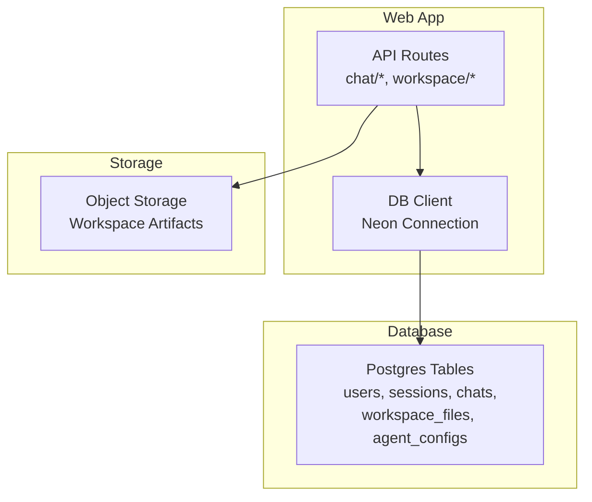
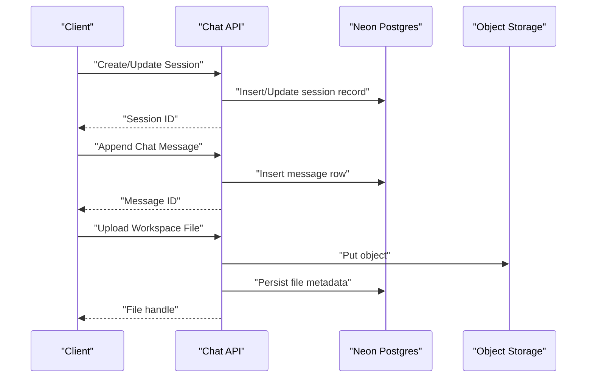
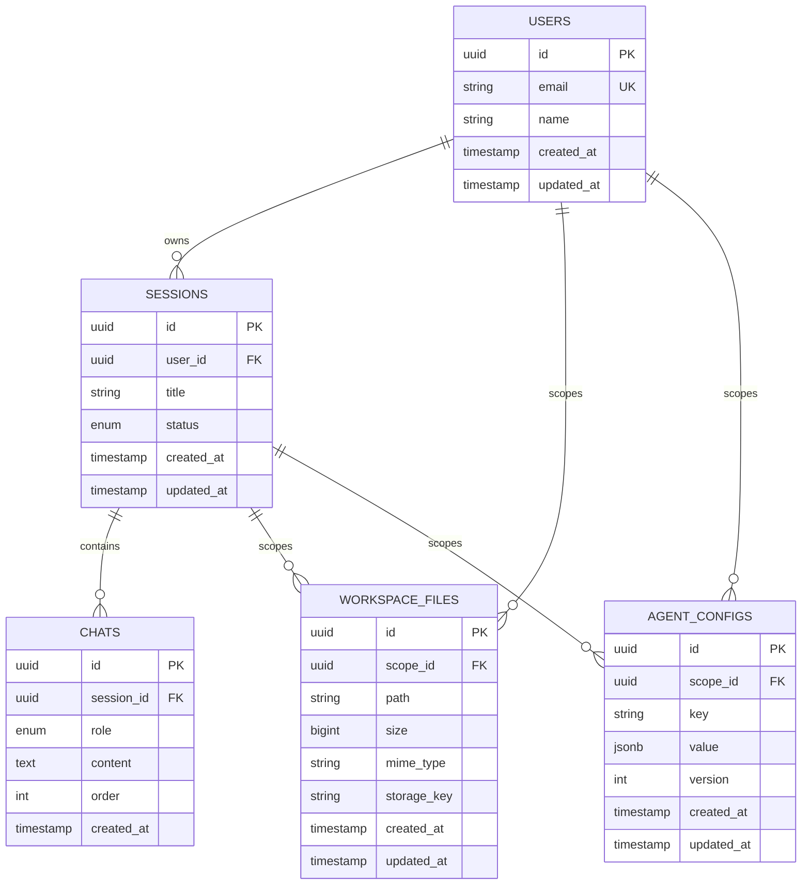
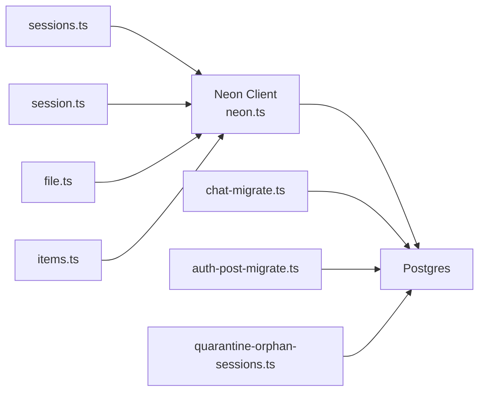

# Database Schema

<cite>
**Referenced Files in This Document**
- [neon.ts](file://neon.ts)
- [apps/web/src/lib/db/index.ts](file://apps/web/src/lib/db/index.ts)
- [apps/web/src/routes/api/chat/sessions.ts](file://apps/web/src/routes/api/chat/sessions.ts)
- [apps/web/src/routes/api/chat/session.ts](file://apps/web/src/routes/api/chat/session.ts)
- [apps/web/src/routes/api/workspace/file.ts](file://apps/web/src/routes/api/workspace/file.ts)
- [apps/web/src/routes/api/workspace/items.ts](file://apps/web/src/routes/api/workspace/items.ts)
- [scripts/chat-migrate.ts](file://scripts/chat-migrate.ts)
- [scripts/auth-post-migrate.ts](file://scripts/auth-post-migrate.ts)
- [scripts/quarantine-orphan-sessions.ts](file://scripts/quarantine-orphan-sessions.ts)
- [docs/wiki/reference/data-models.md](file://docs/wiki/reference/data-models.md)
</cite>

## Table of Contents

1. [Introduction](#introduction)
2. [Project Structure](#project-structure)
3. [Core Components](#core-components)
4. [Architecture Overview](#architecture-overview)
5. [Detailed Component Analysis](#detailed-component-analysis)
6. [Dependency Analysis](#dependency-analysis)
7. [Performance Considerations](#performance-considerations)
8. [Troubleshooting Guide](#troubleshooting-guide)
9. [Conclusion](#conclusion)
10. [Appendices](#appendices)

## Introduction

This document provides comprehensive data model documentation for Fleet Pi’s database schema, focusing on entities that underpin users, sessions, chats, workspace files, and agent configurations. It details field definitions, types, keys, indexes, constraints, validation rules enforced at the database layer, and data lifecycle management including retention and archival strategies. It also outlines access patterns, caching considerations, and performance guidance for workloads involving large conversation histories or extensive workspace file trees.

## Project Structure

Fleet Pi uses a serverless web application with a Neon Postgres backend. The database connection is configured centrally and consumed by API routes and migration scripts. Data models are primarily defined via SQL migrations and enforced through application-level validations. Workspace files are persisted as objects (e.g., in object storage), while metadata and indexing information are stored in relational tables.

**Diagram sources**

- [neon.ts:1-200](file://neon.ts#L1-L200)
- [apps/web/src/lib/db/index.ts:1-200](file://apps/web/src/lib/db/index.ts#L1-L200)
- [apps/web/src/routes/api/chat/sessions.ts:1-200](file://apps/web/src/routes/api/chat/sessions.ts#L1-L200)
- [apps/web/src/routes/api/workspace/file.ts:1-200](file://apps/web/src/routes/api/workspace/file.ts#L1-L200)

**Section sources**

- [neon.ts:1-200](file://neon.ts#L1-L200)
- [apps/web/src/lib/db/index.ts:1-200](file://apps/web/src/lib/db/index.ts#L1-L200)

## Core Components

The core data model revolves around the following entities:

- Users: Identity and account metadata.
- Sessions: Conversational contexts tied to users.
- Chats: Messages within a session, ordered chronologically.
- Workspace Files: Metadata for files managed by agents, with references to object storage.
- Agent Configurations: Settings controlling agent behavior per user or workspace.

Key relationships:

- One User has many Sessions.
- One Session has many Chats.
- Workspace Files may be associated with a Session or a User scope.
- Agent Configurations can be scoped to a User or a Workspace context.

Data validation and constraints:

- Primary keys ensure entity uniqueness.
- Foreign keys enforce referential integrity between related entities.
- NOT NULL and CHECK constraints enforce required fields and value ranges where applicable.
- Indexes optimize common query patterns such as listing recent chats or searching workspace files.

Indexes and performance:

- Composite indexes on foreign keys and timestamps improve join and range queries.
- Partial indexes target hot paths like active sessions or recent messages.
- Partitioning or archival strategies may be considered for very large chat histories.

Lifecycle and retention:

- Soft deletes for sessions and chats allow recovery and compliance.
- Retention policies archive or purge old sessions and artifacts based on configuration.
- Workspace files follow a lifecycle from creation to archival/deletion.

**Section sources**

- [docs/wiki/reference/data-models.md:1-200](file://docs/wiki/reference/data-models.md#L1-L200)

## Architecture Overview

The data architecture integrates relational storage for structured data and object storage for large artifacts. API endpoints orchestrate reads/writes through a centralized DB client. Migrations define schema evolution, while background scripts manage lifecycle operations like quarantine and cleanup.

**Diagram sources**

- [apps/web/src/routes/api/chat/sessions.ts:1-200](file://apps/web/src/routes/api/chat/sessions.ts#L1-L200)
- [apps/web/src/routes/api/chat/session.ts:1-200](file://apps/web/src/routes/api/chat/session.ts#L1-L200)
- [apps/web/src/routes/api/workspace/file.ts:1-200](file://apps/web/src/routes/api/workspace/file.ts#L1-L200)

## Detailed Component Analysis

### Users

- Purpose: Represents authenticated users and their account metadata.
- Key fields:
  - id: Unique identifier (primary key).
  - email: User email address (unique constraint).
  - name: Display name.
  - created_at, updated_at: Timestamps for lifecycle tracking.
- Constraints:
  - NOT NULL on essential fields.
  - UNIQUE on email to prevent duplicates.
- Indexes:
  - Email index for fast lookups during authentication.
- Validation:
  - Email format enforced at application layer; database ensures uniqueness.

**Section sources**

- [scripts/auth-post-migrate.ts:1-200](file://scripts/auth-post-migrate.ts#L1-L200)

### Sessions

- Purpose: Encapsulates a conversational context owned by a user.
- Key fields:
  - id: Primary key.
  - user_id: Foreign key to users.
  - title: Human-readable session title.
  - status: Current state (e.g., active, archived).
  - created_at, updated_at: Lifecycle timestamps.
- Constraints:
  - user_id NOT NULL enforces ownership.
  - status CHECK constraint limits allowed values.
- Indexes:
  - user_id for listing user sessions.
  - created_at DESC for recent sessions.
- Validation:
  - Status transitions validated in application logic; database restricts invalid states.

**Section sources**

- [apps/web/src/routes/api/chat/sessions.ts:1-200](file://apps/web/src/routes/api/chat/sessions.ts#L1-L200)

### Chats

- Purpose: Stores individual messages within a session.
- Key fields:
  - id: Primary key.
  - session_id: Foreign key to sessions.
  - role: Sender role (e.g., user, assistant).
  - content: Message payload.
  - order: Sequence number for ordering within a session.
  - created_at: Timestamp.
- Constraints:
  - session_id NOT NULL.
  - order ensures deterministic message sequence.
- Indexes:
  - session_id + order for efficient retrieval and pagination.
  - created_at for time-based queries.
- Validation:
  - Role enum enforced; content length limits applied at application layer.

**Section sources**

- [apps/web/src/routes/api/chat/session.ts:1-200](file://apps/web/src/routes/api/chat/session.ts#L1-L200)

### Workspace Files

- Purpose: Metadata for files managed by agents, referencing object storage.
- Key fields:
  - id: Primary key.
  - session_id or user_id: Scope of the file.
  - path: Logical path within workspace.
  - size: File size in bytes.
  - mime_type: Content type.
  - storage_key: Reference to object storage.
  - created_at, updated_at: Lifecycle timestamps.
- Constraints:
  - storage_key NOT NULL when file exists.
  - path uniqueness within scope enforced by unique constraint.
- Indexes:
  - session_id or user_id for scoping queries.
  - path for tree traversal and search.
- Validation:
  - MIME type whitelist enforced at application layer; database ensures consistency.

**Section sources**

- [apps/web/src/routes/api/workspace/file.ts:1-200](file://apps/web/src/routes/api/workspace/file.ts#L1-L200)
- [apps/web/src/routes/api/workspace/items.ts:1-200](file://apps/web/src/routes/api/workspace/items.ts#L1-L200)

### Agent Configurations

- Purpose: Defines agent behavior settings per user or workspace.
- Key fields:
  - id: Primary key.
  - user_id or workspace_id: Scope of configuration.
  - key: Configuration key.
  - value: Serialized configuration value.
  - version: Versioning for config changes.
  - created_at, updated_at: Lifecycle timestamps.
- Constraints:
  - key uniqueness within scope.
  - version monotonicity enforced by application logic.
- Indexes:
  - user_id or workspace_id + key for fast lookup.
- Validation:
  - Value schema validated at application layer; database ensures integrity.

**Section sources**

- [docs/wiki/reference/data-models.md:1-200](file://docs/wiki/reference/data-models.md#L1-L200)

#### Entity Relationship Diagram

**Diagram sources**

- [apps/web/src/routes/api/chat/sessions.ts:1-200](file://apps/web/src/routes/api/chat/sessions.ts#L1-L200)
- [apps/web/src/routes/api/chat/session.ts:1-200](file://apps/web/src/routes/api/chat/session.ts#L1-L200)
- [apps/web/src/routes/api/workspace/file.ts:1-200](file://apps/web/src/routes/api/workspace/file.ts#L1-L200)
- [apps/web/src/routes/api/workspace/items.ts:1-200](file://apps/web/src/routes/api/workspace/items.ts#L1-L200)
- [docs/wiki/reference/data-models.md:1-200](file://docs/wiki/reference/data-models.md#L1-L200)

## Dependency Analysis

The data layer depends on a centralized Neon connection and is consumed by API routes. Migrations evolve schema safely, and background scripts maintain data health.

**Diagram sources**

- [neon.ts:1-200](file://neon.ts#L1-L200)
- [apps/web/src/routes/api/chat/sessions.ts:1-200](file://apps/web/src/routes/api/chat/sessions.ts#L1-L200)
- [apps/web/src/routes/api/chat/session.ts:1-200](file://apps/web/src/routes/api/chat/session.ts#L1-L200)
- [apps/web/src/routes/api/workspace/file.ts:1-200](file://apps/web/src/routes/api/workspace/file.ts#L1-L200)
- [apps/web/src/routes/api/workspace/items.ts:1-200](file://apps/web/src/routes/api/workspace/items.ts#L1-L200)
- [scripts/chat-migrate.ts:1-200](file://scripts/chat-migrate.ts#L1-L200)
- [scripts/auth-post-migrate.ts:1-200](file://scripts/auth-post-migrate.ts#L1-L200)
- [scripts/quarantine-orphan-sessions.ts:1-200](file://scripts/quarantine-orphan-sessions.ts#L1-L200)

**Section sources**

- [neon.ts:1-200](file://neon.ts#L1-L200)
- [apps/web/src/lib/db/index.ts:1-200](file://apps/web/src/lib/db/index.ts#L1-L200)

## Performance Considerations

- Query patterns:
  - Recent chats: Use session_id + order index; paginate with cursor-based approach.
  - Workspace tree traversal: Leverage path index; consider hierarchical queries or materialized paths.
  - Agent config lookup: Scope by user_id or workspace_id + key.
- Indexing strategy:
  - Composite indexes on (session_id, order) for chat ordering.
  - Partial indexes on active sessions to reduce bloat.
  - Unique constraints on email and path within scope.
- Caching:
  - Cache frequent reads (e.g., agent configs) with short TTLs.
  - Invalidate caches on writes to avoid stale data.
- Large datasets:
  - Partition chat history by session or time if necessary.
  - Archive old sessions and compress content.
- Object storage:
  - Stream large files; avoid loading entire payloads into memory.
  - Use CDN for read-heavy assets.

[No sources needed since this section provides general guidance]

## Troubleshooting Guide

Common issues and resolutions:

- Missing foreign key constraints: Ensure migrations run successfully; verify referential integrity.
- Duplicate emails: Check UNIQUE constraints and application validation.
- Slow chat queries: Validate indexes on session_id and order; consider pagination and limiting result sets.
- Orphaned sessions: Run quarantine script to identify and move orphaned sessions.
- Workspace file inconsistencies: Reindex workspace items and reconcile storage keys.

Operational scripts:

- Quarantine orphan sessions to isolate inconsistent data.
- Migrate chat data for schema updates.
- Post-auth migration tasks to align user records.

**Section sources**

- [scripts/quarantine-orphan-sessions.ts:1-200](file://scripts/quarantine-orphan-sessions.ts#L1-L200)
- [scripts/chat-migrate.ts:1-200](file://scripts/chat-migrate.ts#L1-L200)
- [scripts/auth-post-migrate.ts:1-200](file://scripts/auth-post-migrate.ts#L1-L200)

## Conclusion

Fleet Pi’s data model centers on users, sessions, chats, workspace files, and agent configurations, with clear relationships and robust constraints. Proper indexing, caching, and lifecycle management ensure scalability and reliability. Adhering to the outlined patterns and operational procedures will maintain data integrity and performance across evolving workloads.

[No sources needed since this section summarizes without analyzing specific files]

## Appendices

### Data Access Patterns

- Read-heavy patterns:
  - List recent chats with pagination.
  - Fetch workspace tree using path traversal.
- Write-heavy patterns:
  - Append chat messages with ordering.
  - Update agent configurations atomically.

### Retention and Archival Policies

- Sessions:
  - Active sessions retained indefinitely until user deletion.
  - Archived sessions compressed and moved to cold storage after policy threshold.
- Chats:
  - Messages archived with sessions; content may be truncated or summarized.
- Workspace files:
  - Hot storage for recent files; cold storage for older artifacts.
  - Deletion cascades respect referential integrity.

### Sample Data Structures

- Session:
  - id, user_id, title, status, created_at, updated_at.
- Chat:
  - id, session_id, role, content, order, created_at.
- Workspace File:
  - id, scope_id, path, size, mime_type, storage_key, created_at, updated_at.
- Agent Config:
  - id, scope_id, key, value, version, created_at, updated_at.

[No sources needed since this section provides conceptual examples]
