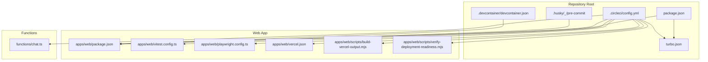
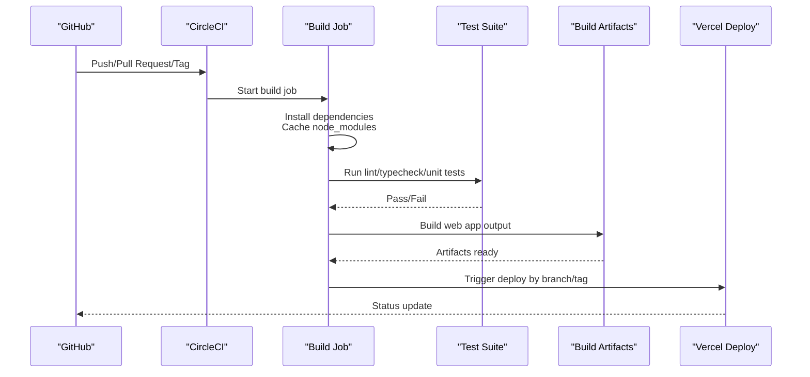
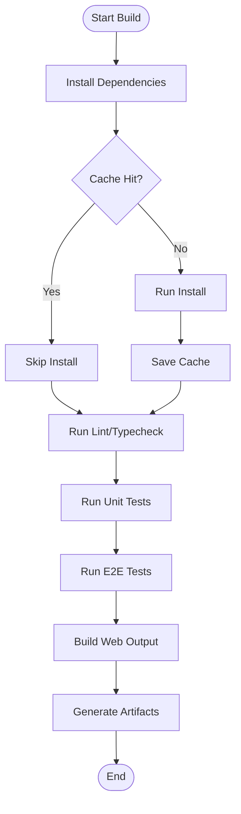
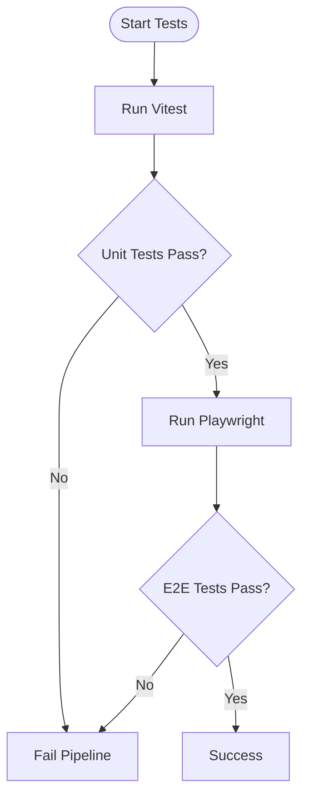
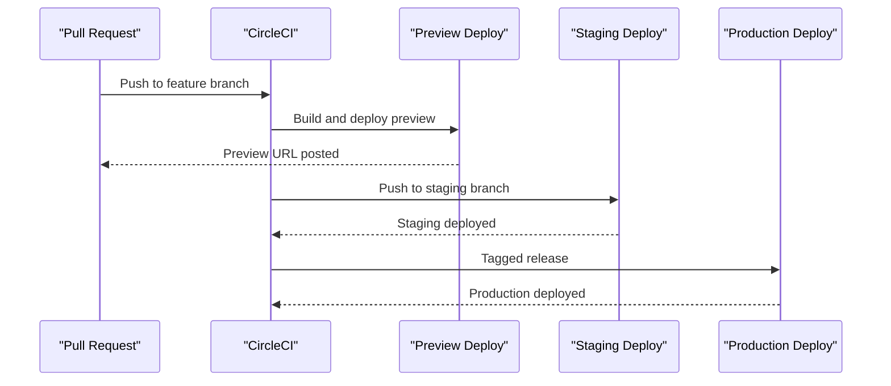
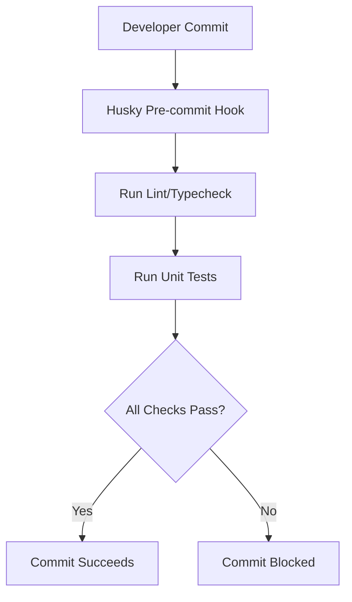
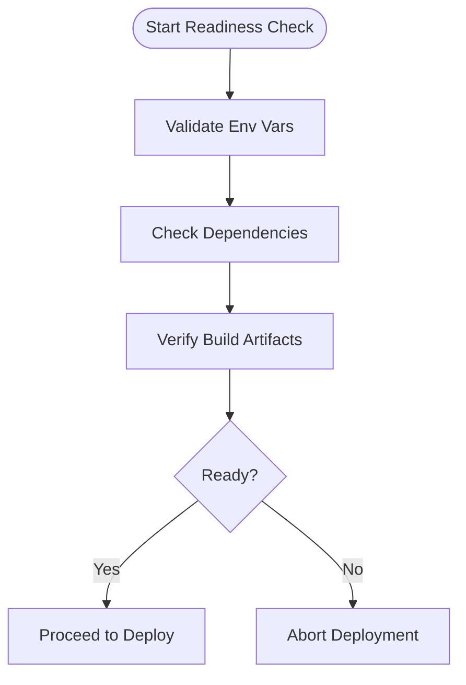
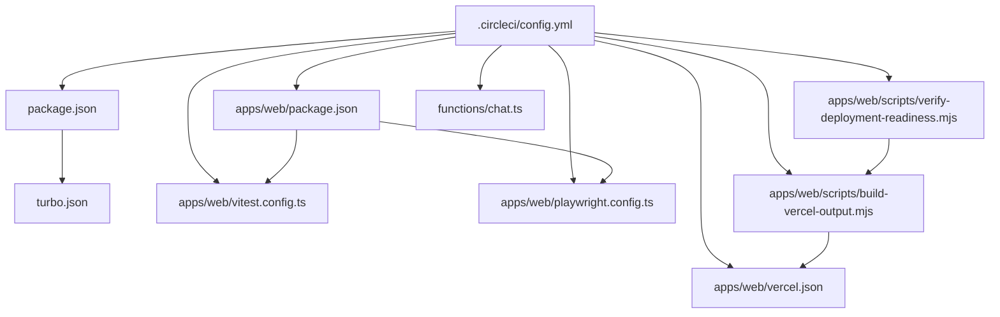

# CI/CD Pipeline

<cite>
**Referenced Files in This Document**
- [.circleci/config.yml](file://.circleci/config.yml)
- [package.json](file://package.json)
- [apps/web/package.json](file://apps/web/package.json)
- [apps/web/playwright.config.ts](file://apps/web/playwright.config.ts)
- [apps/web/vitest.config.ts](file://apps/web/vitest.config.ts)
- [turbo.json](file://turbo.json)
- [.husky/_/pre-commit](file://.husky/_/pre-commit)
- [.devcontainer/devcontainer.json](file://.devcontainer/devcontainer.json)
- [apps/web/scripts/verify-deployment-readiness.mjs](file://apps/web/scripts/verify-deployment-readiness.mjs)
- [apps/web/scripts/build-vercel-output.mjs](file://apps/web/scripts/build-vercel-output.mjs)
- [apps/web/vercel.json](file://apps/web/vercel.json)
- [functions/chat.ts](file://functions/chat.ts)
</cite>

## Table of Contents

1. [Introduction](#introduction)
2. [Project Structure](#project-structure)
3. [Core Components](#core-components)
4. [Architecture Overview](#architecture-overview)
5. [Detailed Component Analysis](#detailed-component-analysis)
6. [Dependency Analysis](#dependency-analysis)
7. [Performance Considerations](#performance-considerations)
8. [Troubleshooting Guide](#troubleshooting-guide)
9. [Conclusion](#conclusion)
10. [Appendices](#appendices)

## Introduction

This document describes the end-to-end CI/CD pipeline for Fleet Pi using CircleCI, including automated testing, code quality checks, artifact generation, and deployment workflows. It also covers local development automation with Husky hooks and pre-commit validations, as well as guidance for branch protection rules, deployment approvals, and rollback procedures. The goal is to provide a clear, actionable reference for contributors and maintainers to understand how changes flow from commit to production.

## Project Structure

The repository uses a monorepo layout with an application under apps/web, shared packages under packages, serverless functions under functions, and CI configuration under .circleci. Development tooling includes Turbo for task orchestration, Vitest for unit tests, Playwright for end-to-end tests, and Husky for Git hooks.

**Diagram sources**

- [.circleci/config.yml:1-200](file://.circleci/config.yml#L1-L200)
- [package.json:1-100](file://package.json#L1-L100)
- [apps/web/package.json:1-100](file://apps/web/package.json#L1-L100)
- [apps/web/vitest.config.ts:1-100](file://apps/web/vitest.config.ts#L1-L100)
- [apps/web/playwright.config.ts:1-100](file://apps/web/playwright.config.ts#L1-L100)
- [apps/web/vercel.json:1-100](file://apps/web/vercel.json#L1-L100)
- [apps/web/scripts/build-vercel-output.mjs:1-100](file://apps/web/scripts/build-vercel-output.mjs#L1-L100)
- [apps/web/scripts/verify-deployment-readiness.mjs:1-100](file://apps/web/scripts/verify-deployment-readiness.mjs#L1-L100)
- [functions/chat.ts:1-100](file://functions/chat.ts#L1-L100)

**Section sources**

- [.circleci/config.yml:1-200](file://.circleci/config.yml#L1-L200)
- [package.json:1-100](file://package.json#L1-L100)
- [apps/web/package.json:1-100](file://apps/web/package.json#L1-L100)
- [turbo.json:1-100](file://turbo.json#L1-L100)

## Core Components

- CircleCI Configuration: Defines jobs, workflows, caching, environment variables, and deployment triggers.
- Web App Scripts: Build outputs for Vercel and deployment readiness verification.
- Test Configurations: Vitest for unit tests and Playwright for e2e tests.
- Task Orchestration: Turbo tasks for consistent builds across environments.
- Dev Container: Standardized local environment setup.
- Git Hooks: Husky pre-commit hook to enforce local checks before pushing.

Key responsibilities:

- Automated linting, type checking, and test execution on every push or pull request.
- Artifact generation for preview deployments.
- Conditional deployment to staging/production based on branches and tags.
- Local developer experience via dev container and pre-commit hooks.

**Section sources**

- [.circleci/config.yml:1-200](file://.circleci/config.yml#L1-L200)
- [apps/web/scripts/build-vercel-output.mjs:1-100](file://apps/web/scripts/build-vercel-output.mjs#L1-L100)
- [apps/web/scripts/verify-deployment-readiness.mjs:1-100](file://apps/web/scripts/verify-deployment-readiness.mjs#L1-L100)
- [apps/web/vitest.config.ts:1-100](file://apps/web/vitest.config.ts#L1-L100)
- [apps/web/playwright.config.ts:1-100](file://apps/web/playwright.config.ts#L1-L100)
- [turbo.json:1-100](file://turbo.json#L1-L100)
- [.devcontainer/devcontainer.json:1-100](file://.devcontainer/devcontainer.json#L1-L100)
- [.husky/_/pre-commit:1-100](file://.husky/_/pre-commit#L1-L100)

## Architecture Overview

The CI/CD pipeline follows a staged approach:

- Checkout and dependency installation with caching.
- Code quality checks (linting, formatting).
- Unit tests with Vitest.
- End-to-end tests with Playwright.
- Build artifacts for Vercel deployment.
- Deployment to preview/staging/production based on branch/tag triggers.

**Diagram sources**

- [.circleci/config.yml:1-200](file://.circleci/config.yml#L1-L200)
- [apps/web/scripts/build-vercel-output.mjs:1-100](file://apps/web/scripts/build-vercel-output.mjs#L1-L100)
- [apps/web/scripts/verify-deployment-readiness.mjs:1-100](file://apps/web/scripts/verify-deployment-readiness.mjs#L1-L100)

## Detailed Component Analysis

### CircleCI Pipeline Configuration

- Jobs: Define stages for install, lint, test, build, and deploy.
- Workflows: Orchestrate jobs based on events (push, PR, tag).
- Environment Variables: Secrets and runtime flags are injected securely.
- Caching: Node modules and build caches to speed up runs.
- Triggers: Branch-based previews and tag-based production releases.

Best practices observed:

- Separate jobs for quality and deployment to isolate failures.
- Use of caching to reduce install times.
- Conditional steps for preview vs. production deployments.

**Section sources**

- [.circleci/config.yml:1-200](file://.circleci/config.yml#L1-L200)

### Build Stages and Artifact Generation

- Dependency Installation: Uses pnpm workspace to install all packages efficiently.
- Build Step: Generates static assets and serverless function bundles for Vercel.
- Artifacts: Outputs include built web app and function bundles, used for preview deployments.

**Diagram sources**

- [apps/web/scripts/build-vercel-output.mjs:1-100](file://apps/web/scripts/build-vercel-output.mjs#L1-L100)
- [turbo.json:1-100](file://turbo.json#L1-L100)

**Section sources**

- [apps/web/scripts/build-vercel-output.mjs:1-100](file://apps/web/scripts/build-vercel-output.mjs#L1-L100)
- [turbo.json:1-100](file://turbo.json#L1-L100)

### Testing Execution

- Unit Tests: Executed via Vitest configured in apps/web.
- E2E Tests: Executed via Playwright configured in apps/web.
- Coverage: Optional coverage reporting can be enabled in CI.

**Diagram sources**

- [apps/web/vitest.config.ts:1-100](file://apps/web/vitest.config.ts#L1-L100)
- [apps/web/playwright.config.ts:1-100](file://apps/web/playwright.config.ts#L1-L100)

**Section sources**

- [apps/web/vitest.config.ts:1-100](file://apps/web/vitest.config.ts#L1-L100)
- [apps/web/playwright.config.ts:1-100](file://apps/web/playwright.config.ts#L1-L100)

### Deployment Workflows

- Preview Deployments: Triggered on pull requests to create isolated previews.
- Staging Deployments: Triggered on pushes to staging branches.
- Production Deployments: Triggered on tagged releases with approval gates.

**Diagram sources**

- [.circleci/config.yml:1-200](file://.circleci/config.yml#L1-L200)
- [apps/web/vercel.json:1-100](file://apps/web/vercel.json#L1-L100)

**Section sources**

- [.circleci/config.yml:1-200](file://.circleci/config.yml#L1-L200)
- [apps/web/vercel.json:1-100](file://apps/web/vercel.json#L1-L100)

### Local Development Setup with Husky and Pre-commit

- Husky Hook: Enforces linting and tests locally before committing.
- Dev Container: Provides a consistent environment across developers.
- Workflow: Developers run pre-commit checks automatically when committing.

**Diagram sources**

- [.husky/_/pre-commit:1-100](file://.husky/_/pre-commit#L1-L100)
- [.devcontainer/devcontainer.json:1-100](file://.devcontainer/devcontainer.json#L1-L100)

**Section sources**

- [.husky/_/pre-commit:1-100](file://.husky/_/pre-commit#L1-L100)
- [.devcontainer/devcontainer.json:1-100](file://.devcontainer/devcontainer.json#L1-L100)

### Deployment Readiness Verification

- Script Purpose: Validates environment variables, dependencies, and build outputs before deploying.
- Integration: Called during CI prior to deployment steps to ensure readiness.

**Diagram sources**

- [apps/web/scripts/verify-deployment-readiness.mjs:1-100](file://apps/web/scripts/verify-deployment-readiness.mjs#L1-L100)

**Section sources**

- [apps/web/scripts/verify-deployment-readiness.mjs:1-100](file://apps/web/scripts/verify-deployment-readiness.mjs#L1-L100)

## Dependency Analysis

The pipeline depends on:

- Package manager and workspace configuration for dependency resolution.
- Test frameworks (Vitest, Playwright) for validation.
- Build tools and scripts for generating deployment artifacts.
- External services (Vercel) for hosting and preview deployments.

**Diagram sources**

- [.circleci/config.yml:1-200](file://.circleci/config.yml#L1-L200)
- [package.json:1-100](file://package.json#L1-L100)
- [apps/web/package.json:1-100](file://apps/web/package.json#L1-L100)
- [apps/web/vitest.config.ts:1-100](file://apps/web/vitest.config.ts#L1-L100)
- [apps/web/playwright.config.ts:1-100](file://apps/web/playwright.config.ts#L1-L100)
- [apps/web/scripts/build-vercel-output.mjs:1-100](file://apps/web/scripts/build-vercel-output.mjs#L1-L100)
- [apps/web/scripts/verify-deployment-readiness.mjs:1-100](file://apps/web/scripts/verify-deployment-readiness.mjs#L1-L100)
- [apps/web/vercel.json:1-100](file://apps/web/vercel.json#L1-L100)
- [functions/chat.ts:1-100](file://functions/chat.ts#L1-L100)

**Section sources**

- [.circleci/config.yml:1-200](file://.circleci/config.yml#L1-L200)
- [package.json:1-100](file://package.json#L1-L100)
- [apps/web/package.json:1-100](file://apps/web/package.json#L1-L100)

## Performance Considerations

- Caching: Leverage node_modules and build caches to reduce CI runtimes.
- Parallelization: Run independent jobs concurrently where possible.
- Incremental Builds: Use Turbo to avoid rebuilding unchanged packages.
- Test Optimization: Split large test suites into parallel jobs if needed.
- Artifact Minimization: Ensure only necessary files are included in deployment artifacts.

[No sources needed since this section provides general guidance]

## Troubleshooting Guide

Common issues and resolutions:

- Dependency Installation Failures: Verify network access and cache integrity; clear CI cache if corrupted.
- Test Failures: Inspect logs for failing tests; ensure environment variables are set correctly.
- Build Errors: Validate scripts and configurations; check for missing dependencies or incorrect paths.
- Deployment Rejections: Confirm environment variables and permissions; review deployment readiness script output.

Recommended debugging steps:

- Reproduce locally using the dev container.
- Run Husky pre-commit hooks manually to catch issues early.
- Review CircleCI job logs for detailed error traces.

**Section sources**

- [.circleci/config.yml:1-200](file://.circleci/config.yml#L1-L200)
- [.husky/_/pre-commit:1-100](file://.husky/_/pre-commit#L1-L100)
- [apps/web/scripts/verify-deployment-readiness.mjs:1-100](file://apps/web/scripts/verify-deployment-readiness.mjs#L1-L100)

## Conclusion

The Fleet Pi CI/CD pipeline integrates robust testing, quality checks, and deployment automation through CircleCI. By leveraging caching, parallelization, and conditional deployments, it ensures fast feedback loops and reliable releases. Local development is streamlined with Husky hooks and a standardized dev container. Following the guidelines in this document will help maintain consistency and reliability across contributions and deployments.

[No sources needed since this section summarizes without analyzing specific files]

## Appendices

### Branch Protection Rules

- Require status checks to pass before merging.
- Enforce required reviews for critical branches.
- Prevent force pushes to protected branches.

### Deployment Approvals

- Enable manual approvals for production deployments.
- Restrict deployment triggers to authorized users or service accounts.

### Rollback Procedures

- Use versioned deployments to revert to previous stable versions quickly.
- Maintain clear tagging conventions for releases.
- Automate rollback steps in CI/CD pipelines when health checks fail.

[No sources needed since this section provides general guidance]
