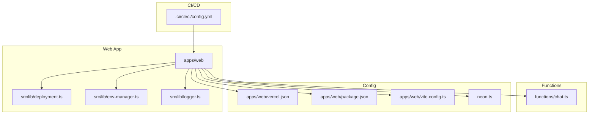
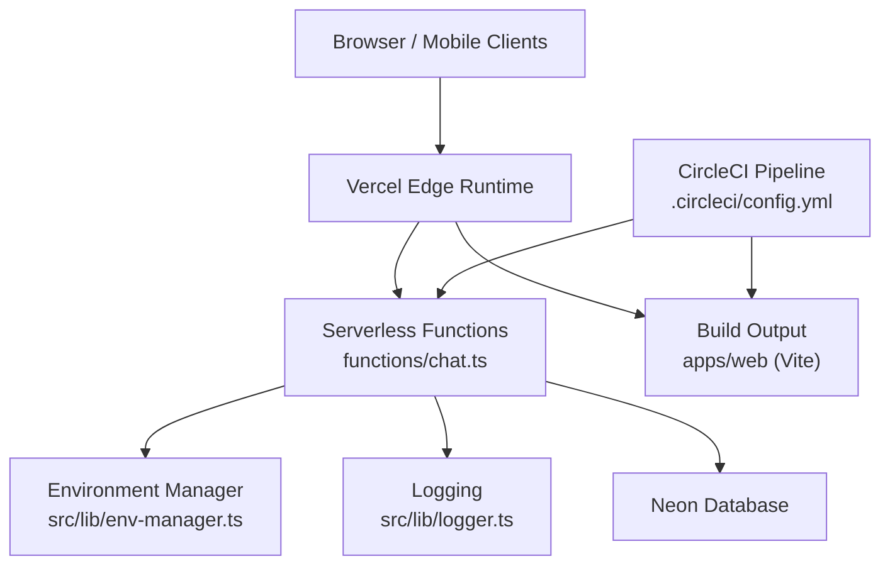
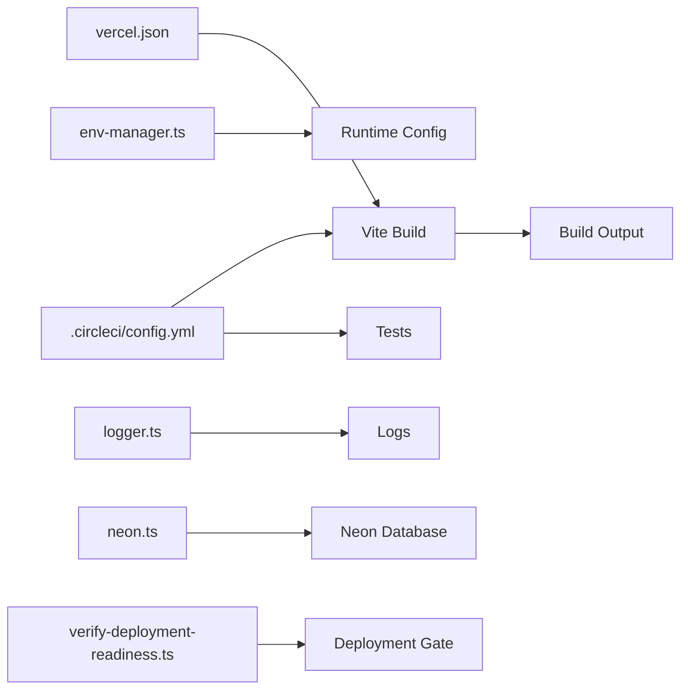

# Deployment & Operations

<cite>
**Referenced Files in This Document**
- [vercel.json](file://apps/web/vercel.json)
- [package.json](file://apps/web/package.json)
- [vite.config.ts](file://apps/web/vite.config.ts)
- [.circleci/config.yml](file://.circleci/config.yml)
- [neon.ts](file://neon.ts)
- [scripts/build-vercel-output.mjs](file://apps/web/scripts/build-vercel-output.mjs)
- [scripts/verify-deployment-readiness.ts](file://apps/web/scripts/verify-deployment-readiness.ts)
- [functions/chat.ts](file://functions/chat.ts)
- [src/lib/deployment.ts](file://apps/web/src/lib/deployment.ts)
- [src/lib/env-manager.ts](file://apps/web/src/lib/env-manager.ts)
- [src/lib/logger.ts](file://apps/web/src/lib/logger.ts)
- [docs/runbooks/deployment-release-gate.md](file://docs/runbooks/deployment-release-gate.md)
- [docs/wiki/deployment.md](file://docs/wiki/deployment.md)
- [docs/architecture.md](file://docs/architecture.md)
</cite>

## Table of Contents

1. [Introduction](#introduction)
2. [Project Structure](#project-structure)
3. [Core Components](#core-components)
4. [Architecture Overview](#architecture-overview)
5. [Detailed Component Analysis](#detailed-component-analysis)
6. [Dependency Analysis](#dependency-analysis)
7. [Performance Considerations](#performance-considerations)
8. [Troubleshooting Guide](#troubleshooting-guide)
9. [Conclusion](#conclusion)
10. [Appendices](#appendices)

## Introduction

This document provides production deployment and operations guidance for Fleet Pi. It covers Vercel deployment setup, environment variable configuration, database provisioning with Neon, CI/CD pipeline configuration using CircleCI, operational runbooks, monitoring and logging strategies, scaling considerations, backup procedures, disaster recovery plans, security best practices, environment-specific configurations, and performance tuning guidelines. The goal is to enable reliable, secure, and scalable production deployments with clear operational procedures.

## Project Structure

Fleet Pi is a monorepo with the web application under apps/web, shared utilities and libraries under packages, and runtime functions under functions. Deployment artifacts are produced by Vite and optimized for Vercel via vercel.json and build scripts. Environment variables are managed through an env manager and validated at deploy time. Database connectivity is configured via a centralized Neon client.

**Diagram sources**

- [apps/web/vercel.json](file://apps/web/vercel.json)
- [apps/web/package.json](file://apps/web/package.json)
- [apps/web/vite.config.ts](file://apps/web/vite.config.ts)
- [neon.ts](file://neon.ts)
- [.circleci/config.yml](file://.circleci/config.yml)
- [apps/web/src/lib/deployment.ts](file://apps/web/src/lib/deployment.ts)
- [apps/web/src/lib/env-manager.ts](file://apps/web/src/lib/env-manager.ts)
- [apps/web/src/lib/logger.ts](file://apps/web/src/lib/logger.ts)
- [functions/chat.ts](file://functions/chat.ts)

**Section sources**

- [apps/web/vercel.json](file://apps/web/vercel.json)
- [apps/web/package.json](file://apps/web/package.json)
- [apps/web/vite.config.ts](file://apps/web/vite.config.ts)
- [neon.ts](file://neon.ts)
- [.circleci/config.yml](file://.circleci/config.yml)

## Core Components

- Vercel configuration: Defines build commands, output directory, rewrites, headers, and environment variables for serverless functions and routes.
- Build tooling: Vite config controls asset bundling, code splitting, and optimization for production builds.
- Environment management: Centralized env loader validates required variables and exposes typed accessors to the app.
- Database client: Neon connection configuration used across API endpoints and background tasks.
- CI/CD pipeline: CircleCI orchestrates dependency installation, linting, testing, building, and optional deployment steps.
- Deployment readiness: Scripts verify environment variables, connectivity, and build outputs before promotion.

**Section sources**

- [apps/web/vercel.json](file://apps/web/vercel.json)
- [apps/web/vite.config.ts](file://apps/web/vite.config.ts)
- [apps/web/src/lib/env-manager.ts](file://apps/web/src/lib/env-manager.ts)
- [neon.ts](file://neon.ts)
- [.circleci/config.yml](file://.circleci/config.yml)
- [apps/web/scripts/verify-deployment-readiness.ts](file://apps/web/scripts/verify-deployment-readiness.ts)

## Architecture Overview

The production architecture centers on Vercel hosting for static assets and serverless functions, with Neon as the managed PostgreSQL backend. The web app builds into a Vercel-compatible output; environment variables are injected at runtime. Database connections are established via the Neon client. CI/CD automates tests and builds, while deployment readiness checks ensure safe releases.

**Diagram sources**

- [functions/chat.ts](file://functions/chat.ts)
- [apps/web/src/lib/env-manager.ts](file://apps/web/src/lib/env-manager.ts)
- [apps/web/src/lib/logger.ts](file://apps/web/src/lib/logger.ts)
- [neon.ts](file://neon.ts)
- [.circleci/config.yml](file://.circleci/config.yml)

## Detailed Component Analysis

### Vercel Deployment Setup

- Build and output: Configure Vite to produce a Vercel-compatible build output. Use vercel.json to define rewrites for API routes, headers for caching and security, and environment variables for runtime injection.
- Serverless functions: Place function handlers under functions/ and reference them from routes or API endpoints. Ensure environment variables are set in Vercel project settings.
- Static assets: Optimize images and fonts; leverage CDN caching via headers.

Operational notes:

- Validate build outputs with a preflight script that checks for expected files and environment variables.
- Use preview deployments for pull requests to validate changes before merging.

**Section sources**

- [apps/web/vercel.json](file://apps/web/vercel.json)
- [apps/web/vite.config.ts](file://apps/web/vite.config.ts)
- [functions/chat.ts](file://functions/chat.ts)
- [apps/web/scripts/verify-deployment-readiness.ts](file://apps/web/scripts/verify-deployment-readiness.ts)

### Environment Variable Configuration

- Required variables: Define all runtime secrets and configuration keys in Vercel project settings and .env files for local development.
- Validation: Use the environment manager to enforce presence and types of variables at startup and during deployment readiness checks.
- Best practices: Separate secrets per environment; avoid committing secrets; rotate credentials regularly.

Operational notes:

- Add a verification step in CI to fail fast if required variables are missing.
- Log minimal diagnostics without exposing sensitive values.

**Section sources**

- [apps/web/src/lib/env-manager.ts](file://apps/web/src/lib/env-manager.ts)
- [apps/web/scripts/verify-deployment-readiness.ts](file://apps/web/scripts/verify-deployment-readiness.ts)

### Database Provisioning with Neon

- Connection configuration: Centralize Neon client initialization and connection pooling settings in neon.ts.
- Migrations: Run schema migrations before deploying new versions; use idempotent scripts and versioned migration files.
- Secrets: Store DATABASE_URL securely in Vercel and CI/CD secrets.

Operational notes:

- Monitor connection pool metrics and adjust pool size based on load.
- Enable backups and point-in-time recovery in Neon; schedule regular snapshots.

**Section sources**

- [neon.ts](file://neon.ts)

### CI/CD Pipeline Configuration (CircleCI)

- Stages: Install dependencies, lint, test, build, and optionally deploy.
- Artifacts: Capture build logs and test reports for debugging.
- Environments: Use environment-specific jobs for staging and production with gated promotions.

Operational notes:

- Cache node_modules to speed up builds.
- Parallelize tests across machines for faster feedback.

**Section sources**

- [.circleci/config.yml](file://.circleci/config.yml)

### Deployment Readiness Checks

- Pre-flight validation: Verify environment variables, connectivity to Neon, and expected build outputs.
- Gate criteria: Fail the pipeline if any check fails; require manual approval for production promotions.

Operational notes:

- Include health endpoint checks against staging before promoting to production.
- Record readiness results in CI artifacts for auditability.

**Section sources**

- [apps/web/scripts/verify-deployment-readiness.ts](file://apps/web/scripts/verify-deployment-readiness.ts)

### Logging Strategy

- Centralized logger: Use src/lib/logger.ts to structure logs with timestamps, levels, and correlation IDs.
- Redaction: Avoid logging sensitive data; sanitize inputs and outputs.
- Aggregation: Forward logs to a centralized logging service for analysis and alerting.

Operational notes:

- Set log levels per environment (debug in dev, warn+ in prod).
- Implement sampling for high-volume endpoints.

**Section sources**

- [apps/web/src/lib/logger.ts](file://apps/web/src/lib/logger.ts)

### Monitoring and Alerting

- Health endpoints: Expose lightweight health checks for uptime monitoring.
- Metrics: Track request latency, error rates, and database connection pool utilization.
- Alerts: Configure thresholds for SLOs and incident response triggers.

Operational notes:

- Use synthetic probes to monitor critical user journeys.
- Integrate with PagerDuty or similar for on-call escalation.

**Section sources**

- [apps/web/src/lib/deployment.ts](file://apps/web/src/lib/deployment.ts)

### Security Best Practices

- Secrets management: Use Vercel secrets and CI/CD encrypted variables; never hardcode credentials.
- Transport security: Enforce HTTPS and secure headers via vercel.json.
- Least privilege: Restrict database permissions and function scopes.

Operational notes:

- Rotate secrets periodically and audit access logs.
- Scan dependencies for vulnerabilities and update promptly.

**Section sources**

- [apps/web/vercel.json](file://apps/web/vercel.json)
- [apps/web/src/lib/env-manager.ts](file://apps/web/src/lib/env-manager.ts)

### Performance Tuning Guidelines

- Build optimizations: Enable code splitting, tree-shaking, and asset minification in Vite.
- Caching: Leverage CDN caching headers and browser cache policies.
- Database: Tune connection pools, indexes, and query patterns; use read replicas if needed.

Operational notes:

- Profile cold starts for serverless functions; minimize bundle sizes.
- Monitor memory usage and scale horizontally when necessary.

**Section sources**

- [apps/web/vite.config.ts](file://apps/web/vite.config.ts)
- [neon.ts](file://neon.ts)

## Dependency Analysis

The following diagram maps key runtime dependencies between components involved in deployment and operation.

**Diagram sources**

- [apps/web/vercel.json](file://apps/web/vercel.json)
- [apps/web/vite.config.ts](file://apps/web/vite.config.ts)
- [apps/web/src/lib/env-manager.ts](file://apps/web/src/lib/env-manager.ts)
- [apps/web/src/lib/logger.ts](file://apps/web/src/lib/logger.ts)
- [neon.ts](file://neon.ts)
- [.circleci/config.yml](file://.circleci/config.yml)
- [apps/web/scripts/verify-deployment-readiness.ts](file://apps/web/scripts/verify-deployment-readiness.ts)

**Section sources**

- [apps/web/vercel.json](file://apps/web/vercel.json)
- [apps/web/vite.config.ts](file://apps/web/vite.config.ts)
- [apps/web/src/lib/env-manager.ts](file://apps/web/src/lib/env-manager.ts)
- [apps/web/src/lib/logger.ts](file://apps/web/src/lib/logger.ts)
- [neon.ts](file://neon.ts)
- [.circleci/config.yml](file://.circleci/config.yml)
- [apps/web/scripts/verify-deployment-readiness.ts](file://apps/web/scripts/verify-deployment-readiness.ts)

## Performance Considerations

- Minimize serverless cold start times by reducing function payload and lazy-loading dependencies.
- Use connection pooling for Neon to handle concurrent requests efficiently.
- Enable compression and caching headers for static assets.
- Monitor and right-size instance counts and concurrency limits on Vercel.

[No sources needed since this section provides general guidance]

## Troubleshooting Guide

Common issues and resolutions:

- Missing environment variables: Ensure all required variables are set in Vercel and CI/CD; run readiness checks locally.
- Database connectivity failures: Validate DATABASE_URL, network rules, and connection pool settings; check Neon status.
- Build failures: Inspect Vite logs; confirm Node version compatibility and dependency locks.
- Function errors: Review structured logs; add correlation IDs to trace requests.

Runbook references:

- Deployment release gate procedures and rollback steps.

**Section sources**

- [apps/web/scripts/verify-deployment-readiness.ts](file://apps/web/scripts/verify-deployment-readiness.ts)
- [docs/runbooks/deployment-release-gate.md](file://docs/runbooks/deployment-release-gate.md)

## Conclusion

Fleet Pi’s production deployment leverages Vercel for hosting and serverless execution, Neon for managed database services, and CircleCI for automated testing and builds. Robust environment management, logging, and readiness checks ensure safe releases. Following the outlined operational procedures, security practices, and performance tuning guidelines will help maintain a reliable and scalable production environment.

[No sources needed since this section summarizes without analyzing specific files]

## Appendices

### Operational Procedures

- Backup and Recovery:
  - Schedule automated snapshots in Neon; retain multiple generations.
  - Test restore procedures regularly; document RTO and RPO targets.
- Scaling:
  - Scale horizontally by increasing concurrency limits on Vercel.
  - Use read replicas and query optimization for database scaling.
- Disaster Recovery:
  - Maintain cross-region backups where possible.
  - Document failover procedures and communication plans.

**Section sources**

- [neon.ts](file://neon.ts)
- [docs/wiki/deployment.md](file://docs/wiki/deployment.md)
- [docs/architecture.md](file://docs/architecture.md)
