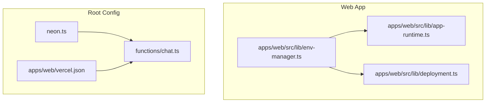
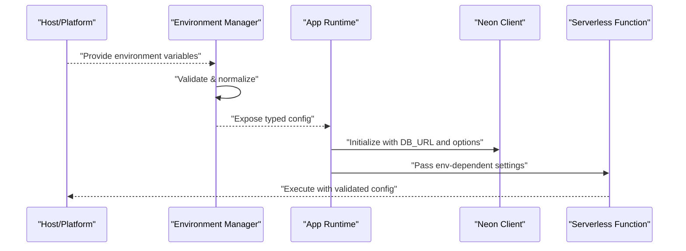
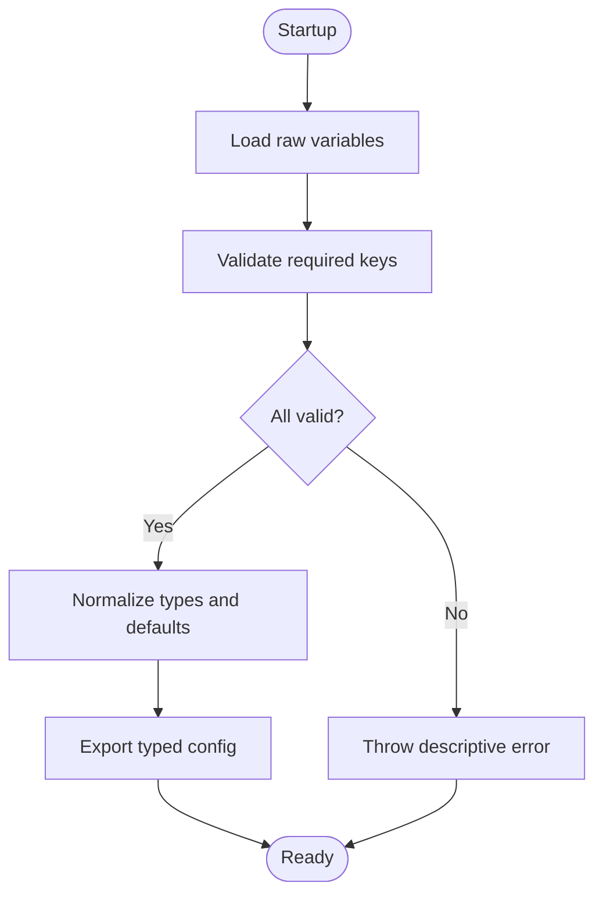
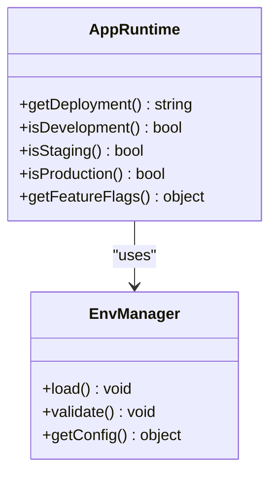
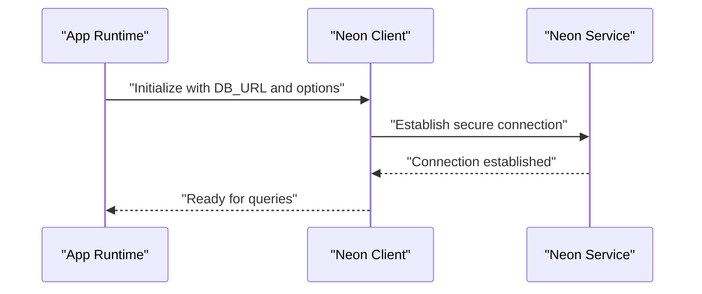
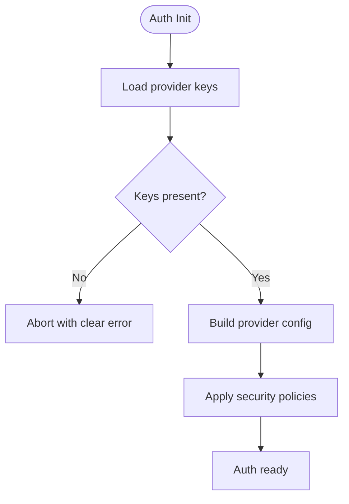
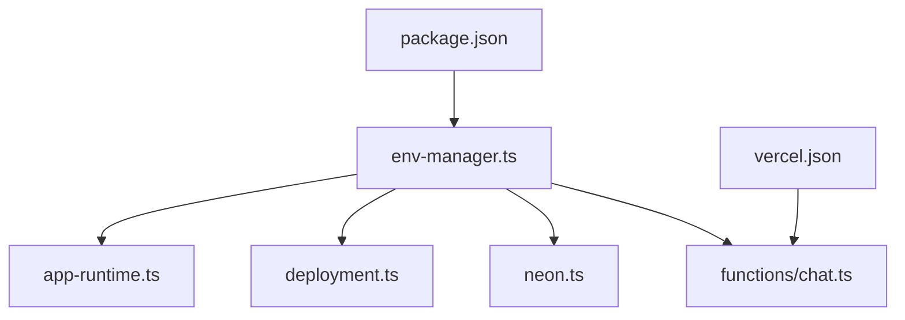

# Environment Configuration

<cite>
**Referenced Files in This Document**
- [env-manager.ts](file://apps/web/src/lib/env-manager.ts)
- [neon.ts](file://neon.ts)
- [app-runtime.ts](file://apps/web/src/lib/app-runtime.ts)
- [deployment.ts](file://apps/web/src/lib/deployment.ts)
- [auth-post-migrate.ts](file://apps/web/scripts/auth-post-migrate.ts)
- [chat.ts](file://functions/chat.ts)
- [vercel.json](file://apps/web/vercel.json)
- [package.json](file://package.json)
- [SECURITY.md](file://SECURITY.md)
- [configuration.md](file://docs/wiki/reference/configuration.md)
</cite>

## Table of Contents

1. [Introduction](#introduction)
2. [Project Structure](#project-structure)
3. [Core Components](#core-components)
4. [Architecture Overview](#architecture-overview)
5. [Detailed Component Analysis](#detailed-component-analysis)
6. [Dependency Analysis](#dependency-analysis)
7. [Performance Considerations](#performance-considerations)
8. [Troubleshooting Guide](#troubleshooting-guide)
9. [Conclusion](#conclusion)
10. [Appendices](#appendices)

## Introduction

This document explains how Fleet Pi loads and validates environment configuration at runtime, with a focus on the environment manager implementation, database connection setup using Neon, authentication provider configuration, and third-party service integrations. It also provides guidance for environment-specific configurations across development, staging, and production deployments.

## Project Structure

Environment-related code is primarily located under the web application’s library directory and root-level configuration files:

- Environment manager and runtime utilities live in apps/web/src/lib.
- Database client initialization is defined at the repository root.
- Serverless function entry points reference environment variables for runtime behavior.
- Deployment metadata and scripts assist with migration and verification tasks.

**Diagram sources**

- [env-manager.ts](file://apps/web/src/lib/env-manager.ts)
- [app-runtime.ts](file://apps/web/src/lib/app-runtime.ts)
- [deployment.ts](file://apps/web/src/lib/deployment.ts)
- [neon.ts](file://neon.ts)
- [chat.ts](file://functions/chat.ts)
- [vercel.json](file://apps/web/vercel.json)

**Section sources**

- [env-manager.ts](file://apps/web/src/lib/env-manager.ts)
- [app-runtime.ts](file://apps/web/src/lib/app-runtime.ts)
- [deployment.ts](file://apps/web/src/lib/deployment.ts)
- [neon.ts](file://neon.ts)
- [chat.ts](file://functions/chat.ts)
- [vercel.json](file://apps/web/vercel.json)

## Core Components

- Environment Manager: Centralizes loading, validation, and exposure of environment variables to the application.
- Runtime Utilities: Provide environment-aware behavior such as feature flags and deployment context.
- Database Client: Initializes connections to Neon based on environment variables.
- Function Entry Points: Consume environment variables for serverless execution contexts.

Key responsibilities:

- Validate required variables early to fail fast.
- Normalize values (e.g., booleans, URLs).
- Expose typed accessors to avoid inconsistent usage.
- Separate secrets from public config where appropriate.

**Section sources**

- [env-manager.ts](file://apps/web/src/lib/env-manager.ts)
- [app-runtime.ts](file://apps/web/src/lib/app-runtime.ts)
- [deployment.ts](file://apps/web/src/lib/deployment.ts)
- [neon.ts](file://neon.ts)
- [chat.ts](file://functions/chat.ts)

## Architecture Overview

The environment configuration architecture follows a layered approach:

- Environment variables are provided by the hosting platform or local tooling.
- The environment manager reads and validates these variables once at startup.
- Other modules import validated configuration through typed accessors.
- Database clients and third-party SDKs receive normalized values.

**Diagram sources**

- [env-manager.ts](file://apps/web/src/lib/env-manager.ts)
- [app-runtime.ts](file://apps/web/src/lib/app-runtime.ts)
- [neon.ts](file://neon.ts)
- [chat.ts](file://functions/chat.ts)

## Detailed Component Analysis

### Environment Manager Implementation

Responsibilities:

- Load raw environment variables from the process or platform.
- Validate presence and format of required keys.
- Normalize types (e.g., parse booleans, coerce numbers).
- Provide a stable API for other modules to consume configuration.

Validation strategy:

- Fail-fast checks for critical variables (database URL, auth secrets).
- Optional variables have defaults or safe fallbacks.
- Clear error messages indicate missing or malformed values.

Security considerations:

- Never log secret values.
- Avoid exposing sensitive keys in error messages.
- Prefer strict parsing to prevent injection via mis-typed values.

Typical flow:

- Startup initializes the environment manager.
- Validation runs before any feature initialization.
- Modules import validated configuration instead of reading raw variables.

**Diagram sources**

- [env-manager.ts](file://apps/web/src/lib/env-manager.ts)

**Section sources**

- [env-manager.ts](file://apps/web/src/lib/env-manager.ts)

### Runtime Configuration Loading

Runtime utilities use the environment manager to determine:

- Deployment target (development, staging, production).
- Feature flags and toggles.
- Public vs private configuration boundaries.

Behavioral aspects:

- Conditional initialization based on environment.
- Safe defaults for non-critical features.
- Consistent logging levels per environment.

**Diagram sources**

- [app-runtime.ts](file://apps/web/src/lib/app-runtime.ts)
- [env-manager.ts](file://apps/web/src/lib/env-manager.ts)

**Section sources**

- [app-runtime.ts](file://apps/web/src/lib/app-runtime.ts)
- [deployment.ts](file://apps/web/src/lib/deployment.ts)

### Database Connection Setup with Neon

Database configuration:

- Connection string is provided via an environment variable.
- Pooling and timeout parameters can be tuned per environment.
- SSL and connection options are set according to Neon requirements.

Initialization steps:

- Read database URL and related options.
- Create a client instance with validated settings.
- Verify connectivity during startup when possible.

Security considerations:

- Use least-privilege credentials.
- Enable TLS for all connections.
- Rotate credentials regularly and store them securely.

**Diagram sources**

- [neon.ts](file://neon.ts)

**Section sources**

- [neon.ts](file://neon.ts)

### Authentication Provider Configuration

Authentication relies on environment-driven settings:

- Provider-specific client IDs and secrets are loaded from environment variables.
- Redirect URIs and scopes are configured per deployment.
- Session management and token lifetimes are environment-aware.

Configuration aspects:

- Validate that required provider keys exist.
- Ensure redirect URIs match the current domain.
- Enforce HTTPS in non-development environments.

**Diagram sources**

- [env-manager.ts](file://apps/web/src/lib/env-manager.ts)
- [auth-post-migrate.ts](file://apps/web/scripts/auth-post-migrate.ts)

**Section sources**

- [env-manager.ts](file://apps/web/src/lib/env-manager.ts)
- [auth-post-migrate.ts](file://apps/web/scripts/auth-post-migrate.ts)

### Third-Party Service Integrations

Integrations are configured via environment variables:

- API endpoints and keys are injected at runtime.
- Rate limits and timeouts are tuned per environment.
- Feature toggles enable/disable integrations conditionally.

Best practices:

- Prefix integration keys clearly to avoid collisions.
- Validate endpoint formats and key patterns.
- Log only non-sensitive diagnostic information.

**Section sources**

- [env-manager.ts](file://apps/web/src/lib/env-manager.ts)
- [chat.ts](file://functions/chat.ts)

### Environment-Specific Configurations

Environments:

- Development: Local debugging, relaxed security, verbose logs.
- Staging: Near-production settings for validation.
- Production: Strict security, minimal logs, optimized performance.

Differences typically include:

- Database connection strings and pooling.
- Auth provider redirect URIs and scopes.
- Feature flags and experimental toggles.
- Logging verbosity and monitoring hooks.

Operational guidance:

- Use separate credential sets per environment.
- Pin versions for external services when necessary.
- Validate environment readiness before starting the app.

**Section sources**

- [deployment.ts](file://apps/web/src/lib/deployment.ts)
- [vercel.json](file://apps/web/vercel.json)

## Dependency Analysis

Environment configuration touches multiple layers:

- Web app modules depend on the environment manager for consistent config.
- Database client depends on validated connection parameters.
- Serverless functions depend on environment variables for execution context.
- Deployment metadata influences runtime behavior.

**Diagram sources**

- [env-manager.ts](file://apps/web/src/lib/env-manager.ts)
- [app-runtime.ts](file://apps/web/src/lib/app-runtime.ts)
- [deployment.ts](file://apps/web/src/lib/deployment.ts)
- [neon.ts](file://neon.ts)
- [chat.ts](file://functions/chat.ts)
- [vercel.json](file://apps/web/vercel.json)
- [package.json](file://package.json)

**Section sources**

- [env-manager.ts](file://apps/web/src/lib/env-manager.ts)
- [app-runtime.ts](file://apps/web/src/lib/app-runtime.ts)
- [deployment.ts](file://apps/web/src/lib/deployment.ts)
- [neon.ts](file://neon.ts)
- [chat.ts](file://functions/chat.ts)
- [vercel.json](file://apps/web/vercel.json)
- [package.json](file://package.json)

## Performance Considerations

- Initialize the environment manager once at startup to avoid repeated validation overhead.
- Cache derived configuration objects to minimize recomputation.
- Tune database pool sizes per environment to balance latency and resource usage.
- Avoid heavy operations during environment validation; defer to lazy initialization where possible.

[No sources needed since this section provides general guidance]

## Troubleshooting Guide

Common issues and resolutions:

- Missing required variables: Ensure all critical keys are set in the hosting platform’s environment settings.
- Invalid database URL: Verify the Neon connection string format and network accessibility.
- Authentication failures: Check provider client IDs, secrets, and redirect URIs match the current domain.
- Feature not enabled: Confirm environment-specific feature flags are set correctly.

Debugging tips:

- Enable verbose logging in development to trace configuration loading.
- Use health check endpoints to verify database connectivity.
- Review deployment logs for environment validation errors.

Security reminders:

- Never commit secrets or sample .env files containing real credentials.
- Rotate credentials periodically and audit access logs.

**Section sources**

- [SECURITY.md](file://SECURITY.md)
- [configuration.md](file://docs/wiki/reference/configuration.md)

## Conclusion

Fleet Pi’s environment configuration is centered around a robust environment manager that validates and normalizes variables before exposing them to the application. Database connections to Neon, authentication providers, and third-party services are configured securely and consistently across environments. Following the guidelines in this document ensures reliable deployments and maintains strong security postures.

[No sources needed since this section summarizes without analyzing specific files]

## Appendices

- Reference documentation for configuration conventions and best practices.
- Security policy overview for handling secrets and sensitive data.

**Section sources**

- [configuration.md](file://docs/wiki/reference/configuration.md)
- [SECURITY.md](file://SECURITY.md)
