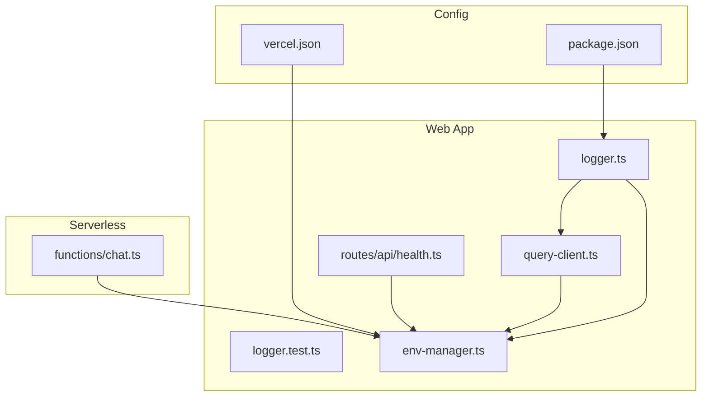
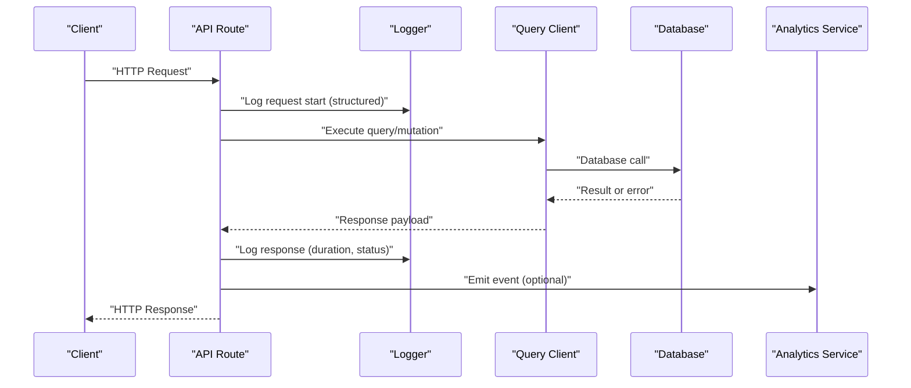
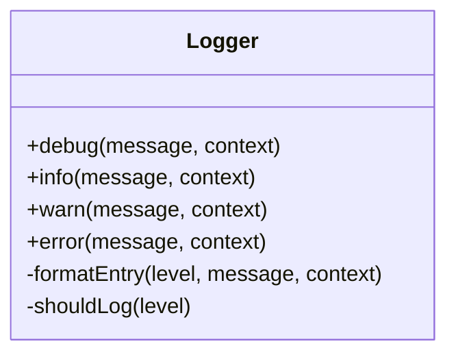
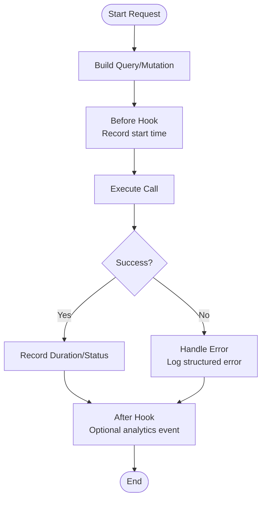
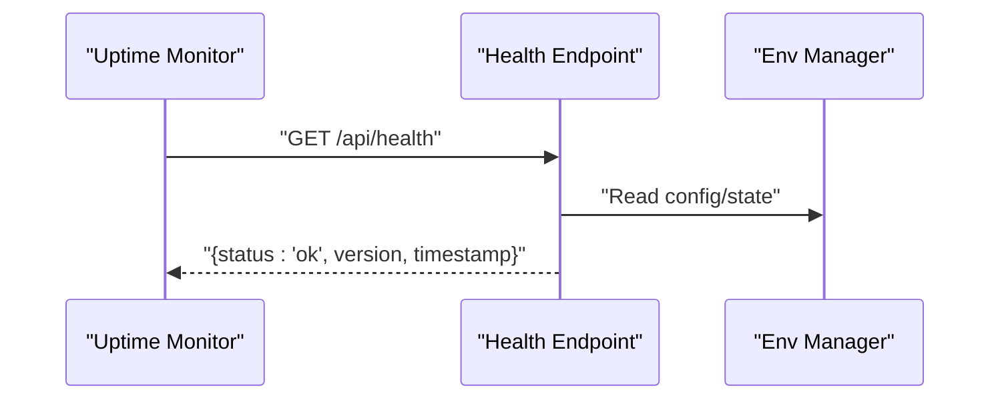
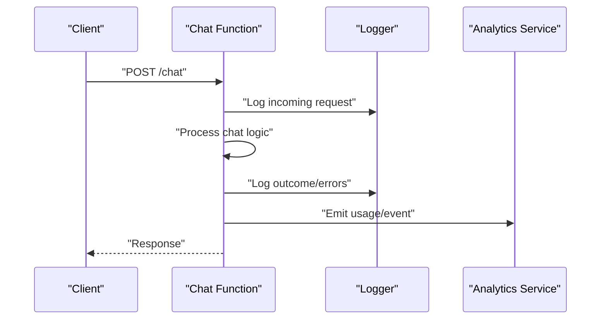
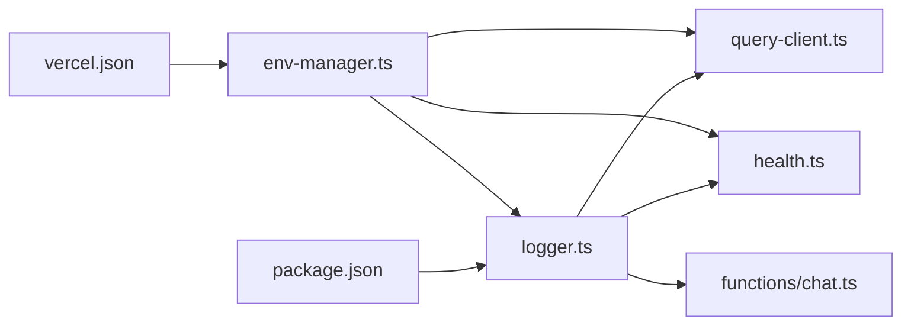

# Monitoring & Logging

<cite>
**Referenced Files in This Document**
- [logger.ts](file://apps/web/src/lib/logger.ts)
- [logger.test.ts](file://apps/web/src/lib/logger.test.ts)
- [query-client.ts](file://apps/web/src/lib/query-client.ts)
- [env-manager.ts](file://apps/web/src/lib/env-manager.ts)
- [health.ts](file://apps/web/src/routes/api/health.ts)
- [chat.ts](file://functions/chat.ts)
- [vercel.json](file://apps/web/vercel.json)
- [package.json](file://apps/web/package.json)
- [architecture.md](file://docs/wiki/overview/architecture.md)
- [configuration.md](file://docs/wiki/reference/configuration.md)
</cite>

## Table of Contents

1. [Introduction](#introduction)
2. [Project Structure](#project-structure)
3. [Core Components](#core-components)
4. [Architecture Overview](#architecture-overview)
5. [Detailed Component Analysis](#detailed-component-analysis)
6. [Dependency Analysis](#dependency-analysis)
7. [Performance Considerations](#performance-considerations)
8. [Troubleshooting Guide](#troubleshooting-guide)
9. [Conclusion](#conclusion)
10. [Appendices](#appendices)

## Introduction

This document provides comprehensive monitoring and logging guidance for Fleet Pi, focusing on the logging framework, structured logging patterns, analytics integration, error tracking, and performance monitoring. It also covers database query monitoring, API response time tracking, user interaction analytics, alerting strategies, log aggregation, and debugging techniques for production issues. The goal is to make observability actionable across development, staging, and production environments while keeping logs useful, privacy-safe, and cost-effective.

## Project Structure

Fleet Pi’s monitoring and logging capabilities are primarily implemented in the web application layer with supporting runtime configuration and serverless functions:

- Structured logging utilities and tests live under apps/web/src/lib.
- Query client configuration centralizes data fetching behavior and can be extended for metrics collection.
- Environment management controls feature flags and telemetry settings.
- Health endpoints expose service status for uptime checks.
- Serverless function entry points handle chat-related requests and can emit telemetry.
- Deployment configuration (Vercel) influences runtime behavior and environment variables.

**Diagram sources**

- [logger.ts](file://apps/web/src/lib/logger.ts)
- [logger.test.ts](file://apps/web/src/lib/logger.test.ts)
- [query-client.ts](file://apps/web/src/lib/query-client.ts)
- [env-manager.ts](file://apps/web/src/lib/env-manager.ts)
- [health.ts](file://apps/web/src/routes/api/health.ts)
- [chat.ts](file://functions/chat.ts)
- [vercel.json](file://apps/web/vercel.json)
- [package.json](file://apps/web/package.json)

**Section sources**

- [logger.ts](file://apps/web/src/lib/logger.ts)
- [query-client.ts](file://apps/web/src/lib/query-client.ts)
- [env-manager.ts](file://apps/web/src/lib/env-manager.ts)
- [health.ts](file://apps/web/src/routes/api/health.ts)
- [chat.ts](file://functions/chat.ts)
- [vercel.json](file://apps/web/vercel.json)
- [package.json](file://apps/web/package.json)

## Core Components

- Logger utility: Provides structured logging with consistent fields, levels, and formatting suitable for both local and production environments. Includes tests to validate behavior and output shape.
- Query client: Centralizes HTTP/data-fetching behavior; ideal place to instrument request/response timing and errors for database/API interactions.
- Environment manager: Reads and exposes environment variables that control logging verbosity, analytics toggles, and feature flags.
- Health endpoint: Exposes a simple health check used by orchestrators and uptime monitors.
- Chat function: Serverless entry point for chat operations; can integrate telemetry for request lifecycle and error reporting.

Key responsibilities:

- Emit structured logs with correlation IDs, timestamps, and contextual metadata.
- Provide configurable log levels and sinks (console, remote collectors).
- Track performance metrics around critical paths (API calls, DB queries).
- Integrate analytics events for user interactions and system events.
- Surface health and readiness signals for external monitoring.

**Section sources**

- [logger.ts](file://apps/web/src/lib/logger.ts)
- [logger.test.ts](file://apps/web/src/lib/logger.test.ts)
- [query-client.ts](file://apps/web/src/lib/query-client.ts)
- [env-manager.ts](file://apps/web/src/lib/env-manager.ts)
- [health.ts](file://apps/web/src/routes/api/health.ts)
- [chat.ts](file://functions/chat.ts)

## Architecture Overview

The monitoring architecture centers around a structured logger and an instrumentation layer around data access and API calls. Environment variables drive behavior per deployment, and health endpoints provide liveness probes. Analytics events are emitted from UI and serverless functions where appropriate.

**Diagram sources**

- [health.ts](file://apps/web/src/routes/api/health.ts)
- [query-client.ts](file://apps/web/src/lib/query-client.ts)
- [logger.ts](file://apps/web/src/lib/logger.ts)
- [chat.ts](file://functions/chat.ts)

## Detailed Component Analysis

### Logger Utility

The logger provides structured logging with consistent fields such as timestamp, level, message, and contextual metadata. It supports multiple log levels and can be configured via environment variables to adjust verbosity and output destinations. Tests ensure expected behavior and output structure.

Recommended usage patterns:

- Use structured objects for log payloads instead of string concatenation.
- Include correlation IDs for tracing requests across components.
- Avoid logging sensitive data; sanitize inputs before emitting logs.
- Choose appropriate log levels: debug for development, info/warn/error for production.

**Diagram sources**

- [logger.ts](file://apps/web/src/lib/logger.ts)
- [logger.test.ts](file://apps/web/src/lib/logger.test.ts)

**Section sources**

- [logger.ts](file://apps/web/src/lib/logger.ts)
- [logger.test.ts](file://apps/web/src/lib/logger.test.ts)

### Query Client Instrumentation

The query client is the best place to capture database and API performance metrics. Extend it to record:

- Request duration
- Status codes
- Error types and messages
- Cache hits/misses
- Retry attempts

Integrate with the logger to emit structured performance logs and optionally forward metrics to an analytics or APM service.

**Diagram sources**

- [query-client.ts](file://apps/web/src/lib/query-client.ts)
- [logger.ts](file://apps/web/src/lib/logger.ts)

**Section sources**

- [query-client.ts](file://apps/web/src/lib/query-client.ts)

### Environment Manager

Environment variables control logging verbosity, analytics toggles, and feature flags. Centralize these settings to ensure consistent behavior across deployments. Typical keys include:

- Log level
- Analytics enabled flag
- Telemetry endpoints
- Feature flags for experimental monitoring features

Use strict validation and defaults to avoid runtime surprises.

**Section sources**

- [env-manager.ts](file://apps/web/src/lib/env-manager.ts)
- [configuration.md](file://docs/wiki/reference/configuration.md)

### Health Endpoint

Expose a lightweight health check endpoint for uptime monitors and orchestration systems. Return clear status indicators and minimal metadata.

**Diagram sources**

- [health.ts](file://apps/web/src/routes/api/health.ts)
- [env-manager.ts](file://apps/web/src/lib/env-manager.ts)

**Section sources**

- [health.ts](file://apps/web/src/routes/api/health.ts)

### Chat Function (Serverless)

The chat function handles chat-related requests and should emit telemetry for request lifecycle, errors, and performance. Integrate structured logging and optional analytics events to track usage patterns and failures.

**Diagram sources**

- [chat.ts](file://functions/chat.ts)
- [logger.ts](file://apps/web/src/lib/logger.ts)

**Section sources**

- [chat.ts](file://functions/chat.ts)

## Dependency Analysis

Monitoring and logging depend on environment configuration and deployment settings. The logger is used throughout the app, the query client instruments data flows, and the health endpoint relies on environment state.

**Diagram sources**

- [env-manager.ts](file://apps/web/src/lib/env-manager.ts)
- [logger.ts](file://apps/web/src/lib/logger.ts)
- [query-client.ts](file://apps/web/src/lib/query-client.ts)
- [health.ts](file://apps/web/src/routes/api/health.ts)
- [chat.ts](file://functions/chat.ts)
- [vercel.json](file://apps/web/vercel.json)
- [package.json](file://apps/web/package.json)

**Section sources**

- [env-manager.ts](file://apps/web/src/lib/env-manager.ts)
- [logger.ts](file://apps/web/src/lib/logger.ts)
- [query-client.ts](file://apps/web/src/lib/query-client.ts)
- [health.ts](file://apps/web/src/routes/api/health.ts)
- [chat.ts](file://functions/chat.ts)
- [vercel.json](file://apps/web/vercel.json)
- [package.json](file://apps/web/package.json)

## Performance Considerations

- Keep log volume reasonable in production; use sampling for high-frequency events.
- Prefer structured logs over verbose text to reduce parsing overhead.
- Batch analytics events to minimize network overhead.
- Measure and report p95/p99 latencies for critical paths.
- Avoid synchronous I/O in hot paths; offload heavy work to background tasks when possible.
- Use cache hit metrics to identify optimization opportunities.

[No sources needed since this section provides general guidance]

## Troubleshooting Guide

Common issues and resolutions:

- Missing logs: Verify log level configuration and environment variables. Ensure the logger is initialized before use.
- High log volume: Adjust log levels and enable sampling for noisy components.
- Slow queries: Inspect query client metrics for duration spikes; add indexes or optimize queries.
- Errors not captured: Ensure error hooks are wired in the query client and chat function; verify error serialization avoids sensitive data.
- Health checks failing: Check environment state and dependencies; review health endpoint responses.

Debugging techniques:

- Correlation IDs: Propagate unique IDs across request boundaries to trace flows.
- Structured search: Use JSON fields to filter logs by component, endpoint, and status.
- Local reproduction: Mirror production environment variables locally to reproduce issues.
- Metrics dashboards: Track latency percentiles and error rates over time.

**Section sources**

- [logger.ts](file://apps/web/src/lib/logger.ts)
- [query-client.ts](file://apps/web/src/lib/query-client.ts)
- [env-manager.ts](file://apps/web/src/lib/env-manager.ts)
- [health.ts](file://apps/web/src/routes/api/health.ts)
- [chat.ts](file://functions/chat.ts)

## Conclusion

Fleet Pi’s monitoring and logging strategy emphasizes structured logs, centralized configuration, and instrumentation at key integration points. By extending the query client, leveraging the logger consistently, and exposing health endpoints, teams can achieve robust observability. Integrating analytics and performance metrics enables proactive issue detection and continuous improvement.

[No sources needed since this section summarizes without analyzing specific files]

## Appendices

### Database Query Monitoring

- Capture start/end times around database calls.
- Record query type, affected tables, and result counts.
- Flag slow queries exceeding thresholds.
- Aggregate metrics for trend analysis.

### API Response Time Tracking

- Measure end-to-end latency for each endpoint.
- Break down durations into phases (parsing, processing, IO).
- Report success/failure rates per endpoint.
- Alert on latency regressions.

### User Interaction Analytics

- Emit anonymized events for key user actions.
- Track funnel conversions and drop-offs.
- Segment by user role and feature usage.
- Respect privacy and consent policies.

### Alerting Strategies

- Define SLOs for latency, error rate, and availability.
- Configure alerts for threshold breaches.
- Use runbooks to guide incident response.
- Escalate based on severity and impact.

### Log Aggregation

- Ship structured logs to a centralized collector.
- Index key fields for fast querying.
- Retain logs according to compliance requirements.
- Redact sensitive information before shipping.

### Debugging Techniques for Production

- Enable temporary increased log verbosity for targeted issues.
- Use distributed tracing for multi-service flows.
- Reproduce with sanitized production data.
- Validate fixes with synthetic monitoring.

[No sources needed since this section provides general guidance]
