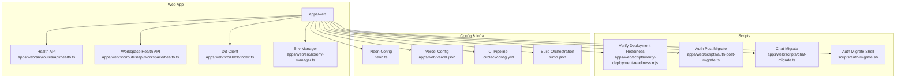
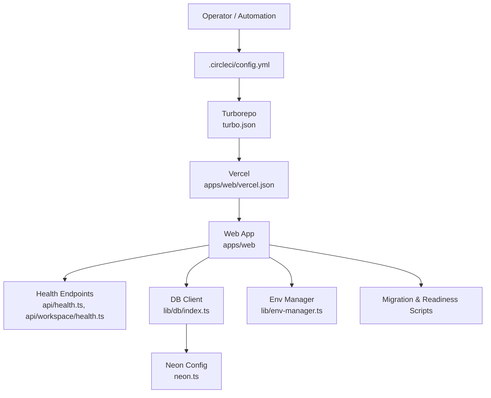
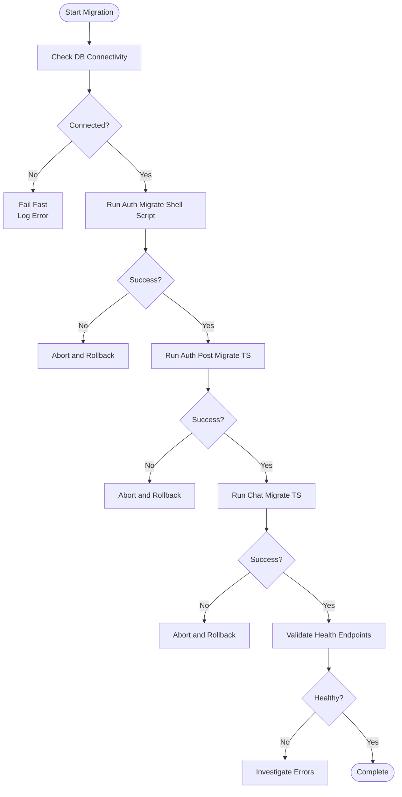
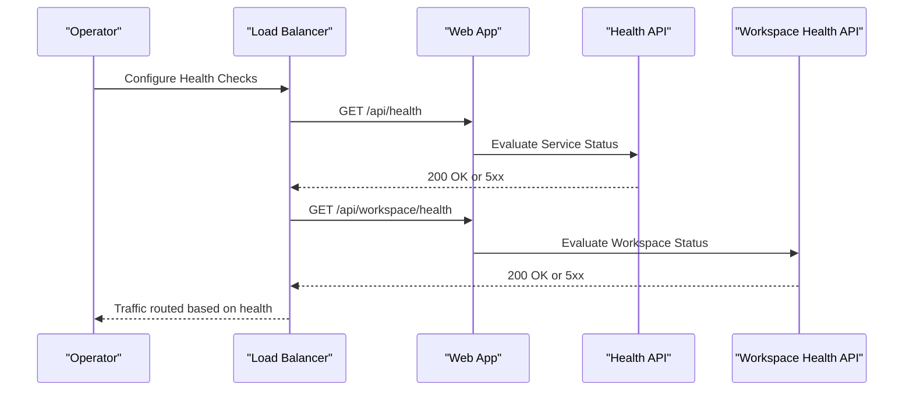
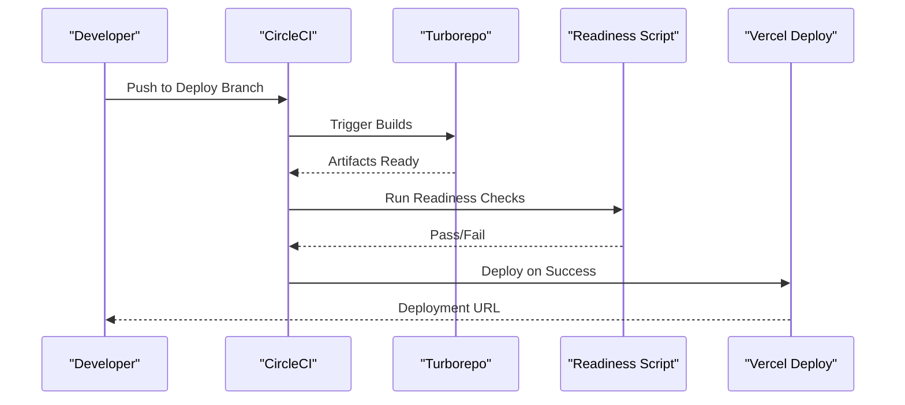
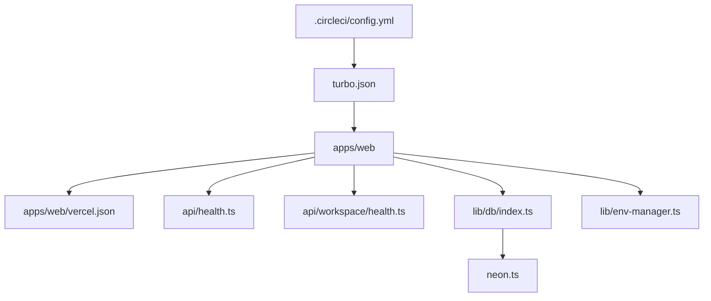

# Operational Runbooks

<cite>
**Referenced Files in This Document**
- [README.md](file://README.md)
- [docs/runbooks.md](file://docs/runbooks.md)
- [docs/runbooks/deployment-release-gate.md](file://docs/runbooks/deployment-release-gate.md)
- [apps/web/scripts/verify-deployment-readiness.mjs](file://apps/web/scripts/verify-deployment-readiness.mjs)
- [apps/web/scripts/auth-post-migrate.ts](file://apps/web/scripts/auth-post-migrate.ts)
- [apps/web/scripts/chat-migrate.ts](file://apps/web/scripts/chat-migrate.ts)
- [scripts/auth-migrate.sh](file://scripts/auth-migrate.sh)
- [neon.ts](file://neon.ts)
- [apps/web/src/routes/api/health.ts](file://apps/web/src/routes/api/health.ts)
- [apps/web/src/routes/api/workspace/health.ts](file://apps/web/src/routes/api/workspace/health.ts)
- [apps/web/src/lib/db/index.ts](file://apps/web/src/lib/db/index.ts)
- [apps/web/src/lib/env-manager.ts](file://apps/web/src/lib/env-manager.ts)
- [apps/web/package.json](file://apps/web/package.json)
- [package.json](file://package.json)
- [.circleci/config.yml](file:.circleci/config.yml)
- [turbo.json](file:turbo.json)
- [vercel.json](file:apps/web/vercel.json)
</cite>

## Table of Contents

1. [Introduction](#introduction)
2. [Project Structure](#project-structure)
3. [Core Components](#core-components)
4. [Architecture Overview](#architecture-overview)
5. [Detailed Component Analysis](#detailed-component-analysis)
6. [Dependency Analysis](#dependency-analysis)
7. [Performance Considerations](#performance-considerations)
8. [Troubleshooting Guide](#troubleshooting-guide)
9. [Conclusion](#conclusion)
10. [Appendices](#appendices)

## Introduction

This document provides operational runbooks for Fleet Pi maintenance and troubleshooting. It consolidates procedures for database migrations, backup and recovery, system health checks, incident response, performance tuning, capacity planning, deployment release gates, rollback procedures, and emergency response protocols. The goal is to enable operators to maintain high availability, reliability, and performance across environments with clear, repeatable steps.

## Project Structure

Fleet Pi is a monorepo with a web application under apps/web, shared scripts and tooling at the root, CI configuration, and documentation including runbooks. Key operational artifacts include:

- Health endpoints for service and workspace readiness
- Migration scripts for authentication and chat data
- Deployment readiness verification script
- Environment management utilities
- Database client configuration
- CI pipeline and build orchestration

**Diagram sources**

- [apps/web/src/routes/api/health.ts](file://apps/web/src/routes/api/health.ts)
- [apps/web/src/routes/api/workspace/health.ts](file://apps/web/src/routes/api/workspace/health.ts)
- [apps/web/src/lib/db/index.ts](file://apps/web/src/lib/db/index.ts)
- [apps/web/src/lib/env-manager.ts](file://apps/web/src/lib/env-manager.ts)
- [apps/web/scripts/verify-deployment-readiness.mjs](file://apps/web/scripts/verify-deployment-readiness.mjs)
- [apps/web/scripts/auth-post-migrate.ts](file://apps/web/scripts/auth-post-migrate.ts)
- [apps/web/scripts/chat-migrate.ts](file://apps/web/scripts/chat-migrate.ts)
- [scripts/auth-migrate.sh](file://scripts/auth-migrate.sh)
- [neon.ts](file://neon.ts)
- [apps/web/vercel.json](file://apps/web/vercel.json)
- [.circleci/config.yml](file:.circleci/config.yml)
- [turbo.json](file:turbo.json)

**Section sources**

- [README.md](file://README.md)
- [docs/runbooks.md](file://docs/runbooks.md)

## Core Components

- Health Endpoints: Provide liveness/readiness signals for the application and workspace subsystems.
- Database Client: Centralized configuration for Neon-backed PostgreSQL connectivity.
- Environment Manager: Loads and validates runtime environment variables.
- Migration Scripts: Apply schema changes and post-migration tasks for auth and chat features.
- Deployment Readiness Script: Validates prerequisites before deploying to Vercel.
- CI and Build Orchestration: CircleCI pipeline and Turborepo orchestrate builds and tests.

Operational implications:

- Use health endpoints to verify service status during deployments and incidents.
- Ensure database credentials and connection parameters are correct via env manager and neon config.
- Execute migration scripts in the correct order and validate outcomes using health checks.
- Gate deployments with the readiness script to prevent partial rollouts.

**Section sources**

- [apps/web/src/routes/api/health.ts](file://apps/web/src/routes/api/health.ts)
- [apps/web/src/routes/api/workspace/health.ts](file://apps/web/src/routes/api/workspace/health.ts)
- [apps/web/src/lib/db/index.ts](file://apps/web/src/lib/db/index.ts)
- [apps/web/src/lib/env-manager.ts](file://apps/web/src/lib/env-manager.ts)
- [apps/web/scripts/verify-deployment-readiness.mjs](file://apps/web/scripts/verify-deployment-readiness.mjs)
- [apps/web/scripts/auth-post-migrate.ts](file://apps/web/scripts/auth-post-migrate.ts)
- [apps/web/scripts/chat-migrate.ts](file://apps/web/scripts/chat-migrate.ts)
- [scripts/auth-migrate.sh](file://scripts/auth-migrate.sh)
- [neon.ts](file://neon.ts)
- [.circleci/config.yml](file:.circleci/config.yml)
- [turbo.json](file:turbo.json)

## Architecture Overview

The operational architecture centers on the web app exposing health APIs, interacting with a Neon-managed PostgreSQL database, and being deployed via Vercel with CI gating through CircleCI. Turborepo coordinates builds across packages.

**Diagram sources**

- [.circleci/config.yml](file:.circleci/config.yml)
- [turbo.json](file:turbo.json)
- [apps/web/vercel.json](file://apps/web/vercel.json)
- [apps/web/src/routes/api/health.ts](file://apps/web/src/routes/api/health.ts)
- [apps/web/src/routes/api/workspace/health.ts](file://apps/web/src/routes/api/workspace/health.ts)
- [apps/web/src/lib/db/index.ts](file://apps/web/src/lib/db/index.ts)
- [neon.ts](file://neon.ts)
- [apps/web/src/lib/env-manager.ts](file://apps/web/src/lib/env-manager.ts)

## Detailed Component Analysis

### Database Migrations

Purpose:

- Apply schema changes for authentication and chat features safely and consistently.
- Ensure post-migration tasks execute successfully before enabling traffic.

Procedures:

- Pre-flight:
  - Verify database connectivity using the DB client and environment variables.
  - Confirm current schema version by inspecting relevant tables or metadata.
- Execution:
  - Run the shell-based auth migration script to apply baseline changes.
  - Execute TypeScript migration scripts for auth post-processing and chat schema updates.
- Validation:
  - Re-run health endpoints to confirm service stability after migrations.
  - Perform smoke tests against affected endpoints (auth, chat).

Rollback:

- If failures occur, revert schema changes using provided reverse migrations or restore from a pre-migration snapshot.
- Re-deploy the previous stable version if necessary.

**Diagram sources**

- [scripts/auth-migrate.sh](file://scripts/auth-migrate.sh)
- [apps/web/scripts/auth-post-migrate.ts](file://apps/web/scripts/auth-post-migrate.ts)
- [apps/web/scripts/chat-migrate.ts](file://apps/web/scripts/chat-migrate.ts)
- [apps/web/src/lib/db/index.ts](file://apps/web/src/lib/db/index.ts)
- [apps/web/src/routes/api/health.ts](file://apps/web/src/routes/api/health.ts)

**Section sources**

- [scripts/auth-migrate.sh](file://scripts/auth-migrate.sh)
- [apps/web/scripts/auth-post-migrate.ts](file://apps/web/scripts/auth-post-migrate.ts)
- [apps/web/scripts/chat-migrate.ts](file://apps/web/scripts/chat-migrate.ts)
- [apps/web/src/lib/db/index.ts](file://apps/web/src/lib/db/index.ts)

### Backup and Recovery

Purpose:

- Protect data integrity and ensure rapid recovery from failures.

Procedures:

- Backups:
  - Schedule regular snapshots of the Neon database instance.
  - Export critical application state and configuration files.
- Restore:
  - Identify the target restore point based on failure timeline.
  - Apply schema migrations post-restore to align with application version.
  - Validate health endpoints and perform smoke tests.

Best Practices:

- Maintain multiple retention points across environments.
- Test restore procedures periodically to ensure reliability.

[No sources needed since this section provides general guidance]

### System Health Checks

Purpose:

- Provide reliable signals for liveness and readiness.

Endpoints:

- Application health endpoint for overall service status.
- Workspace health endpoint for workspace subsystem readiness.

Operational Use:

- Integrate health checks into monitoring systems and load balancers.
- Use readiness signals to gate traffic during deployments and maintenance.

**Diagram sources**

- [apps/web/src/routes/api/health.ts](file://apps/web/src/routes/api/health.ts)
- [apps/web/src/routes/api/workspace/health.ts](file://apps/web/src/routes/api/workspace/health.ts)

**Section sources**

- [apps/web/src/routes/api/health.ts](file://apps/web/src/routes/api/health.ts)
- [apps/web/src/routes/api/workspace/health.ts](file://apps/web/src/routes/api/workspace/health.ts)

### Deployment Release Gates

Purpose:

- Prevent deployments that do not meet quality and compatibility criteria.

Gates:

- Pre-deployment validation using the deployment readiness script.
- CI pipeline checks enforced by CircleCI.
- Build orchestration via Turborepo ensures consistent outputs.

Procedure:

- Run the readiness script locally or in CI to validate environment, dependencies, and configuration.
- Ensure all CI checks pass before merging to deploy branches.
- Deploy to staging first and validate health endpoints before production rollout.

**Diagram sources**

- [.circleci/config.yml](file:.circleci/config.yml)
- [turbo.json](file:turbo.json)
- [apps/web/scripts/verify-deployment-readiness.mjs](file://apps/web/scripts/verify-deployment-readiness.mjs)
- [apps/web/vercel.json](file://apps/web/vercel.json)

**Section sources**

- [apps/web/scripts/verify-deployment-readiness.mjs](file://apps/web/scripts/verify-deployment-readiness.mjs)
- [.circleci/config.yml](file:.circleci/config.yml)
- [turbo.json](file:turbo.json)
- [apps/web/vercel.json](file://apps/web/vercel.json)

### Rollback Procedures

Purpose:

- Quickly revert to a known-good state when issues arise post-deployment.

Steps:

- Identify the failing deployment and assess impact.
- Revert code to the last stable commit.
- Re-run CI checks and redeploy the stable version.
- Validate health endpoints and monitor error rates.

Considerations:

- Keep migration scripts idempotent and reversible where possible.
- Maintain database snapshots around risky changes.

[No sources needed since this section provides general guidance]

### Emergency Response Protocols

Purpose:

- Standardize incident handling to minimize downtime and data loss.

Protocol:

- Detect anomalies via health checks and monitoring alerts.
- Triage severity and assign responders.
- Implement mitigations (e.g., feature flags, rate limiting, circuit breakers).
- Communicate status updates to stakeholders.
- Conduct post-incident review and update runbooks.

[No sources needed since this section provides general guidance]

### Performance Tuning Guidelines

Recommendations:

- Optimize database queries and indexes based on observed workloads.
- Tune connection pooling settings in the DB client configuration.
- Enable caching layers for frequently accessed data.
- Monitor CPU, memory, and I/O metrics; scale horizontally or vertically as needed.
- Profile slow endpoints and refactor hot paths.

[No sources needed since this section provides general guidance]

### Capacity Planning Recommendations

Guidelines:

- Track usage trends for users, sessions, and storage growth.
- Plan scaling thresholds based on resource utilization and latency SLAs.
- Provision headroom for peak loads and seasonal spikes.
- Review database capacity and storage quotas regularly.

[No sources needed since this section provides general guidance]

## Dependency Analysis

Operational dependencies include CI, build orchestration, deployment platform, and runtime configuration. Understanding these relationships helps isolate failures and streamline recovery.

**Diagram sources**

- [.circleci/config.yml](file:.circleci/config.yml)
- [turbo.json](file:turbo.json)
- [apps/web/vercel.json](file://apps/web/vercel.json)
- [apps/web/src/routes/api/health.ts](file://apps/web/src/routes/api/health.ts)
- [apps/web/src/routes/api/workspace/health.ts](file://apps/web/src/routes/api/workspace/health.ts)
- [apps/web/src/lib/db/index.ts](file://apps/web/src/lib/db/index.ts)
- [neon.ts](file://neon.ts)
- [apps/web/src/lib/env-manager.ts](file://apps/web/src/lib/env-manager.ts)

**Section sources**

- [.circleci/config.yml](file:.circleci/config.yml)
- [turbo.json](file:turbo.json)
- [apps/web/vercel.json](file://apps/web/vercel.json)

## Performance Considerations

- Use health endpoints to detect degraded performance early.
- Monitor database query latency and adjust indexing strategies.
- Leverage environment variables to tune runtime behavior without code changes.
- Employ CI checks to catch performance regressions in pull requests.

[No sources needed since this section provides general guidance]

## Troubleshooting Guide

Common Issues:

- Database connectivity failures:
  - Verify environment variables and Neon configuration.
  - Check network access and firewall rules.
- Migration failures:
  - Inspect migration logs and schema state.
  - Re-run failed steps with verbose logging.
- Health endpoint errors:
  - Review application logs and dependency status.
  - Validate workspace subsystem health.

Resolution Steps:

- Use the readiness script to identify missing prerequisites.
- Validate environment configuration via the env manager.
- Re-run health checks after applying fixes.

**Section sources**

- [apps/web/scripts/verify-deployment-readiness.mjs](file://apps/web/scripts/verify-deployment-readiness.mjs)
- [apps/web/src/lib/env-manager.ts](file://apps/web/src/lib/env-manager.ts)
- [apps/web/src/routes/api/health.ts](file://apps/web/src/routes/api/health.ts)
- [apps/web/src/routes/api/workspace/health.ts](file://apps/web/src/routes/api/workspace/health.ts)

## Conclusion

These runbooks consolidate essential operational procedures for Fleet Pi, ensuring reliable maintenance, rapid incident response, and scalable operations. By following standardized processes for migrations, backups, health checks, and deployments, teams can maintain system stability and performance while minimizing risk.

[No sources needed since this section summarizes without analyzing specific files]

## Appendices

- Configuration Reference:
  - Environment variables managed by the env manager.
  - Database connection parameters configured via neon client.
- Monitoring Integration:
  - Health endpoint URLs for external monitoring tools.
  - Alerting thresholds based on error rates and latency.

[No sources needed since this section provides general guidance]
