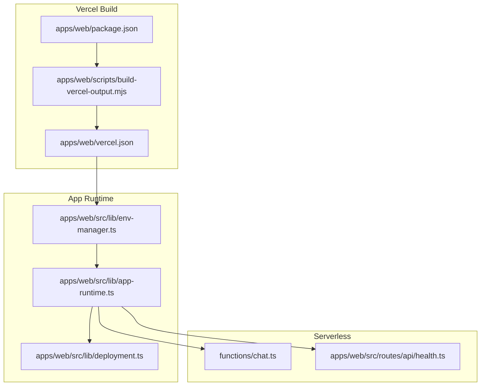
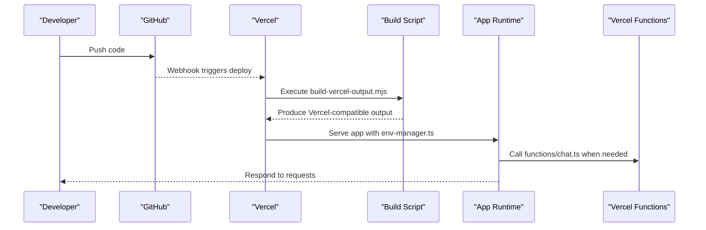
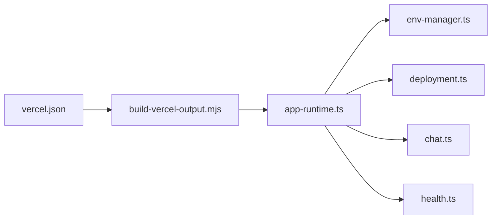

# Vercel Deployment

<cite>
**Referenced Files in This Document**
- [vercel.json](file://apps/web/vercel.json)
- [build-vercel-output.mjs](file://apps/web/scripts/build-vercel-output.mjs)
- [package.json](file://apps/web/package.json)
- [chat.ts](file://functions/chat.ts)
- [env-manager.ts](file://apps/web/src/lib/env-manager.ts)
- [deployment.ts](file://apps/web/src/lib/deployment.ts)
- [app-runtime.ts](file://apps/web/src/lib/app-runtime.ts)
- [health.ts](file://apps/web/src/routes/api/health.ts)
- [chat-api.md](file://docs/wiki/apps/web/chat-api.md)
- [deployment.md](file://docs/deployment.md)
- [architecture.md](file://docs/architecture.md)
- [.vercelignore](file://.vercelignore)
- [vite.config.ts](file://apps/web/vite.config.ts)
</cite>

## Table of Contents

1. [Introduction](#introduction)
2. [Project Structure](#project-structure)
3. [Core Components](#core-components)
4. [Architecture Overview](#architecture-overview)
5. [Detailed Component Analysis](#detailed-component-analysis)
6. [Dependency Analysis](#dependency-analysis)
7. [Performance Considerations](#performance-considerations)
8. [Troubleshooting Guide](#troubleshooting-guide)
9. [Conclusion](#conclusion)
10. [Appendices](#appendices)

## Introduction

This document provides a comprehensive guide to deploying Fleet Pi on Vercel. It covers the Vercel configuration structure, environment variables, build customization, routing, edge functions, static asset optimization, GitHub integration, production setup, preview deployments, custom domains, SSL management, and performance tuning specific to Vercel’s platform. The guidance is grounded in the repository’s actual configuration and scripts.

## Project Structure

Fleet Pi uses a Next.js-style app under apps/web with a top-level functions directory for serverless endpoints. Vercel-specific configuration lives in apps/web/vercel.json, while build and output preparation are handled by a dedicated script. Environment resolution is centralized through runtime helpers.

**Diagram sources**

- [package.json](file://apps/web/package.json)
- [build-vercel-output.mjs](file://apps/web/scripts/build-vercel-output.mjs)
- [vercel.json](file://apps/web/vercel.json)
- [env-manager.ts](file://apps/web/src/lib/env-manager.ts)
- [deployment.ts](file://apps/web/src/lib/deployment.ts)
- [app-runtime.ts](file://apps/web/src/lib/app-runtime.ts)
- [chat.ts](file://functions/chat.ts)
- [health.ts](file://apps/web/src/routes/api/health.ts)

**Section sources**

- [vercel.json](file://apps/web/vercel.json)
- [build-vercel-output.mjs](file://apps/web/scripts/build-vercel-output.mjs)
- [package.json](file://apps/web/package.json)
- [env-manager.ts](file://apps/web/src/lib/env-manager.ts)
- [deployment.ts](file://apps/web/src/lib/deployment.ts)
- [app-runtime.ts](file://apps/web/src/lib/app-runtime.ts)
- [chat.ts](file://functions/chat.ts)
- [health.ts](file://apps/web/src/routes/api/health.ts)

## Core Components

- Vercel configuration: apps/web/vercel.json defines build settings, rewrites, redirects, headers, caching, and function mappings.
- Build script: apps/web/scripts/build-vercel-output.mjs prepares the output for Vercel, ensuring compatibility with Vercel’s expectations.
- Environment manager: apps/web/src/lib/env-manager.ts centralizes environment variable access at runtime.
- Deployment utilities: apps/web/src/lib/deployment.ts and apps/web/src/lib/app-runtime.ts provide runtime detection and deployment context.
- Serverless functions: functions/chat.ts exposes chat-related endpoints as Vercel Functions.
- API routes: apps/web/src/routes/api/* expose additional endpoints that can be served via Vercel’s Edge or Node runtimes.

Key responsibilities:

- vercel.json orchestrates how Vercel builds and serves the application.
- build-vercel-output.mjs ensures the built artifacts match Vercel’s requirements.
- env-manager.ts abstracts environment variable access across client and server contexts.
- app-runtime.ts and deployment.ts help detect runtime (e.g., Vercel vs local) and adjust behavior accordingly.
- functions/chat.ts implements serverless logic for chat operations.

**Section sources**

- [vercel.json](file://apps/web/vercel.json)
- [build-vercel-output.mjs](file://apps/web/scripts/build-vercel-output.mjs)
- [env-manager.ts](file://apps/web/src/lib/env-manager.ts)
- [deployment.ts](file://apps/web/src/lib/deployment.ts)
- [app-runtime.ts](file://apps/web/src/lib/app-runtime.ts)
- [chat.ts](file://functions/chat.ts)

## Architecture Overview

The deployment architecture integrates Vercel’s build pipeline, serverless functions, and runtime environment management.

**Diagram sources**

- [build-vercel-output.mjs](file://apps/web/scripts/build-vercel-output.mjs)
- [env-manager.ts](file://apps/web/src/lib/env-manager.ts)
- [app-runtime.ts](file://apps/web/src/lib/app-runtime.ts)
- [chat.ts](file://functions/chat.ts)

## Detailed Component Analysis

### Vercel Configuration (apps/web/vercel.json)

- Purpose: Defines how Vercel builds and serves the app, including build commands, output directories, rewrites, redirects, headers, and function mappings.
- Key aspects:
  - Build command and output path tailored for Vercel.
  - Rewrites and redirects to route traffic to appropriate handlers.
  - Headers and caching policies for performance.
  - Function definitions mapping URLs to serverless endpoints.

Best practices:

- Keep build outputs minimal and deterministic.
- Use rewrites for SPA fallbacks and API routing.
- Set cache-control headers for static assets.

**Section sources**

- [vercel.json](file://apps/web/vercel.json)

### Build Process Customization (apps/web/scripts/build-vercel-output.mjs)

- Purpose: Prepares the build output to be compatible with Vercel’s runtime expectations.
- Responsibilities:
  - Ensures correct file structure for Vercel.
  - Copies necessary assets and configurations.
  - Adjusts paths and references for serverless execution.

Operational notes:

- Run this script during CI/CD before deploying to Vercel.
- Validate output directory contents post-build.

**Section sources**

- [build-vercel-output.mjs](file://apps/web/scripts/build-vercel-output.mjs)

### Environment Variables Setup

- Centralized access via apps/web/src/lib/env-manager.ts.
- Runtime detection via apps/web/src/lib/app-runtime.ts and apps/web/src/lib/deployment.ts.
- Recommended variables:
  - API keys and secrets for external services.
  - Feature flags and toggles.
  - Database connection strings and credentials.
  - Logging and analytics configuration.

Security considerations:

- Never commit secrets to version control.
- Use Vercel’s environment variables per project and environment.
- Rotate secrets regularly and audit usage.

**Section sources**

- [env-manager.ts](file://apps/web/src/lib/env-manager.ts)
- [app-runtime.ts](file://apps/web/src/lib/app-runtime.ts)
- [deployment.ts](file://apps/web/src/lib/deployment.ts)

### Routing Configuration

- API routes under apps/web/src/routes/api/* are exposed as endpoints.
- Rewrites and redirects defined in vercel.json direct traffic appropriately.
- Health check endpoint available at apps/web/src/routes/api/health.ts.

Routing best practices:

- Group related endpoints logically.
- Use middleware for authentication and validation.
- Implement rate limiting where applicable.

**Section sources**

- [health.ts](file://apps/web/src/routes/api/health.ts)
- [vercel.json](file://apps/web/vercel.json)

### Edge Functions Setup

- Serverless functions under functions/chat.ts handle chat-related operations.
- Edge functions can be configured in vercel.json for low-latency responses.
- Ensure functions are stateless and idempotent.

Edge function guidelines:

- Minimize dependencies for faster cold starts.
- Use streaming for long-running operations.
- Handle errors gracefully and return meaningful status codes.

**Section sources**

- [chat.ts](file://functions/chat.ts)
- [vercel.json](file://apps/web/vercel.json)

### Static Asset Optimization

- Configure caching headers in vercel.json for improved performance.
- Optimize images and other assets using Vercel’s image optimization.
- Use CDN caching effectively with proper cache-control headers.

Optimization strategies:

- Enable compression for text-based assets.
- Leverage browser caching for immutable assets.
- Monitor bundle sizes and tree-shake unused code.

**Section sources**

- [vercel.json](file://apps/web/vercel.json)
- [vite.config.ts](file://apps/web/vite.config.ts)

## Dependency Analysis

Understanding dependencies between components helps identify potential bottlenecks and circular dependencies.

**Diagram sources**

- [vercel.json](file://apps/web/vercel.json)
- [build-vercel-output.mjs](file://apps/web/scripts/build-vercel-output.mjs)
- [app-runtime.ts](file://apps/web/src/lib/app-runtime.ts)
- [env-manager.ts](file://apps/web/src/lib/env-manager.ts)
- [deployment.ts](file://apps/web/src/lib/deployment.ts)
- [chat.ts](file://functions/chat.ts)
- [health.ts](file://apps/web/src/routes/api/health.ts)

**Section sources**

- [vercel.json](file://apps/web/vercel.json)
- [build-vercel-output.mjs](file://apps/web/scripts/build-vercel-output.mjs)
- [app-runtime.ts](file://apps/web/src/lib/app-runtime.ts)
- [env-manager.ts](file://apps/web/src/lib/env-manager.ts)
- [deployment.ts](file://apps/web/src/lib/deployment.ts)
- [chat.ts](file://functions/chat.ts)
- [health.ts](file://apps/web/src/routes/api/health.ts)

## Performance Considerations

- Enable Vercel’s automatic image optimization and CDN caching.
- Use edge functions for latency-sensitive operations.
- Implement proper error handling and logging for observability.
- Monitor performance metrics and optimize bottlenecks.

Recommendations:

- Profile API response times and optimize database queries.
- Use connection pooling for database connections.
- Implement request caching where appropriate.

[No sources needed since this section provides general guidance]

## Troubleshooting Guide

Common issues and solutions:

- Build failures: Verify build script execution and dependency installation.
- Environment variable errors: Check variable names and values in Vercel dashboard.
- Function timeouts: Optimize function logic and reduce payload sizes.
- CORS issues: Configure allowed origins and methods properly.

Debugging steps:

- Review Vercel build logs for errors.
- Test locally with Vercel CLI for consistency.
- Use structured logging for better traceability.

**Section sources**

- [build-vercel-output.mjs](file://apps/web/scripts/build-vercel-output.mjs)
- [env-manager.ts](file://apps/web/src/lib/env-manager.ts)
- [chat.ts](file://functions/chat.ts)

## Conclusion

Deploying Fleet Pi on Vercel involves careful configuration of build processes, environment variables, routing, and serverless functions. By following the guidelines in this document, you can achieve reliable deployments with optimal performance and security. Regular monitoring and optimization will ensure your application remains responsive and scalable.

[No sources needed since this section summarizes without analyzing specific files]

## Appendices

### Step-by-Step Deployment Instructions

1. Connect GitHub Repository:
   - Link your GitHub repository to Vercel.
   - Configure branch filters and build settings.

2. Set Up Production Environment:
   - Add required environment variables in Vercel dashboard.
   - Configure domain and SSL settings.

3. Manage Deployment Previews:
   - Enable preview deployments for pull requests.
   - Customize preview environments as needed.

4. Custom Domain Configuration:
   - Add custom domains in Vercel dashboard.
   - Configure DNS records for domain verification.

5. SSL Certificate Management:
   - Vercel automatically provisions SSL certificates.
   - Monitor certificate expiration and renewal.

6. Performance Optimizations:
   - Enable Vercel’s built-in optimizations.
   - Monitor and analyze performance metrics.

**Section sources**

- [deployment.md](file://docs/deployment.md)
- [chat-api.md](file://docs/wiki/apps/web/chat-api.md)
- [architecture.md](file://docs/architecture.md)
- [.vercelignore](file://.vercelignore)
