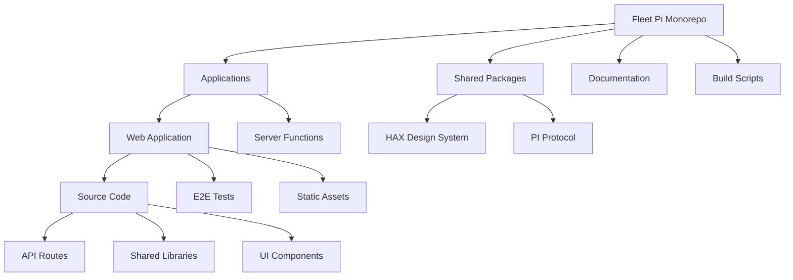
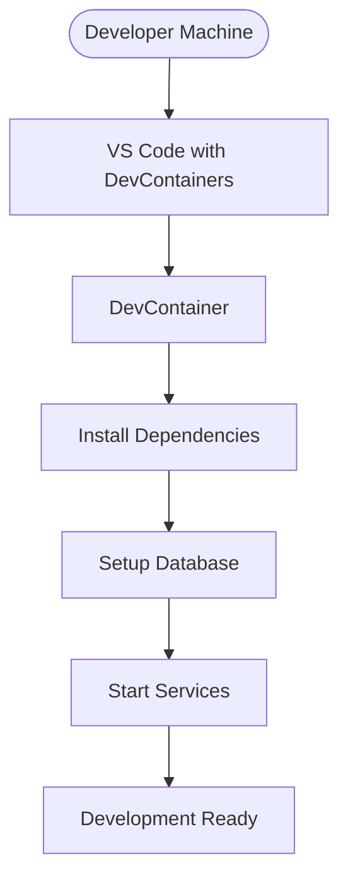
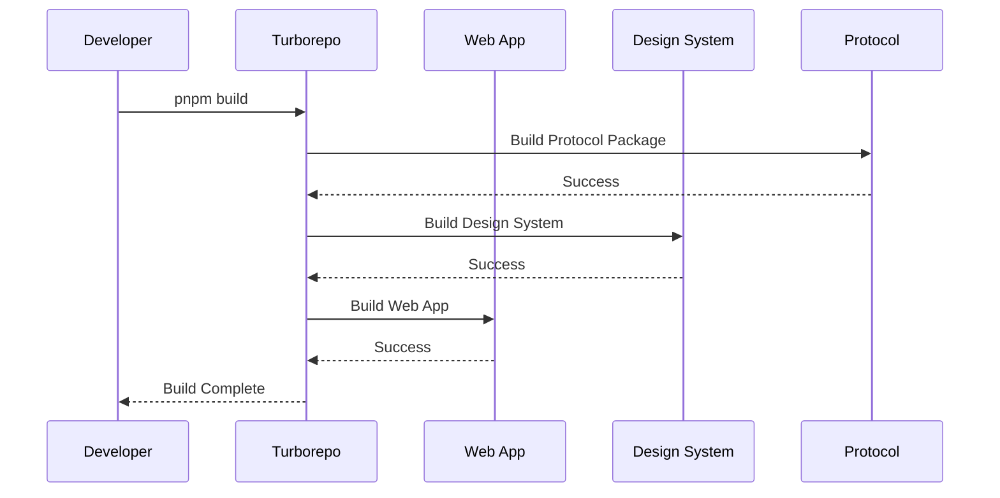
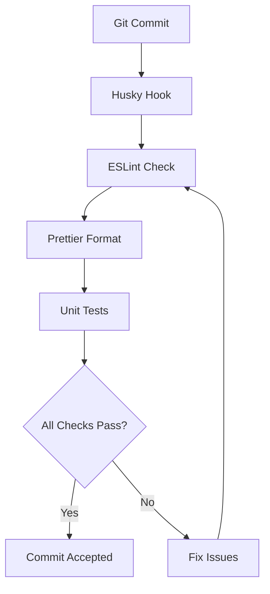
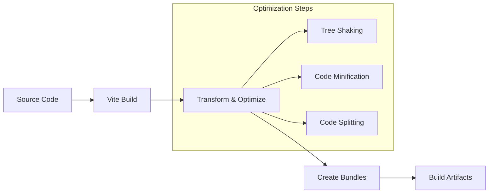
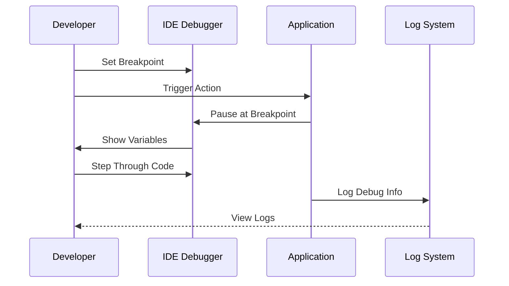
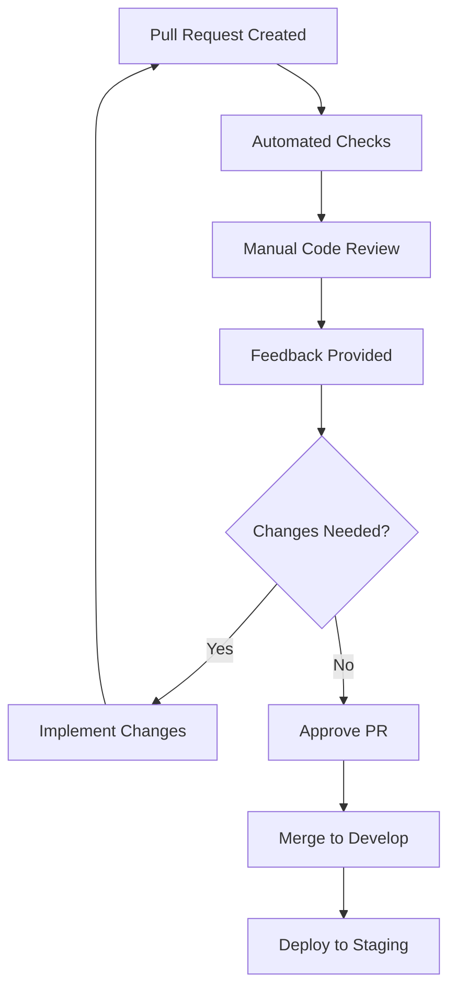

# Development Guide

<cite>
**Referenced Files in This Document**
- [package.json](file://package.json)
- [turbo.json](file://turbo.json)
- [pnpm-workspace.yaml](file://pnpm-workspace.yaml)
- [CONTRIBUTING.md](file://CONTRIBUTING.md)
- [README.md](file://README.md)
- [.devcontainer/devcontainer.json](file://.devcontainer/devcontainer.json)
- [apps/web/package.json](file://apps/web/package.json)
- [apps/web/vite.config.ts](file://apps/web/vite.config.ts)
- [apps/web/playwright.config.ts](file://apps/web/playwright.config.ts)
- [apps/web/vitest.config.ts](file://apps/web/vitest.config.ts)
- [eslint.config.js](file://eslint.config.js)
- [.prettierrc](file://.prettierrc)
- [.github/workflows/ci.yml](file://.github/workflows/ci.yml)
- [docs/wiki/how-to-contribute/development-workflow.md](file://docs/wiki/how-to-contribute/development-workflow.md)
- [docs/wiki/how-to-contribute/testing.md](file://docs/wiki/how-to-contribute/testing.md)
- [docs/wiki/how-to-contribute/debugging.md](file://docs/wiki/how-to-contribute/debugging.md)
</cite>

## Table of Contents

1. [Introduction](#introduction)
2. [Project Structure](#project-structure)
3. [Development Environment Setup](#development-environment-setup)
4. [Turborepo Workflow](#turborepo-workflow)
5. [Coding Standards](#coding-standards)
6. [Build System](#build-system)
7. [Testing Strategy](#testing-strategy)
8. [Debugging Techniques](#debugging-techniques)
9. [Contribution Guidelines](#contribution-guidelines)
10. [Code Review Process](#code-review-process)
11. [Performance Profiling](#performance-profiling)
12. [Troubleshooting](#troubleshooting)
13. [Conclusion](#conclusion)

## Introduction

Fleet Pi is a modern monorepo application built with Turborepo that provides an intelligent workspace management platform. The project follows industry best practices for large-scale JavaScript/TypeScript applications, utilizing pnpm for package management and Vite for build optimization. This development guide will help you understand the project structure, setup process, and contribution workflow to effectively contribute to the Fleet Pi codebase.

The application consists of multiple packages including a web application, design system components, and protocol definitions, all managed through a unified development experience powered by Turborepo's task orchestration.

## Project Structure

Fleet Pi follows a well-organized monorepo structure that separates concerns into distinct packages and applications:



**Diagram sources**

- [package.json:1-50](file://package.json#L1-L50)
- [pnpm-workspace.yaml:1-20](file://pnpm-workspace.yaml#L1-L20)

The monorepo structure enables:

- **Independent versioning** of packages while maintaining shared dependencies
- **Parallel builds** using Turborepo for optimal performance
- **Code sharing** across different parts of the application
- **Consistent tooling** across all packages

**Section sources**

- [package.json:1-100](file://package.json#L1-L100)
- [pnpm-workspace.yaml:1-30](file://pnpm-workspace.yaml#L1-L30)

## Development Environment Setup

### Prerequisites

Before setting up the development environment, ensure you have the following installed:

- **Node.js** (version specified in `.nvmrc` or `package.json`)
- **pnpm** (latest stable version)
- **Git** (for version control)
- **Docker** (optional, for containerized development)

### Initial Setup

1. **Clone the repository**:

   ```bash
   git clone https://github.com/fleet-pi/fleet-pi.git
   cd fleet-pi
   ```

2. **Install dependencies**:

   ```bash
   pnpm install
   ```

3. **Set up environment variables**:

   ```bash
   cp .env.example .env
   # Edit .env with your configuration
   ```

4. **Start the development server**:
   ```bash
   pnpm dev
   ```

### Containerized Development

For consistent development environments, use the provided DevContainer configuration:



**Diagram sources**

- [.devcontainer/devcontainer.json:1-50](file://.devcontainer/devcontainer.json#L1-L50)

**Section sources**

- [.devcontainer/devcontainer.json:1-100](file://.devcontainer/devcontainer.json#L1-L100)
- [README.md:1-50](file://README.md#L1-L50)

## Turborepo Workflow

Turborepo serves as the task runner and build system for the entire monorepo, providing parallel execution and caching capabilities.

### Core Commands

| Command       | Description                   | Usage         |
| ------------- | ----------------------------- | ------------- |
| `pnpm dev`    | Start all development servers | `pnpm dev`    |
| `pnpm build`  | Build all packages            | `pnpm build`  |
| `pnpm test`   | Run all tests                 | `pnpm test`   |
| `pnpm lint`   | Lint all packages             | `pnpm lint`   |
| `pnpm format` | Format all code               | `pnpm format` |

### Task Dependencies

Turborepo automatically handles task dependencies:



**Diagram sources**

- [turbo.json:1-100](file://turbo.json#L1-L100)
- [package.json:1-50](file://package.json#L1-L50)

### Custom Tasks

Each package can define custom tasks in its `package.json`:

```json
{
  "scripts": {
    "dev": "vite",
    "build": "vite build",
    "test": "vitest",
    "lint": "eslint .",
    "format": "prettier --write ."
  }
}
```

**Section sources**

- [turbo.json:1-150](file://turbo.json#L1-L150)
- [apps/web/package.json:1-50](file://apps/web/package.json#L1-L50)

## Coding Standards

Fleet Pi enforces consistent coding standards across all packages using ESLint and Prettier.

### ESLint Configuration

The project uses a centralized ESLint configuration that applies to all packages:

- **TypeScript support** with strict mode enabled
- **React hooks** rules for functional components
- **Import/export** organization and validation
- **Code style** enforcement
- **Security** checks and vulnerabilities

### Prettier Formatting

Automatic code formatting ensures consistency:

- **Single quotes** for strings
- **Semicolons** at line endings
- **2-space indentation**
- **Trailing commas** where applicable
- **Max line length** of 100 characters

### Git Hooks

Pre-commit hooks enforce code quality:



**Diagram sources**

- [.husky/_/pre-commit:1-20](file://.husky/_/pre-commit#L1-L20)
- [eslint.config.js:1-50](file://eslint.config.js#L1-L50)
- [.prettierrc:1-30](file://.prettierrc#L1-L30)

**Section sources**

- [eslint.config.js:1-100](file://eslint.config.js#L1-L100)
- [.prettierrc:1-50](file://.prettierrc#L1-L50)

## Build System

The build system leverages Vite for fast development and optimized production builds.

### Development Build

The development server provides:

- **Hot Module Replacement (HMR)** for instant updates
- **Fast refresh** for React components
- **Source maps** for debugging
- **Bundle analysis** during development

### Production Build

Production builds include:

- **Tree shaking** for unused code removal
- **Code splitting** for better loading performance
- **Asset optimization** for images and fonts
- **Minification** for reduced bundle size
- **Environment-specific optimizations**

### Build Pipeline



**Diagram sources**

- [apps/web/vite.config.ts:1-100](file://apps/web/vite.config.ts#L1-L100)
- [turbo.json:1-50](file://turbo.json#L1-L50)

**Section sources**

- [apps/web/vite.config.ts:1-150](file://apps/web/vite.config.ts#L1-L150)
- [turbo.json:1-100](file://turbo.json#L1-L100)

## Testing Strategy

Fleet Pi implements a comprehensive testing strategy covering unit, integration, and end-to-end tests.

### Test Types

| Test Type         | Framework  | Location                | Purpose                        |
| ----------------- | ---------- | ----------------------- | ------------------------------ |
| Unit Tests        | Vitest     | `*.test.ts`             | Component and function testing |
| Integration Tests | Vitest     | `*.integration.test.ts` | API and service testing        |
| E2E Tests         | Playwright | `e2e/*.ts`              | User flow testing              |
| Visual Regression | Playwright | `e2e/*.spec.ts`         | UI consistency testing         |

### Test Configuration

```mermaid
classDiagram
class TestConfiguration {
+unitTests : VitestConfig
+e2eTests : PlaywrightConfig
+coverage : CoverageConfig
+mocks : MockConfig
}
class VitestConfig {
+environment : "jsdom"
+setupFiles : ["src/test/setup.ts"]
+coverage : { provider : "v8" }
}
class PlaywrightConfig {
+browser : ["chromium", "firefox"]
+testDir : "e2e"
+timeout : 30000
}
TestConfiguration --> VitestConfig
TestConfiguration --> PlaywrightConfig
```

**Diagram sources**

- [apps/web/vitest.config.ts:1-50](file://apps/web/vitest.config.ts#L1-L50)
- [apps/web/playwright.config.ts:1-50](file://apps/web/playwright.config.ts#L1-L50)

### Running Tests

```bash
# Run all tests
pnpm test

# Run unit tests only
pnpm test:unit

# Run E2E tests
pnpm test:e2e

# Run tests with coverage
pnpm test:coverage

# Watch mode for development
pnpm test:watch
```

**Section sources**

- [apps/web/vitest.config.ts:1-100](file://apps/web/vitest.config.ts#L1-L100)
- [apps/web/playwright.config.ts:1-100](file://apps/web/playwright.config.ts#L1-L100)

## Debugging Techniques

Fleet Pi provides multiple debugging approaches for different scenarios.

### Browser Debugging

For frontend debugging:

- **Chrome DevTools** integration with source maps
- **React Developer Tools** for component inspection
- **Network tab** for API request debugging
- **Performance profiling** for optimization

### Node.js Debugging

For backend and build processes:

- **VS Code debugger** configuration
- **Node.js inspector** for runtime debugging
- **Log levels** for different environments
- **Error tracking** with Sentry integration

### Debugging Workflow



**Diagram sources**

- [apps/web/src/lib/logger.ts:1-50](file://apps/web/src/lib/logger.ts#L1-L50)
- [.vscode/launch.json:1-50](file://.vscode/launch.json#L1-L50)

**Section sources**

- [docs/wiki/how-to-contribute/debugging.md:1-100](file://docs/wiki/how-to-contribute/debugging.md#L1-L100)

## Contribution Guidelines

### Branching Strategy

Fleet Pi follows a feature-based branching strategy:

- **main**: Production-ready code
- **develop**: Integration branch for features
- **feature/**: Feature development branches
- **bugfix/**: Bug fix branches
- **hotfix/**: Emergency production fixes

### Commit Conventions

Commits follow conventional commit format:

```
<type>(scope): <description>

[optional body]

[optional footer(s)]
```

**Types**: feat, fix, docs, style, refactor, test, chore

### Pull Request Process

1. **Create feature branch** from develop
2. **Implement changes** with appropriate tests
3. **Run all checks** locally before pushing
4. **Create pull request** with detailed description
5. **Address review feedback** promptly
6. **Merge after approval** and CI passes

### Code Review Checklist

- [ ] Code follows established patterns
- [ ] Tests are included and passing
- [ ] Documentation is updated
- [ ] No security vulnerabilities
- [ ] Performance impact considered
- [ ] Error handling is robust

**Section sources**

- [CONTRIBUTING.md:1-200](file://CONTRIBUTING.md#L1-L200)
- [docs/wiki/how-to-contribute/development-workflow.md:1-150](file://docs/wiki/how-to-contribute/development-workflow.md#L1-L150)

## Code Review Process

The code review process ensures code quality and knowledge sharing across the team.

### Review Stages



**Diagram sources**

- [.github/pull_request_template.md:1-50](file://.github/pull_request_template.md#L1-L50)
- [.github/workflows/ci.yml:1-100](file://.github/workflows/ci.yml#L1-L100)

### Review Criteria

- **Functionality**: Does the code work as intended?
- **Readability**: Is the code easy to understand?
- **Maintainability**: Can it be easily modified later?
- **Performance**: Are there any performance concerns?
- **Security**: Are there any security implications?
- **Testing**: Is the code adequately tested?

**Section sources**

- [.github/pull_request_template.md:1-100](file://.github/pull_request_template.md#L1-L100)

## Performance Profiling

Fleet Pi includes comprehensive performance profiling tools and techniques.

### Frontend Profiling

- **React Profiler** for component performance
- **Chrome Performance Tab** for rendering analysis
- **Lighthouse** for web vitals assessment
- **Bundle analyzer** for dependency optimization

### Backend Profiling

- **Node.js profiler** for CPU and memory analysis
- **Database query profiling** for slow queries
- **API response time monitoring**
- **Memory leak detection**

### Performance Monitoring

```mermaid
graph TB
subgraph "Monitoring"
APM["Application Performance Monitoring"]
Metrics["Custom Metrics"]
Logs["Structured Logging"]
end
subgraph "Analysis"
Profiling["Performance Profiling"]
Analysis["Performance Analysis"]
Optimization["Optimization"]
end
APM --> Profiling
Metrics --> Profiling
Logs --> Analysis
Profiling --> Analysis
Analysis --> Optimization
```

**Diagram sources**

- [apps/web/src/lib/analytics/:1-50](file://apps/web/src/lib/analytics/index.ts#L1-L50)
- [apps/web/src/lib/logger.ts:1-50](file://apps/web/src/lib/logger.ts#L1-L50)

**Section sources**

- [docs/wiki/reference/performance.md:1-100](file://docs/wiki/reference/performance.md#L1-L100)

## Troubleshooting

### Common Development Issues

#### Dependency Resolution Problems

```bash
# Clear pnpm cache
pnpm store prune

# Reinstall dependencies
rm -rf node_modules
pnpm install

# Update lock file
pnpm update
```

#### Build Failures

```bash
# Clean build artifacts
pnpm clean

# Force rebuild
pnpm build --force

# Check for TypeScript errors
pnpm typecheck
```

#### Port Conflicts

```bash
# Find process using port
lsof -i :3000

# Kill process
kill -9 <PID>

# Use different port
PORT=3001 pnpm dev
```

### Environment-Specific Issues

#### Docker Issues

```bash
# Rebuild containers
docker-compose down --volumes
docker-compose up --build

# Check container logs
docker-compose logs -f
```

#### Database Connection Issues

```bash
# Reset database
pnpm db:reset

# Migrate schema
pnpm db:migrate

# Seed data
pnpm db:seed
```

**Section sources**

- [docs/wiki/how-to-contribute/debugging.md:1-100](file://docs/wiki/how-to-contribute/debugging.md#L1-L100)

## Conclusion

Fleet Pi provides a robust development environment with modern tooling and best practices. By following this development guide, contributors can effectively work with the codebase, maintain code quality, and collaborate efficiently with the team.

Key takeaways:

- **Use Turborepo** for efficient monorepo management
- **Follow coding standards** consistently across all packages
- **Write comprehensive tests** for all new functionality
- **Document changes** thoroughly for future maintainers
- **Profile performance** regularly to maintain optimal user experience

The combination of modern tooling, clear contribution guidelines, and comprehensive documentation makes Fleet Pi an excellent example of how to structure and maintain large-scale JavaScript/TypeScript applications.
