# AI Chat Interface

<cite>
**Referenced Files in This Document**
- [chat.ts](file://functions/chat.ts)
- [chat.ts](file://apps/web/src/routes/api/chat.ts)
- [question.ts](file://apps/web/src/routes/api/chat/question.ts)
- [run.ts](file://apps/web/src/routes/api/chat/run.ts)
- [sessions.ts](file://apps/web/src/routes/api/chat/sessions.ts)
- [session.ts](file://apps/web/src/routes/api/chat/session.ts)
- [new.ts](file://apps/web/src/routes/api/chat/new.ts)
- [resume.ts](file://apps/web/src/routes/api/chat/resume.ts)
- [abort.ts](file://apps/web/src/routes/api/chat/abort.ts)
- [settings.ts](file://apps/web/src/routes/api/chat/settings.ts)
- [providers.ts](file://apps/web/src/routes/api/chat/providers.ts)
- [models.ts](file://apps/web/src/routes/api/chat/models.ts)
- [models.discover.ts](file://apps/web/src/routes/api/chat/models.discover.ts)
- [commands.ts](file://apps/web/src/routes/api/chat/commands.ts)
- [resources.ts](file://apps/web/src/routes/api/chat/resources.ts)
- [provenance.ts](file://apps/web/src/routes/api/chat/provenance.ts)
- [account.ts](file://apps/web/src/routes/api/chat/account.ts)
- [runs.ts](file://apps/web/src/routes/api/chat/runs.ts)
- [api-utils.ts](file://apps/web/src/lib/api-utils.ts)
- [env-manager.ts](file://apps/web/src/lib/env-manager.ts)
- [logger.ts](file://apps/web/src/lib/logger.ts)
- [auth-session.ts](file://apps/web/src/routes/api/auth/session.ts)
- [openapi.json](file://apps/web/openapi.json)
</cite>

## Table of Contents

1. [Introduction](#introduction)
2. [Project Structure](#project-structure)
3. [Core Components](#core-components)
4. [Architecture Overview](#architecture-overview)
5. [Detailed Component Analysis](#detailed-component-analysis)
6. [Dependency Analysis](#dependency-analysis)
7. [Performance Considerations](#performance-considerations)
8. [Troubleshooting Guide](#troubleshooting-guide)
9. [Conclusion](#conclusion)
10. [Appendices](#appendices)

## Introduction

This document explains Fleet Pi’s AI-powered chat interface, focusing on the API endpoints, message handling, conversation management, and real-time communication patterns. It covers how users interact with AI models, configure chat settings, manage conversation history, and handle different response types including streaming. It also documents authentication, rate limiting, and security considerations relevant to chat functionality.

## Project Structure

The chat feature is implemented as a set of server-side API routes under apps/web/src/routes/api/chat, with a shared utility layer for common concerns (authentication, environment configuration, logging). A serverless function entry point exists at functions/chat.ts for edge or external invocation scenarios. The OpenAPI specification is generated into apps/web/openapi.json for reference and tooling.

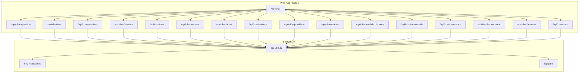

**Diagram sources**

- [chat.ts](file://apps/web/src/routes/api/chat.ts)
- [question.ts](file://apps/web/src/routes/api/chat/question.ts)
- [run.ts](file://apps/web/src/routes/api/chat/run.ts)
- [sessions.ts](file://apps/web/src/routes/api/chat/sessions.ts)
- [session.ts](file://apps/web/src/routes/api/chat/session.ts)
- [new.ts](file://apps/web/src/routes/api/chat/new.ts)
- [resume.ts](file://apps/web/src/routes/api/chat/resume.ts)
- [abort.ts](file://apps/web/src/routes/api/chat/abort.ts)
- [settings.ts](file://apps/web/src/routes/api/chat/settings.ts)
- [providers.ts](file://apps/web/src/routes/api/chat/providers.ts)
- [models.ts](file://apps/web/src/routes/api/chat/models.ts)
- [models.discover.ts](file://apps/web/src/routes/api/chat/models.discover.ts)
- [commands.ts](file://apps/web/src/routes/api/chat/commands.ts)
- [resources.ts](file://apps/web/src/routes/api/chat/resources.ts)
- [provenance.ts](file://apps/web/src/routes/api/chat/provenance.ts)
- [account.ts](file://apps/web/src/routes/api/chat/account.ts)
- [runs.ts](file://apps/web/src/routes/api/chat/runs.ts)
- [api-utils.ts](file://apps/web/src/lib/api-utils.ts)
- [env-manager.ts](file://apps/web/src/lib/env-manager.ts)
- [logger.ts](file://apps/web/src/lib/logger.ts)

**Section sources**

- [chat.ts](file://apps/web/src/routes/api/chat.ts)
- [openapi.json](file://apps/web/openapi.json)

## Core Components

- Chat API Router: Centralizes routing for all chat-related endpoints under /api/chat.
- Question Handler: Processes user prompts, manages conversation context, and streams responses from AI providers.
- Run Handler: Executes long-running or batched operations and supports progress updates.
- Session Management: Creates, resumes, lists, and deletes conversations; persists state and metadata.
- Settings and Providers: Configures model parameters, provider credentials, and runtime options.
- Models Discovery: Enumerates available models and capabilities per provider.
- Commands and Resources: Integrates with tools and resources exposed by the agent system.
- Provenance and Runs: Tracks execution provenance and run history for auditability.
- Account Integration: Binds chat sessions to authenticated users and enforces access control.
- Utilities: Shared helpers for request/response handling, environment configuration, and logging.

Key responsibilities and interactions are detailed in the following sections.

**Section sources**

- [question.ts](file://apps/web/src/routes/api/chat/question.ts)
- [run.ts](file://apps/web/src/routes/api/chat/run.ts)
- [sessions.ts](file://apps/web/src/routes/api/chat/sessions.ts)
- [session.ts](file://apps/web/src/routes/api/chat/session.ts)
- [new.ts](file://apps/web/src/routes/api/chat/new.ts)
- [resume.ts](file://apps/web/src/routes/api/chat/resume.ts)
- [abort.ts](file://apps/web/src/routes/api/chat/abort.ts)
- [settings.ts](file://apps/web/src/routes/api/chat/settings.ts)
- [providers.ts](file://apps/web/src/routes/api/chat/providers.ts)
- [models.ts](file://apps/web/src/routes/api/chat/models.ts)
- [models.discover.ts](file://apps/web/src/routes/api/chat/models.discover.ts)
- [commands.ts](file://apps/web/src/routes/api/chat/commands.ts)
- [resources.ts](file://apps/web/src/routes/api/chat/resources.ts)
- [provenance.ts](file://apps/web/src/routes/api/chat/provenance.ts)
- [account.ts](file://apps/web/src/routes/api/chat/account.ts)
- [runs.ts](file://apps/web/src/routes/api/chat/runs.ts)
- [api-utils.ts](file://apps/web/src/lib/api-utils.ts)
- [env-manager.ts](file://apps/web/src/lib/env-manager.ts)
- [logger.ts](file://apps/web/src/lib/logger.ts)

## Architecture Overview

The chat architecture follows a layered approach:

- Client sends requests to /api/chat/* endpoints.
- Route handlers validate input, authenticate users, and enforce policies.
- Business logic orchestrates conversation state, model selection, and provider calls.
- Responses may be streamed via Server-Sent Events or chunked transfer encoding.
- Persistence stores session metadata and run history; provenance tracks execution details.

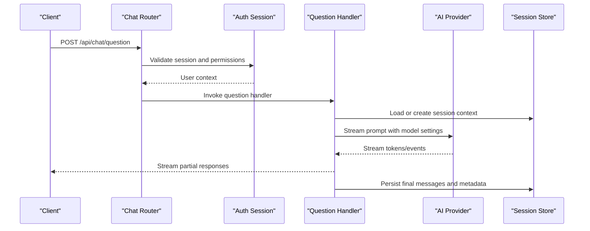

**Diagram sources**

- [chat.ts](file://apps/web/src/routes/api/chat.ts)
- [question.ts](file://apps/web/src/routes/api/chat/question.ts)
- [auth-session.ts](file://apps/web/src/routes/api/auth/session.ts)

## Detailed Component Analysis

### Chat Router (/api/chat)

- Purpose: Aggregates chat endpoints and applies cross-cutting concerns such as authentication and error normalization.
- Behavior: Delegates to specific route handlers based on path segments; ensures consistent headers and status codes.

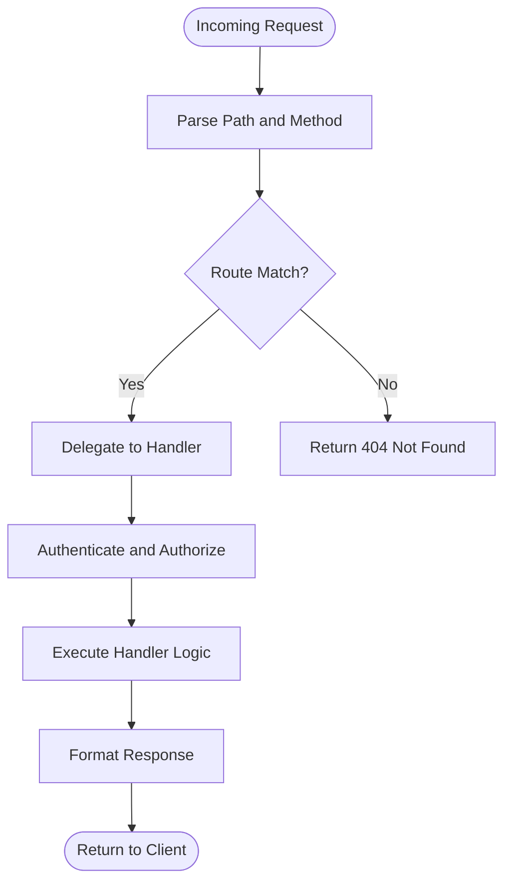

**Diagram sources**

- [chat.ts](file://apps/web/src/routes/api/chat.ts)

**Section sources**

- [chat.ts](file://apps/web/src/routes/api/chat.ts)

### Question Endpoint (/api/chat/question)

- Purpose: Handles user prompts, manages conversation context, and streams AI responses.
- Key behaviors:
  - Validates request payload and required fields.
  - Loads or initializes session state.
  - Selects model and provider based on settings.
  - Streams incremental tokens or structured events back to the client.
  - Persists messages and metadata after completion.

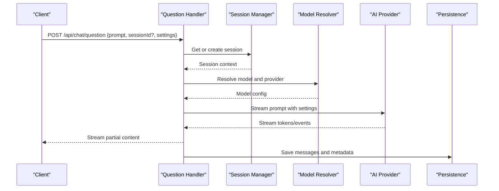

**Diagram sources**

- [question.ts](file://apps/web/src/routes/api/chat/question.ts)

**Section sources**

- [question.ts](file://apps/web/src/routes/api/chat/question.ts)

### Run Endpoint (/api/chat/run)

- Purpose: Executes longer-running tasks or batched operations with progress tracking.
- Key behaviors:
  - Accepts task definition and parameters.
  - Returns an operation ID for polling or subscribes to progress events.
  - Supports cancellation via abort endpoint.
  - Persists run metadata and outcomes.

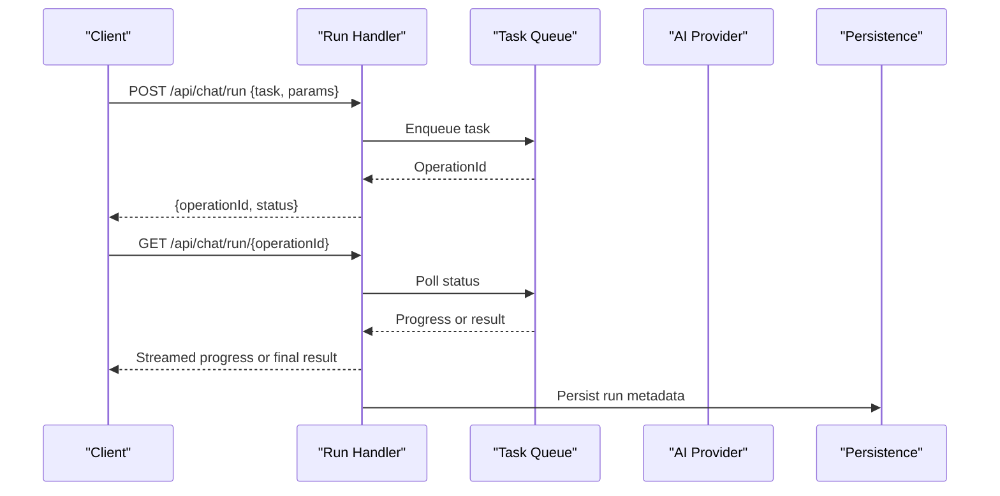

**Diagram sources**

- [run.ts](file://apps/web/src/routes/api/chat/run.ts)

**Section sources**

- [run.ts](file://apps/web/src/routes/api/chat/run.ts)

### Sessions Management (/api/chat/sessions, /api/chat/session, /api/chat/new, /api/chat/resume)

- Purpose: Create, list, resume, and delete conversations; maintain persistent state across requests.
- Key behaviors:
  - new: Initializes a fresh session with default settings.
  - sessions: Lists user-owned sessions with pagination and filters.
  - session: Retrieves or updates a specific session’s metadata and settings.
  - resume: Restores a prior conversation context for continued interaction.

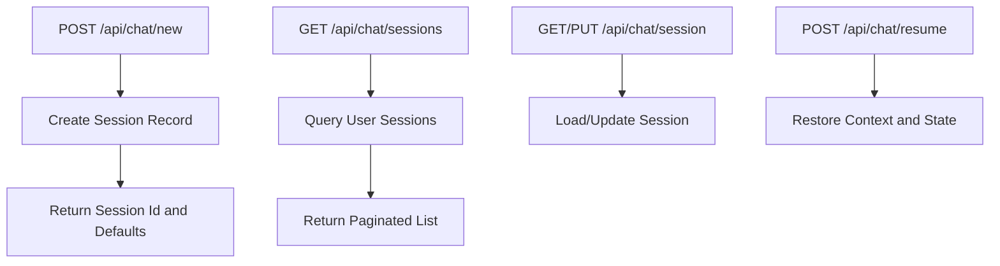

**Diagram sources**

- [sessions.ts](file://apps/web/src/routes/api/chat/sessions.ts)
- [session.ts](file://apps/web/src/routes/api/chat/session.ts)
- [new.ts](file://apps/web/src/routes/api/chat/new.ts)
- [resume.ts](file://apps/web/src/routes/api/chat/resume.ts)

**Section sources**

- [sessions.ts](file://apps/web/src/routes/api/chat/sessions.ts)
- [session.ts](file://apps/web/src/routes/api/chat/session.ts)
- [new.ts](file://apps/web/src/routes/api/chat/new.ts)
- [resume.ts](file://apps/web/src/routes/api/chat/resume.ts)

### Abort Endpoint (/api/chat/abort)

- Purpose: Cancels ongoing operations such as runs or streaming prompts.
- Key behaviors:
  - Validates ownership and active operation.
  - Signals provider or internal queue to stop processing.
  - Updates status and returns confirmation.

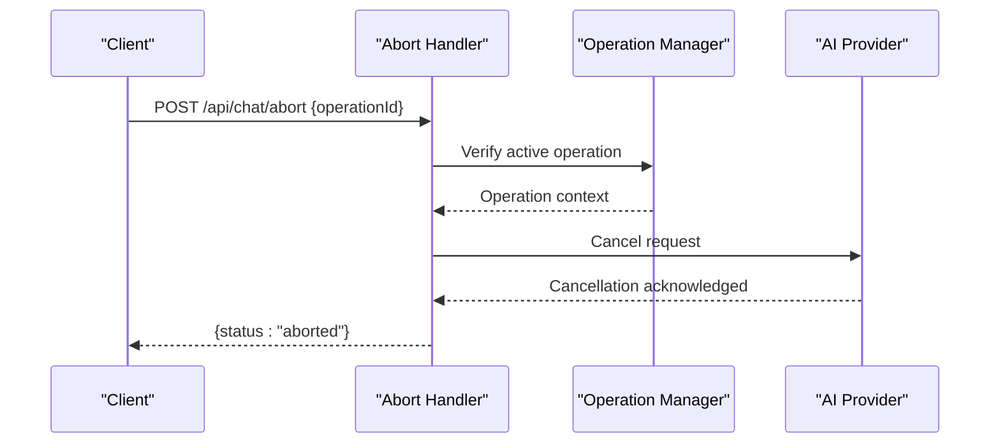

**Diagram sources**

- [abort.ts](file://apps/web/src/routes/api/chat/abort.ts)

**Section sources**

- [abort.ts](file://apps/web/src/routes/api/chat/abort.ts)

### Settings and Providers (/api/chat/settings, /api/chat/providers)

- Purpose: Configure chat behavior and discover supported providers.
- Key behaviors:
  - settings: Read/write user-specific chat settings (model defaults, temperature, max tokens).
  - providers: Enumerate available providers and their capabilities.

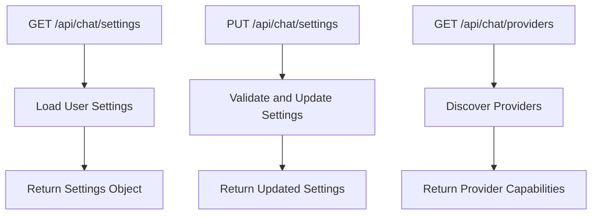

**Diagram sources**

- [settings.ts](file://apps/web/src/routes/api/chat/settings.ts)
- [providers.ts](file://apps/web/src/routes/api/chat/providers.ts)

**Section sources**

- [settings.ts](file://apps/web/src/routes/api/chat/settings.ts)
- [providers.ts](file://apps/web/src/routes/api/chat/providers.ts)

### Models and Discovery (/api/chat/models, /api/chat/models.discover)

- Purpose: Provide model listings and dynamic discovery of available models per provider.
- Key behaviors:
  - models: Return configured models and metadata.
  - models.discover: Fetch live model catalogs from providers when enabled.

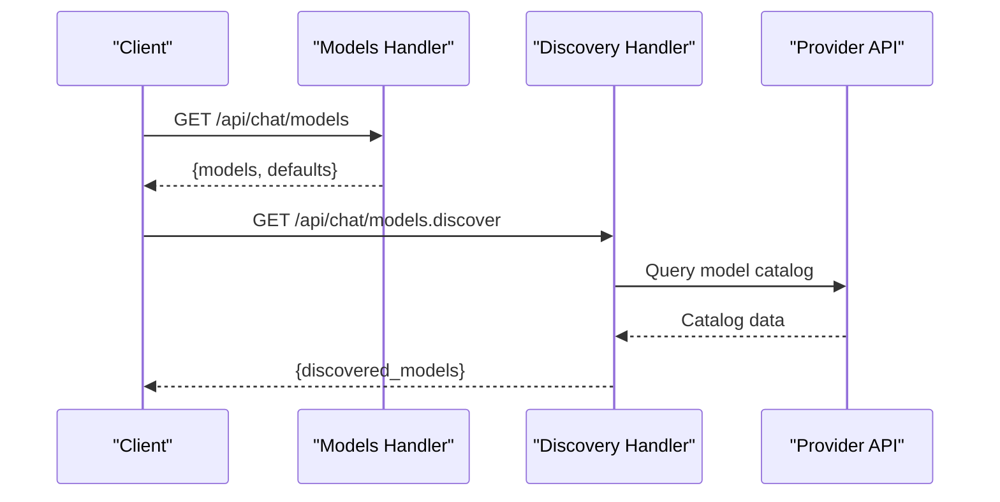

**Diagram sources**

- [models.ts](file://apps/web/src/routes/api/chat/models.ts)
- [models.discover.ts](file://apps/web/src/routes/api/chat/models.discover.ts)

**Section sources**

- [models.ts](file://apps/web/src/routes/api/chat/models.ts)
- [models.discover.ts](file://apps/web/src/routes/api/chat/models.discover.ts)

### Commands and Resources (/api/chat/commands, /api/chat/resources)

- Purpose: Expose agent commands and resource integrations usable within chat interactions.
- Key behaviors:
  - commands: List available commands and schemas.
  - resources: Access contextual resources (files, indexes) referenced by prompts.

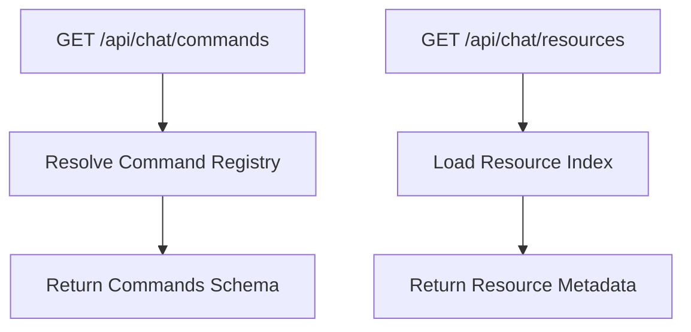

**Diagram sources**

- [commands.ts](file://apps/web/src/routes/api/chat/commands.ts)
- [resources.ts](file://apps/web/src/routes/api/chat/resources.ts)

**Section sources**

- [commands.ts](file://apps/web/src/routes/api/chat/commands.ts)
- [resources.ts](file://apps/web/src/routes/api/chat/resources.ts)

### Provenance and Runs History (/api/chat/provenance, /api/chat/runs)

- Purpose: Track execution provenance and provide run history for auditing and debugging.
- Key behaviors:
  - provenance: Retrieve trace details for a given operation or message.
  - runs: List past runs with filters and pagination.

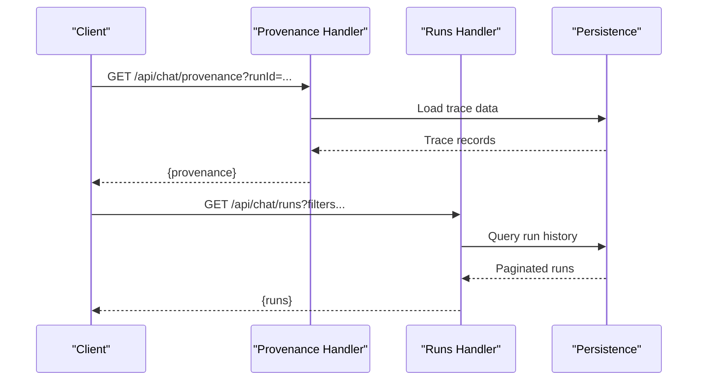

**Diagram sources**

- [provenance.ts](file://apps/web/src/routes/api/chat/provenance.ts)
- [runs.ts](file://apps/web/src/routes/api/chat/runs.ts)

**Section sources**

- [provenance.ts](file://apps/web/src/routes/api/chat/provenance.ts)
- [runs.ts](file://apps/web/src/routes/api/chat/runs.ts)

### Account Integration (/api/chat/account)

- Purpose: Bind chat operations to authenticated accounts and enforce ownership.
- Key behaviors:
  - Retrieve account info and permissions.
  - Ensure session and run ownership checks.

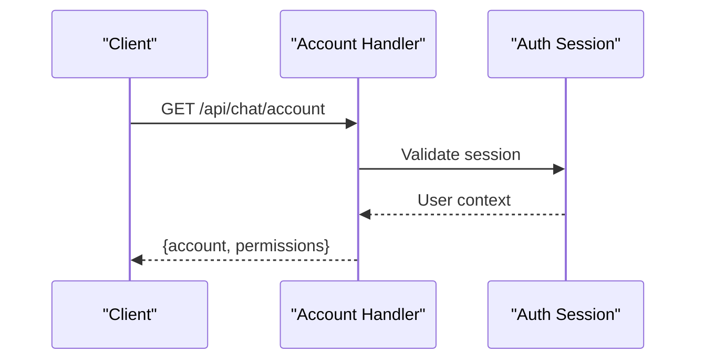

**Diagram sources**

- [account.ts](file://apps/web/src/routes/api/chat/account.ts)
- [auth-session.ts](file://apps/web/src/routes/api/auth/session.ts)

**Section sources**

- [account.ts](file://apps/web/src/routes/api/chat/account.ts)
- [auth-session.ts](file://apps/web/src/routes/api/auth/session.ts)

### Shared Utilities (api-utils, env-manager, logger)

- api-utils: Common request parsing, response formatting, error mapping, and streaming helpers.
- env-manager: Environment variable resolution and validation for provider keys and features.
- logger: Structured logging for requests, errors, and performance metrics.

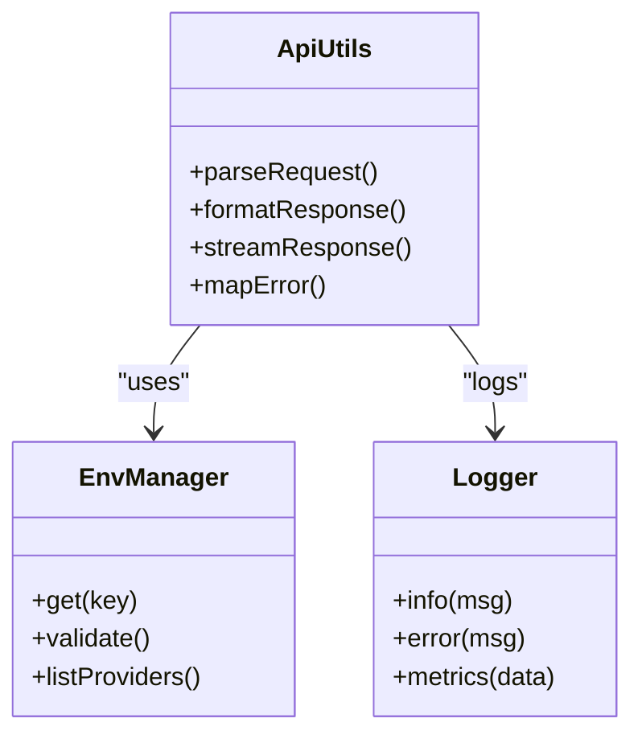

**Diagram sources**

- [api-utils.ts](file://apps/web/src/lib/api-utils.ts)
- [env-manager.ts](file://apps/web/src/lib/env-manager.ts)
- [logger.ts](file://apps/web/src/lib/logger.ts)

**Section sources**

- [api-utils.ts](file://apps/web/src/lib/api-utils.ts)
- [env-manager.ts](file://apps/web/src/lib/env-manager.ts)
- [logger.ts](file://apps/web/src/lib/logger.ts)

## Dependency Analysis

The chat subsystem depends on:

- Authentication session middleware for authorization.
- Environment manager for provider configuration and feature flags.
- Logging utilities for observability.
- Persistence layer for sessions, runs, and provenance.
- External AI providers for model inference and streaming.

```mermaid
graph TB
Q["question.ts"] --> AU["api-utils.ts"]
Q --> EM["env-manager.ts"]
Q --> LG["logger.ts"]
R["run.ts"] --> AU
R --> EM
R --> LG
S["sessions.ts"] --> AU
S --> EM
S --> LG
SS["session.ts"] --> AU
SS --> EM
SS --> LG
N["new.ts"] --> AU
N --> EM
N --> LG
RM["resume.ts"] --> AU
RM --> EM
RM --> LG
AB["abort.ts"] --> AU
AB --> EM
AB --> LG
ST["settings.ts"] --> AU
ST --> EM
ST --> LG
PR["providers.ts"] --> AU
PR --> EM
PR --> LG
MD["models.ts"] --> AU
MD --> EM
MD --> LG
MDD["models.discover.ts"] --> AU
MDD --> EM
MDD --> LG
CM["commands.ts"] --> AU
CM --> EM
CM --> LG
RS["resources.ts"] --> AU
RS --> EM
RS --> LG
PV["provenance.ts"] --> AU
PV --> EM
PV --> LG
AC["account.ts"] --> AU
AC --> EM
AC --> LG
RN["runs.ts"] --> AU
RN --> EM
RN --> LG
```

**Diagram sources**

- [question.ts](file://apps/web/src/routes/api/chat/question.ts)
- [run.ts](file://apps/web/src/routes/api/chat/run.ts)
- [sessions.ts](file://apps/web/src/routes/api/chat/sessions.ts)
- [session.ts](file://apps/web/src/routes/api/chat/session.ts)
- [new.ts](file://apps/web/src/routes/api/chat/new.ts)
- [resume.ts](file://apps/web/src/routes/api/chat/resume.ts)
- [abort.ts](file://apps/web/src/routes/api/chat/abort.ts)
- [settings.ts](file://apps/web/src/routes/api/chat/settings.ts)
- [providers.ts](file://apps/web/src/routes/api/chat/providers.ts)
- [models.ts](file://apps/web/src/routes/api/chat/models.ts)
- [models.discover.ts](file://apps/web/src/routes/api/chat/models.discover.ts)
- [commands.ts](file://apps/web/src/routes/api/chat/commands.ts)
- [resources.ts](file://apps/web/src/routes/api/chat/resources.ts)
- [provenance.ts](file://apps/web/src/routes/api/chat/provenance.ts)
- [account.ts](file://apps/web/src/routes/api/chat/account.ts)
- [runs.ts](file://apps/web/src/routes/api/chat/runs.ts)
- [api-utils.ts](file://apps/web/src/lib/api-utils.ts)
- [env-manager.ts](file://apps/web/src/lib/env-manager.ts)
- [logger.ts](file://apps/web/src/lib/logger.ts)

**Section sources**

- [api-utils.ts](file://apps/web/src/lib/api-utils.ts)
- [env-manager.ts](file://apps/web/src/lib/env-manager.ts)
- [logger.ts](file://apps/web/src/lib/logger.ts)

## Performance Considerations

- Streaming responses: Prefer Server-Sent Events or chunked transfer for large outputs to reduce latency and memory usage.
- Pagination: Implement cursor-based pagination for sessions and runs to avoid heavy payloads.
- Caching: Cache provider model catalogs and static settings where appropriate.
- Concurrency: Limit concurrent provider calls per user to prevent throttling and ensure fairness.
- Backpressure: Apply backpressure on streaming to handle slow clients gracefully.
- Observability: Use structured logs and metrics to detect bottlenecks and errors early.

[No sources needed since this section provides general guidance]

## Troubleshooting Guide

Common issues and resolutions:

- Authentication failures: Ensure valid session tokens and correct permissions; verify auth session middleware is invoked.
- Rate limiting: Check provider quotas and implement retry/backoff strategies; monitor rate limit headers.
- Streaming interruptions: Handle network errors and reconnect logic; validate stream integrity.
- Missing settings: Validate environment variables for provider keys; ensure settings persistence.
- Session not found: Confirm session ownership and existence; check deletion or migration scripts.
- Provider errors: Inspect logs and error mappings; fallback to alternative models if configured.

**Section sources**

- [api-utils.ts](file://apps/web/src/lib/api-utils.ts)
- [logger.ts](file://apps/web/src/lib/logger.ts)
- [env-manager.ts](file://apps/web/src/lib/env-manager.ts)

## Conclusion

Fleet Pi’s AI chat interface provides a robust, extensible API for interacting with multiple AI providers. It supports secure authentication, configurable settings, persistent conversations, and real-time streaming. By following the documented endpoints and best practices, developers can integrate advanced chat capabilities while maintaining security, performance, and reliability.

[No sources needed since this section summarizes without analyzing specific files]

## Appendices

### API Reference Summary

- Authentication: Required for most endpoints; validated via session middleware.
- Rate Limiting: Applied per user/provider; consult provider documentation and logs.
- Security: Input validation, output sanitization, and least-privilege access enforced.
- Streaming: Supported for question and run endpoints; clients should handle partial responses.

**Section sources**

- [openapi.json](file://apps/web/openapi.json)
- [chat.ts](file://functions/chat.ts)
