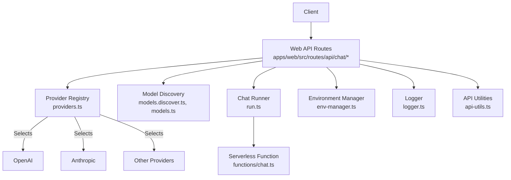
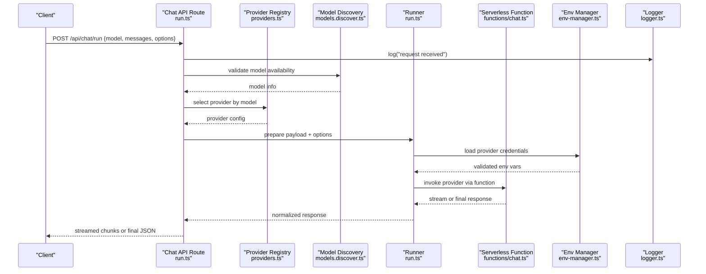
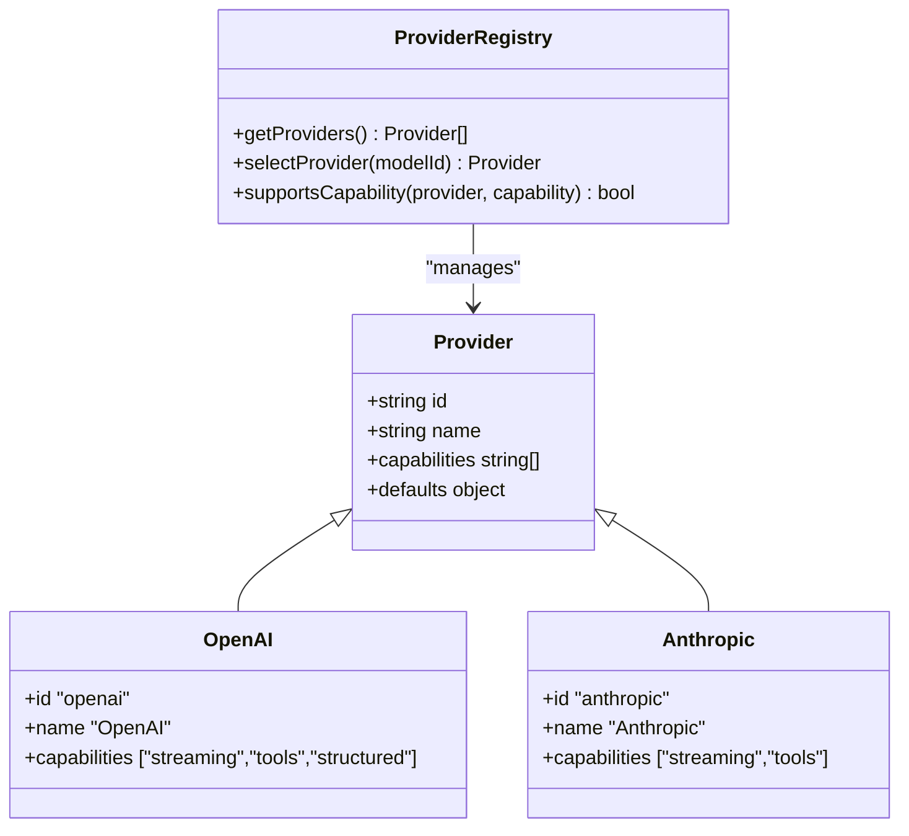
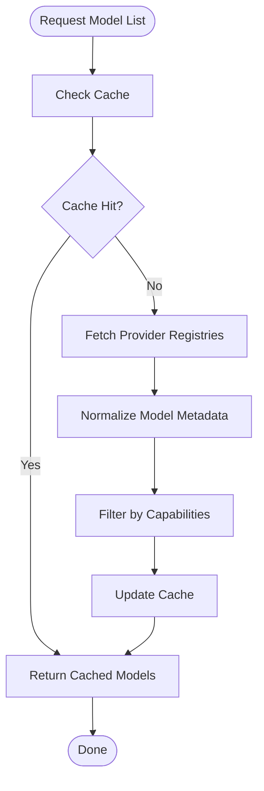
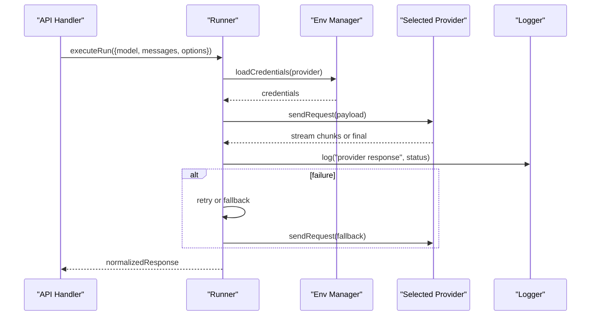
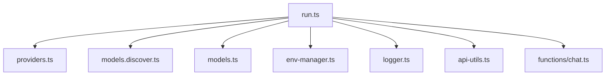

# AI Provider Integration

<cite>
**Referenced Files in This Document**
- [providers.ts](file://apps/web/src/routes/api/chat/providers.ts)
- [models.discover.ts](file://apps/web/src/routes/api/chat/models.discover.ts)
- [models.ts](file://apps/web/src/routes/api/chat/models.ts)
- [run.ts](file://apps/web/src/routes/api/chat/run.ts)
- [chat.ts](file://functions/chat.ts)
- [env-manager.ts](file://apps/web/src/lib/env-manager.ts)
- [logger.ts](file://apps/web/src/lib/logger.ts)
- [api-utils.ts](file://apps/web/src/lib/api-utils.ts)
- [configuration.md](file://docs/wiki/reference/configuration.md)
- [architecture.md](file://docs/architecture.md)
</cite>

## Table of Contents

1. [Introduction](#introduction)
2. [Project Structure](#project-structure)
3. [Core Components](#core-components)
4. [Architecture Overview](#architecture-overview)
5. [Detailed Component Analysis](#detailed-component-analysis)
6. [Dependency Analysis](#dependency-analysis)
7. [Performance Considerations](#performance-considerations)
8. [Troubleshooting Guide](#troubleshooting-guide)
9. [Conclusion](#conclusion)
10. [Appendices](#appendices)

## Introduction

This document explains Fleet Pi’s AI provider integration system, focusing on how multiple providers (such as OpenAI and Anthropic) are configured, discovered, authenticated, and routed for chat requests. It covers model discovery, provider configuration, authentication setup, request routing, rate limiting, fallback mechanisms, and provider selection logic. It also provides guidance on adding new providers and handling provider-specific features.

## Project Structure

Fleet Pi exposes a set of API endpoints under the chat namespace that orchestrate provider interactions:

- Provider listing and capabilities
- Model discovery and metadata
- Chat run execution with provider routing
- Environment and configuration management utilities

**Diagram sources**

- [providers.ts](file://apps/web/src/routes/api/chat/providers.ts)
- [models.discover.ts](file://apps/web/src/routes/api/chat/models.discover.ts)
- [models.ts](file://apps/web/src/routes/api/chat/models.ts)
- [run.ts](file://apps/web/src/routes/api/chat/run.ts)
- [chat.ts](file://functions/chat.ts)
- [env-manager.ts](file://apps/web/src/lib/env-manager.ts)
- [logger.ts](file://apps/web/src/lib/logger.ts)
- [api-utils.ts](file://apps/web/src/lib/api-utils.ts)

**Section sources**

- [providers.ts](file://apps/web/src/routes/api/chat/providers.ts)
- [models.discover.ts](file://apps/web/src/routes/api/chat/models.discover.ts)
- [models.ts](file://apps/web/src/routes/api/chat/models.ts)
- [run.ts](file://apps/web/src/routes/api/chat/run.ts)
- [chat.ts](file://functions/chat.ts)
- [env-manager.ts](file://apps/web/src/lib/env-manager.ts)
- [logger.ts](file://apps/web/src/lib/logger.ts)
- [api-utils.ts](file://apps/web/src/lib/api-utils.ts)

## Core Components

- Provider registry and selection: Centralizes available providers, their capabilities, and selection logic.
- Model discovery: Enumerates supported models per provider, including capabilities and constraints.
- Chat runner: Orchestrates request preparation, provider selection, streaming or non-streaming responses, retries, and error handling.
- Environment manager: Loads and validates environment variables for provider credentials and settings.
- Logging and utilities: Provides structured logging and shared HTTP/API helpers.

Key responsibilities:

- Validate and normalize inputs before sending to providers.
- Apply provider-specific options (e.g., temperature, max tokens).
- Implement rate limiting and backoff strategies.
- Support fallback chains across providers when primary fails.
- Expose consistent response formats to clients.

**Section sources**

- [providers.ts](file://apps/web/src/routes/api/chat/providers.ts)
- [models.discover.ts](file://apps/web/src/routes/api/chat/models.discover.ts)
- [models.ts](file://apps/web/src/routes/api/chat/models.ts)
- [run.ts](file://apps/web/src/routes/api/chat/run.ts)
- [env-manager.ts](file://apps/web/src/lib/env-manager.ts)
- [logger.ts](file://apps/web/src/lib/logger.ts)
- [api-utils.ts](file://apps/web/src/lib/api-utils.ts)

## Architecture Overview

The chat flow integrates client requests with provider APIs through a layered architecture:

- API layer routes incoming requests to handlers.
- Provider registry selects an appropriate provider based on model and capabilities.
- Model discovery ensures requested models exist and are valid.
- Runner prepares payloads, executes calls, handles streaming, and manages retries/fallbacks.
- Environment manager supplies credentials and configuration securely.
- Logger records events and errors for observability.

**Diagram sources**

- [run.ts](file://apps/web/src/routes/api/chat/run.ts)
- [providers.ts](file://apps/web/src/routes/api/chat/providers.ts)
- [models.discover.ts](file://apps/web/src/routes/api/chat/models.discover.ts)
- [chat.ts](file://functions/chat.ts)
- [env-manager.ts](file://apps/web/src/lib/env-manager.ts)
- [logger.ts](file://apps/web/src/lib/logger.ts)

## Detailed Component Analysis

### Provider Registry and Selection

Responsibilities:

- Maintain a registry of supported providers with capabilities and defaults.
- Map model IDs to providers and validate capability compatibility.
- Provide selection logic based on user preferences, model availability, and constraints.

Implementation patterns:

- Centralized provider definitions with typed interfaces.
- Capability flags for features like streaming, tools, and structured outputs.
- Fallback ordering configurable via environment or runtime options.

**Diagram sources**

- [providers.ts](file://apps/web/src/routes/api/chat/providers.ts)

**Section sources**

- [providers.ts](file://apps/web/src/routes/api/chat/providers.ts)

### Model Discovery

Responsibilities:

- Discover available models per provider.
- Normalize model metadata (id, name, capabilities, limits).
- Validate requested models against known sets.

Behavior:

- Fetches model lists from provider registries or cached configurations.
- Filters by capability requirements (e.g., streaming support).
- Caches results to reduce overhead.

**Diagram sources**

- [models.discover.ts](file://apps/web/src/routes/api/chat/models.discover.ts)
- [models.ts](file://apps/web/src/routes/api/chat/models.ts)

**Section sources**

- [models.discover.ts](file://apps/web/src/routes/api/chat/models.discover.ts)
- [models.ts](file://apps/web/src/routes/api/chat/models.ts)

### Chat Runner and Request Routing

Responsibilities:

- Prepare provider payloads from chat messages and options.
- Execute provider calls with streaming or non-streaming modes.
- Handle retries, timeouts, and fallbacks across providers.
- Normalize responses into a consistent format.

Flow:

- Validates input and resolves model/provider mapping.
- Loads credentials and applies provider-specific options.
- Streams tokens if supported; otherwise returns aggregated response.
- Implements retry logic with exponential backoff and fallback chain.

**Diagram sources**

- [run.ts](file://apps/web/src/routes/api/chat/run.ts)
- [chat.ts](file://functions/chat.ts)
- [env-manager.ts](file://apps/web/src/lib/env-manager.ts)
- [logger.ts](file://apps/web/src/lib/logger.ts)

**Section sources**

- [run.ts](file://apps/web/src/routes/api/chat/run.ts)
- [chat.ts](file://functions/chat.ts)

### Environment and Configuration Management

Responsibilities:

- Load and validate environment variables for each provider (e.g., API keys, base URLs).
- Provide typed accessors for secure credential retrieval.
- Enforce required fields and provide helpful error messages.

Best practices:

- Use strict validation schemas.
- Separate secrets from configuration where possible.
- Surface clear diagnostics when credentials are missing or invalid.

**Section sources**

- [env-manager.ts](file://apps/web/src/lib/env-manager.ts)
- [configuration.md](file://docs/wiki/reference/configuration.md)

### Logging and Utilities

Responsibilities:

- Structured logging for requests, provider calls, and errors.
- Shared HTTP utilities for consistent error handling and response formatting.

Usage:

- Wrap provider calls with logging context (model, provider, latency).
- Normalize error codes and messages for clients.

**Section sources**

- [logger.ts](file://apps/web/src/lib/logger.ts)
- [api-utils.ts](file://apps/web/src/lib/api-utils.ts)

## Dependency Analysis

Interactions between components:

- API routes depend on provider registry, model discovery, runner, env manager, logger, and utilities.
- Runner depends on env manager and selected provider implementation.
- Model discovery may cache results and rely on provider registries.

**Diagram sources**

- [run.ts](file://apps/web/src/routes/api/chat/run.ts)
- [providers.ts](file://apps/web/src/routes/api/chat/providers.ts)
- [models.discover.ts](file://apps/web/src/routes/api/chat/models.discover.ts)
- [models.ts](file://apps/web/src/routes/api/chat/models.ts)
- [env-manager.ts](file://apps/web/src/lib/env-manager.ts)
- [logger.ts](file://apps/web/src/lib/logger.ts)
- [api-utils.ts](file://apps/web/src/lib/api-utils.ts)
- [chat.ts](file://functions/chat.ts)

**Section sources**

- [run.ts](file://apps/web/src/routes/api/chat/run.ts)
- [providers.ts](file://apps/web/src/routes/api/chat/providers.ts)
- [models.discover.ts](file://apps/web/src/routes/api/chat/models.discover.ts)
- [models.ts](file://apps/web/src/routes/api/chat/models.ts)
- [env-manager.ts](file://apps/web/src/lib/env-manager.ts)
- [logger.ts](file://apps/web/src/lib/logger.ts)
- [api-utils.ts](file://apps/web/src/lib/api-utils.ts)
- [chat.ts](file://functions/chat.ts)

## Performance Considerations

- Streaming responses: Prefer streaming for large responses to reduce latency and memory usage.
- Caching model lists: Cache provider model metadata to avoid repeated network calls.
- Rate limiting: Implement per-provider rate limits with token bucket or sliding window algorithms.
- Backoff and retries: Use exponential backoff with jitter for transient failures.
- Connection pooling: Reuse HTTP connections where supported by the runtime.
- Payload optimization: Minimize message sizes and remove unnecessary fields.

[No sources needed since this section provides general guidance]

## Troubleshooting Guide

Common issues and resolutions:

- Missing or invalid provider credentials:
  - Verify environment variables are set and correctly named.
  - Ensure provider API keys have sufficient permissions.
- Model not found:
  - Confirm model ID exists in the provider registry.
  - Check capability filters (e.g., streaming support).
- Rate limit errors:
  - Inspect logs for 429 responses.
  - Adjust retry/backoff settings or increase quotas.
- Fallback not triggering:
  - Validate fallback chain order and conditions.
  - Ensure secondary providers are configured and reachable.

Operational tips:

- Enable detailed logging for provider calls and errors.
- Monitor latency and error rates per provider.
- Use health checks to detect provider outages early.

**Section sources**

- [logger.ts](file://apps/web/src/lib/logger.ts)
- [api-utils.ts](file://apps/web/src/lib/api-utils.ts)
- [configuration.md](file://docs/wiki/reference/configuration.md)

## Conclusion

Fleet Pi’s AI provider integration system centralizes provider configuration, model discovery, authentication, and request routing behind a consistent API surface. By leveraging a provider registry, robust runner logic, and environment management, it supports multiple providers, streaming, retries, and fallbacks. Extending the system involves registering new providers, defining model metadata, and ensuring credentials and capabilities are properly configured.

[No sources needed since this section summarizes without analyzing specific files]

## Appendices

### Adding a New Provider

Steps:

- Define provider metadata and capabilities in the provider registry.
- Implement provider-specific request/response normalization.
- Add environment variable schema for credentials and settings.
- Register model discovery endpoints for the new provider.
- Test streaming, retries, and fallback behavior.

Guidance:

- Follow existing patterns for capability flags and default options.
- Ensure error messages are informative and actionable.
- Include tests for authentication, model discovery, and request routing.

**Section sources**

- [providers.ts](file://apps/web/src/routes/api/chat/providers.ts)
- [models.discover.ts](file://apps/web/src/routes/api/chat/models.discover.ts)
- [env-manager.ts](file://apps/web/src/lib/env-manager.ts)

### Configuring Models

- Declare model IDs, names, and capabilities.
- Set default parameters (temperature, max tokens).
- Map model IDs to providers and validate availability.

**Section sources**

- [models.ts](file://apps/web/src/routes/api/chat/models.ts)
- [models.discover.ts](file://apps/web/src/routes/api/chat/models.discover.ts)

### Handling Provider-Specific Features

- Identify feature flags (e.g., tools, structured outputs).
- Map feature availability to provider capabilities.
- Gracefully degrade when features are unsupported.

**Section sources**

- [providers.ts](file://apps/web/src/routes/api/chat/providers.ts)

### Rate Limiting and Fallback Mechanisms

- Implement per-provider rate limits using token bucket or sliding window.
- Configure fallback chains with ordered providers.
- Use exponential backoff with jitter for retries.

**Section sources**

- [run.ts](file://apps/web/src/routes/api/chat/run.ts)
- [api-utils.ts](file://apps/web/src/lib/api-utils.ts)

### Provider Selection Logic

- Select provider based on model ID and capability requirements.
- Respect user preferences and environment overrides.
- Fall back to alternative providers on failure.

**Section sources**

- [providers.ts](file://apps/web/src/routes/api/chat/providers.ts)
- [models.discover.ts](file://apps/web/src/routes/api/chat/models.discover.ts)
