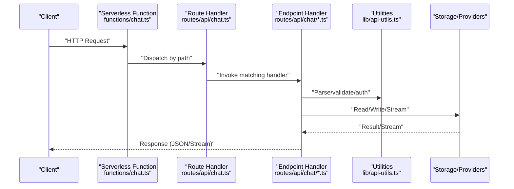
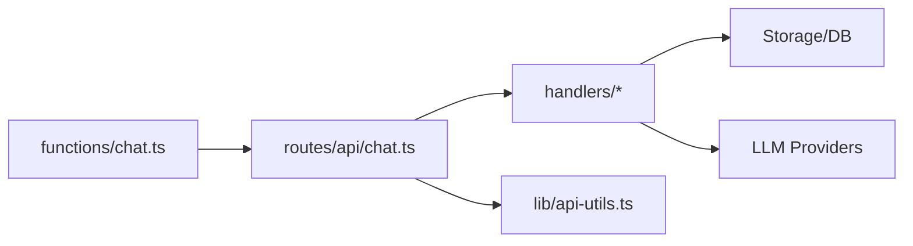

# Chat API Endpoints

<cite>
**Referenced Files in This Document**
- [chat.ts](file://functions/chat.ts)
- [chat.ts](file://apps/web/src/routes/api/chat.ts)
- [abort.ts](file://apps/web/src/routes/api/chat/abort.ts)
- [account.ts](file://apps/web/src/routes/api/chat/account.ts)
- [commands.ts](file://apps/web/src/routes/api/chat/commands.ts)
- [models.discover.ts](file://apps/web/src/routes/api/chat/models.discover.ts)
- [models.ts](file://apps/web/src/routes/api/chat/models.ts)
- [new.ts](file://apps/web/src/routes/api/chat/new.ts)
- [provenance.ts](file://apps/web/src/routes/api/chat/provenance.ts)
- [providers.ts](file://apps/web/src/routes/api/chat/providers.ts)
- [question.ts](file://apps/web/src/routes/api/chat/question.ts)
- [resources.ts](file://apps/web/src/routes/api/chat/resources.ts)
- [resume.ts](file://apps/web/src/routes/api/chat/resume.ts)
- [run.ts](file://apps/web/src/routes/api/chat/run.ts)
- [runs.ts](file://apps/web/src/routes/api/chat/runs.ts)
- [session.ts](file://apps/web/src/routes/api/chat/session.ts)
- [sessions.ts](file://apps/web/src/routes/api/chat/sessions.ts)
- [settings.ts](file://apps/web/src/routes/api/chat/settings.ts)
- [api-utils.ts](file://apps/web/src/lib/api-utils.ts)
- [openapi.json](file://apps/web/openapi.json)
</cite>

## Table of Contents

1. [Introduction](#introduction)
2. [Project Structure](#project-structure)
3. [Core Components](#core-components)
4. [Architecture Overview](#architecture-overview)
5. [Detailed Component Analysis](#detailed-component-analysis)
6. [Dependency Analysis](#dependency-analysis)
7. [Performance Considerations](#performance-considerations)
8. [Troubleshooting Guide](#troubleshooting-guide)
9. [Conclusion](#conclusion)
10. [Appendices](#appendices)

## Introduction

This document provides comprehensive API documentation for Fleet Pi’s chat endpoints. It covers HTTP methods, URL patterns, request/response schemas, authentication requirements, and operational details such as rate limiting, input validation, and security considerations. The scope includes message creation, conversation management, session handling, model interactions, and related utilities.

## Project Structure

The chat API is implemented primarily under the web application routes at apps/web/src/routes/api/chat with a serverless entry point at functions/chat.ts. Additional shared utilities are located in apps/web/src/lib/api-utils.ts. An OpenAPI specification is generated and available at apps/web/openapi.json.

```mermaid
graph TB
subgraph "Serverless Entry"
F["functions/chat.ts"]
end
subgraph "Chat API Routes"
R1["routes/api/chat.ts"]
R2["routes/api/chat/new.ts"]
R3["routes/api/chat/run.ts"]
R4["routes/api/chat/runs.ts"]
R5["routes/api/chat/session.ts"]
R6["routes/api/chat/sessions.ts"]
R7["routes/api/chat/models.ts"]
R8["routes/api/chat/models.discover.ts"]
R9["routes/api/chat/providers.ts"]
R10["routes/api/chat/question.ts"]
R11["routes/api/chat/abort.ts"]
R12["routes/api/chat/resume.ts"]
R13["routes/api/chat/settings.ts"]
R14["routes/api/chat/account.ts"]
R15["routes/api/chat/commands.ts"]
R16["routes/api/chat/resources.ts"]
R17["routes/api/chat/provenance.ts"]
end
subgraph "Shared Utilities"
U["lib/api-utils.ts"]
end
F --> R1
R1 --> R2
R1 --> R3
R1 --> R4
R1 --> R5
R1 --> R6
R1 --> R7
R1 --> R8
R1 --> R9
R1 --> R10
R1 --> R11
R1 --> R12
R1 --> R13
R1 --> R14
R1 --> R15
R1 --> R16
R1 --> R17
R1 --> U
```

**Diagram sources**

- [chat.ts](file://functions/chat.ts)
- [chat.ts](file://apps/web/src/routes/api/chat.ts)
- [api-utils.ts](file://apps/web/src/lib/api-utils.ts)

**Section sources**

- [chat.ts](file://functions/chat.ts)
- [chat.ts](file://apps/web/src/routes/api/chat.ts)
- [api-utils.ts](file://apps/web/src/lib/api-utils.ts)

## Core Components

- Serverless router: functions/chat.ts acts as the single entrypoint that dispatches requests to route handlers.
- Route handlers: Each file under apps/web/src/routes/api/chat handles a specific endpoint or resource group (e.g., sessions, runs, models).
- Shared utilities: apps/web/src/lib/api-utils.ts provides common helpers for request parsing, response formatting, error handling, and possibly auth context.

Key responsibilities:

- Parse and validate incoming requests.
- Enforce authentication and authorization.
- Interact with storage and external services (LLM providers, databases).
- Stream responses where applicable (e.g., chat runs).
- Return standardized error responses.

**Section sources**

- [chat.ts](file://functions/chat.ts)
- [chat.ts](file://apps/web/src/routes/api/chat.ts)
- [api-utils.ts](file://apps/web/src/lib/api-utils.ts)

## Architecture Overview

The chat API follows a modular route-per-resource pattern. Requests enter via the serverless function, which delegates to the appropriate handler based on the path. Handlers coordinate with shared utilities and downstream services to perform operations like creating messages, managing sessions, listing runs, and interacting with LLM providers.

**Diagram sources**

- [chat.ts](file://functions/chat.ts)
- [chat.ts](file://apps/web/src/routes/api/chat.ts)
- [api-utils.ts](file://apps/web/src/lib/api-utils.ts)

## Detailed Component Analysis

### Authentication and Authorization

- Authentication is enforced per endpoint using shared utilities and route-level guards.
- Typical flow: extract credentials from headers, verify identity, attach user context to the request, and enforce ownership/permissions for resources like sessions and runs.
- Unauthorized or forbidden responses follow standard HTTP status codes.

Security considerations:

- Validate all inputs strictly.
- Reject malformed or excessively large payloads.
- Use least-privilege access when calling downstream services.
- Avoid logging sensitive data.

**Section sources**

- [api-utils.ts](file://apps/web/src/lib/api-utils.ts)
- [chat.ts](file://apps/web/src/routes/api/chat.ts)

### Sessions Management

Endpoints:

- List sessions: GET /api/chat/sessions
- Get session: GET /api/chat/session/:id
- Create session: POST /api/chat/new
- Resume session: POST /api/chat/resume

Responsibilities:

- Create new conversations tied to a user/workspace.
- Retrieve metadata and state for a session.
- Resume an existing session to continue prior context.

Request/Response schema highlights:

- Create/Resume: body includes session identifiers, optional initial prompt, and configuration flags.
- Response includes session id, owner, timestamps, and current state summary.

Error handling:

- 400 for invalid payloads.
- 404 if session not found.
- 401/403 for unauthorized access.

Rate limiting:

- Apply per-user limits for create/resume operations to prevent abuse.

Validation:

- Ensure required fields are present and within allowed lengths.
- Sanitize strings and reject disallowed characters.

**Section sources**

- [sessions.ts](file://apps/web/src/routes/api/chat/sessions.ts)
- [session.ts](file://apps/web/src/routes/api/chat/session.ts)
- [new.ts](file://apps/web/src/routes/api/chat/new.ts)
- [resume.ts](file://apps/web/src/routes/api/chat/resume.ts)

### Runs and Messages

Endpoints:

- Start run: POST /api/chat/run
- List runs: GET /api/chat/runs
- Abort run: POST /api/chat/abort
- Question endpoint: POST /api/chat/question

Responsibilities:

- Start a streaming run against selected model/provider.
- Provide non-streaming question processing for quick answers.
- Manage lifecycle of runs including abort.

Request/Response schema highlights:

- Start run: body includes session id, model/provider selection, parameters, and message content.
- Streaming response uses server-sent events or chunked transfer encoding.
- Question returns a concise answer payload.

Error handling:

- 400 for invalid parameters.
- 409 conflict if run already aborted/completed.
- 429 for rate limit exceeded.
- 5xx for provider errors.

Rate limiting:

- Per-user and per-model throttling for long-running streams.

Validation:

- Strict parameter checks for model IDs, temperature, max tokens, etc.
- Input size caps to prevent DoS.

**Section sources**

- [run.ts](file://apps/web/src/routes/api/chat/run.ts)
- [runs.ts](file://apps/web/src/routes/api/chat/runs.ts)
- [abort.ts](file://apps/web/src/routes/api/chat/abort.ts)
- [question.ts](file://apps/web/src/routes/api/chat/question.ts)

### Models and Providers

Endpoints:

- List models: GET /api/chat/models
- Discover models: GET /api/chat/models/discover
- Providers: GET /api/chat/providers

Responsibilities:

- Enumerate available models and their capabilities.
- Auto-discover models from configured providers.
- Return provider metadata for client-side selection.

Request/Response schema highlights:

- Models list includes id, name, capabilities, and pricing hints.
- Discover may return additional dynamic attributes.
- Providers include connection status and supported features.

Error handling:

- 502/503 when provider discovery fails.
- 401/403 for missing provider credentials.

Rate limiting:

- Cache results and throttle frequent discovery calls.

Validation:

- Filter models by permissions and availability.

**Section sources**

- [models.ts](file://apps/web/src/routes/api/chat/models.ts)
- [models.discover.ts](file://apps/web/src/routes/api/chat/models.discover.ts)
- [providers.ts](file://apps/web/src/routes/api/chat/providers.ts)

### Settings, Account, Commands, Resources, Provenance

Endpoints:

- Settings: GET/POST /api/chat/settings
- Account: GET /api/chat/account
- Commands: GET/POST /api/chat/commands
- Resources: GET /api/chat/resources
- Provenance: GET /api/chat/provenance

Responsibilities:

- Manage user-specific settings and preferences.
- Retrieve account information and roles.
- Expose available commands and their schemas.
- List accessible resources for agents/tools.
- Provide provenance metadata for outputs.

Request/Response schema highlights:

- Settings: key-value pairs with type constraints.
- Account: user id, roles, workspace membership.
- Commands: name, description, parameters, examples.
- Resources: identifiers, types, access scopes.
- Provenance: source references, generation ids, timestamps.

Error handling:

- 400 for invalid setting values.
- 404 for missing resources or commands.
- 401/403 for insufficient permissions.

Rate limiting:

- Light throttling for read-heavy endpoints.

Validation:

- Schema validation for settings and command parameters.

**Section sources**

- [settings.ts](file://apps/web/src/routes/api/chat/settings.ts)
- [account.ts](file://apps/web/src/routes/api/chat/account.ts)
- [commands.ts](file://apps/web/src/routes/api/chat/commands.ts)
- [resources.ts](file://apps/web/src/routes/api/chat/resources.ts)
- [provenance.ts](file://apps/web/src/routes/api/chat/provenance.ts)

### Root Chat Router

The root chat router aggregates all chat endpoints and applies global middleware such as authentication, CORS, and request logging.

Responsibilities:

- Path-based routing to individual handlers.
- Global error handling and response normalization.
- Centralized rate limiting and metrics collection.

**Section sources**

- [chat.ts](file://apps/web/src/routes/api/chat.ts)

## Dependency Analysis

The chat API depends on shared utilities for consistent behavior across endpoints. The serverless function coordinates routing, while each handler encapsulates domain logic for its resource.

**Diagram sources**

- [chat.ts](file://functions/chat.ts)
- [chat.ts](file://apps/web/src/routes/api/chat.ts)
- [api-utils.ts](file://apps/web/src/lib/api-utils.ts)

**Section sources**

- [chat.ts](file://functions/chat.ts)
- [chat.ts](file://apps/web/src/routes/api/chat.ts)
- [api-utils.ts](file://apps/web/src/lib/api-utils.ts)

## Performance Considerations

- Streaming: Prefer streaming responses for long-running runs to reduce latency and improve UX.
- Caching: Cache model/provider lists and frequently accessed settings to minimize backend calls.
- Pagination: Implement cursor-based pagination for lists like runs and sessions.
- Concurrency: Limit concurrent streams per user to protect resources.
- Backpressure: Handle backpressure in streaming to avoid memory spikes.

[No sources needed since this section provides general guidance]

## Troubleshooting Guide

Common issues and resolutions:

- Authentication failures: Verify headers and token validity; check middleware logs.
- Rate limiting: Inspect retry-after headers and adjust client retry strategy.
- Provider errors: Check provider connectivity and credentials; log detailed error contexts.
- Validation errors: Review request payloads against schema definitions; ensure required fields are present.

Operational tips:

- Enable structured logging with correlation ids.
- Monitor error rates and latency percentiles.
- Use health checks to detect degraded dependencies.

**Section sources**

- [api-utils.ts](file://apps/web/src/lib/api-utils.ts)
- [chat.ts](file://apps/web/src/routes/api/chat.ts)

## Conclusion

Fleet Pi’s chat API provides a robust set of endpoints for building conversational experiences with strong security, validation, and performance practices. By following the specifications herein, clients can reliably create messages, manage sessions, interact with models, and handle streaming responses. For precise request/response schemas and live examples, consult the generated OpenAPI spec.

[No sources needed since this section summarizes without analyzing specific files]

## Appendices

### OpenAPI Specification

The authoritative API contract is available at apps/web/openapi.json. Use it to generate clients, validate payloads, and explore endpoint details.

**Section sources**

- [openapi.json](file://apps/web/openapi.json)

### Example API Calls

Below are representative examples illustrating typical usage patterns. Replace placeholders with actual values and adhere to the schemas defined in the OpenAPI spec.

- Create a new session
  - Method: POST
  - Path: /api/chat/new
  - Headers: Authorization: Bearer <token>
  - Body: { "workspaceId": "<workspace>", "initialPrompt": "<prompt>" }
  - Success: 201 Created with session object
  - Errors: 400 Bad Request, 401 Unauthorized, 403 Forbidden

- Start a streaming run
  - Method: POST
  - Path: /api/chat/run
  - Headers: Authorization: Bearer <token>, Content-Type: application/json
  - Body: { "sessionId": "<id>", "model": "<model>", "messages": [...] }
  - Success: 200 OK with stream chunks
  - Errors: 400, 401, 403, 409 Conflict, 429 Too Many Requests, 5xx

- List runs
  - Method: GET
  - Path: /api/chat/runs?sessionId=<id>&limit=20&cursor=<cursor>
  - Headers: Authorization: Bearer <token>
  - Success: 200 OK with paginated list
  - Errors: 400, 401, 403

- Abort a run
  - Method: POST
  - Path: /api/chat/abort
  - Headers: Authorization: Bearer <token>
  - Body: { "runId": "<id>" }
  - Success: 200 OK with confirmation
  - Errors: 400, 401, 403, 404 Not Found

- Discover models
  - Method: GET
  - Path: /api/chat/models/discover
  - Headers: Authorization: Bearer <token>
  - Success: 200 OK with model catalog
  - Errors: 401, 403, 502/503

- Get account info
  - Method: GET
  - Path: /api/chat/account
  - Headers: Authorization: Bearer <token>
  - Success: 200 OK with account details
  - Errors: 401, 403

- Update settings
  - Method: POST
  - Path: /api/chat/settings
  - Headers: Authorization: Bearer <token>, Content-Type: application/json
  - Body: { "key": "<setting>", "value": "<value>" }
  - Success: 200 OK with updated settings
  - Errors: 400, 401, 403

**Section sources**

- [openapi.json](file://apps/web/openapi.json)
- [new.ts](file://apps/web/src/routes/api/chat/new.ts)
- [run.ts](file://apps/web/src/routes/api/chat/run.ts)
- [runs.ts](file://apps/web/src/routes/api/chat/runs.ts)
- [abort.ts](file://apps/web/src/routes/api/chat/abort.ts)
- [models.discover.ts](file://apps/web/src/routes/api/chat/models.discover.ts)
- [account.ts](file://apps/web/src/routes/api/chat/account.ts)
- [settings.ts](file://apps/web/src/routes/api/chat/settings.ts)
